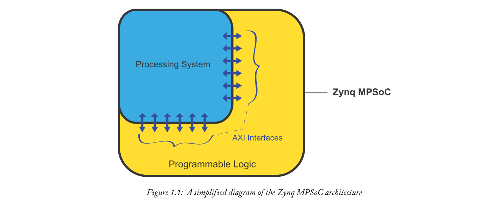
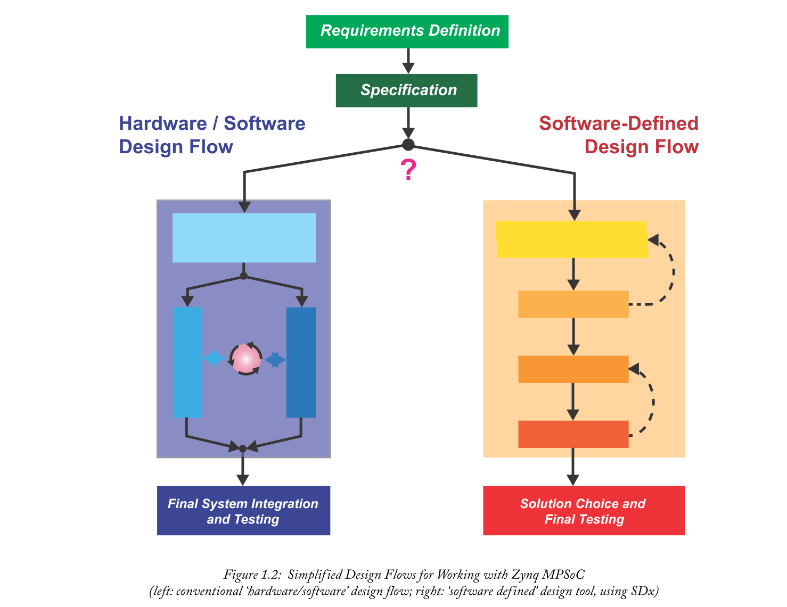

# Chapter 1 Introduction
欢迎来到这本书！接下来的页面将全面介绍Zynq MPSoC器件，这是一种来自Xilinx的集成片上系统（SoC）器件，后续产品的前身是Zynq-7000 [7]。

Zynq MPSoC在本书的其余部分将是众所周知的，它是一种多处理器片上系统（MPSoC）[5]。术语MPSoC反映出它包含许多不同的处理元素，每个元素都针对特定目的进行了优化 - 例如，一组应用处理器，实时处理器和图形处理器，以及现场可编程门阵列（FPGA）可编程 逻辑。该设备的组成将在后面的章节中详细介绍，但目前我们可以简单地将Zynq MPSoC视为为工作提供各种最佳资源！

除了Zynq MPSoC架构外，设计方法和软件工具也非常重要。适当的设计方法可以利用Zynq MPSoC的设施来解决实际的设计问题。与以前的器件相比，通过扩展的处理元件集，设计人员能够利用Zynq MPSoC的功能，同时在系统性能，可靠性，成本，功耗，安全性，时间等方面实现预期结果，这一点非常重要。市场......以及适用的任何其他限制。因此，本书同样重要的一个方面是概述系统开发的选项，包括设计工具和可以部署在处理核心上的操作系统。我们在Xilinx SDx工具[6]中包含了一个特定功能，该工具可以使用软件代码完全描述系统，然后在可用的各种处理元件之间进行分区（在用户指导下）。SDx中的SD代表软件定义，并且将在后面的章节中进一步讨论，基于软件的设计正在成为可编程设备的一种日益强大的设计方法。

Zynq MPSoC器件的应用种类繁多，我们可以根据Zynq-7000的先前经验以及Zynq MPSoC提供的扩展设备预测一些突出的应用领域。其中包括高级驾驶员辅助系统（ADAS），计算机视觉，“大数据”分析，软件无线电（SDR），高价值监控和自动化（工业物联网，IIoT）。

## 1.1  Why Should I be Interested?
半导体器件市场传统上包括许多扇区，包括逻辑（固定和可编程），存储器，微处理器，光学，模拟，分立元件，微控制器，传感器系统和专用数字信号处理器（DSP）[4]。总的来说，2017年全球半导体市场价值达到4122亿美元（有史以来最高水平），与去年相比增长了20％以上[3]。半导体设备可实现从儿童玩具到笔记本电脑，再到核能发电控制系统......再到国际空间站。简而言之，我们离不开它们！

近年来，系统集成已成为一个受关注的领域。简单来说，为什么要制作系统所需的各种组件，然后将它们连接在一起？当然，设计将所需资源整合到单个芯片中的设备会更好吗？因此我们得出了片上系统（SoC）的概念。

参考上面提到的半导体类别，请注意Zynq和Zynq MPSoC等SoC包括可编程逻辑，微处理器和存储器 - 嵌入式系统中通常需要的主要组件。事实上，这些设备还包含一些模拟电路，以及支持数字信号处理（DSP）应用的算术引擎，类似于DSP处理器提供的功能。如图1.1所示，Zynq MPSoC器件的基本组成是处理系统（PS），与FPGA可编程逻辑（PL）相结合。这两个部分通过许多高级可扩展接口（AXI）接口连接。这种高级结构与Zynq-7000芯片非常相似。

与Zynq相比，主要区别在于Zynq MPSoC通过扩展PS中的处理器选择和数量，扩展FPGA PL部分的大小，以及增加PS和PL之间AXI连接的数量和带宽，使集成更进一步。如果我们看得更深一点，还有许多其他增强功能（稍后会详细介绍）。

SoC的需求部分是由于在快速发展的应用领域实现快速上市的驱动。其他因素包括在系统中集成组件所需的工程工作量减少，物理尺寸最小化以及功耗降低。在另一方面，由于软件设计工具和方法的发展，这些相对复杂的SoC器件必须易于设计系统，并且实际上易于使用不断改进。Xilinx及其合作伙伴支持各种设计输入方法和语言，并继续引入新功能以实现快速开发，包括快速评估不同实现选项的设施。

如果您是目前使用FPGA等可编程逻辑器件或基于处理器的嵌入式系统的工程师，那么SoC的发展很可能很快就会与您相关。值得在您的技能组合中添加SoC设计，或者至少阅读本书的其余部分并了解更多信息！

如果你是一名学生，那么同样 - 获得SoC技能对你未来的职业生涯非常有用。最后，如果你是一个业余爱好者，那么用SoC创建酷炫系统几乎是无限可能的！介于学术和商业压力，也无疑吸引了学生和专业人士。

## 1.2  The Evolution of Xilinx SoCs — Very Briefly! Xilinx SoC的发展 - 非常简短！
Xilinx传统上是一家可编程逻辑公司，专注于FPGA技术和复杂可编程逻辑器件（CPLD，尽管它们的名称可以被认为是FPGA的不太复杂的版本）。近年来 - 自2011年推出Zynq-7000以来 - 向SoC的转变已经看到了其他构建模块的集成，因此Xilinx现在生产的设备不仅包括可编程逻辑，而且还包括可编程逻辑与处理器，内存相结合，接口等。

自三十多年前Xilinx发明FPGA以来，特别是在最近的时代，人们开始关注创建基于FPGA的灵活嵌入式系统。这是可能的，因为“软”处理器的可用性，可以使用FPGA的通用可编程逻辑（而不是使用专用处理器芯片）来创建。以这种方式实现嵌入式系统仍然有效，并且具有相当大的灵活性，**但在基于处理器的性能方面受到限制**。在某些情况下，应用程序会要求将单独的处理器芯片合并到系统中，并与FPGA进行适当的接口连接。

这导致了2010年初Zynq-7000芯片的开发，该芯片将FPGA的可编程逻辑与专用硅内置的专用“硬”处理器相结合，并在两个部分之间提供快速互连。这种情况下的处理器是双核Arm Cortex-A9（'A'表示应用处理器），这是智能手机中可以找到的相同类型的处理器。与先前采用的“软”处理器方法相比，该器件具有增强处理器功能的优势，这意味着可以在单个芯片上实现完整的系统。

现在，在今天，Zynq MPSoC通过扩展集成到设备中的一组设施，进一步采用了SoC概念。而不是双核应用处理器，现在可以选择双核或四核，处理器类型是Arm Cortex-A53，它是64位（与A9的32位相反）。还有一个基于两个Arm Cortex-R5内核的实时处理系统，一个图形处理单元（GPU），以及视频处理单元（VPU）的选项。添加这些附加类型的基本原理是通过使用针对特定任务优化的处理器可以获得更高的性能。

值得注意的是，新的Zynq-7000S已经推出，只有一个Arm Cortex-A9核心。这意味着SoC变体现在可以选择不同的“尺寸”和价格点，这使它们适用于低复杂度，成本敏感的任务，直至非常复杂的系统。

## 1.3  Design Methods 设计方法
现在我们拥有这些先进的SoC芯片，我们如何用它们创建系统？一个关键问题！

实际上有许多方法可供使用，反映了SoC系统的组成，电子设计自动化（EDA）工具的复杂发展以及所支持的各种应用。Xilinx和第三方软件合作伙伴不断推动SoC系统尽可能快速，简便和可靠地设计。

我们将在第4章中详细讨论设计方法和流程，但与此同时，值得简单概述SoC系统将包括（i）硬件设计，以及（ii）软件设计（软件设计是由于其分层组成，通常被称为“堆叠”。硬件设计映射到SoC设备上可用的物理资源，而软件运行在系统内部署的一个或多个处理器上。

鉴于这些基本差异，通常使用专用工具分别设计硬件和软件系统。这种“硬件和软件”方法如图1.2左侧所示（详细信息现已抽象）。在此设计流程中，硬件和软件开发可以在很大程度上独立进行，然后是集成阶段，而不是依赖于另一个阶段的完成。工程师使用他们选择的工具生成硬件系统的元素，Xilinx Vivado开发环境用于系统集成，并在目标设备上实现。如果愿意，软件开发人员可以使用Xilinx软件开发工具包（SDK）或他们自己选择的开发环境。一种可能的变化是在第三方工具中开发利用Xilinx工具“引擎盖”，但即便如此，同样的高级方法仍然存在。

最近，面向软件的硬件/软件协同设计已经发生了相当大的转变。简而言之，这些工具允许使用软件代码或基于块的设计方法在高抽象级别描述整个系统的功能。然后，在SoC的硬件和软件元素上划分功能，同时考虑可用资源的功能，并在设计者的指导下。这种方法可能要快得多，因为工具可以快速生成不同的排列，具体取决于设计者希望如何优化实现，以及软件和硬件中实现的元素之间的所有接口都是自动处理的。这种“协同设计”方法在图1.2的右侧概述，反映了本章前面提到的Xilinx SDx工具的流程。

我们将在第4章中更详细地讨论设计方法，包括填写图1.2中概述的设计流程的细节。SDx将成为本书D部分深入研究的主题。

## 1.4  How to Use this Book
本书旨在介绍Zynq MPSoC器件以及相关的设计方法，工具和应用。希望（！）您会发现它非常易读且易于访问。然而，本书无法成为所有问题的答案 - 请记住，Xilinx发布的1000页技术文献支持该设备，这是查找详细信息的地方！

我们尽可能地尝试解决技术问题而不假设过多的先验知识，尽管Zynq MPSoC不可避免地是一个先进的集成系统，但是有一些主题对于拥有一些现有背景是有益的。适当时会突出显示有用的辅助材料。

### 1.4.1  Organisation of the Book
本书分为五个部分，如下所述。每个部分由不同主题的若干章节组成，这些章节共同代表书中的主题。
- **A部分：了解Zynq MPSoC**——本书的这一部分介绍了该器件，其架构概述，以及设计方法和候选应用领域的综述。A部分的抽象级别略高于本书的其他部分，可能特别适合技术经理和其他想要了解Zynq MPSoC的人员，而不必深入研究细节！
- **B部分：详细的Zynq MPSoC架构**——B部分扩展了A部分的架构概述，其中包含一系列专用章节，涵盖了器件架构的不同方面。其中包括有关应用程序和实时处理系统的章节，以及security，safety和电源管理的设施。
- **C部分：Zynq MPSoC系统开发**——在C部分，重点是在Zynq MPSoC上开发系统设计的方法和工具。这里我们介绍硬件系统开发，以及软件堆栈和常见配置的概念。更多章节侧重于多处理器开发和系统启动。
- **D部分：采用Xilinx SDx开发环境的系统设计**——本书的第四部分深入介绍了基于Xilinx SDx开发环境的软件定义设计流程。
- **E部分：An Outward Look** - 本书的最后一小部分涉及更广泛的视图，包括SoC'生态系统'，它代表了IP，设计工具，硬件开发板和其他可用资源的可用资源。Zynq MPSoC系统的设计。我们还根据之前发布的针对Zynq-7000 SoC的工作，考虑了一些学术案例研究。

### 1.4.2  Further Sources of Information
在每章的最后，您将找到可能对进一步阅读有用的参考列表，并且为方便起见提供了Web链接（当然注意这些可能会发生变化！）。这些来自各种来源，包括许多参考手册，教程和Xilinx在线发布的其他技术文献，这些是特别有价值和权威的信息来源。它们提供了支持设计项目所需的深入技术细节。您可以通过此URL访问Xilinx支持门户，从中可以获取文档和其他有用资源：https://www.xilinx.com/support.html

另请注意，特别重要的Web链接有时会在章节的主要流程中突出显示（如上所述！），而不是通过章节末尾的引用。

值得一提的是，本书遵循我们之前的标题，即The Zynq Book，该书涉及之前发布的Xilinx SoC器件Zynq-7000 SoC。您可能会发现参考Zynq Book以获取一般背景，介绍性示例以及某些主题的扩展信息非常有用;例如，在Zynq Book中广泛讨论了Vivado HLS（高级综合）设计工具，而我们在本书中不再重复这些材料。相反，本书采用Xilinx的最新设计工具SDx，该工具使用基于软件的设计输入方法实现硬件/软件协同设计。顺便提一下，SDx利用了Vivado HLS的功能。

要获得该书的电子版，请访问：http://www.zynqbook.com/ 您可以在那里注册和下载免费的PDF副本。

### 1.4.3  Suggestions for Beginners
如果你认为自己是SoC设计的初学者，那么值得掌握The Zynq Book（在上一节中提到），其中包括一些关于SoC原理和其他相关背景的介绍性材料（从“What is an SOC”开始）。特别是考虑到Zynq Book可以免费下载，我们在这里不再重复相同的材料。

尽管Zynq MPSoC系统可以使用各种操作系统进行开发，但预计大多数设计都将采用Linux，因此使用Linux进行嵌入式系统开发是一个需要注意的重要主题。提供嵌入式Linux的综合处理超出了本书的范围，但幸运的是已经有一些非常好的书籍，如[1]。

如果您想加强您在计算机体系结构和操作原理方面的背景知识，那么[2]也是一本有用的书籍。

## 1.5  What Next?
接下来，我们转到*A部分——了解Zynq MPSoC*。本节进一步介绍了MPSoC，包括设备架构的概述，以及创建MPSoC系统所需的设计过程和工具，并最后讨论了候选应用领域。

## 1.6  References
注意：所有在线资源最后访问时间为2019年3月。

- [1] Christopher Hallinan, Embedded Linux Primer: A Practical Real-World Approach, 2nd edition, Prentice Hall, 2011. 
- [2] David A. Patterson and John L. Hennessy, Computer Organization and Design: The Hardware Software Interface, ARM Edition, Morgan Kaufman, April 2016.
- [3] Semiconductor  Industry  Association,  “Annual  Semiconductor  Sales  Increase  21.6%, Top  $400  Billion  for  First Time”  press release, 5th February 2018. 
  > Available:https://www.semiconductors.org/news/2018/02/05/global_sales_report_2017/annual_semiconductor_sales_increase_21.6_percent_top_400_billion_for_first_time/
- [4] Semiconductor Industry Association, The U.S. Semiconductor Industry: 2017 Factbook, 
  > Available:http://go.semiconductors.org/2017-sia-factbook-0-0-0
- [5] Xilinx, Inc., “Heterogeneous MPSoC” product page.
  > Available:https://www.xilinx.com/products/silicon-devices/soc/zynq-ultrascale-mpsoc.html
- [6] Xilinx, Inc., “SDSoC Development Environment” product page.
  > Available:https://www.xilinx.com/products/design-tools/software-zone/sdsoc.html
- [7] Xilinx, Inc., “Zynq-7000 All Programmable SoC” product page.
  > Available:https://www.xilinx.com/products/silicon-devices/soc/zynq-7000.html