# Chapter 2 FPGAs, Zynq, and Zynq MPSoC!

Zynq MPSoC是Zynq-7000片上系统（SoC）的演变——或简称为“Zynq”——Xilinx发布的第一款SoC。这两种设备都包括处理系统（PS）和可编程逻辑（PL），PL等同于现场可编程门阵列（FPGA）的PL。如图2.1所示，它在高级别比较了三种器件类型，Zynq MPSoC中的PS比Zynq中的PS更大，更复杂。

在本章中，将回顾这三种设备类型的特征，并突出它们之间的异同。我们还提出了潜在进化的一些原因。

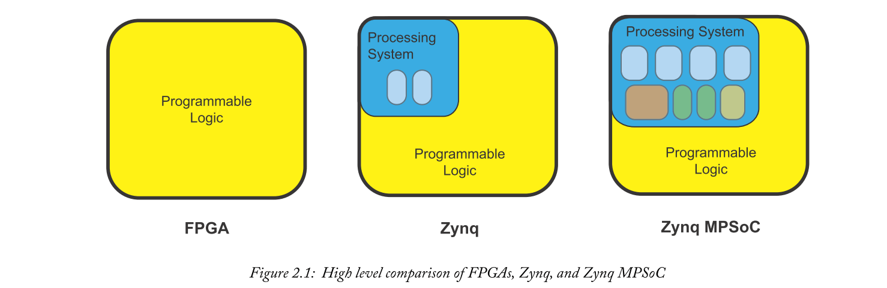

## 2.1  Technology Timeline
在继续之前，重要的是要提到Zynq，Zynq MPSoC和FPGA都是当前的技术并相互补充。“最佳”选择取决于所创建设计的性质。所有这三种设备类都有各自独特的功能平衡，这使得每种设备都特别适合各种不同的任务和应用。

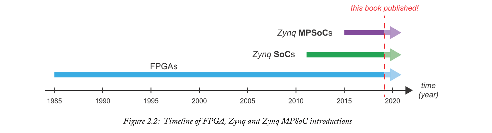

本书的许多读者可能都熟悉Zynq，因此我们开始在那里进行审查，这样就可以与更新的Zynq MPSoC器件进行比较。

两个SoC的PL部分所基于的FPGA将在本章后面介绍。

## 2.2  The Zynq-7000 SoC
Zynq-7000 SoC是Xilinx发布的第一款SoC器件，它将基于FPGA的PL与基于Arm的PS相结合。在本节中，我们将简要回顾Zynq的架构和功能;读者可以阅读我们之前的书籍以获取更多详细信息[3]。

### 2.2.1  Zynq Architecture and Features
为了提供架构的高级概述，Zynq架构有两个部分：PS和PL，它们之间有一组互连，如图2.3所示。这些互连基于高级可扩展接口（AXI）标准，即Arm [1]开发的片上通信标准。

将处理系统与PL耦合的基本原理是为运行嵌入式系统的软件组件，特别是操作系统和软件应用程序提供专用的优化资源，同时保留FPGA逻辑的所有优点（特别是它具有出色的并行性和可重配置性。）AXI接口构成了两个部分之间的连接。AXI是针对SoC应用进行优化的标准。

图2.3中PS和PL的相对尺寸未按比例绘制;实际上，Zynq系列中有几种器件，每种器件都具有相同的PS架构和不同尺寸的PL。

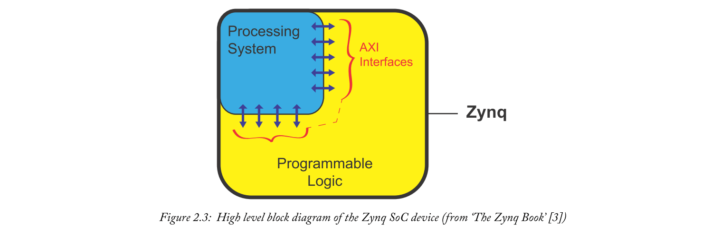

稍后将更详细地说明，Zynq架构和Zynq MPSoC之间的差异扩展到器件架构的两个部分：PS和PL。

#### Zynq Processing System
Zynq PS，如图2.3中蓝色部分所示，包含一个应用级处理器以及其他组件。这些概述如下（详见[3]）。
- **应用处理器单元（APU）** ——该单元包括一个双核Arm Cortex-A9处理器，以及256KB的片上高速缓存。
- **互连和存储器接口**——分别实现PS和PL之间以及外部存储器之间的通信。
- **I / O外设**——一组集成外设接口，涵盖USB，UART，SPI，I2C等通用标准。

Zynq中的PS具有两个处理核心，使设计人员可以选择将两个核心用于同一操作系统，或者在每个核心上使用不同的操作系统。稍后，我们将比较Zynq PS和Zynq MPSoC架构的PS，并注意新器件中功能的扩展——特别是Zynq MPSoC最多有六个处理内核！

最近，Zynq的“轻量级”版本--Zynq-7000S  - 发布，采用单Arm Cortex-A9处理器[23]。

#### Zynq Programmable Logic
Zynq的PL部分基于Artix-7 FPGA架构（适用于该系列中的较小器件）或Kintex-7 FPGA架构（适用于较大的器件）。这两个版本代表Xilinx的7系列FPGA的成员，其中还包括更高性能的Virtex-7。

与等效FPGA一样，Zynq PL包括DSP48x Slice（高速算术资源），Block RAM，高速收发器，集成通信模块以及通用逻辑。本章后面的2.4.3节提供了有关现代FPGA各种元素的更多信息。

#### Interfaces Between the PS and PL
Zynq的两个区域之间有九个接口。**四个互连被指定为“通用”，四个被称为“高性能”，剩余的互连是“加速器一致性端口”（ACP）**，它提供应用处理单元（（APU，位于PS中）和PL之间的直接路由。

### 2.2.2  Zynq Devices
为了简要比较Zynq-7000系列中的器件，请考虑表2.1，其中总结了每个芯片的主要特性和参数（请注意，单核Zynq-7000S系列未包含在表中，但具体等效细节可以在[23]中找到。

PS在所有Zynq-7000芯片中都是相同的，唯一的区别是支持的最大时钟频率。PL在整个范围内类似，低端设备采用基于Artix-7的逻辑，其余采用Kintex-7的逻辑。PL片段和DSP片，Block RAM存储器和输入/输出资源等专业资源的数量和数量也各不相同。

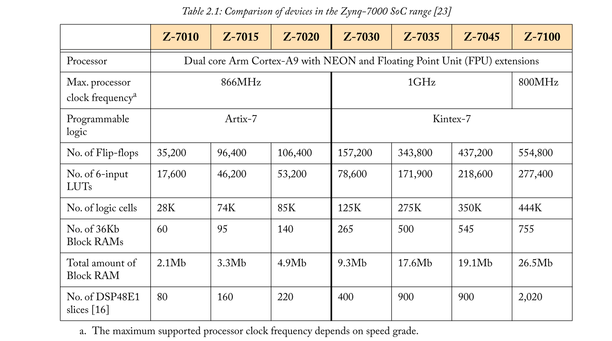

### 2.2.3  Zynq Use Models
设计人员可能会采用之前使用过FPGA的Zynq，或使用过处理器，或两者兼而有之。在推出时，Zynq的卖点是提供一种解决方案，用于在单个设备上实现基于处理器的任务，如运行软件和操作系统，以及基于FPGA的处理，在两个组件之间具有高端性能和高容量互连。

如果之前只使用了FPGA，那么添加专用硬处理器可以提高性能（与通用PL资源构建的“软”处理器相比）; 而另一方面，如果先前处理器被孤立使用，则FPGA逻辑的存在使得某些任务能够在硬件中实现，从而提供加速并释放处理器以用于其他任务。以前需要专用处理器和FPGA的系统可以从两个物理设备减少到一个，从而节省了接口工作量，功耗，物料清单成本等。

这些考虑因素在[3]中进一步讨论，特别是针对Zynq-7000。但是，我们发现类似的因素促使Zynq MPSoC的使用。如下文所述，Zynq MPSoC提供了处理元件的进一步集成，扩展了Zynq的PS部分，包括实时处理引擎，图形处理器和视频编解码器（在选定的设备上），以及功能更强大的应用程序处理器。

## 2.3  The Xilinx Zynq MPSoC
与Zynq相比，Zynq MPSoC代表了架构的延伸和扩展。虽然PS由相同的高级元件（PS和PL，使用AXI互连接口）组成，但PS更复杂，PL从Xilinx的7系列更新到UltraScale + FPGA架构。在大多数Zynq MPSoC系列中，PL的尺寸也大于Zynq系列器件。

### 2.3.1  The Release of Zynq MPSoC
Zynq MPSoC于2015年首次发布，即Zynq首次发布四年后。在此期间，Zynq已经在各种应用领域得到广泛采用，通过这种方式，对完全集成的“FPGA +处理器”解决方案的需求已经得到了很好的建立。

Zynq MPSoC提供增强型PS以及更大的PL（可提供多种不同尺寸）。Zynq MPSoC系列中已建立子系列，以满足不同类型的应用及其要求，特别是在PS资源方面。这些子系列的特征是两个名称：CG，EG和EV，其中两个字符的含义如表2.2所列。

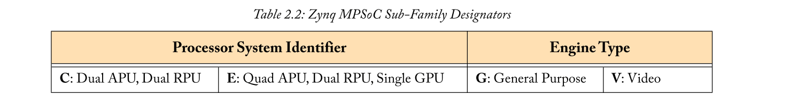

Zynq MPSoC不能取代Zynq，而是提供类似形式的扩展和增强解决方案。Zynq器件将继续成为低成本和低复杂系统的合适选择。

### 2.3.2  Zynq MPSoC Architecture and Features
与Zynq相比，Zynq MPSoC包含一组扩展的资源，有三种变化（即 CG，EG和EV子系列）。表2.4概述了PS和PL的主要特征。当我们详细了解架构时，将在后面的章节中详细介绍有关这些功能的更多细节。

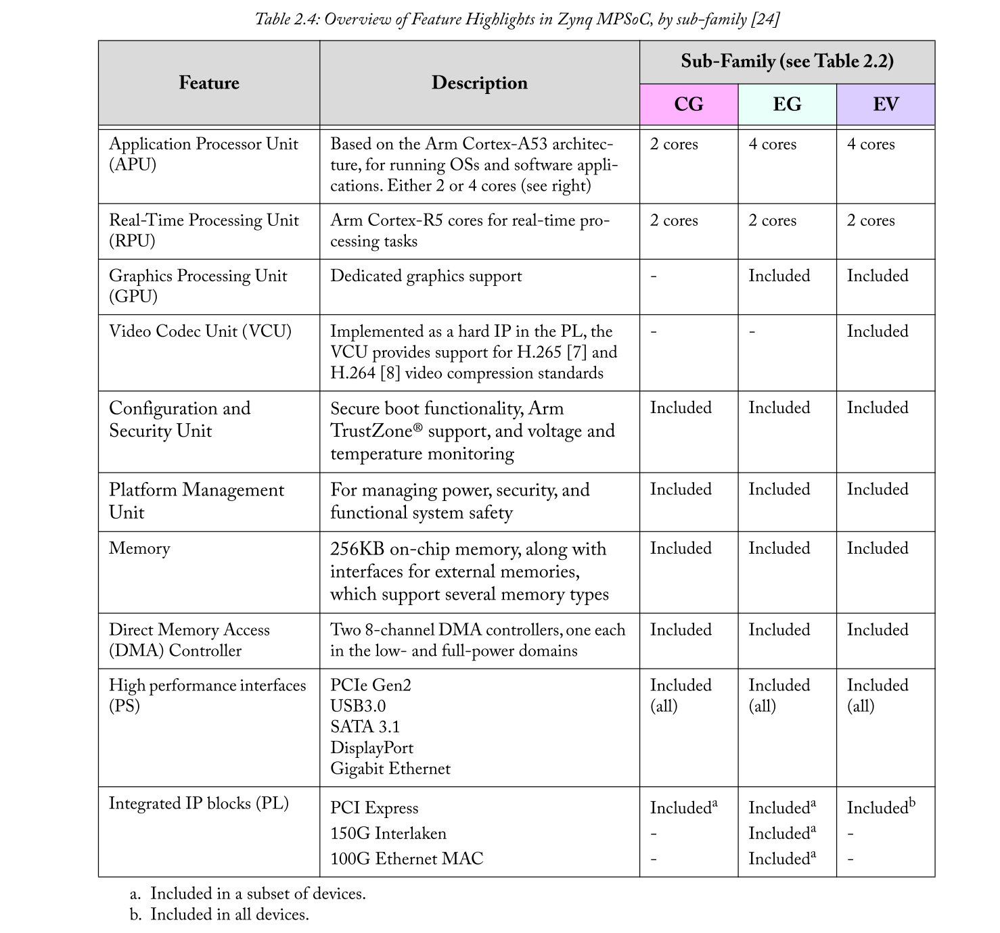

Zynq MPSoC架构的另一个重要发展是其电源管理功能。设备被划分为四个独立的电源域，可以单独操作。这意味着可以在不需要时关闭设备的未使用部分，从而提高整体电源效率。安全功能也得到了增强。

此外，应该强调的是，Zynq MPSoC受益于UltraScale + FPGA架构（将在2.4.3节中进行讨论），其中包括对用于Zynq的7系列架构的某些改进。两个特别值得注意的差异化特征是包含UltraRAM，以及DSP slice到DSP48E2的进一步开发（DSP48E1包含在Zynq中）。

存在具有若干不同尺寸的PL的设备，一些设备跨所有CG，EG和EV子系列提供。表2.3中突出显示了最小和最大的设备。与第15页的表2.1相比，请注意Zynq MPSoC系列包括具有比Zynq系列大得多的PL区域的设备。这使得Zynq MPSoC成为需要大量使用PL时的更好选择，例如，作为嵌入式系统设计的一部分，对一组复杂算法的硬件加速。

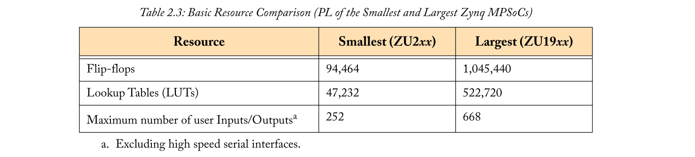

各种Zynq MPSoC芯片还包含不同数量的其他PL资源类型（DSP48x Slice，Block RAM等）——请参阅详细的产品表以获取完整信息[24]。

## 2.4  FPGAs
在本章介绍的三种器件类型中，FPGA是Zynq和Zynq MPSoC器件PL建立时间最长的基础。因此，我们将通过对FPGA开发的简要回顾，随后是关于应用的一些注释，然后回顾当前FPGA技术的架构和属性来开始我们的审查。

### 2.4.1  What is an FPGA?
对于刚接触该领域的读者，提供FPGA的简要介绍可能会有所帮助。FPGA代表现场可编程门阵列。首字母缩略词的“门阵列”部分反映了FPGA器件最初由逻辑门阵列组成（事实上，术语“门阵列”不再是严格正确的 - 现代FPGA不仅仅由简单的门组成，而是由它们组成一系列可重新配置的电路元件）。稍后我们将更详细地讨论该体系结构。“现场可编程”反映了FPGA在制造（“现场”）后可由系统开发人员和最终用户进行编程，实际上可以根据需要对其进行重新编程以实现新的硬件功能。

Xilinx等FPGA供应商不仅提供物理设备，还提供用于开发FPGA设计的开发工具，并最终对其进行编程。为了提高工作效率，还有预先验证的内核（称为知识产权（IP），参考设计，文档等）。在某些情况下，支持还扩展到第三方软件公司和设计公司.Zynq和ZynqMPSoC器件共享和扩展用于FPGA设计的工具和资源套件。

### 2.4.2  The Development of FPGAs
自早期以来，FPGA架构已经以多种方式发展，当时FPGA只包含64个触发器和3个输入查找表（LUT，用于实现逻辑功能）。器件的尺寸已经增大，包括更多的逻辑元件，并且这些逻辑元件的架构已经发展。FPGA能够以更高的频率工作，并且功耗更低。此外，还包含了许多专业资源，包括高速存储器，以及对算术，时钟和连接的支持[15]。

现在只考虑规模，请考虑图2.4。该图总结了FPGA在“逻辑单元”方面的扩展，它是逻辑密度的度量，从低级元素略微抽象出来，以考虑架构之间的差异。在过去的十五年中，以五年为间隔给出了最现代设备的快照，并将这些设备与第一个FPGA（1985年）进行了比较。很明显，10年前的那些与今天的FPGA比相形见绌，更不用说最早的设备了！另请注意，第一个FPGA（XC2064）由图2.4左侧的小点表示。特别是近年来，可以选择优质，中档和低端设备，图中分别用红色，绿色和蓝色框表示。

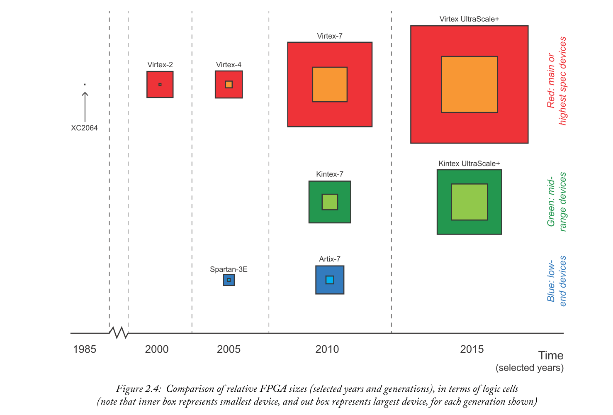

表2.5列出了XC2064与当今最大的可用器件（逻辑单元）Virtex UltraScale + VU13P器件之间的数值比较。此比较不包括在此期间引入到体系结构中的一些更高级的功能。

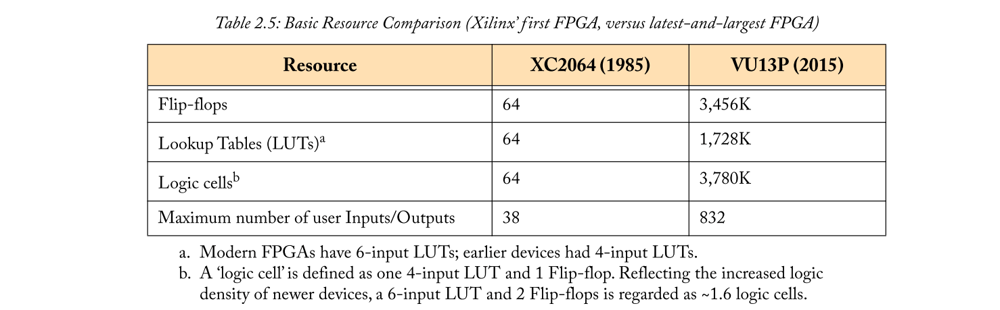

Xilinx FPGA的基本架构仍然是简单数字逻辑元件的二维阵列，分为CLB。每个CLB包含少量触发器和查找表（LUT），其中LUT能够实现布尔逻辑功能，以及小存储器和移位寄存器。CLB的精确构成随着时间的推移而发展，现代技术中的一个CLB代表了比旧设备更大的逻辑。保留原始术语，CLB仍然与可编程互连和交换矩阵连接在一起，尽管也已对这种连接基础设施进行了改进。您可以在图2.5的底部看到CLB，开关矩阵和可编程互连的阵列结构的指示。

FPGA架构不断发展，以响应应用需求。**较大的内存块（'Block RAM'，以及最近的'Ultra RAM'）**提供密集的高速内存功能 - 例如，允许将大量视频数据存储在设备上。2000年左右引入了专用乘法器，后来这些乘法器演变为能够乘法，加法/减法和其他逻辑函数的集成算术块（DSP48x片）。自2004年推出以来，DSP48x Slices有了自身发展，x后缀表示存在多种变化。

支持**以“硬化”IP块形式的高速接口**（即在器件上以硅片物理实现的功能块）被集成到选定的FPGA中，以及高速串行接口模块。随着FPGA技术在通信基础设施，数据中心以及高性能和云计算中的广泛应用，这些资源非常有价值。

正如表2.6所强调的那样，除了更大的尺寸外，最新的FPGA还包括重要的专业资源和功能。

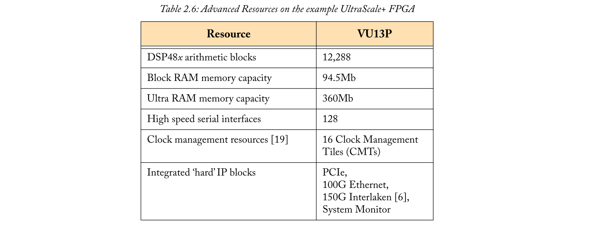

在下一节中，我们将更详细地讨论UltraScale + FPGA的架构。

### 2.4.3  The Modern FPGA Architecture: UltraScale+
现代FPGA本质上是一个二维元素阵列，从这个意义上说它们与早期的设备类似。然而，阵列的组成在资源方面更丰富;当然，如前所述，设备更大。

图2.5是UltraScale + FPGA的象征性资源布局。在高抽象级别，FPGA器件布局包括包含不同类型资源的垂直区域。该器件的大部分被分配通用逻辑，即CLB，主要由LUT和触发器组成。Block RAM和Ultra RAM存储器模块以及DSP48x算术Slices在器件上以单列或双列排列，形成薄的垂直“条纹”。

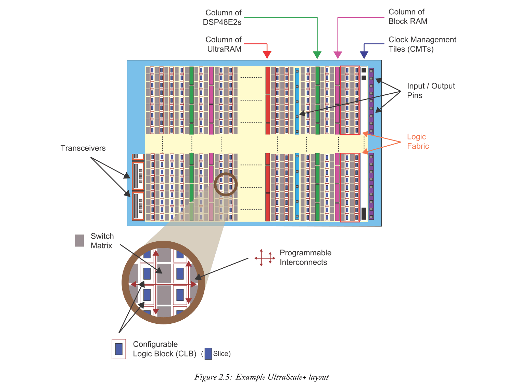

在接口方面，输入/输出块排列在存储体中并形成主要资源数组中的列。IOB可以支持各种接口标准[20]。以高速串行收发器[17]的形式提供了额外的连接，它们通常位于FPGA边缘的四个一组中。接近这些，提供专用块以支持选定的通信标准（表2.6中所示）。FPGA结构中还有其他资源用于配置，时钟管理和系统监控。

#### DSP Functionality
数字信号处理（DSP）在很大程度上依赖于定点乘法和加法算法。常见的DSP任务，如有限脉冲响应（FIR）滤波和快速傅立叶变换（FFT）的计算，完全由加法器/减法器，乘法器和采样延迟构成。

通过Xilinx FPGA中的DSP48x Slice（特别是UltraScale +器件中的DSP48E2变体）提供对这些操作的支持。图2.6提供了该片的简化框图，显示了算术运算和字长，但省略了一些补充功能，如延迟元件，信号路径和多路复用器。例如，DSP48E2切片可以级联在一起（不需要使用结构资源），以便创建有限脉冲响应（FIR）滤波器或快速傅立叶变换（FFT）结构。当需要比单个DSP片上更长的字长时 - 例如，为了实现高达96位的非常宽的加法器——可以组合两个或更多个DSP48E2片。

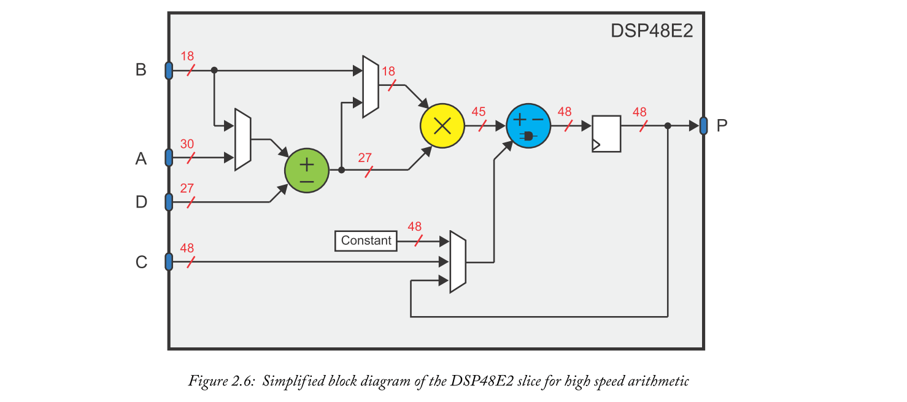

除了算术功能外，DSP48E2 Slice还可用于桶形移位，模式检测和其他逻辑运算。有关DSP48E2的完整信息，包括与以前的DSP48x Slice相比的改进细节，可以在[21]中找到。

#### Memory Support
可以使用CLB资源在FPGA上实现存储器，这通常是存储少量数据的首选方法。对于更大的存储器，有Block RAM（能够存储36Kb，或作为两个较小的18Kb部分），在UltraScale设备中，Ultra RAM具有更大的存储能力（每个288Kb）。通过组合Block RAM或Ultra RAM可以创建更大的存储器。

Block RAM和Ultra RAM在FPGA上实现为专用物理块，而不是由通用的低级逻辑元件构成。它们具有高性能操作，以设备支持的最大时钟频率运行。如果当前配置未使用Ultra RAM，也可以关闭Ultra RAM，或者在长时间不需要操作设计时进入睡眠模式。Ultra RAM的更多细节可以在[18]中找到。

考虑到替代方案，数据存储有四种可能性，如图2.7所示。

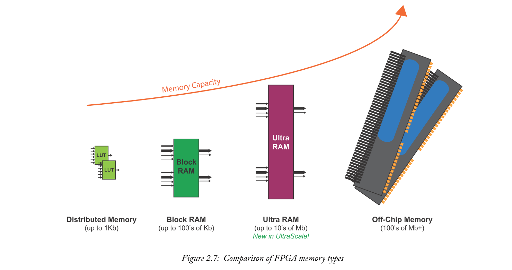

随着更大的设备，特别是Ultra RAM的推出，有可能在芯片上存储比前几代更多的数据。这是有利的，因为它减少或消除了对片外存储器的要求，以及隐含的附加系统成本，接口负载，功耗和延迟，以及性能限制。每种内存类型都具有使其成为某些任务的最佳选择的特征。根据所采用的设计方法，设计者可以明确地针对特定的存储器资源，或允许综合工具做出这些决定。

## 2.5  Comparison and Discussion: FPGA v Zynq v Zynq MPSoC 
本节将总结FPGA，Zynq和Zynq MPSoC之间在架构，功耗和性能方面的差异，以及它们在嵌入式系统实现方面的功能。还将提到特别适合这些设备的候选应用程序。关于设计方法，嵌入式系统实现和应用的进一步讨论将在本书的后面部分进行，重点是Zynq MPSoC。

### 2.5.1  Architectures
在比较FPGA，Zynq和Zynq MPSoC器件的架构时，我们可以总结出三个关键差异：
- Zynq和Zynq MPSoC都提供硬处理器，而FPGA则不提供。
- Zynq MPSoC的PS比Zynq更大，更高规格，更多样化。
- 最大的FPGA比最大的Zynq和Zynq MPSoC器件提供更多的PL。

Zynq是Xilinx的第一款SoC器件，将应用级处理器与FPGA逻辑相结合。Zynq MPSoC代表了Zynq的演进版，提供了更广泛的处理资源;例如，Zynq MPSoC提供实时处理器和图形处理器，以及应用处理器。另一方面，Zynq只有一个应用程序处理器。FPGA不包括硬处理器，尽管一个或多个“软”处理器可以合并到基于FPGA的系统中（即由通用逻辑构建 - 有关该主题的更多讨论，请参见第2.5.3节）。

所有三种设备类型都包括PL。自FPGA首次发布以来，PL的架构已经发展了30多年，已经开发了许多不同的代。另一方面，Zynq和Zynq MPSoC具有与特定几代FPGA逻辑相关的PL区域。具体来说，Zynq采用7系列逻辑，而Zynq MPSoC采用UltraScale +逻辑。在CLB布局，DSP和存储设施，连接以及时钟和电源功能方面存在许多差异。

表2.7提供了可用资源的快速比较。我们可以看到，最新的FPGA虽然不包括处理系统，但提供了最大量的PL——大约是最大的Zynq MPSoC的三倍。值得注意的是，Zynq MPSoC器件包含比Zynq大得多的PL部分，以及PS中的扩展功能。

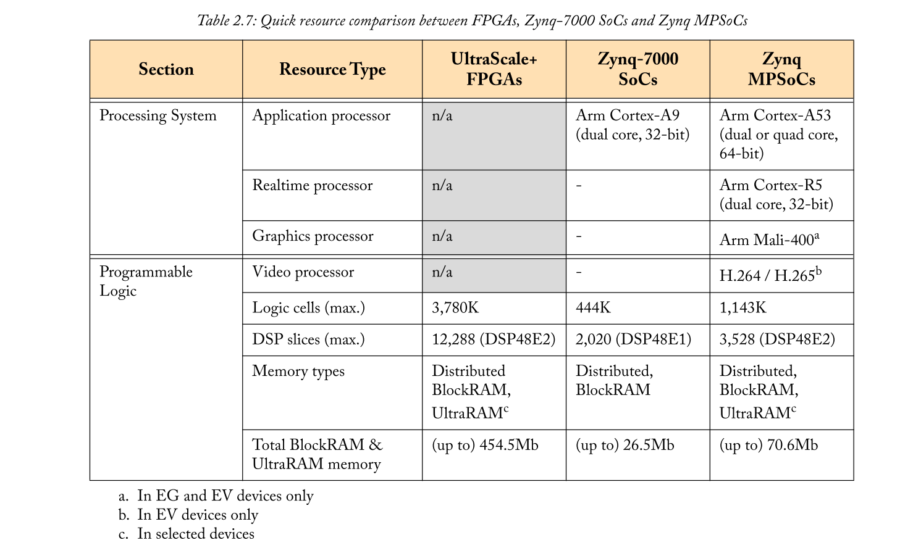

在FPGA和SoC器件的PL部分，接口资源由通用I / O和高速串行收发器组成，并辅以硬化的IP资源以支持以太网和PCI Express等标准。Zynq和Zynq MPSoC器件的PS部分提供了更多标准接口（例如CAN，I2C，USB等）作为硬化资源。Zynq MPSoC包含Zynq上不存在的一些硬化接口，例如Interlaken接口作为选定Zynq MPSoC芯片上的硬化块包含在内。

### 2.5.2  Power Consumption and Performance
多年来已经在降低功耗方面取得了相当大的进步，同时提高了性能（即最大处理频率或“速度”）。如[15]所述，在1985年推出Xilinx FPGA和2011年发布7系列器件之间，能耗（按逻辑单元测量）减少了1000多倍。同期，性能提高了大约100倍。对我们感兴趣的设备进行快速比较是很有用的。

#### Sources of Power Consumption
由于便于编程和保持器件配置所需的底层架构，可编程器件的功耗自然高于固定功能等效IC。

在FPGA术语中，我们通常指的是功耗，静态功耗和动态功耗两个要素，可以定义如下：
- **静态功耗** - 这包括芯片在保持其配置方面所需的功率。静态功率由于晶体管泄漏电流（即，即使在“关闭”时通过晶体管的电流）而发生，并且随着器件的尺寸增加，即随着晶体管数量的增加而增加。静态功耗也随工艺技术，电压和工作温度而变化[22]。
- **动态功耗** - 由于切换活动而在芯片上运行设计所产生的额外功率。它取决于频率，例如如果在200MHz下切换比100MHz，触发器将消耗更多功率。动态功耗可随时间变化，具体取决于电路元件的活动，以及所提供的电压电平，以及用于实现设计的逻辑和路由。工程师可以通过优化低功耗设计来影响动态功耗，例如确保电路元件的时钟频率不高于所需的时钟[22]。

Zynq和Zynq MPSoC的PS也具有相关的功率要求。

#### Improvements in Power Consumption
工艺技术的进步，即使用具有逐渐变小的特征尺寸的ASIC制造工艺，部分地解决了上述功耗和性能的改进。这很大程度上符合摩尔定律（即1965年由英特尔联合创始人戈登摩尔所做的预测，即芯片上的晶体管数量每两年大约翻一番）。然而，现在人们普遍猜测，摩尔定律的终结可能会接近[2]，[5]。在较小的工艺几何形状下制造变得更加困难并且更加昂贵。

在FPGA方面，随着工艺几何尺寸的缩小，仍然可以实现性能提升，但额外的漏电流会增加静态功耗[4]，[10]。这限制了纯粹通过在较小尺寸上制造相同类型的晶体管来实现进一步降低FPGA / SoC功率的潜力。然而，从平面样式到'FinFET'的晶体管结构的转变带来了好处。Xilinx首次在其16纳米器件中采用了FinFET，其中包括UltraScale + FPGA和Zynq MPSoC [13]。

为了应对制造业趋势放缓，重点转向架构改进，以及设计工具和方法的开发，使系统能够更加节能地实现。

在UltraScale和后来的UltraScale + FPGA系列中，引入了新的架构特性以降低功耗，例如改进CLB架构，DSP48x Slice和存储器结构，以及更加面积效率的互连。还有一些器件选项可以在较低的内核电压下工作，这使得设计人员可以将功耗与性能进行权衡[14]。诸如时钟门控之类的技术（即，确保设备的未使用部分不主动工作并消耗能量）也在降低功耗方面起作用。7系列FPGA和Zynq采用了“智能”时钟门控功能，可自动应用时钟门控，无需设计人员手动将其整合到系统中[11]。Xilinx设计工具定期更新，以利用新一代的架构开发。

特别是在Zynq MPSoC中，平台管理单元（PMU）可以控制电源域和构成PS的各种处理引擎。由于大多数设计不会使用所有可用功能，因此可以通过关闭那些不在使用中的功能来实现节能[12]。PMU还具有其他系统初始化功能，将在第10章中进一步讨论。

#### Performance
计算性能通常根据最大处理频率进行量化。为了比较性能，考虑PS和PL元件的最大时钟频率是很有趣的。

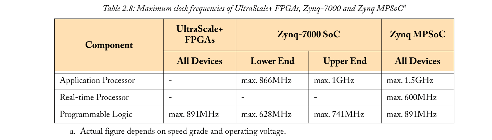

总之，FPGA和SoC器件的功耗密切相关，因为所有SoC都包含一个与FPGA实际相同的PL区域。通过比较Zynq和Zynq MPSoC，由于UltraScale + FPGA架构中的各种优化，Zynq MPSoC器件PL中的功耗（每个逻辑单元）更低，整体性能更高。就PS而言，Zynq MPSoC架构更复杂，性能更高，还包括电源管理的附加功能。

### 2.5.3  Embedded Systems Implementation 
实现具有可编程器件（如FPGA）的嵌入式系统的愿望推动了Xilinx SoC器件的开发，首先是Zynq，然后是最近的Zynq MPSoC。

可以使用单个可编程设备来创建嵌入式系统（通常是一个或多个处理器，存储器，外围设备和互连，以及与外部存储器或其他组件的连接）。有了处理器，系统可以支持软件应用程序，通常在操作系统之上运行。该器件的可编程特性具有现场升级和运行时重新配置的常见优势，FPGA逻辑的并行架构支持加速合适的任务。

Zynq和Zynq MPSoC处理器具有相关的存储器，以及所选元件之间的互连。这款Zynq MPSoC具有比Zynq更多的专用处理元件。例如，引入了专用的实时处理器来补充应用处理器。

FPGA已经支持嵌入式系统设计一段时间了，最​​值得注意的是通过MicroBlaze处理器[9]，一个由用户配置为IP内核的“软”处理器，并由FPGA上的CLB资源构建。（这里的术语“软”与“硬”形成对比，这意味着设备上存在专用处理器。）

MicroBlaze等软处理器的独特优势之一就是它们的灵活性。这些处理器可以根据预期的应用进行定制，例如：如果不需要，可以省略浮点支持，这减少了实现处理器所需的PL资源。明显的缺点是性能 - 硬处理器提供比软处理器更高的性能。为了量化差异，MicroBlaze处理器可在UltraScale FPGA中以高达约400MHz的频率运行（取决于MicroBlaze内核的配置）。与Zynq和Zynq MPSoC器件中的应用处理器相比（参见第27页的表2.8），这是一个低得多的性能水平。

因此，我们可以得出结论，SoC对嵌入式系统来说更为理想。它们提供专用的高性能处理资源，能够以比基于FPGA的软处理器高得多的时钟频率运行。Zynq MPSoC具有多种处理资源，可实现实时处理和图形处理。同时，仍有机会在PL部分中使用一个或多个MicroBlaze实例，以补充位于PS中的主处理器。

### 2.5.4  Applications
FPGA已经成为需要实现计算复杂系统的应用的首选平台，特别是在需要未来更新的情况下。由于其可重新编程的特性，FPGA支持现场升级，甚至实现具有动态重新配置的系统，即设备作为正常操作的一部分重新编程。特别适用于FPGA的应用示例包括移动基站信号处理，视频压缩和解压缩，雷达系统，数据中心的高速交换和路由基础设施等。在每种情况下，处理都需要具有确定性和高性能，同时提供引入新标准，配置或算法的潜力。

即使可重编程性不是关键问题，由于开发ASIC的高度非重复工程（NRE）成本，FPGA通常优于容量低于某个阈值的ASIC。人们普遍认为这个门槛正在上升[15]，这意味着ASIC现在只适用于大批量应用，或者有特殊要求，如最小外形尺寸或极低功耗设计。

到目前为止提到的所有FPGA优势也适用于Zynq和Zynq MPSoC。通过增加处理器功能，这些设备专门针对可能需要单独的处理器和FPGA的应用程序，结合了运行软件代码和高速并行处理的能力。在Zynq MPSoC中，专用的实时处理能力，GPU和视频编解码器使系统允许在单个设备上实现复杂的系统。应用包括“大数据”分析，高级驾驶员辅助系统（ADAS），广播摄像设备，导航系统等等。我们将继续在第5章中探讨应用程序。

## 2.6  Chapter Summary
本章介绍并比较了FPGA，Zynq和Zynq MPSoC。总结了各类器件的基本结构和特点，并介绍了它们的重要特性。我们特别看到Zynq和Zynq MPSoC为标准FPGA可编程逻辑添加了处理系统，并且与Zynq相比，Zynq MPSoC中的处理系统提供了扩展的功能和性能。很明显，随着Zynq MPSoC的发布，SoC器件上提供的PL已大大扩展，我们注意到UltraScale + FPGA所具有的功耗和性能优势也适用于Zynq MPSoC器件。

## 2.7  References
注意：所有在线资源最后访问时间为2019年3月。

下面提到的一些Xilinx文档具有特定于版本的URL。如果您使用的是较新版本的工具，请在Xilinx网站上查看更新，或尝试根据您的版本调整链接。

- [1] Arm, Ltd., “AMBA Specifications” webpage.
  - Available: https://www.arm.com/products/system-ip/amba-specifications
- [2] R. Courtland, “Transistors Will Stop Shrinking in 2021, Moore’s Law Roadmap Predicts”, IEEE Spectrum website, 22nd July 
2016.
  - DOI:  10.1109/MSPEC.2016.7551335
- [3] L. H. Crockett, R. A. Elliot, M. A. Enderwitz, and R. W. Stewart, The Zynq Book, Strathclyde Academic Media, July 2014. 
  - Available: http://www.zynqbook.com.
- [4] D. Curd, “Power Consumption in 65 nm FPGAs”, Xilinx White Paper, WP246 (v1.2), February 2007. 
  - Available: http://www.xilinx.com/support/documentation/white_papers/wp246.pdf
- [5] IEEE Spectrum Magazine, “Special Report: 50 Years of Moore’s Law”, April 2015 (several articles). 
- [6] Interlaken  Product  Alliance,  “Interlaken  Protocol  Definition:  A  Joint  Specification  of  Cortina  Systems  and  Cisco  Systems”, Revision 1.2, October 2008. 
  - Available: http://www.interlakenalliance.com/Interlaken_Protocol_Definition_v1.2.pdf
- [7] International Telecommunications Union, “H.264, Advanced Video Coding for Generic Audiovisual Services”, Recommendation ITU-T H.264, Series H: Audiovisual and Multimedia Systems, version 10, February 2016.
  - Available: http://www.itu.int/ITU-T/recommendations/rec.aspx?rec=12641
- [8] International Telecommunications  Union,  “H.265,  High  Efficiency Video  Coding”,  Recommendation  ITU-T  H.265, Series  H: Audiovisual and Multimedia Systems, version 04, April 2013. 
  - Available: http://www.itu.int/ITU-T/recommendations/rec.aspx?rec=11885
- [9] V. Kale, “Using the MicroBlaze Processor to Accelerate Cost-Sensitive Embedded System Development”, Xilinx White Paper, WP469 (v1.0.1), June 2016. 
  - Available: http://www.xilinx.com/support/documentation/white_papers/wp469-microblaze-for-cost-sensitive-apps.pdf
- [10] M. Klein, “Power Consumption at 45nm”, Xilinx White Paper, WP298 (v2.0), August 2016. 
  - Available: http://www.xilinx.com/support/documentation/white_papers/wp298.pdf
- [11] F. Rivoallon and J. Balasubramanian, “Reducing Switching Power with Intelligent Clock Gating”, Xilinx White Paper, WP370 (v1.4), August 2013. 
  - Available: http://www.xilinx.com/support/documentation/white_papers/wp370_Intelligent_Clock_Gating.pdf
- [12] M. Santarini, “Xilinx 16nm UltraScale+ Devices Yield 2-5X Performance/Watt Advantage”, Xcell Journal, First Quarter 2015. 
  - Available: http://www.xilinx.com/publications/archives/xcell/Xcell90.pdf
- [13] M. Santarini, “Xilinx 20-nm Planar and 16-nm FinFET Go UltraScale”, Xcell Journal, 3rd Quarter 2013, Issue 84. 
  - Available: http://www.xilinx.com/publications/archives/xcell/Xcell84.pdf 
- [14] K. Subramaniyam, “Proven Power Reduction with Xilinx UltraScale FPGAs”, Xilinx White Paper, WP466 (v1.1), October 2015.
  - Available: http://www.xilinx.com/support/documentation/white_papers/wp466-proven-ultrascale-power-leaders.pdf
- [15] S. Trimberger, “Three Ages of FPGAs: A Retrospective on the First Thirty Years of FPGA Technology”, Proceedings of the IEEE, Vol. 103, No. 3, March 2015, pp. 318 - 331.
  - DOI:  10.1109/JPROC.2015.2392104
- [16] Xilinx, Inc., “7 Series DSP48E1 Slice User Guide”, UG479, v1.9, September 2016.
  - Available: http://www.xilinx.com/support/documentation/user_guides/ug479_7Series_DSP48E1.pdf
- [17] Xilinx, Inc., “Leveraging UltraScale Architecture Transceivers for High-Speed Serial I/O Connectivity”, WP458 (v2.0), October 2015. 
  - Available: http://www.xilinx.com/support/documentation/white_papers/wp458-ultrascale-xcvrs-serialio.pdf 
- [18] Xilinx, Inc., “UltraRAM: Breakthrough Embedded Memory Integration on UltraScale+ Devices”, WP477 (v1.0), June 2016. 
  - Available: http://www.xilinx.com/support/documentation/white_papers/wp477-ultraram.pdf
- [19] Xilinx, Inc., “UltraScale Architecture Clocking Resources: User Guide”, UG572 (v1.6), June 2017.
  - Available: http://www.xilinx.com/support/documentation/user_guides/ug572-ultrascale-clocking.pdf
- [20] Xilinx, Inc., “UltraScale Architecture Configuration: User Guide”, UG570 (v1.8), December 2017. 
  - Available: http://www.xilinx.com/support/documentation/user_guides/ug570-ultrascale-configuration.pdf
- [21] Xilinx, Inc., “UltraScale Architecture DSP Slice: User Guide”, UG579 (v1.5), October 2017.
  - Available: http://www.xilinx.com/support/documentation/user_guides/ug579-ultrascale-dsp.pdf
- [22] Xilinx, Inc., “Vivado Design Suite User Guide: Power Analysis and Optimization”, UG907 (v2017.4), December 2017.
  - Available: http://www.xilinx.com/support/documentation/sw_manuals/xilinx2017_4/ug907-vivado-power-analysis-optimization.pdf
- [23] Xilinx, Inc., “Zynq-7000 SoC Data Sheet: Overview”, DS190, v1.11, June 2017.
  - Available: https://www.xilinx.com/support/documentation/data_sheets/ds190-Zynq-7000-Overview.pdf
- [24] Xilinx, Inc., “Zynq UltraScale+ MPSoC Product Tables and Product Selection Guide”, XMP104 (v.2.3), 2017. 
  - Available: http://www.xilinx.com/support/documentation/selection-guides/zynq-ultrascale-plus-product-selection-guide.pdf