# Chapter 3: An Overview of the Zynq MPSoC Architecture

在接下来的章节及其后，我们将探讨Zynq MPSoC的内部工作原理，重点关注它为嵌入式应用程序世界提供的大量功能和资源。我们将特别关注EV设备及其与Zynq MPSoC系列中其他设备的相似之处。到本章结束时，您将对结合形成Zynq MPSoC架构的元素有更深入的了解。您将进一步了解可用的各种处理功能，以便您可以开始在Zynq MPSoC器件中设计自己的嵌入式系统。

首先，我们将介绍一系列不同的Zynq MPSoC器件。然后，我们将介绍其应用和实时处理器，平台管理单元，可编程逻辑和配置安全单元，以检查Zynq MPSoC架构。

## 3.1  Zynq MPSoC Device Families
所有Zynq MPSoC器件都在同一芯片内包含处理系统（PS）和FPGA可编程逻辑（PL）。PS是设备内的专用和优化的硅元件，包含许多不同的处理单元，以及平台管理和安全系统。PL作为FPGA架构的可编程区域存在，能够加速任意逻辑功能，并且在运行时可重新配置。

在撰写本文时，有三种不同的Zynq MPSoC器件系列可供选择，每种器件都具有相似的基本元件。设备系列被称为CG，EG和EV，并且由于PS和PL内的资源配置而彼此不同。我们将首先讨论每个器件系列的PS之间的差异，然后探讨PL中存在的变化。

有两种类型的PS可供选择，提供各种电源管理和处理功能。这些描述如下：
- 第一个PS包含双核应用处理单元（APU）和双核实时处理单元（RPU）。该PS主要由CG设备系列使用。
- 第二个PS由四核APU，双核RPU和Arm Mali图形处理单元（GPU）组成。该PS由EG和EV设备系列使用。

图3.1提供了Zynq MPSoC器件系列和每个系列中存在的PS的直观表示。完成后，PL也包括在内。

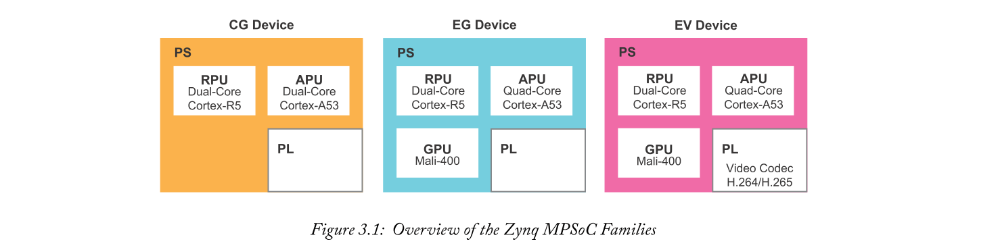

每个芯片的PL中包含的资源也在不同系列之间变化。此外，EV设备系列是唯一包含H.264 / H.265视频编解码器的系列。

表3.1提供了每个Zynq MPSoC器件系列的特性以及可用的FPGA可编程逻辑单元的数量。请注意每个器件系列的应用和实时处理器之间的速度差异。

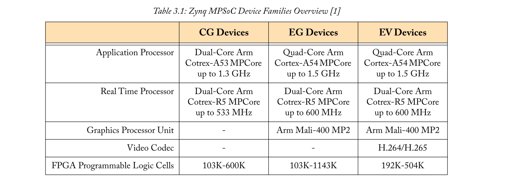

必须注意FPGA可编程逻辑对应于**速度等级**。这表明与FPGA中的逻辑元件相关的时序延迟。在撰写本文时，Zynq MPSoC的PL有五种不同的速度等级。它们是1，L1,2，L2和3，其中**较高的值对应于最快的FPGA可编程逻辑**。包含字母“L”的速度等级表示FPGA可编程逻辑功耗低。PL的可用速度等级取决于Zynq MPSoC器件系列。您可以在[1]中找到每个设备系列可用的速度等级。

### 3.1.1  Arm Versus Xilinx Documentation
当您使用Zynq MPSoC设计自己的嵌入式系统时，您将接触到一系列不同的文档。Arm和Xilinx都为他们的产品提供参考手册，它们将以不同的方式为您提供支持。我们将简要解释Arm和Xilinx文档之间的差异，以及您应该从每个文档中获得哪些类型的支持。

首先，了解Arm如何将其处理器知识产权（IP）用于原始设备制造商（OEM），例如Xilinx [2]。Zynq MPSoC包含Cortex-A53和Cortex-R5处理器，这些处理器基于特定的Arm架构（分​​别是Arm v8和Arm v7）。在选择这些处理器后，OEM可以根据最终产品（在本例中为Zynq MPSoC）的要求灵活地定制其实施的特定细节。OEM可以应用于Cortex-A53和Cortex-R5处理器架构的定制类型分别在[5]和[13]中详述。Zynq MPSoC还包含可能也经过特定定制的额外Arm IP。同样，Xilinx将选择Arm提供的配置选项中规定的IP实现细节。请注意，Xilinx在Zynq MPSoC中应用于Arm IP的定制在制造之前在硅级执行。最终用户无法对Arm IP进行任何进一步更改。

考虑到上述情况，我们现在将讨论您对Arm和Xilinx文档的期望。Arm文档提供了Arm处理器知识产权（IP）的技术细节。本文档包括基础Arm架构原理的基础知识以及具有现有处理元素和可选扩展的处理器核心定制。咨询几个Arm文档和手册将更好地了解Arm处理器IP，但是，不会提供有关原始设备制造商（OEM）配置的信息。Xilinx文档将提供有关特定Zynq MPSoC实施的信息，即OEM更改。特别是，Zynq MPSoC技术参考手册[4]是该器件的主要参考文档。

## 3.2  Processing System
我们现在对Zynq MPSoC器件系列有了更好的了解。硬件变化在设备的PS中特别值得注意，例如 不同的应用处理核心的速度和数量。为了检查Zynq MPSoC处理系统的结构，我们将在撰写本文时研究包含最多功能的系列。这是EV设备系列，将通过以下部分作为示例。我们将在必要时提及设备系列之间的架构差异。此外，在Zynq MPSoC的整个生命周期中，可能会发布其他器件系列。本书可能无法提供有关将包含在这些器件系列中的资源类型的准确信息，但是，基础架构将是相同的。

图3.2简要概述了Zynq MPSoC架构。从上一节开始，可以快速识别APU，RPU，GPU，PL和外部存储器控制器。每个处理单元都连接到称为**高速缓存相干互连（CCI）的互连**[3]。CCI是PS体系结构的有用补充，允许处理器动态地在彼此之间共享任务和数据。**主要地，CCI用于实现非对称处理，从根本上为处理任务之间的一致性提供互连支持，并确保每个核心在整个PS上运行最新数据**。

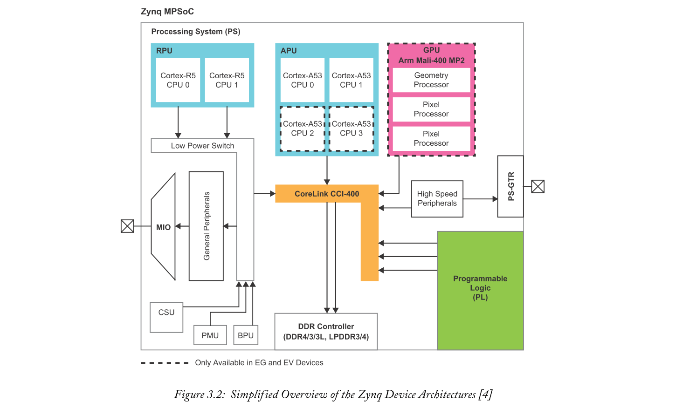

EG和EV系列中的Zynq MPSoC器件包含Arm Mali-400 MP2 GPU。GPU能够硬件加速2D和3D图形，并包括几何处理器和两个像素处理器。支持OpenGL [39]和Open VG [15] API，允许APU将图形处理卸载到GPU。

PS的通用和高速连接也可用，允许PS与片外组件接口和通信。使用多路复用输入/输出（MIO）实现与通用外设的连接。高速连接使用多个千兆位发送和接收通道对，称为PS-GTR收发器。使用上述连接的通用和高速外设接口模块将在后面的3.2.4节中讨论。

PS中有更多的资源，如图3.2所示。APU和RPU由附加互连，存储器，接口，控制器和其他相关处理元件组成。还有专用平台管理单元（PMU），配置安全单元（CSU）和电池电源单元（BPU）。除了PS内的物理处理资源之外，处理元件之间的电源域和通信路径也是非常重要的。

### 3.2.1  Application Processing Unit
APU包含Arm Cortex-A53多处理器核心（MPCore）[5]。在EG和EV设备中，有四个Cortex-A53 MPCores，而CG设备包含两个。图3.3显示了整个APU的简化图。

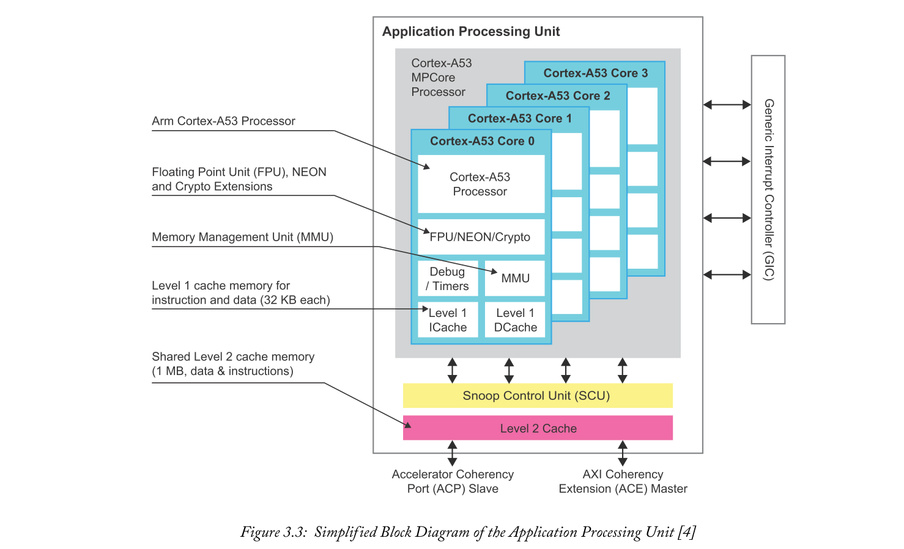

每个Cortex-A53 MPCore包含以下计算单元：浮点单元（FPU），NEON媒体处理引擎（MPE），加密扩展（加密），内存管理单元（MMU）和每个核心的专用1级高速缓存（两个）单独的指令和数据单位）。APU的其余部分由一个监听控制单元（SCU）和二级缓存组成。

Arm Cortex-A53可在高达1.5 GHz的频率下运行，并支持32位和64位指令集。该软件可以使用64位指令集，并可以访问超过4 GB的物理内存空间。所有四个内核都包含自己的FPU，NEON和Crypto计算单元，以及用于数据和指令的独立32 KB 1级高速缓存。此外，每个内核都有自己的调试和定时资源。MMU主要用于在虚拟和物理地址空间之间进行转换。

1级高速缓存存储器允许处理核心在本地存储常用数据和指令，以便可以快速检索它们。所有四个内核共享1 MB的2级高速缓存，以进一步存储数据和指令。**由于所有内核共享2级高速缓存，因此它允许它们在不使用外部存储器的情况下相互通信**。

SCU管理和控制所有核心和2级缓存之间的访问。SCU有助于维持处理核心的1级数据高速缓存与2级高速缓存之间的数据一致性。由于内部缓冲区允许直接缓存到缓存传输，因此无需读取和写入外部存储器即可实现此目的。除此之外，**SCU还通过加速器一致性端口（ACP）管理APU和PL之间的事务**[6]。

Zynq MPSoC中的CCI使用128位AXI一致性扩展（ACE）连接到APU的主总线接口[6]。ACE包含三个附加信号（与第3.5.1节中描述的AXI4协议相反），它允许接口在不使用缓存维护软件的情况下在组件之间提供缓存一致性。ACE协议允许APU的主接口访问给定的地址空间并检索最新数据。然后可以将数据本地复制到1级或2级高速缓存存储器，以优化处理器性能[4]。

Arm NEON MPE是Arm系列-A处理器的扩展，提供先进的单指令，多数据（SIMD）设施[7]，[8]，[9]。SIMD技术旨在加速多媒体和DSP风格算法中常见的大型矢量操作。SIMD指令还支持NEON处理器对两个输入向量的元素进行操作以产生相应的输出向量。一条指令用于配置NEON处理器，以对相同类型和大小的多个数据元素执行相同的操作。

Cryptography扩展（Crypto）是一种专用的加密和解密工具，支持SIMD指令集[10]。支持的标准是高级加密标准（AES），安全哈希算法（SHA）功能SHA-1，SHA-224和SHA-256以及RSA。Crypto还支持有限域算法，用于诸如伽罗瓦/计数器模式和椭圆曲线密码术之类的算法中。

最后，APU使用外部通用中断控制器（GIC）来支持系统中断。该GIC是Arm CoreLink GIC-400 IP [11]，[12]，基于GICv2规范。主要是，GIC为APU提供管理中断源，行为和处理器之间路由的寄存器。

第6章更详细地讨论了APU的体系结构和操作。

### 3.2.2  Real-Time Processing Unit
RPU包含一个用于实时应用的双核Arm Cortex-R5处理器[13]。RPU的架构在整个设备中提供低延迟操作和确定性性能。图3.4提供了RPU的简化图。

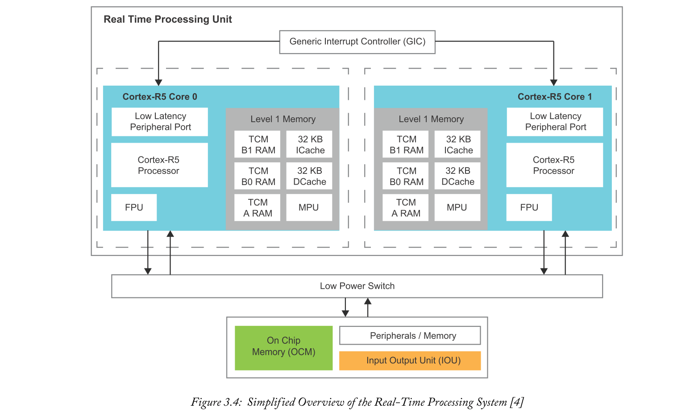

Cortex-R5内核包含一个浮点单元（FPU），用于单精度和双精度算术。每个Cortex-R5内核的1级存储器包含三个紧密耦合存储器（TCM），两个用于数据和指令的32 KB高速缓存，以及一个存储器保护单元（MPU）。

RPU中的Cortex-R5处理内核可在EV和EG设备中以高达600 MHz的频率运行，在CG设备中以533 MHz的频率运行。图3.4显示了Arm Cortex-R5处理内核与低功耗switch之间的连接。虽然未显示内部细节，但低功率switch由附加互连和处理元件构成，连接到其他外设：输入输出单元（IOU）和片上存储器（OCM）。这种连接允许RPU，IOU和OCM在Zynq MPSoC器件处于低功耗模式时一起工作。由于RPU是低功耗域的一部分，因此当Zynq MPSoC处于低功耗模式时，它完全可以运行。

Cortex-R5处理器有两种主要配置可以执行软件。split模式允许每个处理器独立工作，允许每个核心最大化处理性能和延迟。lock-step模式在两个处理器上执行相同的指令。以这种方式执行指令提供了冗余，就好像两个核的输出之间存在不匹配一样，然后发生了错误。这种处理方法也称为安全模式，因为它允许系统有效地确定错误。

错误检查和纠正（ECC）方案还提供进一步的错误检测和纠正支持。在数据集或相关的代码位中，可以检测最多两个错误并纠正一个错误。该方案称为单错误校正，双错误检测（SEC-DED）。有关安全功能和技术的更多讨论，请参阅第9章。

1级数据和指令缓存存储本地数据以提高处理性能。为了实现确定性处理，TCM用于提供可预测的数据加载时间，以确保指令按计划执行。TCM RAM分为两个标记为“A”和“B”的存储体，它们可以由相关的核心的Load Store Unit（LSU）同时访问。可以进行并发访问，因为每个存储体都有连接到LSU的专用端口。标记为“A”的TCM块具有64 KB可寻址空间，而标记为“B”的块具有32 KB可寻址空间。

MPU管理对1级存储器和外部存储器的访问请求，允许自定义和将存储器划分为区域。然后可以为这些区域分配单独的属性。也可以禁用MPU，这将删除内存访问管理并将内存区域设置为其默认属性。

Arm CoreLink PrimeCell GIC PL390 IP [40]基于GICv1规范，用作RPU中的GIC。这是一个专用的GIC，用于控制Zynq MPSoC器件中其他处理单元的输出和输入中断。GIC基址的对齐是每个Cortex-R5处理内核的低延迟外设端口（LLPP）的基址。这种基址对齐是必要的，因为它确保了对传入和传出中断的低延迟访问。

第7章将进一步讨论RPU的体系结构和操作。

### 3.2.3  Graphics Processing Unit

Arm Mali-400 MP2 GPU [4]，[14]，如图3.2所示，由几何处理器（GP）和两个像素处理器（PP）组成。该装置使用三个集成的MMU（每个处理器一个）和一个二级缓存来中间存储数据。

GPU可以实现高达667 MHz的二维（2D）和三维（3D）图形加速。OpenGL ES 1.1 / 2.0 [39]和OpenVG 1.0 / 1.1 [15]应用程序编程接口（API）允许将密集的图形处理卸载到GPU。图3.5提供了GPU的简化框图，说明了几何和像素处理器及其通信路径。

2级高速缓存具有64 KB的可寻址空间和高级外设总线（APB）[16]从接口。APB允许充当主设备的其他设备控制二级缓存。

有关GPU技术细节的更多信息，请参阅Zynq MPSoC技术参考手册[4]和Arm Mali GPU开发人员工具技术概述[14]。

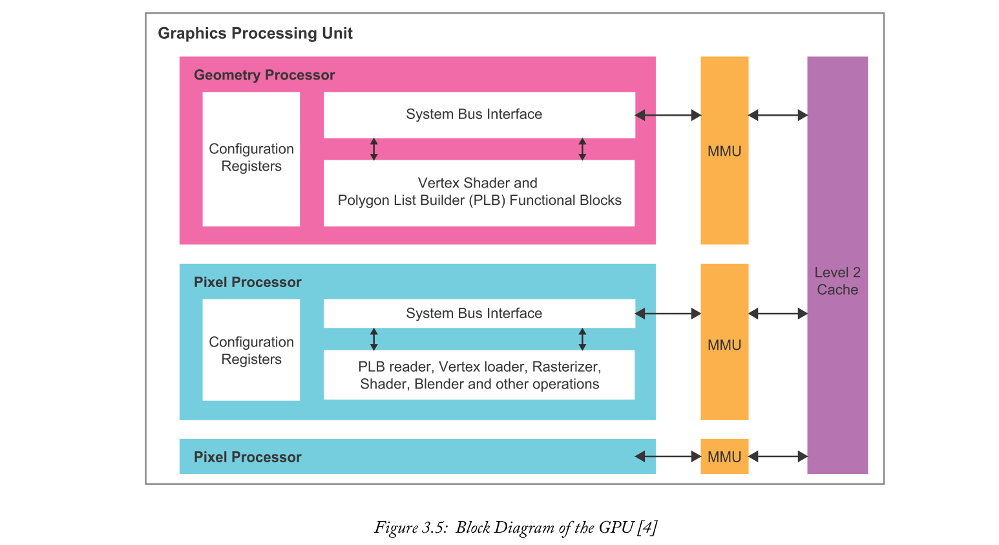

### 3.2.4  Connectivity
Zynq MPSoC的PS具有许多不同的接口，用于连接外设。与Zynq7000 SoC [17]类似，通用外设连接主要通过多路复用输入/输出（MIO）实现。MIO提供灵活的接口，用于配置引脚和外设接口之间的映射。78个处理系统I/O通过MIO映射到外部外围设备。

使用Zynq MPSoC PS中的串行输入输出单元（SIOU），也可以实现与需要进行数千兆位通信的外设的高速串行连接。SIOU是一个高速串行接口模块，支持PCIe，USB 3.0，DisplayPort，SATA和以太网接口协议。SIOU只能连接四个高速串行I/O外设接口。

通过Extended MIO（EMIO）也可以使PL访问特定连接。EMIO创建了从PS中的外围接口到PL资源的直接通信路径。第3.5.3节更详细地介绍了EMIO。

图3.6提供了一个图表，说明了Zynq MPSoC的PS中MIO，EMIO和SIOU的连接性。请注意位于MIO旁边的外围接口块，以及SIOU中包含的高速外围模块。

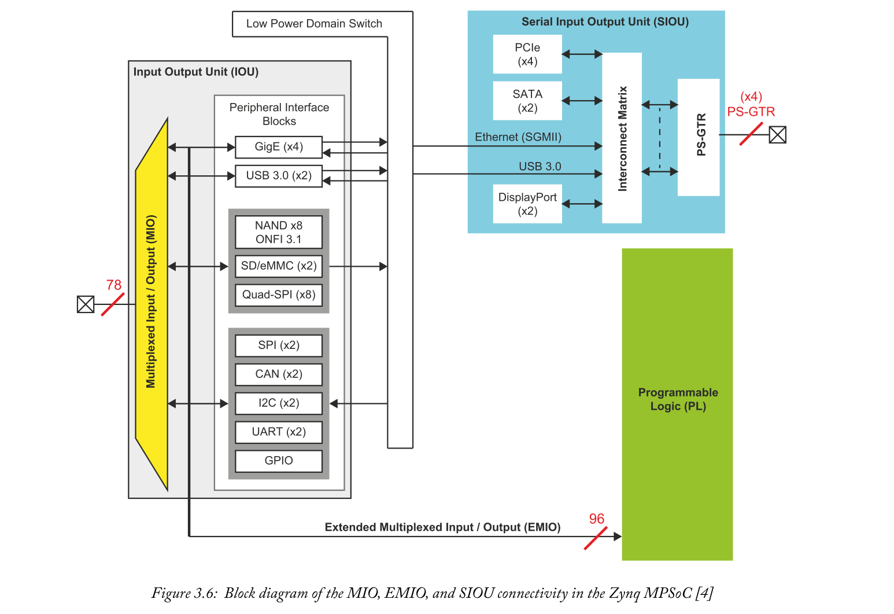

#### Multiplexed Input/Output
MIO可以被认为是一个非常大的多路复用器。它能够将多个不同的外设接口（包含在图3.6中的外设接口模块中）路由到一组78个引脚。表3.2概述了通过MIO提供的外设接口。MIO与SIOU共享USB3.0和以太网外设接口模块。

请注意，使用MIO分配引脚时需要考虑几点。Zynq MPSoC技术参考手册[4]提供了更多信息。

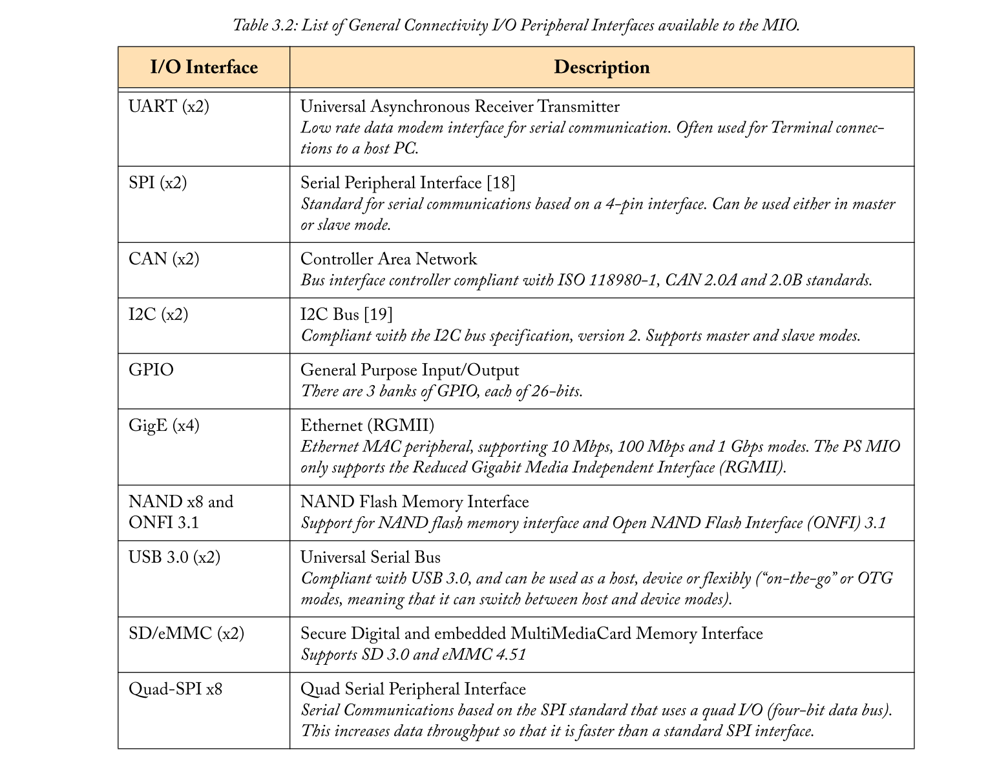

#### Serial Input Output Unit
SIOU包含四个高速外设控制器，每个控制器使用一个数千兆位的发送和接收通道对，称为PS-GTR收发器。PS-GTR能够支持高达6.0 Gb/s的数据速率，并且可以使用第40页的图3.6中所示的互连矩阵连接到任何高速外设模块。表3.3提供了高速设备列表由PS-GTR收发器支持。请注意，MIO和SIOU均可使用USB 3.0。

GigE外设接口模块的接口对于MIO和SIOU都是不同的，每个接口分别使用RGMII和串行千兆位媒体独立接口（SGMII）。

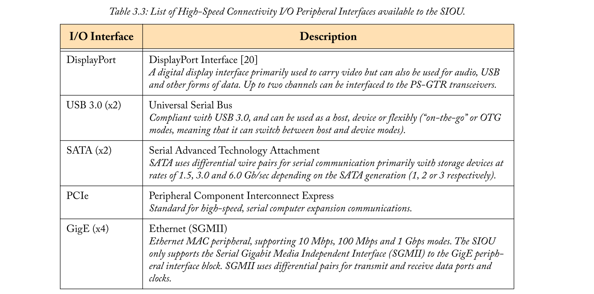

## 3.3  Platform Management
Zynq MPSoC设备中的平台管理由PS内的平台管理单元（PMU）处理。PMU负责整个Zynq MPSoC基础架构的上**电，复位和资源监控**。它还**控制整个系统的初始化，同时启动和管理整个设备中的不同电源域**。PMU可以独立于其他系统处理器和元件向单元发出请求并从单元检索状态信息。

在本节中，我们将首先介绍Zynq MPSoC电源模式和电源域。我们将简要讨论Zynq MPSoC的三种工作功耗模式，以及每种功能模式如何允许器件内特定处理元件和电源域的运行。之后，我们将总结PMU的架构和功能。

### 3.3.1  Power Modes
Zynq MPSoC由PMU控制的三种运行功率模式组成。这些是电池供电模式，低功耗模式和全功率模式。每种模式都允许器件内特定处理元件和电源域的操作，因此这三种模式消耗不同的功率，如图3.7所示。

此外，还有一种深度睡眠模式，通过该模式，设备消耗尽可能少的功率，同时仍保持整个系统的启动和安全状态。在此状态期间，PMU将自身配置为进入睡眠或暂停状态。然后，PMU将等待来自MIO，USB或实时时钟（RTC）的触发，然后自行唤醒以执行预先指定的操作。深度睡眠模式与电池供电模式形成对比，电池供电模式设备已失去其启动和安全状态;然后必须在被唤醒时重新初始化。

Zynq MPSoC技术参考手册[4]提供了有关每种电源模式的更多信息。第10章还对Zynq MPSoC功耗模式和域进行了进一步研究。

### 3.3.2  Power Domains
Zynq MPSoC有四个主要电源域：低功耗域（LPD），全功率域（FPD），PL电源域（PLPD）和电池电源域（BPD）。每个都是相互独立的，可以隔离以降低功耗并实现功能隔离（安全和安全应用和任务的基本要求）。存在于LPD内的PMU有助于每个域的上电和断电。图3.8说明了每个电源域可访问的处理元素和功能。

请注意，使用PL时，PLPD将处于活动状态，并要求Zynq MPSoC以**全功率模式**运行。但是，可以在不使用时关闭PL并继续使用APU和其他全功率处理元件，因为它们存在于不同的电源域中。类似地，PLPD可以在FPD关闭时运行。

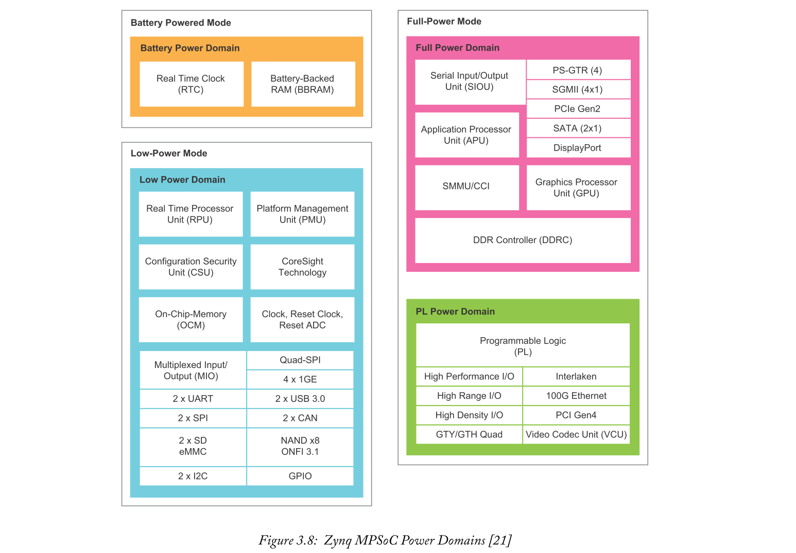

### 3.3.3  Platform Management Unit
PMU执行多种功能，有助于Zynq MPSoC的整体运行。典型的任务包括在接收到唤醒请求时启动设备处理单元的加电和重启，使其脱离其睡眠状态。PMU也执行错误捕获和解决。

PMU包含一个三冗余处理单元，由三个hard MicroBlaze [32]处理器组成。这些为处理平台数据提供了更高的可靠性。据说这些处理器是三重的并形成多数投票系统，其中两个处理器的结果将超过第三个处理器的错误。投票组块用于执行处理器之间的投票系统的逻辑过程。使用冗余可确保安全关键系统出错的风险较低。第9章更详细地讨论了系统冗余。

PMU中有两个主存储器：ROM和128 KB RAM。ROM存储PMU启动序列，功率控制例程和中断的代码。128 KB RAM存储程序数据和用户/固件代码。如[22]中所述，Xilinx提供了PMU的固件。典型的Zynq MPSoC用户无需编写自己的固件，只需使用或修改Xilinx提供的固件即可

PMU的硬件架构和功能将在第10章中进一步介绍。您还可以在Zynq MPSoC技术参考手册[4]中阅读有关PMU的更多信息。

## 3.4  Programmable Logic
PL是Zynq MPSoC的重要组成部分，因为它为计算密集型算术提供硬件加速。PL使用16nm Kintex UltraScale + FPGA架构[23]，其中包含本节中讨论的所有功能和优点。突出显示PL的各种元素的图表如图3.9所示。

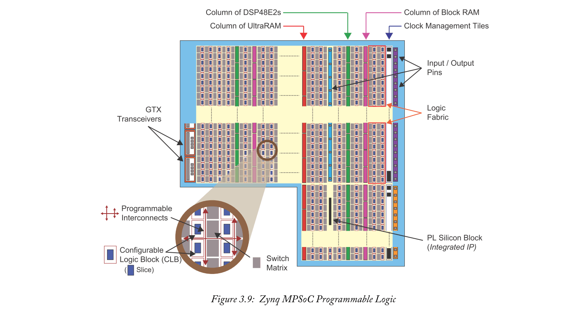

以下部分将简要概述Zynq MPSoC逻辑结构以及专用存储和信号处理资源。我们将讨论PL中包含的外围设备，最后探讨PL与外界的连接。

### 3.4.1  The Logic Fabric
PL主要由16nm Kintex UltraScale + FPGA架构组成，由切片和可配置逻辑块（CLB）组成。如前面图3.9所示，FPGA架构中CLB的排列采用二维阵列。每个CLB位于交换矩阵旁边，以便它可以将数据路由到另一个PL资源。此外，CLB可以使用可编程互连连接到其他类似资源。

CLB由一个slice组成，其包含实现时序和组合逻辑电路所需的资源。Zynq MPSoC器件中的每个片元件由8 x 6-input查找表（LUT），16个触发器（FF）和其他路由逻辑组成。垂直相邻的slices可以链接在一起，通过使用进位逻辑（在图3.10中标注为Cin和Cout）实现大型运算电路。该电路由多路复用器和逻辑链连接组成，用于在相邻片之间路由中间信号。

图3.10说明了CLB及其组成成分的组成。UltraScale + CLB用户指南[24]提供了有关FPGA逻辑结构中CLB资源的更多信息。

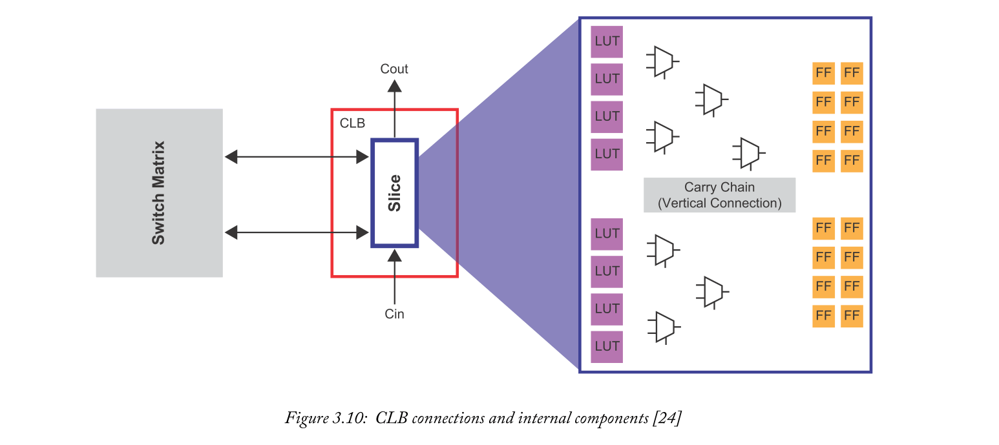

FPGA逻辑结构可用于构造各种运算电路，例如加法，乘法和除法。然后可以组合这些电路以执行任意数学函数。

LUT可以用作小型本地存储器，或者连接在一起以形成更大的存储器阵列。这种结构称为分布式RAM，由于其资源效率和放置的灵活性，当逻辑电路需要存储时它是有效的。

### 3.4.2  Storage and Signal Processing Resources
FPGA加速的许多算法和例程都受益于专用存储和算术资源。除逻辑结构外，还有三个主要资源用于在Zynq MPSoC PL中存储和处理数据。这些是Block RAM，UltraRAM和DSP48E2 Slice。每个都被安排在列中，位于逻辑结构旁边，如第45页的图3.9所示。

这些专用资源中的每一个都在专用芯片中实现。它们都是紧凑型，低功耗，能够以PL支持的最高时钟频率工作。与FPGA逻辑结构类似，每个特殊资源都包含另一组逻辑元素和要考虑的功能。每个描述如下：

#### Block RAM Tiles
Zynq MPSoC器件中的**Block RAM可配置为随机存取存储器（RAM），只读存储器（ROM）和先进先出（FIFO）缓冲器，同时还支持纠错编码（ECC）**。这些资源是高度优化的存储器元件，并且当需要**低延迟和高容量存储**时，可以优选作为分布式RAM的替代。PL中的每个Block RAM都有一个双端口接口（每个端口能够在相同或不同的时钟域下操作时访问存储空间和存储的数据）。此外，可以将Block RAM与其他垂直相邻的Block RAM级联，从而提供一种创建存储器阵列的简单方法。

每个Block RAM最多可存储36KB的信息，可配置为一个36KB RAM或两个单独的18KB RAM。块RAM可以被“Reshap”，以便较小或较大字长的元素可以优化分配的存储器阵列。例如，可以Reshape 36 KB Block RAM，使其可以包含4096个元素x9位或8192个元素x4位。块RAM分布在整个FPGA逻辑结构的列中，因此它们可以容易地用于相邻的电路元件，例如DSP48E2片中实现的那些。有关UltraScale + Block RAM的更多信息，请参见UltraScale存储器资源指南[25]。

#### UltraRAM Tiles
单个UltraRAM最多可存储288 Kb。UltraRAM仅适用于选定的Zynq MPSoC器件，可代替硬件设计中的外部存储器（如SRAM）。UltraRAM具有同步双端口接口，可级联形成更大的存储器阵列，最高可达100 Mb。这可以在不使用额外逻辑结构的情况下实现，因为UltraRAM具有专用的路由硬件，允许它们以高时钟频率运行。相邻逻辑电路可以在UltraRAM阵列中存储数据，并实现低延迟和高容量存储。例如，UltraRAM阵列适用于需要存储高清视频帧的视频处理电路。

无法重塑UltraRAM块。但是，它们支持4096个元素x 72位的寻址方案。它们作为UltraScale + FPGA逻辑结构中心的单列存在。为减少路由延迟，应将附近使用UltraRAM的资源放置在附近。有关UltraScale + UltraRAM的更多信息，请参见UltraScale存储器资源指南[25]。

#### DSP48E2 Slices
许多信号处理应用所需的算术运算受益于专用DSP资源以满足时序约束。此外，使用原始逻辑元件（LUT，FF）设计大型运算电路会消耗相当大的逻辑结构区域，从而对FPGA结构资源提出了要求。

在所有Zynq MPSoC器件的PL中，专用的DSP48E2片[26]是一个硬件乘法器，可提供高速，高效的信号处理。它们按整个FPGA架构的列排列，如第39页的图3.9所示，以减少到相邻逻辑电路的路由延迟。此外，每个Slice与Block RAM水平对齐，从而在两种资源类型之间提供高效连接。

如果算术电路需要比单个DSP48E2片提供的字长更大的字长，则可以级联多个DSP48E2片。通过在整个DSP片中使用级联和进位信号，可以实现级联切片，并且通常可以使大多数算术函数的字长倍增。

### 3.4.3  PL Peripherals
Zynq MPSoC器件可以在PL内包括一组专用硅块，也称为硬IP块或集成IP。目前有五个硬IP模块，分别是：PCI Express，Interlaken，100G以太网，Xilinx系统监视器（SYSMON）和视频编解码器单元（VCU）。VCU在3.4.4节中描述。

PCI Express，Interlaken和100G以太网接口均在PL内运行，并具有许多可配置参数，用于控制与外部外设的连接。SYSMON模块存在于所有Zynq MPSoC器件的PL中[27]。该块能够观察PL与安全性，安全性及其物理环境相关的问题。SYSMON模块使用片上电源监视器和温度传感器记录测量结果，并将记录的值存储在本地寄存器中。
这些可以通过Zynq MPSoC处理器和PMU使用APB进行访问。

### 3.4.4  Video Codec Unit
仅包含在EV设备的PL中的VCU提供多标准视频编码和解码。它与PS没有直接连接，必须使用寄存器直接编程。该装置可同时支持多达八个视频流，并可同时进行编码（压缩）和解码（解压缩）功能。VCU支持高效视频编码（HEVC）H.265和高级视频编码（AVC）H.264。此外，该设备还可以处理高视频分辨率，如4K x 2K。有关VCU的更多信息，请参见Zynq MPSoC技术参考手册[4]。

### 3.4.5  General Purpose Input/Output
Zynq MPSoC的PL由输入和输出模块（IOB）组成，用于与外界进行通用通信。这些统称为SelectIO资源[28]，并以不同长度的BANKs或tiles排列。每个IOB包含一个用于与外部组件通信的焊盘。提供的IOB总数取决于Zynq MPSoC的器件和封装。

在设计具有PL外部接口的系统时，需要注意三种I/O分类。这些是Hight-Range（HR），High-Performance（HP）和High-Density（HD）组。每个都有典型的用例，总结在表3.4中。 

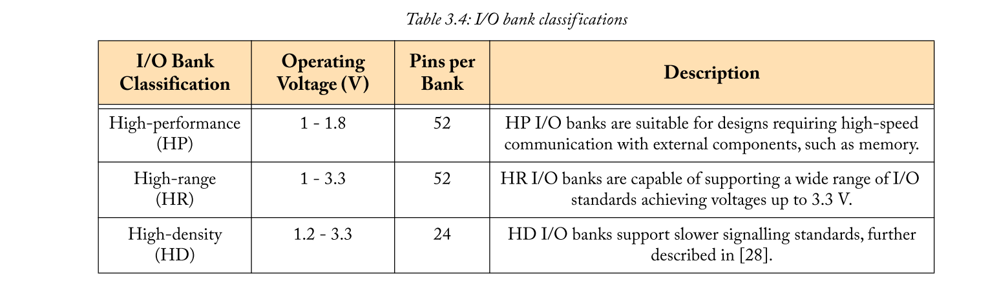

### 3.4.6  High-Speed Connectivity
PL和外部世界之间的另一种通信方式是使用 Gigabit Transceivers（GTX）。Zynq MPSoC的PL中有两种类型的GTX收发器。GTH收发器以16.3 Gb / s的速度提供低功耗，高性能通信[29]。GTY收发器能够达到32.75 Gb/s，可在极高速应用中实现最高性能[30]。每种都支持一系列接口标准，包括PL中可用的硬IP模块。Zynq MPSoC的具体器件，封装和速度等级将决定哪种收发器类型可用。

GTX收发器分为四组，也称为收发器Quad。每个通道都包含一个专用的锁相环（PLL），发送器和接收器。

### 3.4.7  JTAG Interface
联合测试行动小组（JTAG）[31]端口负责在开发阶段对Zynq MPSoC进行编程和调试。在调试时，JTAG接口可用于管理到设备的数据流，并将PL和PS中遇到的错误传达给用户。在商业或工业环境中部署设备时，通常优选的是具有用比特流编程PL的更安全的方法，并监视设备。

##  Processing System and Programmable Logic Interfaces
Zynq MPSoC的一个重要吸引力在于它在PS中提供专用的硅处理器，能够硬件加速PL中的计算密集型算法。换句话说，Zynq MPSoC为单个芯片中的软件和硬件协处理提供了一个环境。使用专用硬件接口实现PS和PL之间的指令和数据的通信。

有许多不同类型的接口;然而，Arm AMBA [33]，[34]开放标准是Zynq MPSoC中包含的大多数接口的基础。本节将首先检查Arm AMBA规范，并研究在Zynq MPSoC器件中使用这些接口。随后，我们将探索并介绍其他接口类型。

### 3.5.1  The Arm AMBA Open Standard
Arm高级微控制器总线架构（AMBA）是一个负责片上通信和管理的开放标准。它包含用于开发由大量控制器和外围设备组成的多处理器设计的标准。使用此规范的系统主要受益于减少的硬件开发时间。工业和第三方制造商生产的许多设备，IP核和块使用某种形式的AMBA规范。

Arm开发了AMBA标准，于1996年发布，用于微控制器。在撰写本文时，该标准已经过多次修订，目前已进入第五版。典型的变化包括新的和扩展的接口，以满足技术需求。

AMBA开放标准中有六个接口，扩展和总线，其中五个功能在Zynq MPSoC器件中。这些是高级eXtensibile接口（AXI），AXI一致性扩展（ACE），高级高性能总线（AHB），高级外设总线（APB）和高级跟踪总线（ATB）。每个AMBA接口由特定于接口类型的协议和互连组成。我们将讨论这些，只要它们与Zynq MPSoC的操作直接相关。

#### AXI - Advanced eXtensible Interface
AXI总线[6]用于嵌入式系统，用于连接处理元件和IP模块，同时提供高带宽，低延迟的通信。它非常适合与内存控制器连接，可以灵活地实现各种介质连接的架构。AXI协议目前处于第四次修订版，名为AXI4。Zynq MPSoC器件在PS和PL内使用AXI4;它还提供了在设备的两个部分之间进行通信的方法。

有三种协议链接到AXI4，每种协议都提供不同的优点和属性，使特定任务受益。其中两个是“内存映射”，它指的是发出地址的协议以及指定的事务。使用给定地址存储或从存储器读取数据，该地址只能由主设备提供。

内存映射协议支持单拍和突发传输。单拍传输是指每个事务传输一个数据实例。在单拍传输期间，主设备必须为每个数据节拍启动事务，这会导致额外的延迟。

使用突发传输可以实现最大性能。这种传输数据的方法是Slave从Master接收地址和访问模式（确定后续数据的后续地址的模式或公式）。这不仅允许通过一个事务执行多个数据传输，而且还减少了传输的开销和延迟。
- AXI4 [6]  - 该协议用于需要处理元件和IP块之间的存储器映射链路的连接。它能够进行单拍传输，并且可以执行最多256个数据节拍的突发传输。AXI4有五个独立通道：读地址，读数据，写地址，写数据和写响应。每个通道都有一个专用资源来传递其数据。该协议适用于向/从主存储器传输大量信息。
- AXI4-Lite [6]  - 一种简单的内存映射链路，具有减少的握手信号，导致资源分配比完整的AXI4更低。因此，单拍传输是唯一受支持的数据传输方法（无突发传输）。因此，该协议通常用于与IP块和处理元件的控制寄存器的低带宽通信。
- AXI4-Stream [35]  -  AXI4-Stream支持点对点数据流。它提供无限制（无限）大小的突发传输。不需要地址通道，因为此协议应用于设备内源和目标之间的直接数据流。该协议对视频，通信和网络应用中的信号处理特别有用。

#### ACE - AXI Coherency Extension
当系统的组成处理元件的本地和主存储器具有共享和同步数据的方法时，系统只能保持一致。检查以确保组件共享其最新信息可以在软件中执行。但是，这会在程序执行中**产生额外的开销**。ACE协议[6]实现了独立处理元素的一致性，同时确保对同一存储器位置的写入是最新且正确的（无需软件）。

ACE协议是AXI接口的扩展，由五个额外的通道组成;三个用于'窥探'，两个用于确认。当设备正在窥探时，它正在观察由一个或多个设备发送或接收的数据。ACE协议中需要监听，以便主设备可以观察读取事务。如果监听主机在读取事务指定的地址处具有最新数据，则它可以向请求主设备提供该数据。

除此之外，还存在ACE-Lite协议[6]，它与AXI类似，但不包含ACE引入的任何新的Snoop和Acknowledgment通道。在读地址，写地址和读数据通道上存在附加信号。因此，ACE-Lite频道可以窥探ACE Masters，但是，不能窥探自己。ACE和ACE-Lite协议向后兼容AXI，前提是禁用其他通道和信号。

#### AHB - Advanced High-Performance Bus
AHB [36]由单个共享信道组成，供主从外设传递信息。AHB与AXI形成对比，AXI包括具有专用读，写和响应通道的多通道总线。AHB用于以**较低的信道资源成本**与其他处理元件进行**高带宽通信**。该协议比AXI简单得多，并且仍然可以实现单拍和突发传输。

可以在AHB协议中配置数据总线，以进行64,128,256,512和1024位操作。AHB可用于Zynq MPSoC器件的许多领域。RPU使用AHB接口为外部外围设备和内存提供快速，专用的通信，以实现实时性能。SD和SDIO卡接口使用AHB（或AXI）协议与主机总线目标接口进行通信。此外，SATA主机控制器接口还使用AHB控制端口来提供管理外围设备的工具。

#### APB - Advanced Peripheral Bus
APB是外围设备之间**低带宽通信的首选协议，不需要高性能数据传输**[16]。与AXI相比，这种总线类型提供低资源利用率和降低的功耗。该接口非常简单易用，因为**总线之间没有握手信号**。因此，**不允许突发传输**，因为没有协商数据传输参数的手段。有两个数据通道，即读取和写入，它们彼此独立。由于握手信号不可用，因此**在任何时间点只有一条总线可以传输数据**。APB存在于Zynq MPSoC PS的每个处理单元中，也存在于用于控制组件寄存器的PL中。

#### ATB - Advanced Trace Bus
在软件中进行跟踪是使用专用设备记录有关程序或电子组件的数据和信息的行为。ATB协议[37]主要用于使用Arm CoreSight技术在设备的基础设施中传输与格式无关的跟踪信息[41]。使用CoreSight的元素能够跟踪并使用ATB接口在整个Zynq MPSoC中传输数据。Xilinx使用Arm CoreSight SoC-400组件为Zynq MPSoC的PS和PL提供调试功能。设备中包含的所有CoreSight组件都支持ATB，以在整个设备基础架构中传输跟踪配置文件。

### 3.5.2  PS to PL Interconnects and Interfaces
PL中用于在IP块之间传输数据的主要接口标准是AXI。可以使用AXI互连从各种源连接PL内的多个AXI端口。AXI互连在逻辑结构内作为交换机，因此PL可以将来自多个源的流量路由到其目标目的地。PS还包含多个互连，其中一些属于AXI标准，而另一些则是AMBA标准的另一种形式，具体取决于接口。

在PL和PS之间进行通信时，AXI支持高吞吐量，低延迟的数据传输。AXI标准在PS和PL之间实现专用端口。图3.11说明了大多数这些连接，仅显示PS中直接连接到PL的资源。这些是CCI-400，APU（和SCU），系统内存管理单元（SMMU）[38]，中央交换机和低功率交换机。还包括存储器子系统，以说明每个交换机和互连可以访问的PS内的各种存储器资源。SMMU提供PS和PL之间的地址转换，以便PL可以使用虚拟地址。

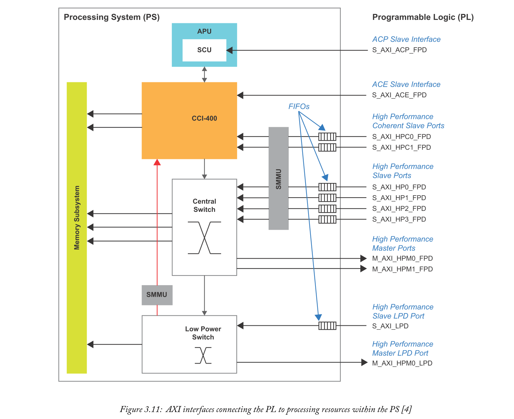

接口具有命名约定，该约定表示主设备和从设备的角色。接口的第一个字母始终表示PS的功能，即“S”表示PS是从设备，“M”表示PS是主设备。此外，FPD指定端口fullpower域的一部分，而LPD指定端口是低功率域的一部分。

PL可以使用四个接口来保持与PS的**一致性**，其中三个接口直接连接到CCI。这些列表如下：
- AXI **Coherency** Extension -  ACE可以通过CCI**访问系统内存以及APU的本地内存**;分享最新信息。
- High-Performance **Coherent** Ports - 这些高性能端口直接连接到CCI，以**实现PL和PS之间的数据通信**。两个端口都包括FIFO缓冲器，以允许PS和PS中的元件之间的突发传输和高速率通信。
- Accelerator **Coherency** Port -  ACP使用ACE-Lite协议的子集，并在APU内的PL和SCU之间提供单个异步连接。该连接**允许PL内的硬件加速器保持与APU的1级和2级高速缓存的一致性**。

除了一致性端口之外，LPD和PL之间还存在可以由RPU使用的低延迟路径。表3.5总结了图3.11中所示的所有端口。

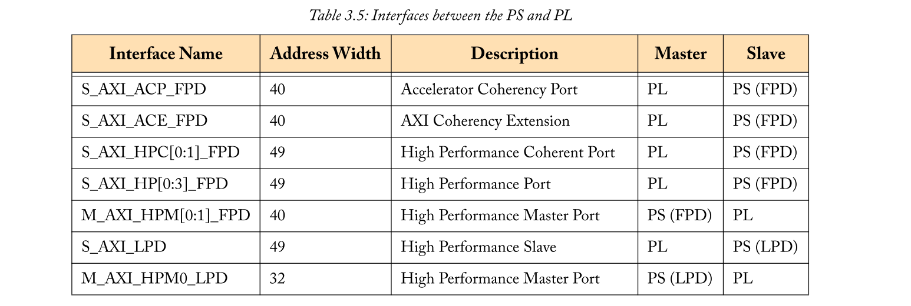

### 3.5.3  EMIO Interfaces
如前面第3.2.4节所述，可以将PS的特定连接路由到PL内的资源。通过使用扩展MIO（EMIO）在两个系统之间传输信号，PS内的输入/输出（I/O）外围模块可以连接到PL内的资源。只有一部分I/O外设可以路由到PL，一些具有降低的能力。图3.12显示了适用的外设，并说明了EMIO的架构。

MIO使用三个26-bit BANKs与外部外设通信。类似地，EMIO可以使用三个32-bits BANKs将信号传输到PL，所有这些BANKs都可以路由到特定的I/O外设。一旦I/O外围设备和PL连接，它们就可以与IP核，IOB或两者的组合进行通信。

每个BANK都独立于其他BANKs，只能通过软件进行观察和控制。EMIO不支持USB，NAND和QSPI。

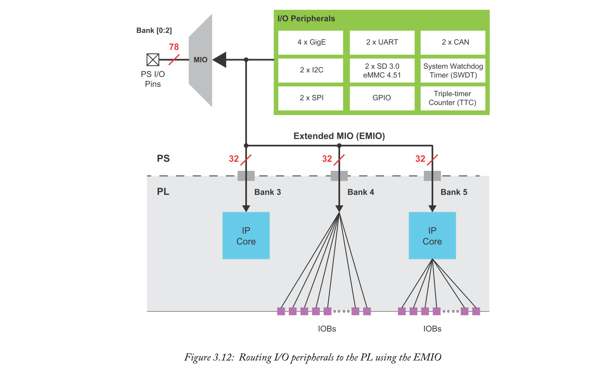

### 3.5.4  Other PS to PL Interfaces
除了高性能端口，一致性端口和EMIO bank之外，其他专用接口还可在PS和PL之间提供进一步的路由和通信功能。有些接口致力于将PL连接到PS内部的千兆以太网控制器和DisplayPort单元。其他信号包括看门狗定时器，复位信号，中断，直接存储器访问（DMA）协议消息以及到PMU的直接GPIO连接。

## 3.6  Security and Configuration
Zynq MPSoC器件在其基础架构中包含广泛的安全功能和功能。其中包括各种加密模块，安全启动设施，篡改检测等等。设备内安全和启动相关功能的主要提供者是配置安全单元（CSU）。除此之外，芯片架构中还有其他元素和资源有助于系统的安全操作。

在本节中，我们将介绍CSU的安全功能并探索其架构，然后我们将研究CSU的安全启动和篡改检测功能。Zynq MPSoC技术参考手册[4]提供了有关Zynq MPSoC安全启动和配置的更多信息。

### 3.6.1  Configuration Security Unit
CSU由两个主要块组成，称为安全处理器块（SPB）和加密接口块（CIB），如图3.13所示。还有其他额外的加密块用于安全应用：AES-GCM [45] [46]，SHA-3 [43]和RSA 4096 [42]。SPB由用于管理安全启动的三重冗余处理器组成。它还包含ROM，本地RAM和控制/状态寄存器。CIB提供AES-GCM，DMA，SHA-3，RSA和处理器配置访问端口（PCAP）[4]块的接口。

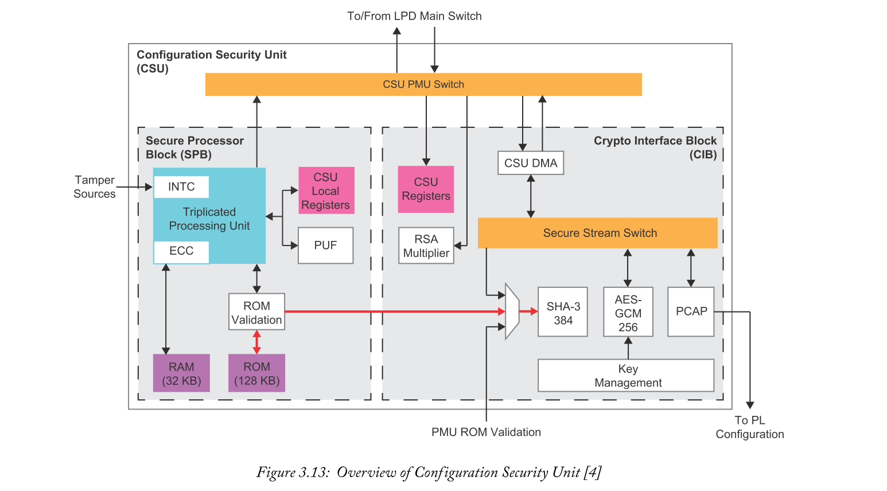

SPB的三冗余处理器管理Zynq MPSoC内Arm处理器的安全启动。每个Arm处理器都有一个特定于其要求的引导过程，每个过程都将由SPB执行。三冗余处理单元还支持篡改检测。在Zynq MPSoC以安全模式运行时，可以启用13个篡改响应寄存器。在检测到篡改事件后，可以找到其确切位置并启动安全锁定。图3.13中的INTC端口指示处理单元的篡改源。

SPB处理器使用ECC内存总线访问本地RAM，防止传输和请求出错。此外，存储在处理器ROM中的所有代码必须在执行之前通过完整性检查。当SPB ROM存储软件代码时，使用SHA-3加密算法生成密钥。每当软件代码在此之后加载ROM时，都会使用SHA-3加密块进行检查。此完整性检查的结果将确定是否已发生ROM的篡改以及执行软件是否安全。图3.13说明了用于软件代码验证的本地处理器ROM和SHA-3加密块连接（以红色突出显示）。

物理不可克隆功能（PUF）[44]也被SPB用于生成设备唯一加密密钥。PUF在器件制造过程中形成，利用硅制造中存在的随机性为每个Zynq MPSoC器件提供独特的“指纹”。

图3.13的右侧显示了SHA-3和AES-GCM加密算法块。整个Zynq MPSoC可以根据预期应用的需要使用这些块。低功率域交换机在加密块和其他处理元件之间传输数据。数据通过CSU PMUSwitch传递到DMA。然后，DMA负责将数据传输到安全流交换机或从安全流交换机传输数据，也称为CIB。数据可以在使用CIB的系统之间传输而没有篡改的风险，允许多个系统连接到同一个交换机。这里，加密算法块可以从其他处理元件接收数据以用于编码和解码目的。

当设备处于安全配置时，RSA为引导映像数据提供身份验证。然后，AES-GCM将使用密钥解密图像数据，该密钥可以使用表3.6中所示选项之一的密钥管理接口加载。只有ROM可以选择使用设备密钥加载密钥的方法。

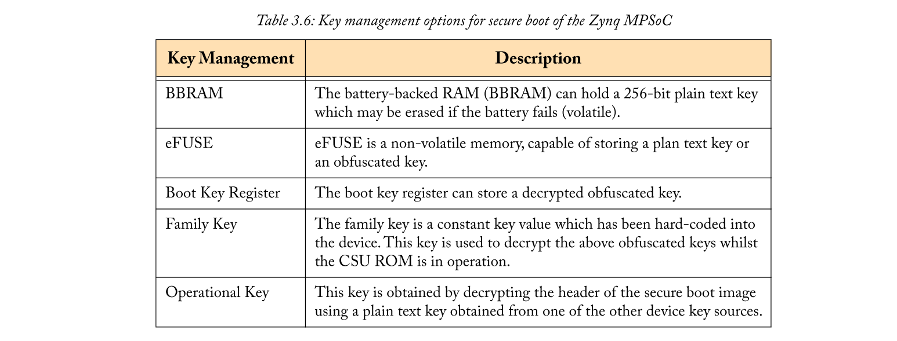

第8章详细介绍了CSU的功能以及Zynq MPSoC器件的其他安全相关功能。

## 3.7  Chapter Review
本章介绍了Zynq MPSoC及其两个组件，即PS和PL。对CG，EG和EV设备系列进行了检查和比较。探讨了PS的一般体系结构，展示了Cortex-A53应用处理内核和Cortex-R5实时处理内核集群，这些内核经过分组，可为嵌入式应用提供高性能，低延迟的功能。除此之外，Arm Mali-400 GPU包含几何处理器和两个像素处理器，并且仅在EG和EV设备系列的PS中实现。

PL包含Kintex UltraScale + FPGA逻辑结构。CLB，Slice，Block RAM，UltraRAM，DSP48E2，集成外设IP模块和IOB是所研究的UltraScale + FPGA资源之一。

介绍了PS和PL之间的接口以及AMBA 5.0开放标准。还研究了功率模式，功率域和PMU。PMU被证明可以管理和监督Zynq MPSoC器件中处理组件的操作。最后，CSU被证明可以处理设备的安全和启动过程，同时在系统运行期间提供篡改检测。

您现在应该更好地了解组合Zynq MPSoC架构的处理元素和功能。第4章概述了使用Zynq MPSoC开发应用程序的设计工具和方法。

