# Chapter 4 Design Tools & Methods for the Zynq MPSoC

在讨论使用Zynq MPSoC进行系统设计之前，介绍支持此过程的设计工具，开发板和支持材料是非常有用的。我们还概述了可用的主要设计流程。本章提供了高级别的介绍，在后面的章节中将对所选主题进行更详细的介绍。

## 4.1  Anatomy of a Zynq MPSoC Design
在最高级别的抽象中，Zynq MPSoC系统由三个元素组成：Zynq MPSoC器件所在的电路板;Zynq MPSoC硬件设计;以及在硬件上运行的软件层。当然也可以与其他板或外围设备连接。

在我们的讨论中，我们通常认为Zynq MPSoC开发板可以从商业上获得（从Xilinx或其他供应商处获得）。该电路板支持Zynq MPSoC系统的原型设计，具有一套标准设施和外设接口。最终，产品开发将倾向于涉及创建定制印刷电路板（PCB），但我们认为这超出了当前书籍的范围。

Zynq MPSoC硬件系统的想法有点抽象，因为它指的是使用设备的可重新编程硬件实现的定制设计，而不是设备架构本身。硬件系统可以改变为任何所需的系统设计（通过重新编程芯片实现）。在Zynq MPSoC硬件之上，有一个“堆栈”的软件元素，可能包括一个或多个操作系统，以及应用软件和其他组件。后面的章节将更详细地介绍Zynq MPSoC硬件设计和软件堆栈;但首先我们将概述构成Zynq MPSoC系统的不同元素。

### 4.1.1  Zynq MPSoC Development Boards
通常，设计人员使用标准开发板开始工作，该开发板包括Zynq MPSoC器件以及许多其他组件，包括存储器和各种标准接口（USB，以太网，DisplayPort等）。其中一个开发板是Xilinx ZCU104，如图4.1所示，其中包括一个ZCU7EV Zynq MPSoC器件。表4.1总结了该板的一些显着特征，更详细的综述可以在[48]中找到。

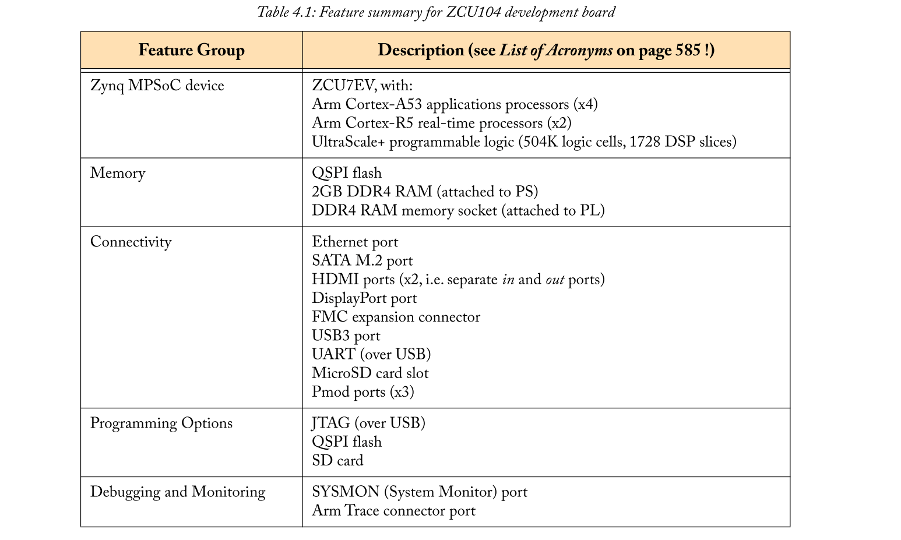

其他开发板也可从Xilinx和第三方供应商处获得，包括Xilinx的ZCU102 [47]和Avnet的Ultra96 [55]。随着电路板选择的扩大，开发人员越来越多地可以选择不同的Zynq MPSoC器件，这些器件具有不同的存储器和I/O设备组合，并且价格范围广泛。

开发板是大多数设计的便利起点，但产品通常是在定制板上开发的。这使得可以从全部选择的Zynq MPSoC芯片中自由选择，并且还允许针对目标应用进行完全定制，从而可能实现物理上更小的板，其仅包括所需的组件，具有优化的成本和功耗。本书不涉及电路板设计，但Xilinx提供了有关该主题的广泛支持文档[42]。

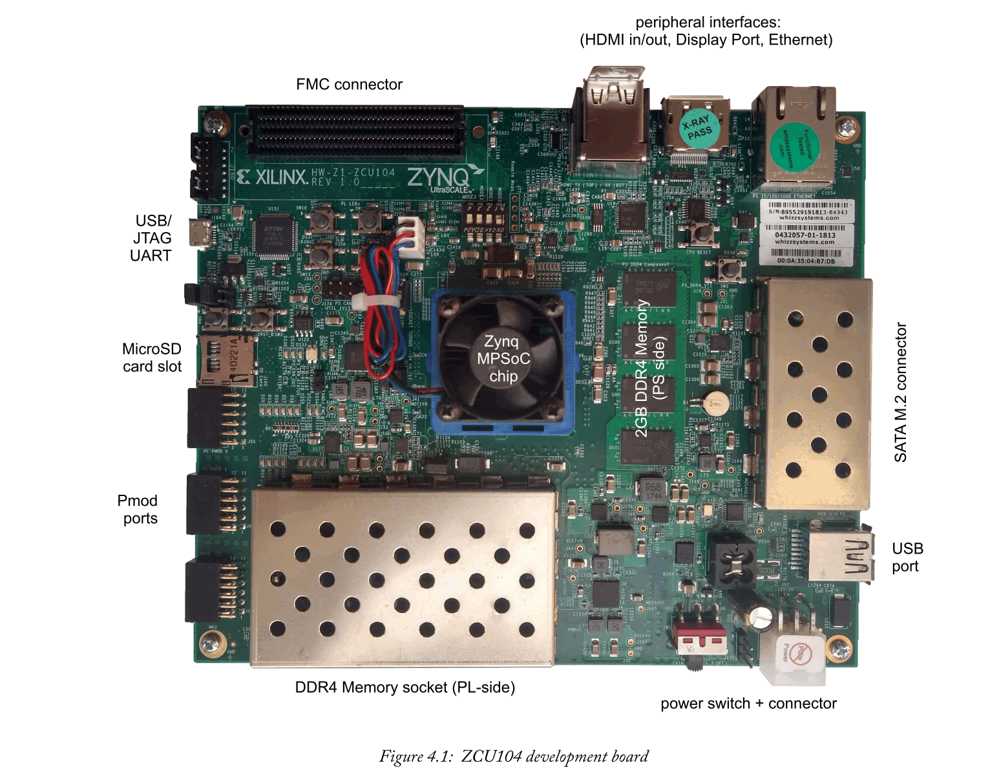

### 4.1.2  The Hardware System
使用Zynq MPSoC器件时，可以使用许多硬件资源，如第3章所述。这包括PL，PS和一系列支持各种标准的外设接口。可能没有必要为特定系统使用所有可用的硬件元素，并且设计者可以完全灵活地仅包括满足其要求的子集。PL特别提供了“空白画布”，可以自由地实现任何系统设计。

设计人员使用Xilinx设计工具创建自己的定制硬件系统，可选择通过第三方设计工具进行扩充。此自定义硬件包括来自PS的所需元素，任何IP内核或将在PL，I/O连接，存储器，时钟和中断配置以及元素之间的接口中实现的其他功能。作为示例，硬件系统可以被设计为包括具有以太网和USB接口的PS，以及在PL中实现的定制IP核。完整的硬件系统代表了构建系统所有软件元素的基础;软件在PS上运行并与系统的硬件元件通信。图4.2中提供了描述这种想法的简单图表。

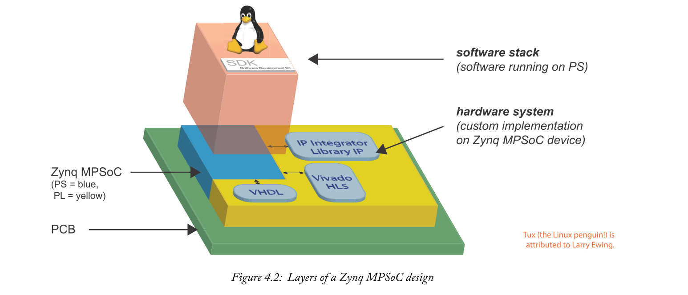

这个硬件系统是如何创建的？设计硬件系统的方法是使用Vivado IP Integrator工具为系统创建框图。IP Integrator Diagram包括一个代表Zynq MPSoC器件PS部分的块，用于在PL，PL-PS互连，存储器接口块等中实现的IP模块。图4.3显示了一个示例IP Integrator框图，其中PS块由大型“ZYNQ UltraSCALE +”徽标表示。Vivado自动生成代表设计“顶层”的HDL代码，此后，可用于执行在目标设备上实现硬件系统所需的综合，实现和比特流生成步骤，并生成编程文件。

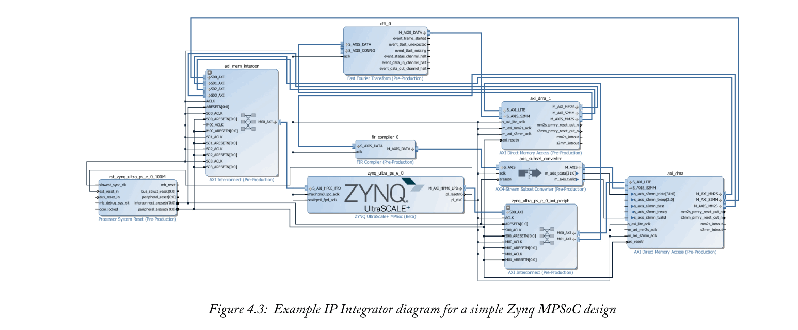

另请注意，Viv​​ado IP Integrator中执行的所有操作都具有Tcl命令等效项。因此，作为在IP Integrator中绘制图表的替代方法，可以通过执行脚本来创建相同的硬件系统。例如，基于脚本的方法对于快速且可靠地复制先前创建的设计可能特别有用。它还为第三方设计工具提供了利用IP Integrator功能的方法。

Xilinx SDx工具可用于整个系统设计（即软件，硬件和所有元件之间必要的接口），使用基于软件的描述作为设计方法。在SDx环境中进行设计时，Vivado在后台调用，对用户透明。本书稍后将深入讨论SDx。

Vivado和SDx方法的共同点是结合IP核的想法 - 在Zynq MPSoC器件的PL部分内实现的设计元素。Xilinx在IP Integrator中提供了一个IP核库，可以根据用户要求进行参数化，如果需要，也可以合并由第三方开发的专业IP核。使用SDx时，某些软件功能映射到现有IP内核，否则，它们被设计为实现为自定义硬件功能。

更一般地说，设计人员可能希望创建自己的IP内核以补充现有的库IP。有许多可能的方法可用于创建IP内核，包括HDL开发，基于块的设计和高级综合（HLS）。在每种情况下，Xilinx和第三方都可以使用这些工具来支持这些设计方法。IP创建是硬件设计的一个重要方面，将在第11章进一步讨论，并在[5]和[6]中在Zynq-7000设备的背景下进行了介绍（适用相同的原理和过程）。

### 4.1.3  The Software Stack
在硬件上运行的软件可以被视为不同层的“堆栈”，如图4.2所示。我们现在可以开始考虑构成堆栈的层。

图4.4中所示的简化模型是一个有用的起点。这里，软件堆栈的底层是一组驱动程序和低级函数。它们以位于硬件和OS之间的板级支持包（BSP）的形式实现，或者作为OS的组成部分实现，并且在两种情况下都能够与硬件系统连接。软件应用程序在OS之上执行，并形成堆栈中的最高层。这些可以包括诸如web浏览器，数据库，游戏之类的程序，以及可能需要的任何其他类型的应用程序。

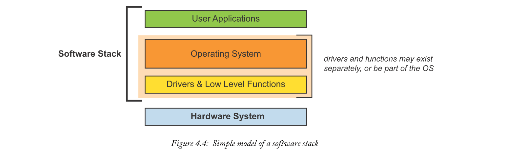

最值得注意的是在Zynq MPSoC中，由于它有多个处理核心分布在APU和RPU上，实际上可能有几个软件堆栈 - 甚至每个处理核心都有不同的堆栈！在系统中还可以存在与PMU，视频编解码器等相关联的其他软件栈，以及在PL中实现的任何软MicroBlaze处理器核。与Zynq-7000（没有RPU，其APU只有两个应用处理器核心 - 或者在Zynq-7000S中，只有一个！）相比，有更多的排列。

如果设计的Zynq MPSoC硬件系统包括APU和RPU，我们通常会假设部署了两种不同类型的操作系统：APU上的桌面/嵌入式操作系统，以及RPU上的实时操作系统。还存在其他可能性，包括将APU或RPU与单个OS隔离使用，直到更复杂的情况，其中不同的OS在单个核上运行。我们无法涵盖本书中的所有软件堆栈可能性。相反，关注一个通常采用的子集更有用：Linux作为主要操作系统，在APU的A53处理器上实现;和FreeRTOS部署在RPU的R5核心上。第12章提供了有关这些软件堆栈以及“Baremetal”应用程序的扩展详细信息。

在OS开发方面，Xilinx提供PetaLinux，它代表一组Xilinx特定的Linux开发工具和支持，而'Baremetal'选项（适用于简单设计的轻量级OS）可通过Xilinx软件开发套件（SDK）获得。第三方选项包括其他类型的Linux，尤其是Yocto项目[54]，其中包含对Xilinx的Zynq，Zynq MPSoC和MicroBlaze处理器[44]的特定支持，以及用于实时处理的FreeRTOS [10]。其他可能性包括Windows IoT和Windows Embedded版本以及VxWorks。Android操作系统（通常与智能手机和平板电脑相关）是另一种选择，特别是对于采用触摸屏类型用户界面的系统[2]。可以从此专用Wiki页面获取有关第三方操作系统的指导：http://www.wiki.xilinx.com/3rd+Party+Operating+Systems

Zynq MPSoC的软件可以使用各种不同的工具开发。其中包括作为Vivado软件开发套件的一部分提供的Xilinx SDK。替代开发环境包括第三方工具，如Microsoft Visual Studio [19]和Arm DS-5 Development Studio [3]。

还提供其他专业软件工具和组件，包括用于支持非对称多处理（AMP）的虚拟机管理程序和工具，它指的是处理器的各个核心托管不同操作系统的情况。这些主题将在第13章中介绍。

总之，可以认为Zynq MPSoC系统包括许多层。忽略Zynq MPSoC器件所在的PCB，最低级别是设计人员开发的硬件系统，其次是各种软件层，从低级驱动程序一直到应用程序。第12章将继续更详细地讨论软件堆栈，以及一些可用的选项。

## 4.2  The Design Process
创建Zynq MPSoC嵌入式系统的设计过程可以通过“设计流程”来表征，从捕获要设计的系统的要求开始。然后，设计师或设计团队会详细考虑项目，对将要采取的方法做出关键决策，并制定适当的计划和时间表。就实际设计过程而言，“流程”是指创建设计所涉及的阶段或过程的顺序 - 即硬件和软件组件，以及接口 - 以及设计流程的替代方案。周围的问题包括分析，测试和文档。

### 4.2.1  Requirements and Specification
在着手Zynq MPSoC系统设计时，主要的初始任务是生成一组功能和性能要求。这将捕获设计的目标特征，并最终影响随后的所有设计选择。捕获的需求可以发展为系统的正式规范。

随着最终目标的确立，将告知选择目标设备，设计工作量和所需资源的估计，设计团队的组成（硬件，软件，系统工程，算法专家等），设计方法和开发工具的选择，以及一般项目规划和调度。

### 4.2.2  Project Decisions and Planning
基于Zynq MPSoC进行设计可能是一个复杂的项目，包含许多不同的元素，需要设计团队的输入，而不是由一个人完成。该系统还可能涉及必须遵守的商业，安全或其他特定约束。因此，规划和执行Zynq MPSoC项目的范围很广，我们选择通过提出应该考虑的一些相关问题来解决这个问题。
- 分区 - 如何对系统功能进行分区？换句话说，系统的哪些部分将在硬件中实现，哪些部分在软件中实现？他们将如何接口？
- 硬件要求 - 目标设备有哪些要求？PL需要多大？应用程序需要多少片上存储器？是否需要2个或4个APU核心？是否需要任何特殊功能，如VCU？
- 软件要求 - 如何组成软件堆栈？对于每个，哪个是操作系统最合适的选择？是否对管理程序或其他特殊组件有任何要求？
- 设计工具/方法 - 将采用哪些一般设计流程？将使用哪些工具和方法来开发系统的硬件和软件组件？
- 调试和分析 - 在设计过程中是否可以让所有工程师访问物理开发板？虚拟平台（QEMU）会有用吗？将采用什么策略进行性能分析，测试和调试？
- 项目计划和资源 - 将参与项目的工程师有哪些技能？各种设计，接口和测试任务可能需要多长时间？这些任务之间的依赖关系是什么？

显然，有许多因素需要牢记！

值得注意的是，本书的部分内容中详细讨论的SDx开发环境实际上简化了上述一些决策。特别是，SDx提供了用于分析代码和优化跨硬件和软件元素的功能划分的工具。

### 4.2.3  Design Flow
值得重新审视引言（第1章）中概述的两种设计流程模型。它们是：（i）单独设计硬件和软件的标准方法;（ii）基于SDx工具的更新的“软件定义”方法。如图4.5所示，这两种替代方案代表了Zynq MPSoC的不同设计方法，后者更加注重软件技能。

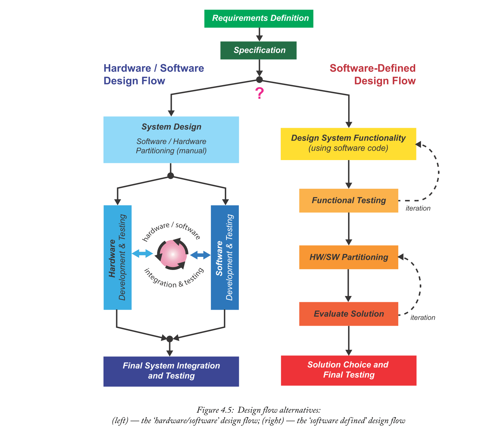

在本书的其余部分将介绍和讨论这两种方法。标准的硬件/软件设计流程在本书的C部分（第11章中的硬件系统的开发，以及第12章到第15章中的软件开发的各个方面）中有所介绍。基于Xilinx SDx工具的软件定义设计流程在D部分详细介绍。

如图4.5所示，测试是两种设计流程的一个组成部分。

### 4.2.4  Testing
测试显然是开发任何嵌入式系统的一个重要方面。在“硬件/软件”设计流程中，软件和硬件组件可以在集成之前单独测试（例如SDK中的软件或其他开发环境，HDL模拟器中的硬件组件，Simulink，Vivado HLS等），并进行系统测试在开发板上进行。在开发板上进行测试之前，可以选择使用系统仿真器（QEMU）作为预备步骤来执行功能仿真，这允许软件像在目标处理器上一样运行。

在“软件定义”设计流程中，采用迭代方法进行测试，首先验证开发的软件代码的功能正确性。接下来，在确定最终解决方案之前，进行进一步的测试和评估，同时将部分代码划分为硬件。在软件定义的设计流程中，解决方案的硬件部分在“SDx平台”上实现，该平台对应于基于目标开发板的基础硬件系统。

## 4.3  Getting Ready: Design Tools and Development System Setup
在我们开始为Zynq MPSoC开发任何设计之前，有必要提供相关的硬件和软件组件，并配置将进行开发的计算机系统（“主机”系统）。

### 4.3.1  Host System
要解决的第一个问题是在主机上运行的操作系统。

Xilinx工具支持各种版本的Windows和Linux，只要您安装了支持的操作系统之一，您就可以开始使用。Vivado支持的操作系统列表可以从[32]获得。也就是说，Zynq MPSoC的Linux开发（除了专门通过SDx  - 参见第15章）将需要访问安装了Linux的计算机或虚拟机。

就一般系统要求而言，根据您希望安装的工具组合，并且允许一些空间来创建项目文件，必须具有至少50-100GB的可用磁盘空间。

#### Operating System Requirements for Linux Development
如果您是常规Linux用户，则应确保Xilinx PetaLinux工具支持您运行的Linux发行版。[37]中给出了支持的版本列表。如果您的安装是受支持的Linux版本之一，那么您可以直接进入第4.3.2节。

除非您已在主机上运行受支持的Linux版本，否则有几种可能的选择： 
- 1.您可能希望为Zynq MPSoC开发工作专用一台计算机，并在其上安装受支持的Linux版本。
- 2.您可以在现有操作系统旁边的主计算机上安装受支持的Linux版本。这将允许您具有双启动配置，并具有在启动时启动到Windows或Linux的选项。详细说明如何配置这样的设置超出了本书的范围，但在线提供了很好的教程。（只需记住在进行系统更改之前要小心并备份数据！）
- 3.第三个也是最简单的选择是在现有操作系统上运行的虚拟机中安装受支持的Linux版本。此选项不需要任何系统更改。这种方法的一个限制是与硬件板的接口可能很困难（例如，通过JTAG编程），但是在大多数情况下，我们只是将文件复制到SD卡，然后将SD卡插入开发板上的插槽中，这可以 在这种情况下很容易完成。

本书中介绍的原理和示例在很大程度上与主机操作系统配置无关，因此无论您采用上述三个选项中的哪一个，都应该很容易理解。唯一需要注意的是，我们将采用Ubuntu Linux，它是PetaLinux支持的四种操作系统之一。如果您不使用Ubuntu而是使用其它，那么您可能会发现一些细微差别，如果按照本书附带的教程，您可能需要稍微调整一下这些步骤。

### 4.3.2  Xilinx Software Components 
Xilinx提供了一套用于系统开发的软件工具。介绍这些工具并概述它们的不同角色非常有用，同时也强调操作系统对它们的支持。首先，提供了一些有关从Xilinx获取软件和许可问题的一般指导。

#### Sourcing and Licensing Software
使用Zynq MPSoC所需的所有软件均可从Xilinx网站下载：http://www.xilinx.com/support/download.html

要下载软件，用户首先需要使用Xilinx帐户登录。如果您还没有帐户，那么将有机会首先注册一个帐户（创建帐户是免费的）。

本书涵盖的软件组件包括：
- Vivado Design Suite - HLx Editions
- Software Development Kit (SDK)
- PetaLinux
- SDx

这些都可以通过本节前面提供的链接位于下载门户中。请注意，Viv​​ado和SDx的下载适用于Windows和Linux操作系统，而PetaLinux仅适用于Linux（通过在虚拟机中运行Linux，可以在Windows计算机上安装）。

在安装Vivado Design Suite时，将向用户提供要安装的工具版本选择。表4.2提供了选项的简要概述，并确认系统和设计版本适用于Zynq MPSoC开发，WebPACK也是如此，前提是您的目标Zynq MPSoC器件是较小的器件之一。在某些情况下，软件抵用券可能与一些开发套件一起包括在内;通常这种抵用券被设备锁定在套件中提供的电路板上，在这种情况下，WebPACK版本就足够了。

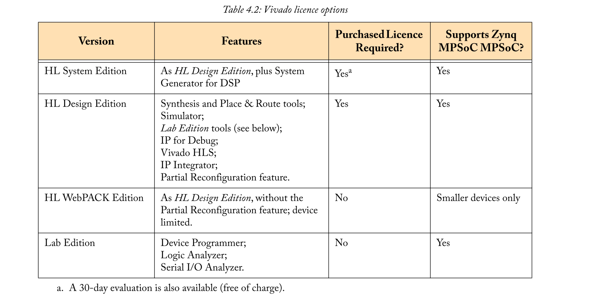

作为表4.2中列出的软件组件的一部分，值得强调Vivado中的部分重新配置功能。部分重新配置是一种技术，允许重新配置FPGA的一个或多个部分，或者等效于Zynq或Zynq MPSoC器件的PL部分，同时器件的所有其他区域继续工作而不受影响[35]。通过允许PL的各部分与不同的功能模块进行时间复用，FPGA的这种高级使用提高了它们的灵活性。

如果使用WebPACK版本，则无需生成软件许可证。另一方面，如果您拥有设计或系统版本的许可证授权或软件凭证（例如随附套件），则可以使用Xilinx许可门户在以下位置创建许可证：http://www.xilinx.com/getlicense

可以为单个计算机生成许可证（“节点锁定”），也可以为网络上运行的许可证服务器（“浮动”）生成许可证。[43]中提供了关于许可证生成和设置的广泛指导。在生成许可证之前，建议阅读本章的其余部分和Xilinx许可文档。

#### Vivado Design Suite 
Vivado为Zynq MPSoC（以及所有其他Xilinx器件）的硬件系统开发提供了一个集成环境。当前版本的工具表示为HLx，反映出高级综合功能是Vivado Suite的一部分。

Vivado Suite包含各种不同设计方法的设施，包括： 
- 系统级框图（IP Integrator工具，可访问可参数化的Xilinx LogiCORE IP内核库，以及任何用户设计的IP内核，以及轻松连接它们的工具）;
- HDL开发和仿真，即使用VHDL或Verilog语言设计硬件（由Vivado仿真器支持）;
- DSP系统开发（使用System Generator for DSP，一种在MathWorks Simulink环境中运行的基于块的工具）;
- 来自C / C ++ / SystemC代码的高级综合（Vivado HLS工具）;
- 使用第三方工具创建的IP内核的打包和集成，或从第三方供应商获得的IP内核（使用IP Packager功能引入IP Integrator）。

这些技术之前已在The Zynq Book [5]中引入，并在[6]中针对Zynq-7000器件进行了演示，重点介绍了Zybo和ZedBoard开发板。本书中的设计实例和教程也将使用一些相同的工具和方法。

用于Zynq MPSoC的硬件系统的开发可以结合上述几种设计方法，但在最简单的情况下，它只需要一个（IP Integrator工具），其中系统设计仅需要IP Integrator库中可用的IP。在其他方法中，HDL开发代表了低级别的抽象，需要专业的VHDL或Verilog语言技能，并且可以说涉及最高程度的设计工作，从而实现最优化的设计。相比之下，HLS设计输入是基于软件的，并且可以利用最常见的软件编码技能。DSP IP的开发与算法开发密切相关，System Generator与Simulink的集成提供了对有用仿真功能的访问。

在设计进入阶段之后，Vivado提供了一个集成的“流程”，包括从源代码和方框图进行设计所需的各种过程，一直到用于对Zynq MPSoC进行编程的比特流（.bit）文件。硬件系统。涉及的主要步骤是：

- Synthesis - 此阶段涉及将HDL代码转换为网表文件，该文件表示低级门和连接方面的设计。
- Implementation  - 由三个子流程（转换，映射和布局布线）组成，实现涉及将设计的网表表示转换为特定于设备的实现，其中定义了精确的资源，配置和信号路由。
- Bitstream generation - 最后一步是从实现的设计中创建比特流文件。然后可以将比特流文件下载到设备上以使用硬件系统对其进行编程。

这三个过程可以使用Vivado GUI以交互方式运行，也可以使用Tcl编写脚本（也分别称为项目模式和非项目模式）。生成各种统计，报告和视图，包括资源利用率和时序报告，原理图视图和设备布局图。设计者可以解释此信息并用于优化设计。

Vivado允许用户设置设计约束，换句话说，配置或限制实现的某些方面。示例包括设置I / O引脚和标准，定义PL上设计元素的位置，以及限制时钟和/或其他信号的时序。约束在Xilinx设计约束（XDC）文件中指定，并作为合成和后续过程的输入提供。XDC文件既可以手工编写，也可以从主约束文件（通常由电路板供应商提供）编辑，或者在某些情况下，设计工具会自动生成约束。

Vivado界面的屏幕截图如图4.6所示，基于Vivado 2017.1软件版本中包含的参考设计，并突出显示了选定的部分。特别注意左侧的面板引导用户完成“设计流程”，即与设计输入和模拟有关的步骤，然后是合成和实现，最后是比特流生成和设备配置。在主设计窗口（右上角）中，Vivado显示了使用IP Integrator工具生成的框图;根据正在进行的任务，可以在该区域中显示各种其他内容。

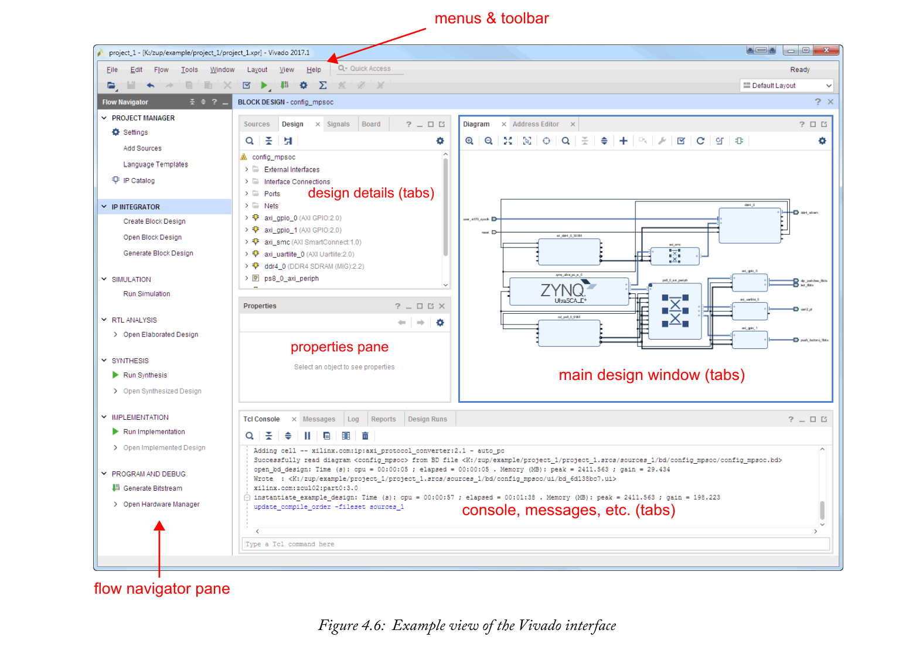

#### Software Development Kit (SDK)
Xilinx SDK可以选择与Vivado一起安装，也可以单独下载和安装（后者对于不参与硬件系统设计的软件工程师来说非常方便）。

SDK是一个基于开源Eclipse®平台的软件开发和调试环境。它允许针对Zynq MPSoC器件中可用的处理器类型开发应用，即APU中的Arm Cortex-A53处理器，RPU中的Arm Cortex-R5处理器以及设计中使用的任何MicroBlaze处理器（这些可能是可选的）在PL中实例化，也构成了平台管理单元（PMU）的基础。

还可以在SDK中创建板级支持包（BSP）。BSP是一组定义的硬件的软件接口，包括一组允许系统的软件和硬件元件进行交互的驱动程序。因此，BSP可以被认为是软件堆栈的最低级别，而“硬件”是指使用Vivado在目标设备上进行部署而设计的自定义硬件系统。

可用于在SDK中生成BSP的操作系统选项包括：
- Baremetal - 一种轻量级操作系统，具有基本的低级功能，适合简单的要求。
- FreeRTOS  - 用于实时应用的操作系统; 在确定性时间至关重要的地方需要。
- Linux  - 用于丰富应用程序开发的完全成熟的操作系统。

有关每个OS选项的更多详细信息，请参见第12章。

SDK还包括用于软件开发和调试的各种其他工具，包括基于GNU的编译器，通过JTAG对目标器件进行编程的工具，以及用于调试在开发系统上运行的代码的功能。有关与Zynq MPSoC开发相关的SDK的更多信息可以在[51]中找到。

#### PetaLinux Tools
Linux是嵌入式设备最常用的操作系统之一，有各种各样的Linux发行版，如Ubuntu，Debian，Fedora等。PetaLinux代表了一套针对Xilinx设备的Linux开发工具，以及使开发人员能够使用其他系统软件组件（引导加载程序，虚拟机管理程序等）。由于PetaLinux适用于软处理器和硬处理器，因此可以为“软”MicroBlaze内核以及Zynq和Zynq MPSoC上的Arm处理器生成操作系统。也可以将Xilinx Quick EMUlator（QEMU）虚拟平台作为物理处理器的目标，这样便于软件开发和测试，无需访问开发板[50]。

PetaLinux（或PetaLinux工具）安装在主机上并用于开发，并与其他Xilinx工具进行一些交互，例如： Vivado用于生成部署Linux系统的硬件平台，而Xilinx SDK可用于开发软件应用程序。PetaLinux由Xilinx提供和支持，并通过免费许可证提供。使用PetaLinux，开发人员可以：
- Create or Reuse Board Support Packages (BSPs) ：在基于当前硬件系统生成BSP之后，PetaLinux能够随后保持同步，即在对硬件系统进行改变时更新驱动程序。这很有用，因为硬件系统可能在设计过程中经历多次迭代。
- Customise, Build and Package Linux：设计人员可以构建构成Linux系统的各种组件，包括内核，库，引导加载程序和文件系统（注意：Linux的更详细介绍见第15章）。如果需要，可以选择自定义任何这些组件。PetaLinux还有一个工具，用于将Linux的各个部分打包成一小组文件，然后传输到目标系统，然后启动。
- Create and Integrate Custom Components：PetaLinux中提供了可用于开发自定义组件（例如设备驱动程序，应用程序代码，库等）的模板，并将它们集成到PetaLinux项目中。
- Work with Reference Files：作为PetaLinux的一部分，用户可以从Xilinx下载站点获取所选平台的参考BSP; 例如，BSP可用于ZCU102板（请注意，BSP不是主要PetaLinux下载的一部分，必须单独获取）。参考BSP代表一个基本的“快速启动”选项，可以适用于自定义项目。此外，主要的PetaLinux下载包括Linux的参考发行版，其中包括所有主要系统组件，并已经过验证，可在Xilinx器件上进行部署。这组文件可用作特定于用户的设计的起点。

值得注意的是，PetaLinux并不代表Linux的特定发行版，而是让用户能够使用他们想要的发行版。在Xilinx器件上部署的流行发行版是Xilinx Linux发行版[33]和Yocto项目[44]。此外，我们应该提到使用PetaLinux并不是开发在Xilinx Zynq MPSoC器件上运行的Linux系统的唯一方法 - 可以使用各种其他Linux开发工具，最终操作系统的选择取决于用户要求和偏好。然而，新的Linux用户可能会发现，由于Xilinx特定支持和文档的可用性，PetaLinux是在Zynq MPSoC上运行操作系统的不错选择[36]，[37]。

#### SDx — for the ‘Software Def ined’ Design Flow
SDx是一种相对较新的工具，它基于Vivado HLS的功能，可以从高级（C，C ++或SystemC）代码生成硬件[39]。这些工具之间的区别在于SDx允许使用软件代码描述整个系统，而Vivado HLS特别关注生成硬件系统的部分。在SDx中，设计从作为PS上运行的软件程序开始。代码的某些部分将被识别为适合卸载到硬件，然后将这些部分生成为IP。SDx自动管理软件和硬件之间的接口和数据传输。此外，还存在在目标平台上部署Linux（如Linux）的选项。

虽然这听起来很简单（！），但Xilinx工具在后台工作还有很多工作要做。**他们必须使用目标设备的知识（例如，其性能和可用资源），生成IP内核，在处理器和IP内核之间创建AXI连接，建立所有必要的低级电路，如时钟，复位和中断， 并构建操作系统**。在选择Linux的情况下，生成的输出之一是可以加载到SD卡上，传输到开发板并用于直接引导系统的映像。如果没有SDx，设计人员（或设计团队）负责手动处理所有这些方面，因此使用SDx可以显着缩短开发时间。

设计人员仍然保持对SDx生成的系统实现的高级控制。他或她可以指导有关应将哪些功能划分为设备的PL部分的工具，并在此过程中，通过使用“指令”来定义实现的其他方面，例如流水线操作，并行操作和接口连接。集成的分析工具可用于报告所考虑的实施“解决方案”的相对性能，延迟和资源成本，从而为设计决策提供信息。关于SDx的进一步讨论将在本书的D部分中进行。

#### A Note on Third Party Tools
第三方提供了许多其他开发工具，可以为Zynq MPSoC提供不同的设计方面。
这些范围从HDL仿真环境到基于块的系统设计，再到软件和硬件调试工具; 并包括商业和开源软件。设计公司可以采用一套适合他们要求的首选工具。

这些第三方工具构成了Xilinx SoC器件周围存在的“生态系统”的一部分，将在第20章进一步讨论。

### 4.3.3  Hardware Requirements
除了主机之外，理想情况下还应该有Zynq MPSoC开发板及其相关电缆，以便进行Zynq MPSoC系统的设计。Zynq MPSoC开发板的一个例子是ZCU102，它在4.1.1节中有描述，如4.1节所示（更多关于开发板的内容将在4.4节中介绍）。另一方面，如果您无法访问开发板，那么仍然可以使用Xilinx工具与QEMU仿真器一起取得进展。QEMU支持在功能等效（但不是时序等效）的基础上仿真Zynq MPSoC设计，这使其特别适用于测试APU目标软件。

假设使用电路板套件进行开发，还有一些其他硬件可能有用。特别是，我们需要将文件写入SD卡，然后传输到开发板进行编程。
- SD卡读卡器/写卡器 - 您的计算机可能配有集成的SD卡读卡器和写卡器，如果没有，则可以低成本（5-10美元）购买独立的USB版本。
- SD卡 - 用于存储文件的介质，使用Class 10卡非常重要（低速卡可能无法使用）。8GB或16GB容量的卡足够大，适合大多数用途。这种卡的成本也很低，大约在5美元到10美元之间。
- 以太网电缆 - 套件中可能包含以太网电缆，但如果没有，则可以使用以太网电缆（短电缆不到5美元）。这将用于您的计算机和开发板之间的数据传输。结合下一个项目考虑这一点。
- USB转以太网适配器 - 如果您的计算机上没有用于连接开发板的备用以太网插座，那么一个很好的选择是使用USB转以太网适配器。它使用USB插座连接到计算机，并提供可连接到开发板以太网端口的以太网插座。这个项目的估计成本是15至25美元。

根据所开发的系统，可能需要其他电缆和外部硬件。例如，如果开发具有DisplayPort输出的视频处理系统，则还需要兼容的监视器和电缆。

## 4.4  Development Boards and Supporting Resources
设计团队通常采用标准的商用开发板进行原型设计，至少在初始阶段（最终结果可能是开发定制板）。其他项目，特别是学生项目和学术研究，可能只使用标准开发板。使用这种平台的优点在于它是由制造商预先验证的，并且可能存在可重复使用的组件，参考设计和其他支持。此外，由于许多其他工程师可能使用同一块电路板，也可以通过支持论坛和在线社区找到帮助 - 这是一个很好的例子。http://www.zedboard.org/  该网站最初是为ZedBoard（Zynq-7000板）推出的，后者也已扩展到包括Zynq MPSoC系统级模块（SOM）在内的其他产品。ZedBoard网站包括论坛和社区分享想法，问题和正在进行的工作的机会。

您的开发板应附有支持其使用的各种资源（通常通过下载）。需要注意的重要事项是：
- 用户指南 - 除了与Zynq MPSoC器件相关的用户指南和文档外，还可能为开发板提供指南。这将包括有关各种组件的详细信息，以及有关设置和编程/启动电路板的指导。
- Board support files - 这组文件被复制到Xilinx开发工具的安装目录中，并允许Vivado在开发设计时为用户提供特定于电路板的选项。例如，如果系统要包括通用输入输出（GPIO），则将GPIO块放入Vivado IP Integrator设计中，并进行适当连接。在安装了板支持文件的情况下，GPIO块预先填充了目标板的可用选项，例如， 8个LED，4个按钮等。
- Constraints file (*.xdc)——约束文件提供了Zynq MPSoC器件上所有输入/输出引脚的列表，给出了它们的位置（字母数字标识符，如'AE9'，'P7'等），以及与每个引脚相关的I/O标准。这可能是包含大型Zynq MPSoC的电路板的长列表！用户必须编辑该文件以删除（或注释掉）当前设计中未使用的端口，并且如果命名与约束文件中给出的默认值不同，则重命名顶级端口。
- Targeted Reference Designs (TRDs)——Xilinx提供TRD，使设计人员能够了解如何使用电路板的功能，从而使新设计能够更快地进行。根据所讨论的电路板，可能有许多TRD可用于说明不同接口或功能的使用。
- Schematics and Bill-of-Materials (BOM) files——Schematics和BOM文件提供了一个对那些希望开发自己的定制板的人有用的参考。例如，公司可能希望使用更大的Zynq MPSoC器件和/或不同的外部存储器和接口组合来开发自己的电路板。了解如何设计开发板，并列出所有使用的组件，提供了一个很好的起点！

## 4.5  Resources and Support
Zynq MPSoC设计有许多资源可用于设备本身，开发板和可用于开发Zynq MPSoC系统的软件工具。这包括文档（用户指南，参考手册等），参考设计和教程以及其他在线支持。虽然一些参考资料是Zynq MPSoC特有的，但通常支持Xilinx SoC和FPGA设计。访问Xilinx文档，知识库和论坛的中心点是通过以下链接：http://www.xilinx.com/support.html

在接下来的几页中将对所选资源类型和支持进行介绍。
### 4.5.1  Information about Zynq MPSoC Devices
本书旨在提供对Zynq MPSoC器件及相关工具和设计流程的可访问介绍，但不能像Xilinx技术文档中尽可能深入地介绍Zynq MPSoC。Xilinx发布并维护了许多关键文档，以提供有关这些器件各个方面的完整详细信息。值得强调的是：
- Zynq  UltraScale+  MPSoC  Overview  Data  Sheet  (DS891) ：一个紧凑型指南（约40页），包括关键功能列表，产品表以及设备上存在的资源的简要高级描述[49]。
- Zynq MPSoC Technical Reference Manual (UG1085) ：详细的1000多页Zynq MPSoC架构指南！见参考文献[52]。
  
由于PL架构的等效性，Zynq MPSoC，UltraScale和UltraScale + FPGA使用共同的用户指南是常见的。其中包括有关CLB，存储器，DSP资源，输入/输出模块和高速收发器，时钟资源等的指南，可通过Xilinx支持站点的文档部分轻松找到。

需要强调的是，Zynq MPSoC上的处理系统基于Arm组件（即应用程序和实时处理器，以及图形处理器）。有关架构的这些元素的详细信息应直接从Arm获得 -  Xilinx仅记录Xilinx特定的方面，而Arm处理器使用更广泛，并拥有自己的专用文档。

### 4.5.2  Software Tools Support
如第4.3.2节所述，Zynq MPSoC的设计涉及熟练掌握一个或多个软件工具，具体取决于您在开发团队中的角色或您的首选设计方法。有几个地方可以寻找这些工具的支持：
- ‘Quick Take’ videos ：短视频（大多数不到15分钟）介绍设计工具，或解释工具和目标设备的特定功能。
- Design Hubs and technical documentation ：Design Hubs是整理所有技术文档和与特定软件工具，设备或开发板相关的其他资源的网页。这包括用户指南，数据表，应用说明，白皮书，参考设计以及其他相关资源的链接。这些材料都可以单独获得。软件文档的子集特定于Zynq MPSoC设备，例如， Zynq的OpenAMP和QEMU指南
- Training  and  tutorials：由Xilinx或授权培训提供商运营的正式培训课程（通常按成本计算）。Xilinx大学计划（XUP）还为学术界举办研讨会。还可以下载自定进度的教程式材料，采用指导文档和设计文件的形式。
- Knowledge Base：与常见查询，已知问题和其他杂项支持问题相关的答复记录目录。这些由Xilinx工程师维护，包括详细的版本和状态信息。
- Community forum：Xilinx托管的论坛可供工程师发布问题并与其他用户就感兴趣的主题进行交流。Xilinx员工温和，可能有助于论坛讨论。
- Xilinx Wiki:使用Xilinx工具和设备的社区可编辑指南。http://www.wiki.xilinx.com/
- Xilinx Github：可从Xilinx获取参考代码的门户网站。https://github.com/xilinx
- Documentation Navigator：一个软件应用程序，可轻松访问Xilinx文档。可从Xilinx下载站点获得，可以单独使用，也可以作为Vivado的一部分，在开发计算机上安装。

请记住，第三方信息来源也很有用 - 例如，嵌入式系统杂志和期刊。对于非Xilinx特定的开发工具和软件的那些方面，将有单独的文档和支持。这包括设计工具，如MathWorks的MATLAB和Simulink工具，National Instruments的LabView，以及您可能希望在Zynq MPSoC上部署的软件组件，包括Linux，FreeRTOS，Android，Xen Hypervisor等。

### 4.5.3  Support for System Design
Xilinx为设计人员提供了正式的指导，以便从他们的系统设计中获得有利的结果，称为UltraFast设计方法。该方法的所述优点是基于一组有经验的用户的经验而开发的，旨在“最大化系统性能，降低风险并实现加速和可预测的设计周期”。

有一些UltraFast设计方法指南，涵盖不同的主题。感兴趣的主要文件是UltraFast Embedded Design Methodology Guide[41]，在此Xilinx网页上整理了补充信息[40]。

## 4.6  The Wider Ecosystem
Zynq-7000在过去五年左右已经成熟。它的广泛采用部分是由于享有各种类型的丰富支持资源，其中许多资源来自第三方。这就是我们所谓的“生态系统” - 这是一个相对非结构化的外部活动和资源体系，它补充了Xilinx的核心设计工具，开发板和支持，并且有机地成长和发展。

该生态系统包括许多参与补充活动的公司和组织，包括标准，设计和调试工具，开发板和附加卡以及各种软件组件的开发。它还包括培训资源，咨询服务，网站和博客，以及在该地区工作的工程师和软件程序员的“社区”。访问这些资源可以更快，更轻松地创建基于Zynq的高质量系统。生态系统的存在也意味着开发人员在创建系统设计时使用的工具，方法和平台有更多的选择自由。

与设备本身一样，Zynq MPSoC的生态系统与Zynq有许多共同之处。与Zynq相关的许多资源也与Zynq MPSoC相关。例如，多进程工具适用于Zynq，但对于充分利用Zynq MPSoC更有价值。使用Zynq MPSoC，PS中有更多不同的资源，以及更多的处理元素，这扩展了其设计可能性。Zynq MPSoC上的其他处理元素，如图形和视频编解码器单元，带来了新的可能性，因此扩大了支持生态系统的范围。

图4.7提供了生态系统的概念图。在本章的其余部分中将对这些气泡中的许多气泡进行更详细的讨论。

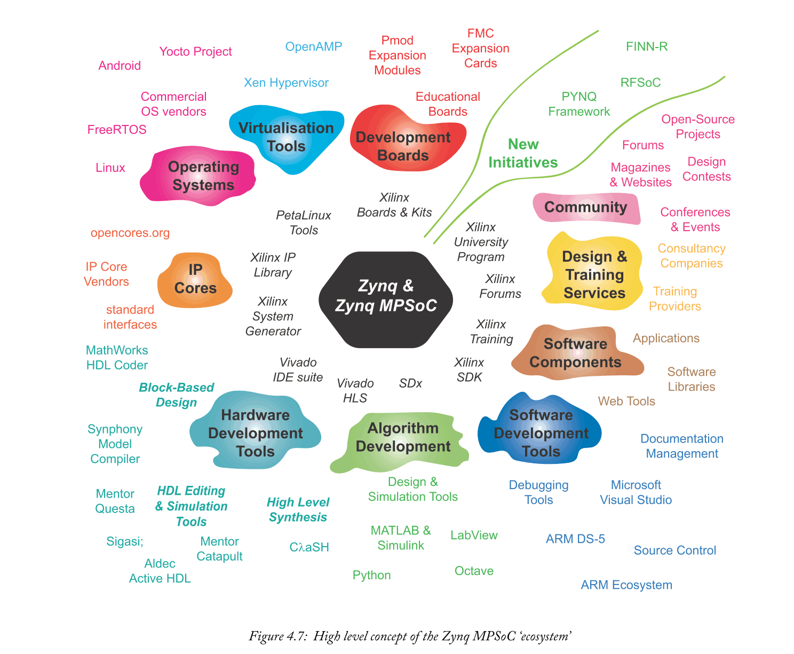

### 4.6.1  Hardware System Design Tools and Components
开发SoC设计（任何类型）的最基本资源之一是可用于此的设计工具集。鉴于Zynq MPSoC器件具有多方面的特性，它们属于几个不同的类别。我们首先看一下第三方硬件系统开发工具。

IP开发是硬件开发的主要方面，可以使用第三方工具和资源进行开发。设计人员可以选择使用各种不同方法之一生成自己的IP，或者从第三方（无论是免费还是付费）查找预生成的IP。可以使用Xilinx IP Packager工具将IP打包成标准的IP-XACT格式，与IP Integrator兼容[45]。值得注意的是，IP开发不是Zynq MPSoC特有的;相同的原理和过程也适用于Zynq和FPGA系统设计。

#### HDL-based Tools for Creating IP Cores
Vivado包括用于开发和测试HDL代码（VHDL或Verilog）的代码编辑器和模拟器，这是开发IP的主要方法。但是，如果愿意，可以在MentorGraphicsQuesta®AdvancedSimulator [18]或Aldec的Active-HDL [1]等开发环境中将HDL开发外部发展到Vivado。另一种选择是Sigasi;工具[25]，提供HDL代码开发和设计管理的高级功能，并可与模拟器配对进行调试和验证。

#### Block-based Tools for Creating IP Cores
Xilinx以System Generator的形式提供了一个基于块的设计工具，用于开发IP内核，该工具在MathWorks的Simulink工具之上运行[14]。其他第三方选项也存在。

MathWorks拥有自己的基于块的HDL生成工具HDL Coder [12]，它有助于从Simulink设计生成VHDL或Verilog（使用HDL可合成块的子集）以及MATLAB代码的子集。值得注意的是，HDL Coder在其自己的GUI中驱动Vivado进程。

#### IP Core Creation Using Software Languages
正如以前的类别，Xilinx提供了自己的工具。在这种情况下，HLS将基于软件的代码转换为HDL，采用Vivado HLS和SDx开发环境的形式。还有第三方替代品，例如Mentor®Catapult®工具[15]。HLS方法仍然是研究界广泛关注的领域，其中一个例子是LegUp HLS项目[28]。

从开源社区中出现的另一类设计工具使用类似HDL的软件语言。很好的例子包括CλaSH[4]，一种基于Haskell语言的硬件设计的函数式编程方法; MyHDL [20]使用Python作为设计语言，而Chisel [27]采用Scala。

#### Third Party IP Cores
当需要不存在于Xilinx IP库中的功能时，以及当设计者不希望创建所需的IP时，可以采用利用来自第三方的内核的设计重用。这可能是出于成本，上市时间或缺乏内部专业知识的原因。

获取第三方IP有两种主要途径：
- 通过开源渠道，核心作者使其IP可以免费使用。例如，可以从网站 www.opencores.org 获得这样的核心。开源内核具有零成本的优势，但可能没有商业上获得的IP带来的可靠性，文档或支持。因此，可能需要进行一些验证工作以确保开源IP的稳健性。
- 作为设计公司的产品购买。有些IP可能非常复杂，在开发成本方面具有很高的价值。例如，这可以包括用于视频处理，加密或通信的专业IP。这些IP的文档和支持通常可以从供应商处获得，供应商也可以提供参考设计。这种IP的一个例子是可从Xylon [53]获得的logicBRICKS图像和视频处理IP核。
  
无论使用哪种机制，从外部采购IP的能力都有可能节省大量的开发时间和成本，因此是一个有用的选择。

### 4.6.2 Software System Design Tools and Components
转到系统的软件方面，我们现在考虑可能包含在Zynq MPSoC设计中的各种第三方软件组件，以及创建它们所需的开发工具。

#### Operating Systems
开发Zynq MPSoC设计中最重要的决策之一是选择要采用的OS（或操作系统！）。由于设备上最多有6个内核（4个应用处理器和2个实时处理器），因此可能会使用多个操作系统。

应用程序处理器的主要选择可能是开源操作系统Linux。有几种Linux发行版，比如Ubuntu和Fedora，每种都有自己的在线社区和支持机制。一种选择是直接将此类分发部署到Zynq MPSoC。

还可以使用工具为目标嵌入式平台（如Zynq MPSoC）创建嵌入式Linux的自定义发行版。Xilinx PetaLinux工具使用基于开源Yocto Project [54]的Linux版本执行此功能。Mentor也可以在商业基础上提供基于Yocto的解决方案[17]。

其他第三方操作系统可能会随着时间的推移有机地移植到Zynq MPSoC。例如，FreeBSD [9]以前被开源社区移植到Zynq，最近，它也被移植到Zynq MPSoC。

对于RPU，可能需要专用的实时操作系统，这将比“裸机”方法提供显着的优势。FreeRTOS [10]是免费的（顾名思义！）并且被广泛使用，因此可能是Zynq MPSoC的Arm Cortex-R5处理器的流行选择。FreeRTOS的两个密切相关的替代品是OpenRTOS和SafeRTOS。这两者都代表商业软件，但提供额外的好处：在OpenRTOS的情况下，修改核心代码，不用共享您的更改;SafeRTOS是FreeRTOS的衍生产品，经过更高水平的分析，测试和文档记录，符合安全标准IEC 61508。

其他候选操作系统也适用于应用程序和实时处理器 - 有关详细信息，请参阅[31]。

#### Software Development Tools and Resources
Xilinx提供了自己的基于Eclipse的SDK工具以及PetaLinux工具，但开发人员也可以选择使用他们的开发环境偏好。可能的选项包括Microsoft Visual Studio和Arm DS-5 Development Studio [3]。所有这些环境都为代码编辑和调试提供了便利。

处理器仿真平台QEMU也可以是一种有用的工具，尤其是在无法对目标平台进行物理访问时。在这种情况下，QEMU可用于模拟Zynq MPSoC的PS，以及PMU的MicroBlaze处理器。QEMU是一个开源项目[24]，其中Xilinx专门为MicroBlaze，Zynq和Zynq基于MPSoC的处理器维护自己的分支[38]。

#### Software Components
Zynq MPSoC开发人员可能还需要其他软件组件来完成其设计，例如虚拟化管理程序和AMP。在这方面，随着产品和服务社区围绕其处理器核心成长，也可以利用Arm生态系统。

虚拟化软件的例子包括Xilinx积极参与的开源Xen Hypervisor项目[30]。支持在Zynq MPSoC上部署Xen [46]。另一种选择是Mentor的Embedded Hypervisor，它代表了一种商业替代方案[16]。OpenAMP（开放式非对称多处理）是多处理的另一个工具，Xilinx支持Zynq MPSoC [34]。

根据软件项目的要求，合并其他库和组件也可能很有用。有大量此类库和组件可用（特别是如果使用Linux），包括Web服务器，图形应用程序和软件库。软件库的示例包括用于图像和视频处理应用的OpenCV [22]。

#### Other Software and Support
软件开发还有其他一些方面，来自更广泛社区的工具和资源可能证明是有价值的。例如：
- 桌面虚拟机 - 当需要访问Linux操作系统以进行开发时（例如使用PetaLinux工具时），如果安装了Linux的计算机不可用，VirtualBox等虚拟机非常有用。
- 版本管理软件 - 软件开发项目，特别是涉及多个工程师时，可以从采用合适的源码控制中受益。目前流行的选择是GitHub，这是一种基于互联网的服务，可以在公共或私人基础上用于源控制和共享。
- 文档工具 - 像Doxygen这样的开源工具可以帮助创建和管理代码文档[8]。

### 4.6.3  Algorithm Development and Interfacing
与上一节略有不同，我们应该提到基于软件的工具，用于开发基于Zynq MPSoC的系统（包括针对PL和PS的元素）的实现算法。这里有很多可能性，包括标准软件语言，如C++。下面概述了其他一些可能性，但这肯定不是一个详尽的讨论！

用于算法开发的常用工具包括科学计算软件，MATLAB和Simulink [13]，[14]。该科学计算套件包括用于基于代码和块的设计的工具，以及一组特定于应用程序的工具箱（例如，支持通信，图像和视频系统，机器学习和定点算术）。如本章前面所述，HDL Coder工具提供了从仿真模型生成HDL代码的直接路径。还提供硬件支持包，这些包允许选定的开发板与仿真环境连接。

LabView是另一种用于算法开发，仿真和硬件接口的软件工具[21]。LabView使算法能够主要使用图形方法开发，并且非常重视与NI软件的集成，用于测试，测量和工业控制系统应用。作为此过程的一部分，可以从LabView生成HDL。

在开源方面，由NumPy等科学计算库支持的Python语言[23]是算法开发的一个很好的选择。Python拥有庞大的用户群，其库支持正在稳步扩展。Python也构成了PYNQ框架的主要元素，将在本书后面介绍（参见第22章）。

最后，值得注意的另一个开源工具是Octave--一种用于基于代码的开发和模拟的开源技术计算环境[11]。

如前所述，算法开发有很多可能性。个人选择可能取决于编程技巧和首选方法，以及专业库的可用性，与硬件接口的能力以及与设计流程的其他方面的集成。

### 4.6.4  Hardware and Peripherals
基于Zynq MPSoC的系统的开发需要以开发板的形式（通常与扩展卡或模块一起）访问用于原型设计的硬件。我们将介绍本节中的一些可用选项。

#### Development Boards
Xilinx在其产品组合中提供了各种开发板，这些开发板得到了第三方板卡供应商的广泛补充。有些电路板是通用的，包含各种接口类型，而其他电路板则更具针对性，可能针对数据中心的高速连接或汽车行业的计算机视觉。套件的子集实际上包括两个部分：“模块上系统”和载体卡（在这种情况下，Zynq MPSoC芯片托管在模块上，插入更大的载体卡以访问大量的接口和调试工具）。

基于MPSoC的电路板供应商包括Avnet，Enclustra，Topic Embedded Products和Trenz Electronic。可以查阅Xilinx网站以获取完整的电路板和供应商列表。

#### Expansion Cards and Modules
在上一节中提到的系统级模块方法中，Zynq MPSoC芯片位于较小的PCB上，该PCB插入较大的PCB，具有更广泛的I / O功能。常规开发板包括它们自己的外围设备，通常还有一个或多个用于添加扩展模块的通用端口。有两种主要的标准接口类型（Pmod和FMC），可以访问各种外围功能。

Pmod附加卡是小型，低成本的扩展模块，包括从简单的GPIO设备到通信模块（WiFi，蓝牙等），低速率DAC和ADC以及其他传感器和执行器的功能。Pmod（'Peripheral module'）是由Digilent [7]开发的一种自适应接口类型，也得到其他第三方供应商的支持，包括Maxim Integrated和Analog Devices。Pmod扩展模块的子集如图4.8所示。

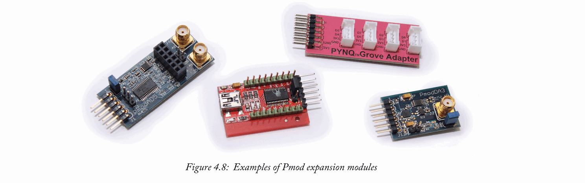

FMC扩展卡支持更快的数据传输速率（总体高达40Gb / s），通常用于更高价值的应用。这包括用于发送和接收无线电信号的高速率ADC和DAC，相机模块，串行连接和SDR模块（示例SDR卡如图4.9所示）。FMC供应商包括Abaco，Analog Devices和Texas Instruments。

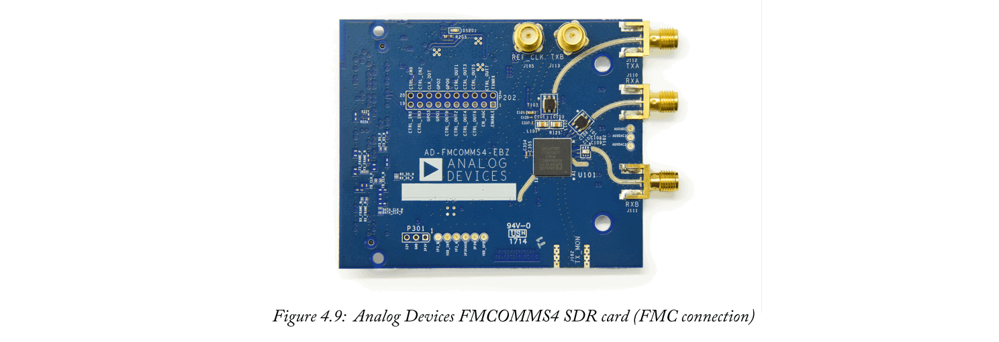

## 4.7  Chapter Summary
本章从高层次的角度介绍了Zynq MPSoC的各个方面的设计。Zynq MPSoC的组成以及硬件和软件组件的作用已经概述，并与设备架构建立了适当的链接。我们还简要介绍了可用于创建Zynq MPSoC设计的设计流程替代方案和工具，在后面的章节中将详细介绍这些设计流程。实际信息包括硬件和软件设置要求以及可用的支持资源，以及对Zynq MPSoC系统开发的考虑因素的简要讨论。最后，还审查了来自周围“生态系统”的第三方资源。

