# Chapter 5 Candidate Application Areas for Zynq MPSoC
正如前面章节所述，Zynq MPSoC是Zynq-7000 SoC的演变，具有显着的增强功能。它提供了更丰富，更多样化的处理元素，以及改进的安全功能和安全操作。因此，Zynq MPSoC可以支持比Zynq-7000 SoC更苛刻的嵌入式系统应用。关键因素是选择设备提供的资源，使其适合于实现包含不同类型处理要求的系统。

在本章中，我们首先概述了可以很好地映射到Zynq MPSoC器件的候选要求集，这将使其成为一个明确的实现平台选择。接下来，选择一小组应用示例，我们将探讨如何使用Zynq MPSoC实现这些示例。我们还介绍了Zynq RFSoC，该器件包含与Zynq MPSoC系列非常相似的PL和PS组件，并增加了额外的功能，包括前端RF模数转换器（RF-ADC）和数模转换器（RF-DAC）。凭借其以GHz速率采样的能力，Zynq RFSoC因此带来了许多移动/无线软件定义无线电（SDR）应用。

## 5.1   What Makes my System a ‘Zynq MPSoC System’?
如上所述，Zynq MPSoC与Zynq-7000和其他SoC不同，因为它包含了一组资源。任何特定的系统设计都可以使用所有这些或子集，但采用Zynq MPSoC的动机在充分利用其各种处理元素时是最明显的。

一个'典型'（如果有这样的东西！）Zynq MPSoC系统可能具有要求苛刻的操作系统和应用软件，超出了Zynq-7000 SoC上的双核Arm Cortex-A9处理器所能支​​持的范围。它可能还需要支持非对称多处理（AMP），其中不同的操作系统在四个可用内核上运行。此外，该应用程序可能需要实时软件操作，这是由Zynq MPSoC上的Arm Cortex-R5处理器提供的。某些应用程序可能涉及丰富的图形用户界面（GUI），这可以通过集成到Zynq MPSoC中的Mali GPU得到更好的支持。该应用程序可能在接口，安全性，内存密度，视频编码等方面具有专业要求，可以很好地映射到Zynq MPSoC。与Zynq-7000一样，PL的存在提供了硬件加速适当任务的能力;区别在于Zynq MPSoC系列器件可提供更大量的PL。

具有相对适度的多处理要求并且可以在可用的PL尺寸内实现的应用，使用Zynq-7000设备更经济有效。

远离多处理主题，对确定性“数据流”处理（与基于软件的处理相反）的主要需求的应用程序将更好地映射到高端FPGA，例如Virtex UltraScale +。如果需要处理器，这些器件能够在PL中包含一个或多个软处理器，以及经典的FPGA数据流式计算架构。在复杂性规模的另一端，低成本FPGA是对要求较低的应用程序的良好实现选择，这些应用程序对多处理的重视程度较低（软件中的并发操作较少！）。

这些一般类别如图5.1所示，并建议如何根据多处理要求和复杂性选择设备来增加基于逻辑的计算。选择单个芯片可以满足大多数应用要求;极其苛刻的应用可能需要组合。

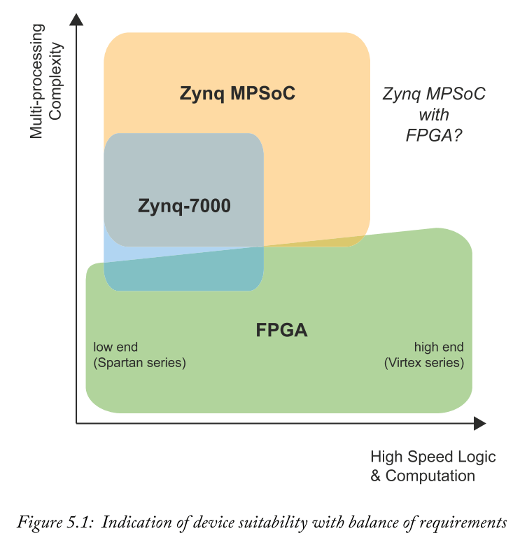

接下来，我们选择一小组应用程序示例，并演示为什么Zynq MPSoC（特别是）将成为实现它们的适当平台。这些仅旨在提供一些指示性候选应用示例 - 可能性不限于这些区域。

## 5.2  Application Areas for the Zynq MPSoC (and RFSoC)
Zynq MPSoC的三个主要系列针对不同的一般应用领域，虽然有明显的重叠，但最终的器件选择仍留给设计人员。EV设备通常用于图像和视频处理领域中的要求苛刻的应用。EG设备针对在一系列应用（包括例如导航系统和云计算服务）上计算要求苛刻的应用。CG设备针对具有较低计算要求的应用，例如超声波，或运行网关和本地处理的基于传感器的系统。

表5.1给出了CG，EG和EV MPSoC器件通常可用于的一些示例应用。该表的第四列列出了与Zynq MPSoC密切相关的器件的示例应用：Zynq RFSoC。第5.5节将介绍Zynq RFSoC架构的更多背景和细节[29]，将其与Zynq MPSoC系列进行比较，并回顾一些适合它的应用。RFSoC是CG和EG Zynq MPSoC器件系列的近亲（堂兄或更接近！），但也包括一些非常具体的模拟RF收发器电路，使其成为一个非常具有革命性的器件。

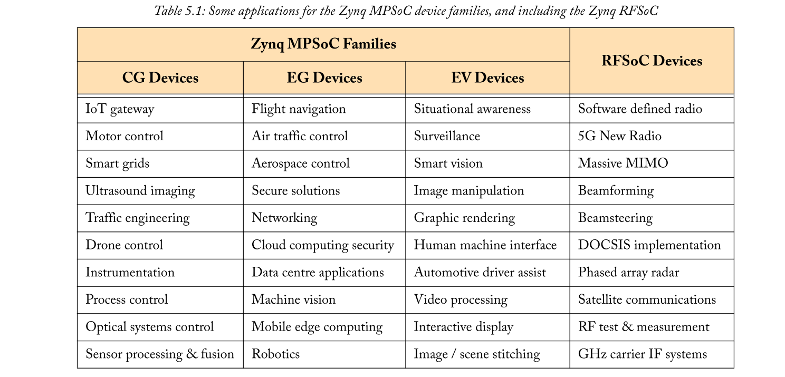

在以下部分中，我们选择一小组应用示例，并演示为什么Zynq MPSoC和/或Zynq RFSoC将是一个特别适合实现它们的平台。这些仅用于提供一些指示性的候选应用示例 - 可能性不仅限于这些领域 - 并且有许多应用特别适用于Zynq MPSoC。

## 5.3  Drones
无人驾驶飞机（也称为无人驾驶飞行器或无人机）近年来越来越受欢迎，从用于军事和其他专业应用的昂贵资源转变为主流使用。今天，无人机可用的范围从便宜的玩具（50美元至250美元），到航空视频和摄影（100美元到1000美元）等专业设备，再到军事和科学专家（10,000美元以上）应用。

无人机的许多其他用途正在出现。一个备受瞩目的应用是物流，正如亚马逊在2013年首次提出的用于交付包裹（最初是某种程度的公众怀疑！），2013年[1]。另一项物流应用于2017年在瑞士启动，用于提供更加敏感的货物，包括血液和医疗样品[16]。

无人机技术的普及带来了许多挑战，特别是在自动无人机的情况下，它们没有直接的用户控制。确保它们安全飞行，遵守空域限制并避免即使在不完美的天气条件下发生碰撞也是一个重要问题。存在对隐私和安全的担忧，需要采取反措施来防止拦截，篡改等。

自发布以来，Zynq-7000已被许多无人机制造商采用，并且随着对功能的新兴需求，其快速发展仍在继续。例如，Zynq芯片在ZeroTech Dobby AI无人机[14]中托管机器学习算法，而DJI的Inspire 2无人机使用Zynq [13]实现了无人机的电影质量拍摄和先进的灵活定位。另一家无人机制造商Aerotenna发布了一款基于Zynq的无人机开发平台，该平台已成功用于农业用途（控制喷洒田地）[12]。

Zynq MPSoC器件不太可能进入无人机的低端领域，但对于更先进的无人机，特别是在该领域的快速发展，Zynq MPSoC可能非常适合。Zynq MPSoC拥有下一代无人机技术所需的一系列处理资源，Safety和Security以及灵活性。考虑到无人机最大可达到的飞行时间是一个重要因素，其低功耗也很重要。接下来，我们通过考虑无人机所涉及的各种处理要求来进一步探索这一点。

### 5.3.1  Flying
无人机有各种形式，包括固定翼，飞机式车辆，多转子“直升机”。其中，四轴飞行器是最常遇到的，其四个转子围绕中心点等距间隔。有些有6个转子（'hexacopters'），甚至有8个转子（'octocopters'）。

基于四轴飞行器类型的示例，为了使无人机以稳定和受控的方式飞行，它必须独立控制所有四个转子的速度。操纵转子是控制无人机飞行的唯一方法 - 它没有任何其他转向辅助装置。每种类型的运动都需要以不同的方式控制转子，如图5.2 [3]所示。例如，还可以组合这些效果，使得无人机可以在上升和向右移动时逆时针旋转。

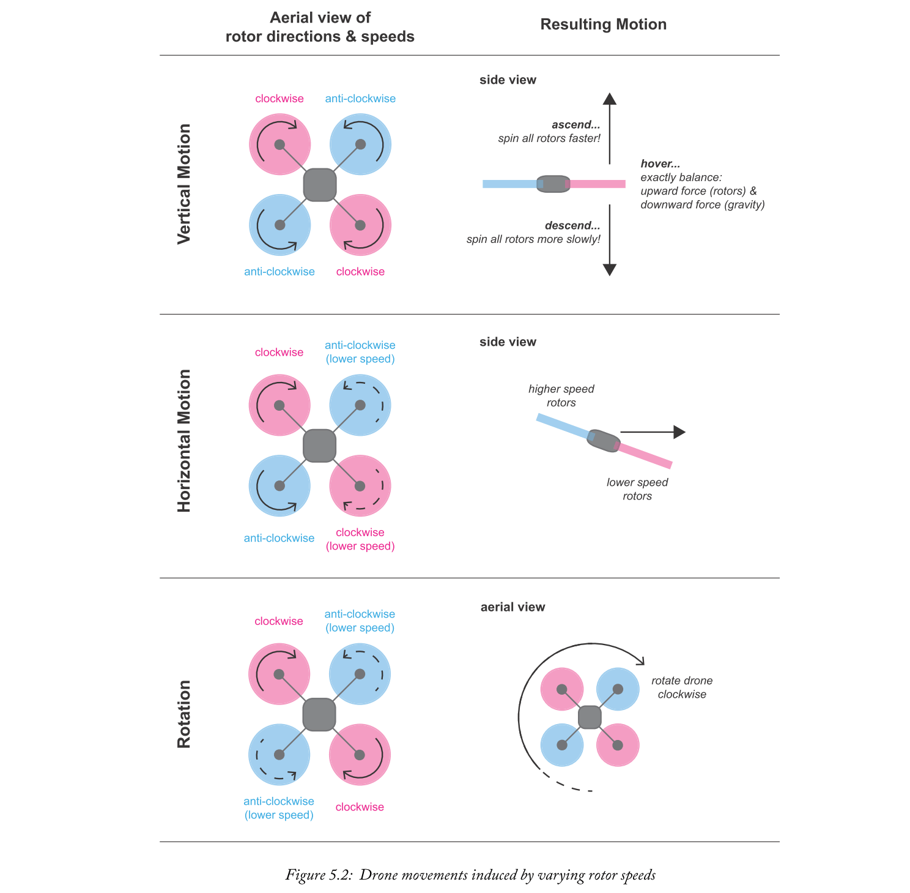

飞行员使用操纵杆或类似的控制器飞行无人机，然后将来自其的输入转换成控制信号到转子。为了稳定和精确地控制无人机，必须在紧凑的反馈回路中执行电机控制，集成来自车载加速器和陀螺仪（测量无人机运动）的读数，在某些情况下还有气压计（测量高度）和罗盘（测量方向），以实时调整转子速度。该处理在无人机的惯性测量单元（IMU）中进行。这种形式的主动稳定对于户外使用尤其重要，其中风的影响可能是破坏性的。

没有进入无人机飞行控制实现的精确细节（读者可能希望其他文章的细节[3]，[8]），很明显，有多个传感器输入的要求（可能与预处理），生成多个电机控制输出，以及飞行算法的低延迟并行处理。系统还可以集成冗余以增强无人机的安全性（有关安全原则的讨论，请参见第9章）。Zynq MPSoC的架构可以很好地满足这些要求：特别是PL支持的并行处理，RPU上的实时软件处理以及这些资源之间的低延迟接口。至关重要的是，Zynq MPSoC可以实现精确控制无人机运动所需的快速反馈回路。

### 5.3.2  Video Processing
无人机的一个流行用途是航空摄影（静止图像和视频），最终应用范围从专业（和业余）电影制作，到新闻和体育广播，房地产（房地产视频等），监视，安全检查，和精准农业。

为了最大化所产生的图像和/或视频的质量，必须解决车载摄像机的稳定性。摄像机应尽可能与作用在无人机上的外力隔离，例如阵风，以及转子产生的振动。摄像机的方向也应与无人机的方向无关（尽可能）。使用万向节可以机械地满足这些需求，通过使用数字图像稳定（DIS）软件实现进一步改进，该软件可以实时运行（Zynq MPSoC的RPU适用于此处）或作为后期运行处理阶段。

专业品质的录制可能需要4K（或更高）分辨率，快速帧速率和高动态范围（HDR）视频的某种组合，从而导致大量数据被存储，通常存储到SD卡（轻量级媒体）中Zynq MPSoC对SD接口的集成支持。在新闻和体育节目的情况下，无人机视频的直播也是期望的。来自无人机的流式视频呈现出自己的挑战，最近的研究领域包括适用于高移动性摄像机的压缩方法[20]，以及基于无人机的摄像机网络，以涵盖体育和其他现场活动[21]。此外，高级成像功能包括跟踪视频中的目标对象的能力。所有这些视频处理任务都需要复杂的处理。在Zynq MPSoC的APU上运行的软件，理想情况下具有PL中硬件加速的优势，将是一种理想的实现方式。

### 5.3.3  Sensing
除了捕获视频和照片外，无人机还可以携带各种不同的传感器类型。这可以包括超声波传感器（用于距离测量），各种类型的高级成像数据（例如， 热，高光谱，射频（RF）传感器，RADAR（无线电探测和测距），LiDAR（光探测和测距）等。使这些传感器足够紧凑和轻便从而适用于小型无人机是一项挑战，但正在进行小型化改进，例如RADAR [6]。

视觉图像的捕获也应被视为感官输入。视觉成像支持“计算机视觉”功能，例如物体检测，防撞和手势识别，所有这些功能都可以实现先进的无人机飞行。例如，麻省理工学院（MIT）的研究人员已经展示了基于立体视觉相机的障碍物检测和避障系统[7]。计算机视觉技术也可用于更传统的目的，例如人数统计，交通监控和远程检查。板载处理有可能减少数据集，从而减少存储和/或通信开销，并且可以由Zynq MPSoC适当地启用。数据也可以上传到“云”以进行进一步处理。

一些应用使用“传感器融合”来组合来自多个传感器的测量值，以提供更完整或准确的数据集。这可以包括，例如，不同类型的图像数据（视觉，高光谱，热等），以及超声波，LiDAR或RADAR传感器。“融合”方面可能涉及单个传感器数据的预处理，以及组合各种源的任务，并且类似于车辆中传感器融合的想法（将在5.4节中讨论）。

### 5.3.4  Communications and Navigation
无线通信的各个方面与无人机相关联，可能最明显的是用户控制器和无人机之间的链接，用于引导飞行。另外，还可以存在用于报告诊断信息的返回路径，以及由无人机捕获的数据的传输（例如，视频或传感器数据）。

随着无人机应用程序的要求越来越高，对高带宽，低延迟通信的需求将会增加。例如，这可能是由对更高质量视频的需求或传感器的有效载荷的增加所驱动的。更具新奇的可能性是无人机携带小型蜂窝基站，在紧急情况下提供弹出式覆盖，或服务于农村或难以到达的地区[18]。无人机还用于识别移动信号覆盖范围较差的区域，例如体育场馆，这意味着他们的“传感”任务实际上是在一组理想的位置测量和记录无线通信信号的强度[5]。这实际上是Zynq RFSoC的一个很好的应用，在5.5节中讨论过。

无人机定位是另一个重要方面，一些无人机配备了GPS传感器，可以确定它们的地理位置。GPS读数与无人机IMU的测量结果相结合，可精确确定位置（位置和方向）。基于位置感知的功能包括“返回家”的选项，即在无人机飞行结束时将无人机引导回指定位置。此时，配备自动着陆功能的无人机将根据其高度意识轻轻降低到地面。可以基于GPS信号或诸如来自气压计或超声波传感器的其他传感器测量来确定海拔高度。

通信功能要求很高，需要广泛的接口和处理，以及基于位置和方向的实时调整。这可以使用几个Zynq MPSoC资源。

此处讨论的一些功能以及本节前面部分的功能如图5.3所示。

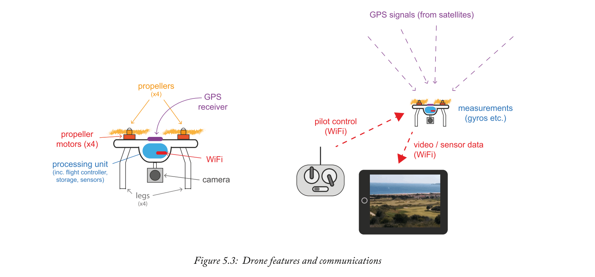

### 5.3.5  Advanced Drones
自主飞行是进一步发展的重要领域。“自主”意味着能够从源头到目的地进行自我导航，检测并应对障碍物和危险，遵守空域限制，甚至与其他无人机或地面站进行交互。因此，自主飞行意味着高度的态势感知，这可能来自融合来自成像摄像机，GPS和其他传感器的数据以及决策的各个方面（例如，如果确定一个物体，无人机应如何转移它路径？）。在2018年，这种复杂程度的无人机开始商业化。Zynq MPSoC的资源很好地满足了这些要求。

自主飞行单个无人机的能力导致飞行形成一组无人机的可能性（有时称为“群体”）。维持组建需要大量的意识，沟通和协调。群集可以实现分布式传感和处理任务，这些任务不能由单个无人机承担，同时提供集体决策以及自我组织和从故障中恢复的能力。无人机群已经处于不同的发展阶段，已经在军事和民用应用中得到证明[11]，[19]。

基于自主和群体的飞行为无人机的机载系统增加了极大的复杂性。因此，自主飞行无人机可能非常适合在Zynq MPSoC器件上部署，特别是对于要求苛刻的传感和处理应用。在确保安全性和安全性方面还存在进一步的挑战[10]，Zynq MPSoC可以很好地解决这个问题。

## 5.4  Smart and Autonomous Vehicles
近年来，用于驾驶员辅助的汽车技术数量有所增加。高级驾驶员辅助系统（ADAS）这一术语得到了广泛的应用，大多数新车现在提供至少一种ADAS功能（例如车道偏离警告系统或盲点检测）。与此同时，汽车行业的长期主题之一不仅仅是为驾驶员提供帮助，而且主要是为了接管他们驾驶汽车的角色。几家公司，包括雷诺和福特等传统汽车制造商，以及谷歌和优步等科技公司，正在开发无人驾驶汽车。

也许不那么明显，实际上有太多的自动化水平，并且在所有情况下提供全自动驾驶的汽车尚未实现。汽车工程师协会已经确定了驾驶员辅助的等级，并由联合国和美国交通部采用[4]。如表5.2所示，比例范围从无驾驶员辅助（0级）到全自动驾驶（5级）。在撰写本文时，商用车辆仅限于1级和2级，2017年末推出了第一辆3级轿车。预计从20世纪20年代初开始提供3级轿车。

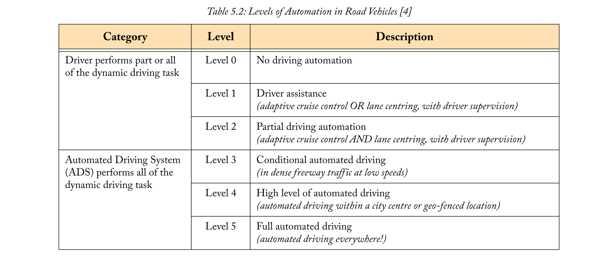

在所有情况下，如果自动驾驶系统（ADS）发生故障，必须有安全备份。最高级别包括3级，这取决于驱动程序恢复控制。对于4级和5级，ADS本身必须安全地停止车辆。

在本节的其余部分，我们将概述ADAS和自动驾驶汽车所需的一些特性和功能，并与Zynq MPSoC上的可用资源相比较，展示了该设备非常适合这些应用的原因。

### 5.4.1  What Does ‘ADAS’ Cover?
术语ADAS包括各种驾驶辅助功能，其中许多是众所周知的。这些包括： 
- 导航 - 根据GPS读数和测绘数据为驾驶员提供指示。
- 车道偏离警告 - 当车辆偏离车道时提醒驾驶员，这可能表示驾驶员注意力不集中。
- 盲点检测 - 能够在驾驶员的“盲点”中检测车辆，并提供警报（通常以集成在后视镜中的警示灯的形式）。
- 自适应巡航控制 - 车辆在检测到前方危险时自动降低其速度。
- 速度标志检测 - 自动读取速度标志，信息通过仪表板传递给驾驶员。
- 自动泊车 - 汽车自动进入停车位。

所有这些系统都需要位置感知，无论是在用于导航的宏观水平，合理的长距离（例如，检测高速公路前方的减速）还是以厘米精度操纵到停车位。了解车辆环境（车道标记，交通标志，行人，其他车辆）的需要是另一个重要组成部分。因此，ADAS系统需要结合多个传感器来解释车辆的周围环境，并将这些不同的数据集馈送到决策过程中。

### 5.4.2  Sensing Requirements and Implementation 
ADAS系统通常包括多个传感器，用于捕获有关汽车周围场景的数据，包括其他车辆和物体的距离。生成此信息需要在车辆周围集成许多传感器，从而提供不同类型的传感器数据。这包括来自摄像机的视觉数据（能够检测道路标志和标记），以及超声波和雷达传感器，以测量与其他车辆和物体的距离。雷达还可以测量其他车辆的多普勒频移，从而测量速度。

LiDAR（光探测和测距）使用与雷达具有相似原理的激光进行操作，并且很快成为自动驾驶汽车的引人注目的技术。尽管目前LiDAR系统非常庞大且昂贵，但人们对开发适用于大众市场车辆的低成本，更紧凑的解决方案存在相当大的兴趣[2]。

图5.4显示了放置在汽车周围的各种传感器。请注意，超声波传感器可在短距离（最远几米）内运行，以协助驾驶员泊车。长距离雷达探测有助于自适应巡航控制，其中汽车的速度可以根据前方检测到的较慢的移动流量进行调整。雷达还用于中距离功能，例如盲点检测和交叉路口警报，即在倒车时警告驾驶员在车后面穿过的交通。前部，后部和侧面的摄像系统可用于从场景中提取视觉元素，例如道路标记和交通标志。LiDAR非常重要，因为它可以提供比中距离（10到100米）雷达更好的距离分辨率，全程360度覆盖 - 非常适合自动驾驶汽车。

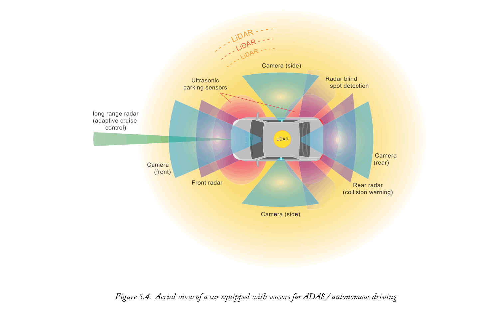

为什么这么多不同类型的传感器？原因在于它们在不同环境条件下（例如雪，雾，明亮的阳光等）的检测范围，分辨率和稳健性方面各自具有不同的能力。来自不同类型传感器的数据的组合实现了更强的鲁棒性，这在这种安全关键应用中是重要的。

然后必须对车辆的传感器组产生的大量数据进行预处理，组合（“传感器融合”），并进行分析以解释车辆的周围环境。这意味着对各个传感器输入进行广泛的信号处理，以及精确同步和进一步处理以组合数据，解释危险并采取必要的措施[17]。考虑到车辆可能行驶的高速度以及避免事故所需的响应时间，所有这些处理（包括基于PL和PS的元件）必须以尽可能小的延迟进行。

Zynq MPSoC表示了一个非常适合ADAS系统的实现平台，因为它具有多个处理器，用于执行并行软件任务，包括具有实时功能的处理器，以及用于处理大量传感器输入的高速接口。PL可以用于硬件加速传感器输入的预处理，PL和PS之间的低延迟连接在这个时间和安全关键应用中提供了明显的优势。此外，Arm Cortex-R5处理器的lock-stepping和处理器/PL冗余等安全功能可以集成到设计中，以提高其稳健性。

最后，值得注意的是汽车级Zynq MPSoC芯片可用。它们可在较宽的温度范围内运行，并通过汽车安全标准ISO26262 ASIL 3认证。本章和其他安全功能将在第9章中介绍。

### 5.4.3  Autonomous Vehicles
自动驾驶汽车面临许多挑战。为了完全自主，他们必须能够在所有情况下完全解释他们的环境，并且可靠地做出适当和安全的决策 - 即使出现意外情况。

与ADAS系统相比，自动驾驶车辆所需的数据收集量可能增长很多，因为车辆必须在很高程度上了解其环境，以便做出类似人类的驾驶决策。这意味着增强的计算机视觉技术，以识别视野中的不同类型的物体，甚至预测它们的运动（例如，检测到行人，他或她可能在下一步移动的位置？）。

机器学习技术将在对车辆视野内的物体进行分类方面发挥重要作用，例如，其他车辆，行人，骑自行车者，街道设施等[22]。挑战在于始终确保安全行为，因此视觉系统还必须能够理解不寻常的物体和事件，以及常规物体，并且可能从其自身经验中学习[24]。例如，如果汽车要遇到拖拉机，婴儿车，移动踏板车，带伞的行人，Skip（美国的垃圾箱！），或从前方车辆掉落的物体，它必须能够做出适当的反应。为自动驾驶汽车创建强大的智能将是达到自治规模的第4级和第5级的主要因素（表5.2）。

经处理的传感器信息与地理数据的融合可用于建立未来旅程的环境图像。通过特定位置的车辆的数据甚至可以被共享，以帮助改善对周围环境的解释，以及使他们了解附近的其他车辆。整个交通状况可以通过连接的道路基础设施进行管理，例如交通标志和道路标志，从而有助于减少拥堵并改善道路使用者的行程时间。因此，车辆到车辆通信（V2V）以及车辆到基础设施（V2I）通信将在实现完全自动驾驶车辆中起重要作用。

### 5.4.4  Connectivity and Security
ADAS系统的集成，特别是自动驾驶车辆的功能，需要先进的连接。上一节中讨论的一些处理任务，特别是车辆之间的机器学习和数据聚合，不能在车辆本身上进行，而是需要访问网络，以及云或移动边缘计算（MEC）设施[23]。还将有无线链接与其他车辆以及邻近的交通基础设施连接。这意味着需要高度可靠的无线通信。此外，考虑到需要在汽车应用中做出决策的速度（例如，识别道路中间的奶牛，并应用制动器！），低延迟是至关重要的。如第5.5.5节所述，5G通信旨在提供ADAS和自动驾驶车辆所需的可靠性和低延迟。

关于自动驾驶汽车存在许多公众关注[25]，这可以通过对涉及它们的事故的兴趣来证明。根据最近的一项调查，交通安全是最突出的问题，安全也是一个突出的问题。在这方面，人们的担忧范围从隐私问题（例如，个人信息和路线信息受到损害）到黑客接管他们所乘坐的车辆以及恐怖主义的威胁[26]。因此，网络安全是所涉及的汽车和技术公司以及政府监管机构的首要任务。鉴于实现强有力的安全实践和维护公众信任的重要性，目前正朝着自动驾驶汽车的网络安全标准化迈进[27]。

使自动驾驶车辆安全涉及物理安全（使其电子系统不能被篡改）和通信安全。Zynq MPSoC器件的安全功能可以在ADAS和自动驾驶汽车中使用，如第8章所述，同时其处理能力和工具可以很好地支持5G通信系统（及更高版本）所需的加密。

Zynq MPSoC也可以构成通信网络，MEC设施和道路管理基础设施的一部分，支持自动驾驶汽车的部署。

## 5.5  Interfacing to the RF Analogue World — the Evolution to Zynq RFSoC
自从2000年代初推出首款支持DSP的Virtex II FPGA（具有片上乘法器）以来，FPGA已广泛用于许多无线和移动/无线应用，包括基站实现，交换机，安全和网络，其解决方案通常包括FPGA作为计算工作的主力。需要一个具有ADC和DAC设备的合适模拟芯片来连接数字（FPGA）世界和模拟（或RF）世界。

近年来，Zynq-7000系列器件已广泛用于移动和无线通信以及雷达系统。例如，过去10年中最着名和最广泛使用的软件定义无线电（SDR）之一是无处不在的USRP设备，例如Ettus USRP E310 [34]，它使用Zynq Z-7020和ADI公司AD9361 [32]芯片。AD9361芯片具有双通道发送器（Tx）和双通道接收器（Rx），或者等效地，可以描述为2 x 2 RF收发器。它可以调谐范围从300 MHz到6 GHz，信号带宽在200kHz到56MHz范围内。其他可用的现成集成SDR解决方案包括ADI公司主动学习模块（ADALM）Pluto SDR，它基于Zynq 7010和AD9363 RF收发器。近年来，还有PicoZed SDR [35]，其中包括Zynq 7035器件和AD9361芯片（如第91页的图4.9中的FMC模块所示）。

在这些Zynq-7000 SDR解决方案中，DSP和无线电管理由Zynq芯片执行，ADC和DAC功能由外部连接的模拟/ RF芯片执行。图5.5（a）说明了Zynq器件和这种芯片之间的接口点。诸如MATLAB和Simulink等软件平台提供支持包，以便于使用和编程这些Zynq-7000系列SDR [42]。我们当然可以从Zynq 7000系列演变为Zynq MPSoC系列，并通过合适的无线电前端收发器前端实现SDR，例如ADI公司的SDR收发器系列。

与Ettus USRP E310 Zynq-7000 SDR类似（图5.5（a）），可提供完全集成且性能更高的Zynq MPSoC SDR开发套件，例如采用Xilinx Zynq MPSoC的Raptor SDR（具有2520 DSP slice的XCZU9EG和600k）系统逻辑单元，四核Arm Cortex-A53和双核Arm Cortex-R5）。Raptor Zynq MPSoC的主要组件如图5.5（b）所示，包括Zynq MPSoC以及RF-DAC和RF-ADC。（当然，电路板上还有其他接口设备，存储器，芯片和外围设备未在图中显示。）

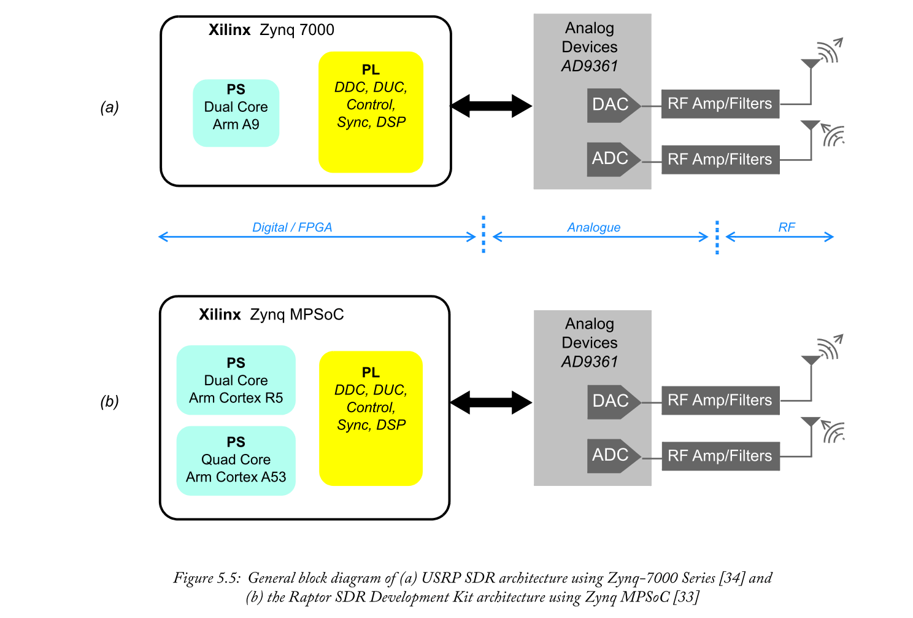

现在，如果能够解决将RF收发器（即RFDAC和RF-ADC）集成到Zynq MPSoC器件/基板上的技术挑战，那么将创建一个真正的（并且非常强大的）单芯片SDR解决方案。这正是通过创建MPSoC系列的新成员（或者非常接近的表亲）--Zynq RFSoC器件所取得的成果。

基于Xilinx在RF-DAC和RF-ADC上的开创性工作[40]，RFSoC现在是最终的SDR设备，也是第一个在1995年的开创性论文“软件无线电”中真正实现Joe Mitola想法的人。建筑“[41]。回顾第99页表5.1第四列中给出的可能的Zynq RFSoC应用示例列表，这些应用的特点是它们都需要非常高的采样率才能从RF无线电频谱中获取信号并创建完全由Zynq RFSoC提供的RF无线电频谱信号。

### 5.5.1  The Zynq RFSoC Device Family Compared to MPSoC
2017年宣布的Zynq RFSoC与Zynq MPSoC密切相关。它的目标是实现高价值的集成无线电系统，并在片上集成所需的RF模拟电路，为许多应用提供单芯片SDR解决方案。Zynq RFSoC的主要特性与Zynq MPSoC系列的区别在于增加：
- 高速率数据转换器 -  8或16个RF-ADC和RF-DAC，每个分别以高达4Gsps（采样率，fs = 4GHz）和6.4Gsps（采样率，fs = 6.4 GHz）运行，并且具有12或者 14位分辨率。
- 集成数字上变频器（DUC）和数字下变频器（DDC） - 能够处理实数或复数（I / Q）数据，并用于基于RF频谱的系统中的前端处理。
- 高PL DSP片密度--Zynq RFSoC提供多达4272个DSP片（超过任何MPSoC器件），支持DSP计算处理，以实现昂贵的算法。
- 硬化资源，用于高性能软判决前向纠错 -  SD-FEC编码和解码，支持Turbo码和低密度奇偶校验（LDPC）码。

与其他Zynq系列一样，有一系列Zynq RFSoC器件可供选择，提供不同的功能和选项（更多信息请参见最新的选择指南[30]）。

表5.3比较了Zynq MPSoC [31]的主要器件架构特性与Zynq RFSoC的特性。Zynq RFSoC产品系列与Zynq MPSoC共享相同的PS架构，具有四核Arm Cortex-A53应用处理器和双核Arm Cortex-R5实时处理器。一个显着的区别是RFSoC的PS省略了图形和视频处理器，实际上，图形处理不太可能成为RF无线通信系统中的目标应用。鉴于两种设备架构之间的整体相似性，它们的相关设计流程和软件组件等，它们基本上共享相同的生态系统。

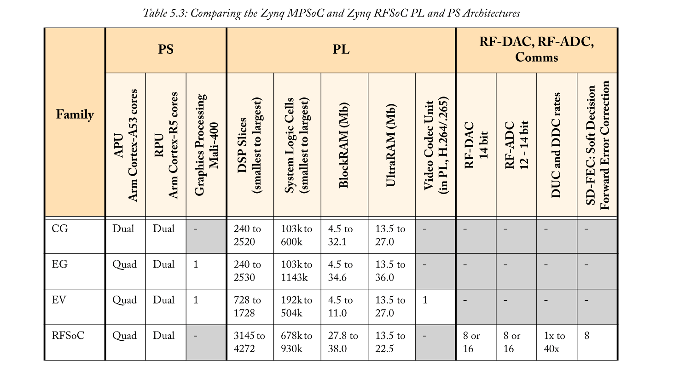

正如针对DSP密集型应用的器件所预期的那样，Zynq RFSoC的PL包含比Zynq MPSoC器件更多的DSP片，并且具有与最大的Zynq MPSoC器件相当数量的系统逻辑单元。Zynq RFSoC还可确保大量Block RAM，可用范围为27.8至38.0Mb，而Zynq MPSoC（Block RAM在4.5至34.6Mb范围内）的变化范围更广。还包括高速接口，类似于Zynq MPSoC，在这种情况下，它们的目标是支持移动前传和回程网络的苛刻要求，包括实施通用分组无线接口（CPRI）标准[38]。RFSoC架构的简化图如图5.6所示。

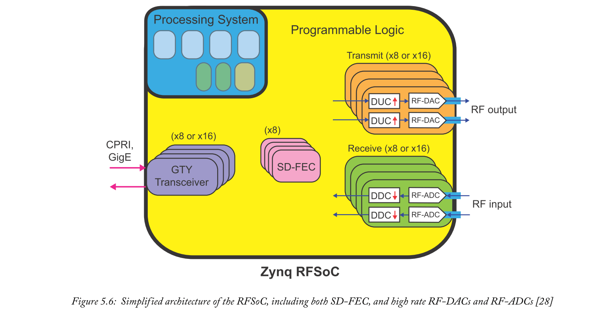

如表5.1中的示例应用所列，RFSoC针对当前和新兴的无线标准，如5G NR（新无线电），以及大规模多输入多输出（MIMO）无线电的功能，以及分阶段应用阵列雷达。RFSoC能够在单个芯片上采样和处理多达16个发送和16个接收通道，达到允许将信号的无线电频谱直接采样到GHz范围内的速率，为开发高度灵活的下一代提供了巨大潜力无线电设备。有关RFSoC的更多详细信息可以从Xilinx网页获得[30];有关射频采样技术的具体背景，请参阅[37]。

### 5.5.2  RF Sampling: RF-ADCs and RF-DACs, and Single Chip SDR
Zynq RFSoC将所有核心组件集中在一起，以促进SDR，包括直接RF采样数据转换器，以及通用公共无线电接口（CPRI）和千兆以太网到RF等接口。数据转换器采用RF模数转换器（RF-ADC）和RF数模转换器（RF-DAC）的形式。它们与器件的PL集成在一起，可以高效，有效地实现抽取，插值，信道化等的预处理和后处理阶段。

RF-ADC可支持超过4Gsps（每秒千兆采样）或fs> 4 GHz的采样率。为了帮助说明这个速度有多快，我们也可能将这些大数字表示为每秒4000百万个样本，或4000 Msps。）RF-DAC输出级可以以超过6.4Gsps或fs> 6.4 GHz的频率进行采样，并生成输出载波频带高于3.2GHz（即高于fs / 2），使用的策略利用奈奎斯特频带图像高于采样率的一半[28]，或所谓的第一和第二奈奎斯特频带。Zynq RFSoC数据转换器还包括使用可编程数控振荡器（NCO）高效实现数字下变频器（DDC）和数字上变频器（DUC），从而实现复杂的混频器。

使用Zynq RFSoC，图5.5（b）的Zynq MPSoC + ADC / DAC架构现在通过单个Zynq RFSoC器件实现，如图5.7所示。该器件将模拟RF元件完全集成到单片集成的Zynq RFSoC上，即软件定义无线电现在位于单个芯片上。Zynq RFSoC系列器件在输入和输出通道数量（8或16），SD-FEC实现（不在所有器件上）和ADC采样率（2Gsps或4Gsps）方面有不同的变体;有关详细信息，请参阅[29]。

Zynq RFSoC的集成RF数据转换器提供SDR平台，该平台是完全可编程的直接RF采样SDR。因此，考虑到数字化用于移动/无线通信的非常大的RF频谱部分的能力，RF信号处理基本上已进入数字域。通常，功耗降低，因为不再需要MPSoC / FPGA和RF模拟芯片之间的接口设备，并且类似地，由于单芯片设计，系统占用面积减小。此外，通过Vivado使用一组集成工具并使用更少的组件，然后设计周期时间应该更短。

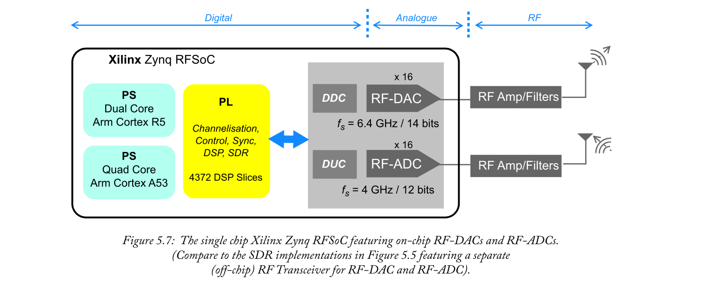

### 5.5.3  Direct Sampling Zynq RFSoC Data Converter Subsystem
表5.4总结了Zynq RFSoC数据转换器的关键DSP和SDR功能。RF-ADC和RF-DAC在器件上构造为tiles，每个tiles包含2或4个RFADC，或4个RF-DAC。每个tile还具有锁相环（PLL）和所需的时钟处理逻辑，用于模拟和数字逻辑路径的路由[28]。根据Zynq RFSoC系列产品的不同，通道数，字长分辨率和采样率也各不相同。对于第一代器件，RFADC字长为12或14位分辨率，采样率高达4.096 GHz，RF-DAC字长为14位，采样率高达6.554 GHz。较新的第三代器件将RF-DAC速率提高到10Gsps，RF-ADC速率提高到5Gsps。更多精确的RF-ADC和RF-DAC器件性能数据，如无杂散动态范围（SFDR），噪声频谱密度（NSD），有效位数（ENOB）等，可在[39]中找到。

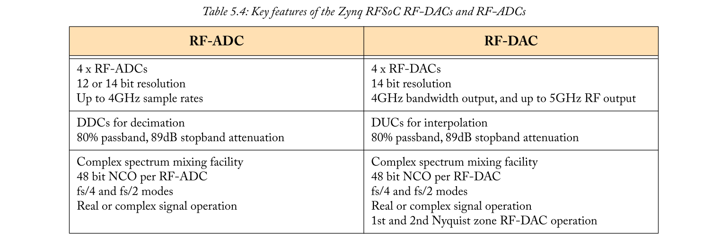

凭借非常高的采样率RF-DAC和RF-ADC，Zynq RFSoC可以直接采样射频频谱。考虑图5.8，其中显示了一些用于通信的主要无线电频段。经典的奈奎斯特定理指出，信号必须以大于信号带宽的两倍进行采样，以保留所有信息; 这经常以基带信号的形式重申（即 信号从0Hz开始），这样我们就可以说明需要以大于最大频率的两倍进行采样。因此，对于图5.8，注意现代RF通信的基带在MHz范围内开始较低，如果我们在6GHz处“采样”，那么0到3GHz范围内的所有频谱分量都将被捕获并在数字域中可用 。这使我们可以通过这种直接RF采样将Zynq RFSoC视为真正的数字无线电或SDR。高于3GHz，我们仍然可以通过一阶或二阶奈奎斯特策略来创建信号。对于20GHz载波范围内的频率，我们可以使用前端模拟RF振荡器，并调制/解调到RF-DAC和RF-ADC的基带区域内的中频。

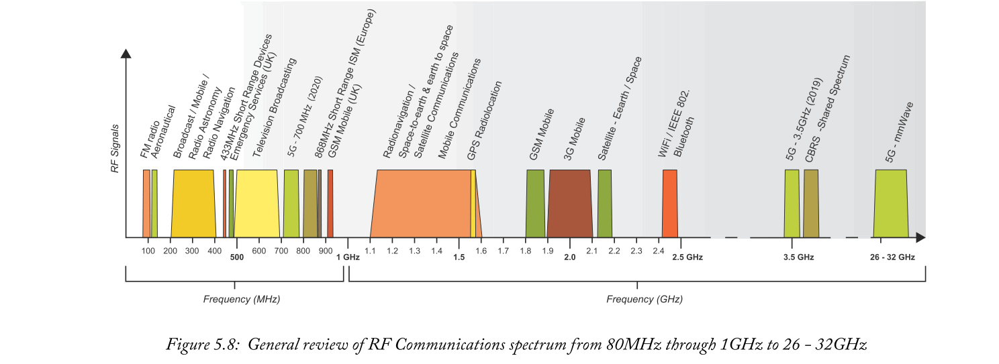

图5.9再次说明了完整SDR的简单架构，其前端具有高速RF-DAC和RF-ADC，其中所有其他调制器，解调器，接收器等均使用在Zynq RFSoC上实现的DDC，DUC和DSP实现。PS和PL。

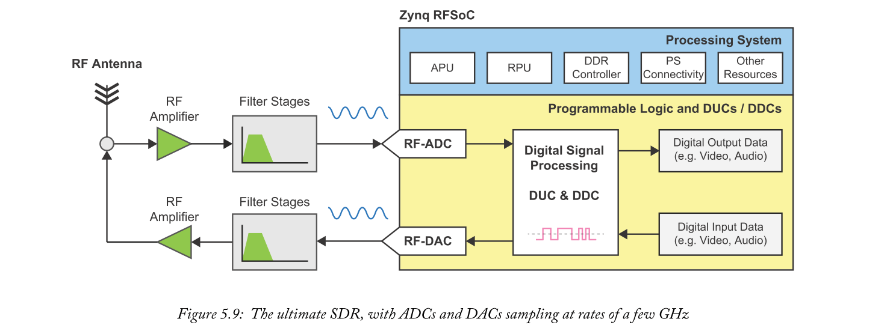

### 5.5.4  4G LTE Multicarrier Solutions
4G LTE在全球范围内广泛渗透。工作频率因国家而异，但在美国和欧洲等国家，600MHz，800MHz，1800MHz，2.1GHz的频段被广泛部署。LTE信道带宽可以在1.4MHz到20MHz之间变化，并且诸如载波聚合的技术可以产生例如带宽为5×20 = 100MHz的聚合信道。使用Zynq7000和Zynq MPSoC器件的解决方案已广泛部署在4G LTE基站，cloudRAN，回程和各种前传实施中。但是，如果我们现在可以使用Zynq RFSoC，我们可以在许多这些频段中执行直接RF采样，并设计多通道单SDR芯片解决方案，实现4G LTE PHY层实施算法和适当的MAC层控制整个600MHz至3GHz频段。

Zynq RFSoC的PS可用于控制PHY和MAC层，PL运行信道化和滤波DSP。根据需要，还可以在PS和PL上执行数字预失真（DPD）。

### 5.5.5  5G Mobile and Wireless Implementations
第五代无线电（所谓的5G）是关于新的无线电标准，并且在许多方面，都是新思维。除了技术推动更快的数据速度，更低的延迟，无线电的大规模部署（致密化）以及物联网（IoT）中设备的激增之外，5G还将带来更灵活和频率可用的无线电，并允许最终的发展 -最终用例。这将为移动和无线运营商带来更多新应用和新业务模式。Zynq RFSoC将成为未来几年推出5G部署的关键支持设备[39]。

Zynq RFSoC提供的采样率意味着在700MHz和3.5GHz的5G指定的新频段内传输的信号可以数字采样 - 因此可以在RFSoC上开发和实施完整的SDR解决方案（当然合适的前端RF放大器级和预滤波器）。单个Zynq RFSoC器件上可用的多个通道（最多16个通道发送，16个通道接收）也意味着可以实现波束成形，波束控制和MIMO实现等多天线技术。PS可以运行控制，基带和MAC样式处理，并且可以优化波束成形，波束控制，数字预失真等矩阵型DSP计算以使用PL运行，特别是利用DSP slice。

5G和/或下一代移动和无线实现的一个前景是共享频谱带的更广泛可用性。这些共享频谱频段将允许社区，工业厂房或校园等新运营商使用成本较低的分解无线电接入网络运行其自己的私有LTE / 5G网络。近年来，电视白空间（TVWS）共享频谱，尤其是英国[44]和美国[45]，允许动态频谱接入（DSA）用于该国某些地区的UHF频段（470至790MHz）BAND没有被使用。同样，CBRS（公民宽带无线电服务）[43]目前正在美国以3.5GHz部署（见图5.8）。两者都运行数据库来管理这些频谱带的动态分配。在这些共享频带内，可以使用多种不同的标准/波形（例如，LTE，5G NR，802.11xx），要求具有频率捷变的SDR设计，以及从不同频带动态选择的灵活性，并采用不同的信道带宽。

因此，Zynq RFSoC将成为DSA的优秀设计平台。例如，使用TVWS，RFSoC可以将整个UHF频段从400MHz数字化到800MHz。TVWS中各个分配的信道频带在英国为8MHz，在美国为6MHz，并且一些操作规则允许分配多个信道，或者在某些情况下允许聚合相邻频带。因此，通过使用Zynq RFSoC的RF-ADC对频谱进行数字化，可以设计滤波级来提取感兴趣的频段，无论是一个8MHz（或6MHz）的信道，还是连续的多个信道的聚合（相邻）或非连续的（例如，两个8MHz信道，由64MHz分开）。

### 5.5.6  5G mmWave Implementations using IF Architectures
预计5G将通过使用mmWaves（即20GHz或更高的载波频率）带来更多的器件致密化。在26GHz至32GHz范围内的5G频段中使用mmWave频率（见图5.8），并且在60GHz的更高频率下，将带来新的频谱带，并允许更宽的信道带宽和更高的数据速率（简单地通过更宽的信道带宽）。例如，在700MHz的载波频率下，100MHz频带表示具有14％的带宽与载波比。在26GHz，100Mz信道带宽小于0.4％的带宽与载波比。因此，显然，在未来通信的这些更高频率上可用的频谱要多得多，而5G将在全球26 / 28GHz上推出。

在这种类型的mmWave应用中，载波频率远远超出直接RF采样带宽（对于当前的Zynq RFSoC器件，通常将其描述为针对6GHz以下信号的直接RF采样）。但是，Zynq RFSoC可以采用中频（IF）类型架构进行配置，前端26GHz RF振荡器可以将感兴趣的信号解调到Zynq RFSoC ADC范围内的IF。例如，为了创建一个带有1GHz信道的26GHz系统，我们可以使用第一个RF振荡器和解调/滤波级来混合来自26GHz载波的1GHz带宽信号，直到500-1500MHz的频带，然后在12位分辨率，采样率为fs = 4GHz。如图5.10所示。随着技术从2020年开始推出，我们可以期待看到多功能的Zynq RFSoC支持5G mmWave基站。

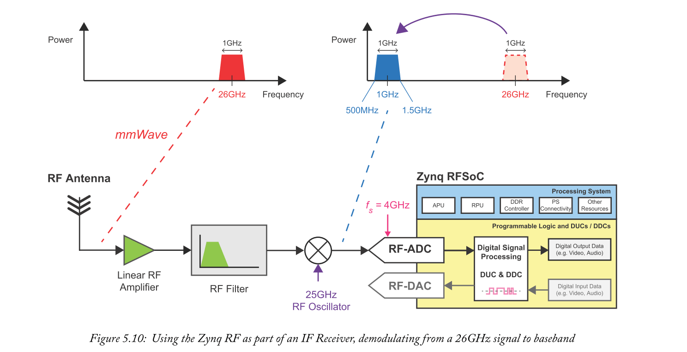

## 5.6  Chapter Summary
在本章中，我们首先建立了系统的一般特性，可能使Zynq MPSoC成为最佳实现平台，有利于Zynq或FPGA器件。随后选择了三个不同的应用领域作为案例研究，即无人机，智能车辆（从ADAS系统扩展到自动驾驶车辆）和5G通信。特别是对于最后一个应用，我们推出了Zynq RFSoC器件，并指出其对5G的强大适用性。除了简要概述每个区域外，我们还考虑了每个区域的潜在系统要求，以及可用于实现这些要求的Zynq MPSoC（或Zynq RFSoC）的突出特点。

