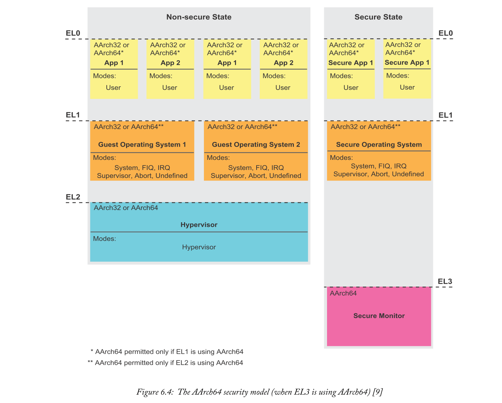

# Chapter 6 The Application Processing Unit
应用处理器是一种微处理器单元，主要用于处理嵌入式系统中的主要应用程序代码。它能够控制和连接外设和专用处理器。

在本章中，我们将研究cortex-a53 mpcore处理器在zynq mpsoc设备中的作用。我们详细描述了ARMV8-A体系结构，并探讨了作为应用处理单元（APU）一部分的信号和接口、存储器、中断、处理器扩展和外围设备。最后，我们介绍应用程序处理器虚拟化。

## 6.1  The Cortex-A53 MPCore Processor
Zynq MPSOC具有ARM Cortex-A53应用处理器，适用于需要高性能和高功率效率的任务。图6.1显示了Cortex-A53 MPCore处理器，并突出显示了其处理器核心、管理资源、控制单元、内存和I/O接口。这些组成部分中的每一个组成了三个不同的组：**Cortex-A53 MPcore、Governor和L2存储系统**[10]。

Cortex-A53多核处理器集群在EG和EV设备中包含四个Cortex-A53核，而CG设备包含两个。每个cortex-a53内核都由自己的FPU、NEON和Crypto计算单元组成，以及独立的32KB一级缓存，用于存储数据和指令。

Governor为各自的内核提供时钟、调试和跟踪资源。**L2存储系统为整个Cortex-A53 MPcore处理器提供与APU外部设备的通信**。

## 6.2  Fundamentals of Armv8-A
Cortex-A53处理器使用[9]中描述的ARMV8-A处理器体系结构。我们现在将研究在使用Cortex-A53 MPcore处理器时可能遇到的几个概念和术语。首先，我们将探讨ARMV8-A的执行状态，并研究与处理器核心操作相关的几个关键方面。这项调查将包括**A32和T32指令集、处理器模式和特权级别**，这些之前与ARMV7-A体系结构相关。这些仍然是相关的，因为它们在ARMV8-A体系结构中使用。

还将引入仅与ARMV8-A体系结构相关的新概念和定义，包括A64指令集、处理器异常级别和安全模型[9]。本节旨在为您提供对ARMV8（Cortex-A53 MPcore处理器的体系结构）的基本了解。

### 6.2.1  64-Bit/32-Bit Execution States
在ARMv3发布之前，ARM在其处理器核心的大部分方面使用了32位（在ARMv3之前，地址总线使用了26位）[4]。在相关ARM处理器的数据总线、地址总线和处理宽度上可以看到32位的使用。直到现在，ARM体系结构已经接近其第8版，其中64位内核可用。Cortex-A53处理器采用64位内核。

为了使ARMV8-A体系结构能够继续支持32位执行状态下的操作，处理器的执行环境必须能够在32位和64位操作之间进行更改。

执行状态描述处理器的执行环境[9]并定义以下各项。
- 处理器支持的寄存器宽度。
- 处理器支持的指令集。
- 处理器执行模型、虚拟内存系统架构和程序员模型的重要方面。

Cortex-A53 MPcore处理器可能使用两种可能的执行状态。这些是AARCH64和AARCH32执行状态[9]。

#### AArch32
AArch32是一种32位执行状态，与ARMV8-A体系结构兼容。它得到了先前的ARMV7-A体系结构和定义的支持，这些体系结构和定义包含TrustZone Security[7]和虚拟化扩展[8]。AArch32执行状态[9]的功能如下所示。
- 支持先前的Thumb 2和ARM 32位指令集（在第6.2.2节中进一步描述），并且完全向后兼容先前的ARMV7-A架构。
- 执行状态具有13个通用32位寄存器、32位程序计数器（PC）、堆栈指针（SP）和异常链接寄存器（ELR）。
- ARMV8异常模型（在第6.2.3节中讨论）可以映射到以前的ARMV7（AArch32）特权级别（PL）系统。
- AArch32异常模型支持ARMV7异常模型处理器模式的使用（在第6.2.4节中讨论）。
- AArch32支持32位虚拟地址。虚拟内存系统架构将这些映射到一个物理地址，该地址最多可支持40位。
- 整个处理器状态在当前程序状态寄存器（CPSR）中可用。

#### AArch64
AARCH64是64位执行状态[9]，允许ARMV8-A体系结构利用增加的地址空间、通用寄存器和一系列其他功能。以下是对这些的描述：
- 在64位执行状态下，Armv8-A处理器使用名为A64的新ARM 64位指令集。处理器现在可以在64位宽的寄存器上执行操作。指令仍然支持32位。
- 核心支持31个通用64位寄存器，以及64位PC、SP和ELR。
- 使用ARMV8异常模型，它由四个异常级别（EL0-EL3）组成。异常级别提供了执行特权的层次结构（在第6.2.3节中进一步讨论）。
- AArch64支持64位虚拟地址。虚拟内存系统架构将这些映射到40位物理地址映射。
- 几个PSTATE元素保持处理器的当前状态，可以使用A64指令集中的特定指令直接对其进行操作。
- 每个系统寄存器现在都有一个后缀，指示访问它的最低异常级别。
  
#### Rules for Changing Execution State
在不同的执行状态（AArch32或AArch64）之间进行更改需要增加或减少异常级别。也就是说，将处理器异常带到更高的异常级别，或者从异常返回到更低的异常级别。这种变化被称为interprocessing[9]。

当异常**上升到更高**的异常级别时，执行状态可以保持不变，也可以从**AArch32状态上升到AArch64状态**。它不能从AArch64状态下降到AArch32状态。

当从异常**返回到较低**的异常级别时，执行状态可以保持不变，也可以从AArch64状态减少到AArch32状态。它不能从AArch32状态增加到AArch64状态。

第6.2.3节进一步讨论了异常级别和执行状态。

### 6.2.2  Instruction Sets and Programming Languages
Cortex-A系列处理器支持ARM和Thumb指令集[9]。指令集是一组可以直接发送给处理器的命令，在软件和底层体系结构之间很少或没有抽象。例如，可以向处理器发出的两个基本命令是存储操作（将数据存储在内存中）和加载操作（从内存加载数据）。

Zynq MPSOC中Cortex-A53 MPCore处理器使用三种主要指令集。这些是A32、A64（ARM）和T32（Thumb）指令集。当处理器使用一组特定的指令时，就说它处于相对于所选指令集的指令集状态。例如，如果处理器使用A32指令集，则它处于A32状态。

当处理器不处于相应的指令集状态时，它不可能执行指令集。例如，在A32状态下运行的处理器无法执行T32指令。同样，在t32状态下运行的处理器不能执行A32指令。

AARCH32执行状态只能使用A32和T32指令集，AARCH64执行状态只能使用A64指令集。

#### The A32 and T32 Instruction Sets
A32指令集，也称为原始ARM指令集，提供32位指令，涵盖了广泛的功能和操作。Thumb（t16）指令集首先由ARMv4t体系结构使用，能够执行16位指令。thumb-2（t32），用于ARMV6架构及更高版本，主要由16位指令组成，也包括32位指令。目前，**AARCH32处理器的执行状态可以使用A32和T32指令集**。

当处理器从存储器中取出一个16位的t32指令时，它将这个字解释成一个32位的指令。这种转换允许T32子集实现类似于A32指令集的性能，同时优化代码密度，使其比原来的Thumb指令集更好。

ARM体系结构参考手册ARMV8[9]提供了有关每个子集的汇编语言的更多信息。

#### The A64 Instruction Set
**A64指令集提供一系列类似于A32和T32子集的32位指令，目前可用于AARCH64处理器执行状态**。A64指令集中有新的编码、汇编语言和其他可供程序员使用的功能，而A32指令集中没有这些功能。这包括访问更大的虚拟地址空间、64位可寻址物理内存空间、对高级SIMD（neon）的增强支持以及各种寄存器改进，如64位寄存器。

ARMV8[9]的ARM体系结构参考手册提供了更多信息。

### 6.2.3  Exception Levels
每当一个程序停止正常执行时，处理器内核就会发生异常。此异常将使处理器处于其关联的操作模式，具体取决于给定的异常。结果将导致**异常级别在EL0-EL3之间增加，以正确处理异常**。

图6.2说明了每个处理器模式在异常模型中的分配位置以及异常级别。

ARMV8异常模型中的每个异常级别都有不同的用途。其描述如下：
- EL0被称为非特权软件执行，具有最低的软件执行权限。
- EL1支持增强的软件执行权限。限制非特权用户访问受保护的资源。
- EL2支持处理器虚拟化和管理程序的实现。
- EL3支持安全状态（在第6.2.5节中进一步讨论）。

如果在用户模式下发生快速中断异常，处理器将把异常级别增加到EL1以进入快速中断请求（FIQ）模式。在处理异常之前，处理器保留其状态和原始程序的关键元素，以便在处理程序例程完成后重新开始。这种保存被称为上下文切换[4]。

### 6.2.4  Processor Modes
在AArch32或AArch64处理器执行状态（第6.2.1节）下运行的处理器需要一种安全捕获中断、管理异常和访问受保护资源的方法。已提供处理器模式来处理上述问题。这些被称为处理器的操作模式[4]。有九种模式，如表6.1所示。

改变操作模式可以在软件中进行。此外，外部或内部异常也可能导致模式发生变化（第6.2.3节对此进行了进一步讨论）。

第一种是用户（USR）模式，这是执行ARM或Thumb程序和应用程序的**正常操作模式**。标准用户模式以外的模式统称为**特权模式**。每个特权模式都可以直接映射到Armv8异常模型对异常级别的使用，前面在6.2.3节中讨论过。

#### User
用户模式适用于在操作系统上运行的软件应用程序，因此受保护的系统资源和特定指令可能受到限制。在此模式下执行的程序在异常级别0（EL0）下运行。EL0被称为非特权模式，表示它**无法访问受保护的系统资源**。

#### Fast Interrupt (FIQ) and Interrupt (IRQ)
当处理器遇到快速中断（FIQ）异常时，它将进入快速中断模式。当处理器检测到标准中断（IRQ）异常时，它将**进入中断模式**。FIQ异常优先于IRQ异常，这样在发出的FIQ服务例程完成之前，IRQ处理程序将被禁用。

#### Supervisor
Supervisor Call（svc）异常是处理器在执行supervisor调用时进入的操作系统保护模式。SVC为用户**请求受保护的操作系统功能**。管理器模式增加了异常级别（EL1），可以将请求授予受保护的功能。处理器也将在**复位时进入管理模式**。

#### Monitor
监视模式是一种安全模式，无论其他处理器状态寄存器如何，它**始终处于安全状态**。只有在发生安全监视器调用（SMC）异常时，处理器才会进入此模式。在监控模式下运行的软件可以访问安全和非安全系统寄存器的副本。这些寄存器为处理器提供了在安全状态和非安全状态之间切换的方法。第6.2.5节后面描述了ARM安全和监视器模式的进一步详细信息。

#### Abort
发生**数据或指令中止**异常后，处理器进入此模式。

#### System
用于执行需要**访问受保护系统资源**的操作系统任务的**特权模式**。它不能由任何异常输入，并且具有与用户模式相同的可用寄存器。此限制确保任务的状态不会被与其他异常模式关联的附加寄存器损坏。

#### Undefined
当发生未定义的指令异常时，处理器进入此模式。

#### Hypervisor
虚拟机监控程序是创建和运行虚拟机的虚拟机监视器，在第13章中将进一步讨论。

虚拟机监控程序模式是一种仅在非安全状态下可用的非安全模式。它在ARMV7-A处理器中作为虚拟化扩展的一部分实现，并且在所有ARMV8-A处理器中都可用。此模式为目标处理器的虚拟化提供所有功能，并在EL2执行。

只能通过从非安全EL1或EL0模式获取异常来访问管理程序模式。也可以通过在安全监视模式下从异常返回。默认情况下，使用虚拟机监控程序调用（HVC）进入虚拟机监控程序模式最初是未定义的，直到安全软件在安全状态下启用。启用HVC会向来宾操作系统公开一组独特的API（在第6.9节中进一步描述）。

### 6.2.5  Armv8 Security Model
重要的是要考虑为什么需要在诸如Cortex-A53 MPCore处理器之类的嵌入式设备中采取安全措施。系统安全的主要目的是确保基本资源不会被写入、读取、损坏或使真正的用户无法使用。设备可能受到攻击，使重要资源处于高风险水平。ARM详细描述了设备可能受到所谓攻击向量攻击的几种方法。更多信息见[7]。

我们将探索ARM安全技术，该技术旨在打击恶意软件威胁和攻击。以前，ARMV7-A体系结构为OEM提供了实现处理器安全扩展的选项，称为TrustZone安全，用于特定的Cortex-A处理器[6]。由于EL3，ARMV8-A配置文件已经包含类似的功能，如第6.2.3节所述。

#### The Secure and Non-Secure State
系统用户可能有意或无意地使系统受到恶意软件攻击的威胁。因此，将关键系统资源与其他非关键资源分离是有益的。

在ARMV8-A配置文件中，有两种安全状态：安全状态和非安全状态[7]。非安全状态也称为正常世界。正常世界**不仅用来描述处理器的执行状态**，还用来描述在该状态下**可用的**所有附加功能，如内存和外围设备。**安全状态**同样被称为安全世界。与正常情况一样，这用于描述处理器的执行状态以及在该状态下可访问的所有可用功能。

正常世界和安全世界都**可以通过虚拟化在同一物理核心上同时运行**。由于ARMV8-A体系结构能够提供两个虚拟内核，因此**将两个世界结合在一个物理内核上是可能的**[7]。除此之外，每个虚拟中央处理单元（VCPU）都有单独的系统寄存器和内存地址空间。这些允许在每个状态下执行指令彼此隔离。然后，操作系统可以与受信任的操作系统并行运行。图6.3提供了一个示例。

#### Swapping Between States
每个虚拟处理器通过以**时间片的方式**执行指令来共享物理处理器。**安全状态之间的交换**是通过进入一种称为监视模式的处理器模式来实现的。

正常世界进入这种模式的方式是严格控制的，以保持安全。从非安全状态切换到安全状态可以通过称为**安全监视器调用（SMC）**的专用指令或**硬件异常**的子集触发[7]。

通过安全世界进入监控模式很容易，可以通过直接写入当前程序状态寄存器（CPSR）或使用正常世界可用的任何方法来实现。

监控模式使用软件对安全和不安全状态之间的切换进行可靠的维护和管理。当处理器在监控模式下运行时，它总是在安全世界中执行指令。该软件确保它保存处理器离开的状态，并正确恢复处理器切换到的状态。这样，监视器可以上下文切换两个世界所需的资源。这种方法将有助于关键系统资源免受攻击。

每个Cortex-A53内核都有一个**正常的世界**（非安全状态）和一个**安全的世界**（安全状态）。每个物理核心可以在任何时间点在安全世界和正常世界之间进行转换，并且可以**独立于集群中的其他核心**进行转换。

#### Security Model when EL3 is using AArch64
EL3可在AArch64状态下运行。这使得低于EL3的异常级别要么保持相同的执行状态，要么降低到AArch32。图6.4包含一个说明AArch64安全模型的图表。

在图6.4中很容易识别出安全状态和非安全状态。在每种状态中，分别有各自的处理器模式、应用程序和操作系统。管理程序模式也显示在EL2中，只能在非安全状态下访问。同样，EL3中显示的安全监视器仅在安全状态下存在。

如前所述（第6.2.1节），当从**异常返回**时，执行状态不可能从AARCH32增加到AARCH64。因此，只有当EL2使用AARCH64时，才允许在EL1中使用AARCH64。同样，如果EL1也使用AARCH64，则仅允许在EL0中使用AARCH64。

#### Security Model when EL3 is using AArch32
图6.5显示了AARCH32执行状态的ARMV8安全模型。与前面的AARCH64一样，该图说明了安全状态、应用程序和操作系统。

如前所述（第6.2.1节），当从**异常返回**时，执行状态不可能从AARCH32增加到AARCH64。因此，所有异常级别（在安全和非安全状态下）只能使用AARCH32执行状态。

与AARCH64安全模型相比，EL3现在包含处于安全状态的安全操作系统。如[9]所述，这是为了提供与ARMV7体系结构相关的虚拟内存系统体系结构版本7（VMSAv7）实现的软件兼容性。

## 6.3  Signals and Interfaces
Cortex-A53 MPcore处理器有许多输入和输出端口。其中一些使用了AMBA开放标准的接口，如前3.5.1节所述。有**两个主要接口用于APU和其他处理元件之间的通信**。这些是**主内存接口**[10]和**加速器一致性端口**（ACP）[10]，[12]。其他接口包括跟踪端口、中断源、交叉触发接口、复位和时钟。

图6.6说明了Cortex-A53应用处理器的信号和接口及其在Zynq MPSOC中的连接。本节的其余部分将概述Cortex-A53 MPcore处理器上可用的每个信号和接口。我们将在适当的时候讨论功能和特定的使用要求。

### 6.3.1  The Master Memory Interface
主存储器接口使用AXI一致性扩展（ACE）协议与高速缓存一致性互连（CCI）通信。此前，Zynq SoC中的Cortex-A9应用处理器使用**AXI**在整个设备的处理元素之间进行通信[14]。Zynq MPSOC中的Cortex-A53应用处理器使用**ACE**，这是AMBA开放标准的一部分（见第3.5.1节）。然而，ACE协议类似于AXI，它支持硬件一致性。这使得整个Zynq MPSOC能够进行系统级的最新信息通信。

#### ACE Operation
在ACE协议中，一个称为**barrier transactions**的概念被用来有效地管理事务顺序。barrier transactions是指ACE协议**暂停数据处理流，直到满足特定条件**[1]。barrier transactions有两种类型。
- 第一个是**内存屏障**，用于确保在屏障之前发出的事务在屏障之后发出的事务之前完全完成。内存屏障可用于确保在另一个主设备在同一内存空间上启动读取操作之前，数据已成功写入内存位置。
- 另一类屏障事务是**同步屏障**，它阻止系统中的所有主设备发出事务，直到所有以前的事务成功解决。

由于在现有的AXI协议的读地址、读数据、写地址和写数据通道中添加了**额外的控制信号**，因此可以**使用ACE进行屏障事务**。这些允许在组件之间发送屏障信号，并指示哪些主设备应管理屏障事务。此外，还有用于监听的附加信号，指示要执行的监听（读或写）类型[1]。

#### ACE Snooping
窥探是实现APU和剩余Zynq MPSOC部件之间一致性的一个主要因素。**一致性依赖于所有主设备监听其他主设备发出的每个事务**。在执行**读取操作**时，具有最新数据的主设备将向请求的主设备提供数据。同样，当检测到**写操作**时，主“侦听”所保留的本地副本将失效[2]。窥探使实现一致性成为可能，并确保两个或多个主设备可以识别相同内存位置的写入操作。

ACE snooping cache coherency协议需要在现有的AXI标准[1]旁边附加三个snoop通道。
- 第一个是snoop**地址通道**，用于向缓存的主设备提供正在进行的snoop事务的地址和控制信息。
- 另一个是snoop**数据通道**，它允许缓存的主设备将数据传递给执行snoop的设备。
- 最后一个是snoop**响应通道**，它指示对snoop事务的响应类型。每个snoop都有一个与事务相关联的响应，该响应指示缓存的主设备是否要将数据传递到snoop数据通道。

ACE接口直接连接到Cortex-A53 MPCore的2级缓存。此接口仲裁来自2级缓存和Zynq MPSOC其余部分的内存请求。ACE接口通过CCI持续监听其他主机。窥探允许APU与Zynq MPSOC的其余部分保持一致。

### 6.3.2  ACP Slave Interface
加速器一致性端口（ACP）是一个**高速缓存一致性从属接口**，连接到APU 2级内存系统中的SCU。PL与此接口相连，其目的是允许FPGA硬件加速器访问APU的2级缓存。由于使用硬件接口来处理一致性，与使用软件代码不同，ACP可以提高性能并提高功耗。

必须注意的是，APU无法访问PL本地的内存。一致性端口仅为硬件加速器提供单向通信，硬件加速器与APU紧密耦合。

#### ACP Granularity of Instructions
ACP是一个低延迟路径，可用于访问APU的1级和2级缓存以及DDR内存中的任何一致内存区域。最初，ACP读取事务由SCU处理，以检查所需数据是否包含在APU的1级数据缓存中。如果检索到所需的数据，则将其返回到在PL中运行的硬件加速器。但是，如果找不到数据（也称为缓存未命中），则读取事务将检查2级缓存。如果发生另一个缓存未命中，则将读事务转发到DDR内存，这将影响系统性能和功耗。

APU的2级缓存与许多系统处理元素共享。因此，**通过ACP的PL通信是不确定性的**。重要的是要考虑如何在PL和ACP中的硬件加速器之间发布事务，以最小化缓存未命中并防止缓存振荡（可能很重要的旧数据的逐出）。

**ACP不适用于指令粒度为细粒度的事务**。细粒度粒度是指有许多小事务都会累积额外的延迟开销。使用ACP的事务太多，可能会导致缓存抖动或许多事务延迟到达目的地。此外，**ACP不适合访问APU缓存内存中的单地址位置**。如果发生缓存未命中，则事务可能会转发到DDR内存，从而降低性能。通过zynq mpsoc的高性能端口访问单个DDR内存位置更快（在第11.3节中进一步讨论）。

**大型数据事务也不适合使用ACP**，因为APU的核心和ACP在访问APU外部的系统组件方面**相互竞争**。因此，如果传输大量数据，APU的处理器内核可能会缺乏对外部系统资源的访问。

**典型的应用**可能包括视频数据的宏块处理，它由一个小的视频样本阵列（例如32x32个样本）组成。发出指令，将一小部分视频样本从PL传输到APU的2级缓存。由于事务开销较低，要传输的数据量也较低，因此使用ACP可以优化这种类型的事务。

在设计使用ACP的系统时，需要考虑许多因素，包括事务大小和ACP的缓存行长度。更多信息见[12]。

#### ACP Limitations
由于我们现在对ACP的Instructions类型有了更好的了解，我们现在将深入了解对其运作施加的限制。

ACP从机接口是ACE-Lite协议[1]的一个子集。ACE-Lite协议可以被视为一个具有**多个端口限制**的AXI从机接口，防止从PL到APU的二级缓存的事务类型发生变化。其中一些限制（在[1]中进一步描述）是**读数据和写数据总线宽度**，必须是128位。

每个ACP事务必须使用递增突发类型从PL到APU 2级缓存进行通信。递增的突发事务存储每个传输的字节在与前一个字节相邻的内存位置。相反，固定突发将数据传输到相同的地址位置，而不会增加到下一个相邻的内存空间。

在ACP有进一步的限制。它只能接受[1]中详述的特定传输。

#### ACP Performance Bottlenecks
ACP和Cortex-A53核心都连接到2级缓存。每个接口之间的竞争可能会导致PL主控器或Cortex-A53核心的整体性能下降，因为它们都在竞争APU块之外的资源访问[12]。

ACP最多只支持四个未完成的事务[12]。这些可以是读和写的任意组合，但是每个AXI ID可能只有一个未完成的事务。AXI ID信号（axi4协议）用于在事务无序时对其进行有序传输。如果一个PL主机使用相同的AXI ID发出两个未完成的事务，那么ACP接口将暂停（阻止其他主机访问），直到第一个未完成的事务完成。

最后，如果向2级缓存写入事务包含完整的缓存行数据，那么ACP性能可以显著提高。

#### ACP Usage
如前所述，ACP在PL中实现的加速器和APU的2级缓存之间提供了一个**低延迟路径**。在使用ACP的PS和PL加速器之间进行通信时，涉及到一组步骤。这些在[12]中详细列出，如下所示：
1. 中央处理器（CPU）在其本地缓存空间内**为加速器准备输入数据**。
2. CPU使用一个**HPM AXI**主接口向PL发送一条消息给加速器。
3. 加速器通过**ACP获取数**据，处理数据，并通过**ACP返回结果**。
4. 加速器通过写入已知位置来**设置标志**，以指示数据处理**已完成**。处理器可以**轮询**此标志的状态，也可以生成**中断**。

### 6.3.3  Cross Trigger Interface (CTI)
每个Cortex-A53核通过Cross Trigger Interface（CTI）连接到Cross Trigger Matrix（CTM），如图6.7所示。

CTI和CTM支持每个核心内的调试逻辑，以将事件与APU内外的其他CoreSight组件通信[10]。例如，当跟踪触发事件发生时，Cortex-A53核内的CTI可能会对其他连接的CoreSight组件**产生中断**。生成的信号称为**交叉触发**，可用于通过Zynq MPSOC将跟踪触发事件与其他CoreSight组件通信。

除了在Cortex-A53的调试逻辑和其他CoreSight组件之间设置触发事件外，CTI还允许嵌入式跟踪宏单元（ETM）和性能监视器单元相互之间作用和其他CoreSight组件作用[10]。ETM是一个CoreSight模块，能够从Cortex-A53处理器捕获实时指令的踪迹。**性能监控单元**是Cortex-A53处理器中包含的一个统计和数据收集模块，它是一个用于行为监控、分析和调试的有用工具。

Zynq MPSOC技术参考手册[12]提供了有关CoreSight组件及其在Zynq MPSOC中的操作的更多信息。

### 6.3.4  Advanced Peripheral Bus (APB) Debug
有一个接口可以访问Cortex-A53处理器的调试寄存器。该接口是AMBA 3高级外围总线（APB），通过一个CoreSight调试访问端口（DAP）连接到APU[10]。DAP通过联合测试行动组（JTAG）接口路由到外部封装管脚。图6.8包含了说明APB及其与JTAG接口的连接的图。

### 6.3.5  GIC Interface
APU内的GIC CPU接口连接到GIC-400以支持中断。GIC CPU接口支持对zynq mpsoc中各种源的中断进行管理。

寄存器可用于管理中断源、行为和路由到一个或多个核心。第6.7节进一步讨论了中断源和信号，第6.9节提供了有关APU中断虚拟化的更多信息。

### 6.3.6  Trace Interface
每个Cortex-A53内核都有一个专用的AMBA 4高级跟踪总线（ATB）接口，用于捕获跟踪信息[10]。ATB允许对处理器寄存器进行非侵入性检查和调试。

跟踪源通常将**跟踪信息压缩并格式化为数据包，然后将其发送到ATB**。跟踪信息将在最终到达目的地之前通过几个ARM CoreSight组件。APU创建的跟踪信息可以进入跟踪内存控制器（TMC）或跟踪端口接口单元（TPIU）。图6.9提供了APU所见的ATB路径示意图

TPIU允许跟踪数据路由到pads或由PL用于监视PS活动。TMC提供片上存储器，用于存储和缓冲跟踪数据。TMC有两种可能的配置：作为嵌入式跟踪路由器（ETR）或嵌入式跟踪FIFO（ETF）。

ETR能够将跟踪数据路由到PS互连（使用AXI总线），以便内存（如外部DDR或内部OCM）可以存储跟踪数据。ETF使用附加的SRAM作为FIFO存储器存储跟踪信息。ETF能够在突发事件中缓冲跟踪数据。

### 6.3.7  Other Signals
与Cortex-A53处理器接口的其余信号是定时器、复位和（图6.6中未显示）电源控制。此外，还有一个配置端口，这样Cortex-A53 MPcore就可以进行编程。下面简要介绍这些接口。

#### Reset
每个单独的Cortex-A53处理器内核都可以独立复位。复位可由FPD系统看门狗定时器（SWDT）或软件寄存器写入触发。APU复位主要用于软件调试。[12]中详述的以下步骤可以重置每个Cortex-A53核心。
1. 写一个1到REQ_SWRST_INT_EN寄存器的相应位，以使中断能进入这个进程的性能监视器。
2. 通过写1到REQ_SWRST_TRIG寄存器的[0:3]位，您可以请求重置四个APU核心。

#### Timers and Counters
APU连接到它自己的SWDT（与RPU分开），它可以重置Cortex-A53 MPcore并重置整个FPD。还有几个通用计时器。这包括64位宽的系统计数器。软件可以访问CNTFRQ寄存器，以便读取或修改计数器的频率。所有Cortex-A53内核都连接到一个计数器输入端，允许它们捕获系统计数器的每个增量。

#### Power Control
APU电源控制信号由LPD中的PMU管理。每个Cortex-A53核心的APU唤醒请求可以通过写入PMU的GPI1[3:0]寄存器来启动。断电请求可以通过写入PMU的GPI2[3:0]寄存器来启动。更多信息见[12]。

## 6.4  Memory Management Unit
在Cortex-a53 MPCore中，使用内存管理单元（MMU）将虚拟地址转换为物理地址。在主内存中存储数据时，底层硬件需要物理地址。虚拟地址空间是由在软件中执行的程序使用的一组地址。编译器和链接器在将数据放入内存时也使用这些方法。即使物理内存是零散的，虚拟地址映射也可以连续实现。

在大型系统中，例如Zynq MPSOC，**许多处理元件通常通过地址和数据总线（通常是Zynq MPSOC中的AMBA标准）连接到相同的主存储器**。其中一些处理元素可以加载和执行需要自己专用虚拟内存空间****的多个任务。这些任务不需要知道可能同时运行的其他程序，也不需要知道包含这些程序的系统的物理内存。此外，如果任务和进程没有专用的内存保护，每个处理元素都有可能访问另一个处理元素的物理内存空间，并攻击或无意中损坏其内容。

许多连接到同一内存系统的处理器和设备可能包含不同的虚拟和物理地址映射。为了在软件程序使用的虚拟地址和主存储器使用的物理地址之间提供地址转换，在Cortex-A53处理器上执行的操作系统（OS）必须对MMU进行编程。MMU配置完成后，在硬件上自动进行地址转换。在Cortex-A53处理器中执行的软件不知道地址转换，只使用虚拟地址存储数据和指令。多个同时运行的程序可以使用相同的虚拟地址空间。

有关Cortex-A53 MPcore的MMU操作的更多信息，请参见[10]。

## 6.5  Memory Systems
Zynq MPSOC设备内有三个存储系统，如APU所见。图6.10说明并强调了每一项。

每个Cortex-A53核心的指令和数据缓存是一级内存系统的一部分，而共享的二级缓存是二级内存系统的一部分。三级存储器系统包含所有其它存储器，如片外DDR存储器（主存储器）、片内存储器（OCM），还包括PL存储器。

### 6.5.1  Level 1 Memory System
每个Cortex-A53内核在其一级内存系统中**包含两个用于存储指令和数据的缓存**。除此之外，还有两级Translation Lookaside Buffers（TLB）。TLB存储了虚拟地址和物理地址之间最新的转换，这使得以后能够以更好的效率检索它们。每个核心中的两个微型TLB同时提供单独的指令和数据缓存。主TLB处理来自micro TLB的任何TLB未命中。

Cortex-A53内核包含一个指令获取单元（IFU），负责从内存中检索指令并预测指令流中分支的结果。指令可以来自外部存储器，也可以来自Cortex-A53内核中的指令缓存。使用指令缓存控制器和IFU中关联的行填充缓冲区访问缓存。一旦指令被处理，它们就被传递给数据处理单元（DPU）进行进一步的处理。

每个Cortex-A53内核中都有一个DPU，负责存储处理器上执行的软件可见的处理器状态。指令从IFU接收并解码和执行。

DPU还执行IFU提供的指令，这些指令要求在1级内存系统和其他系统内存之间传输数据。与负责所有加载和存储操作的数据缓存单元（DCU）通信将相应地传输数据。

关于Cortex-A53 MPcore的一级存储系统的更多信息可以在[10]中找到。

### 6.5.2  Level 2 Memory System
2级内存系统包含一个1 MB的缓存和一个SCU，这对于维护所有Cortex-A53内核之间的缓存一致性和仲裁2级缓存请求至关重要。

该子系统内提供的SCU包含与APU内每个Cortex-A53核心的专用连接。SCU和主内存接口、2级缓存和ACP之间也存在连接[10]。SCU包含缓冲区，这些缓冲区实现处理器一级内存之间的直接缓存到缓存传输。这些缓冲区允许处理器移动数据，而无需读取或写入外部内存系统。

为了让SCU提供一致性支持，它必须存储1级数据**缓存标记的副本**。它使用这些来监听集群中的其他处理器。2级缓存标记的检索与SCU重复标记并行。如果这两组标记都请求相同的数据，则在监听另一个处理器之前，会在2级缓存上执行读取操作。

另外，Cortex-A53多核处理器使用moesi协议来保持多核之间的数据一致性。有关更多信息，请参见[10]。

## 6.6  Processor Extensions
APU内的每个Cortex-A53内核都包含自己的一组处理器扩展。这些是加密、NEON MPE和VFP扩展，在本节中将进一步讨论。

### 6.6.1  Cryptography (Crypto)
AArch32和AArch64执行状态支持加密（Crypto）扩展。加密扩展执行加密和解密的高级加密标准（AES），并实现SHA1/256和RSA。这些技术使用A64、A32和T32高级SIMD指令执行。每个Cortex-A53内核都包含自己的加密扩展，不应与配置安全单元（CSU）中包含的加密接口块（CIB）混淆。

有关加密扩展的更多信息，请参见[9]。扩展还提供了一个程序员模型，如[11]所示。

### 6.6.2  NEON Media Processing Engine
ARM Neon媒体处理引擎（MPE）是ARM Cortex的一个扩展，它提供先进的单指令、多数据（SIMD）处理设施[5]。NEON被设计用来加速大向量运算，例如那些在多媒体和DSP类型算法中常见的运算。SIMD架构允许NEON引擎对两个输入向量的元素进行操作，以生成包含结果的相应输出向量。一条指令用于将引擎配置为对相同类型和大小的多个数据元素执行相同的操作。这不仅提高了数字信号处理（DSP）算法的性能，而且在关闭未使用的资源时也降低了功耗。cortex-a53 mpcore在每个处理器内核中都包含一个neon扩展，这样每个内核都可以专用地访问自己的neon引擎，并能够利用其并行向量处理功能。

#### NEON MPE Architecture
图6.11给出了NEON MPE体系结构的示意图。有**两组输入寄存器**，Q2和Q1，每个寄存器都有一个长度为N的向量。这两个输入向量将在处理通道之间分配其元素。可能存在不同大小的向量，这将影响引擎使用的处理通道数。向量的每个元素必须具有相同的数据类型，并且必须在每个lane上执行相同的操作。由寄存器Q0指示的输出向量存储结果。由于一条指令用于配置每个通道中的操作（所有通道都并行操作），因此认为Neon MPE具有SIMD架构。

NEON的输入寄存器是**128位宽**。NEON不支持128位操作；因此寄存器可以细分为两个64位通道、四个32位通道、八个16位通道或十六个8位通道。进位或溢出逻辑不可能从一条通道转移到另一条通道。

Cortex-A53 MPcore处理器**支持A32和A64指令集**。每个都包含向NEON引擎发出任务的高级SIMD指令。NEON MPE的操作将取决于Cortex-A53 MPcore处理器使用的指令集。A64高级SIMD NEON指令与A32指令集中的指令类似。

Cortex-A53处理器的执行状态对Neon引擎具有不同的寄存器配置，也会影响其行为。在AARCH32执行状态下，有16个128位矢量寄存器用于处理数据元素。使用AARCH64执行状态时，有32个128位矢量寄存器。关于Cortex-A53处理器的NEON操作的更多信息，请参见[3]、[4]和[5]。

Neon MPE与向量浮点（VFP）扩展**共享其输入和输出寄存器**。Neon引擎和VFP扩展是独立配置的；因此软件不必在寄存器配置之间进行显式切换。最后一点要注意的是，Neon MPE不支持使用A32指令集的双精度浮点操作，但这些操作也可以由VFP执行。

### 6.6.3  Vector Floating Point Unit
ARM浮点单元（FPU）扩展，也称为向量浮点（VFP）单元，将算术运算应用于数据向量。由于VFP缺乏并行处理能力，因此它对每个向量元素按顺序执行相同的操作。

VFP的主要目的是与Cortex-A53处理器并行加速浮点运算的处理。VFP支持单精度和双精度浮点数据类型。

与NEON MPE类似，重要的是要了解VFP扩展的操作依赖于Cortex-A53处理器当前使用的指令集。如果处理器使用的是A32或T32指令集，VFP扩展将在共享NEON寄存器组中的一系列数据元素上操作，并且只包含**16个128位**寄存器。但是，如果处理器使用A64指令集，那么共享寄存器组现在可以使用**32个128位**寄存器。

VFP只用于处理单精度和双精度的数据元素。Neon MPE应该在所有其他数据类型上运行，因为它包含流水线。另外，与Neon MPE不同，VFP还完全符合IEEE-754标准。有关浮点硬件的更多信息，请参见[3]。

## 6.7  Interrupts
APU使用中断控制器来支持和管理中断。这是一个GICv2控制器，它与GICv1控制器向后兼容，例如RPU使用的控制器。中断可以来自Zynq MPSOC中的许多源，包括来自PL的中断或包含在PS中的多个处理器和IP块。GIC CPU接口支持系统中的中断管理，其中许多中断可能来自不同的源。

Zynq MPSOC中APU使用的GIC-400[13]已配置为提供各种不同的功能，包括对ARM架构的安全性和虚拟化扩展的支持。此外，还有用于管理中断源、行为和处理器之间路由的可访问寄存器。

本节将研究不同类型的中断及其优先级和状态。然后，我们将简要概述GIC-400控制器。

### 6.7.1  GICv2 Interrupt Types
GICv2体系结构支持**四种类型的中断**。这些是外围设备中断、软件生成中断（SGI）、虚拟中断和虚拟机的维护中断。

#### Peripheral Interrupts
有两种类型的外围设备中断由GICv2体系结构定义。每个外围设备中断要么是边缘触发的，要么是电平敏感的。
- 私有外设设备中断（PPI）是单个处理器独有的，任何其他处理器或处理器组合都无法访问。
- 共享外设中断（SPI）可由分发服务器路由到任何指定的处理器组合，并源自Zynq MPSOC内的各种源。这些是物理连接到GIC的wired中断。

#### Software Generated Interrupts
可以使用SGIs**实现处理器间通信**（APU处理器核心之间）。SGI是已开发软件的一部分，用于写入GIC中的GICD_SGIR寄存器。SGI使用相关软件中的边缘触发进行操作

除了正常操作外，**GIC还包含虚拟化扩展**。当发生虚拟SGI时，包含在GIC虚拟化扩展中的管理寄存器**允许目标来宾操作系统接收生成中断的处理器的标识**。在写入管理寄存器后，Hypervisor程序（创建和运行虚拟机的虚拟机监视器，在第13章后面讨论）便能够生成虚拟中断。在处理器内操作的虚拟机中，虚拟中断显示为SGI。

#### Virtual Interrupt
**虚拟中断是在使用虚拟机的处理器中通信中断的一种方法**。例如，hypervisors程序将接收处于非安全状态的所有中断，并以虚拟中断的形式将相关中断分发给每个虚拟机。只有当相关处理器有一个hypervisors来执行从物理中断到虚拟中断的转换时，虚拟中断才可用。

#### Maintenance Interrupt
维护中断是一个电平敏感的中断，**用于在处理器的hypervisor和GIC的虚拟扩展之间进行通信**。通常，这用于表示一组中断是被启用还是被禁用，并且可能需要hypervisor的注意。

### 6.7.2  GICv2 Interrupt Priority and States
SGI和SPI中断请求都**被分配了一个唯一的ID**，以便中断控制器正确地识别它们。每个CPU的挂起中断由中断分发器保持。分发器选择具有最高优先级的中断，这样它就可以在所有其他中断之前将其发送到目标CPU接口。

优先级较高的中断被分配的值较低。例如，优先级字段值0将始终指示最高优先级。当中断具有相同的优先级时，分发服务器首先选择具有最低ID的中断来解决问题。

中断分发器负责保存连接的中断和处理器的整个列表，并负责将SGI发送到目标CPU。在向目标CPU发送具有最高优先级的中断时，分发器将收到一个确认返回。然后，分发器将中断状态更新为活动。然后，确认CPU的责任是结束该中断。

有四种中断状态适用于gic和连接的CPU之间的中断接口。如下所示。
- Inactive-处于Inactive状态的中断不是active的或pending的。当**中断不被GIC或连接的处理器使用时，这是Inactive状态**。
- Pending-在Pending状态下的中断已在硬件中断言或由软件生成。它**已被gic接收并等待由目标处理器提供服务**。
- Active-Active的中断已发送到目标处理器并由其确认。它们**正在被服务中，尚未完成**。目标处理器必须在完成后将中断恢复到Inactive状态。
- Active and pending-具有活动和挂起状态的中断是当前由处理器提供服务的中断，还包含来自同一源的挂起中断。这是**连续发出多个中断**的源的典型情况。

### 6.7.3  GIC-400 Overview
GIC-400包含虚拟化扩展，因此能够支持包含hypervisor和一个或多个虚拟机的处理器的虚拟中断。带有虚拟化扩展的GIC-400由五个功能块组成。即CPU接口、虚拟CPU接口、分发器、虚拟分发器（借助于hypervisor）和AXI接口[13]。

GIC-400可以通过以下两种方式支持Cortex-A53处理器：
- 当Cortex-A53处理器包含在本机硬件上执行的操作系统时，GIC-400支持中断分发。这是GIC-400的最简单配置，因为它不需要分发虚拟中断，因为Cortex-A53处理器不包含hypervisor或虚拟机。
- 当Cortex-A53处理器被配置为主机时（当处理器包含一个管理程序和一个或多个虚拟机时），GIC-400支持中断分发。此配置支持虚拟中断的分发。

本节调查了GIC-400对上述每一个案例的操作。

#### GIC-400 Operation without Virtual Interrupts
图6.12提供了一个图解说明了GIC-400和Cortex-A53处理器之间的连接。Cortex-A53处理器包含在本机硬件上执行的操作系统。请注意，由于Cortex-A53处理器不需要虚拟中断支持，因此虚拟分发器和虚拟CPU接口块没有使用。

分发器模块**负责合并所有中断源**。最初，分发服务器**确定请求中断的优先级**，然后再将中断分发给相关的CPU接口块进行进一步处理。在软件中，分发器向处理器提供每个中断的状态以及设置或清除外围中断挂起状态的方法。

AXI接口为用户提供了对GIC-400的控制和配置。特别是，这允许您对分发器、CPU接口和虚拟CPU接口的特性进行编程。

当一个中断进入挂起状态时，CPU接口块检查它是否有足够的优先级来向其目标处理器发送信号。该过程是通过将挂起中断的优先级值与目标Cortex-A53处理器的GICC_PMR寄存器中的阈值进行比较来实现的。

CPU接口还能够屏蔽低优先级的活动中断，向目标处理器发出高优先级的挂起中断信号。更多信息见[13]。

#### GIC-400 Operation with Virtual Interrupts
图6.13提供了一个图表，说明当Cortex-A53处理器宿主在hypervisor并且有一个或多个虚拟机的主机时，GIC-400之间的连接。请注意，本节将不广泛介绍GIC虚拟化支持；第6.9.2节提供了有关中断虚拟化和分组的进一步讨论。

虚拟和物理CPU接口都提供类似的控制寄存器。这些寄存器的提供使得虚拟机无法区分它们。hypervisor负责接受挂起的中断，然后将它们发送到适当的虚拟CPU接口，以便目标虚拟机可以接收它们。

关于GIC-400中断分组和虚拟化的更多信息，请参见第6.9.2节“中断虚拟化”。

## 6.8  Power Management
Zynq MPSOC有许多支持整个芯片电源管理的机制。可以关闭整个处理器和域以节省能源。同样，APU也提供了方法，允许用户控制其动态和静态功耗。

本节旨在探讨Cortex-A53处理器电源管理技术。我们将介绍APU的电源岛和电源模式，并研究MPcore关闭方法。
### 6.8.1  Power Domains
功率域允许包含许多组件的系统隔离，以便它们可以在不同的功率条件或模式下运行。APU有三个功率域，可以相互独立地控制。

请注意，APU的power domain是Zynq MPSOC的全功率域（FPD）专有。在Zynq MPSOC技术参考手册[12]中，APU的功率域被称为power islands，以避免将其与Zynq MPSOC的power domains混淆。在下面的讨论中，我们将它们称为power domains。

表6.2描述了power domains及其相关组件。

缩写词PD（代表单词power domain）用于在表6.2所示的power domain的名称前面加前缀。例如，PDCPU[4]表示每个cortex-a53处理器核心的功率域。

PDCORTEXA53和PDL2电源域可以在所有核心断电时保持活动状态，从而允许2级缓存继续被其他连接的设备监听。图6.14给出了Cortex-A53 MPCore处理器电源域的示意图。

### 6.8.2  Power Modes
APU的Power Domain有几种支持的power模式。它们要么将CortexA53内核置于待机状态，要么关闭它们，要么允许它们正常工作。

#### Normal Mode
当全处理器功能可供用户使用时，Cortex-A53 MPcore被认为处于正常工作模式。Cortex-A53处理器的设计使得gate可以用来禁用未使用功能块的时钟和I/O。在这种状态下，动态功率仅由执行操作的逻辑消耗。

#### Standby Mode
Cortex-A53 MPcore处理器能够使用两种方法进入待机状态。这些是MPCore Wait for Interrupt（WFI）和Wait for Event（WFE）功能[10]。它们可用于APU内的所有核心，通常遵循相同的操作。

WFI和WFE的特性使MPcore的大多数时钟失效，因此它可能进入低功耗状态。在这种状态下，MPcore的功耗显著降低，包括静态漏电流。逻辑被用来唤醒MPcore，这会导致它消耗少量的电流，从而导致动态电源开销。通过在软件中执行相关指令，可以进入WFI或WFE低功耗状态。每个处理器核心都能够独立地进入这些状态。

**执行WFI或WFE指令后，相关处理器核心将等待所有指令完成，然后再进入低功耗状态**。处理器内核还将等待在执行指令之前发生的任何显式内存访问。这些指令包括需要来自2级内存系统的响应或数据的指令，以及更新缓存或以前发给SCU的任何指令。如下所示：
- 加载指令和存储独占指令。
- 缓存和TLB维护操作。

如果所有处理器内核都处于WFI低功耗状态，共享2级内存系统也将进入WFI低功耗状态。这种状态称为L2等待中断。更多信息见[10]。

#### MPCore Shutdown Modes
通过关闭每个核心的PDCPU power domain，可以为APU中的每个处理器核心启动单独的关机模式。这样做将重置PDCPU域中所有状态的配置。关闭MPCore的步骤可在[10]、[12]中找到。

Cortex-A53 MPcore处理器也可以置于Cluster Shutdown Mode。此模式下，PDCORTEXA53, PDL2 and PDCPU电源域全部关闭，重置受影响电源域中所有状态的配置。Cluster Shutdown Mode可以在/不在系统驱动的2级刷新（当2级内存清空/清除时）的情况下执行。有关使用Cluster Shutdown Mode的更多信息，请参见[10]。

平台管理单元（PMU）负责为Cortex-A53 MPCore处理器上任何未使用的块提供电源选通。功率选通由运行在PMU上的软件处理，在第10章中进一步讨论。

## 6.9  System Virtualisation
在计算环境中，虚拟化是指在软件中创建计算资源（如操作系统或存储设备）的操作。然而，计算资源在物理上可能并不存在，它似乎是通过使用虚拟化软件来实现的。需要多个操作系统的设计可以通过虚拟化在同一个CPU上执行。

在虚拟环境中运行的操作系统被归类为来宾操作系统。它们在虚拟机（VM）中运行。每个CPU可以有多个虚拟机；但是，只有通过使用虚拟化软件（hypervisor）才能创建和管理虚拟机。虚拟机监控程序在虚拟机和本机硬件资源之间提供一个抽象层。

图6.15提供了一个图表，说明了Cortex-A53 CPU作为传统计算系统和使用虚拟化的系统的使用。传统的系统有几个应用程序，它们使用运行在本机硬件上的操作系统来执行。虚拟处理系统更为复杂，它利用了ARMV8安全模型的知识，如前6.2.5节所述。

如图6.15（右图）所示，物理处理器被分为两个vcpus，如armv8安全模型中所定义的那样。在非安全世界（VCPU 0），系统管理程序被用来生成两个虚拟机。每个虚拟机都是来宾操作系统的主机，来宾操作系统可以执行用户应用程序。在安全世界（VCPU 1），安全操作系统运行安全软件来维护ARM处理器的操作和安全。安全监视器用于管理安全状态和非安全状态之间的切换。

操作系统通常设计为在本机硬件上运行。它们期望在最高特权级别执行，并控制整个处理系统。在虚拟环境中，**来宾操作系统使用最低的特权级别**。因此，来**宾操作系统无法发出特权指令和配置本机硬件所需的指令。发出这些类型的指令只能由虚拟机管理，虚拟机的权限级别高于来宾操作系统**。由于虚拟机和来宾操作系统的数量较多，因此有必要**考虑对内存和中断等系统资源进行仲裁**。

**仲裁系统**资源所需的抽象级别取决于底层硬件。然而，实现这一目标的主要方法可分为两类： 
- **完全虚拟化**-这是当客户操作系统不**知道它是虚拟化的**。虚拟机负责管理所有特权指令。来宾操作系统**没有以任何方式进行修改**，仍然可以在本机硬件上发出取消特权（用户模式）指令。
- **半虚拟化**-**客户操作系统已被修改，以便了解它是虚拟化的**。修改为来宾操作系统提供了与虚拟机的直接通信。虚拟机向来宾操作系统提供一个特定的API，以便它可以发出特权指令。这些称为hyper-calls or hypervisor calls[10]。来宾操作系统仍然可以在本机硬件上发出取消特权的指令。

本节的其余部分将研究虚拟环境中系统资源的仲裁。我们将讨论APU内虚拟化的两个重要问题。这些是**虚拟环境中的地址转换和中断虚拟化**。

### 6.9.1  Address Translation in a Virtual Environment
在虚拟环境中运行多个操作系统需要一种转换虚拟和物理地址的方法。在非安全状态下，存在一个正确执行EL2（管理程序异常级别）地址映射的进程。为了实现这个映射，进程需要在翻译阶段之间有一个中间物理地址（IPA）。**翻译过程分两步进行**，如下[10]、[12]。
1. EL1中的来宾操作系统管理虚拟地址（VA）到IPA的转换。在此阶段，来宾操作系统将IPA视为硬件使用的物理地址（PA）。
2. IPA随后由管理程序映射到PA。来宾操作系统不知道此阶段。然后，硬件可以使用PA。管理程序主要负责创建阶段2转换表并仲裁共享物理内存的使用。

### 6.9.2  Interrupt Virtualisation
由于GIC-400的虚拟化扩展，在虚拟环境中处理中断的复杂性已经降低。**这个扩展为系统中的每个处理器提供了一个虚拟CPU接口，以及一个活动中断和挂起中断的列表，这些中断可由管理程序访问**。

虚拟CPU接口用于向连接的处理器提供物理连接，允许虚拟中断向处理器发出信号，使其与物理中断不可区分。这个过程与标准的CPU接口类似。在**目标处理器内运行的虚拟机可以使用虚拟CPU接口访问虚拟中断的控制寄存器和状态寄存器**。

GIC-400支持管理连接处理器上运行的虚拟机的活动和挂起中断列表。控制寄存器由hypervisor访问和管理，hypervisor也在连接的处理器上运行。hypervisor和GIC-400一起构成虚拟分发器。在连接的处理器中作为物理GIC分发器运行的VMs会出现这种情况。

#### GICv2 Interrupt Grouping
GICv2体系结构将发出的中断分类为组。中断组的分配取决于发出的中断是发送给安全世界还是非安全世界[13]。
- 安全中断被分配给**0组**，并作为FIQ信号发送给目标处理器。FIQ的优先级高于IRQ。因此，在发出的FIQ服务完成之前，IRQ处理程序将被禁用。
- 非安全中断被分配给第**1组**，并作为IRQ信号发送给目标处理器。

虚拟CPU接口还使用组映射虚拟中断。**第0组和第1组分别以vFIQs和vIRQs的形式向目标虚拟机发出中断。处理器将发出的虚拟中断视为常规物理中断**。

#### GIC-400 Virtualisation Support
负责在虚拟环境中处理中断的整个系统如图6.16所示。用于在安全状态下运行的VCPU的中断使用FIQ发出。以非安全状态运行的VCPU的中断使用IRQ发出。

虚拟机监控程序从CPU接口接收物理IRQ，并初步确定中断是为其自身中断，还是为来宾操作系统中断[13]。如果中断是针对来宾操作系统的，管理程序必须确定以下内容：
- 负责处理中断的来宾操作系统。
- 目标客户操作系统是否将发出的中断配置为FIQ或IRQ？
- 中断优先级，由来宾操作系统的中断优先级配置设置。

然后，管理程序将更新虚拟分发器中包含的列表寄存器。此更新将把发出的中断添加到宿主目标来宾操作系统的虚拟机的挂起中断列表中。如果中断是FIQ或IRQ，它将分别使用vFIQ或vIRQ发送。

## 6.10  Chapter Review
本章概述了ARMCortex-A53 MPcore处理器，并研究了ARMV8-A体系结构的基本原理。特别是，研究了相关的安全模型和异常级别。然后检查Cortex-A53 MPcore接口，突出显示在PL和SCU之间有一个主内存接口、一个ACP，以及其他功能的几个附加端口。

然后对APU扩展进行了研究，结果表明在每个Cortex-A53核中都有一个Neon MPE、VFP和Crypto扩展。发现加密扩展能够实现加密和解密、sha1/256和rsa的AES。Neon MPE被认为支持使用高级SIMD指令集进行向量处理。与Neon MPE不同，VFP完全符合IEEE-754标准。

探讨了APU的电源管理特性，包括power域和power模式。研究了使用GIC-400的中断支持，包括GICv2中断类型、优先级和状态。最后，对APU的虚拟化进行了讨论。特别地，在虚拟环境中考虑了中断虚拟化和地址转换。