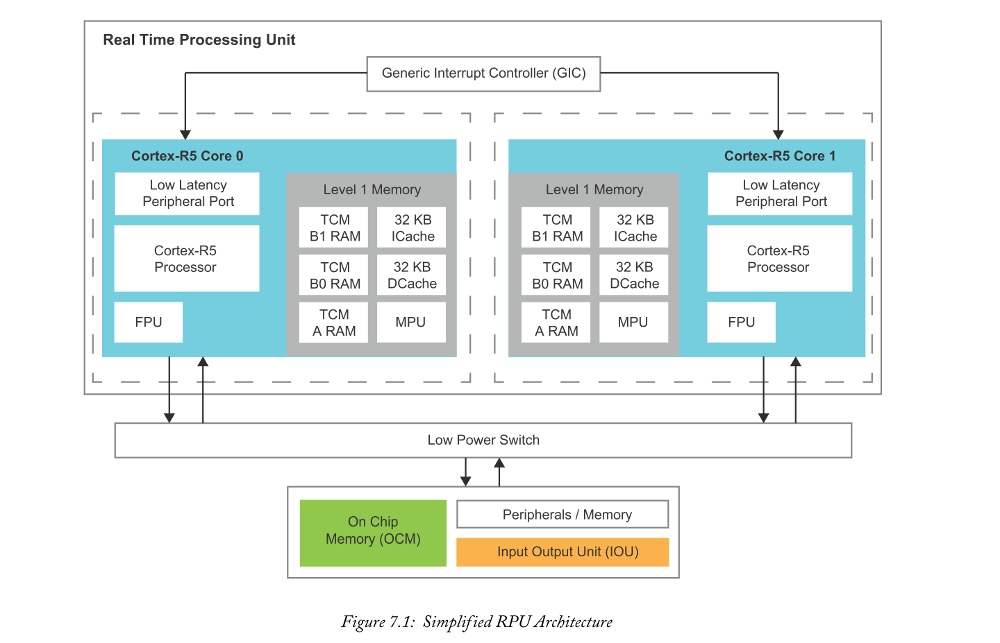
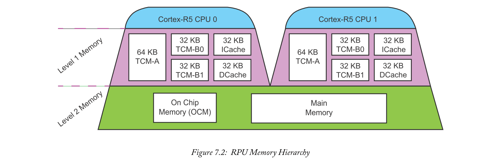
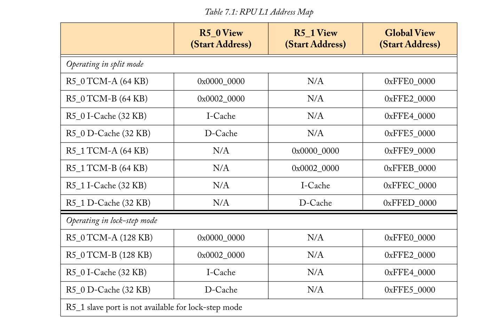
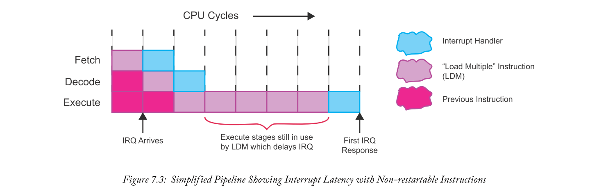
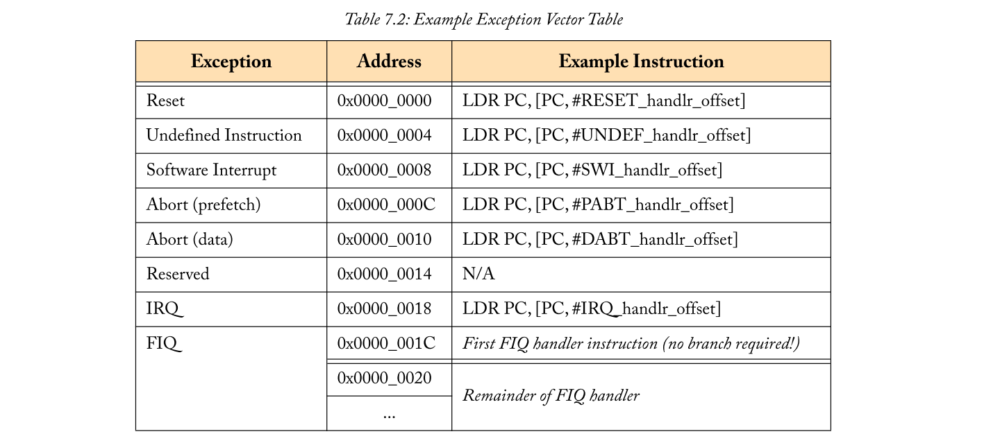
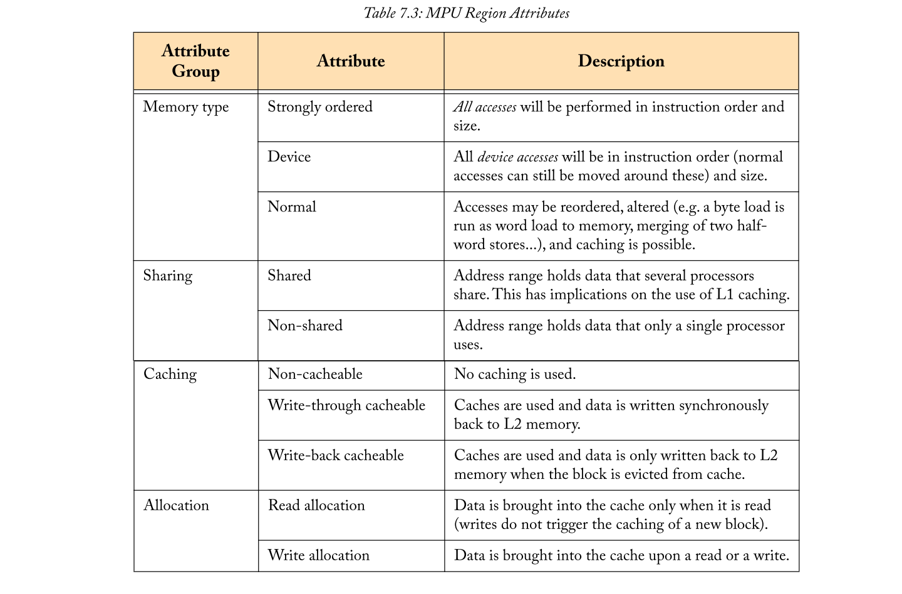
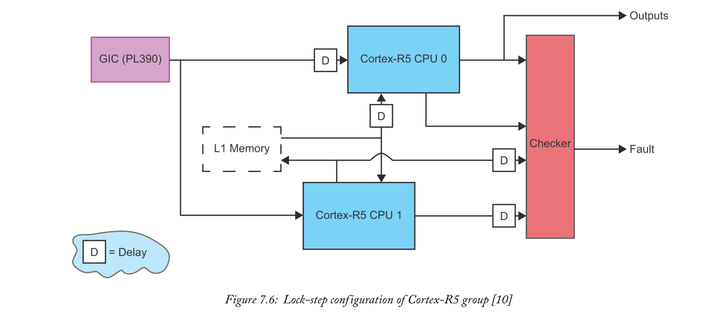

# Chapter 7: The Real-Time Processing Unit
实时系统的基本目标是保证对时间敏感的任务有一定的响应时间。虽然软件必须仔细实施才能提供这些保证，但合适的硬件是前提！确定性、响应性和可靠性是所有实时系统的关键属性。这些属性为实时处理单元（RPU）和其他通用处理器（GPP）之间的设计差异提供了动力，包括APU的处理器。

在本章中，我们将介绍RPU的体系结构，以及开发人员如何使用它来实现系统的实时方面。

## 7.1  Introduction
### 7.1.1  What is Real-Time Processing?
当讨论一般的处理时，我们通常会通过系统的输出来判断正确性。这将验证系统功能的逻辑正确性。实时处理的根本区别在于，它的正确性**不仅取决于函数，还取决于执行时间**。时间限制（也就是最后期限）通常被定义为（物理）事件发生与所需系统响应之间的时间。例如，汽车的防抱死制动系统必须总是在车轮有机会“锁定”之前对驾驶员的制动动作做出反应——这是通过研究和法规确定的毫秒数。**任何实时系统的要求都是逻辑正确的，并保证满足时间期限**。请注意，它应该是一个基于最坏情况的保证，而不是一般情况。由于这些严格的保证，**确定性和可预测性是设计实时系统的一个重要方面**。

那么，什么类型的应用程序实际需要实时处理？根据截止日期要求，有许多不同的例子，通常分为三类：
- Hard deadlines: 硬期限：一次错过的最后期限可能会造成灾难性的后果。这通常出现在关键任务系统中，如防锁制动或起搏器。硬件实时系统的可靠性是一个至关重要的方面，因为故障通常会导致设备损坏甚至生命损失。
- Firm deadlines: 固定期限：就像硬期限一样，一旦期限到期，相应任务的输出就不再有用。然而，不经常错过最后期限并不是那么严重——它只会影响服务质量。数字电视机顶盒就是固定期限的一个具体例子。序列帧的解码可以看作是一个周期性的任务。虽然错过解码帧的最后期限不会造成灾难性的后果，但是错过许多最后期限会导致明显的抖动。还请注意，后期帧没有任何值-显示它只会导致比丢弃它更多的中断。
- Soft deadlines: 软期限：与硬期限或固定期限不同，软期限到期后，输出仍可能有一定的用处。错过最后期限只会影响服务质量（没有其他严重后果）。例如，空调机组可以归类为软实时系统。温度测量可以作为反馈来控制冷却系统。这被归类为软的，因为延迟进行温度测量比完全不进行温度测量要好。

所有这些实时系统都有3个主要的设计考虑，如[1]中所定义的。这些指导我们稍后在第7.3节和第7.4节中的讨论。
1. “**时间是最宝贵的资源**”。当讨论实时系统的时间时，确定性是王道。确定性使我们能够保证我们能在最后期限前完成任务。第7.3节讨论了RPU的特性如何能够提供更具确定性的执行和响应能力，从而使开发人员在期限之前尽可能多地获得时钟周期。
2. “**可靠性至关重要**”：对于硬实时系统，可靠性可能意味着正确操作和生命损失之间的差异。与实时处理不同，可靠性也是设计关键任务系统的重要组成部分。第7.4节讨论了可用于确保可靠性的RPU中的安全特性。请参阅第9章了解有关设备范围安全功能的更多信息。
3. “**计算机运行的环境是一个活跃的组成部分**”：在设计实时处理系统时，应始终考虑更广泛的环境。例如，如果不考虑车辆本身，就不会设计ADAS控制器！这种环境决定了设计的Deadlines。我们在这里并没有详细介绍这一点，因为它依赖于应用程序，但足以说明，对更广泛系统的分析应该通知实时控制器的规范。

### 7.1.2  Why a Different Architecture for Real-Time Processing?
GPPs通常倾向于吞吐量而不是响应能力，并且增加了可靠性/安全性功能。两者的设计都很困难，因为响应特性（如稍后看到的低中断延迟）通常会导致与吞吐量的权衡。

确定性也很难提供通用的体系结构。特别是，内存访问是导致执行时间可变的最大原因之一。从主存储器读写可能需要数百个时钟周期，因此处理器通常包括缓存-小但非常快的本地存储器。缓存通过存储指令/数据块来加速内存访问，这是由该块中的任何非缓存访问所引起的。当要缓存新数据时，必须收回缓存中的其他条目以释放空间。**这使得系统性能难以保证**，因为内存性能取决于缓存的当前状态。当代码可以由具有不可预知时间的异步中断启动时，这一点尤其难以解释。**RPU必须能够保证最坏情况下的响应时间，因此还应该修改典型的GPPs内存层次结构**。

许多硬实时应用程序都是关键任务，如飞机控制或防抱死制动。这些应用程序需要一些额外的可靠性特性，通常通过冗余实现。在硅方面，这些特性有一些开销，甚至性能方面。对于大多数通用应用程序（如笔记本电脑上的网页浏览），不需要这种可靠性，因此在大多数GPPs架构中，这些功能都不需要考虑。

## 7.2  Overview
本概述贯穿Zynq MPSOC RPU中的主要功能。从开发人员的角度来看，最重要的特性放在第7.3节和第7.4节的上下文中。在RPU的中心有一个由两个ARM Cortex-R5核组成的簇。这些是为实时应用而优化的处理器，位于Cortex-R范围的中间。Zynq MPSOC CG设备的RPU可以在高达533兆赫的频率下工作，而EG和EV设备可以在高达600兆赫的频率下运行，所有这些设备的性能都是1.67 DMIPS/MHz[2]。它们实现了32位ARMV7-R指令集以及Thumb-2技术，以提高代码密度[3]。请注意，这与APU中Cortex-A53s的64位ARMV8指令集不兼容。系统的简化视图如图7.1所示。

每个内核都有一个浮点单元（FPU），它支持使用VFPv3指令集[3]的单精度和双精度浮点运算。Cortex-R5可以配置为两种模式之一，统称为“split/lock”：
- Split模式用于性能。每个处理器独立运行。
- Lock-step模式用于确保安全。每个处理器运行相同的指令，提供检测操作错误所需的冗余。

每个核心有32 KB的哈佛缓存。“哈佛”体系结构规定有不同的缓存来存储指令和数据。虽然这些缓存总是可用的，但它们可能不适用于所有实时应用程序，并且可以被禁用。除了缓存之外，**还有128kb紧耦合内存（tcm），它提供了与缓存相当的延迟的确定性访问**。为了增加安全性，**所有缓存和TCM都有错误检查和更正（ECC）**。所使用的方案可以检测最多2个错误位，并在每个32位字内纠正1个错误位。内存保护单元可以选择性地用于为不同的内存区域设置访问属性-检测和防止意外或恶意访问地址空间的受限区域。甚至还有一个内置的自测试（BIST），可以用来检测随机硬错误，通常是永久性故障的信号。

在每个核心和中断控制器之间存在专用的低延迟32位主AXI接口。另一个64位的主AXI接口允许访问主内存和共享外围设备。最后，64位从AXI接口为系统的直接内存访问（DMA）控制器提供到TCMs的路由。这有助于有效地将数据传输任务卸载到TCMS和从TCMS卸载数据传输任务。

在每个核心和中断控制器之间存在专用的低延迟32位主AXI接口。另一个64位的主AXI接口允许访问主内存和共享外围设备。最后，64位从AXI接口为系统的直接内存访问（DMA）控制器提供到TCMs的路由。这有助于有效地将数据传输任务卸载到TCMs和从TCMs卸载数据传输任务。

还有一些特性可以帮助系统分析和调试。有一个到coresight调试访问端口（DAP）的调试高级外围总线（APB）接口，开发者可以通过JTAG访问它。这将暴露指令和数据跟踪，包括诸如程序流更改、当前处理器指令状态等信息[5]。还可以配置寄存器来监视系统性能。这些可用于捕获最多3种事件类型的计数。**事件类型可以是时钟周期、缓存未命中、发出的指令、执行、暂停、中断和ECC错误等等**。

## 7.3  Determinism and Responsiveness
确定性和响应性是实时系统的两个关键元素，那么RPU如何帮助实现它们呢？

### 7.3.1  Tightly Coupled Memories
开发人员可以利用的**最重要的特性之一是内存层次结构**。这通常被设计为在成本和性能之间进行权衡，使用不同级别的缓存。缓存通过利用内存中数据/指令的时间和空间位置来提高平均性能，而不需要程序员付出额外的努力。虽然这很有用，但是实时系统的一些元素需要保证严格的响应时间。虽然缓存可以极大地提高性能，**但在设计实时系统时，确定性通常更为重要。TCM可用于改善最坏情况下的响应时间，使执行更具确定性**。

图7.2显示了RPU的基本内存层次结构。请注意，TCM被认为是第一级存储-在哈佛缓存旁边。**TCMs始终充当不可缓存、不可共享的内存**[4]。

每个核心都可以访问两个64位宽、64kb的TCM banks、TCM-A和TCM-B。尽管程序员通常可以将它们作为单个内存看，但T**CM-B存储库实际上由两个交错的32kb内存组成**。这种交织进一步提高了性能。每个TCM组都有一个专用端口，可以与其他TCM同时访问。通常bank的用途如下：
- TCM-A存储**异常中断**指令，这些异常无法承受与缓存未命中相关的延迟。
- TCM-B用于存储**待处理的数据块**，这些数据块必须确定性地完成。

尽管通常从Cortex-R5核中的一个核访问TCMs，但**可以从系统中的其他地方访问TCMs，如APU和DMA控制器**。这可以通过axi从机接口实现。即使在Cortex-R5核内，也有多个单元可能竞争访问TCM。这包括加载/存储单元（LSU）以及预取单元（PFU）的推测性访问。在给定的场景中，需要进行一些仲裁来控制哪个设备可以访问TCM。LSU的显式访问具有最高优先级，其次是来自PFU的推测性访问，最低优先级分配给AXI从机接口。当使用系统DMA控制器向/从TCM存储器中移动数据时，这可能是需要记住的重要一点！

TCMs被映射到主地址空间，因此程序员只需要使用特定的地址范围就可以使用TCM。地址被全局映射，以便通过axi从机接口访问，并且本地映射到每个Cortex-R5核心。映射还取决于CPU操作模式（拆分模式/锁定步骤模式），这将在第7.4节中进一步讨论。映射如表7.1所示。

例如，RPU上的系统可以处理通过FPGA路由的摄像头捕获的视频帧。设计者可以选择存储中断处理程序，以便在TCM-A（从0x0000_0000）中检索新帧，并将帧数据存储在TCM-B（从0x002_0000）中。这有助于将处理帧的响应时间与在RPU上运行的任何低优先级后台任务分离开来。

### 7.3.2  Interrupt System
响应的一个重要元素是中断处理。事件发生和正在调度的相应中断服务例程（ISR）之间的延迟可能是系统总体响应的主要组成部分。

在考虑中断控制器之前，Cortex-R5的ARMV7-R体系结构有几个方面需要熟悉。这可以大大加快最坏情况下的中断响应时间。首先，体系结构具有**可重启指令**。在处理器**处理中断之前，当前执行的指令必须终止**。即使有乐观的假设，这也会在中断响应中引入显著的延迟。考虑图7.3中的例子，在中断到达简化的处理器之前就发出了“加载倍数”（LDM）。

本例中的**中断延迟**可以定义为**中断到达和执行的第一条中断处理指令之间的时间**。**这种延迟的主要原因是使用流水线的执行阶段的`LDM`指令**。这里假设要加载的数据在缓存中找到。如果不是这样，延迟可能会变大一个数量级。重要的是，**实时系统限制保证的不是常见的情况，而是最坏的情况**。

使用cortexr5中的可重启指令可以减少最坏情况下的延迟。有了这些指令，中断处理程序指令将优先清空当前指令并更快地访问执行阶段。这有助于将中断延迟与前一条指令的特性分离，从而减少抖动。使用可重启指令时需要注意的几点是：
- 由于中断的指令必须重新启动，因此会产生处理开销。中间阶段可以重复。
- **不可能重新启动每种类型的指令**。例如，在访问标记为**设备类型或强顺序**（外围寄存器等）的内存时，很难确保正确的重启行为，因为访问的数量和顺序通常会影响外围行为。

尽管图7.3中的场景有助于说明这个概念，但请记住，Cortex-R5在这里描述的每个获取、解码和执行阶段中都有多个流水线阶段。

与中断处理相关的ARMV7-R指令集的另一个方面是上下文切换到中断服务例程时的软件开销。在进入和退出中断处理程序时，有三条指令可以帮助最小化开销：SRS（保存返回状态）、RFE（从异常返回）和CPS（更改处理器状态）[3]。

现在，中断性能的一些处理器端元素已经被处理，我们现在考虑中断控制器逻辑。两个Cortex-R5核的中断系统由共享通用中断控制器（GIC）控制。在锁步模式下操作时，**GIC为两个核心提供服务这一事实非常重要。它可以配置为只向一个核心发送中断请求——然后可以复制这些中断，从而在锁步期间保持两个处理器同步**。RPU中使用的GIC是PrimeCell通用中断控制器（PL390），详细信息请参阅[6]。主要特点包括：
- 支持多个中断源，包括软件生成中断（SGI）、共享外设中断（SPI）和专用外设中断（PPI）。
- 中断敏感（即电平或沿敏感）、目标（通知哪个CPU）和处理的可编程性。

它由一个分配器单元和两个CPU接口以及两个用于控制和配置的AXI接口组成。分配器负责将最高优先级的中断分配给目标CPU接口。CPU接口将中断转发到各自的Cortex-R5内核，并可以在当前中断由CPU处理时屏蔽来自分配器的低优先级中断。如图7.4所示，它与Cortex-R5整合在一起。

中断延迟有两种不同的改进，这是由于GIC与Cortex-R5集成的方式造成的。首先，**CPU和GIC之间有一个专用的AXI接口（通过低延迟外围端口）**。这意味着没有由于共享的AXI接口的竞争导致的额外延迟。此接口允许访问GIC分发服务器和每个CPU接口中的寄存器。通过这一点，每个核心可以配置中断敏感度和目标，以及在服务中断时根据核心中断屏蔽进行配置。

另一点需要注意的是，两条连接到每个Cortex-R5核心的中断线之间的区别。这些是IRQ（中断请求）和FIQ（快速中断请求）。IRQ发出标准重要性中断的信号，而FIQ发出更重要（通常为单个）的不可屏蔽中断的信号。**安全关键型或延迟敏感型中断（如块、非DMA数据传输）是作为FIQ信号路由的理想选择**。**FIQ响应时间的缩短主要来自**：
- FIQ的优先级高于所有IRQ。这意味着，FIQ无法先发制人并中断IRQ。相反，在处理FIQ时，所有IRQ都将被屏蔽。
- FIQ条目位于异常向量表的末尾。这意味着，可以避免由于向主ISR发出分支指令而通常产生的开销。由于FIQ条目之后没有表条目，因此不需要进行分支。只需将其余处理程序代码直接放在异常向量表之后，如表7.2所示。
- FIQ执行模式有一组“banked”寄存器。当两种模式之间的相同标识符指向不同的物理寄存器时，就称寄存器为banked寄存器。只有通过单一模式才能访问banked寄存器（用于FIQ模式的R8到R14）。这减少了在进入和离开处理程序时保存和恢复寄存器状态的需要，因为它是在FIQ模式下运行的唯一代码。此外，处理程序还可以依赖上一个调用的值，这些值保留在BANKed寄存器中。

如果使用多个FIQ源，大多数性能优势都会降低。不可屏蔽行为、异常向量表布局和存储寄存器**仅在使用一个FIQ源时提高性能**。因此，系统通常设计为每个CPU FIQ最多有一个源。

诸如专用LLPP（低延迟外围端口）和可重启指令等体系结构特性不需要程序员付出任何额外的努力。但是，利用FIQ系统确实可以。有效地使用banked寄存器通常需要手工编码的汇编程序。虽然这仍然很有价值，但是像gcc（GNU编译器集合）这样的编译器现在对ARMFIQ处理程序进行了一些优化[7]。

## 7.4  Safety within the RPU
冗余可以通过几种方式启用，以帮助保护RPU不受错误的影响。这是安全关键系统的重要考虑因素，如大多数汽车应用。我们将在这里讨论安全方面，因为它适用于RPU——请参阅第9章，以获得更完整的功能安全视图。通过本节中介绍的特性，可以减少内存中的错误，甚至处理器的内部逻辑。误差的来源可能是由于辐射、其他极端环境（如温度）引起的异常，甚至是使用电磁或激光的恶意注入故障！

### 7.4.1  Memory Protection
RPU中1级内存的保护由两个系统启用：
- 内存保护单元（MPU）：控制对L1和外部内存的访问。区域可以用可配置的访问权限和内存类型进行编程。这**有助于捕获访问地址空间中受限区域的错误或恶意软件**。
- 错误检查和纠正（ECC）：可应用于一级存储器，通过存储大量冗余位，可以纠正1位错误并检测2位错误。这有助于防止内存损坏，而不会因完全复制内存而受到性能惩罚。

首先，我们更详细地讨论MPU。MPU取代了更传统的MMU，以更好地适应实时环境。MMU的一个任务是执行从虚拟地址空间到物理地址空间的转换。**这会导致一些不同的非确定性行为，包括TLB中的页故障和未命中**。这对于实时环境来说是不可取的，因此MPU的设计没有这些功能，而只关注内存保护。

MPU最多可配置16个区域。发生错误（权限错误、对齐错误或访问所有区域以外的区域）时，MPU会引发中止异常。这会中断Cortex-R5核心，并发送适当的中止处理程序。请注意，错误不仅由显式加载/存储（数据中止）引起，还由处理器执行的推测性预取（预取中止）引起。它们有不同的处理程序，如表7.2所示。

每个区域都有一个可配置的基址、大小、属性和访问权限。这些属性定义如何执行内存访问。这包括以下选项组：

内存属性旁边还有访问权限。这些允许选择只读、读/写或不访问。访问权限对于特权模式和其他模式是不同的。区域也可以标记为“从不执行”，以防止获取指令。

MPU支持重叠区域和子区域。这使开发人员可以使用16个可用区域构建复杂的布局。区域号越高，属性和权限的优先级就越高。例如，当区域4和15重叠时，重叠地址的权限从区域15继承。每个区域也可以分为8个大小相等的子区域。可以禁用子区域，以便应用重叠的低优先级区域的属性和权限。这些技术可以很容易地**应用于在堆栈溢出等事件上产生异常**。这比静默地溢出堆栈并稍后遇到意外行为要好得多。

在MPU配置中，有**两种情况会覆盖区域设置**：
- 映射到TCM的地址总是被视为正常的，非共享内存，因为每个处理器都有自己的TCM。
- 映射到外围端口的地址（如LLPP到GIC）始终被视为不可缓存，从不执行。

现在考虑对一级缓存和TCM进行错误检查和更正。对于每个32位块，L1缓存和TCM存储大量冗余位，这些冗余位可用于单错误校正、双错误检测（SEC-DED）。一旦启用，从程序员的角度来看，操作基本上是被动的。**检查和校正在硬件中执行**，如图7.5所示。在每次加载时，相应的ECC位用于检查获取数据中的错误。更正可以提交回内存或直接传递到下一阶段。

在使用ECC方案时，即使使用无错误操作，也可能会影响性能。例如，考虑将一个字节写入L1内存。为了写入数据，必须计算一组新的ECC位。然而，应用ECC的数据块大于一个字节。块的其余部分必须首先被读取，与新的字节连接，然后在最后执行写入之前必须计算新的ECC位！这个过程称为读-修改-写。在这种情况下，**一条写入指令可以推断出读取、计算和原始写入**。

当**检测到一个字中有一个错误时**，它可以自动更正。这有**两种机制**：
- Correct inline：使用E**CC位纠正从内存中读取的数据，并直接使用新数据**。校正后的数据在校正时不会写回存储器。
- Correct-and-retry：使用ECC位更正从内存读取的数据，并将新数据写回内存。**重新执行读取指令并读取已更正的数据**，前提是不会再发生错误。

Correct-and-retry需要更多的周期（至少9个）才能完成，但是这不会显著影响平均性能，因为内存错误应该很少发生。Correct inline用于从AXI-slave接口（从RPU外部）读取时检测到的错误，以及correct-and-retry从Cortex-R5内核之一读取的指令/数据检测到的错误。

因此，可更正的错误是使用correct inline or correct-and-retry来处理的。ECC方案如何处理不可纠正的错误，如2个或更多的错误位？RPU可以配置为在检测到错误时生成中止异常或忽略错误。还可以将可更正的错误配置为生成中止异常。值得注意的是，ECC方案不能完全保证无错误的内存操作。如果两个以上的位出错，就会出现问题。ECC方案可能会错误地将其解释为一个有效的块或单个错误，并尝试更正它，但仍然会产生不正确的结果。“硬错误”也会影响可靠性。这些都是物理故障，内存中的某个位无法可靠地访问。**ECC模式并不总能从中恢复过来**。

### 7.4.2  Split/Lock Modes
Cortex-R5支持两种配置模式。这两种模式的组合称为“split/lock”。这两种模式是：
- Split模式：每个CPU独立运行。也称为性能模式。
- Lock-step模式：两个CPU执行相同的安全指令。也称为安全模式。

模式配置是静态的，因此只有在处理器组保持复位时才允许在模式之间切换。SLCLAMP和SLSPLIT信号分别用于选择Lock-Step和Split模式。

一般来说，当安全性不是主要问题时，Split模式的性能优势是值得考虑的。处理器组的工作方式类似于典型的双核系统。Split模式需要注意的主要问题是两个核心之间的一致性。两组L1缓存之间没有内置的一致性。当在内核之间共享数据时，MPU可用于将内存区域标记为不可缓存/可共享。这样可以避免L1缓存中的一致性问题（不使用它们！）.

Lock-step模式使用第二个CPU作为冗余逻辑，执行与第一个相同的指令。还有一个额外的逻辑，它比较两个CPU的输出，以便从内部逻辑中检测错误。由于辐射，逻辑错误有可能以同样的方式影响两个处理器。这不会被标记为一个错误，因此避免两个核心的常见错误是一个设计目标。为了帮助实现这一点，两个处理器在物理上是分开的，并且在时间上——即一个处理器将比另一个处理器运行2个时钟周期。事实上，“锁步”一词来自一个军事术语，指的是在一个文件中非常接近地行进。这类似于一个处理器紧跟另一个处理器的动作，紧跟其后。锁步配置如图7.6所示

请注意，让CPU在不同实例上执行指令并在检查逻辑之前重新同步所需的延迟。检查逻辑使用CPU输出管脚和到L1存储器的接口。监视内存接口可以使错误的写入在将任何内容提交到内存之前足够早地在管道中被捕获，甚至在2个周期延迟的情况下也可以停止！

L1存储器系统在锁步模式下也会略有变化。为了安全起见，不需要复制TCM和缓存，因为已经有了ECC方案。既然两个CPU都在执行相同的指令，那么与每个核心相关联的TCM可以在锁步模式下组合成一个更大的TCM。这在表7.1中进行了介绍。

当两个核心的输出不一致时，可以产生故障信号（DCCMout[7:0]和DCCMout2[7:0]）。它连接到PMU错误处理系统，并通过JTAG错误寄存器公开。**当RPU锁步错误时，可以将PMU配置为以下行为**：
- Assert PS_ERROR_OUT signal
- Generate an interrupt handled by the PMU
- Generate a system reset (SRST)
- Generate a power-on-reset (POR)

当RPU保持在复位状态时，可以进入锁步模式。重置处理程序中应该有代码，以确保中断只被发送到CPU 0。用于进入锁定步骤模式的完整序列列在[9]中。

## 7.5  Chapter Review
本章详细介绍了实时处理单元。从响应性和可靠性（许多实时系统的定义特征）的角度对主要特性进行了探讨。虽然这还远不是一个教程可介绍完的，但是已经介绍了配置重要功能（如MPU和拆分/锁定模式）的各个方面。

对于任何进一步的阅读，读者将首先指向[9]和[4]。请注意，建议同时使用Xilinx和ARM文档，因为它们相互补充。ARM讨论了体系结构的细节，同时概述了缓存大小和核心数量等细节，而Xilinx描述了Zynq MPSOC设备中的实现选择。

