# Chapter 8 Security in Zynq MPSoC

本章重点介绍Zynq MPSoC中的安全功能 - 包括加密服务，对篡改尝试做出反应以及其他运行时保护。我们解释了这些功能的原因，方式和最重要的原因。目的是让您了解为什么要在设计中真正可用的安全功能，以及如何实现这一目标的想法。

对于之前使用过FPGA器件的读者来说，您可能还记得安全问题几乎归结为一个问题：“我应该加密我的比特流吗？”1。随着可编程设备变得越来越复杂，常见的攻击变得越来越复杂，这个简单的问题已经爆发出许多不同的考虑因素 - 其中一些是截然不同的，而另一些则巧妙地交织在一起。
在接下来的部分中，我们将介绍Zynq MPSoC的众多安全功能，以及为什么它们对于注重安全的设计人员非常重要。我们将系统安全性视为三个易于理解的子主题： 
- 1.信息保证：使用加密技术保持系统配置和数据保密和不修改。这是芯片预防措施的一部分。
- 2.防篡改：用于保护我们系统的硬件免受实际访问设备的攻击者的攻击。这是芯片的检测和响应措施的细节。
- 3.隔离：作为预防措施，以阻止系统不同部分之间的任何攻击或故障传播 - 再次，回到一些最终的预防措施。

请记住，所有这三个主题通常同时用于防止复杂的攻击 - 攻击和对策之间很少有1：1的关系。然而，为了激发读者的胃口，表8.1列出了我们将在本章中讨论的一些示例攻击。

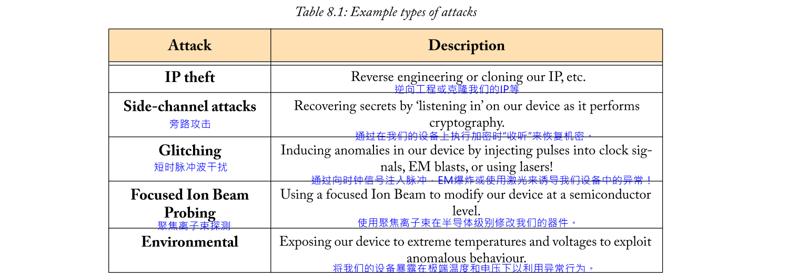

所以，没有任何进一步的麻烦，让我们深入了解Zynq MPSoC的安全功能！

## 8.1  Information Assurance for Configuration Security

对于大多数嵌入式系统，特别是一旦部署在Big Bad World™中，有些元素我们希望保持安全。对于Zynq MPSoC系统，我们通常希望保护两组不同的信息 - 系统配置（比特流和软件映像）和任何用户数据。对于系统配置，我们经常希望防御诸如IP盗窃（有人简单地克隆设备以窃取我们的辛勤工作，甚至逆向工程系统的部分）以及运行未经授权的代码的人等威胁。它们分别映射到机密性和身份验证的属性。

在谈论信息安全时，“安全性”通常指的是系统完整性，身份验证和机密性。这些属性对于保护我们的软件和比特流至关重要：
- **完整性**确保我们的系统配置未被修改。
- **身份验证**扩展了完整性，证明配置确实来自受信任的开发人员，而不是攻击者。
- **机密性**可确保未经授权的人员无法理解我们的部分配置。这通常是人们在谈论加密时所想到的。

这些是不同的属性，但它们通常一起使用。依次考虑每个属性。即使真实内容对您隐藏，仍然可以修改加密或“机密”比特流（[1]讨论了一个真实的例子）。可以清楚地看到具有良好完整性检查/认证的比特流，但任何修改内容的尝试都将证明是困难的。但是，使用完整性和机密性会导致无法轻松读取或修改的比特流。

Zynq MPSoC具有对加密的硬件支持，为启动时的系统配置和运行时的用户数据提供机密性和身份验证。我们将继续解释这些块的体系结构，为什么/何时应该使用每个块，以及如何使用它们。

### 8.1.1  Configuration Security Unit Introduction
配置安全单元（CSU）是Zynq MPSoC加密功能的核心，可确保在安全启动期间正确使用。如图8.1所示，CSU可以被认为是两个块：

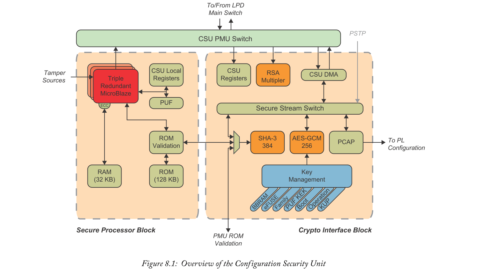

- 加密接口块（CIB）封装了所有硬件加密单元和相关的密钥管理。加密单元既可以在安全启动期间使用，也可以在运行时从应用程序使用。主要功能包括SHA-3/384哈希，AES-GCM-256加密/解密和RSA加速。
- 安全处理器块（SPB）是（安全）引导的可信仲裁器。这是一个小型的自包含处理系统，可以利用CIB对安全配置进行身份验证和解密。**SPB不是用户可访问的**，因此恶意软件没有机会影响其安全功能。

这两个模块通过CSU PMU Switch专有地与Zynq MPSoC的其余部分连接。

#### Secure Processor Block
SPB是一个小型处理系统，专门用于在启动时处理系统配置。它还监视运行时的任何篡改尝试，包括电压/温度警报和JTAG活动。该块在很大程度上与Zynq MPSoC的其余部分隔离，无法通过用户访问。这有助于防止系统中其他任何恶意或错误的软件干扰SPB正确处理关键任务。如下所述，还可以针对硬件级故障或篡改实施防御。

首先，系统确保不会执行修改的代码。**SPB仅执行存储在其片上128 KB金属掩模ROM中的代码**。该代码由Xilinx开发，并作为制造期间使用的掩模的一部分实现。片上代码已经为攻击者带来了一些困难。即使修改成功，也会在引导时自动对ROM执行基于SHA-3的完整性检查，以检测此类故障。通过冗余执行代码时，SPB也受到保护 - 通过具有**三个冗余MicroBlaze内核和用于专用内部RAM的ECC**。

虽然冗余功能传统上被认为是防止辐射随机翻转位的安全保护，但它们也成为安全研究的主题。许多已发表的攻击通过故意将设备暴露于辐射（EM脉冲，激光，临时意外电压）以引发受控故障而起作用。

如果没有这些冗余，诱导故障可能会通过跳过指令[3]来破坏安全启动，或者对加密执行一些更复杂的分析，例如：[2]。有关如何实现这些冗余特性的更多信息，请参见第9章。类似地，有些攻击会通过使用脉冲干扰外部时钟信号[4]来强制指令或部分指令被跳过（导致损坏）。SPB通过从内部不间断时钟源运行来帮助防止这种情况发生。

SPB还控制物理不可克隆功能（PUF）。PUF利用硅制造中存在的固有的，不可控制的随机性。普通数字设备的设计具有公差以解释这种随机性，但PUF主动利用它为每个设备提供唯一的指纹。在这里，物理过程保证了唯一性 - 而不是制造员工。然后，该指纹可用于生成用于安全引导的每设备密钥。有关PUF使用的更多信息，请参阅第195页的“以加密（黑色）形式存储密钥”。

#### Crypto Interface Block
CIB包含硬件加密服务，可以在引导期间由SPB使用，也可以在运行时由用户应用程序使用。其结构概述如第182页的图8.1所示。我们可以将CIB视为一组加密核（图8.1中的橙色），一组密钥存储（蓝色）和数据传输的支持逻辑（绿色）。主要功能包括：
- 密钥管理（Key management）：为密钥（AES密钥和RSA密钥哈希）提供长期存储，为临时/中间密钥提供临时寄存器。
- 加密块（Crypto blocks）：提供硬件加速的AES-GCM（256位），SHA-3（384位）和RSA（4096位）。这些帮助设计人员实现数据机密性（攻击者无法破译它），完整性（我们知道攻击者是否进行了修改）和身份验证（我们知道数据来自我们期望的人）。
- 安全流交换机（Secure Stream Switch）（SSS）：促进AES-GCM模块，SHA-3模块，PCAP接口，JTAG接口和CSU DMA（可以从用户应用程序配置）之间的数据传输。
- PCAP：提供通过安全流交换机配置FPGA架构的接口 - 直接使用来自CSU DMA，JTAG接口或AES-GCM输出的数据。
- CSU DMA：为SSS和用户应用程序之间的大块提供专用数据传输逻辑。

与SPB不同，**CIB的元素是用户可访问的**，因此用户应用程序可以在运行时使用其加密服务。可以通过SSS访问加密块和PCAP。用户请求的数据传输到/来自这些块可以由CSU DMA执行。

在继续之前，CIB的结构有两个方面（图8.1）值得澄清。首先，大多数使用SSS的块都直接连接，但为什么SHA-3块不同？SHA-3块还用于在引导时对CSU和PMU ROM进行完整性检查（而其他SSS连接的块不是）。然后，该引导时ROM完整性检查需要直接路径到SHA-3块，这导致概览图中SHA-3输入的额外多路复用器。其次，为什么RSA块不是由CSU DMA驱动的，比如AES-GCM和SHA-3块？RSA块的主要用途是验证SHA-3摘要。这些摘要只有384位长！由于输入和输出数据通常很小，因此配置DMA所产生的开销可能不值得。

### 8.1.2  Crypto Blocks
主要的加密加速器存在三个单元，每个单元具有互补的目的。这些是AES，SHA和RSA单元。我们将依次讨论它们中的每一个，给出一些算法如何工作的背景以及为什么我们可以选择使用它们。对算法的一点了解可以大大改善其正确使用的神秘面纱。对于具有加密背景的读者来说，这不是什么新鲜事，但我们也将讨论如何编程这些块。

关于所有这些模块的一个注意事项 - 它们在引导期间从内部振荡器运行，但可以配置为在引导后从更快的PLL时钟运行。这有助于防止在安全启动加密期间发生常见的时钟故障。

#### AES-GCM
在简洁的技术语言中，这是一种硬件AES实现，它支持256位密钥和Galois / Counter模式（GCM）。我们将退后一步，尝试了解这对我们的真正作用。

首先，我们看一下AES加密算法 - 暂时忽略GCM方面。该算法由国家标准与技术研究院（NIST）根据感兴趣的各方提供的透明和开放的流程选择，目前已在全球范围内使用。简而言之，它的工作是获取一些数据并使用保密的密钥对其进行加扰。然后，没有密钥的任何人都无法理解输出。因此，我们可以在片外存储加密文件，并**确保只要密钥保密，攻击者就无法恢复文件内容**。（第8.1.3节描述了如何使用片上密钥存储来保密密钥。）**“加扰”过程是可逆的，因此可以进行解密**。

为了理解算法的工作原理，我们可视化图8.2中的4个基本步骤。数据表示为4x4字节网格。将这4个步骤组合在一起形成一个“round” - 14个rounds构成完整的AES-256算法。每一步都有一个独特的目的：

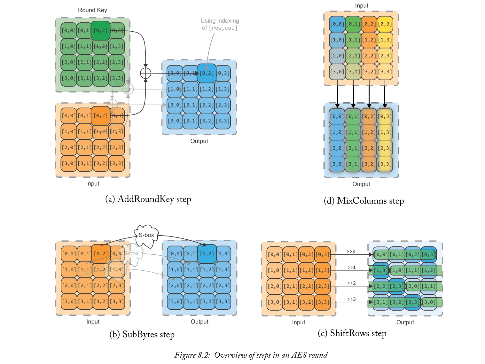

- **SubBytes**提供*non-linearity*。这是通过用另一个值（通常实现为表查找）替换每个字节的值来完成的。
- **ShiftRows**通过确保每列之间存在一些交叉授粉来提供*diffusion*。这有助于避免每个列单独加密。每行循环移位一个唯一的字节数。
- **MixColumns**通过将给定列中的所有值混合在一起来提供*diffusion*。
- **AddRoundKey**提供*key-dependence*。这是通过使用round key对状态进行异或来实现的（从主键导出 —— 对于14个rounds中的每一round都有一个）。

AES加密是确定性的。如果我们将相同的数据块加密两次（使用相同的密钥），则输出将是相同的。当文件被逐块加密时，攻击者可能会看到重复数据的模式并提取一些有用的信息。为了解决这个问题，采用了不同的操作模式，为任何重复的块提供独特的输出。这些模式通常使用递增计数器值或来自先前输出的反馈。我们使用GCM模式[5]。通常因为良好的性能和合理的资源选择它。输入数据永远不会通过AES算法本身传递，而是计数器值被“加密”，然后与输入数据组合。初始计数器值由初始化矢量（IV）用户控制。加密计数器允许以一定程度的并发性处理块，因为在下一个输入阶段不需要一个块的输出。此外，每个块的输出（加上一些额外数据）通过Galois乘法传递，然后进行组合和加密以提供消息完整性代码（MIC）。使用MIC可以排除诸如[1]中前面提到的位翻转攻击之类的攻击。完整的加密过程如图8.3所示：

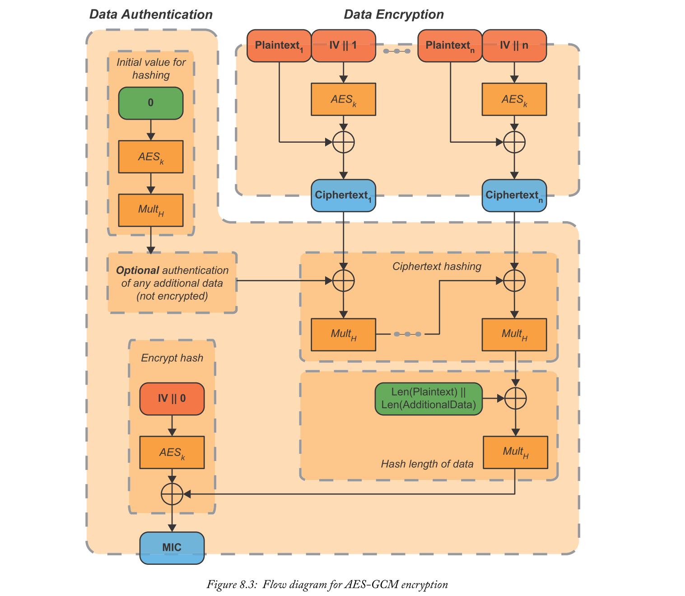

应该为每个文件随机生成IV，以充分利用AES-GCM。如果使用，则IV包含在引导头中。IV向量还用于Zynq MPSoC实现中的第二个目的。AES-GCM仅使用IV的最高有效96位 - 最低有效32位由递增计数器值替换。这意味着我们可以自由地在IV的最低32位中编码一些额外的选项。这些用于下面讨论的键值滚动技术。

Zynq MPSoC的安全性考虑现在包括针对旁路攻击（SCA）的对策，因为此类攻击变得越来越可行。这些攻击试图通过分析在设备解密许多数据块时所采用的功率或电磁测量来提取秘密的片上密钥。可用的一种SCA对策是使用键滚动。这旨在减少单个密钥的使用，使攻击者无法收集足够的测量值以在正常操作下恢复密钥。这是通过将要加密的文件（例如FSBL图像）拆分为单独加密的小块来实现的。每个块都使用唯一密钥和IV加密。初始密钥像往常一样存储（片上或引导头），但所有后续密钥和IV都被加密并存储在前一个块的末尾。这最大限度地减少了单个密钥的使用，并且重要的是，通过旁路通道限制新密钥暴露给攻击者。IV的最低有效32位用于设置块大小（即，用单个密钥加密多少数据）。键值滚动过程如图8.4所示。

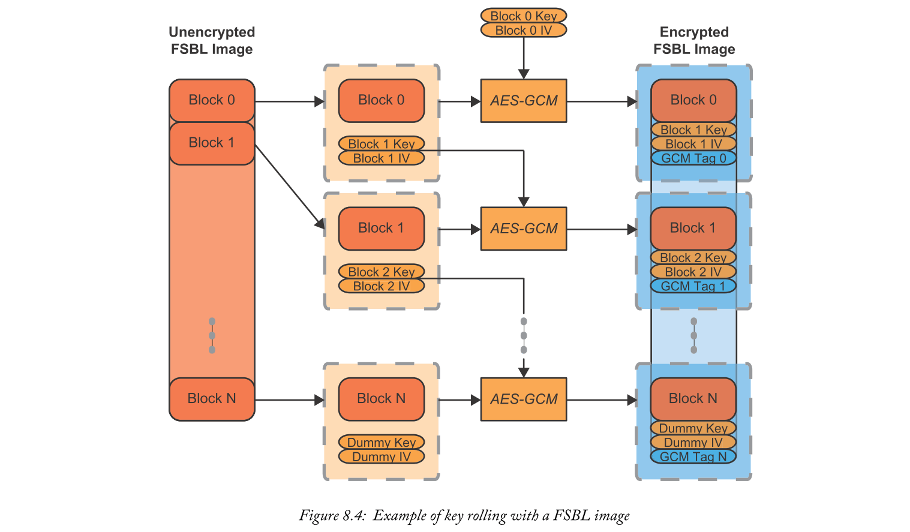

密钥滚动技术在CSU ROM中实现，而不是直接在硬件单元中实现。这意味着它可用于安全启动，但不能在运行时从用户应用程序启动 - 尽管可以轻松地再现相同的技术。有关在安全引导期间使用的更多信息，请参阅第353页的“系统引导”。

总之，AES核心实现了AES-256以确保数据机密性，使用Galois / Counter模式增加了认证和防止密文相关的保护，以及通过CSU ROM提供的用于对抗SCA的键值滚动技术。

有关在运行时从您自己的应用程序编程AES内核的详细信息，请参见技术参考手册[6]的第12章。

#### SHA-3
SHA-3/384单元是安全散列算法3的硬件加速器，提供384位输出（或“摘要”）。和AES一样，这个算法是由NIST选择的[7]，他们实际上有一个共同的设计师Joan Daemen！SHA-3的目的是提供完整性。加密散列的目标是提供单向函数，该函数不可逆，输出固定长度的摘要。它是用于完整性检查的单向属性。当SHA-3摘要与（可能已损坏或已修改）文件一起发布时，设备可以在本地计算文件的SHA-3摘要，并将其与可信SHA-3摘要进行比较。攻击者极难生成生成相同SHA-3摘要的不同文件，因为该函数是单向的。

特别是对于Zynq MPSoC，SHA-3单元用于在启动时对CSU和PMU ROM进行完整性检查。用户应用程序也可以使用它进行完整性检查。除了完整性检查之外，它还经常与RSA单元一起使用以生成签名 - 提供身份验证。第189页的RSA部分更详细地讨论了这些签名。

SHA-3通过一组字节（称为状态）通过置换函数（在图8.5中表示为“f”）重复传递。在每个排列之前，输入数据块与状态的子集混合。摘要取自最终状态的子集。大多数数学技巧都隐藏在置换函数中。重要的是提供diffusion，使得输入的单个位翻转被放大以产生完全不同的摘要。SHA-3/384算法概述如图8.5所示。

同样，读者可以参考技术参考手册[6]的第12章，了解有关SHA-3内核编程的详细信息。请注意，输入的长度必须是104字节的倍数 - 在需要时添加填充。

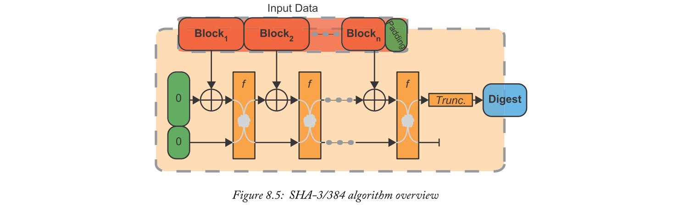

#### RSA

RSA单元为RSA的基本构建块提供硬件加速 - 一种非对称加密算法。作为非对称算法，RSA使用两个不同的密钥进行加密和解密（一个公钥和一个私钥），而不是用于AES的共享密钥。这减轻了在两个设备之间安全地共享密钥的挑战。RSA的计算成本非常高，因此在切换到该算法之前，它通常用于传递AES（或类似）的加密密钥。在Zynq MPSoC的上下文中，我们更频繁地使用RSA来检查文件的签名，以确保完整性并验证其来源。签名是SHA-3哈希，然后通过RSA与作者的私钥一起传递。拥有作者公钥的任何人都不仅可以验证文件的完整性，还可以确保它没有被原作者以外的任何人修改（因为只有他们应该知道作者的私钥！）。在Zynq MPSoC安全启动过程中广泛使用签名检查来检测未经授权的固件。

RSA算法的不对称性完全依赖于硬件可以将两个大质数相乘的想法，但很难将结果反馈到两个原始素数中。在为RSA生成密钥时使用此假设1  - 其中许多RSA的数学细节潜伏[9]。出于本讨论的目的，加密和解密过程更有趣。

对于加密和解密，RSA遵循类似的数学结构： 

$$
y=x^{e} \quad(\bmod n)
$$

给定输入x，关键指数e，模数n和输出y。这称为模幂运算。虽然它是用数学符号简单描述的，但是当在软件中实现时，模幂运算可能非常慢。当然，取幂可以通过重复乘法（和模的除法）来实现，但请记住，这些词在理论上可以长达数千位！

RSA核心加速了这种模幂运算，支持：
- 使用蒙哥马利乘数的模幂运算[10] [11]。这避免了由n进行代价高昂的划分的需要，而是使用加法和除以2的幂（即比特移位）。
- 蒙哥马利乘法的先决条件的可选计算（其中，基于的是常数和系统字长）。这已经由BootGen软件预先计算用于签名固件，因此开发人员无需考虑它！
- 可配置的4096位和2048位密钥支持。

RSA内核由本地RAM支持，132个字，每个192位宽。用户可以通过一组支持寄存器访问该RAM。可以通过CSU中断或简单地轮询RSA_CORE的STATUS寄存器来显示“完成”信号。

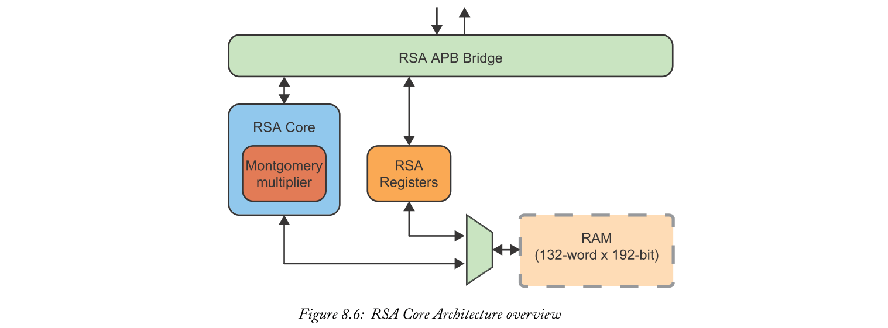

进一步的编程细节可以在技术参考手册[6]的第12章中找到，并直接引用独立的XilSecure库[12]。

### 8.1.3  Key Management

内部存储密钥是嵌入式设计加密的重要方面。如果攻击者可以访问我们的密钥，他们可以解密我们的敏感文件，因为算法是公开的（并且应该是！）。通过将这些密钥存储在一个小型片上存储器中，我们可以很长时间地保护这些密钥。这些存储器只能通过非常严格的大小限制来实现（否则我们只会将整个应用程序存储在芯片上！）。我们将介绍长期密钥存储的选项，以及使用专用寄存器中的中间密钥的选项。

#### Boot Image Keys
密钥管理必须能够存储在电源循环之间持续存在的密钥，这与芯片的其他部分不同，后者在断电时会丢失其配置。这是使安全启动成为可能的关键元素之一（双关语）。

可用选项类似于Zynq-7000，但增加了一个新选项。这些是：
- eFUSE：便于在芯片内部使用永久性的一次性可编程密钥。这些可以通过eFUSE阵列的电子“blowning”位为每个芯片独立配置。
- Battery-Backed RAM（BBRAM）：片上BBRAM可以为AES保存256位密钥。作为对eFUSE持久性的补充，可重写BBRAM提供了关键擦除（对篡改检测的反应）和敏捷性（在运行时更新）的机会。它由外部电池支持。
- 启动映像：Zynq MPSoC的新功能，密钥实际上可以存储在启动映像本身中。这是通过仅存储以某种方式被混淆的密钥版本来安全地实现的 - 永远不是真正的密钥本身。这种混淆可以通过使用AES加密真实密钥来实现，其中另一个密钥已经在芯片上，例如，从PUF生成的密钥，或“家庭密钥”1。

对于可用的三种存储选项中的每一种，存在不同的编程方法和状态，密钥可以存储在其中。密钥可以以纯文本形式存储，或者可以通过首先使用系列密钥对其进行混淆或者完全加密来进一步保护密钥。它带有PUF密钥加密密钥。这三种状态（纯文本，混淆和加密）通常分别使用红色，灰色和黑色来表示。这源于安全法规中使用的“RED / BLACK”概念，讨论处理国家安全信息（红色）的设备必须如何与处理已加密数据的设备（黑色）分开[13]。我们使用'gray'来表示混淆的密钥位于红色和黑色之间 - 不是纯文本，而是完全加密的声音。表8.2列出了关键存储可能性的摘要。

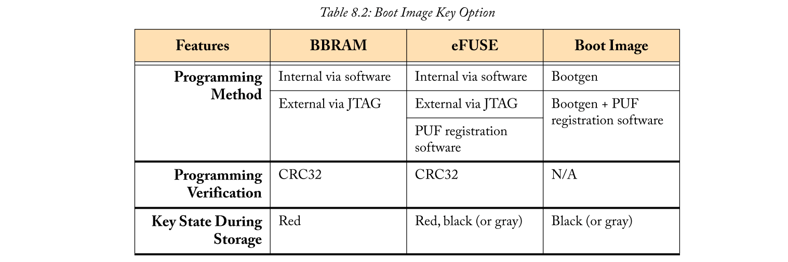

#### 

## 8.2  Anti-Tampering
虽然加密是保护嵌入式系统及其数据的重要部分，但还有其他方面也非常重要。一个这样的方面是检测并响应攻击者物理篡改设备的任何尝试。请注意，这也与功能安全性的考虑重叠，这将在第9章中进一步讨论。

首先，我们讨论Zynq MPSoC为检测不同的“篡改事件”提供的选项。通过检测到这些事件，我们将介绍对篡改事件做出反应的一些可能性。我们总结了一些额外的被动预防措施，可以在Zynq MPSoC设计中使用，以帮助排除一些常见的篡改方案。

### 8.2.1  Monitoring
在运行期间，CSU的主要任务是监控和响应篡改事件。它可以配置为监视13个独特的事件，完全在表8.4中列出。这些可以大致分为监视系统电压rail，内部温度，PL配置损坏，外部引脚上的活动以及内部触发寄存器。请记住，这些事件可能是由芯片的自然环境引起的，也可能是故意的攻击引起的。

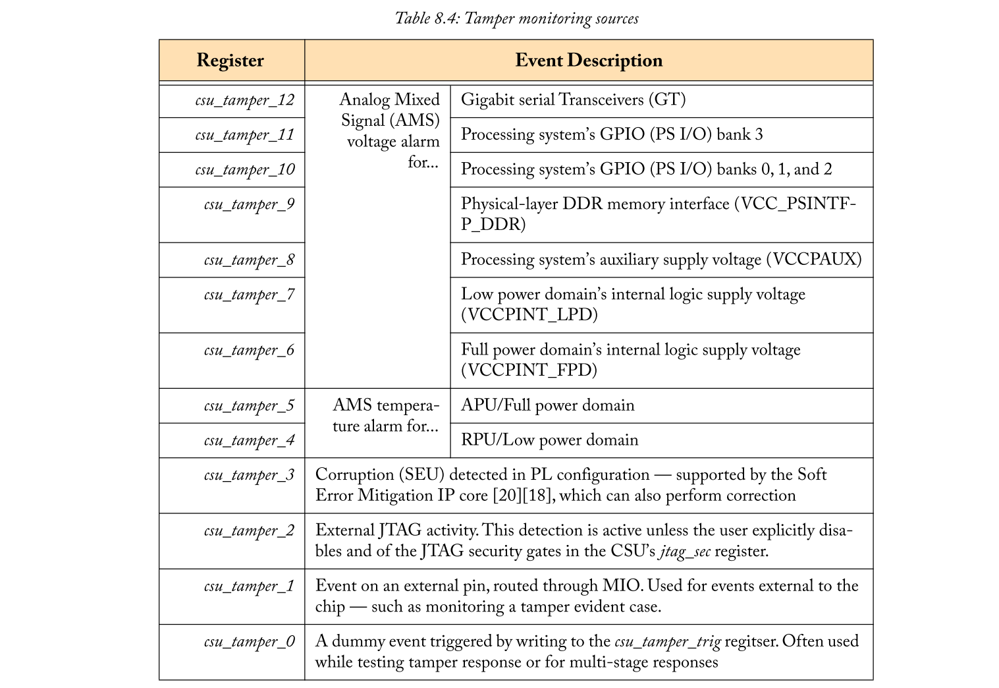

写入`csu_tamper_trig`寄存器引起的内部触发值得特别注意。这可以通过几种不同的方式使用：
- 1.软件驱动事件：通过基于软件的监控引发篡改响应。例如，这可以与APU中Linux上运行的入侵检测系统一起使用 - 例如Tripwire [21]。
- 2.模拟篡改事件：彻底测试篡改响应功能至关重要，但是，安全地引发与温度和电压相关的篡改事件可能非常困难。使用`csu_tamper_trig`寄存器，可以通过写入寄存器而不是将芯片推到其正常操作环境之外来执行响应测试。
- 3.多阶段响应：允许从自定义代码和硬连线系统响应构建对篡改事件（即“篡改惩罚”）的响应。有关如何实现此目的的更多信息，请参见第202页的“多阶段响应”。

### 8.2.2  Response
Zynq MPSoC系统将**持续监控所有篡改事件，但由开发人员决定CSU应如何响应每个事件**。这主要通过在相应的csu_tamper_X寄存器中设置标志位来完成（如第201页的表8.4中所列）。每个寄存器都有以下结构（不用担心，我们将在之后解释新术语！）：

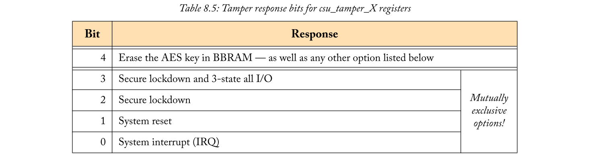

注意，表中下部的4个响应中只有一个可以被采用，因为每个响应是互斥的（而不是擦除BBRAM），如果设置了多个位，则使用最高有效位。另外，请注意这些位是set-only的，即在发出上电复位之前不能清零它们。这样做是为了使任何错误的软件只能使篡改惩罚更严重，并且永远不会减少。

稍微详细说明了不同的选项，“安全锁定”[22]意味着片上RAM，​​所有缓存和PL都被清除，处理系统进入锁定模式，仅在上电复位后才会进入 。“3态全I / O”选项使所有I / O引脚处于高阻态 - 有效地将它们与电路板断开。这形成了最严格的篡改惩罚，删除了所有外部状态信号。

#### Multi-Stage Response
多阶段响应技术提供了强制其他篡改惩罚的能力，超出了我们已经看到的csu_tamper_X寄存器位。这是通过结合`csu_tamper_trig`寄存器和系统中断篡改惩罚来实现的。

我们使用通过清除用户数据然后进入安全锁定来响应FPD温度警报的示例来演示如何在图8.13中实现这一点。

在这里，我们看到`csu_tamper_trig`寄存器用于触发系统篡改惩罚，而原始篡改事件仅触发系统中断 - 由用户代码处理。在我们的示例中，用户代码执行篡改事件记录或清除用户数据，但它也可以执行许多不同的操作。我们将在下一节讨论一些可能的反应。

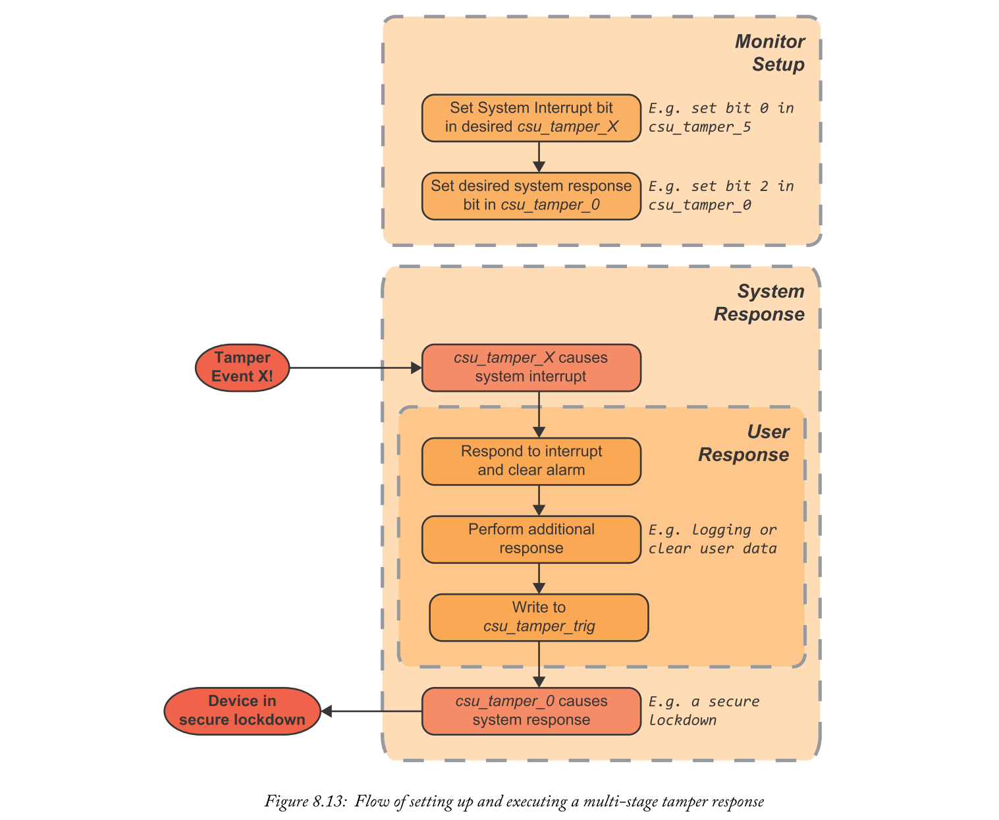

#### Potential User Responses
用户定义的篡改响应可能因应用程序而异，但我们在此处涉及一些常见的响应。
- 清除敏感用户数据：对于处理或存储私人用户数据的应用程序，明智的篡改响应可能是从内存中清除任何未加密的副本，和/或清除用户密钥。
- 非易失性日志记录：当设备打算防篡改时，良好的响应技术可以记录检测到的篡改事件。要使此日志持久化，可以在256位用户eFUSE中记录事件。虽然这绝对不足以记录类似堆栈跟踪的内容，但它可用于记录事件已发生，也可能在其他地方存储更多详细信息。
- RSA公钥撤销：擦除BBRAM AES密钥是标准的系统响应，但撤销RSA密钥同样重要。虽然这些基于eFUSE的密钥无法擦除，但是有相应的eFUSE标志位可以撤销这些密钥。

严格的篡改惩罚会让攻击者感到困难，但设计师也可能希望考虑误报对用户的影响。例如，当擦除或撤销密钥作为篡改惩罚时，可能使设备变砖直到重新编程。在某些安全关键应用程序或其他高可用性服务中可能不允许这样做。

我们已经提出了一些最常见的回复，但这个列表并非详尽无遗！可能有许多更多特定于应用程序的响应。

### 8.2.3  Precautions
除了主动监控篡改事件外，Zynq MPSoC设计还可采用被动预防措施来排除一些篡改工作。这些预防措施通常要求开发人员采取一些主动措施进行设置，但这一点都不难！
#### Protecting the JTAG Interface
JTAG接口是任何硬件攻击者的早期呼叫端口。请记住，您可能在开发期间使用JTAG接口进行设备编程，调试和分析 - 攻击者通过它轻松完成！禁用接口可确保在最终设计中不会暴露不需要的调试或编程功能。

在某些安全启动方案下，JTAG接口会自动禁用。但是，对于其他场景（或仅仅是纯粹的确定性），可以永久和明确禁用JTAG接口。这由SEC_CTRL eFUSE寄存器的JTAG_DIS位控制。禁用的JTAG接口不允许任何对调试或配置功能的访问，例如Zynq MPSoC器件测试访问端口（TAP），Arm核心调试访问端口（DAP）或PL配置。仅保留对零件类型识别代码（IDCODE）的访问权限，并且所有其他命令均不执行任何操作（BYPASS）。

#### Unique Identifiers
用户应用程序可以使用唯一标识符（UI）作为反克隆措施。假设攻击者从单个设备捕获您设计的普通未加密比特流。攻击者可能通过简单地将捕获的比特流放在他们自己的Zynq MPSoC设备上来克隆您的设计，可能意图在许多克隆设备上销售。但是，如果设计主动尝试验证设备的UI，它可以检测它何时在克隆设备上运行（具有不期望的UI）并拒绝运行。

现在，第14章中描述的安全启动流程已经排除了克隆尝试（只要密钥保密），但UI的额外使用提供了额外的安全层。在[18]中讨论了如何验证UI的示例用例 - 以大规模生产线的方式。UI还可用于为每个客户提供某些功能，具体取决于价格或其他业务因素。

现在我们已经讨论了为什么UI有用，Zynq MPSoC提供的UI的硬件支持是什么？两个主要特征是：
- 1.Device DNA：是Xilinx在制造过程中设置的特定于器件的96位序列号。它特别适用于抗克隆措施，因为它是每个设备独有的，也是预编程的（即 简单！）。设备DNA由一组eFUSE位实现。
- 2.User eFUSE：部分或全部256位用户eFUSE位也可用于UI用途。与器件DNA的不同之处在于用户eFUSE值可以由用户决定 - 它不是Xilinx规定的。这允许出于商业原因将“唯一”标识符提供给设备的组/类，而不是具有真正唯一的ID。用户eFUSE也可用于不能完全信任DNA唯一性的高保证应用。

#### Disabling Status Signals
高保证应用程序可能希望隐藏来自设备外部的敏感状态信号。例如，这样的信号可能泄漏在故障注入期间对攻击者有用的信息。这里特别关注内置状态信号（不是由用户代码生成的）。这些包括PS_ERROR_OUT和PS_ERROR_STATUS，它们分别表示存在错误和更具体的系统状态。使用PMU的全局寄存器（即PMU_GLOBAL的ERROR_SIG_X寄存器），可以通过用户代码（即仅在成功引导之后）禁用这些信号。请再次注意，这在引导期间不适用，因为它是由用户代码强制执行的！

## 8.3  Security Through Isolation
隔离可以是针对常见硬件攻击和错误或恶意软件的有效措施。目标是防止系统中的任何Master访问其操作不必要的外围设备和内存区域。这些Master可以是物理的（即PL中的IP核）或概念性的（即“安全”和“非安全”软件的分离）。此隔离有助于防止通过软件，第三方IP内核中的木马以及DMA攻击等常见硬件级别的篡改进行攻击。此外，从功能安全角度来看，隔离可用于将安全关键软件和外围设备与设计的其余部分分开 - 防止由于错误的软件/IP内核导致的故障扩散。在本节中，我们将讨论Armv8架构如何为隔离技术提供基础，然后我们进一步展示如何将这些技术扩展到整个Zynq MPSoC系统 - 包括PL中的IP内核和UART等硬件外设控制器，GEM和内部存储器。

### 8.3.1  Isolating Software with Virtualisation and Armv8
随着软件在可编程SoC难题中变得越来越大，越来越复杂，将软件分割成多层次的信任就越有意义。在Zynq MPSoC系统中，可能存在许多层，从处理密码的小型可信世界到运行在Linux之上的不受信任的第三方应用程序。在限制最不受信任的软件的访问方面有明显的安全优势，同时允许完全受信任的软件享有更多权限。

虚拟化是APU中运行的软件的强大隔离技术。如第13章进一步讨论的，虚拟化允许多个虚拟“Guest”操作系统共享相同的物理资源。Guest由一层名为hypervisor的可信软件精心策划。hypervisor充当仲裁器，在客户操作系统之间划分资源（包括内存，CPU时间和外围设备），如图8.14所示。

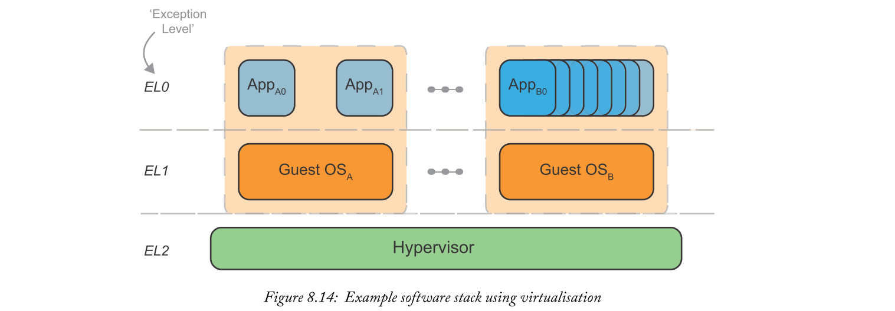

虚拟化可以用作安全机制来分割和隔离应该具有不同访问限制的软件世界。例如，可能有一个guest虚拟机用于加密操作，允许访问存储的密钥并保留对UART的访问权限，而另外两个guest虚拟机在运行用户应用程序（如Web服务器或GUI）时被拒绝访问密钥和UART。

现在我们已经了解了为什么要将虚拟化用于安全性，让我们来了解如何实现这种隔离。APU的Armv8-A架构为以近乎原生的性能运行许多虚拟化操作系统提供硬件支持。这些硬件功能是：
- 1.为虚拟机管理程序（EL2）引入新的异常级别，并支持客户操作系统（EL1）及其应用程序（EL0）的现有异常级别的保护
- 2.系统内存管理单元（SMMU）执行两阶段的能力地址翻译

使用异常级别（在第131页的“处理器模式”中引入）允许EL1中的客户机操作系统像完全控制不允许的行为（写入某些寄存器，内存管理操作等）一样运行，包括捕获并陷阱到硬件层。然后，陷阱操作向EL2发出异常信号，将执行返回给hypervisor，以决定如何最好地继续运行。这些硬件强制陷阱在将所有客户与hypervisor隔离方面插入了很长的路径，但接下来我们考虑的内存管理技术更侧重于将客户彼此隔离。

SMMU（或更具体地说，Arm CoreLink MMU-500 [23]）提供了两个重要功能。第一个是两阶段地址转换，我们在这里介绍，第二个是额外的系统保护，稍后将在“使用SMMU的PS地址空间保护”（第208页）中介绍。两阶段转换允许客户操作系统使用具有硬件加速转换的虚拟内存（阶段1），而管理程序保留对每个客户的地址空间如何映射到物理设备的完全控制（阶段2）。这使得管理程序可以很容易地隔离不同guest虚拟机的地址空间，并控制哪些guest虚拟机可以访问每个内存映射外设。两阶段地址转换如图8.15所示。

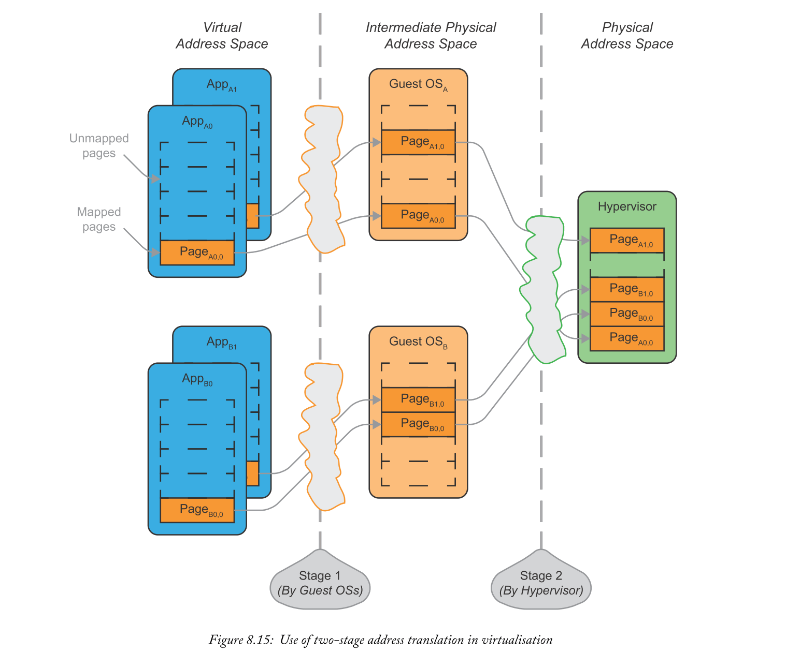

总之，在APU上使用虚拟化可以帮助将用户软件从隔离的客户分离出来。虚拟机管理程序在Cortex-A53的Armv8架构和SMMU的帮助下管理每个guest虚拟机的执行及其地址映射。有关这些功能的硬件实现的详细信息，请参阅第155页的“系统虚拟化”。

虽然虚拟化绝对可以成为Zynq MPSoC系统中一个有用的隔离层，但它并不完整。管理程序仅在APU本身内实施隔离。在Cortex-A53上运行的不同guest虚拟机不会相互篡改，并且可以防止访问地址空间中的其他外围设备。但是，在典型的Zynq MPSoC系统中还有许多其他总线主控器，它们仍具有相同地址空间的自由控制权！即使不受信任的软件被隔离，另一个总线主机也可能将敏感区域转储到内存中或完全破坏我们的软件！这些总线主控器包括其他处理器，例如RPU中的Cortex-R5，PL中编程的IP内核，支持DMA的FPD外设，如GPU，SATA，DP和PCIe接口，以及一些输入输出外设（IOP）如SPI和GEM接口。为了完全实现隔离，我们将在下一节开始考虑完整的Zynq MPSoC系统（不仅仅是软件！）。

#### PS Address Space Protection with SMMU
除了SMMU在使用其两阶段地址转换支持虚拟化方面的作用外，它还在系统范围的隔离中发挥作用。图8.16中提供的简化Zynq MPSoC图表显示连接到CCI的所有总线主控器首先通过SMMU。这样，即使没有后面讨论的专用保护单元，SMMU也可以为系统中的其他主设备提供一些保护而不破坏系统内存。通过将具有DMA功能的I / O设备限制为预定义的物理地址空间，可以防止对PS地址空间的常见DMA攻击，而无需其他保护单元的高级配置。

### 8.3.2  Extending Isolation to a Complete System
为了使隔离技术在应用于复杂的SoC系统时有效，软件，PL和硬件外围设备必须共享一个共同的方案，将“安全”元素与“非安全”元素分开。这可以通过Arm的TrustZone技术[24]实现，该技术由定制的Xilinx单元（如Zynq MPSoC中的XMPU和XPPU）支持和扩展。请记住，整个系统是通过AXI总线编排的。**对于隔离系统，TrustZone状态标志通过AXI总线传播，单元（如SMMU，XMPU和XPPU）使用此标志来正确保护端点**。

我们预计手动隔离技术将主要由专家实施，因为它是一个非常先进的功能。因此，我们仅涵盖这些技术可以实现的内容，并且请参阅技术参考手册[6]以获取完整的实用细节。

#### Arm TrustZone
TrustZone技术是将整个Zynq MPSoC系统分为两种安全状态的基础：“安全”和“非安全”。这是一个**软件控制但硬件强制执行的系统**。它**影响整个系统**，因为安全/非安全标志附加到AXI事务 - 即设备上主设备和从设备之间的所有通信。请注意，这些安全状态（安全或非安全）与用于虚拟化的异常级别不同。事实上，他们可以协同工作！

从Cortex-A53s的角度来看TrustZone，所有代码都在安全状态（在引导时进入'安全世界'）或非安全状态（'普通世界'）中执行。代表普通世界软件生成的任何AXI事务都将**设置非安全标志**，而只有安全世界软件才能选择生成安全（或非安全）事务。**两个世界之间的过渡由硬件严格控制**，如第133页的“Armv8安全模型”中所介绍的。每个世界都有一组独特的系统寄存器，并且可以具有唯一的地址空间。TrustZone通常用于创建可信执行环境（TEE），其中在安全的世界中运行经过身份验证的小型安全操作系统，并且在正常环境中运行更广泛的Rich OS，可以通过公开的API请求安全操作系统操作。示例Arm代码可在线获得，以及商业TEE解决方案[25]。

现在来看APU，T**rustZone状态通过使用非安全标志传播到系统范围**，该标志映射到AXI总线的AxPROT [1]属性。我们已经了解了TrustZone感知的Cortex-A53如何处理安全状态，但是该方案如何扩展到其他不支持TrustZone的主设备和从设备？系统存储器和外设（从设备）的安全状态通常由第210页中描述的XMPU和XPPU块配置。这些块的简化放置如图8.16所示。但是，有些系统寄存器只能从安全状态访问 - 包括系统级配置寄存器（SLCR），调试接口和PMU / CSU寄存器。为其他总线Masters设置的安全状态值得更多讨论。

首先，RPU的Arm Cortex-R5没有实现TrustZone技术，因此我们使用SLCR中的位（更准确地说是LPD_SLCR_SECURE中的slcr_rpu寄存器）来设置每个CortexR5内核的安全状态。该寄存器只能由另一个安全主机访问，并且可以通过写保护锁进一步保护，禁用所有写访问，直到下一次上电复位。安全状态的这种“始终开启”或“始终关闭”的方法排除了在APU中划分软件世界的想法，但对于通常适用于RPU小型实时应用的较小的实时应用来说，这不是一个问题。Cortex-R5s的TrustZone配置是可编程主设备的一个示例 - 寄存器在安全和非安全之间进行选择。这种技术也用于大多数其他主设备，包括LPD和FPD DMA，以及USB，SATA，PCIe和DisplayPort接口[15]。对此的主要例外是PL到PS传输的处理。假设加密的比特流将被设计为安全世界的一部分。因此，PL控制PL-to-PS AXI接口的安全状态。如果这个假设听起来不切实际（如果您担心IP木马等），那么请注意，以下章节涵盖了XMPU和XPPU，允许基于每个Master保护Slaves，允许对每个PL上AXI连接的IP核进行单独访问控制。

简而言之，TrustZone技术允许将完整的Zynq MPSoC设计分成两个不同的安全领域。我们已经看到这如何适用于在APU中运行的软件，如何通过AXI总线将安全分离转移到设计的其余部分，以及如何正确地集成非TrustZone感知的Slaves/Masters。

#### Memory Protection with XMPU
Xilinx内存保护单元（XMPU）是一个基于区域的TrustZone执行内存保护单元。其目的是不仅通过TrustZone安全状态隔离存储器外围设备的区域，而且还基于每个主设备隔离存储器外围设备的区域。总共8个XMPU模块可保护DDR控制器（使用6个模块），OCM和FPD外设（包括GPU，SATA和PCIe）。这些块的位置如图8.16所示。每个块包括：
- 用于接收事务的从AXI端口
- 主AXI端口，用于为不允许的事务转发具有重定向（或“毒性”）属性的事务
- 用于访问控制寄存器的从属APB端口（包括锁定寄存器）
- 用于发出访问冲突信号的中断回到系统的其余部分

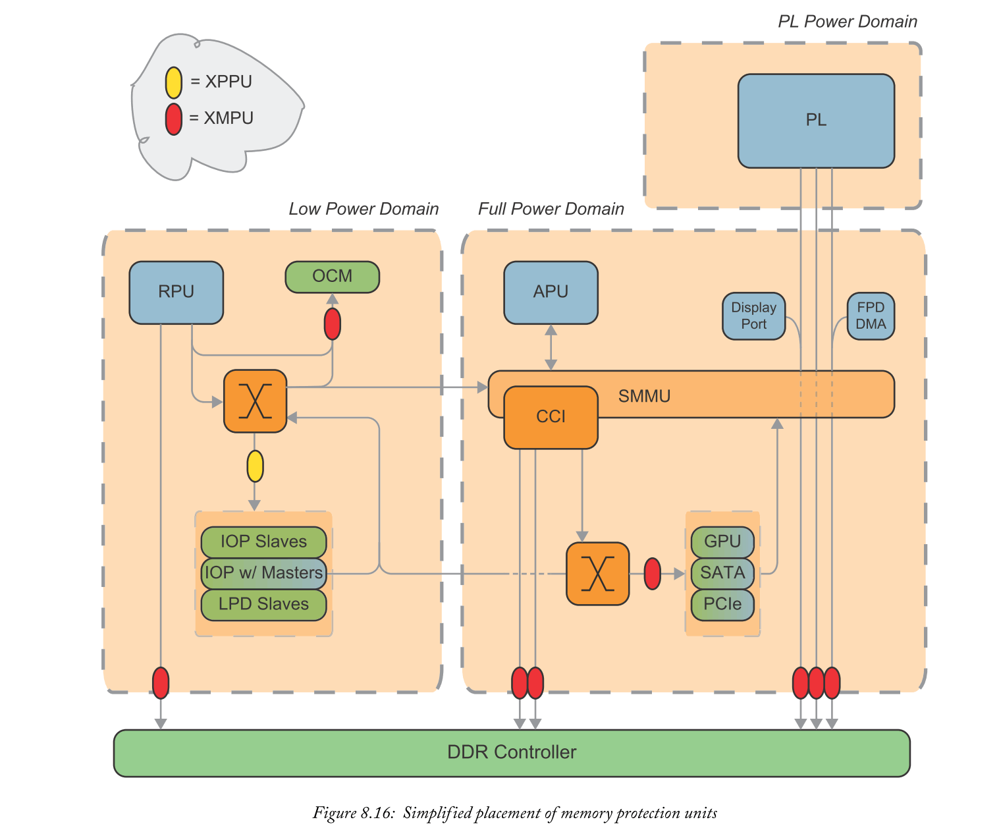

XMPU块控制16个区域，每个区域由起始和结束地址定义。这些区域与DDRAM控制器的1 MB边界（也叫作：孔径）对齐，OCM和FPD外设为4 KB。这些区域可能重叠，ID值最高的区域将具有最高优先级。如果请求与任何启用的区域都不匹配，则XMPU将继续执行默认操作，该操作可通过控制寄存器进行配置（'allow'或'poison'）。

为了验证传入的事务，检查了两件事：该区域中是否允许此事务的Master，并且是否处于正确的TrustZone安全状态的事务？使用两个编程到XMPU控制寄存器中的值 - 一个位掩码（[MASK]）和一个结果值（[OK_ID]）来验证传入的主ID。使用位掩码和值允许我们选择主ID中的哪些位是重要的，并且还定义这些位应该是什么。然后，XMPU对给定的传入事务的主ID（IN_ID）执行以下检查：

$$
\left[O K_{-} I D\right] \mathscr{G}[M A S K]==I N_{-} I D \mathcal{G}[M A S K] \tag{8.1}
$$

这通常允许我们制作位掩码和值以匹配可用主控器的子集（而不仅仅是单个主控器），这在共享资源时很有用。请注意，这不允许匹配任何主机的任意子集，但实际上这不是一个很大的限制。例如，DDR控制器有六个XMPU块，其中只有少数独立的Masters可以到达每个块。因此，我们只需要同时区分几个Masters而不是全套Masters。TrustZone安全状态也通过区域的控制寄存器强制执行 - 即不允许非安全事务访问安全区域。

如果事务未能通过验证，则事务将以两种方式之一poison。如果目标从站支持poison属性信号（仅OCM和DDR控制器），则将使用它们。当受支持的从站接收具有poison属性的事务时，将使用write-ignore / read-all-zero响应来处理该事务以保护该区域。对于其他从站，最重要的地址位被poison到预定义的值，实际上将事务重定向到poison sink设备。这会导致数据中止或处理器中断。

#### Peripheral Protection with XPPU
Xilinx外设保护单元（XPPU）是一种基于查找的保护单元，其动机与XMPU相同。主要区别在于如何被设计用于外围设备，而不是记忆。它必须保护许多不同的片上外设，而不是XMPU使用的相当统一的存储器孔。单个XPPU实例用于保护LPD外设，控制寄存器（包括其自身！）和用于处理器间通信的消息缓冲区。这需要总共400个孔，每个孔具有不同的权限。这些包括：
- 用于处理器间消息缓冲区的128个32 B孔
- 用于外围从属端口的256个64 KB孔
- 用于外围从属端口的16个1 MB孔

XPPU的Master ID验证有两种结构：
- 1.20个主ID掩码/值对的中央列表，类似于XMPU中使用的那些。前8个是预定义的，其余12个是可编程的。
- 2.每个孔的20位寄存器，允许或禁止中央列表中指定的每个Master。

与XMPU不同，这允许让任何Master设备组合共享对单个孔的访问 - 这对于诸如处理器间缓冲器之类的从设备是必不可少的。如果事务无效，则地址位可能poison，从而将事务重定向到预定义的虚拟sink设备。

### 8.3.3  Isolation Summary
隔离可以是用于构建安全系统的非常有用的预防技术。如果设计中的一个元素受到攻击或行为错误（无论是硬件块还是软件任务），则可以通过隔离来控制效果。这不仅可以通过防止攻击者获得对设备的进一步控制来提高系统范围的安全性，而且从功能安全角度来看，它也可以用于防止错误和故障的传播。

首先，我们在APU上引入了虚拟化，以提供许多不同软件堆栈之间的隔离。这允许隔离任意数量的软件任务，但它仅在APU本身内实施，其他总线主控器仍处于打开状态可能会篡改处理系统。SMMU的保护功能可以通过限制其他主设备可以访问的物理地址来帮助实现。我们继续研究系统范围的隔离系统 - 尽管虚拟化仍然是Zynq MPSoC中隔离的一个非常重要的工具。

Arm TrustZone是这种系统范围隔离的基础，与虚拟化不同，它采用二值方法。一切都属于“安全”或“非安全”领域。我们了解了这会如何影响APU上运行的软件，以及如何使用AXI总线属性将TrustZone安全状态传播到系统的其余部分。然后，我们简要讨论了两个保护单元以及它们如何实现总线Slave隔离的关系。XMPU和XPPU为系统从站（分别为存储器和外围设备）提供TrustZone awareness。它们还提供更精细的权限，允许每个主机访问控制。

这种隔离功能的终止之旅已经涵盖了Zynq MPSoC在使用隔离防止某些攻击和防止故障传播方面可以实现的目标。实际实施不在本章的范围之内，因为正确而充分地实施这些技术需要彻底了解完整Zynq MPSoC系统的互连和架构。对于那些寻求使用这些功能实现系统的人来说，[25]是一个非常好的起点。

## 8.4  Chapter Summary
现代SoC设计中的安全性无疑已成为一个重要且细致入微的话题。本章从3个角度提供了可以在Zynq MPSoC上采用的一些最重要的安全功能的指南：
- 1.努力使我们的系统配置和用户数据安全远离窥探和恶意修改（即信息保证）
- - 2.即使攻击者在物理上篡改硬件（即反篡改），也要尽量保持我们的系统安全运行并隐藏其秘密.
- 3.尝试通过使用故障隔离技术将其包含在系统的单个部分中来减轻任何最终的攻击。

我们理解这可能是一个令人生畏的导航环境，但它确实是一个值得考虑的重要因素，特别是在商业和高保证环境中。通过我们包含背景信息和参考常见的真实攻击，这里已经传授了对这些功能的真正需求。这种基本的了解应该为读者提供所需的动力，以确定与他们相关的任何安全措施，并知道在哪里寻求进一步的指导！

