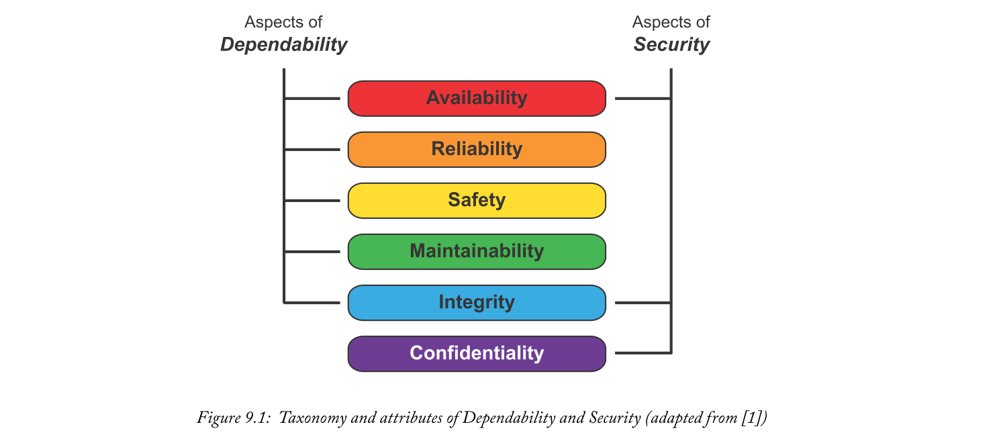
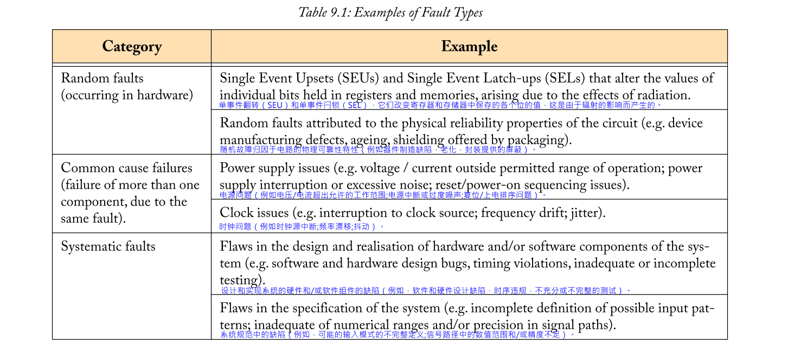
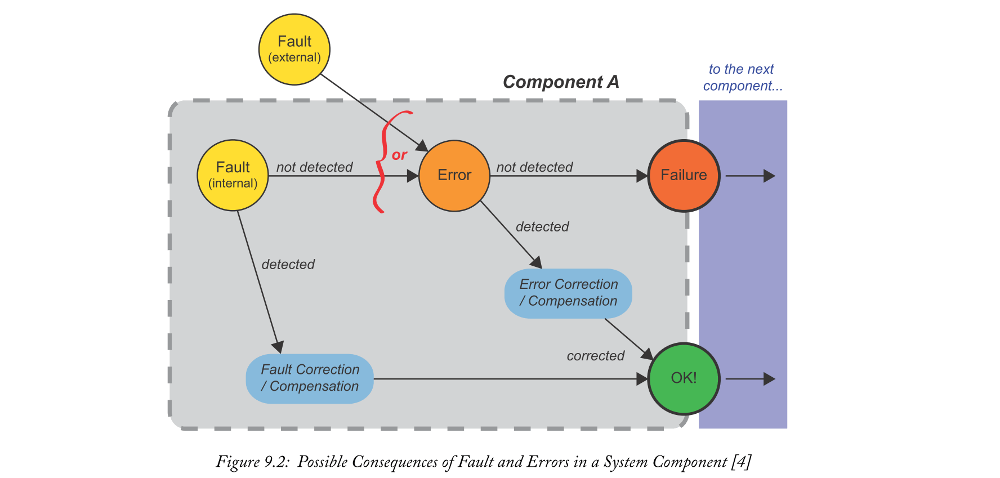
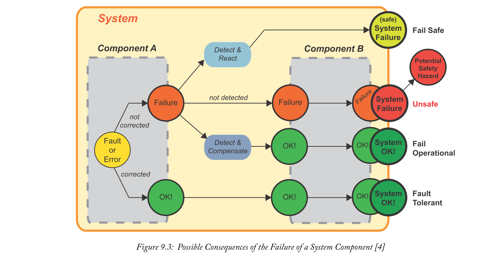
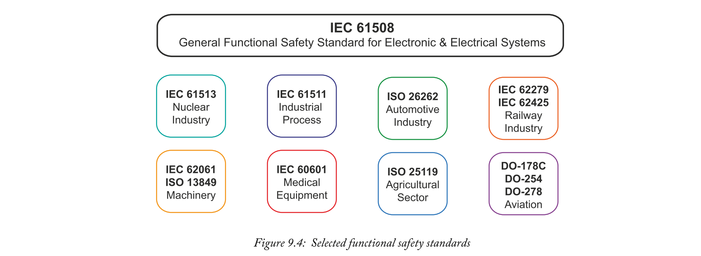
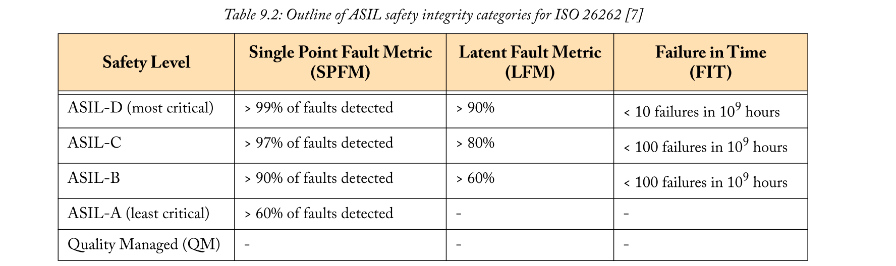
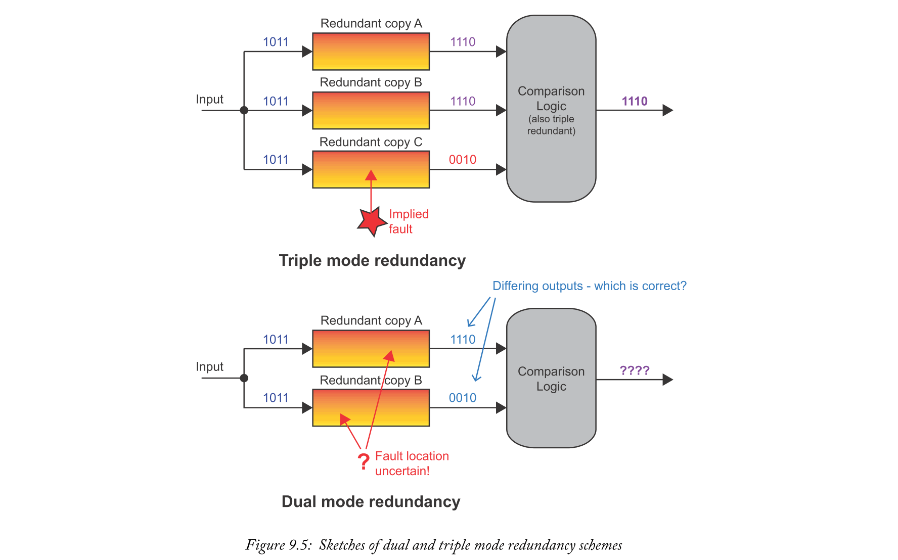
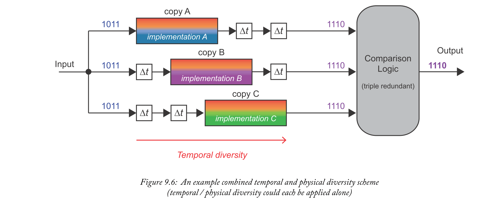
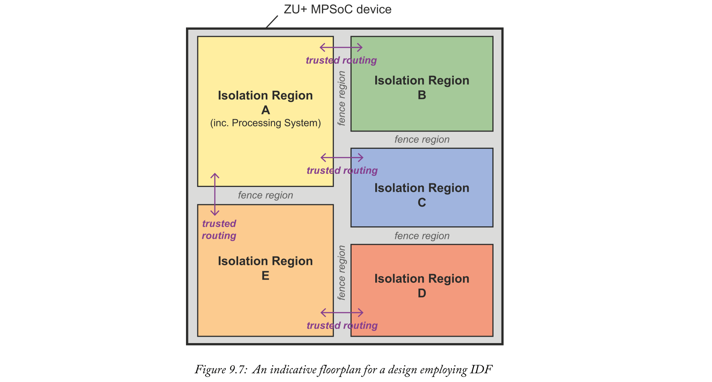
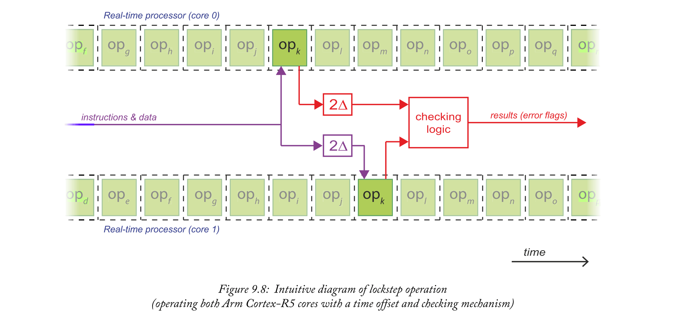

# Chapter 9: Safety Features & Techniques
Safety是各种嵌入式系统中的重要考虑因素 - 从消费电子产品到航天器，以及介于两者之间的所有系统。但我们对安全的确切含义是什么？Zynq MPSoC有哪些功能和设计方法可以帮助确保安全的系统？我们将在本章中讨论这些主题（以及更多内容）。

## 9.1  An Introduction to Safety 
首先定义嵌入式系统中“安全”一词的含义是有用的。Safety的一般定义是：“......保护人类和环境免受伤害”. 

例如，如果检测到Fault状况，锅炉系统的控制器将不允许继续操作，并且存在有害气体逸出的风险。风力涡轮机在遇到大风时会使其叶片倾斜，以防止损坏涡轮机本身的风险，并可能对**周围环境**造成危害。

在本节中，我们还借此机会将嵌入式系统中的安全概念定位于系统`Dependability`的其他方面，并提供Safety考虑特别重要的嵌入式系统的一些示例。

### 9.1.1  Safety and Dependability
Avizienis等人[1]开发的分类法确定了许多有助于系统`Dependability`的属性。他们将“`Dependability`”一词定义为“避免服务失败的能力，这种服务失败比可接受的更频繁和更严重”。

Safety是`Dependability`的一个属性，以及 Availability, Reliability, Integrity, and 
Maintainability的属性（在[1]中正式定义）。例如，系统必须准备好在需要时（Availability）进行操作，并且必须正确（reliability）。它必须在不对人员或环境造成伤害（safety）的情况下运行，并且不得进行未经授权的更改（Integrity）。最后，系统必须能够根据需要进行修改（Maintainability）。同时，Security的概念包含上述属性的一个子集，以及一个附加属性 -Confidentiality- 如图9.1所示。

这里的重点是确保Safety是创建可靠系统的一个独特而重要的方面。同样值得注意的是，Security虽然相关，但却是一个需要特别关注的独立问题。

在第9.1.1节中介绍的分类法中，确定Safety和Security是重要的，但属于嵌入式系统的不同方面。但是，也可以在两者之间建立联系 - 特别是要注意，违反security规定可能会导致Safety受到损害。换句话说，成功击败Security对策的攻击者可能能够恶意改变系统的操作，使其以不安全或危险的方式行事。例如，这可能是电力行业或制造自动化应用中的特别关注点。

同时，考虑用于在智能城市场景中收集各种类型数据的传感器网络。在这种情况下，可以设想没有Safety隐患的Security漏洞，例如，如果攻击者纯粹对“窃取”收集的数据感兴趣。

出于这些原因，我们在本章中考虑了Safety，并在适当时考虑了Security因素。Zynq MPSoC中的Security将在第8章单独讨论。

### 9.1.2  Safety Application Examples
识别Safety是重要属性的应用程序非常容易。这些应用包括运输中的应用，例如飞机着陆系统，汽车自动制动，甚至交叉路口的交通灯（想象所有方法同时设置为绿色！）。事实上，鉴于高级驾驶员辅助系统（ADAS）的发展以及自动驾驶汽车的出现，交通领域的安全需求只会增加。

由于辐射（除了天气，湍流，空间碎片等其他危险），航空器和航天器在潜在的危险条件下运行。辐射效应具有在嵌入式系统的数字硬件内部引起错误的能力，例如单个粒子翻转，其中寄存器值从0翻转到1（或反之亦然）。飞机或航天器的Fault具有相当大的风险，因此必须采取特定步骤来减轻辐射的影响。稍后将详细介绍此主题。

工业应用中对Safety的需求也很清楚，并且可能包括诸如旋转机械的控制系统，机器人焊接系统和自动装配线的示例。不受控制或不正确控制的运动的影响可能对工人造成相当大的危险。涉及危险材料，核系统，高压等的行业将提出他们自己的特殊要求。

Safety在一系列其他应用领域也至关重要，从医疗系统到国防电子，再到厨房电器等消费电子产品！

## 9.2  Functional Safety
### 9.2.1  What is Functional Safety?
在考虑嵌入式系统的安全性时，强烈倾向于关注**功能安全**，即系统始终以安全的方式运行的能力[6]。因此，安全性的其他方面被放在一边，例如系统中使用的材料的安全性，以及诸如老化影响的物理特性。这些因素当然仍然很重要，但可以有效地与功能方面分开，并受制于单独的设计和审查过程。换句话说，我们将主动安全措施（例如，检测Fault状况和相应地响应）与被动安全措施分开（例如，在系统的制造中使用特定的防火材料）。在Zynq MPSoC的背景下，被动安全措施包括芯片的封装 - 外壳设计用于防止损坏，以及辐射的影响（可能导致设备上的“翻转”，导致操作错误）。

因此，本章的其余部分讨论了功能安全。这意味着确保嵌入式系统始终以安全的方式运行，即使（例如）应用了意外的输入序列，或者发生了不期望的外部事件。实现功能安全可包括以安全的方式停止操作，如“fail-safe”一词。

### 9.2.2  Errors, Faults and Failures!
在进一步研究之前，定义功能安全域1中使用的关键术语的子集是有用的。术语error, fault, failure类似，但具有不同的含义：
- Error：当测量的，观察的或计算的信号或状态与预期的信号或状态之间存在差异时（例如，偏离理论上正确的结果）。这可能由于fault或由于意外操作条件而发生，并且可能导致failure。
- Fault: 可能导致系统或功能组件failure的异常情况。
- Failure: 终止系统或功能组件的正确行为。

由于各种原因可能发生Faults。我们可以将它们大致分类为如表9.1所示的类别，每种类型都有一些基于SoC的示例。

作为术语的注释，一些Xilinx文献提到单事件效应（SEE，具有与SEL / SEU类似的含义），其中那些导致错误的SEE不会损坏设备的被称为“软错误”。

通过遵循从初始规范到最终验证的所有阶段的robust，面向安全的过程，可以采取措施来缓解上述每种类型的Fault和Failure。有几个方面有助于基于SoC的嵌入式系统的安全性（从设备制造和封装到辐射相关的随机错误，到硬件和软件元件的设计和规范问题），这是一个复杂的问题！因此，有必要制定安全标准来指导过程并确保采取综合方法。根据这些标准之一获得认证可以确保系统安全运行。

### 9.2.3  Handling of Faults, Errors and Failures
再次借鉴[1]，我们可以根据第9.2.2节中给出的术语fault，error和failure的定义，总结系统对Fault及其可能后果的不同反应方式。

#### Faults and Errors
如果Fault处理完全嵌入到设计中，则可以在Fault发生时检测到Fault，并采取适当的措施来补偿Fault。因此，可以立即将发生Fault的组件恢复到正确操作的状态，并且以这种方式防止Fault导致组件Failure。这很重要，因为这意味着Fault不能传播到其他组件并导致更大规模的问题（如果处理不当，单个Fault最终可能导致系统整体Failure）。

我们还定义了可能由于内部Fault（我们假设尚未检测到并纠正）或由于意外操作条件（可能称为外部Fault）而发生Error。如果组件包括用于检测和纠正Errors的逻辑，则这还具有将组件恢复到其正确操作状态的效果，从而防止对系统的其他部分的任何不利的连锁效应。

这些可能的操作响应系统组件中的Faults和Errors，如图9.2所示。以这种方式补偿Faults和Errors的系统通常被称为“容错 fault-tolerant”。

#### Component and System Failures
如上所述，组件内的Fault或Error可能导致其Failure。例如，考虑一个组件的例子，该组件将输入信号N除以存储器中保持的值D.如果随机位错误（例如由于辐射）导致D的值从有意义的值变为零，那么它会导致零除错误。这导致组件Failure，因为它不按要求运行。

一个组件的Failure可能导致另一个组件Failure - 例如，如果组件A没有向组件B提供所需的输入（在我们的示例中，分区操作的结果），这可能导致组件B的Failure，甚至是整个系统Failure。此外，如果没有适当地处理系统Fault，可能导致安全隐患，并且对操作员或周围环境造成有害后果。

另一方面，如果可以检测到组件的Failure，则可以减轻其影响以确保整个系统的安全性。这可以通过以下两种方式之一实现：
- 如果检测到的Failure **CANNOT**得到补偿，那么系统可以通过转移到已知的安全状态并停止正常操作来对问题作出反应（这种安全状态的性质将取决于所涉及的系统类型 - 这可能意味着它关闭系统并显示通知消息，或者回退到基本功能级别）。然后，操作员需要进行干预以解决问题，然后才能正常重启系统。这种方法通常称为“Fault安全 fail-safe”。
- 如果**CAN**补偿检测到的组件Failure，则可以清除Failure的影响，并且可以恢复正确的系统操作。这需要更复杂的设计，但具有系统可以在不中断的情况下继续安全运行的益处，并且实际上操作员可能不知道系统内部件的Failure发生。这被称为“Fail-operational 损坏仍正常工作”。

对组件Failure的可能响应如图9.3所示。如果未检测到组件Failure，并且未执行任何操作，则Failure将传播到系统中的下一个组件（简化 - 可能不止一个），从而导致Fail。结果是整个系统Failure，可能导致Safety Hazard。总之，设计是不安全的，因为如果发生组件Failure，它不会采取措施来确保安全。这由图中的一组橙色和红色状态显示。

如果系统能够检测到组件的Failure，而不是为了对其进行补偿，则系统仍然可以通过进入安全状态来做出反应。这意味着系统也会Fail，但它会以安全的方式完成。该序列显示在图9.3的顶部。

更好的选择是系统可以补偿组件Failure，如果它检测到组件Failure。在我们的示例中，这意味着已经更正了提供给组件B的输入，然后它可以正常运行。该系统被认为是`fail-operational`的，因为即使组件A发生Failure，它也可以继续安全运行。

显示的最终序列是组件A内部Fault或Error的更正。这意味着组件A不会Fail，并且后续操作可以按预期继续。这被称为“fault tolerant”，反映了可以克服低级Fault。

值得注意的是，“fault-tolerant”系统也可能是“fail-safe”或“fail-operational”。fault-tolerant对应于系统容忍低级Faults或Errors的能力，而两种Failure模式指的是系统在存在组件Failure时的行为方式。优选方案涉及处理低级Faults/Errors，同时还包括检测和响应或补偿组件Failure的功能。

可以记录Faults，Errors，组件Failures等以进行诊断分析，从而实现未来的安全改进。

#### Fail-Safe vs Fail-Operational
为了快速回顾，上述两个术语都指的是系统响应其中发生的单个Failure的响应。在`fail-operational`的情况下，系统继续安全运行，而`fail-safe`意味着系统停止正常操作，并进入已知的安全状态。最重要的相似性以及两者的最重要方面是对Failure的反应会导致安全的结果。但是，某些系统可能需要能够进行`fail-operational`而不是`fail-safe`。

涉及的一些因素包括：
- 1.达到安全状态所需的时间，以及此期间的潜在Hazards。
  > 示例：在运输系统中，车辆可能在发生Fault时高速行驶。在达到安全状态期间，可能会继续遇到安全隐患。这种情况下`fail-operational`功能将提高安全性。
- 2.容忍停机时间。
  > 示例：如果飞机安全系统发生Faillure需要维护，则可能意味着飞机将停飞一段时间，无法运行。这可能对乘客造成不便，对其他服务产生潜在的连锁反应以及航空公司的收入损失产生相当大的影响。
- 3.成本因素。
  > 示例：将冗余和高度指定的组件合并到某些对成本敏感的产品中将不被视为合理。例如，买家倾向于以非常高的可靠性来评价一个廉价的咖啡机。因此，`fail-safe`可能更合适。

在所有情况下，功能安全的方法应确保Risk降低到可接受的应用程序的水平。但是，不可能完全消除risk。注意预测Risk来源，约束Faults，Errors和Failurs，使其以可检测和可分类的方式发生，并设计能够成功处理这些事件的系统，这些都是可以采取的措施，以最大限度地降低Safety Hazards的Risk发生。

#### A Note on Common Cause Failures
共因故障Common Cause Failures (CCFs)是由于相同的root cause而可能同时发生的Failures。例如，由于公共输入时钟偏离其指定频率，嵌入式系统内的多个功能组件可能同时发生fail。

到目前为止讨论的例子都涉及单点Fault，但是多个组件同时发生Fault会给系统带来更难（可能不可能！）的情况。因此，最好采用CCF的预防方法，预测可能的原因，并提供一定程度的分集（例如在上面的例子中，向冗余组件提供不同的时钟源）。Zynq MPSoC中CCF的缓解措施将在9.3.5节中进一步讨论。

### 9.2.4  Functional Safety Standards
已经开发出用于各种不同领域的功能安全标准，包括用于工业应用中的电子和电气系统，用于汽车部分，航空和铁路。
国际电工委员会（IEC）标准61508：电气/电子/可编程电子安全相关系统的功能安全性，也称为IEC 61508 [6]，也许最值得注意的标准是其他几个标准。该标准通常适用于各种系统，而图9.4所示的衍生标准定义了针对各自领域的特定安全措施。

在功能安全方面，最苛刻的领域之一是汽车行业。汽车安全（汽车和轻型货车）由国际标准组织（ISO）标准号26262（通常称为ISO 26262）涵盖。我们现在将更详细地看一下这个标准，作为案例研究。

#### Case Study: Automotive Safety Standard (ISO 26262)
自2011年出版以来，ISO 26262已成为公路车辆（汽车和轻型多用途车辆）中电子电气设备的商定安全标准[7]。该标准是从IEC 61508开发的，以更加专门地满足汽车行业的要求。

ISO 26262标准定义了一组四个汽车安全完整性等级（ASIL），每个等级指定不同级别的可靠性和Fault检测。这反映出汽车包含对不同程度安全至关重要的系统;例如，制动系统的正确操作比仪表板上正确显示信息更重要。因此，功能分为不同的安全级别，功能分类为ASIL-A / B / C / D（安全要求越来越严格）。

分类基于对三个因素的评估：
- 暴露于危险的可能性（非常低，直至高发生概率）;
- 如果发生危险，驾驶员可以控制（容易，直至难以/无法控制）;
- 危险的严重程度（无伤害/轻度或中度伤害，危及生命或致命伤害）。

在我们的示例中，制动系统将被归类为ASIL-C或D，因为尽管发生危险的可能性很低，但可能难以控制，并且可能危及生命。在确定了所需的安全水平之后，可以设计制动系统以将余下的风险水平降低到可接受的低水平。这可能包括Fault预防，以及包括在Fault发生时有效处理Fault的机制。可能还存在Fault预测的一个要素，这意味着系统可以主动预测问题，这将有助于防止出现危险情况。

ISO 26262中定义的ASIL根据三个指标（表9.2）指定了要求：
- Single Point Fault Metric（SPFM） - 未检测到的Fault，会立即产生影响（违反安全目标）;
- Latent Fault Metric（LFM） - 在产生影响之前可能存在且未检测到的Fault，例如，内存中发生的一点错误，没有立即访问;
- Failures in Time（FIT） - 每10亿个设备小时内可能发生的Failures数量。

同样值得强调的是表9.2中的“Quality Managed”类别，它位于ASIL安全级别之下，涵盖了与安全无关或影响整体系统安全性的可能性很小的功能（例如，娱乐系统）。汽车开发商和制造商可以为此类别设定自己的目标。

在给定的ASIL上通过满足设计过程（包括软件元素），工具，组件，文档等方面的许多要求来实现ISO 26262认证。汽车制造商依赖于合并来自大量第三方供应商的组件，因此，这些组件的认证是一个重要方面。基于Zynq MPSoC器件的嵌入式系统有资格获得ISO 26262认证（以及IEC 61508），前提是所使用的设计和测试过程以及随附的文档也符合标准的要求。[18]中提供了与基于Xilinx的设计认证相关的因素的摘要。

ISO 26262的新版本将于2018年出版，这将扩大标准的范围，以涵盖其他车型（例如公共汽车和重型货车）。它还将扩展半导体组件的指导，并解决当前和新出现的挑战，包括ADAS系统，网络安全问题和自动驾驶汽车。

## 9.3   Design Principles and Architectural Support
在安全关键系统的实施中可以采用几种策略[8]。本节继续总结安全系统的一些常见设计原则，并在适当的时候，重点介绍Zynq MPSoC中的架构支持以及Vivado中可用的安全相关IP。

### 9.3.1  Redundancy
设计安全关键系统的一种流行方法是引入冗余。这通常意味着实现设计单元的多个实例，并基于“投票”机制确定正确的输出 - 即物理意义上的冗余。由于这意味着额外的资源，成本敏感型应用程序的一种可能替代方案是`多次重复相同的任务`（“时间冗余”），尽管所涉及的额外延迟可能不适合所有类型的应用程序，并且单个实例减少了failure-resistance(对故障的抵抗性)。出于这个原因，我们讨论的其余部分侧重于物理冗余。

#### How Does Redundancy Work?
冗余涉及实现设计单元的多个功能相同的副本，并比较产生的结果。然后，基于随机错误（例如SEU）极不可能以相同方式同时影响所有实例，选择最常发生的结果（即，具有最多“投票”的结果）。因此，冗余提供了检测faults和识别正确结果的能力。冗余的另一个好处是，如果其中一个冗余实现fail，系统可以继续运行（尽管对任何后续faults或failures的阻抗水平降低）。

通常使用具有三个实例的冗余，称为三模冗余Triple Mode Redundancy (TMR)。如果只有两个输出要比较，如果它们不同，就没有办法说明哪个是正确的;但有三个，应该总是至少有2比1投票赞成正确的结果。这些选项如图9.5所示。双模冗余Dual mode redundancy仍然具有识别Fault已发生的益处，这允许系统采取适当的缓解动作（例如重置组件或重复操作序列）。Zynq MPSoC器件上的实时处理器可以使用双冗余操作，此功能将在第9.3.4节中进一步讨论。

TMR实施中的潜在弱点是检查逻辑，其对投票进行计数，并且其本身可能受到随机故障的影响。为了解决这个问题，可以复制检查逻辑，使其也是冗余的。所需的正确性水平可以是严格的，即结果必须逐位相同，或基于阈值[8]指定。

有时需要更高级别的冗余 - 使用四个或五个实例提供一定级别的故障操作功能（采用四个实例允许一个故障，同时仍保持至少检测故障所需的三个实例最小值;五个实例 将允许两次失败，等等）。这种方法用于航天飞机的设计，它通过四个冗余主处理器和一个备用处理器[9]提供。

冗余可以在系统内的各种层级实现，从低复杂度逻辑功能和软件组件，一直到处理器级，并且安全关键系统可以采用多层冗余。更复杂的系统通常将冗余与多样性结合起来（见第9.3.2节）。

#### Advantages and Disadvantages
冗余的主要优点是它提供Fault/Failure检测功能，并防止Failure，从而提高系统的安全性。这也更有利于可靠性。

在基于SoC的系统环境中，一式三份地实现硬件组件意味着更大的资源成本和功耗，甚至达到需要更大设备的程度。软件元素内的冗余会增加处理器的负载，这可能会对性能产生影响。此外，实现具有冗余方案的系统的增强的复杂性需要更多的设计工作。在确定适当的冗余级别时，应结合安全要求考虑这些因素。

#### Implementing Redundancy in Zynq MPSoC
在Zynq MPSoC中，有各种用于合并冗余的机制。我们可以将它们大致归类为：
- 本质上冗余的架构特性 - 值得注意的是，Zynq MPSoC平台管理单元（PMU）和配置安全单元（CSU）都是用TMR实现的[19]。这些单元中的每一个都是设备整体safe and secure操作的基础，因此TMR用于提供高度可靠的正确操作。
- 具有多个实例的架构特性（有助于实现冗余） -  Zynq MPSoC具有多个内核，具体数量取决于设备。如果需要，设计人员可以选择将这些作为冗余方案的一部分，但也可以选择独立部署处理器。特别是，这对RPU可以在特殊的冗余“lock-step”模式下运行，这将在9.3.4节中进一步说明。
- 由设计人员专门实现冗余的组件 - 最后一类是指设计人员可能希望包含的冗余软件和硬件组件，作为其安全方案的一部分。鉴于设备上存在多个处理器和PL，开发具有在一个或多个层次结构级别的冗余的自定义实现的空间很大。IP Integrator支持通过一组预先验证的IP模块实现TMR（如TMR MicroBlaze处理器设计示例中的[16]中所述）。

在每种情况下，我们使用术语“冗余”意味着组件的所有副本都是等效的，例如，在PL上实现的设计单元的三个实例以完全相同的方式指定相同的功能，并且使用物理上分离但在其他方面相同的硬件资源集来实现。另一种相关方法是引入多样性的一个方面。

### 9.3.2  Diversity
多样性类似于冗余，在某种意义上它需要设计单元的多个副本。区别在于，当采用多样性时，设计单元以彼此不同的方式实现与/或操作。
#### How Does Diversity Work?
多样性类似于冗余，但是设计单元之间存在差异，与/或设计单元的操作。有目的地引入不相似的方面以减少系统Error（例如，软件和硬件设计Bugs）的可能性以及可能以相同方式影响多个实例的可能的CCF。

物理多样性需要创建多个实例（例如，在三倍的情况下为三个），并且这**些实例具有相同的功能，但在实现方面彼此不同**。除了核心功能方面，通常可以避免可能共享的存储器，连接总线等。相反，每个不同的实例与其他实例的共同点尽可能少，这减少了单个错误影响所有实例的可能性。

也可以实现时间多样性，这意味着实例的操作是有目的地按时分布的（例如，模块的执行可以通过时间延迟分开，在比较和投票之前进行重新调整，如在TMR方案中）。时间差异提供了一定程度的保护，防止可能导致共因故障的瞬态Fault。

结合时间和物理多样性的方法如图9.6所示。这里，模块的颜色代表功能（顶部）和实现（底部） - 因此所示的三个副本具有相同的功能但不同的实现。随着时间的推移，三个模块的执行交错​​，在比较阶段之前插入适当的延迟以重新同步输出。

#### Implementing Diversity in Zynq MPSoC

Zynq MPSoC为将多样性融入设计提供了相当大的空间。这部分源于其固有的多处理器能力，这为使用物理上不同的资源实现多个系统组件实例提供了明显的机会，甚至可以并行运行特定算法的替代硬件和软件版本。硬件/软件方法需要非常不同的实现（减少常见设计错误的可能性），同时还使用物理上独立的物理资源，具有不同的电源，时钟和IO设施，从而降低了CCF的可能性。

Zynq MPSoC器件包含四个电源域：
- Battery Power Domain (BPD)
- Low Power Domain (LPD; contains R-5 real-time processors)
- Full Power Domain (FPD; contains A-53 application processors)
- PL Power Domain (PLPD)

这些域在芯片上彼此物理分离。在某些情况下，还有各个处理器内核的电源门控选项[13]。除了为核心加密和计时任务保留的电池电源域之外，关键设计组件可以在这些域中的两个或更多个域中进行多样化。

在PL电源域内，可以创建设计单元的功能等效副本，每个副本具有不同的物理实现。这些将被合成以生成需要不同资源和路由集的替代网表，从而在PL上产生不同的布局。更进一步，采用Xilinx的隔离设计流程（IDF）可以确保模块完全相互独立，这将在9.3.3节中介绍。

多样性的概念也与先前与Arm Cortex-R5实时处理器配合使用的“dual-lockstep”模式有关;第7章“实时处理系统”进一步概述了这种模式。

### 9.3.3  Isolation Design Flow
第9.3.2节（BPD，LPD，FPD和PLPD）中列出的电源域在芯片上彼此物理分离，并且可以使用PMU彼此隔离。通过引入模块之间的物理分离，可以将稍微相关的方法应用于系统的PL部分。使用隔离设计流程（IDF）可以实现这一点，这是一种用于safety和security应用的Xilinx设计方法。虽然不是Zynq MPSoC特有的，但它可以在Zynq MPSoC系统中发挥良好作用。
#### Why Isolate? 
特别是在Safety和Security应用中，可能需要在设计中强制某些模块的物理分离，并仔细控制它们之间的任何通信。这具有使模块更加独立的效果，因此从安全角度来看，在没有CCFs风险的情况下实现冗余的可能性更大。图9.7显示了一个指示性的IDF平面图，而功能安全设计的IDF平面图的实例可以在[2]中找到。

#### Using the Isolation Design Flow
通过采用基于IP Integrator的标准硬件设计流程中的一些额外步骤，在Vivado中遵循IDF。特别是，当寻求模块的物理分离时，布局规划比平时起着更重要的作用。在设计过程的早期阶段需要将功能模块分配给芯片的定义区域，并且这些隔离模块由“fences”分隔，即，否则未使用的逻辑和布线资源的strips，使得在它们之间存在物理间隙。他们。只允许通过专用的“可信路由”路径进行通信。这些功能在图9.7中突出显示。

IDF还集成了一个工具，用于检查隔离的成功实施，Vivado隔离检验器（VIV）。该工具实际上是一组设计规则检查（DRC），其确定满足隔离所需的各种标准，例如，正确实现了模块之间的隔离，**并且来自不同隔离模块的引脚不是彼此相邻的**（从安全角度来看，这会引入CCF的风险）。

对IDF的支持主要采用Xilinx文档和参考设计的形式，可从[12]获得。一些示例涉及以security为重点的设计，但所提出的流程和原则同样适用于safety。

### 9.3.4  Real-Time Processors: Dual-Lockstep Mode
Zynq MPSoC提供的最重要的安全相关功能之一是RPU中的两个Arm Cortex-R5处理器能够以自检方式运行。

RPU处理器内核可以以两种不同的模式运行：作为普通的双核处理器，或者工作在安全模式。后者称为“双锁步”模式，两个处理器内核采用相同的操作，具有较小的时间偏移，使用检查机制来确保正确性。图9.8中提供了一个概念图，显示了RPU在双锁步模式下的操作，而扩展的细节可以在第7章的实时处理系统中找到。

双锁步模式采用多样性，使得两个处理器内核执行相同的处理操作，但在时间上稍微偏移（2个时钟周期）。这减轻了同时以相同方式影响两组操作的辐射事件。需要同步和检查逻辑以确保两个内核产生相同的输出 - 如果不是，则标记故障，其处理被定义为系统设计的一部分（例如，RPU可以生成要由PMU根据用户定义的代码）

虽然双锁步模式将RPU的潜在工作负荷降低了50％，而替代的“性能模式”，其中两个核心可用于单独的处理任务集，但它确实代表了实施安全关键系统的重要资源。

### 9.3.5  CCFs and System Monitoring
如本章前面所述，嵌入式系统中存在CCF的潜在来源，例如由于系统内多个元件共享的时钟，电源和IO资源。像温度这样的环境条件也可能是CCF的原因，例如 如果温度超过规定的工作范围，则可能同时以相同的方式影响多个子系统。系统监控保护的最重要的要素之一是RPU  - 锁步模式下Arm Cortex R-5处理器内核的操作本身就是一种安全措施，但由于CCF，这两个内核可能同时fail。

作为缓解可能Failures的主动策略的一部分，可以对系统的某些方面进行监控。Zynq MPSoC通过设备的每个PS和PL部分中的专用系统监视器（'SysMon'）组件支持此功能。

#### How Does System Monitoring Work?
通过测量内部和电源电压值，片上温度，外部模拟信号电压等来进行系统监控，以确保它们保持在指定的工作范围内。SysMon组件还包括一个10位ADC，可以测量外部信号。

PS和PL SysMon实例在操作上非常相似，适用于Zynq MPSoC器件的两个独立区域。它们之间的几个关键差异包括ADC的采样频率（PS为1MHz，PL SysMon为200kHz），编程接口选项，以及PL中辅助模拟输入的可用性，而不是PS SysMon组件的可用性，如详细在[19]。

#### Implementing System Monitoring in Zynq MPSoC
设计人员可以选择使用Zynq MPSoC器件上的两个SysMon组件中的一个或两个，即PS SysMon和PL SysMon。后者需要在硬件设计（Vivado框图）中实例化，以便允许访问其全部功能。

PS和PL SysMon组件通过一组专用寄存器进行配置和查询。例如，这允许设计人员为不同信号上的电压条件设置自己的自定义阈值，并指定引发警报的条件（PL和PS SysMon组件各自提供一组16种不同的警报输出）。它们充当PMU处理器的中断，其中软件例程确定响应报告的问题采取什么动作。例如，PMU可以通过执行电源域之一的重置来进行响应。如果芯片温度超过临界上限（默认为125摄氏度），还可以选择让系统执行自动关闭，以防止损坏设备。

此外，有关PL和PS SysMon组件使用的详细信息分别见[17]和[19]。

### 9.3.6  Error-Correcting Code (ECC) Memory
虽然可以使用TMR和多样性技术来减轻逻辑电路中的随机故障，但是由于可能存在大量不同类型的数据并且容易受到SEUs（Signle Event Upset）的损坏，因此特殊处理适用于安全应用中的存储器。

#### How Does ECC Memory Work?
ECC存储器通过向存储器中保存的数据添加额外位来工作，从而可以进行奇偶校验检查以检测并可能纠正错误。错误保护程度随着添加的奇偶校验位的数量而增加，尽管这意味着存储容量和访问时间方面的开销，但由于其提供的数据完整性，ECC在安全系统中通常被认为是值得的。

ECC基于汉明码[5]，在计算和信息理论的标准教科书中有很好的涵盖。最基本的奇偶校验检查能够检测数据字中是否存在奇数个位错误（最有可能是单个错误），但不能确定其位置。这意味着无法纠正错误。稍微增加奇偶校验组件允许生成关于错误位置的信息，使得可以校正数据字内的一位错误，并且检测到第二错误但未校正。通过使用更多奇偶校验位可以实现更高级别的错误保护（校正多于一个错误）。

ECC的缺点是隐含的附加存储，以及执行奇偶校验生成和校正处理的处理开销，这意味着分别略微增加了写入存储器和从存储器读取的时间。
#### Implementing ECC Memory in Zynq MPSoC
Zynq MPSoC器件在其各种处理元件中包含许多存储器和高速缓存。包含在CSU和PMU组件中的关键存储器预先配备了ECC，其功能透明。ECC支持也可以在其他元素中使用，并且可以根据需要合并，例如，通过指定RPU和APU子系统以及双倍数据速率（DDR）外部存储器控制器的选项。

ECC内核可以包含在IP Integrator设计中[11]，这样PL中实现的存储器以及与外部存储器之间的数据传输可以选择性地包括错误保护。作为进一步的措施，Interleaving可以应用于ECC保护的存储器，这减少了Clustered SEU导致不可纠正的错误的可能性。

有关Zynq MPSoC中ECC功能和选项的更多信息，请参见[19]。

### 9.3.7  Fault Injection and Testing
需要考虑的一个重要实际问题是如何通过测试来验证安全关键系统。毕竟，这样的设计被开发为对由于诸如辐射的环境条件而随机（并且希望非常罕见）发生的误差具有鲁棒性。为了测试目的，必须以受控和有效的方式合成这些错误。

在这样做时，还要记住Zynq MPSoC器件中可能受错误影响的不同类型的存储器。这包括配置存储器（其中加载了比特流文件的内容），以及PL上的Block RAM，分布式RAM和触发器，以及PS内的各种存储器。

支持故障注入和测试是Soft Error Mitigation（SEM）控制器的功能之一，它可作为IP Integrator [15]中的块（IP内核）使用，并与UltraScale和UltraScale +器件（FPGA和SoC）兼容。SEM控制器的主要功能是减轻配置存储器中的错误。以这种方式使用，Core可以集成到产品设计中;它还提供错误注入功能，以便在开发阶段使用。

进一步的fault injection测试机制可以作为设计验证过程的一部分。考虑到所实现的功能的性质因系统而异，这可能需要更多的定制解决方案。例如，可以合并模块以随机翻转特定数据路径中的比特，合成地引入由于辐射效应而通常产生的SEU类型错误，从而提供锻炼和测试错误缓解措施的方法，例如冗余逻辑实现[3] ]。类似地，软件可以设计为结合fault injection用于测试目的，测试过程由仿真平台辅助，例如Quick EMUlator（QEMU）[14]。fault injection测试的主题是研究界广泛关注的领域。

## 9.4  Chapter Summary
在本章中，我们已经考虑了适用于基于SoC的设计的安全主题。根据[1]中提出的分类法（并在第218页的图9.1中说明），探讨了安全作为创建“可靠”系统的一部分的作用，并引入了功能安全的概念。我们定义了功能安全中使用的各种术语，包括不同类型的故障及其如何产生（包括由于辐射效应引起的SEUs，以及可能由超出范围的电源电压引起的CCF）。还提供了检测和纠正Faults和Errors（......或不是！）的示例。

简要讨论了安全标准，并包含了一个关于ISO 26262的简短案例研究，代表了汽车安全的一个例子。特别是随着自动驾驶汽车的发展，该领域可能在未来几年产生极具挑战性的功能安全要求。还包括与选定的其他应用领域相关的安全标准的指示（参见第225页的图9.4），涵盖医疗，铁路和核工业。有人提到，Zynq MPSoC器件及其相关的Xilinx设计工具和方法为这些标准的认证提供了基础。

本章的其余部分致力于解释与安全设计相关的各种技术，包括冗余，多样性和隔离，以及Zynq MPSoC器件中包含的功能和支持安全设计的设计工具。特别是，我们探讨了RPU的双锁步模式，ECC内存，用于创建包括模块物理隔离的硬件设计的IDF，以及用于帮助识别CCF潜在原因的SysMon组件。这些特征和技术的组合可用于开发基于Zynq MPSoC的系统设计，具有高度的功能安全性。
