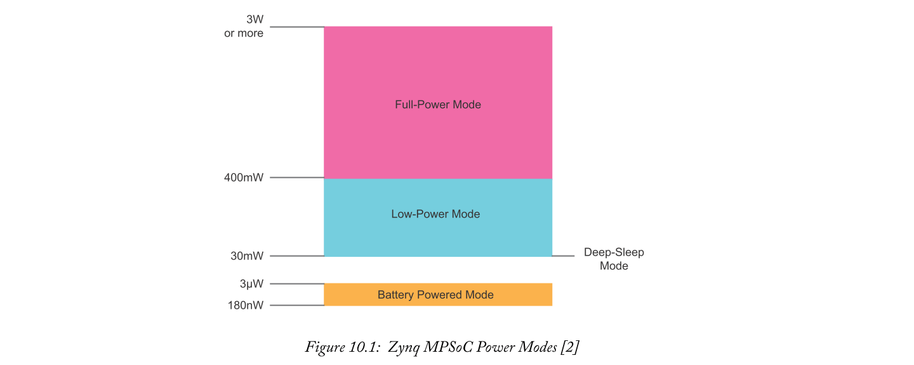
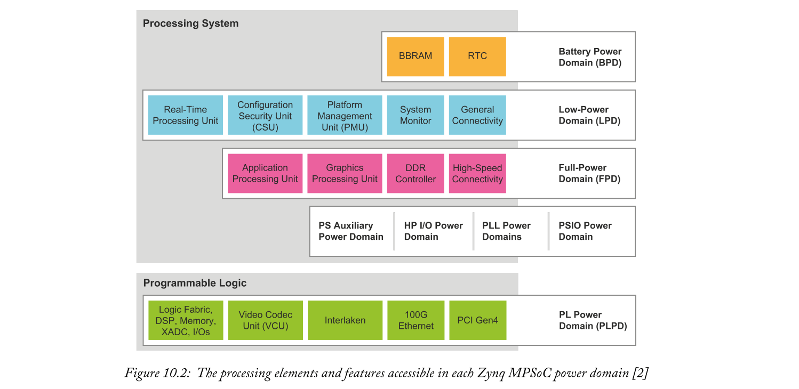
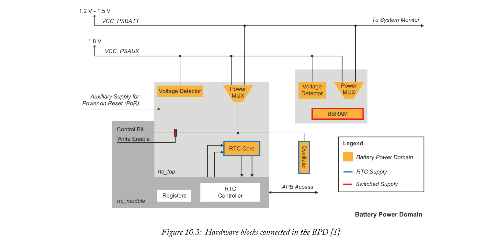
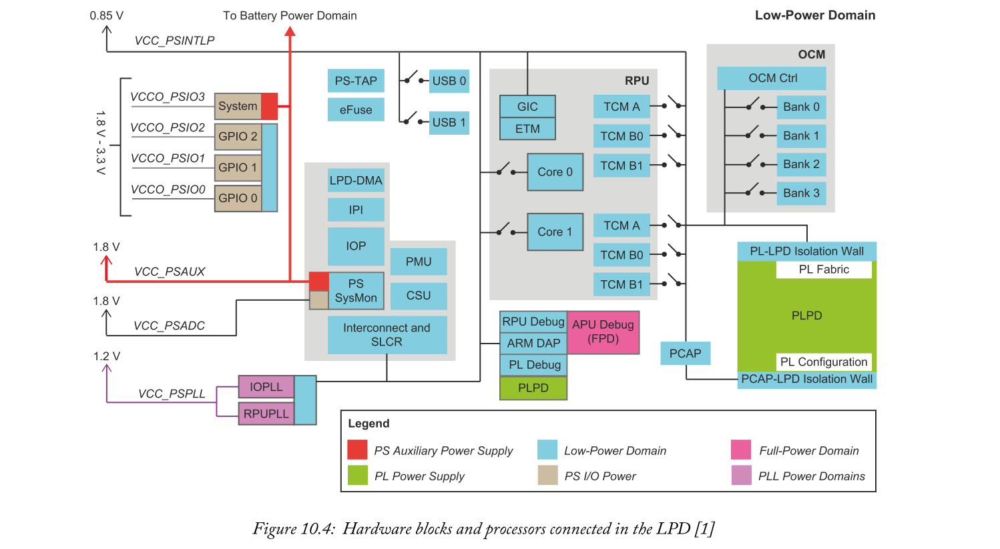
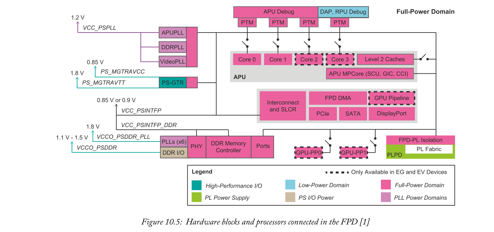
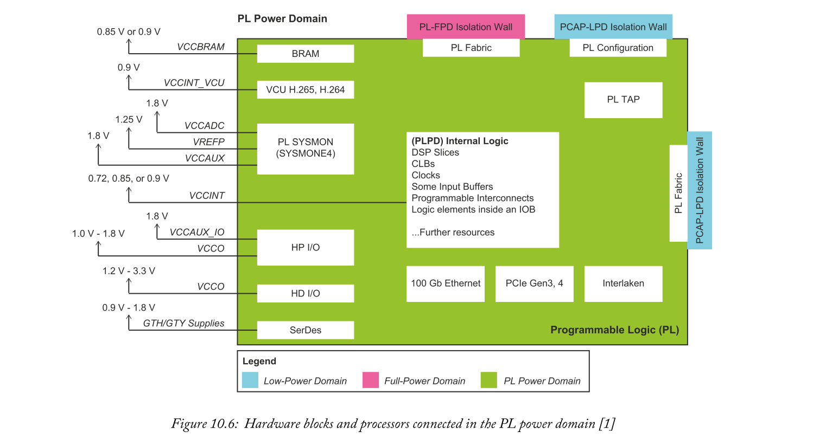
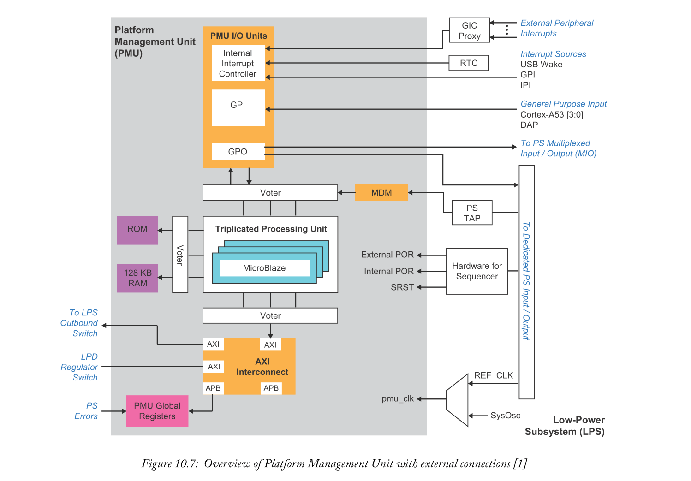
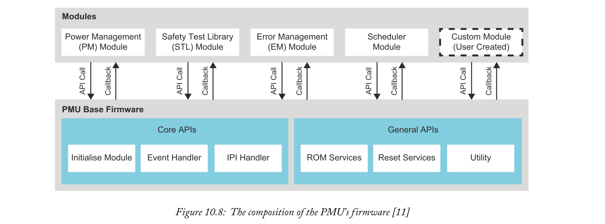
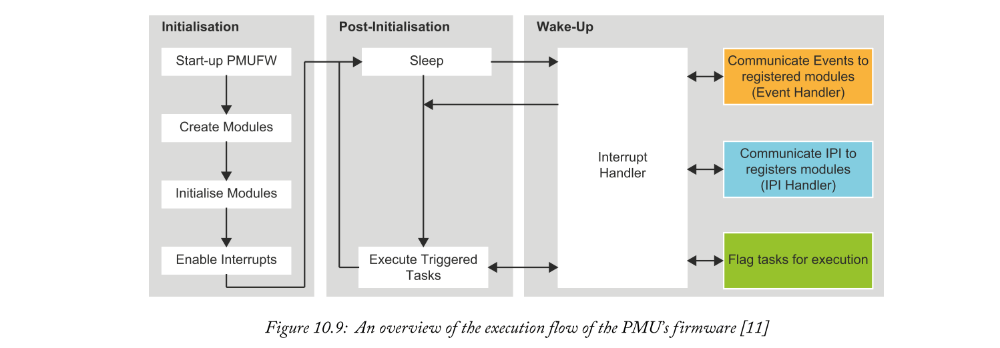

# Platform Management Features
Zynq MPSOC包含几种不同类型的处理单元，它们的电源状态和错误由单个芯片组件管理。此组件称为平台管理单元（PMU）。PMU负责协调来自APU和RPU的平台管理请求。它还能够响应整个系统中发生的错误。此外，PMU是启动Zynq MPSOC的重要元素。

在本章中，我们将涉及Zynq MPSOC平台管理特性的三个主题。如下： 
1. Power modes and domains-Zynq MPSOC的电源模式和域将被探索。本研究将包括Zynq MPSOC的三种工作电源模式和四个主要电源域。此外，我们还识别了Zynq MPSOC中的其他剩余功率域。
2. The PMU’s architecture——PMU是本章讨论的主要主题。描述了其体系结构，包括三联处理单元、存储器、外围设备和中断系统。此外，还讨论了使用PMU的错误管理。
3. The PMU’s firmware ——PMU的相关固件，提供响应系统中断和事件的程序和功能。讨论了固件的体系结构、执行流程和模块。注意，正如第10.3.1节所述，Xilinx为PMU固件提供了一个模板。

## 10.1  Power Modes
**PMU负责管理Zynq MPSOC的电源模式**。设备可配置三种工作电源模式：电池供电模式、低功耗模式和全功率模式。每种模式都允许设备内特定处理元素和功率域的操作。

图10.1提供了说明每个操作模式功耗的图表。请注意，低功率模式消耗高达150mw，全功率模式消耗约3w。此外，还显示了另一种称为深度睡眠模式的电源模式。深度睡眠模式在保持Zynq MPSOC的启动和安全状态的同时消耗最少的电量。

### 10.1.1  Battery Powered Mode
Zynq MPSOC设备可编程为关闭其系统元件以节省电源。节约能源的一种方法是将设备切换到电池供电模式。**两个硬件块，称为电池支持RAM（BBRAM）和实时时钟（RTC）**，用于支持电池供电模式。这些硬件块中的每一块都从芯片外提供的电池接收电源。电池向电池电源域供电，在第12.3.2节中进一步讨论。

Zynq MPSOC进入电池供电模式后将失去其安全性和启动状态。上电时，Zynq MPSOC必须重新初始化引导和安全状态，才能进入低功率或全功率模式。或者，可以使用深度睡眠模式来提高启动zynq mpsoc所需的时间。然而，这将消耗更多的能量。第10.1.4节讨论了深度睡眠模式。

### 10.1.2  Low-Power Mode
低功耗模式为低功耗域中存在的硬件块和处理器提供电源。在低功耗操作中通电的块包括**RPU、PMU、CSU和IOP**。但是，这不包括只有使用全功率模式才能访问的APU或PL。**低功耗模式还包括除显示端口和SATA接口块之外的所有可用的芯片外设**。

在低功率模式下运行时，电力系统元件的数量及其工作频率是决定Zynq MPSOC总功耗的一个主要因素。
### 10.1.3  Full-Power Mode
全功率模式允许驱动所有Zynq MPSOC功率域的功率。有几个域，每个域包含用于配电的单独电源轨。第10.2节进一步讨论了Zynq MPSOC功率域。

与低功耗模式类似，Zynq MPSOC的总功耗**取决于供电系统元件的数量及其工作频率**。

### 10.1.4  Deep-Sleep Mode
Zynq MPSOC可以进入深度睡眠模式，在保持整个系统的启动和安全状态的同时消耗最少的电量。在深度睡眠模式下，**PS中的几个处理元素断电。这些包括Cortex-R5处理器、系统监视器、APU的调试块、PS中的锁相环（PLL）以及全功率域中的任何组件。此外，PL的内部电源被关闭**。

PS中有两组内存可以继续在深度睡眠模式下保存数据。这些是**OCM和TCM**，但是一次只能保存其中一个内存。PS中唯一的操作元素是RTC和BBRAM。在深度睡眠模式下，这些硬件块使用第10.2.1节中描述的VCC_PSAU电源。

进入深度睡眠模式后，一些系统元件没有断电，而是处于暂停操作状态。处于暂停操作状态的系统元素，进入无活动状态以节省电源。在Deepsleep模式下，PMU、EFUSE、CSU和LPD中的几个外围设备处于暂停操作状态。特别是，PMU处于暂停状态，因为它需要等待中断或唤醒事件以将Zynq MPSOC通电至可操作模式。用于从深度睡眠模式启动zynq mpsoc的**中断或唤醒事件**可以由mio、ethernet、rtc或usb发出。

与电池供电模式相比，使用深度睡眠模式有两个主要优点。深度睡眠模式将保留zynq mpsoc的安全性和引导状态，并且引导或重新启动系统所花费的时间更少。如果低功耗特别重要，或者Zynq MPSOC将长时间断电，则应选择电池供电模式。

## 10.2  Power Domains
功率优化是Zynq MPSOC的关键设计规范。Zynq MPSOC的特定部分可在较低电压下运行，或通过使用多个电压等级和功率选通逻辑完全关闭。具有共同电源特性的处理元件被组合在一起形成sections。它们被正式称为功率域，其中Zynq MPSOC有几个。电源域提供关闭未使用资源以节省电源的选项。此外，功率域使多个电压源向资源供电成为可能。

我们在本节中的重点将放在Zynq MPSOC的四个主要功率域上，因为每个域都承载着几个关键组件和处理元素。它们是电池功率域（BPD）、低功率域（LPD）、全功率域（FPD）和PL功率域（PLPD）。

功率域不应与Zynq MPSOC功率模式混淆。**功率域**是指芯片上共享电源特性的资源子集。**功率模式**允许Zynq MPSOC内特定处理元件和功率域的操作。

**每个电源域独立于其他电源域**，可以进行隔离以降低功耗并实现功能隔离（Safety和Security应用和任务的基本要求）。图10.2说明了每个功率域可以访问的处理元素和特性。

Zynq MPSOC包含其他主要与外围设备和内存接口相关的功率域，如图10.2所示。这些在第10.2.5节中列出。

### 10.2.1  Battery Power Domain
BPD是BBRAM和RTC模块的host，如图10.3所示。当Zynq MPSOC处于电池供电模式时，BPD尤为重要，因为它包含唤醒Zynq MPSOC的所有必要组件（BBRAM和RTC），以便开始启动过程。RTC还可用于其他目的，例如提供警报，将Zynq MPSOC从深度睡眠模式唤醒。

BPD中每个硬件块的电源可以来自两个电源中的一个。这些是Zynq MPSOC的辅助电源（VCC_PSAUX）和芯片外电池电源（VCC_PSBATT）。

BBRAM是一个静态RAM阵列，负责存储设备AES密钥。BBRAM通常从Zynq MPSOC的辅助电源VCC-PSAUX接收电源，该电源存在于PS辅助电源域中。但是，如果关闭VCC-PSAUX，BBRAM将从电池电源VCC-PSBATT接收电源。电源之间的交换由电源多路复用器（MUX）和电压检测器处理。

RTC提供真实的时间和日期，即使Zynq MPSOC已关闭。它可以被编程为在预先确定的时间和日期中断所有处理器。与BBRAM类似，RTC将使用VCC PSAUX电源。但是，如果不可用，则RTC将使用VCC-PSBATT提供的电源。

RTC控制器和用户界面不接收来自BPD的电源。相反，它们连接到LPD电源轨，因此只有在LPD电源打开时才能运行。

### 10.2.2  Low-Power Domain
图10.4说明了LPD中存在的PS硬件块和处理器。其中包括以下重要的系统元素：
- RPU
- PMU
- CSU

除上述之外，LPD还包括输入输出外围设备（IOP）单元、片上存储器（OCM）和低功耗直接存储器访问（LP-DMA）。图10.4中的LPD图左侧显示了几个电源，右侧显示了LPD资源。

LPD包含许多**开关**，这些开关指示系统元素可以与其电源隔离。以这种方式隔离系统元件被称为功率选通。功率选通可以应用于RPU的处理器核心和紧耦合存储器（TCMs）。此外，还可以独立地为USB接口加电，并关闭OCM中未使用的banks，以降低功耗。PMU负责LPD中的功率选通系统元件。

### 10.2.3  Full-Power Domain
图10.5提供了一个说明FPD体系结构的图表。FPD是以下重要系统元素的Host。
- APU — There is a quad-core APU in EV and EG devices and a dual-core APU in CG devices.
- Full-Power Direct Memory Access (FP-DMA).
- GPU — The GPU is only available in EV and EG devices.
- DDR Controller (DDRC).
- High-speed I/O peripherals.

在图的左边是几个对FPD中的系统元件的操作有贡献的电压源。有两个主电源：VCC_PSINTFP_DDR and VCC_PSINTFP。前者为DDR的物理接口块和内存控制器供电。后者为FPD中的其余系统元素供电。

如图10.5中的开关所示，可以分别为每个Cortex-A53处理器核心、2级缓存和GPU像素处理器（GPU-PPx）供电。PMU负责FPD中的功率选通系统元件，提供对功耗的灵活控制。

FPD与下面描述的PL结构有几个接口。在第263页的第11章：硬件系统开发中，对这些接口进行了进一步的研究。
- 有六个高性能的PL总线主接口。这些接口在PL中提供主硬件块，访问PS从设备。这些接口的典型用途是支持对外部DDR内存的PL访问。
- 有两个高性能的FPD总线主接口。这些接口提供PS中的主设备，访问PL。当与PL中的硬件块通信时，APU和FP-DMA可以使用这些接口。

FPD连接到多个千兆传输和接收通道对，即PS-GTR收发器。这些收发器存在于FPD中，允许PS与高速外围设备通信。

要使用FPD，它必须在zynq mpsoc的初始引导期间通电。

### 10.2.4  PL Power Domain
图10.6提供了PLPD的简化图。PL资源显示在每个白色块中。可以根据需要关闭任何资源，以降低功耗。

有几个不同的电源为PL中的资源提供电源。每个电源都有自己的用途。有关PL电源的更多信息，请参见[4]。

注意，并非所有zynq mpsoc设备都包含图10.6所示的每个pl资源。有关每个zynq mpsoc设备中包含的资源的完整列表，请参阅[3]。

### 10.2.5  Other Power Domains
Zynq MPSOC中有更多的功率域用于隔离外围设备、接口和其他系统资源。可以关闭每个域以降低功耗。附加的功率域如下。
- PS Input Output (PSIO) Power Domain —— PSIO域承载用于连接到PS LPD中的MIO的专用GPIO管脚。
- Phase Locked Loop (PLL) Power Domains —— PLL功率域承载分布在LPD和FPD之间的PLL。
- High-Performance Input/Output Power Domain —— 该域与Zynq MPSOC的PS中的PS-GTR收发器相关。
- PS Auxiliary Power Domain —— PS辅助电源域用于LPD和BPD。该功率域先前在第243页第10.2.1节中进行了描述。

Zynq MPSOC技术参考手册[1]提供了有关每个功率域的更多信息。

## 10.3  Platform Management Unit
PMU是Zynq MPSOC的重要组成部分，因为它控制许多系统关键操作并始终保持设备的电源状态。必须考虑PMU在Zynq MPSOC中的许多职责。

PMU负责以下事项：
- 为PS中的电源主设备执行电源维护任务，即Cortex-A53和Cortex-R5处理器。任务包括在唤醒请求后启动目标处理器的加电和重启。
- 在Zynq MPSOC处于睡眠模式时维护它，并在通过触发机制接收到请求时唤醒负责处理请求的资源。
- 管理Zynq MPSOC中发生的错误并做出相应的响应。
- 最大限度地降低功耗和延长电池寿命（如果电池用作主要电源）。
- 在断言上电复位（POR）之后（在释放CSU复位信号之前）执行一系列功能。第14章更详细地讨论了这些功能。
- 执行以下程序：加电、断电、复位、内存内置自修复（MBISR）、内存内置自测试（MBIST）和扫描清除功能。扫描清除功能，也称为扫描归零，将零写入资源中的所有存储元素。

图10.7提供了说明整个PMU的详细图表，包括其接口、内部中断控制器和时钟和复位信号。

在本节的其余部分中，我们将考虑PMU的基础架构，以及与其他系统元素的信号和接口。这些原则对于理解PMU与Zynq MPSOC设备中其他处理单元的连接至关重要。

### 10.3.1  PMU Processor
PMU宿主在三重冗余处理单元，由三个硬化的microblaze[6]处理器组成。三重化处理单元被实现多数投票系统的投票逻辑包围。三个处理器中的每一个的结果组合在一起产生一个单独的输出。如果三个处理器中的一个发生故障，其余两个处理器能够保持处理器的正确运行。安全关键系统在使用三处理器冗余时出错的风险较低。冗余在前面的第9章中有描述。

PMU的三冗余处理器不包含任何缓存，但有一个小的本地RAM。此RAM使用错误检查和更正（ECC）。ECC更正单个错误，当发生多个错误时，将生成一个系统错误。ECC提高了整个处理系统的可靠性。

如第248页图10.7中PMU概述图所示，ROM包含PMU的重要信息。**ROM的内容包括PMU的引导代码、中断向量和PMU可以执行的主要服务例程**。它还预配置为存储用于启动前和启动后任务的脚本。这些在Zynq MPSOC技术参考手册[1]中进行了描述。

ROM包含一组固定的不能修改的默认函数。如果需要更改PMU的基本功能，则必须覆盖ROM的内容。PMU 128 kb RAM可用于此目的，能够添加、扩展和覆盖ROM中的指令和例程。

#### PMU Firmware
PMU的ROM提供基本平台管理功能的代码。但是，应用程序可能需要自定义例程、函数或修改PMU的默认操作。PMU的RAM为用户固件提供内存空间，这些固件可以覆盖PMU在ROM中提供的默认操作（因为无法修改ROM）。

要将固件加载到RAM中，当PMU处于休眠状态时，外部主机**必须通过APB接口访问RAM**。在[1]、[7]和[11]中进一步描述了将PMU固件加载到RAM中的过程。

Xilinx提供了Zynq MPSOC开发人员可以编辑的PMU的模型固件，如[7]和[8]所示。固件的软件架构、执行流程和模块将在第10.5节中进一步描述。

也可以使用Zynq MPSOC QEMU在软件中模拟PMU的运行。更多信息见[9]和[10]。

### 10.3.2  Interfaces and AXI Interconnect
PMU使用多个接口与Zynq MPSOC中的其他处理单元和资源保持通信。这些接口如248页图10.7所示，包括AXI连接、时钟和复位信号、电源和控制接口以及中断信号和源。本节将对其进行进一步描述。

#### AXI Connections and Interconnect
AXI互连允许在PMU内建立AXI连接。互连支持访问PMU的三冗余处理器和其他片上处理器的PMU全局寄存器。它还支持通过三冗余处理器和投票逻辑访问PMU的RAM。

#### Clock and Reset Signals
时钟和复位信号是PMU操作的一部分。时钟输入由包含在PS系统监视器[1]内的系统振荡器（sysosc）提供。PMU控制SYSOSC时钟的选通。当PMU处理器遇到无法纠正的错误时，系统时钟被禁用。

有两种方法可以重置PMU。这些是POR和系统重置（SRST）。PoR将清除系统中的所有逻辑、RAM和寄存器，并准备Zynq MPSOC进行引导。SRST只会重置PMU处理器子系统和PMU互连。它还将重置一些本地和全局寄存器，使它们大部分处于应用重置之前的状态。

您可以在[1]中了解有关这些重置和SysOSC时钟的更多信息。

#### General Purpose I/Os
PMU有几个通用输入（GPI）和通用输出（GPO），用于各种用途。这些包括睡眠唤醒信号、错误报告、外围设备配置和用于握手的信号。有四个GPI Banks（GPI0-GPI3），只能由PMU处理器访问。还有四个GPO banks（gpo0-gpo3）连接到Zynq MPSOC中的各种元素

有关PMU通用I/O寄存器的广泛信息，请参见[1]。每个寄存器的位级信息可以在[5]中找到。

#### Dedicated PS I/Os
PMU通过MIO连接到PS中的专用输入/输出管脚。**其中许多连接可用于从MIO向PMU发出唤醒请求**。其他用于从PMU向MIO发出电源控制信号。尤其是两个连接用于为FPD和PLPD供电。MIO[32]用于启动VCC UPSINTFP（FPDS主电源之一）的加电，MIO[33]用于启动VCCINT（PL逻辑结构的电源）的加电。

#### JTAG Interface
除了上述通用I/O连接之外，PMU还包含一个从PS测试访问端口（TAP）控制器连接到JTAG接口的Microblaze调试模块（MDM）。此连接允许PMU从JTAG边界扫描路径中的数据或指令寄存器中检索信息。这种连接的目的是为PMU提供在遇到错误时与外部系统通信的能力。

### 10.3.3  Local and Global Registers
PMU中有全局和本地寄存器，描述如下：
- 全局寄存器对Zynq MPSOC的Safety和Security是非关键的。这些包括电源、隔离、错误捕获、系统电源状态和重置请求寄存器。连接到PMU的其他总线主机可以访问全局寄存器。
- 本地寄存器负责Zynq MPSOC的安全运行。这些元件只能由PMU访问和维护，以防止系统内的其他处理元件产生错误，进而损坏设备或影响其运行。

有关全局和本地寄存器内容的详细信息，请参见[5]。全局寄存器表示为PMU_GLOBAL，本地寄存器表示为PMU_LOCAL。

### 10.3.4  Programmable Interval Timers
可编程间隔计时器（PITS）是最初用上限（最大计数值）编程的计数器。当达到上限时，PIT将计数到该值并向PMU的中断控制器输出中断信号。在嵌入式设计中，PIT可用于事件调度或作为延迟计数器。

PMU包含四个32位的Pit0、Pit1、Pit2和Pit3。它们的每一个时钟都由固定系统振荡器（sysosc）驱动。**PIT1**有一个特殊的用途，因为它被包含在其固件中的PMU调度程序使用。调度程序使用PIT1来维护任务的间隔时间，在第10.5.2节中进一步描述。

通过写入和读取PMU I/O模块中的寄存器，可以获得关于PITs的进一步配置和信息。这些寄存器在[1]和[5]中描述。
### 10.3.5  Interrupts
如果参考第248页图10.7，PMU有一个内部中断控制器和一个外部（关于PMU）GIC代理块，以支持连接到APU和RPU的中断。有几个中断直接从不同的源（包括RTC）连接到中断控制器。

**中断控制器的目的是为PS和PL的元件提供与PMU通信、加电、断电、复位和其他系统关键请求的方式**。在本节中，我们旨在通过探索PMU接收中断的方法和研究GIC代理块和处理器间中断通道，进一步提供有关PMU中断系统的详细信息。

#### Receiving an Interrupt
重要的是要知道当PMU的中断控制器接收到中断时会发生什么。具体流程如下：
1. 中断控制器接收一个中断。ROM中的软件代码与PMU I/O单元内的挂起中断寄存器（IRQ_PENDING）协商。IRQ_PENDING寄存器将决定哪个中断挂起并需要维护。
2. 与挂起中断相关的中断服务程序来自于ROM或RAM（RAM的固件中可能包含一个中断服务程序）。如果多个中断处于挂起状态，那么[1]中详细描述的中断优先级将决定应首先发出哪个中断。 
3. RAM可能包含覆盖ROM中配置的例程的固件。中断的优先级也可能被固件覆盖。如果RAM不包含固件，则中断优先级和服务例程由ROM维护。
  
#### The GIC Proxy
GIC代理块用于整理连接到APU和RPU GICs的中断。代理使PMU能够在断电时检测到已发送给APU或RPU的中断。GIC代理块能够在低功耗模式下支持PMU。

通过GIC代理检测到中断后，PMU可以采取相关措施唤醒负责处理中断的处理单元，或根据其RAM或ROM中包含的固件执行预先确定的操作。

GIC代理中断由25个32位寄存器控制，如低功耗域系统级控制寄存器Bank（LPD_SLCR）所述。这些在zynq mpsoc寄存器参考文献[5]中有详细说明。

#### The PMU’s Inter-Processor Interrupt Channel
PMU的中断控制器也连接到一些处理器间中断（IPI）通道。Zynq MPSOC中IPI的目的是**为处理器提供中断另一个处理器的能力**。当处理器需要另一个执行操作时，这很有用。在Zynq MPSOC中，有**11个IPI通道**。四个通道分配给PMU中断控制器。这些通道不能重新编程，因为它们固定在硬件中，即仅连接到PMU中断控制器。其余通道连接到Zynq MPSOC中的其他处理单元。

IPI通道能够在连接的处理器之间**发送32字节的信息**。**通道使用内存缓冲区来帮助支持处理器间中断结构**。消息缓冲区能够使用IPI通道在处理器之间存储请求和响应消息。只有8组内存缓冲区：7组可分配给使用IPI通道的任何处理器，一组缓冲区专用于PMU。

PMU有一套关于IPI的特殊规则。主要地，PMU被分配四个IPI通道（固定在硬件中）和一个专用的内存缓冲区。除此之外，IPI（IPI0）的通道0还有一个专门的用途。IPI0指示PMU进入睡眠模式。如果PMU RAM必须由外部主机通过APB接口访问，则睡眠模式很有用（将PMU固件加载到RAM时需要IPI0）。

本节仅讨论了与PMU相关的IPI信息。有关此主题的详细信息，请参阅[1]。

## 10.4  Error Management
PMU负责整个Zynq MPSOC的错误捕获。错误信号被路由到PMU，并记录在全局寄存器块中。如果发生错误，PMU可以根据错误类型采取适当的措施。

PMU提供寄存器和错误输入信号，分别捕获**软件和系统级硬件错误**。**软件错误**是指在PMU的ROM和固件以及CSU的ROM中执行软件代码期间发生的错误。**系统级硬件错误**是Zynq MPSOC的一个处理单元或系统元件发生错误的结果。这种类型的错误会将错误信号传播到PMU。注意，当PMU执行其预引导程序时，PMU不会记录软件错误。但是，记录所有其他错误。

当发生软件或系统级硬件错误时，使用错误状态寄存器将其记录在PMU中。所有这些错误都能够触发PMU处理器的中断。根据发生的错误，可以屏蔽中断（被PMU的处理器忽略）。这可以使用PMU全局寄存器块中包含的中断错误寄存器。

在本节中，我们将讨论错误状态和使能寄存器、触发PMU错误中断所涉及的寄存器，以及处理已发生错误时可以采取的操作。

### 10.4.1  Error Status and Enable Registers
PMU为Zynq MPSOC提供错误捕获和决议。系统元素的错误状态被捕获在PMU的全局寄存器块中。这些寄存器分别表示为ERROR_STATUS_1和ERROR_STATUS_2。它们的位级描述在[5]中提供。如果发生错误，错误状态将保留在错误状态寄存器中，直到清除为止，即使存在SRST或内部POR。

影响**错误状态寄存器**的错误可以通过配置错误启用寄存器来启用或禁用。全局寄存器块中有两个错误使能寄存器，分别表示为ERROR_EN_1和ERROR_EN_1。将位“0”写入这些寄存器中的位置将**阻止**相关错误影响错误状态寄存器（或第10.4.2节所述的中断错误寄存器）。将位“1”写入错误使能寄存器中的位置将**允许**错误影响错误状态（和中断错误）寄存器。

### 10.4.2  Interrupt Error Registers
**中断错误寄存器**帮助管理错误。特别是，当Zynq MPSOC中发生错误时，它们用于确定中断是否应传播到PMU处理器。然后，PMU处理器将执行固件中规定的操作，以响应错误。与错误状态和使能寄存器类似，中断错误寄存器包含在全局寄存器块中。

**中断屏蔽寄存器**（ERROR_INT_MASK_x）用于确定错误中断是否会传播到PMU处理器。如果为错误启用了中断，则该错误在中断屏蔽中的位位置将等于位“0”。如果由于错误而禁用中断，则该错误在中断屏蔽中的位位置将等于位“1”。

如果错误中断PMU处理器，则必须有可用的固件来处理错误/中断。如果没有可用的固件，将发生无固件错误。

### 10.4.3  Error Handling
发生错误时，可以执行操作。我们已经介绍了其中一种方法，在这种方法中，可以通过使用中断（在第10.4.2节中讨论）将错误通知PMU。由于错误，还有三个其他操作可以执行。如下：
- Generation of a SRST.
- Generation of a POR.
- Zynq MPSOC设备上PS_ERROR_OUT信号的断言。该信号应被断言，以便与外部世界通信错误。禁用PS_ERROR_OUT信号可能有利于Security设计，因为这样可以防止外界知道设备处于错误状态。

要执行上述一个或多个操作，必须配置相关的掩码寄存器。此过程与前面描述的错误中断过程相似（第10.4.2节）。SRST、POR和PS_ERROR_OUT信号的屏蔽寄存器包含在全局寄存器块中。通过写入相关的启用和禁用寄存器来配置掩码寄存器。

对于Zynq MPSOC设备以外的错误源列表及其相关屏蔽的状态，读者可参考[1]。

## 10.5  PMU Firmware
PMU的三冗余Microblaze处理器加载并执行两个可用内存中的软件代码。这些是32kb的ROM（不能修改）和128kb的RAM（可以修改）。每个存储器中包含的代码允许PMU为Zynq MPSOC执行加电、重置和控制功能和例行程序。

PMU的ROM预装了各种称为PMU Boot ROM（PBR）函数的函数。PBR负责执行Zynq MPSOC启动前后的任务。要执行更复杂的平台管理技术，PMU将需要使用自定义PMU固件，也称为PMUFW。自定义PMUFW被写入并存储在128kb RAM中，这样处理器就可以加载和执行它。

本节旨在通过探索PMUFW的特性并增加其对尚不熟悉其执行的人员的可访问性，来提供PMUFW的基础。我们将深入PMUFW的组成和执行情况。此外，还将审查固件的模块化功能，以便轻松实现添加和定制软件模块。最后，还讨论了将自定义PMUFW加载到RAM中，因为必须以特定的方式执行此例程。

注意，Xilinx为PMUFW提供了一个模板；开发人员不必从头开始编写自己的固件。xilinx提供的固件模板可以使用Xilinx SDK访问，其中源代码可以访问。如[8]和[11]所述，可以修改模板以适应开发人员的需求和应用程序限制。

### 10.5.1  Composition of the PMU Firmware
PMUFW由两个组件组成，即**基本固件和模块**。基本固件提供用于调用ROM和重置服务的基本应用程序编程接口（API）以及实用程序[8]、[11]。这些是PMUFW通用API的一部分。

**基本固件**还为模块提供三个**处理程序**（下面将进一步介绍）。这些处理程序用于**初始化软件模块、处理事件和处理IPI**。**处理程序**是处理和响应系统事件或中断的软件例程。处理程序是PMUFW核心API的一部分，在[11]中讨论。

模块提供PMUFW的实际功能。模块组件之所以如此命名，是因为它完全是模块化的。其他功能可以以软件模块的形式添加到PMUFW中。模块通过简化向PMUFW添加新功能来提供帮助，它们支持对现有功能的简单定制。

基本固件和模块共同提供PMUFW的整体功能。模块调用基本固件中提供的API来完成其任务和例程。图10.8显示了说明PMUFW组成的方框图。

请注意，PMUFW中有**四个默认模块**。这些是**错误管理、电源管理、调度程序和安全测试库**。各模块如图10.8所示位于模块左侧。还有**第五个模块表示用户创建的自定义模块**。固件中一次**最多可以有32个模块**（可以使用现有模块作为模板创建其他模块）。此外，可以禁用未使用的模块来保存内存（在[11]中进一步讨论了禁用模块）。

### 10.5.2  Default Modules
如图10.8所示，有四个默认模块。具体如下。
- Error Management (EM) —— 整个Zynq MPSOC中产生的错误由PMUFW中的EM模块处理。EM模块中的错误处理程序可以进行定制，以决定发生错误时应执行什么操作。在前面的第10.4.3节中讨论了可针对错误执行的操作类型。
- Power Management (PM) —— PM模块负责处理整个Zynq MPSOC中由电源管理事件触发的中断。该模块包含一组处理程序，用于确定应采取哪些操作来响应电源管理事件。PM模块还可以访问PMU ROM以获取控制特定硬件资源的处理程序。
- Scheduler —— 调度程序模块负责维护PMUFW所需的一组任务的时间和状态。调度程序使用PIT1来维护任务的间隔时间。最多可以有10个任务使用数字进行优先级排序。“0”是最高优先级，“9”是最低优先级。有关调度程序数据结构和操作的更多信息，请参见[11]。
- Safety Test Library (STL) —— STL是软件安全程序和例程的仓库。这些软件安全机制与硬件安全功能一起用于检测随机硬件故障。

### 10.5.3  Execution of the PMU Firmware
PMUFW执行流程由三个阶段组成。这些是**初始化、初始化后和唤醒**。图10.9所示为说明各阶段之间过渡的示意图。

如图10.9所示，固件首先进入初始化阶段，然后进入后初始化阶段。然后，固件将在后初始化和唤醒阶段之间来回移动。在每个阶段执行的操作如下所述。

#### Initialisation Phase
启动时，固件进入初始化阶段。在此操作状态期间，固件将执行多个功能和例程。其中包括内置自检（BIST）、硬件初始化、模块创建和初始化（第10.5.4节简要讨论了自定义模块）。

**在此期间，对PMU的中断被禁用，直到初始化阶段完成后才会启用**。这是为了阻止中断传播到PMU（导致代码执行中断），并防止系统资源在成功初始化之前被使用。

#### Post-Initialisation Phase
初始化后，固件将进入后初始化状态并进入休眠模式。固件将继续休眠，直到触发对PMU的中断。然后，固件将进入中断处理程序状态，进入唤醒阶段。

#### Wake-Up
在这个阶段，固件现在将服务于接收到的中断。这涉及到**确定中断用于哪个模块**，并**调用模块的事件处理程序**（如果中断对应于已注册的事件）或**模块的IPI处理程序**（如果中断具有相应的模块ID）。然后，固件将标记需要针对调用的处理程序执行的任何任务。然后固件将返回到初始化后阶段，并执行触发的任务。一旦完成，固件将返回睡眠模式，直到发生另一个中断。

### 10.5.4  Custom Modules
自定义模块可以添加到PMUFW中，以扩展Zynq MPSOC中PMU的功能。附加模块应完全自包含在PMUFW中，并可使用附加API从基本固件（如前10.5.1节所述）调用固件功能和例程。

通过向Xilinx SDK中提供的PMUFW模板添加代码，可以简单地创建自定义模块。自定义模块代码和示例详见[11]。

## 10.6  Chapter Review

本章介绍了Zynq MPSOC的功率域、工作模式和PMU。

在本章的早期部分，Zynq MPSOC被视为使用三种工作电源模式：电池供电模式、低功耗模式和全功率模式。Zynq MPSOC还可以置于深度睡眠模式，在保持整个系统的启动和安全状态的同时消耗最少的电量。随后，对Zynq MPSOC的主要功率域进行了研究。包括电池功率域、低功率域、全功率域和PL功率域。

介绍了PMU的体系结构，包括三冗余处理单元、存储器、外围设备和中断系统。特别指出的是，PMU的ROM包含一组用于zynq MPSOC平台的固定（只读）功能和例程。相反，RAM能够被主处理器写入，因此可以添加新的函数和例程（或者覆盖ROM中的现有函数）。

对PMU固件的软件组成进行了探讨。发现固件具有模块化架构，可以轻松添加新功能。此外，还注意到默认固件包含四个模块。这些是错误管理、电源管理、调度和安全测试库。Xilinx提供了一个固件模板，开发者可以根据需要修改该模板以添加自定义模块。