# Chapter 11 Hardware System Development
到目前为止，本书详细介绍了Zynq MPSoC器件的各种处理单元，Safety，Security和平台管理功能。在本书的这一部分中，将探索使用Zynq MPSoC的系统开发，并将调用之前在其他章节中学到的知识。本章将特别介绍Zynq MPSoC的硬件基础架构以及每个处理单元之间的系统级通信。将特别强调PS和PL之间的通信接口，因为这些对于与FPGA逻辑结构中的硬件加速器进行通信是必不可少的。

使用Zynq MPSoC器件的主要动机是利用FPGA来加速功能和任务。本章的讨论将使您更好地了解PL，以及如何在自己的系统设计中使用它。本章概述如下：
- 介绍了硬件/软件协同设计，并描述了Zynq MPSoC处理单元的作用。特别是，讨论了PL在Zynq MPSoC中的作用。
- 提供了Zynq MPSoC硬件系统的概述，详细介绍了其接口和信号，互连和存储器。随后，探讨了每个PS-PL AXI端口的用途。
- 还详细介绍了Zynq MPSoC中断系统和器件存储器。最后，描述了在整个Zynq MPSoC器件中传输数据的基本原理。

由于Zynq MPSoC器件系列之间存在差异，本章中的讨论和说明将主要基于EV器件（编写本手册时功能最多的器件系列）。在本章中，我们将在必要时明确提及设备系列之间的任何差异。

## 11.1  Heterogeneous Computing with Zynq MPSoC
Zynq MPSoC器件具有多个处理单元和功能，每个处理单元和功能都有自己的特殊处理能力。使用Zynq MPSoC设计嵌入式系统的一个重大挑战是使用它的每个组成处理单元以达到最佳效果，并且在需要时，每个处理单元彼此并行运行。这不是一项容易的任务，但是，有一些方法和工具可以提供帮助。

硬件/软件协同设计是嵌入式系统开发过程中的一项重要任务，因为它可以对整体系统性能，功耗和资源消耗产生重大影响。基础过程涉及将嵌入式设计划分为硬件和软件组件。这样做的动机是利用每个执行环境的功能。由于其固有的并行处理能力，硬件组件（例如FPGA中的组件）可以加速嵌入式系统的大多数方面。相比之下，软件组件更适合顺序处理，通常在微处理器或微控制器中实现。

Zynq MPSoC器件可在其应用开发阶段有效地实现硬件/软件协同设计。[2]中概述了一种通用方法，有助于系统设计人员在将任务分配给处理单元时确定要采取的最佳行动方案。该方法的一般原理如图11.1所示。

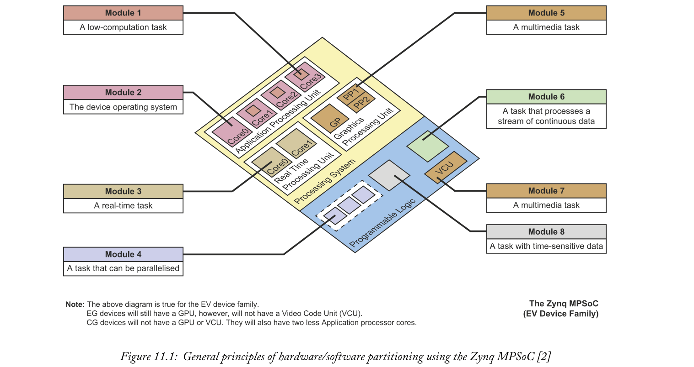

每个处理单元都为托管嵌入式应用程序提供了自己独特的功能，并增加了硬件/软件分区的机会。例如，如果应用程序需要连续处理数据，则PL可能最适合此任务。PL将在处理时间和资源消耗之间提供合理的权衡。

在图11.1中，Cortex-A53应用处理器托管设备的操作系统。它为外围接口提供驱动程序，并可以参与应用程序的执行流程。此外，它能够使用PS-PL接口控制PL中的硬件加速器。

如图所示，PL能够有效地实现可以分成多个较小任务的功能和例程。当较小的任务同时执行时，实现了计算的加速。FPGA原生的并行执行允许并发执行算法功能和任务。此外，它还适用于时间敏感数据，因为它具有确定性的性能。如果一个任务处理流数据，如果可以使用FPGA架构有效地实现它，则应该在PL中执行它[2]。

硬件/软件协同设计所涉及的挑战在于确定应该在硬件或软件中执行的例程和功能。嵌入式系统设计中的这一关键步骤可以使用名为SDx的新Xilinx开发环境[4]来实现。

SDx（详见第11章）为开发人员提供了完整基于软件的硬件/软件协同设计环境。通过调用高级综合（HLS）[5]，可以选择把嵌入式系统的一部分软件功能放在PL中执行。通过将软件功能直接转换为RTL，HLS降低了手动创建硬件设计所需的复杂性和时间。这种类型的开发对于Zynq MPSoC设备特别有用，因为可以在APU和RPU上开发软件，同时在PL中加速软件功能。

使用Zynq MPSoC设计系统时的一个**重大挑战是确定每个处理单元如何有效地相互通信信息**。Zynq MPSoC中需要共享数据的每个处理单元都存在此问题。例如，APU与PL通信的物理介质是什么？

处理单元之间的通信在第13章中使用Linux，openAMP和Xen管理程序在软件级别进行描述。但是，本章旨在探索可用于控制处理单元和元素之间的数据移动和通信的底层硬件基础结构。这些是整个器件中Zynq MPSoC的接口和信号，存储器和互连。每个组件在我们的嵌入式系统设计中的数据传输中起着至关重要的作用。

在深入了解SDx，Linux，openAMP和Xen的世界之前，建议您熟悉Zynq MPSoC的硬件基础架构。本章的其余部分将探讨Zynq MPSoC的硬件系统，PS-PL通信路径，中断和存储器。第11.6节详细介绍了如何使用直接内存访问（DMA）控制器在整个Zynq MPSoC中移动数据。

## 11.2  Hardware System Overview
Zynq MPSoC是一个由多个处理单元组成的异构多处理器平台。每个处理单元能够执行由其底层架构所规定的一组指令。为了充分利用Zynq MPSoC，必须根据其功能使用所有处理单元，以有效降低功耗并提高处理性能。因此，有必要有效地共享数据。在Zynq MPSoC器件中开发硬件系统时，数据共享是一项重要的挑战。处理器必须能够使用底层硬件基础架构共享或检索数据。另外，应用程序还可能需要与外界通信（片外）。

必须首先在Zynq MPSoC（其物理基础设施）的系统级别考虑与处理单元之间共享数据相关的挑战。除了Zynq MPSoC的处理单元外，其大部分资源和处理元件可分为三类：接口和信号，互连，和存储器。
- 接口和信号由处理单元和系统资源提供。这些是连接到互连或其他硬件资源的网关，因此数据可以从一个系统元素传播到另一个系统元素。
- 互连（有时统称为Zynq MPSoC器件中的互连）为硬件系统中的每个处理单元和元件提供连接。互连使数据可以从芯片上的一个点传播到另一个点。
- 存储器对于存储至关重要，允许保存数据和指令，直到处理单元稍后需要。

本节将介绍Zynq MPSoC器件的基本硬件基础结构。讨论将包括Zynq MPSoC接口和信号，互连和存储器的基础知识。这些主题中的每一个都将增加您对硬件基础结构的了解，并支持本章后面对这些主题的详细讨论。

### 11.2.1  Interfaces and Signals
Zynq MPSoC器件具有丰富的功能，可为复杂的嵌入式系统设计提供丰富的解决方案。系统开发过程中的主要挑战之一是决定在与许多Zynq MPSoC的处理资源和元素进行通信时使用哪些信号和接口。当在PS和PL之间进行通信时，这尤其明显。

图11.2显示了Zynq MPSoC接口和信号的图示。请注意，提供的插图并不完整。读者可以参考[1]获得更完整的图表。以前，第3章介绍了多路复用输入/输出（MIO），串行输入输出单元（SIOU）和PL信号。本节不讨论这些主题。相反，将详细介绍PS和PL之间的接口和信号（如图11.2所示，带红色虚线框）。

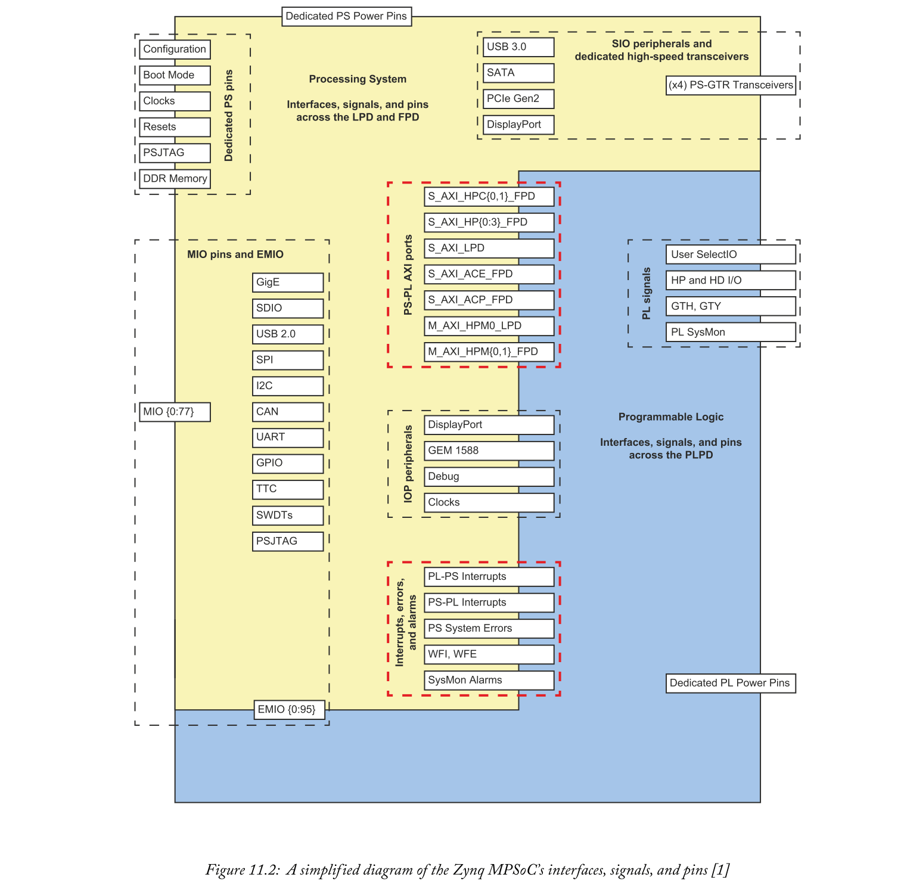

#### PS-PL AXI Ports
PS可以使用提供的PS-PL AXI端口连接到PL中的硬件加速器。这些是高带宽，低延迟连接。

Zynq MPSoC器件中有12个PS-PL AXI端口，如表11.1所述。请注意，这些接口有一个命名约定。接口的第一个字母始终表示PS的功能，即“S”表示PS是从设备，“M”表示PS是主设备。FPD指定端口是全功率域的一部分，而LPD指定端口是低功率域的一部分。

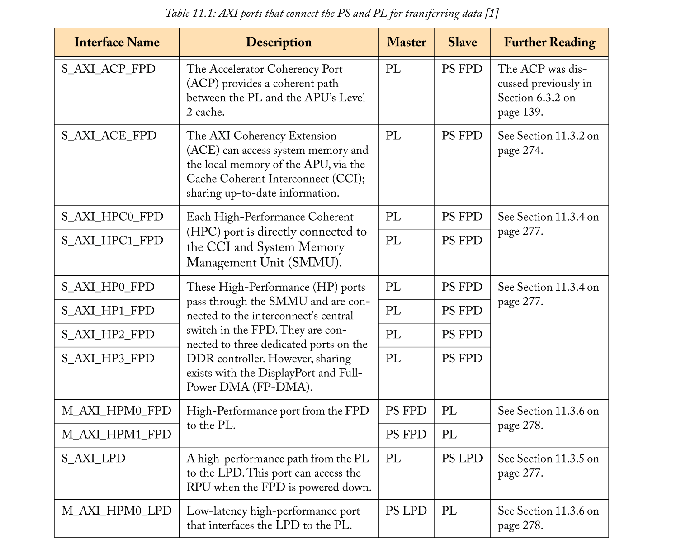

如表11.1的最后一列所示，本章后面将详细讨论每个端口（除了前面第6章讨论过的ACP）。

#### PS-PL Interrupts
PL能够触发对PS的16个中断，每个中断被分配一个优先级（用于优先中断处理）。PL中断通过Zynq MPSoC通过中断控制器传播到达目标处理器。中断可以是中断请求（IRQ）或快速中断请求（FIQ）的形式。

还有四个连接到PL的处理器间中断（IPI）通道。这些对于提供与PS中其他连接的处理单元的直接通信是有用的。还有从PL到APU的传统FIQ和IRQ的连接，以及从PL到传统nFIQ和两个RPU核心的nIRQ的中断连接（小写n表示低电平有效信号）。

在11.4节中，将更详细地讨论整个Zynq MPSoC中断系统。

### 11.2.2  The Interconnect
Zynq MPSoC的互连特别复杂。与Zynq SoC [3]相比，还有更多的功能，Switches和模块可以控制Zynq MPSoC器件中的数据流和传输。没有必要了解Zynq MPSoC互连架构的各个方面。除非您是高级开发人员，否则您只需要了解互连的基础知识。

互连位于Zynq MPSoC的PS中。它使用AXI点对点通道促进主从元件之间的通信。互连由许多高性能Switches组成，支持AXI协议，用于系统元件之间的读，写和响应事务[1]。

Zynq MPSoC互连的简化图如图11.3所示。请注意，除了显示的资源，处理元素和连接之外，还有更多资源，处读者可以参考[1]获得Zynq MPSoC互连架构的详细图表。

Zynq MPSoC的互连中有几个AXI连接。许多连接使用支持Arm AMBA系列中几种AXI总线协议的高性能Switches。互连使用Arm AMBA总线连接来支持其许多特性和功能，包括用于改进AXI事务优先级的Qualityof-Service（QoS）支持，以及Zynq MPSoC系统元件的调试和测试监控。有关AXI QoS的更多信息，请参阅[1]。

图11.3中的互连分为三类。分别是LPD，FPD和PL电源域（PLPD）。请注意，6个DDR控制器端口中的5个（以红色显示）是FPD。LPD中只连接了一个。

本节的其余部分将重点介绍Zynq MPSoC互连中可用的功能，并提供互连Switches的摘要。另外，我们将提到互连中的一些AXI功能模块（图11.3中未显示）。

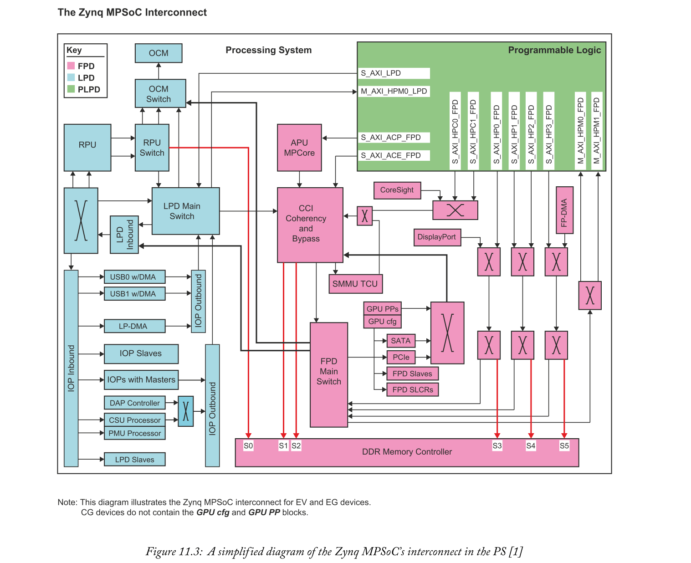

#### System Coherency using the CCI
当处理器缓存数据时，它将该数据存储在易于访问且通常具有低延迟的本地存储器中。这提高了该处理器内核的性能，因为它可以快速检索数据，而不是访问主系统内存所带来的更高延迟。Zynq MPSoC中的处理单元有自己的本地存储器（高速缓存），用于临时存储数据。

与多处理器环境相关的挑战之一，例如Zynq MPSoC，确保所有处理单元都是最新的整个系统生成的数据。当两个或多个处理单元在其自己的本地缓存中存储共享数据时，可能会出现问题。如果修改了这些数据，系统可能会变得不连贯，因为其他人没有得到通知（因此将在其功能和例程中使用错误的数据）。目标是确保所有处理单元可以保持彼此的高速缓存一致，以便它们都具有相同的共享数据视图。有两种方法可以实现缓存一致性，同时仍然保持良好的系统性能，如下所述：
- Software Coherency - 在软件解决方案中，负责生成新数据的处理单元必须清理/刷新其缓存，然后再允许其他人从内存中读取共享数据。如果处理单元正在使用共享数据，则该过程类似。但是，在读取新数据之前，它们必须使其缓存无效。这是因为他们最初存储的数据不再是最新的。不幸的是，这种方法需要大量的处理器干预。
- Hardware Coherency - 硬件解决方案可以提高系统性能，因为这简化了所涉及的软件。处理单元的物理接口，用于请求，监听其他处理单元生成的请求，以便为其提供最新数据（如果在其高速缓存中可用）（监听在第11.3.1节中描述）。性能的提高是显着的，因为不需要执行软件解决方案通常所需的高速缓存刷新/无效。

CCI是PS架构的有用补充，允许处理器使用**硬件一致性**在彼此之间共享任务和数据。首先，CCI用于**实现非对称处理**，从根本上为处理任务之间的一致性提供互连支持，并**确保每个处理器内核在整个PS上运行最新数据**。

有两种方法可以利用CCI来支持Zynq MPSoC中的一致性。第一种方法是系统中主设备之间的完全（双向）一致性。完全一致的主机可以在缓存之间互相提供最新数据。这也称为监听，在第11.3.1节中进一步描述。也可以使用I/O一致性（单向）执行一致性。使用I/O一致性的接口可以检索数据，但不能与其他连接的主机共享数据（监听是单向的）。

CCI使用Arm CoreLink CCI-400 IP，详见[6]。Coherent PL接口将在第11.3节中进一步讨论。

#### System Memory Management Unit
SMMU负责连接系统Master和Slave客户端的一系列保护服务之间的地址转换。SMMU使用Arm CoreLink系统MMU-500 IP，如[7]中所述。SMMU将在8.3.1节中进一步讨论。

#### Interconnect Switches
Zynq MPSoC互连中的Switch基于Arm CoreLink NIC-400 [8]网络互连IP。一些重要的Switch总结如下：
- FPD Main Switch: 这是Zynq MPSoC的主要Swtiches之一，负责将FPD中的主设备连接到LPD从设备。该Switch具有到片上存储器（OCM）的直接路径（通过OCM Switch），完全绕过LPD Main Switch，以最小化FPD和OCM之间的延迟。此外，该Swtich允许FPD中的Masters访问LPD的外设寄存器（通过LPD Inbound Switch）。
- LPD Main Switch: LPD中的大量数据移动由此Switch控制。特别是，它利用访问LPD Inbound Switch，OCM Switch和PL（通过M_AXI_HPM0_LPD接口）。重要的是，它提供了与FPD中CCI的连接，能够为RPU和低功耗DMA（LP-DMA）提供路径，以便与其他处理单元进行高速缓存一致操作（仅限I / O一致性）。此外，该Switch还控制来自输入/输出外设（IOP）和PL（S_AXI_LPD）中的硬件模块的incoming traffic。
- OCM Switch: OCM Switch用于OCM，FPD main switch，LPD main switch和RPU switch之间的流量移动。
- RPU Switch: 此switch负责将RPU连接到DDR内存控制器的端口1。它还有助于RPU，OCM Switch和LPD inbound switch之间的事务处理。
- LPD Inbound Switch: Zynq MPSoC中的处理单元（如RPU和APU）可以使用LPD inbound switch访问平台管理单元（PMU）的全局寄存器和RAM。此外，还可以通过此switch执行与RPU，配置安全单元（CSU），LP-DMA和IOP的通信。

#### Additional AXI Blocks
最后，您可以在Zynq MPSoC互连中找到另外两个AXI模块（图11.3中未显示）。这些是AXI Timeout Block和AXI / APB Isolation Block。AXI Timeout BLock可防止互连由于无响应的从设备而pending。当必须断电时，AXI / APB Isolation Block功能性地将AXI / APB主机与其相关的从机隔离。关于其中每一项的更多信息可以在[1]中找到。

### Memories
除了处理器缓存和PL存储器之外，还有另外两个值得探索的重要系统存储器。这些是OCM和双倍数据速率（DDR）内存。

OCM具有128位AXI从端口，包含256 KB RAM。它的工作频率高达600 MHz，支持RPU MPCores的低延迟访问。它还使用纠错码（ECC）。DDR存储器控制器通过六个AXI数据端口和一个AXI控制接口与Zynq MPSoC通信。控制器与片外系统的主存储器通信，能够支持DDR3，DDR3L，LPDDR3，DDR4和LPDDR4。

有关每个内存的更多信息，请转至第11.5节。

## 11.3  PL Interfacing
在系统开发期间，有必要与PL中的硬件加速器或功能进行通信。所需的接口完全取决于应用程序的约束以及在PL中运行的硬件块的要求。有关PS-PL AXI接口的摘要，请参见第11.2.1节。在本节中，我们的目标是详细探索这些接口，并指出它们之间的差异。

图11.4提供了说明PS-PL AXI端口的图。

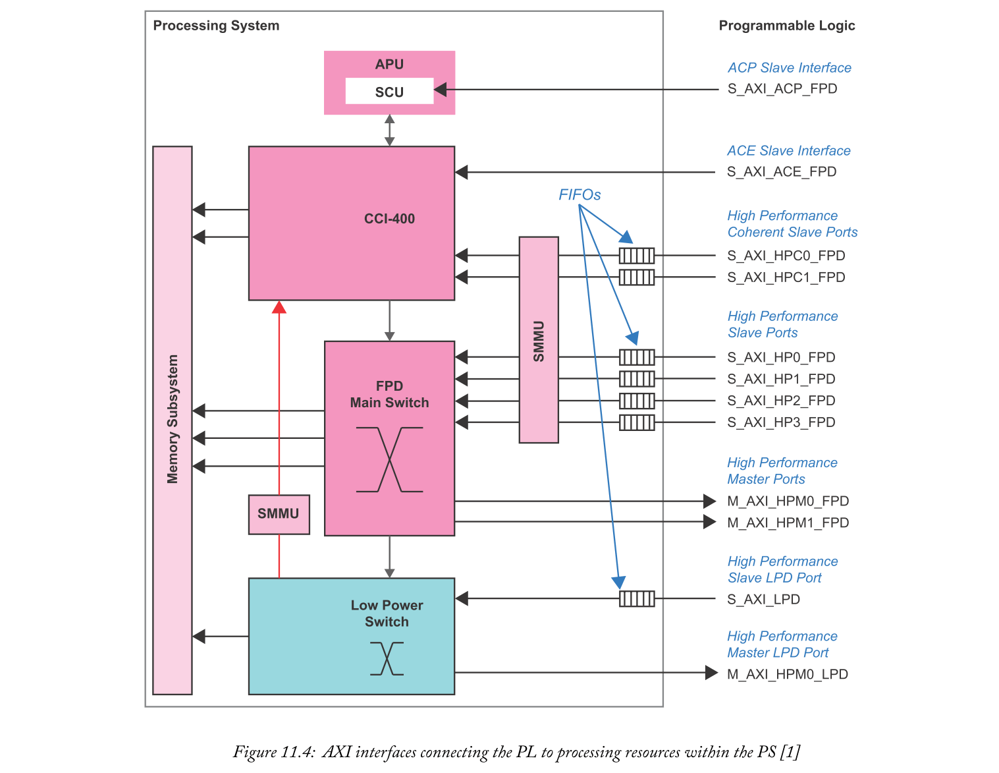

### 11.3.1  Snooping
在我们开始研究PS-PL AXI端口之前，有必要了解“监听”的概念以及为什么它是两个或更多处理单元之间一致性的基本技术。

在多处理器系统中，例如Zynq MPSoC，每个组成处理单元中都会有几个缓存，包括PL中的缓存。高速缓存一致性是指系统中的每个高速缓存都具有同步和共享信息的方法，因此它们每个都能够获得最新的数据。在软件环境中，检查以确保每个缓存都是最新的会产生额外的执行开销。相反，在每个高速缓存的物理接口上使用监听（通过Zynq MPSoC中的CCI-400），以便可以在硬件中执行高速缓存一致性。

监听的接口是观察由一个或多个连接的接口发送或接收的数据。需要进行监听，以便主设备可以观察其他设备的读取事务。如果监听主机在读取事务指定的地址处具有最新数据，则它可以向请求主设备提供该数据。该过程允许系统在其每个组成高速缓存之间保持一致。

### 11.3.2  AXI Coherency Extension (ACE) Interface
S_AXI_ACE_FPD端口使用ACE协议，如AMBA AXI和ACE协议规范[9]中所述。S_AXI_ACE_FPD是连接到PS中的CCI-400的PL主接口。它能够支持PS中的主设备和PL中的硬件模块之间的完全一致性（双向）。与AXI接口相比，完整的ACE协议使用五个额外的通道。三个通道用于监听，两个用于确认。ACE协议实现了独立处理元素的一致性，同时确保对同一存储器位置的写入是最新且正确的（无需软件）。

可以将完全一致的ACE接口连接到PL主硬件模块。此连接将允许PL主设备将其缓存存储在FPGA的专用存储器资源或逻辑结构中。然后可以使用ACE接口来保持与PS中的其他coherent masters以及PL中的conherent masters的coherent。特别是APU可以监听PL cached masters（使用S_AXI_ACP_FPD接口是不可能的）。由于S_AXI_ACE_FPD端口直接连接到CCI-400，因此它不通过SMMU。因此，它无法利用PS中的物理和虚拟地址映射。因此，它在**PS中没有虚拟化支持**。

#### ACE-Lite Interface
S_AXI_ACE_FPD端口也可以使用ACE-Lite协议[9]。ACE-Lite与AXI4类似，但不包含完整ACE引入的任何新的监听和确认通道。在读地址，写地址和读数据通道上存在附加信号。因此，ACE-Lite频道可以监听ACE Masters，但是，不能监听它们自己。ACE和ACE-Lite协议向后兼容AXI4，前提是禁用其他通道和信号。但是，Xilinx [1]不建议将AXI4协议用于S_AXI_ACE_FPD端口。

PL主设备在没有缓存时可以使用ACE-Lite协议，作为窥探其他主设备的连贯缓存的机制。这是单向一致性（也称为I / O一致性）的一个例子。PL主设备能够发布可以存储在其他Coherent主设备的高速缓存中的事务。在硬件系统中使用ACE-Lite之前需要考虑几点，详见[1]。

#### The Limitations of the ACE
完整的ACE和ACE-Lite协议有一些限制。这些总结如下：
- 对于使用ACE的完全双向一致性，当CCI监听PL Master时，事务必须限制为64字节的突发长度。
- 如果使用ACE-Lite，从PL到PS的长时间突发可能会导致APU MPCorepending。这是由于事务传播的路径（在CCI和DDR内存之间）。如果此路径长时间使用，则在事务完成之前，其他路径将无法访问内存。应限制突发长度（不大于16，如[1]中所述），以允许其他系统在其各自的DDR控制器端口上进行访问。

#### An ACE System Cache in the PL
在PL中实现系统缓存是将S_AXI_ACE_FPD端口用于实际应用程序的简单示例。通常在PL中实现AXI-ACE互连，以通过ACE接口将一个或多个coherent硬件加速器连接到DDR存储器。相反，所有ACE事务都使用系统缓存和硬件加速器之间的点对点接口发布到PL（由Block RAM构建）中的系统缓存。这消除了对AXI-ACE互连的需求并提高了APU性能，因为从系统缓存读取比从DDR内存读取更快。此外，DDR存储器/控制器的带宽最小化，因为减少了对这些系统的访问。

下面在图11.5中显示了说明此应用程序的图表。

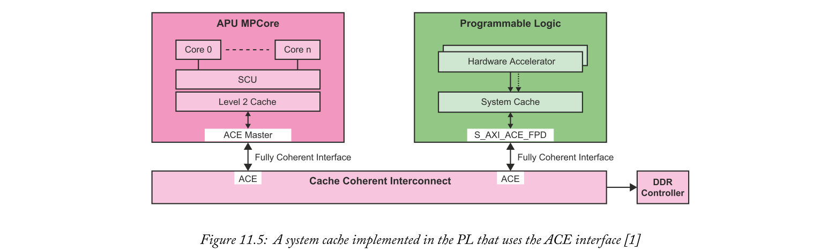

### 11.3.3  The AXI FIFO Interface
在研究高性能PS-PL AXI端口之前，我们将简要总结AXI FIFO接口。PL中的Master和PS DDR内存控制器通过高带宽，低延迟数据路径连接（通过高性能PS-PL AXI端口）。AXI FIFO接口（也称为AFI）包含在PS和PL之间的每个Slave高性能端口中。AFI提供高吞吐量通信，总结如下：
- 由于DDR内存控制器可能被提前占用于其他事务，因此PL中的硬件加速器的访问延迟可能会有很大差异。AFI有助于减少访问延迟的变化，并允许数据在PL [1]中的DDR内存和硬件加速器之间连续流动。
- 数据从PL写入高性能接口的时钟速率可能与PS中的时钟速率不同。AFI有助于在PS和PL时钟域之间传输数据时调整数据速率。
- 最后，AFI在AXI4标准（PL中）和AXI3标准（PS中）之间进行转换。

AFI有两个AXI端口，用于连接PL和PS中的互连。AFI的框图如图11.6所示。

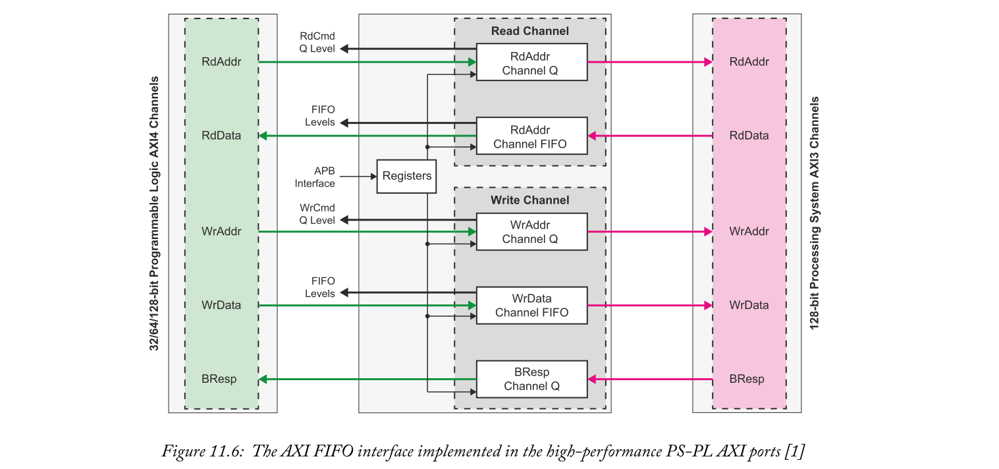

读者可以参考[1]获得有关AFI的更多信息。

### 11.3.4  PL-FPD AXI Masters
FPD有六个PL高性能（HP）AXI主接口，可以访问PS中的所有从设备。这些端口主要用于访问DDR内存，因为它们是高带宽通信路径。有四个HP AXI主设备表示为S_AXI_HPn_FPD，两个高性能Coherent（HPC）AXI主设备表示为S_AXI_HPCn_FPD（如下所述）。

每个S_AXI_HPn_FPD接口通过几个AMBA Switch连接到DDR存储器控制器。他们的联系概述如下：
- S_AXI_HP0_FPD: 该接口与PL中的DisplayPort Master共享DDR内存控制器上的端口。这些接口连接到DDR存储器控制器的**端口3**。
- S_AXI_HP{1,2}_FPD: 两个端口共享独占访问DDR内存控制器的**端口4**。这种排他性提供了与DDR内存的高吞吐量，低延迟通信。
- S_AXI_HP3_FPD: 该接口与FP-DMA控制器共享DDR存储器控制器上的端口5。

所有六个HP AXI主接口都通过PS中的SMMU。SMMU能够执行物理和虚拟地址转换。此连接允许每个接口支持APU的虚拟化（先前在第6.9节中讨论过）。

#### I/O Coherent AXI Masters
在PL和PS之间的六个高性能AXI4主端口中，有两个连接到CCI-400。这些是S_AXI_HPC0_FPD和S_AXI_HPC1_FPD端口，它们能够使用ACE-Lite接口实现I/O一致性。它们可用于在PL中的硬件加速器与APU的1级和2级高速缓存之间提供I/O一致性。

这些端口可以通过CCI访问DDR内存控制器。因此，与S_AXI_HPn_FPD端口固有的数据路径相比，这对DDR存储器具有更长的延迟。
### 11.3.5  PL-LPD AXI Master
一个高性能AXI Master连接在PL和LPD（S_AXI_LPD）之间。它能够低延迟访问OCM和紧耦合存储器（TCM）。当FPD断电时，该接口特别有用，因为它仍然能够为PL提供对LPD的高性能访问。不幸的是，由于互连的拓扑结构，该端口具有DDR控制器的长延迟。

该端口有两种操作模式; 物理和虚拟模式。在物理模式下，事务不通过SMMU块进行路由（如第273页的图11.4所示）。在虚拟模式下，事务通过SMMU块进行路由，以便将物理地址转换为虚拟地址。
事务在虚拟模式下采用的路由如下：PL，LPD，FPD（SMMU / CCI），然后到LPD。
### 11.3.6  PL-PS AXI Slaves
FPD和PL之间有两个高性能接口，以及一个在LPD和PL之间通信的高性能接口。这些如下：
- 在FPD中，PL有两个接口; M_AXI_HPM0_FPD和M_AXI_HPM1_FPD。这些接口适合于在PS中的FPD Master访问PL中的存储器，以便它们可以传输大量数据。
- 从LPD到PL（M_AXI_HM0_LPD）有一个高性能Slave接口。类似地，该接口适合于在PS中的LPD Masters（例如LP-DMA）访问PL中的存储器，以便它们可以传输大量数据。该接口具有低延迟，可在FPD断电时访问。请注意，由于路径[1]中的ID转换器，APU无法访问此接口。

### 11.3.7  Selecting a PL Interface
在本节中，我们总结了每个PS-PL AXI接口，并提供了一种为硬件系统设计选择接口的方法。PS-PL AXI接口在表11.2中详细说明了数据宽度和一致性。请注意，可以对具有多个数据宽度的接口进行编程，以使用所示的宽度。

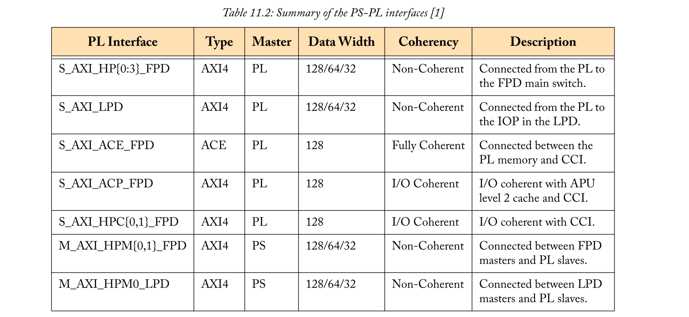

图11.7提供了一个流程图，详细说明了使用Zynq MPSoC为硬件系统设计选择PS-PL AXI接口的方法。包括使用每个接口的一些好处以及选择该接口时需要考虑的问题。

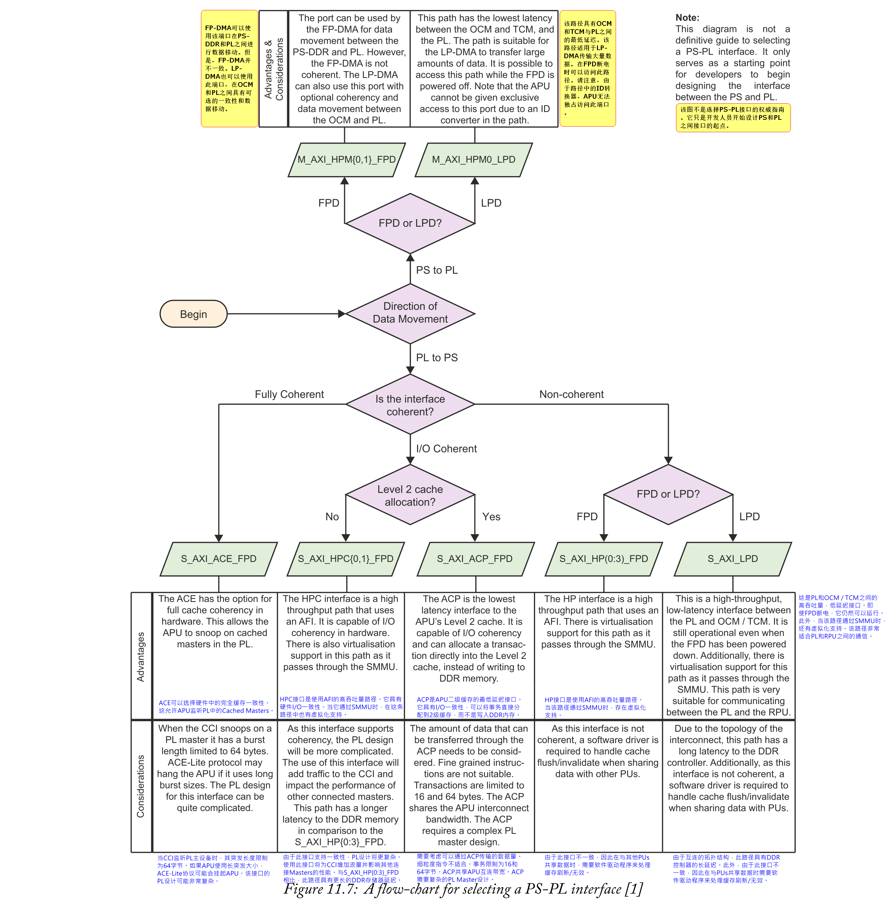

## 11.4  The Interrupt System
Zynq MPSoC器件是一个多样化的多处理器环境，其中中断是其处理单元之间的基本通信形式。以前，已经探讨了中断的主题：
- APU’s GIC-400
- RPU’s GIC PL390 
- PMU’s GIC proxy and local interrupt controller

在本节中，我们将进一步探讨Zynq MPSoC的中断系统架构，包括处理器间中断（IPI）和系统内使用的中断类型。

### 11.4.1  Interrupt System Overview
图11.8中显示了一个系统图，说明了Zynq MPSoC中断的概述。该图将帮助您可视化中断系统以及您可以找到的中断类型。

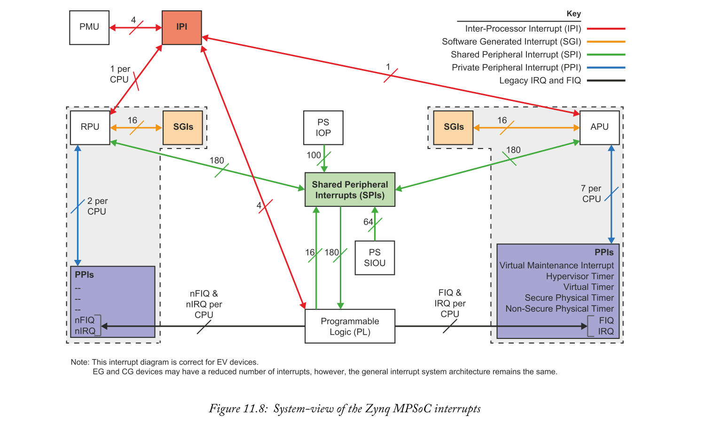

图11.8中没有显示每个GIC的细节使得图更清楚。此外，PMU的整个中断系统尚未显示，因为它非常大。PMU仅显示连接到IPI。有关PMU中断的更多信息，请参见第10.3.5节或[1]。

在研究中断类型之前，我们将简要讨论允许中断通过系统传播的物理机制。这被称为中断的敏感类型，其中Zynq MPSoC器件有两种方法; 边沿触发和电平敏感的中断传播。
- **边沿触发**表示当在中断信号上检测到上升沿或下降沿时，中断将被置位。中断保持pending/有效，直到由接收处理器[10]清零。
- 当中断信号电平有效时，**电平敏感**中断被置位。换句话说，如果中断为低电平有效或高电平有效，则必须分别将中断信号驱动为低电平或高电平才能置位。电平敏感中断的pending/active状态由断言中断信号的外设决定。如果外设停止断言中断，则它将从pending/active状态移除到非active状态。

### 11.4.2  Types of Interrupts
有四种类型的中断在图11.8所示的系统中使用（APU也支持虚拟和维护中断，如前面第6.7节所述）。这些是专用外设中断（PPI），共享外设中断（SPI），软件生成中断（SGI）和处理器间中断（IPI）。IPI详见第11.4.4节。其他描述如下。
#### Private Peripheral Interrupts
APU和RPU中的处理器都连接到它们自己的一组专用中断。这些被称为PPI。APU的PPI总结在表11.3中。

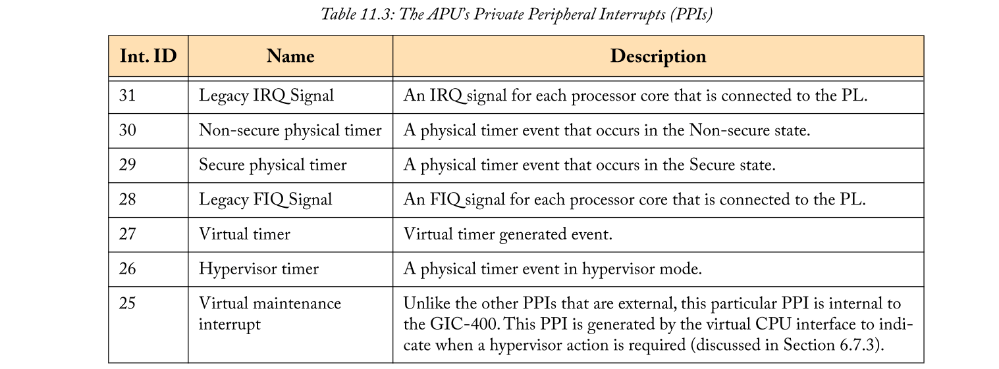

PPI的敏感类型是固定的。断言它们的方法（边沿触发或电平敏感）不能改变。由于敏感类型是固定的，因此必须对负责的GIC进行编程以适应所需的敏感类型。SDK设备驱动程序用于编程GIC [1]。

#### Shared Peripheral Interrupts
如图11.8所示，Zynq MPSoC的SPI网络密集。SPI可以由分配器路由到任何指定的处理器组合，并且源自Zynq MPSoC中的各种源。这些是有线中断，它们物理连接到APU和RPU GIC以及PL。

SPI源自Zynq MPSoC的PS中的IOP和SIOU模块。此外，PL还提供16个SPI。总共有180个SPI（在EV设备中）可供APU，RPU和PL访问。

每个SPI都具有固定的敏感类型，不能更改（PL中的SPI除外）。为了适应这种情况，必须使用SDK设备驱动程序对GIC进行相应的编程[1]。此外，SPI有关于每种敏感类型的规则。如果中断是电平敏感的，那么在确认之后，处理程序必须相应地清除中断。如果中断是边沿触发的，则产生中断的源必须确保边沿脉冲足够长。该要求在[1]中进一步描述。

Zynq MPSoC中的SPI列表可以在[1]及其相应的寄存器[11]中找到。

#### Software Generated Interrupts
SGI可以路由到任何指定的处理器组合，充当一个处理器中断APU或RPU中另一个（或自身）的机制。请注意，SGI不能用于中断Zynq MPSoC的处理系统，即Cortex-R5处理器无法使用SGI中断Cortex-A53处理器。处理器间中断用于此目的。每个MPCore的相应GIC没有一组SGI输入，因为它们是在GIC内部生成的。APU和RPU各自拥有自己的一组16个SGI，这些SGI是在遵守一定的流程生成的。

通过将SGI中断号写入PL390.enable_sgi_control寄存器（ICDSGIR），在**RPU中生成SGI**。写入该寄存器时，应指定目标处理器。通过向中断清除寄存器PL390.enable_sqi_pending（ICDICPR）中的相关位写入'1'或通过读取中断应答寄存器PL390.control_n_int_ack_n（ICCIAR）来清除SGI。

APU使用类似的方法。可以通过写入GICD_SGIR寄存器来生成SGI。和以前一样，SGI中断号应该与目标处理器一起发出。通过向GICD_SPENDSGIRn寄存器写入'1'，也可以将SGI设置为pending。可以通过写入相关的中断清除pending寄存器GICD_CPENDSGIRn [10]来清除SGI。

所有SGI都是边缘触发的。这表示当在中断信号上检测到上升沿时，中断将被置位。中断保持有效，直到使用上述方法清除。

### 11.4.3  Interrupt Prioritisation, States, and Handling
我们将简要介绍中断优先级系统，状态以及如何在Zynq MPSoC器件中处理它们。对于APU中的中断处理，此主题之前也在第6.7节中介绍过。
#### Interrupt Priority System
Zynq MPSoC中的所有GIC都使用中断优先级系统来确定应在所有其他中断之前发出哪些中断。该过程非常简单，所有中断请求（PPI，SPI和SGI）都分配了一个唯一的ID，以便中断控制器可以正确识别它们。在每个GIC内部，有一个中断分配器，它包含一个pending中断列表。分发器将首先选择具有最高优先级的中断，并将它们发送到目标处理器接口。然后是低优先级中断。

具有高优先级的中断将被分配较低的值。例如，优先级字段值0将具有比具有优先级字段值4的中断更高的优先级。如果中断具有相同的优先级，则分发者可以通过首先选择具有最低ID的中断来解决该问题。

SPI在处理方面有特殊情况。由于SPI可以针对任意数量的处理器，因此中断可能由多个处理器同时进行。如[1]中所述，逻辑确保只有一个处理器接受中断，另一个处理器将接收伪中断ID（1023或1022），或者由于时序导致下一个pending中断结束。
#### Interrupt States and Handling
中断的状态由目标处理器的相应GIC保持。有四种状态可以确定中断的断言级别。这些是inactive，pending，active，active和pending。

最初，中断可能处于inactive状态。这表示GIC或连接的处理资源未使用中断。如果中断控制器收到中断请求，则中断将进入pending状态。pending状态表示中断已在硬件中的某处声明，或由软件生成，并且它已被中断控制器接收并等待目标处理器进行服务。

一旦目标处理器确认了中断，中断状态可能会从pending状态变为inactive和pending状态。具有inactive和pending状态的中断是当前由处理器提供服务的中断，但也有来自完全相同源的另一个pending中断。**如果源连续发出多个中断，则会发生这种情况**。

如果没有连续中断，则在中断控制器接收到处理器确认时，pending的中断将被设置为active。active中断表示正在服务中并且尚未完成。一旦目标处理器处理完中断，它就会将其置于inactive状态。

有关处理中断的更多信息可以在[1]中找到。

### 11.4.4  The Inter-Processor Interrupt
Zynq MPSoC中IPI的目的是为处理器提供中断另一个的能力。当处理器需要另一个处理器来执行操作时，这很有用。在Zynq MPSoC中，有11个IPI通道分配如下： 
- 七个通道是可重新编程的，但默认为APU MPCore {0}，RPU0 {1}，RPU1 {2}和PL {7:10}（PL默认分配4个通道）。由于IPI已经分布在每个处理器的中断控制器之间，因此可以重新编程通道。
- 其余四个通道分配给PMU中断控制器。这些渠道被称为IPI {3：6}。它们可能不会被重新编程，因为它们是固定在硬件中的（即仅连接到PMU中断控制器）。PMU有关于IPI的特殊规则，如第11.4.4节所述。

IPI通道能够在连接的处理器之间**发送32字节的信息**。通道使用内存缓冲区来帮助支持IPI结构。消息缓冲区能够使用IPI通道在处理器之间存储请求和响应消息。只有8组内存缓冲区：7组可分配给使用IPI通道的任何处理器，并且一组缓冲区专用于PMU。注意，消息缓冲区有**8个请求缓冲区和8个响应缓冲区**，每组产生16个缓冲区。总的来说，共有128个消息缓冲区。

IPI通道架构如图11.9所示。所有连接的处理器可以相互通信。处理器也可以向自身发送中断。

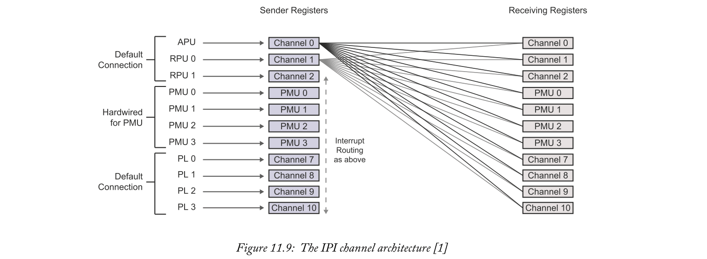

有关IPI通道，消息缓冲区和体系结构的更多信息，请参见[1]。

## 11.5  Memories
Zynq MPSoC具有多个存储器设备和接口。除了存在于PL和处理器缓存中的存储器之外，Zynq MPSoC还有两个值得探索的重要内置存储器。这些是连接到RPU的OCM和TCM。此外，还有DDR存储器控制器和外部（片外）存储器接口。由于之前在第7.3.1节中讨论了TCM，因此本节将讨论OCM和DDR存储器。

### 11.5.1  The Global Address Space

首先，我们将探讨有关Zynq MPSoC全局系统存储器映射的有趣主题。如图11.10所示，地址空间超过1TB并已实现，因此适用于32位处理器和64位处理器，例如RPU和APU MPCores（APU也可以32位运行模式）。此外，还提供了64位Masters列表。

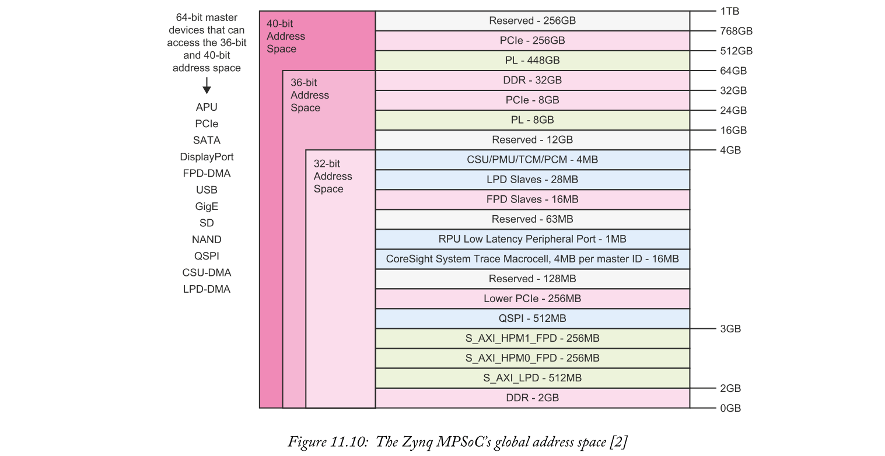

由于地址空间的配置方式，32位处理器能够与大多数Zynq MPSoC存储器，片上外设和其他处理元件进行通信。当将地址空间增加到36位时，64位主机可以优化对常用资源（如DDR存储器和PL）的访问。最后，40位地址空间允许大量访问Zynq MPSoC的处理资源。更多信息可以在[1]和[2]中找到。

### 11.5.2  On-Chip Memory
OCM包含256 KB的RAM，其他系统元件使用其128位AXI从端口访问。它的工作频率高达600 MHz，支持RPU MPCores的低延迟访问。它还使用ECC来检测多位错误，并从内存中的单bit错误中恢复。

读取和写入OCM时，请注意它使用256位的双倍宽度存储器。除了使用256位对齐的地址外，当读写操作是256位的倍数时，可以实现最大带宽。当请求的地址未对齐，或者对存储器的写入不是256位时，OCM将对存储器执行读-修改-写操作[1]。

OCM单元如图11.11所示。OCM与Zynq MPSoC其余部分之间的所有事务都通过OCM的Xilinx存储器保护单元（XMPU）。XMPU基于每个Master强制隔离内存区域。在OCM中，区域（也称为aperatures）与4KB对齐。因此，OCM被划分为64个4KB的块，每个块根据相关的主设备具有其自己的安全属性，并且还具有Arm TrustZone安全状态。先前在第8.3.2节中详细介绍了使用XMPU的内存保护。

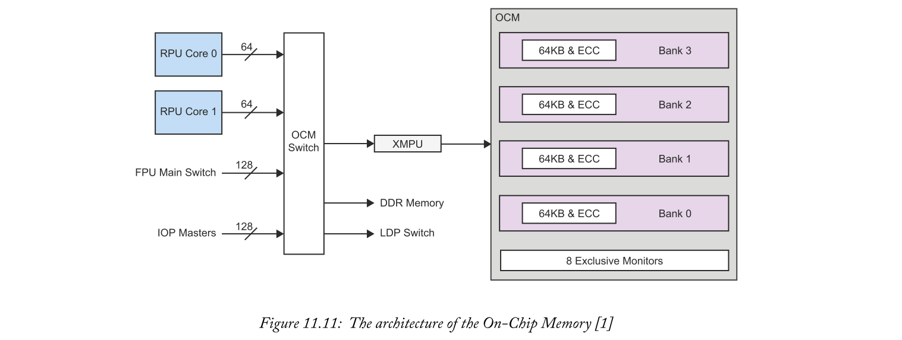

OCM通过OCM Switch被连接到RPU’s cores, FPD main switch, IOP masters, DDR memory, and LPD switch

如图11.11所示，OCM也分为4个Banks。每个Bank都有一个独立的电源岛，可由PMU上电和断电。当处于断电状态时，OCM可以被置于保持状态，如前面针对10.1.4节中的深度睡眠模式所讨论的那样。表11.4列出了表示每个存储体的地址范围的表。

有关OCM单元的配置，架构和操作的更多信息，请参见[1]。

### 11.5.3  DDR Memory Interface
由于有很多关于DDR内存控制器和接口的信息，我们将总结其基本架构。如图11.12所示，是多协议DDR系统及其组成功能块。这些是DDR PHY（物理层），DDR Controller, AXI to APB bridge, AXI Performance Monitor和XMPU块的六个实例。

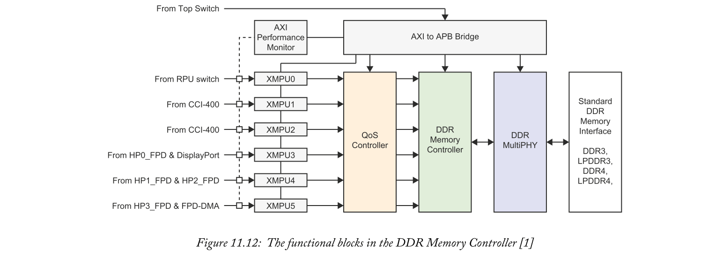

DDR系统使用AXI接口从其六个端口中的每个端口发出读写请求。存储器控制器负责在DDR PHY接口上发出这些命令，该接口物理连接到片外DDR存储器设备上的引脚。每个端口都有一条通过XMPU的路径用于内存保护（先前在第8.3.2节中讨论过）。还有一个用于发出配置命令的APB控制接口。最后，DDR支持32位和64位数据宽度模式的ECC存储器。

如图所示，DDR存储器系统使用6个AXI接口连接到Zynq MPSoC的互连。每个来自系统中的不同位置，并总结在表11.5中。请注意，端口3,4和5使用NIC-400 Switch共享（如第11.2.2节中所述）。

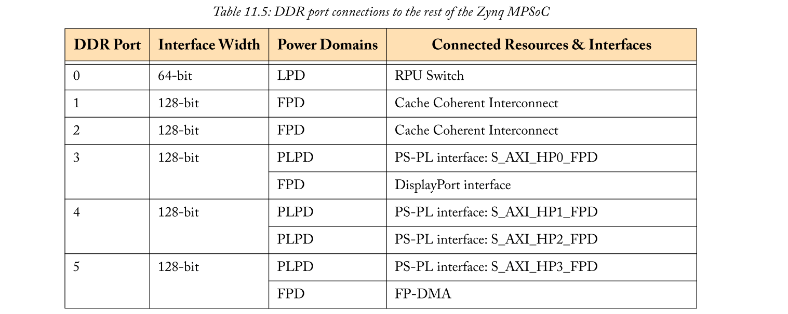

DDR内存系统能够与DDR3，DDR3L，LPDDR3，DDR4和LPDDR4存储器连接。读者可以参考[1]获得DDR存储器系统的示例存储器配置的完整列表。

DDR存储器具有一系列条件，必须满足这些条件才能连接到上面的兼容存储器类型列表。具体如下：
- 最大内存密度 - 最大总内存密度不得超过34 GB。
- 总数据宽度 - 与DDR系统兼容的总数据宽度可以是32位或64位。
- 组件内存密度 - 连接的内存密度必须为0.5,1,2,4,6,8,12,16或32GB。在LPDDR4中，不支持12,12和24 GB。
- Rank数 - 可连接的最大芯片数为2。
- Row和Bank地址位的数量 - Row地址位的数量由控制器限制在16。Banks地址位的数量为3。

本节总结了有关DDR存储系统的大部分信息。有关其配置，操作和体系结构的详细信息可以在[1]中找到。

## 11.6  Data Movement Fundamentals
到目前为止，我们已经探索了Zynq MPSoC的许多底层硬件基础架构。这包括其架构中存在的中断，存储器和PS-PL接口。我们现在将研究嵌入式系统设计的一个非常重要的方面。由于我们已经探索了Zynq MPSoC在其硬件系统中提供的大部分内容，我们现在可以讨论其组成处理元件和存储器之间的**数据移动**。

我们的讨论将首先详细介绍在嵌入式系统中移动数据的基本原则。通常在处理器，外围设备和存储器之间需要传输数据。关于SoC和MPSoC器件，数据可以在其内部处理元件之间移动，或者在芯片外移动到另一个系统资源。传输数据的主要目标对于所有应用程序保持不变; 数据应尽可能有效地移动。传**输数据的方法完全取决于应用程序约束，所涉及的数据类型以及系统的本机硬件**。决定如何移动数据是嵌入式系统设计人员遇到的**主要挑战**。

在本节的其余部分，我们将探讨Zynq MPSoC器件中的数据移动。最初，描述了可编程I / O和直接存储器访问（DMA）。然后，我们使用FP-DMA和LP-DMA控制器研究数据从PS到PL的移动。随后，我们将探讨使用AXI DMA将数据从PL传输到PS。

### 11.6.1  Direct Memory Access
可以通过使用处理器在软件中执行指令来实现传输数据。这种访问存储器的方法称为可编程I/O，如果相关处理器只需要传输少量数据，则该方法很有用。使用此方法进行大量数据传输效率很低，因为处理器将忙于访问内存并且无法执行任何其他任务。DMA对于专注于性能的嵌入式系统至关重要。一般概念很简单;一个具有DMA的硬件子系统，可以在最小的处理器支持下访问主系统内存。这些硬件子系统称为DMA控制器，它们减轻了处理器与访问主系统内存以进行大量数据传输相关的工作量。

图11.13提供了一个需要在Zynq MPSoC器件中移动数据的示例系统。该图的基本原理是从片外存储器读取数据并写入在PL中操作的硬件加速器。请注意，为清楚起见，已删除了某些系统元素。

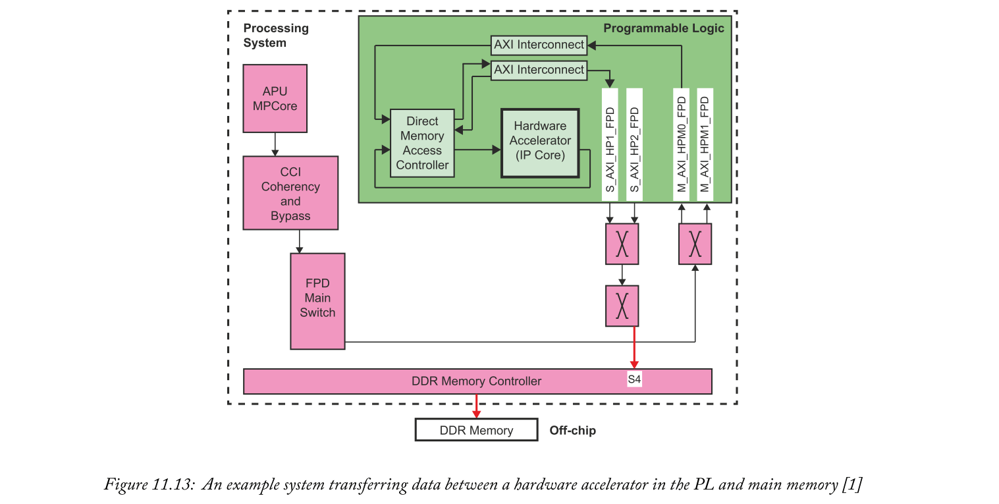

如图所示，PL包含DMA控制器，硬件加​​速器和两个AXI互连。DMA控制器的目的是通过AXI互连和高性能接口与DDR存储器通信。DMA控制器通过直接与硬件加速器的DDR存储器对话，最大限度地减少了APU MPCore所需的支持量。为了使DMA控制器开始运行，APU必须使用一组参数对其进行配置，以确定数据的传输方式。一旦APU配置了DMA控制器，它就可以自动运行而无需任何APU参与。如果需要，DMA控制器可以在APU完成其分配的任务或发生事件时中断APU。

图11.13所示的图表是许多可能的系统配置之一。例如，如果APU断电，RPU还可以在PL中配置DMA控制器。Zynq MPSoC器件中还有其他几个DMA控制器。LPD和FPD拥有自己的DMA控制器，用于在处理单元和系统存储器之间传输数据，同时支持最少的处理器。MIO中的外设（包括USB和以太网）具有自己的DMA控制器，用于将数据直接传输到存储器中。只要PS-PL AXI接口和DDR内存上有足够的FPGA逻辑资源和带宽，PL就可以拥有任意数量的DMA控制器。

FP-DMA和LP-DMA控制器以及AXI DMA控制器均支持两种操作模式。这些是简单的DMA模式和分散/聚集模式。每个描述如下。

#### Simple DMA Mode
简单DMA模式是使用DMA控制器的最简单方法（如果存在，则在此模式下不使用分散/收集接口）。负责的处理器核心将首先使用其控制接口配置DMA控制器。通过直接写入DMA寄存器来创建事务。参数是源和目标地址，以及访问模式（这些称为缓冲区描述符）。当处理器核心负责写入其使能寄存器时，DMA控制器将开始移动数据。传输完成后，DMA控制器会发出一个中断，如果启用，将产生中断输出。此中断非常有用，因为它可以连接到处理器，通知它事务已完成。

#### Scatter/Gather Mode
如前所述，DMA控制器具有支持分散/聚集模式的接口。此接口允许DMA控制器获取已预先加载到系统内存中的缓冲区描述符。缓冲区描述符是通常用于配置DMA控制器的参数集，如在简单DMA模式下。但是，DMA控制器可以在没有处理器核心的帮助下从系统存储器中获取这些描述符。由于DMA控制器正在管理自己的配置，因此处理器无需干预DMA管理。这最大化了系统性能。

有关分散/聚集模式的更多信息可以在[14]中找到。

### 11.6.2  The AXI Interconnect
之前如图11.13所示，Xilinx提供的AXI互连允许连接多个主从AXI4接口。通常，AXI4接口只能将一个主设备和一个从设备连接在一起。当需要多个连接时，可以使用AXI互连。

AXI互连对于将多个支持AXI的系统连接到PS-PL AXI接口非常有用，因为可用的物理端口数量有限。有关Xilinx提供的AXI互连IP的更多信息，请参见[13]。
### 11.6.3  DMA Controllers in the PS
我们现在将探讨PS中各自电源域中存在的FP-DMA和LP-DMA控制器的操作。这些是在Zynq MPSoC器件上传输大量数据的最有效方法（同时消除了处理器的参与）。PS中的每个DMA控制器几乎相同。两者都有8个独立通道用于与Slave客户端通信（每个通道一个设备），并支持未对齐传输，中断，简单DMA模式和分散/聚集模式。

FP-DMA和LP-DMA之间存在一些差异。FP-DMA连接到128位AXI总线并且不coherent。这是因为FP-DMA传输直接发送到DDR存储器控制器，并且不通过CCI。LP-DMA连接到64位AXI总线，可选择I/O Coherent，因为它可以通过CCI。如果使用FP-DMA需要一致性，则需要软件支持。

LP-DMA和FP-DMA之间的显着差异是公共缓冲区的大小。FPDMA具有4KB缓冲器，LP-DMA具有2KB缓冲器。

图11.14显示了PS DMA内部架构的图表。请注意，有8个DMA通道，一组读写接口和一个使用APB的控制接口。还示出了DMA控制器的输入和输出处的MUX和公共缓冲器。MUX的目的是允许每个DMA通道读取数据。类似地，公共缓冲区允许存储在事务中接收的数据，直到可以将其写入从属客户端。

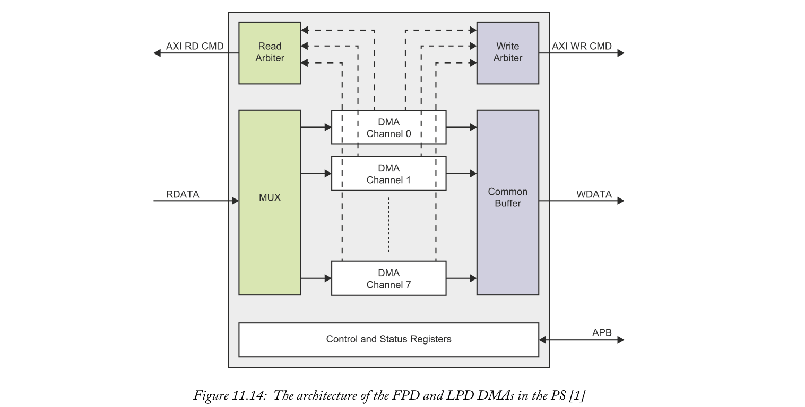

首先，FP-DMA和LP-DMA用于使用以下PS-PL AXI接口之一将大量数据传输到PL中：
- M_AXI_HPM（0,1）_FPD  - 这些接口适合FP-DMA控制器访问。
- M_AXI_HPM0_LPD  - 该接口适合LP-DMA控制器访问。

使用其中一个PS DMA传输数据将使用AXI读写仲裁器，如图11.14所示。

AXI读取仲裁器使用其控制接口（AXI RD CMD）从存储器读取缓冲区描述符（以指示下一个读取地址和访问模式）。一旦获得缓冲区描述符，RDATA接口可用于从PS或主系统存储器中的存储器资源读取数据。读取数据后，它将存储在公共缓冲区中。

AXI Write Arbiter使用其控制接口（AXI WR CMD）从存储器中获取缓冲区描述符。描述符用于通过上述PS-PL AXI接口之一将数据从公共缓冲区写入PL。要使上述每个事务都起作用，必须使用正确的访问模式和系统地址。

有关PS DMA的更多信息可以在[1]中找到。

### 11.6.4  Simple AXI Communication
在讨论PL中DMA控制器的操作之前，我们将首先描述PS和PL之间最基本的数据移动形式。

AXI4-Lite（先前在第3.5.1节中讨论过）是一种能够读写PL寄存器的接口标准。为了实现这种类型的通信，PL中的硬件加速器（也称为知识产权核心或IP核）必须具有AXI4-Lite接口[12]。IP核将包含一组可寻址寄存器，可使用AXI4-Lite接口读取和写入。数据被写入寄存器地址位置（使用可编程I/O）以更新其在PL中的值。

通常应使用AXI4-Lite将控制和状态信息传递给PL中的IP核。其原因在于它只能进行单拍传输（对于每个读/写指令，都有一个数据元素）。因此，该协议仅应用于与IP块寄存器的低带宽通信。正如您将在第11.6.5节中学到的，AXI4-Lite实际上是PS中运行的处理器如何配置PL中DMA控制器IP核。

图11.15提供了如何使用AXI4-Lite在Zynq MPSoC器件的PS和PL之间进行通信的说明。如图所示，该示例示出了使用AXI4-Lite连接APU MPCore和PL中的IP核。也可以使用其他M_AXI_HPM1_FPD端口或M_AXI_HPM0_LPD端口来实现连接。但请注意，由于第11.3.6节中描述的互连拓扑结构，APU不能专门访问M_AXI_HPM0_LPD端口。

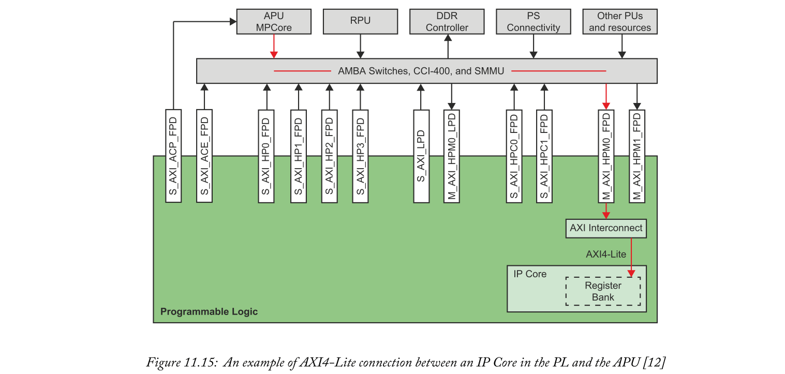

### 11.6.5  The AXI DMA

Xilinx提供AXI DMA IP内核[14]，因此PL中的硬件加速器可以与主系统内存进行通信。AXI DMA使用AXI Memory-Mapped和AXI Stream接口提供高带宽通信。图11.16显示了AXI DMA IP的主输入和输出端口图。

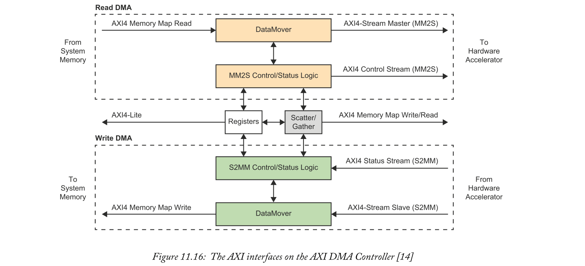

如图所示，AXI DMA IP核可在其架构内部拥有两个数据移动器。一个数据移动器用于从系统存储器读取（由橙色块显示）。另一个用于将数据写入系统内存（由绿色块显示）。每个通道彼此独立运行，并且可以在硬件系统开发期间禁用/启用

从系统存储器读取使用AXI4-Stream主接口，由Memory-Mapped to Stream（MM2S）表示。另一个接口AXI4控制流（MM2S）为目标IP核提供额外的应用和控制数据。类似地，写DMA使用AXI4-Stream Slave接口将数据写入系统存储器。该接口也可以表示为流到存储器映射（S2MM）。写DMA还具有附加接口AXI4状态流（S2MM），用于从目标IP核接收状态更新和应用数据。

AXI4-Lite接口提供与PS的低带宽通信，如第11.6.4节中所述。分散/聚集接口是可选的，并允许DMA获取已预先加载到系统内存中的描述符（在处理器内核的帮助最小的情况下）。然后，DMA可以为目标地址，事务长度和其他控制参数配置自身。

#### AXI DMA Connection in the Zynq MPSoC
PL中连接的AXI DMA示例如图11.17所示。此示例是使用Zynq MPSoC的许多可能系统配置之一。与DDR控制器通信时，AXI DMA使用AXI4 Memory-Mapped接口。AXI4 Memory-Mapped协议支持突发传输。这些类型的数据传输使用Master提供的地址和访问模式（确定后续数据的后续地址的模式或公式）。然后可以使用一个事务执行多个数据传输，因为访问模式用于确定要访问的下一个地址。此方法可减少数据传输的开销和延迟。

当将数据传递到目标IP核时，AXI DMA使用AXI4-Stream接口，允许无限制（无限）大小的突发传输。不需要地址通道，因为此协议应用于设备内源和目标之间的直接数据流。

图11.17所示的示例中有几个不同的连接。第一个是通过AXI互连在DMA和S_AXI_HP1_FPD端口之间建立连接。这是DMA读取和写入主系统内存的主要数据路径。我们已将其连接到PL的高性能端口，因此它具有到DDR控制器的高吞吐量路径。特别是，使用第一个高性能端口（HP1_FPD），因为它与DDR控制器的端口4具有独占连接。

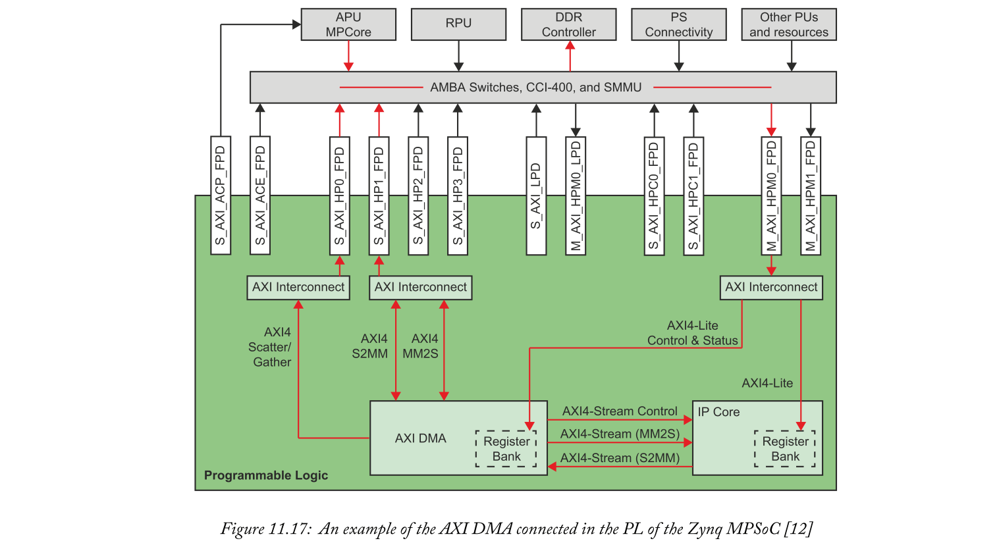

可选的分散/聚集端口已连接到S_AXI_HP0_FPD，作为从主存储器获取缓冲区描述符的方法。AXI4-Lite控制和状态接口连接到M_AXI_HPM0_FPD，用于与PS中的Arm处理器通信。此连接允许Arm处理器配置AXI DMA并接收状态信息。

从系统存储器读取时，DMA使用AXI4 MM2S通道，也称为Memory-Mapped to Stream。检索到的数据被传送到AXI4-Stream（MM2S）通道以发送到IP核。IP Core将使用AXI4-Stream（S2MM）通道（也称为Stream to Memory-Mapped）将任何数据发送回DMA控制器。写入系统存储器时，DMA控制器将使用AXI4 S2MM通道。
### 11.6.6  The AXI Video DMA
AXI Video DMA（VDMA）IP核[15]可以在DDR存储器和PL之间提供高性能的视频帧数据传输。VDMA类似于AXI DMA（在第294页的第11.6.5节中描述）。它具有控制和状态逻辑，数据移动块和AXI4-Lite寄存器，如图11.18所示。此外，还有一个称为行缓冲区的新块。这是一个异步缓冲区，用于在将像素数据写入AXI4 Memory-Mapped接口或AXI4-Stream接口之前保持像素数据。

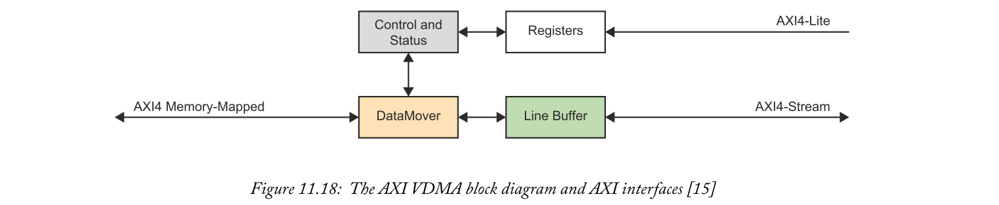

与AXI DMA类似，Xilinx提供的VDMA IP核可以承载两个数据移动器;一个用于从系统内存读取，另一个用于写入系统内存。每个都采用图11.18所示的结构，并有自己的AXI4 Memory-Mapped接口，用于与DDR存储器通信，以及AXI4-Stream接口，用于将数据传输到PL。

使用VDMA IP而不是AXI DMA的原因是它已经过优化，可以在系统内存和PL之间传输视频数据[15]。VDMA能够有效地对视频帧数据执行DMA操作，并且可以在读写通道上异步传输视频帧。当PL需要缓冲不同时钟域的视频数据或等待另一个任务完成时，这尤其适用。

VDMA可以在64位地址空间上支持最多32个帧缓冲区。有一个数据重新排列引擎（DRE）用于未对齐的内存访问。DRE允许帧缓冲区从内存中的任何地址开始。

Zynq MPSoC器件中的帧缓冲器示例如图11.19所示。该示例的一般前提是使用AXI VDMA IP核缓冲传入的高清晰度多媒体接口（HDMI）信号的视频帧。一旦视频帧被缓冲，它们就从系统存储器中读出并写入AXI-Stream（MM2S）信道。

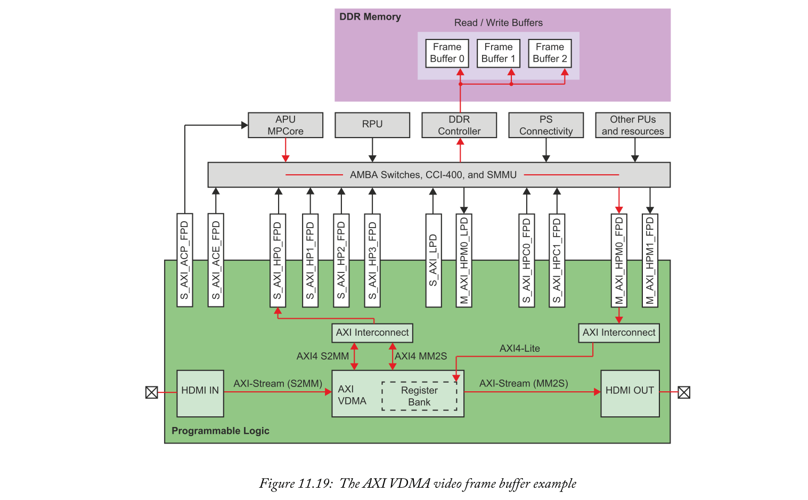

请注意，上面的示例仅使用三个帧缓冲区。AXI VDMA提供了一种通过 Genlock synchronisation同步读取和写入视频帧的方法。帧同步是必要的，因为视频帧数据可以比消耗更快或更慢地产生。 Genlock synchronisation可防止通道同时访问帧。一旦每个通道完成对其帧缓冲区的操作，它们就可以交换。VDMA的每个Channel可以在该上下文中作为主设备或从设备操作，分别引导或跟随另一个Channel。

总共有四种Genlock和Dynamic Genlock同步模式，可用于配置VDMA的每个通道。上述模式下的每个Channel对帧同步有不同的影响。有关VDMA及其Genlock synchronisation模式的更多信息，请参见[15]。

## 11.7  Chapter Review
我们现在已经到本章的末尾，并彻底探讨了Zynq MPSoC的硬件基础架构和数据移动技术。其中包括对Zynq MPSoC接口和信号，互连，中断和存储器的详细分析。发现这些系统元件中的每一个对于在整个设备中移动数据以及在处理单元和资源之间进行通信是必不可少的。

本章特别探讨了PS-PL AXI接口，并提供了一个简单的流程图，以帮助系统开发人员确定最适合其设计的接口。还详细介绍了Zynq MPSoC中断系统，包括用于设备中处理单元之间通信的处理器间中断。

最后，研究了整个Zynq MPSoC器件的数据移动。直接内存访问控制器可以在不涉及Arm处理器的情况下移动大量数据;允许相关的Arm处理器继续执行其自己的任务，直到数据传输完毕。描述了PS DMA，PL AXI DMA和PL AXI VDMA。特别是PL DMA控制器在FPGA逻辑结构中提供了示例连接。
