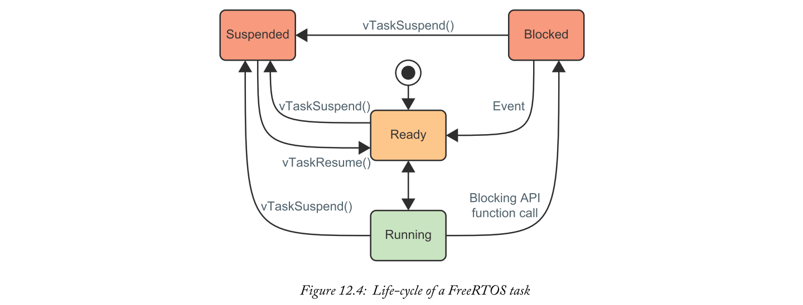
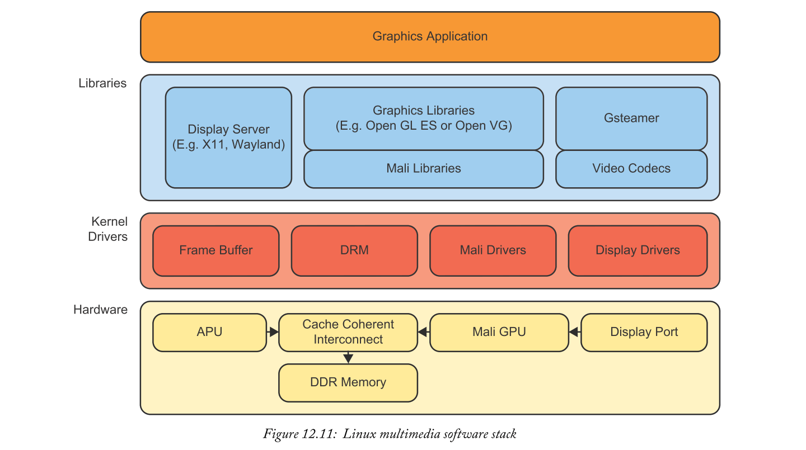

# Chapter 12 Software Stacks
with Josh Goldsmith, University of Strathclyde

本章介绍了Zynq MPSoC可用的一些主要软件堆栈。术语“软件堆栈”是指一组基础软件，开发人员可以使用它来支持他们自己的应用程序。即使您不熟悉该术语，您也可能以前使用过软件堆栈，例如Xilinx裸机堆栈甚至Arduino平台用于业余爱好者项目。

考虑编程整个嵌入式系统基本原则。在触摸应用程序之前，需要启动代码（可能在汇编中），外围设备（如SD卡）的驱动程序，然后支持文件系统。软件堆栈的目的是实现公共基本功能并将其从应用程序开发人员中抽象出来。使用预先存在的软件堆栈的优点应该是明确的;每个开发人员都不需要创建自己的引导加载程序，驱动程序和操作系统 - 大多数开发人员添加的值都在堆栈顶部的应用程序中。毕竟，如果我们进一步编程，那就是站在巨人的肩膀上。

本章的其余部分将概述Xilinx支持的Zynq MPSoC软件堆栈，并提供各自优势的指导。尽管缺乏明确的“one size fits all一刀切”解决方案，但这里的目标是尽可能地推动开发商走上阻力最小的道路。

## 12.1  Bare-Metal Software Stack
Xilinx直接提供裸机软件堆栈，并作为Xilinx SDK工具的一部分进行分发。它提供了一组低级驱动程序和库，用于基本功能，包括I/O和硬件功能访问[1]。简单性是使裸机堆栈与备选方案区别开来的主要因素。它是一个非常简单的单线程环境（即没有使用多核的直接方式）。这使得它成为最简单的启动和运行堆栈，尤其是在使用Xilinx SDK时。如果其他堆栈的独特功能对应用程序没有价值，裸机通常会提供最简单的配置和最低的开销。虽然这对于Zynq-7000设备来说更为可行，但对于完整的Zynq MPSoC设计来说，它是不太可能的选择，因为很难充分利用硬件，因为协调核心内部（或之间）的复杂性 APU和RPU。但是，它可以是一个非常有用的平台，用于制作在更宽的Zynq MPSoC系统的单个核心上运行的更小的独立应用程序。

### 12.1.1  What does Bare-Metal give us?
裸机软件堆栈提供简单的单线程环境，为Zynq MPSoC硬件提供一些方便的支持。该支持包括处理系统中的所有外围设备和可用可编程逻辑IP的子集。

裸机堆栈的组成如图12.1所示。有一个明确的分层结构，导致术语软件堆栈。与本章介绍的所有堆栈一样，底层代表Zynq MPSoC硬件。每个后续层提供一些附加的抽象级别 - 例如驱动程序抽象出硬件实现，而库通常抽象出驱动程序实现。


更正式地说，每一层组成如下：
- **Standalone驱动程序**：支持所有PS外围设备，可选PL外围设备以及在APU，RPU和PMU内使用处理器的例程。以处理器为中心的功能包括配置中断和高速缓存。“standalone”意味着在没有附加操作系统的情况下使用。
- **Libraries**：为网络，文件系统，加密以及C标准库（libc和libm）提供更高级别的接口。
- **User application**: 用户的自定义应用程序或提供的示例之一（包括“hello world”，第一阶段引导加载程序和测试）

通常，堆栈的目的是提供从一层到下一层的抽象。在这种情况下，开发人员只需要直接了解其应用程序下面的层。请注意，图12.1显示了应用程序还直接与独立驱动程序通信，而不是通过Library层。这是因为不是每个驱动程序都有一个相应的库 - 一些驱动程序不够复杂，不值得另一层抽象。以下部分概述了可用的库和驱动程序。有关完整的详细信息，读者可参考[3]了解库，[4]参考独立驱动程序。

### 12.1.2  C Standard Libraries
“C标准库”定义了一些核心C例程，大多数开发人员将不依赖于这些例程。这些包括例如malloc（）和fopen（）的例程。该功能由ANSI C标准定义，但实现将取决于目标平台。

Zynq MPSoC的C标准库基于Newlib库。这是一个针对嵌入式系统的实现，可以在任何地方找到，从商业工具到游戏控制台的业余爱好者软件。两套主要模块是：
- **libc**提供标准C，例如来自stdio和stdlib的例程。
- **libm**提供标准的数学例程。除了Newlib实现之外，这还得到了增强。

构成这些库的所有头文件都与Xilinx SDK一起提供（并在[2]处在线提供），但是仍然很难通过文件名确切地确定您需要哪一个。作为参考，表12.1提供了一些libc头文件的摘要。


同样，表12.2总结了libm提供的功能，按功能类型分组。所有条目都在math.h中定义。


### 12.1.3  Standalone Libraries
除了C标准库之外，裸机堆栈还提供了一组中间件库，以便于网络，文件系统，加密和平台管理。它们位于独立驱动程序之上，提供更高级别的抽象。表12.3概述了可用的库。


这些中间件库随Xilinx SDK提供，但也可以直接从[5]访问。

### 12.1.4  Standalone Drivers
Standalone驱动程序位于Zynq MPSoC硬件正上方的层中。该支持涵盖了处理系统中嵌入的所有外设，以及可编程逻辑中可选的IP选项。同样，完整的详细信息最好在Xilinx SDK的安装中找到。没有这些工具，可以通过[5]（embeddedsw / XilinxProcessorIPLib / drivers /）上的git存储库检查相同的文件 - 但是在直接浏览git存储库时确保驱动程序版本与任何已安装的工具相匹配。

### 12.1.5  How can we use it?
开始使用裸机堆栈的最简单方法是使用Xilinx SDK。可以通过板级支持包（BSP）中的设置选择驱动程序和库。可以在SDK中查看每个驱动程序的文档，并可以导入示例代码。如前所述，所有的源代码都可以在[5]在线获得，并且可以在具有合适的交叉编译器的替代环境中使用。但是，SDK是推荐的流程。

使用裸机软件堆栈的设计流程如图12.2所示。可以通过自定义Vivado项目或预定义示例导入硬件描述。然后，SDK可以基于硬件描述生成BSP。对于裸机，这将包括独立的驱动程序和库。用户代码作为单独的应用程序项目存在，它引用了BSP。在使用SDK生成可引导映像以便在板上独立使用之前，可以迭代地执行调试和分析。

SDK为每个Xilinx库和驱动程序提供了对示例应用程序和Doxygen文档的集成访问，以尽可能轻松地开始使用裸机堆栈。


## 12.2  FreeRTOS Software Stack
FreeRTOS是一种流行的开源实时操作系统（RTOS）。在编写代码来处理单个实时任务时，使用裸机堆栈将是一个明智的选择。裸机堆栈在单线程环境中提供了一组基本驱动程序。然而，真实系统通常比单个简单功能具有更复杂的要求。我们经常希望运行多个可以交互和同步的概念性任务，以构建更大，更有用的系统（多任务）。这就是FreeRTOS的用武之地。

### What does FreeRTOS give us?
FreeRTOS提供了一个多任务（或“线程”）可以协作，共享处理器和其他资源的环境。它旨在最大限度地降低执行和复杂性方面的开销。这是一个重要的目标，因为实时系统需要非常仔细的分析，以确保安全关键代码能够满足其最后期限。少数FreeRTOS核心功能提供了大部分环境。这些重点是优先级，调度，运行任务（所有其他操作系统的主要关注点！），以及任务之间的同步。基本的FreeRTOS内核包括：
- task.c and task.h: 任务处理代码
- queue.c and queue.h: 用于在任务之间传递消息的简单队列系统。这也用于任务之间的同步。
- list.c and list.h: task.c和queue.c使用的双向链表实现。
- port.c, portASM.S, and portmacro.h: 为FreeRTOS内核的其余部分提供与处理器无关的接口。这些组成了FreeRTOS的硬件相关部分，特定于每个支持的处理器体系结构。

这里缺少典型操作系统功能的一个主要方面 - 设备驱动程序。

FreeRTOS中唯一依赖硬件的部分是portmacro.h和friends中的处理器特定代码。我们可以自由使用我们认为合适的任何standalone驱动程序集。这里通常使用来自裸机堆栈的独立驱动程序集（参见第12.1章）。它们非常方便，并与Xilinx工具链完美集成。由于我们提供自己的一组驱动程序，许多人会认为FreeRTOS更像是一个“线程库”，而不是一个完整的操作系统。尽管如此，让我们不要把它降到最低 -  FreeRTOS足以让一个相当复杂的系统运行起来。

可以认为FreeRTOS堆栈如图12.3所示。它与Standalone的Xilinx驱动程序相邻。FreeRTOS内核关注任务的执行，而驱动程序知道如何与更大的系统进行通信。虽然我们仍然可以使用Xilinx提供的独立驱动程序，但仍存在一些限制。这些驱动程序不了解FreeRTOS内核，也不使用其同步或互斥功能。因此，每个设备只能由单个线程访问，以避免同步问题


### 12.2.2  Tasks
我们使用术语“任务”来描述更大系统的不同职责。从FreeRTOS的来看，任务是单个C函数。功能执行的当前状态可以由任务控制块（TCB）表示。部分硬件相关代码允许FreeRTOS将当前任务的状态（寄存器值，堆栈信息等）保存到TCB，并从另一个TCB加载另一个任务的状态。这种任务中断使FreeRTOS调度程序可以在任务之间进行交换，从而实现近乎同时执行的表象。

FreeRTOS还将为每个任务分配状态。可以一次将4种状态中的一种分配给任务：

- Running：这是当前正在执行的任务。FreeRTOS可以使用的处理核心只能运行任意数量的任务。
- Ready：就绪任务包括准备执行但当前未执行的所有任务。在调度程序“tick”时，选择最高优先级的就绪任务以运行。
- Blocked：在等待事件时可以“阻止”任务，例如在队列或外部硬件事件上接收新消息。调度程序知道被阻止的任务没有任何有用的工作要做，并且不会为任何被阻塞的任务提供CPU时间。
- Suspended：已暂停的任务与已阻止的任务类似，除非已使用vTaskSuspend（）函数将其明确排除在就绪状态之外。没有事件会将挂起的任务返回到就绪状态 - 需要显式调用vTaskResume（）。

任务的生命周期可以被认为是状态机，在某些事件/函数调用时遍历这些不同的状态。



调度程序可以在任务之间切换以共享CPU时间。这由用户定义的任务优先级指导。但是，很少有所有任务彼此孤立地运行。这引导我们了解FreeRTOS内核中的同步功能。

### 12.2.3  Inter-task Synchronisation

FreeRTOS支持一系列任务间同步和消息传递功能。这些对于正确实现任务之间的任何类型的依赖性是必要的 - 包括事件通知，传递数据/消息以及确保对共享资源的独占访问。传统上，这些功能都是从消息队列功能派生的，因此我们将首先回顾FreeRTOS队列。

通常，FreeRTOS队列配置为保存有限数量的特定数据类型。消息被添加到队列的末尾，并以“先进先出”（FIFO）方式从前面删除。消息始终复制（而不是通过引用）到队列中。内存管理由FreeRTOS处理 - 无需手动创建缓冲区。这个API很简单，也许是出现限制性的。如果我们想发送可变大小的消息怎么办？如果我们需要一个队列来处理多种不同类型的消息怎么办？或者，如果我们不能让FreeRTOS复制一条大信息怎么办？

为了避免向队列添加消息的“副本”方法，我们可以简单地配置队列以保存指向实际数据的指针。现在，指针被复制但完整数据却没有。类似地，**通过传递具有两个字段的结构，队列可以接受许多不同类型的消息。一个字段可以标识消息的类型，另一个字段可以保存（或指向）真实数据**。这两种技术都可以在FreeRTOS + UDP IP堆栈中得到很好的演示[6]。特别是，查看xNetworkEventQueue，如图12.5所示。


xNetworkEventQueue队列使用空间实例化，用于固定数量的xIPStackEvent_t结构。**此结构定义一个字段以标识事件的类型，另一个字段定义为事件数据的指针**。请注意，将指针传递给数据可以避免复制整个数据集的开销（尽管现在由我们来确保数据保持在有效状态！）并且需要处理所有消息的需要 相同的大小。可变大小在这里非常重要，因为示例DHCP事件可能具有相当小的有效载荷而“StackTx”事件（用户请求发送数据）可能要大得多。

消息传递很重要，但它不是队列提供的唯一功能。它们还提供同步。考虑如何为两个任务编写代码：一个任务向队列写入消息，另一个任务消耗消息。这实际上构成了一个称为“生产者-消费者问题”的经典计算机科学问题的基础。我们需要处理两种特殊情况：
- 消费者在队列已空时从队列中读取信息
- 生产者在队列已满时写入队列

一个简单的方法是当队列为空或满时，让任务“busy wait”。繁忙的等待本质上是一个循环，除了检查队列的状态外，它不做任何有用的工作。这会浪费大量的CPU时间！Freertos中的实现通过利用阻塞和恢复任务的能力来更有效地工作，这使得我们能够避免繁忙的等待。如果生产者试图写入一个完整的队列，或者消费者试图从一个空队列中读取，那么该任务将被内核阻塞，并且不会占用更多的CPU时间。当队列变为“可用”时（消费者不为空，生产者不为满），Freertos将恢复该任务。例如，这意味着处理某种类型的样本的任务可以运行，直到耗尽所有可用的样本，然后在下一个样本到达之前不使用不必要的CPU时间。还必须注意的是，Freertos实现并不限制可以作为给定队列的使用者或生产者的唯一任务的数量。这使得实现更加复杂，但作为应用程序开发人员，我们不必担心这一点！

对队列实现的数据同步也进行了扩展，以便在没有传递数据的情况下提供进程同步，即信号量和互斥量。这可以确保多个任务可以相互衔接，或者安全地共享一个共享资源。有关这些同步技术的更多信息，请参阅[7]和[8]。除了基于队列的功能外，Freertos V8.2在2015年推出了一种新的轻量级“任务通知”，提供了一种更为严格的同步方式，速度可提高45%[9]。

从第一个原则来看，同步功能确实很难正确实现。任务之间的竞争条件很容易被忽视，并且在灾难发生之前往往无法被发现。这是使用成熟项目（如Freertos）的主要原因之一。正如Linus定律所说：“只要有足够的眼球，所有的虫子都是浅的”[11]。

### 12.2.4  Other Utilities
Freertos确实为我们提供了一些超出多任务核心目标的实用程序。这些包括软件计时器和内存管理。计时器机制允许我们在将来的单个指定时间调用函数（一次调用），或者定期调用函数（自动重新加载）。执行仍在计时器服务任务中，因此不应尝试阻止。例如，调用vTaskDelay（）或使用非零块时间访问队列将导致问题。完整的详细信息可以在Freertos网站[10]上找到，并在发布的源代码中找到。

从FreertosV9.0中，可以使用用户提供的内存地址创建任务、队列、信号量、互斥锁等对象。这是一种静态内存分配形式。这种方法给了程序员最大的控制权。数据的确切位置在编译时就知道了，RAM footprint在编译时也知道了，不需要用动态分配来处理故障事件。然而，典型的方法是使用Freertos自己的自定义动态堆分配。特殊实现（而不是标准libc malloc（）和free（）函数）的动机是我们需要对实时应用程序保证确定。对malloc（）的调用可能需要不同的时间，这将使满足保证的最后期限变得困难。

为了在性能和功能集之间进行权衡，Freertos提供了5个不同的内存管理模块：
- heap_1：最简单的方案。内存可以分配，但不能释放。
- heap_2：允许释放内存，但不会重新连接相邻的可用区域。
- heap_3：只需包装标准malloc（）和free（），以确保它们在Freertos多任务环境中安全工作
- heap_4：允许连接相邻的释放区域以及放置在绝对地址。
- heap_5：允许跨多个非连续区域的分配。

所有这些特性都在随Freertos源代码提供的演示中演示。浏览到freertos/demo/common/minimal文件夹，了解如何在实践中使用任务、队列、信号量、互斥体、计时器等。

### 12.2.5  How can we use it?
使用freertos启动和运行的最简单方法是通过xilinx sdk。在创建新的板支持包时，我们可以选择Freertos，而不是裸机。这同时支持Cortex-A53和Cortex-R5处理器。或者，可以从[12]下载完整的源代码。这与两组处理器的演示应用程序以及显示如何使用与硬件无关的Freertos功能的单独演示文件一起提供。

就设计流程而言，大部分步骤与裸机堆栈相同（见图12.2）。唯一的区别是我们如何设计和实现用户应用程序本身。Freertos提供的基于任务的方法让我们可以采用一种更合理的自上而下的方法来编写软件。我们可以识别系统中逻辑上不同的部分，然后在接近隔离的情况下实现它们。

通常，这可以直接与高级系统框图相关。使用任务也会带来一些新的挑战。例如，必须仔细考虑分配给每个任务的优先级。如果做得不好，一些重要的任务可能会完全缺乏资源，甚至会导致系统的其他部分也随之瘫痪。在将系统划分为任务时，我们不应该只考虑功能，还应该考虑优先级，以及任务间同步。这样的问题可能会使将系统划分为任务成为一个挑战——但我们不要忘记固有的好处！

如果使用freertos，需要记住zynq mpsoc的一些特定点：
- 必须启用处理系统的三定时器计数器0（ttc0）。这驱动了Freertos调度器的“滴答”——本质上是所有多处理决策的心跳。
- 必须配置任何自定义中断处理程序，而不覆盖（或被freertos配置覆盖）。启动计划程序后，必须在Freertos的现有结构中设置自定义处理程序。这在IntQueueTimer.c中由zynq mpsoc示例代码[12]演示。

在查看这些freertos示例时，独特的函数命名约定可能会脱颖而出。这些函数和变量名遵循Freertos样式指南[13]。强烈建议阅读本样式指南，因为名称传达了大量信息，包括每个函数返回的内容、定义的位置以及它的作用域！例如，vTaskStartScheduler（）函数应从左向右读取为：“此函数返回void，在task.c中定义，其任务是启动调度程序。

从法律的角度来看，Freertos对于商业应用非常有吸引力——它最近已经根据麻省理工学院的许可证发布了[14]。与此同时，亚马逊网络服务（AmazonWebServices，AWS）也成为了该项目的管理者，这表明它不可能很快消失

## 12.3  Linux Software Stack
Linux是一种成熟的操作系统，目前正得到广泛的应用。它支持许多不同的架构，从炊具到超级计算机…Zynq MPSOC介于两者之间。对于大多数使用APU的开发人员来说，Linux可能是首选的平台，除非应用程序对不同的堆栈有特定的需求。

在我们进一步具体地使用Linux之前，请考虑一下为什么在zynq mpsoc上使用“完整”的操作系统是有用的。应用程序开发人员的一个主要优势是提供了高级别的抽象——应用程序开发人员将程序编程为一组操作系统服务API，并且大多数情况下可以忽略实现细节。这些服务包括文件系统、网络、进程间通信等等。操作系统提供的抽象还促进了系统内部的模块化。例如，如果我们编程到网络API，代码将完全与网络实现分离，网络实现可以是以太网、WiFi，甚至是一些定制的无线电接口。广泛使用的操作系统的另一个优点是代码重用。如果我们选择一个足够流行的操作系统，比如Linux，我们可以从大量现有项目中获益！这对于Linux尤其适用，因为它跨越了嵌入式市场的一大块，许多桌面用户，甚至服务器。在真正的社区努力中，这些Linux用户中的任何一个都可以为软件生态系统做出贡献。如果有人为该操作系统编写了一个好的Web服务器应用程序（不一定要考虑嵌入式应用程序），这可以节省我们的开发时间。如果有人为该操作系统编写了一个好的图形库，这可以节省开发时间，等等。

**使用大型操作系统的缺点是操作系统提供的抽象的另一面。由于整个系统更加复杂，对性能进行严格的保证就更加困难（但并非不可能）**。系统的每个部分都会对其他部分的性能产生细微的影响（可用的CPU时间，甚至是对缓存的影响）。然而，这不必成为Zynq MPSOC设备的交易破坏者。如第13章所讨论的，我们可以运行多个软件栈，每个软件栈处理非常不同的需求。一种常见的配置是运行在所有Cortex-A53内核上的Linux，以及运行在每个Cortex-R5内核上的更敏感的实时代码。

总而言之，使用更大操作系统的动机归根结底就是生产力——然后我们可以专注于产品的附加值，而不是重新设计轮子。但问题仍然存在：为什么Linux特别重要，哪种变体是最好的，为什么不采用商业替代品？这可能是一个结合了设计和商业考虑的艰难选择。但是，需要考虑的一些初始点是：
- Linux在“啤酒”（成本）和“言论”（自由）两个方面都是免费的。其他开放源代码替代方案也可用。商业替代品在任何意义上都不是免费的。
- Linux在许多开发人员的桌面上非常流行。这通过个人偏好和经验延续到嵌入式平台上，因为许多技能可以在域之间直接转移。
- Linux周围的软件社区接受开源许可证。这使开发人员有权获取现有的软件项目，并根据自己的需要对其进行调整（通常有关于共享任何修改的规定）。在使用非x86体系结构（如Zynq MPSOC中的ARM内核）时，开放源代码也很有优势。我们可以在需要时为我们的ARM处理器重新编译几乎所有的开源软件。对于封闭源代码软件，我们只能从为我们特定的体系结构而分发的软件中进行选择。

### 12.3.1  What does Linux give us?
与所有操作系统一样，Linux为我们提供了一个运行任务的环境（在Linux中称为进程）。Linux不仅在任务之间共享CPU时间（比如zynq mpsoc的freertos），还可以**在cortex-a53的多个核心之间调度任务**。这被称为对称多处理（SMP）。Linux为用户应用程序提供许多服务，如网络和文件系统。通过允许A设计包含不受信任的第三方应用程序，可以以最小权限执行，从而进一步提高了生产效率。Linux系统的结构与Freertos稍有不同。图12.6显示了一个简化的表示。


设备驱动程序现在是操作系统核心“内核”的一部分。这是与Freertos堆栈在结构上的区别之一。注意，现在用户应用程序的执行和内核代码之间也有严格的区别。这两个领域分别称为“用户空间”和“内核空间”。用户应用程序可以使用系统调用接口请求内核完成工作。

内核提供了与硬件相关的特性的抽象，如网络和后备存储器。网络设备作为实现不可知的网络接口暴露在用户空间中。备份存储作为块设备公开，与文件系统和硬件（SPI闪存、SD卡、SATA硬盘驱动器等）的选择完全分离。

当然，必须有一些代码**负责管理和调度系统上的不同进程。这伴随着使用虚拟内存的内存管理方案**。这允许每个进程都存在一个唯一的虚拟地址空间，因此内核可以确保从一个用户进程到另一个用户进程（或到内核空间）没有意外或恶意的内存访问。进程管理和内存管理都需要一些依赖于体系结构的代码。此代码负责保存/恢复进程状态以及与硬件内存管理单元（MMU）通信等任务。这是专门为APU处理器体系结构编写的代码的唯一部分。

在下面的部分中，我们将更详细地介绍内核的主要特性。这主要是为了强调什么对应用程序开发人员有用（what），而不是内核实现的细节（how）。

### 12.3.2  The Kernel Space and User Space Divide
正如已经提到的，在“用户空间”和“内核空间”之间有着严格的区别。这是确保用户应用程序与其他应用程序良好配合的关键点。使用虚拟内存，我们可以防止用户进程读取或写入另一个进程的内存，甚至更糟的是，内核。通过强制通过系统调用接口对特权函数进行所有调用，我们可以防止用户进程篡改操作系统结构和设备。这些特性有助于提供合并不受信任的第三方软件的可能性。

稍微简单化：用户代码在用户空间中运行，内核代码在内核空间中运行。有趣的是，这是如何强制执行的。什么防止用户代码跳到内核空间中的地址并执行代码？我们很快会介绍A53异常水平。正如第13章所讨论的，随着在zynq mpsoc上使用Hypervisors的可能性，这一点变得更加重要。

Cortex-A53处理器对异常级别有一些硬件支持。这是一个与在给定时间在核心上运行的指令的权限相关的概念。有4个不同的异常级别，从EL0到EL3，其中较高的数字表示较高的特权。用户空间和内核空间执行之间分离的要点可以归结为这些异常级别。用户空间代码在EL0（最低特权级别）中运行，内核代码通常在EL1中运行，它具有更多的特权。另外两个级别在这里并不重要——它们是用于虚拟化和安全状态的。执行用户空间和内核空间之间的转换（一个“系统调用”）时所采取的一般顺序如图12.7所示。这描述了一个用户程序，它通过系统调用请求一些内核级的活动。这非常像一个超越异常级别的中断或函数调用。用户程序准备调用，然后执行svc指令（主管调用）。这将从EL0模式跳到EL1——内核代码运行的模式。内核通过从一个预先定义的地址运行来响应，而这个地址不是由不受信任的用户程序指定的！内核代码决定请求哪个函数，类似于为给定的中断源标识正确的例程。请求的函数在内核空间中执行。然后使用ERET指令将执行从EL1返回到EL0（异常返回）。

这就是用户应用程序应该如何操作的，但是现在我们考虑一个不能很好地运行的应用程序！究竟是什么阻止了他们执行内核级代码？ARM核心在硬件级别上禁止EL0访问某些功能。这包括对特殊寄存器和内存区域的访问，使用这些寄存器和内存区域，用户程序可以抑制故障信号，自由地更改异常级别，并以无数种不同的方式进行恶意操作。另一方面，系统将引导到特权级别。在每次返回用户空间之前，执行都返回到EL0，确保用户程序没有机会执行恶作剧。这是一种实用的安全措施，不是由裸机和Freertos堆栈提供的。这使我们可以自由地运行由其他人编写的代码，而无需担心硬件级别对其他进程的副作用。

图12.7故意模糊地将参数加载到寄存器中。每个调用的详细信息由系统调用接口和下面的应用程序二进制接口（ABI）定义。这听起来可能有点神秘，这完全可以！实际上，所有这些系统调用都倾向于通过libc库（通常是GNU团队的“glibc”）执行。如果我们需要对操作系统发出“文件打开”调用，我们只需要调用libc函数“fopen”。libc将代表我们处理系统调用的所有复杂性。我们可以手动完成，但通常不需要。


通过这个接口进行所有系统调用意味着用户和内核空间之间存在惊人的独立性。事实上，我们经常可以换掉Linux内核或用户空间程序，而不会产生任何真正的影响。只要用户空间应用程序具有适合内核版本的libc版本，这就可以工作。这意味着精心设计的内核可以很好地与许多不同的用户空间应用程序集一起工作，反之亦然。虽然这看起来不是什么大问题，但是在为您的系统创建了完美的驱动程序和Linux内核之后，在测试不同的根文件系统时，它将非常有用！

### 12.3.3  Memory Management
要将Linux内存管理放在上下文中，首先考虑裸机和Freertos堆栈中使用的更简单的系统。它们使用单一的扁平地址空间——软件和硬件都使用相同的地址集。地址空间包含存储器（片外DDR、片内存储器等）以及来自处理系统和可编程逻辑的外围寄存器。默认情况下，区域之间没有保护。来自一个任务的错误代码或恶意代码可以访问和覆盖另一个任务的错误代码或恶意代码。当运行由不受信任的第三方编写的程序时，这些问题会成为一个更大的问题，这在完整的操作系统上是很常见的。另外，考虑动态加载任务。我们必须确保每个任务都从地址空间的不同区域运行，这样一个任务就不会破坏另一个任务的代码和数据。不能有存储变量的硬编码地址，也不能有分支的绝对地址，等等。**扁平地址空间是一种简单、直观的方法，但它缺少一些由Linux等操作系统提供的简洁功能**。

Linux可以利用虚拟内存[15]（但也可以在没有虚拟内存的情况下构建）。这是一种方案，它使用映射到物理地址空间的虚拟地址空间。当软件执行时，**它使用虚拟地址，这些虚拟地址通过每个Cortex-A53内核中的MMU硬件实时映射到物理地址**。该系统的简化版本如图12.8所示。**内核为每个进程保存一个页表，它是从虚拟内存块（页）到物理内存块（页帧）的映射**。MMU中有一个硬件转换查询缓冲区（TLB），它的作用非常类似于整页表的缓存。TLB允许大多数加载/存储指令使用虚拟地址执行，而无需干预或任何性能惩罚。如果在TLB中找不到映射，则mmu会引发异常，内核负责创建映射。这可以包括读取不同的页表条目，甚至提取以前被推出到交换分区中的备份存储的页。这些活动会带来大量的性能损失，但很少发生。


这个方案引入了一些开销，所以一定有很好的理由这样做！实际上，有几个：
- 内核可以为每个进程维护不同的映射。这样，一个进程就无法直接访问另一个进程的私有内存，而不需要向内核注册。
- 我们可以移动页面的物理位置，而不破坏拥有页面的流程。这意味着当RAM已满时，我们可以换出到后备存储器。我们可以将可用的物理内存溢出。
- 我们仍然可以在需要时在进程之间共享框架。这可用于让多个进程与共享库的单个实例对话，在运行同一程序的多个实例时将重复最小化，或用于进程间通信。

要考虑的一个重要性能方面是Linux最初加载页面的方式。使用请求分页。这意味着只有在第一次访问页面时才将页面加载到物理内存中，而不是在创建进程时。这可以节省大量的RAM，但如果在以后的执行中需要更多的页面，则会导致无法预测的性能。如果时序是程序的关键，那么最好是“touch”加载的所有页面。函数mlock（）和mlockall（）也可用于确保以后不会将页面交换到后备存储器中[16]。

由于虚拟内存的使用，还有一个困难。当与硬件和外围设备通信时，我们需要使用物理地址！这也是另一个方向的问题，即 当PL中的外围设备或IP核心必须访问处理器虚拟地址空间中的缓冲区时。我们可以通过**创建一个从给定物理地址到虚拟地址空间的映射**来解决这个问题—有关更多详细信息，请参阅[17]。虚拟内存通常不用于裸机系统，使裸机驱动程序不受此影响。因此，为了与PL中实现的任何逻辑进行通信，我们需要使用Linux设备驱动程序导航地址空间，这将在下一节中讨论。

### 12.3.4  Device Drivers
为Linux编写驱动程序被视为一门黑色艺术，内核黑客——秘密的魔术师——把代码的秘密藏在他们的箱子里；提防不熟悉的人。事实上，这个主题有很好的文档记录，在驱动程序的开发上有很多可用的资源，在内核本身上甚至更多。也就是说，它是一门要求很高的学科，学习曲线对某些人来说可能很陡，它需要很好的C语言编程知识，至少需要一些内核本身的基础知识。因此，不可能涵盖这一小段中的所有内容，因此，我们向您提供了一些更重要的方面的基本概述，以便您填补空白。

#### Kernel Space Drivers

_**Types of Drivers**_

Linux系统上有三类设备驱动程序：character（或char）、block和network——每种驱动程序都以不同的方式处理数据。char设备处理字节流、块设备；整个字节块和网络接口；数据包。在大多数情况下，您创建的驱动程序可能属于字符设备类别，其行为非常类似于常规文件-您能够打开、关闭、读取和写入-并且这些设备在/dev目录中作为文件系统节点提供。

块设备同样可以作为文件系统节点访问，可以像char设备一样读写，但使用特殊功能处理读写命令。

考虑到这两种设备类型的一种过于简单的方式是，char设备就像一个串行端口——一次一个字节直接进入硬件，而块设备读写成块——硬盘驱动器就是块设备的一个例子。

网络设备有点复杂。所传输的数据是包形式的，由内核中的网络子系统驱动。网络驱动程序不关心单个连接，它只处理数据包。接口没有映射到文件系统（如char或block设备），也没有使用这些设备使用的读写调用。它使用与数据包相关的函数。

_**Kernel Modules**_

Linux提供了两种安装驱动程序的方法，一种是将驱动程序静态构建到内核中，另一种是作为内核模块，在系统需要时可以动态加载。在开发驱动程序时，使用内核模块是值得的，因为在每次对代码进行细微更改之后，需要重新构建内核既耗时又不必要——只有在需要驱动程序帮助系统引导时，静态构建的驱动程序才是不可避免的。模块的另一个理想特性是，它们的维护和调试速度更快。预构建驱动程序中的错误可能很难修复，而模块可以在运行时卸载、修改，然后重新加载到内核中。无需重新启动系统！

_**Code Reuse**_

由于Linux内核及其（大多数）驱动程序的开放性，任何对事物如何工作感兴趣的人都可以自由地查看、使用和修改源代码。因此，在创建自己的硬件时，有可能内核中已经存在类似设备的驱动程序，从而消除了从头开始编写自己的驱动程序以及为开发人员提供模板的艰巨任务。此外，Make linux的作者维护了linux驱动程序模板（ldt），该模板可以在他的Github页面上找到[18]。

需要注意的一点是，如果您计划修改现有的驱动程序，请注意它所属的许可协议。大部分内核是gplv2，它指出任何衍生工作也属于协议范围。

#### User Space Drivers
对于某些用例，可能不需要为硬件编写完整的内核驱动程序。如果您的驱动程序所需的只是访问内存（可能还有中断），那么完全可以在用户空间中创建您所需的驱动程序。除了众所周知的API（如libusb和i2c-dev）之外，Linux还提供了一些其他的方法来创建驱动程序，同时保持内核处于待命状态。

_**Directly Interacting with Memory Through /dev/mem**_

Linux在字符设备文件/dev/mem中存储系统主内存的表示，允许具有提升权限的用户使用程序（如devmem）或用户模式驱动程序读取或写入内存中的任何位置。类似地，/dev/kmem允许与内核虚拟内存而不是物理内存交互。

像devmem这样的程序是快速插入内存以确认硬件是否正常工作的优秀工具，但从安全角度来看，不建议允许用户如此自由地与内存交互。内核版本2.6.26通过在内核级别引入基于软件的硬件保护来解决这个问题。默认情况下，大多数桌面和服务器发行版的内核配置选项config_strict_devmem和config_devkmem都是禁用的，但对于许多嵌入式Linux安装，它们不是禁用的-如果您不构建自己的内核，建议在将设备放到野外之前检查安装时这些选项的状态。

Xilinx提供了一个使用此方法的用户模式伪驱动程序的例子，但是以一种更正式的方式，允许用户切换GPIO，这里可以得到[19]。在本例中，/dev/mem作为常规文件打开，并使用mmap将设备映射到用户空间内存中。这种类型的驱动程序相对容易理解和实现，并且非常类似于为裸机实现编写的典型驱动程序。使用这种类型的驱动程序的一个缺点是它们不能处理中断或任何其他内核资源，因此它们的使用范围是有限的。他们给出的示例是用C语言编写的，但是可以很容易地翻译成任何可以操作文件并了解mmap（例如python）的语言。

_**Userspace I/O**_

如果您的项目对内核驱动程序的需求过多，但是您的硬件需要使用中断，那么Linux提供了用户空间I/O（uio）API。uio允许用户编写驱动程序，这些驱动程序提供对设备内存空间的访问，并处理用户空间中的所有中断，只需要一个小的自定义内核模块。

与/dev/mem方法类似，uio允许物理设备内存映射到用户空间内存，但只允许设备对属于设备的内存具有读写权限，从而引入了额外的安全性。设备通过设备文件（例如/dev/uio1）访问，与内核设备非常相似，但添加了一个单独的中断文件（/dev/uiox），当发生中断时可以读取该文件

如前所述，uio驱动程序所需的内核模块只需很小，这样就可以将开发人员在设备生命周期中维护的内核代码量降至最低。和Linux源代码的大多数元素一样，示例模块可以根据您的需要进行研究和修改。Petalinux等工具为您提供了一个允许使用一般中断的模块，但更复杂的驱动程序可能需要更定制的内核模块。

关于用户空间I/O的文档很少，但是在内核文档中有一个“如何使用指南”，可以在这里访问[20]，还有一篇由API作者撰写的优秀论文，该论文对主题进行了更详细的扩展，可以在这里找到[21]。

#### Additional Resources
本节的目的只是告诉读者Linux驱动程序是什么，以及它们如何工作的一些见解。如前所述，设备驱动程序的主题非常广泛，远远超出了本书的范围，但幸运的是，如果您知道从何处查找，开发人员可以使用大量文档和教程。

任何开发人员的第一个需求点都是Linux内核自己的网站，其中包括有关内核所有方面的全面文档，包括关于驱动程序、模块和uio api的howtos。此文档以HTML格式呈现，易于搜索，是任何其他源文件中最新的[22]。

通过各种在线资源，还有大量免费提供的资料。bootlin（以前是自由电子）提供了对所有培训材料的完整访问，并托管了一个非常有用的交叉引用工具，允许用户探索Linux源代码[23]。Linux文档项目（TLDP）有许多howto和免费电子书，包括内核模块和设备驱动程序指南[24]。最后，Linux设备驱动程序（LDD）手册以印刷版和O'Reilly的免费电子书形式提供[17]。LDD被誉为Linux设备驱动程序开发的最佳综合资源，涵盖了开发人员需要的大部分主题。到目前为止，编写当前版本（第3版）仅涵盖内核版本2.6（当前稳定版本为4.15），这意味着许多示例代码在现代安装上不起作用，尽管已经努力在GitHub上维护一个稍微最新的存储库[25]。尽管已经过时，但对于许多开发人员来说，LDD仍然是一种可行的资源。

### 12.3.5  Process management
一个完整的系统通常会被分割成逻辑上不同的进程，就像我们在讨论Freertos时看到的那样。如果我们把一个程序看作耐心地放在磁盘上的二进制文件，那么一个进程就是正在执行的程序——具有所有伴随的状态。Linux负责维护每个进程的支持结构，管理资源分配，以及调度每个核心上运行的进程。

必须存储进程的状态，因为内核应该能够停止当前进程的执行，在新进程中进行交换，并让它像从未中断过一样继续执行。**状态由许多字段组成**，但可以大致分为以下非详尽区域[26]：
- **调度状态**：进程是否运行/可运行、休眠、休眠且不可中断、停止或僵尸（已停止，但进程结构尚未清理）？
- **标识符**：包括进程ID以及用于控制文件访问的用户和组ID。
- **系列链接**：进程被构造成一个树，每个进程存储对其父进程、同级进程和子进程的引用。
- **文件系统**：每个进程跟踪其打开的文件/设备。
- **虚拟内存**：每个进程都有一个不同的页表来将其虚拟地址空间映射到物理地址
- **调度信息**：在选择下一个进程以获取CPU时间时，跟踪一些信息以帮助调度程序。
- **寄存器**：必须保存寄存器的状态，以便从停止的地方恢复进程。

Linux进程结构的一个令人惊讶的方面是它的层次结构。这部分是由于我们在Linux中创建新进程的方式——fork（）系统调用。fork（）通过复制当前进程创建新的子进程。原始软件中的第二个函数调用exec（）或只是一个分支通常跟随fork（）调用，使子进程执行与父进程不同的操作。进程创建的“fork and exec”方法很自然地导致了进程层次结构。但是，这样做的代码对于未启动的人来说可能看起来很不自然。相同的源代码设计用于处理两个不同的进程——一个进程通常采用if语句的“父”分支，而子进程采用另一个。

只有一个进程“init”，它构成了树的根。这是在引导时自动加载的，它执行一些基本的初始化，例如在将执行移交给另一个更大的初始化系统之前安装文件系统，一个“SysVinit”样式的系统，具有PetaLinux默认值。Sysvinit使在启动时启动其他进程变得简单，例如网络服务、控制台或图形环境。

我们可以在Linux系统（桌面或zynq mpsoc）上使用ps命令来获取所有活动进程的摘要信息。进程管理是Linux的许多领域之一，在这些领域中，技能可以在桌面和嵌入式使用之间直接转换。一个嵌入式系统示例可以报告一个类似于图12.9的进程列表。


最后一点要注意的是Linux进程的调度方式。自Linux2.6.23以来，默认的调度算法是“完全公平的调度程序”（CFS）。这本质上是一种加权公平排队算法，其中权重是根据给定的“niceness”值计算的。默认的niceness为0，但可以通过系统调用或“nice”命令进行更改。较高的nice值使进程具有较低的优先级（more nice），而负值nice值具有较高的优先级（less nice）。为多核操作系统（如Linux）开发一个好的调度程序需要大量的思考和努力。幸运的是，除了设置好的值之外，应用程序开发人员可能永远不需要修补调度程序。

为了总结Linux进程管理的枯燥主题，我们以一个小的过程创建示例的形式提供了一些浅显的内容，并且对Linux术语有一些乐趣。只需几行C，我们就可以制作一个非常好的僵尸（至少在Linux术语中是这样）。在制作这个例子的过程中没有任何进程受到损坏。


fork（）调用创建新的子进程，该子进程是父进程的克隆。它向子进程返回0，但向父进程返回新进程ID。第一个if语句分支将捕获此非零返回值，只有父进程将进入睡眠状态。子进程将进入else语句，将其niceness值设置得非常高。当子进程存在时，它将作为僵尸进程保留在系统中，直到被父进程清除为止。

### 12.3.6  Inter-Process Communication

独立工作的进程可能很有用，但进程通常需要彼此通信。Linux提供了Freertos中的许多特性以及一些额外的特性。

典型的Linux进程间通信（IPC）技术是一种管道。管道是用于通信的单向流，“管道”信息从一个流程传输到另一个流程。从shell中，它们由不同进程之间的“|”字符表示，如下所示。该示例采用ps命令的输出，该命令列出所有活动进程，并通过管道将其传递给“grep”的输入，grep是一个按搜索词过滤输入的命令。

```bash
$ ps aux | grep firefox
```

另一组IPC功能来自System v IPC接口。这些特性包括Freertos中我们熟悉的特性，如信号量、消息队列和共享内存。有关详细信息，请参阅[27]上的扩展Linux文档项目。

我们还可以使用网络sockets执行一些IPC。这提供了进程之间的通信通道，可以在本地使用，但也打开了不同设备之间通信的可能性。

### 12.3.7  How can we use it?
现在，请记住，Linux是一种开放的、社区驱动的工作。因此，我们可以选择使用Xilinx开发的工具（它与其他Xilinx工作流非常紧密地联系在一起），但也有许多其他工具。有大量优秀的开源工具可供使用。

为了保持在Xilinx工作流的范围内，Petalinux提供了一种简化的方法来定制、构建和部署嵌入式Linux系统到您的设备上。它使用一组命令行工具，最近还使用了一个图形化的SDK，可以作为Eclipse IDE的插件安装。它基于Yocto项目，许多功能保持不变，因此如果您有与Yocto合作的经验，将是一个舒适的过渡。它还支持使用快速仿真器（QEMU），允许您在部署到硬件之前模拟和测试系统。

Petalinux工具允许开发人员灵活地结合嵌入式Linux系统所需的所有方面，如fsbl、u-boot、ATF、Linux内核、文件系统、库和应用程序。添加您自己的软件相对容易，因为Petalinux可以在内核的同时自动构建和编译您的应用程序源，或者只需将预构建的二进制文件添加到适当的文件夹中。通过使用板支持包（BSP），可以进一步简化安装过程，其中预构建的映像允许用户在开发板上快速启动Linux。

Linux内核的xilinx fork可以从其Github存储库中公开获得[28]。我们对Linux软件开发没有任何必要的隐藏，如果需要的话，我们可以从在线提供的源代码构建一切！

注意，在Linux桌面上构建Linux内核和文件系统比任何其他操作系统都要容易得多。不过，对于新用户来说，有很多方法可以解决这个问题。例如，Linux开发可以在运行在Windows之上的虚拟机中完成。但是请记住，从桌面使用中获得的许多Linux技能也可以直接在zynq mpsoc上转移到Linux。

### 12.3.8  Multimedia Software Stack
作为展示Linux加速zynq mpsoc系统开发的众多方法之一，我们将考虑多媒体应用程序。考虑到图12.11所示的堆栈，我们可以在不复制低级工作的情况下制作视频处理系统。开发人员需要考虑的是根据Linux图形库（如OpenGL或OpenVG）开发他们的图形应用程序。有预先构建的驱动程序和库来处理所有Mali-specific的功能。

直接针对Mali GPU的硬件接口进行编程是一项主要任务。这种抽象为开发人员节省了大量时间，从而直接降低了成本，并且在快速部署到市场的设备中也隐含了成本。



## 12.4  Chapter Review
我们已经介绍了开发人员可以在Zynq MPSOC上利用的三个主要软件栈。从您完全可以控制的裸机到我们可以开发一个完整的视频处理系统的完整Linux系统，而只针对一个简单的图形库进行编程。读者应该记住，没有哪一个堆栈比另一个“更好”，它只是一个简单的适合手头任务的情况。我们希望我们已经概述了您希望如何以及为什么使用每个软件堆栈。

这里描述的软件堆栈不是一个详尽的列表。与最初的Zynq-7000设备一样，最终将有一些社区驱动的软件栈可用。例如，另一个基于Unix的操作系统freebsd被移植到原来的zynq[29]。这些总是需要考虑的——我们只能在写作时讨论最相关的问题。

在讨论了Xilinx支持的软件栈之后，读者可能会认为他们的需求跨越了两个或多个提议的栈。在现代的高端嵌入式系统世界中，有解决方案。第13章为我们提供了连接多个不同软件栈的基础。我们可以使用多个软件栈，并使用Xen管理程序和OpenAmp等项目在它们之间进行通信。当通过OpenAmp将硬件通信委托给R5处理器时，这甚至可以减轻对定制Linux设备驱动程序的需求。

