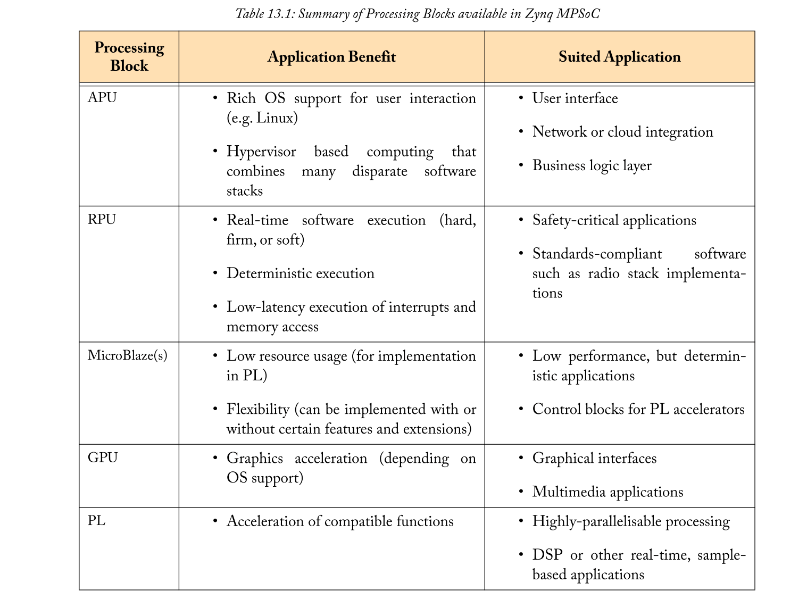
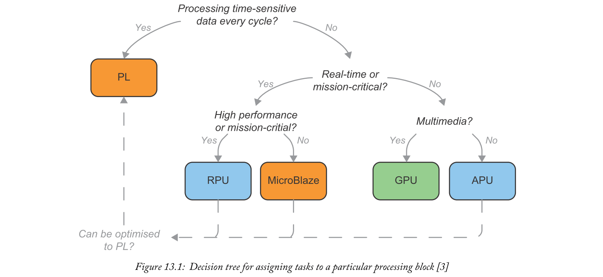
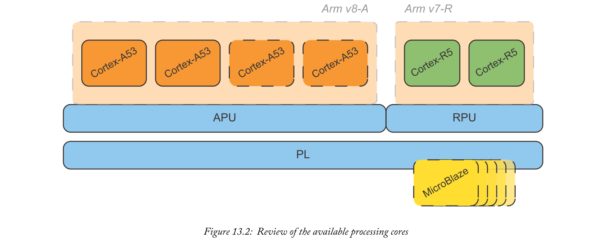
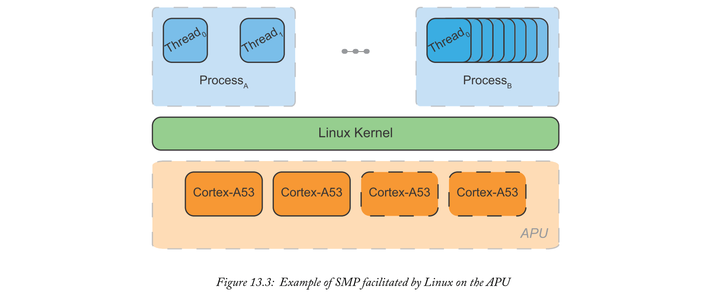
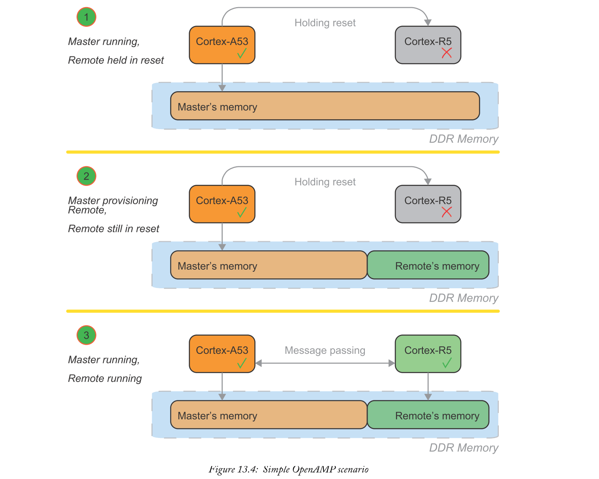
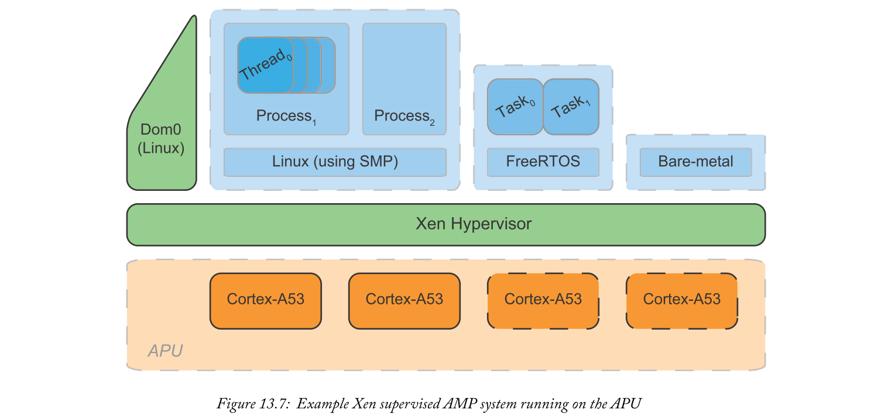
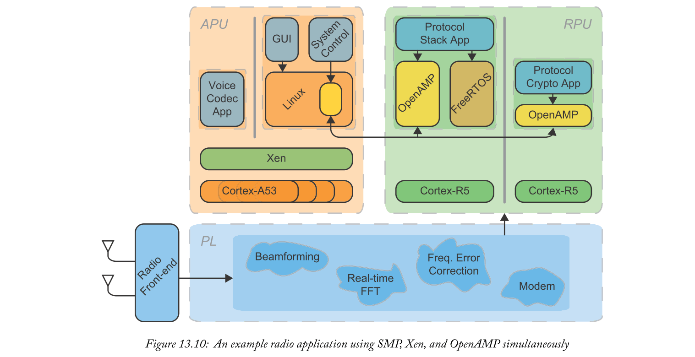

# Chapter 13 Multiprocessor Development
为了充分利用Zynq MPSoC的硬件，我们需要设计针对相应处理器的软件系统来完成给定的任务。开发适合多处理器系统的软件是一项至关重要的技能，不仅可以利用APU中的所有Cortex-A53处理器，还可以扩展系统以利用其他可用的架构。其中包括RPU的Arm Cortex-R5处理器，甚至PL中实现的MicroBlaze内核。虽然我们只对Zynq MPSoC应用多处理器开发，但正确使用多处理器硬件正成为许多嵌入式软件开发人员面临的共同挑战，因为SoC器件趋向于提供越来越多的异构内核。

本章介绍了Zynq MPSoC作为异构多处理器系统，讨论了嵌入式系统中异构性的动机，以及一些技术术语。然后以更实用的眼光，我们解释了如何将三种不同的技术应用于Zynq MPSoC以充分利用硬件：
- 1.编写可以使用所有APU处理器的应用程序（使用Linux）。
- 2.扩展APU中存在的软件，以配合RPU和任何MicroBlazes（使用OpenAMP）上运行的系统。
- 3.使用APU处理器同时托管各种软件堆栈（使用Xen）。

这些技术与最终的示例应用程序相结合，将三者结合起来。

## 13.1  Introduction to Heterogeneous Processing
Zynq MPSoC提供多组处理器，每个处理器具有不同的架构和特长。这些处理器设置彼此不同的事实（即它们不仅仅是相同的核心）意味着它被归类为“异构”系统。对于简单的概念来说，这是一个充满恐吓术语的重要主题。

通过将具有不同专业的不同处理器组合在一起，异构系统可以提供比仅具有一种类型处理器的等效“同构”系统更好的性能和能量效率。给出一个简单的例子，这种效果非常直观。考虑一个应用程序，如智能手机。可能会有一个通用处理器来支持丰富的用户环境，以及不同的处理器类型，专为无线电通信标准的信号处理要求而设计。当然，通过添加更多通用内核，也可以以同构方式实现相同的功能，直到有足够的原始处理能力来处理无线电标准。但这在使用的资源和每瓦性能方面都是非常浪费的。异构处理有助于我们避免这种浪费。

### 13.1.1  Processor Sets on Zynq MPSoC
在Zynq MPSoC中，有许多类型的处理器。有些是显而易见的（例如APU和RPU），而其他一些则更容易被忽视，例如某些设备上存在GPU以及在PL中使用MicroBlaze软处理器的可能性。这些都没有共享相同的指令集架构，毫无疑问Zynq MPSoC是异构设备。

异构处理的好处在于设计中利用每种处理器的独特优势。我们试图在表13.1中总结这些优点，但请记住，每个应用程序的考虑因素总是会有更微妙的。显然，需要Zynq MPSoC器件的复杂设计不仅仅包含这些“适合的应用”中的一个 - 而是一组它们。设计软件系统的部分复杂性是识别这些不同的要求并在适当的处理块之间拆分任务。下一节将简要总结这一挑战。

### 13.1.2  Splitting Software Tasks
充分利用Zynq MPSoC硬件的软件应用程序可能具有一些架构复杂性 - 例如基于Zynq MPSoC的Mycroft Mark II开放式语音助理[2]以及我们自己的软件定义无线电示例中使用的“软件定义无线电的混合示例”应用程序“在页面348.在我们深入了解应用程序如何同时使用所有可用的处理块之前，值得探讨如何将复杂的应用程序拆分为一组较小的任务。这里的目的是使每个任务具有更易于复杂性管理并利用单个处理块的优点。

除了通过对逻辑函数进行分组来拆分大型应用程序之外，还有一些不太明显的因素需要考虑。您实际上可能希望加入系统的两个部分，这些部分在功能上看起来完全不同，但在很大程度上依赖于相同的数据。注意到大量此类数据依赖性通常表明您的算法的一部分不太适合并行性。您可能还希望进一步分割任务，不仅是功能，还有实时要求。例如，较大系统内的通信栈将具有一些较低层，其需要实时保证以符合标准，而较高层可以更放松。

通过将应用程序拆分为较小的任务，我们可以开始将这些任务映射到Zynq MPSoC中可用的处理块。图13.1显示了一个示例决策树，建议如何将给定任务分配给处理块。

请注意，这只是一个粗略的经验法则，尤其是当决策树独立考虑每个任务时。可能需要在处理块之间重新组织任务以便适当地平衡负载。例如，如果APU过载任务但RPU核心完全空闲，那么即使它没有任何实时要求，也可以将一些处理移动到RPU核心。同样，如果RPU负载很重，我们可能会考虑在PL中实现一些额外的MicroBlaze内核来处理一些性能较低的实时任务。

当然，电源管理也是大多数嵌入式系统的考虑因素。如果存在一个点（可能处于待机或低功耗模式），其中所有必需任务都适合单个处理块，则处理块之间的负载平衡可能不是资源的最佳使用。我们可以关闭其他域并节省能源。有关电源管理的详细信息，请参阅第10章。

### 13.1.3  Heterogeneous Computing Concepts
在我们讨论一些真正的Zynq MPSoC实现之前，最后要讨论的是异构计算文献采用的独特（通常是令人生畏的）命名法。我们现在将简要介绍这些通用概念，然后将本章的其余部分专门用于更多Zynq MPSoC特定实现。

到目前为止，我们已经在主要处理模块（RPU，APU等）方面讨论了Zynq MPSoC。但是，为了引入异构计算概念，我们必须从单个处理器核心开始查看系统。这些核心中的每一个都在图13.2中进行了重新概述（注意MicroBlazes可以以多种不同的方式配置，如果使用的话）。

最重要的一点是每个处理器核心与其他核心处理器的比较。比较APU中的任何Cortex-A53内核，RPU中的任何Cortex-R5内核和MicroBlaze内核都显示出很大的不同。

这种不对称性会产生一些困难，但本章的其余部分将详细介绍我们如何克服它们以获得性能和能效提升。这些困难源于处理核心之间没有共同的指令集：
> Cortex-A53的Armv8-A架构和Cortex-R5的Armv7-R之间可以兼容指令集。这只有在AArch32模式下使用Cortex-A53并使用特征的子集时（即否定两种架构的优点！）[4] [5]。这不容易实现。
- 我们无法动态移动不同核心之间的任务执行。
- 我们无法使用单个操作系统为我们管理所有核心。

由于这些困难，我们将不得不采用一种称为**非对称多处理（AMP）的技术**，以充分利用Zynq MPSoC硬件。**AMP涉及明确制定每个任务以针对特定处理器**，并且通常需要与其他处理器进行一些仔细同步的通信。

我们需要区分两种类型的AMP：
- 1.Unsupervised AMP: 所有处理器都独立运行，具有自己的软件堆栈。请注意，没有协调这些处理器的中央软件 - 它们都被视为等同。因此，必须在这些核心之间进行一些仔细协调，以保护系统资源。例如，在配置中断控制器时，每个处理器必须确保它不会覆盖其他人使用的设置（默认初始化函数会覆盖每个条目！）。因此，从第一原理来看可以很难实现无监督的AMP。第13.3.1节介绍了如何利用OpenAMP框架简化这一过程 - 帮助管理资源并在处理器之间执行消息传递。
- 2.Supervised AMP: 所有处理器仍然独立运行，有自己的软件堆栈，但有一些底层软件协调处理器 - 一个虚拟机管理程序。虚拟机管理程序将大部分资源共享困难从应用程序开发人员中抽象出来，使得受监督的AMP在实施时不那么具有挑战性。运行在虚拟机管理程序之上的软件甚至不需要知道它参与了AMP系统。在这里使用虚拟机管理程序可能是一把双刃剑。它确实抽象出了很多困难，但这意味着所有协作处理器必须具有相同的架构（否则管理程序将无法监控它们）。因此，受监督的AMP可以成为协调APU内所有Cortex-A53处理器的非常有用的技术，但它本身不允许APU，RPU等之间的AMP。请注意，受控制的AMP不适合在RPU中实现，因为Cortex-R5处理器缺少Cortex-A53上存在的虚拟化硬件支持。有关虚拟化的更多讨论，请参见第13.3.2节，以及使用Xen虚拟机管理程序在APU内的核心上提供受监督的AMP。

对于受监督的AMP而言，虽然主要处理块彼此不对称，但APU由多个“对称”处理器组成。我们在这里介绍的最后一个概念是利用这些相同的对称内核，通过使用单个操作系统来控制APU中的所有处理器。如果OS（例如Linux）具有对每个处理器的独占控制，则它可以在它们之间调度和平衡任务，对用户完全透明。这种技术称为**对称多处理（SMP）**，对于阅读本书数字副本的人来说应该很熟悉 - 您的设备很可能现在正在使用这种技术！只要系统由多个进程或线程组成，操作系统就可以利用分配给它的多个处理器，而应用程序开发人员只需要很少的额外工作。在第13.2节中，我们将讨论APU如何使用Linux支持SMP配置。

## 13.2  Symmetric Multiprocessing with Linux
SMP是一种多处理形式，其中多个任务可以使用由单个OS控制的多个处理器。操作系统可以通过其调度算法动态地为每个工作负载分配一些CPU时间，并且可以在可用处理器之间移动任务以执行负载平衡。可以同时为每个处理器分配一个工作负载，从而显着提高独立任务的性能。所有这些调度和资源管理都由操作系统透明地执行，这样应用程序开发人员（几乎）就不需要考虑它了！良好的多处理器利用率和相对容易的应用程序开发的结合使SMP成为编写APU软件的良好默认选择。请注意，这不适合与RPU一起使用，我们将在稍后讨论。

适用于Zynq MPSoC的最受欢迎的SMP操作系统是Linux。在Linux中，不同的任务有两种形式：进程和线程（其中一个进程可以拥有多个线程）。图13.3显示了使用具有多个进程和线程的Linux的APU的示例SMP配置。此SMP配置与大多数台式计算机的配置相同，包括本书的一个排版。

在幕后，Linux内核必须能够处理一些基本功能才能支持SMP。首先，它必须有一个算法，为每个工作负载调度CPU时间。我们在第322页的“进程管理”中引入了Linux调度。它不应该只为每个进程分配相等的时间，而应该考虑每个进程的优先级及其“处理器关联性”（即它最喜欢哪个处理器）。
处理器关联性是每个处理器具有L1高速缓存的系统的重要元素。如果每次重新启动进程时将其分配给不同的处理器，则需要浪费时间重新填充该处理器的L1高速缓存。但是，如果我们尝试将进程返回到同一处理器（使用其处理器关联性），则仍可能存在任何缓存数据。除了调度进程外，Linux还必须能够暂停进程的执行，在磁盘上存储任何必要的状态，并按需恢复执行。最后，因为SMP促进了多线程，Linux需要提供一种在线程之间进行同步和通信的方法。这些要求意味着支持SMP的复杂性牢牢地放在操作系统中，而不是用户应用程序中。那么，为了利用SMP，应用程序开发人员实际需要什么？

从应用程序开发人员的角度来看，考虑启用SMP的原因。如果我们的系统只有一个单线程进程，SMP就没有效果了。因此，我们的系统必须由**多个进程**组成（因此操作系统可以将每个进程同时安排到不同的处理器），或者至少包含**一个多线程进程**。这些技术都可以在同一个系统中使用，并分别以“进程级并行”和“并行处理编程”[1]命名。
> process-level parallelism 指多个进程
> ‘parallel processing program 指一个多线程进程

尽管Zynq MPSoC系统可能包含多个进程，但考虑多线程处理对需要高吞吐量的任务仍然很有用。多线程实质上是告诉操作系统如何在单个进程中使用并发 - 这可以大大提高该进程的性能。
识别和分离现有程序的不同部分或实例是迈向多线程的第一步。根据程序的不同，这可能非常自然且易于发现，或者有时可能需要对算法进行相当根本的更改！一旦程序被分割成线程，它们之间几乎总是需要一些同步，无论是返回最终值还是共享中间数据。当使用类Unix操作系统（如Linux）时，开发人员只需要针对标准的可移植操作系统接口（POSIX）API进行编程以使用同步原语（参见[6]和[10]的实用指南）。同步可以允许每个线程停止并等待，直到其他线程到达执行中的预定义点。同步的其他用途包括确保互斥以保护共享资源。总之，Linux系统需要多个进程（进程级并行）或至少一个多线程进程（“并行处理程序”）来利用SMP的性能优势。

开发人员还可以对Linux执行SMP调度的方式进行一些可选的精细控制。他们可以选择配置使用的处理器数量，进程的处理器关联性和中断关联性。首先，Linux内核的maxcpus引导参数可以决定Linux SMP配置中使用的内核数量。此引导参数最常与虚拟机管理程序一起使用（有关详细信息，请参阅“使用Xen虚拟机管理程序进行监控的AMP”（第344页）），以便为不同的独立软件堆栈保留一些APU核心。开发人员还可以选择显式地设置进程或中断的处理器关联，以便手动地在处理器之间实现负载平衡。这可以为某些进程(没有其他进程固定在同一处理器上)提供更确定的性能，或者将时间不敏感的进程分组在一起。有关使用这些技术的实用信息可以在[7]中找到。

另外，由于几个原因，RPU不正式支持SMP。首先，此配置需要支持SMP的操作系统，例如Linux。这些通常（但并非总是）需要MMU来提供虚拟地址转换。RPU没有MMU以便提供更确定的执行。
更为重要的是，RPU在两个Cortex-R5处理器[8]之间没有硬件强制的高速缓存一致性，使得任何高速缓存一致性都是软件强制执行的。大多数SMP系统都需要这种硬件支持。虽然SMP系统的高速缓存一致性可以用软件实现，但这带来了许多限制和开销[9]。

## 13.3  Asymmetric Multiprocessing
使用AMP可以扩展我们软件系统的边界，利用RPU的Cortex-R5和可能已在PL中实现的任何MicroBlaze处理器。术语AMP意味着我们在每个处理器上运行独立（可能不同）的软件堆栈。每个处理器都没有单独的操作系统，如同有SMP配置。本节的其余部分介绍了Zynq MPSoC中AMP的两个常见用例。首先，我们介绍OpenAMP框架，用于实现无监督的AMP系统，通常用于将任务卸载到RPU和MicroBlaze处理器。其次，我们考虑如何使用Xen管理程序将AMP的优势应用于APU。在我们深入之前，让我们首先考虑一下这些优势是什么？

除了允许我们使用Zynq MPSoC的异构处理器之外，AMP还鼓励我们将复杂的系统分解为更小的，独立开发的任务。这有几个很好的结果：
- 通过较小的独立任务实现易于开发 - 尤其是在团队之间分工时。
- 我们可以混合许多软件堆栈。由于没有单一操作系统控制所有处理器，我们可以选择使用最适合每项任务的软件堆栈。AMP系统通常会使用许多不同的软件堆栈，包括Linux，FreeRTOS和裸机。

AMP还使我们可以明确控制在哪个处理器上执行哪个任务。在开发具有任何硬实时元素的系统时，这种控制非常有用。这种精细控制允许处理器专门用于实时任务，帮助其确定性并最小化其最坏情况延迟（与SMP配置不同，它永远不需要等待计划的CPU时间）。

### 13.3.1  Unsupervised AMP with OpenAMP
OpenAMP是一个框架，旨在通过使用现有的开源组件来开发AMP系统。要了解OpenAMP系统的结构，我们首先介绍一个简单的场景。图13.4描述了一个Cortex-A53处理器将实时任务委托给一个Cortex-R5处理器的情况。图13.4分三个阶段显示了Cortex-R5：复位时，由Cortex-A53配置，最后是执行。

请注意，这里有一些隐含的层次结构 - 在此示例中，Cortex-A53充当“Master”，而Cortex-R5则是“Remote”从属处理器。在运行时，Master决定将任务卸载到Remote处理器，并在内存中设置该处理器的固件映像。然后Remote处理器退出复位并开始执行其委派的任务。此执行的一个重要部分是与主处理器通信 - 这对于至少返回结果是绝对必要的！

OpenAMP通过提供两组功能，使这个常见的AMP场景尽可能简单：
- 1.生命周期管理（LCM）：允许主处理器根据需要为远程处理器加载，运行和卸载固件映像。
- 2.处理器间通信（IPC）：允许主处理器和远程处理器之间的消息传递。

LCM功能由'remoteproc'处理，一个远程处理器框架[11]，IPC功能由'rpmsg'处理，这是一个远程处理器消息框架[12]。remoteproc和rpmsg都是在Linux内核中实现的预先存在的框架。OpenAMP利用这些现有的内核实现，但也提供独立的实现来支持其他（非Linux）软件堆栈。例如，OpenAMP可以支持Linux主机与FreeRTOS或裸机远程处理器通信。虽然这是最可能的配置，但运行FreeRTOS或裸机软件堆栈的处理器也可以用作OpenAMP主机。

为了了解OpenAMP的技术细节，让我们考虑一个更具体的AMP场景，如图13.5所示。有一个Linux主机在其中一个Cortex-A53处理器上运行，与运行FreeRTOS的远程Cortex-R5通信。请注意，主处理器和远程处理器之间不必存在一对一的关系，可以存在一对多的关系。单个主设备可以选择启动许多远程处理器 - 这些远程处理器甚至可以成为他们自己的远程处理器的主设备。此处使用的示例是一个主设备和一个远程设备，但“软件定义的无线电应用程序的混合示例”（第348页）使用了多个远程处理器的配置。

在图13.5中，远程处理器已使用remoteproc初始化。对于远程进程的其余部分，rpmsg负责启用两个处理器之间的通信。

Rpmsg使用两种硬件机制来提供处理器间通信：处理器间中断（IPI）和共享内存。IPI用于指示共享存储器中是否存在新消息，而无需在软件中进行任何轮询。Zynq MPSoC具有对IPI的硬件支持，详见技术参考手册[13]的第13章（“中断”）。共享内存用于存储实际消息，并由另一层名为“VirtIO”的软件管理（我们保证在本节中不再引入任何框架名称！）。rpmsg使用VirtIO作为传输层，如[14]中所述。主处理器将为每个远程处理器配备一个rpmsg通道。在每个通道中，开发人员可以选择使用多个逻辑端点来分隔消息类型。这类似于TCP/IP连接，其中许多端口号（或rpmsg的“端点”）可用于每个单独的IP地址（或“通道”）。

接下来，我们继续考虑OpenAMP的remoteproc组件。Remoteproc的基本功能都与LCM [15]有关，包括：
- 将远程固件加载到内存中以供远程处理器执行。
- 通过从Reset释放远程处理器来开始执行远程固件。
- 通过初始化rpmsg通道在主处理器和远程处理器之间建立通信
- 关闭远程处理器。

通过这四个功能，我们可以控制远程OpenAMP应用程序的生命周期。但是，必须在固件映像中嵌入一些额外信息，以便remoteproc可以执行这些任务。这些额外信息定义了远程处理器所需的系统资源 - 包括CPU标识符，远程固件的代码和数据应放在内存中的地址，以及用于初始化rpmsg的IPI/共享内存信息。这些详细信息放置在固件映像内的静态链接“资源表”中，并在准备远程处理器时由remoteproc解析。

图13.6总结了远程OpenAMP流程的整个生命周期。master使用remoteproc API来加载和启动远程固件。在复位后，远程处理器初始化rpmsg所需的资源，触发握手以建立rpmsg通道。然后，应用程序正在运行，可以使用rpmsg API与主服务器进行通信。当要关闭远程处理器时，主设备会向远程控制器发送自定义“关闭”消息，然后远程处理器执行任何特定于应用程序的清理操作。关闭消息被确认，双方都关闭了他们的remoteproc实例。

最后一个涉及的主题包括开发人员如何使用现有应用程序并使用OpenAMP将其与更大的Zynq MPSoC设计集成。如图13.6所示，远程固件负责一些初始化和清理任务，以及与主站进行通信。开发人员必须确保他们实施：
- 1.用于描述远程固件所需资源的资源表。这个（以及更多）的例子可以在[16]中找到。
- 2.在开始初始化rpmsg时调用remoteproc_resource_init（）。
- 3.定义回调函数，描述如何处理rpmsg通道创建，接收和删除事件。
- 4.使用rpmsg_send（）将任何特定于应用程序的消息发送回主处理器。
- 5.当告知要关闭时，调用remoteproc_resource_deinit（）来清理分配的资源。

只需要极少量的额外开发工作就可以使应用程序很好地集成到OpenAMP系统中 - 尤其是在使用[16]中描述的示例程序作为起点时。通过OpenAMP，我们可以扩展我们的Zynq MPSoC软件，不仅可以利用运行Linux的APU，还可以将实时/硬件接口任务委派给RPU，甚至是MicroBlaze处理器。这对于使用异构处理器来说是绝对重要的技能，幸运的是，OpenAMP使得实现相对轻松。

### 13.3.2  Supervised AMP with the Xen Hypervisor
软件虚拟化在桌面计算中已经司空见惯。虚拟化允许一组处理器运行许多不同的“客户”操作系统（通常称为“虚拟机”或VM）。称为hypervisor的软件层负责管理这些VM。虚拟化可以提供受监督的AMP环境，因为它可以支持许多不同的（或非对称的）软件堆栈，这些堆栈都由hypervisor监督。虚拟化在桌面和服务器中有许多不同的用途 - 包括始终保持服务器满载（因此需要更少的处理器和节省能源），隔离软件以确保Safety或Security，以及支持为不同平台编写的legacy软件。实际上，这句话甚至是使用在VM中运行的软件来键入的。

在嵌入式系统中使用虚拟化是一项相对较新的技术（Xen的Arm支持于2013年首次发布！）。这已经被诸如Zynq MPSoC之类的具有硬件支持虚拟化的处理器的设备开始采用。在Zynq MPSoC中，这种硬件支持源于Cortex-A53的Armv8架构和SMMU。这些对于以接近native性能运行虚拟化软件至关重要。有关虚拟化的硬件支持的更多信息，请参见第155页的“系统虚拟化”和第206页的“使用虚拟化和Armv8隔离软件”。因此，现在我们可以在Zynq MPSoC中使用虚拟化，让我们考虑一下为什么我们想要。

嵌入式系统中有许多用于虚拟化的用例，但其中大多数都源于客户之间的隔离以及客户的动态管理。
- 隔离意味着每个guest虚拟机都可以自由运行不同的软件堆栈。在APU中，开发人员可以选择同时运行Linux，FreeRTOS和裸机应用程序。每个任务都可以在最适合它的平台上独立开发。
- Hypervisor强制执行严格隔离，以便每个guest虚拟机只能与已明确分配给它们的外围设备进行交互。这有助于确保设计的安全关键部分即使另一个客户崩溃也能保持运行。实际上，安全认证通常需要这种去耦来证明良好的设计实践。
- Guests解耦也会使系统更容易集成和维护。例如，如果我们更新现有Guest或引入新Guest，我们可以确信它不会对现有Guest产生实际影响。同样，我们可以独立测试每个Guest，然后只需要一个非常简单的集成过程来协调整个系统。
- hypervisor层使我们能够检测并响应每个guest虚拟机中的故障或崩溃。我们可以通过hypervisor监控每个访客，发现可能导致操作系统崩溃的故障以及其中的任何监控代码。为了提供最佳的正常运行时间，Guest可以重新启动，或者可以维护冗余的后备Guest。

这只是几个例子，但我们可以开始理解为什么嵌入式系统中的虚拟化趋势已经开始。有许多不同的虚拟机管理程序解决方案，但在使用Zynq MPSoC时，大多数开发人员可能会选择Xen虚拟机管理程序。为何特别是Xen？

Xen正式支持Zynq MPSoC硬件（利用Armv8的虚拟化功能），并通过DornerWorks [18]提供商业支持。从各方面来说，Xen都是免费的，并使用GPLv2许可证。进一步采用开源软件，它已成为Linux平台上事实上的虚拟化解决方案，并被作为Linux Foundation的一部分采用。显然，Xen不会很快消失。这也意味着在Zynq MPSoC上为Xen制造的应用程序将在未来几年内可移植到其他支持Xen的系统。

现在特别关注Xen，它是一个“layer  one” hypervisor，意味着它直接位于硬件上方。所有客户操作系统（或Xen命名法中的“域”）都位于Xen之上。要为Xen提供控制接口，总会有一个特权域名为“dom0”。Dom0通常是一个Linux系统，可以访问硬件，并可以通过用户友好的工具（如'xl'）与Xen内核进行通信。该工具使用户能够通过Linux控制台管理Guest域 - 包括Guest域的LCM，提供对每个域的控制台访问，以及控制每个域的资源（例如CPU数量，内存，调度提示等等[19]]）。图13.7显示了在APU上运行的基于Xen的监督AMP系统的示例。这包括用于控制的dom0，Xen内核以及运行不同软件堆栈的示例Guest域。

暂时将其与Zynq MPSoC相关联，如果Guest域严格隔离，我们如何与硬件（例如PL中实现的IP）进行交互？实际上有两种方法可以在Xen系统中实现这些驱动程序[17]。第一种也是比较熟悉的方法是为设备设置一个pass-through。pass-through允许dom0从（通常）单个Guest域授予对外围设备的完全访问权限。Guest域可以完全像没有Xen那样使用外围设备 - 即Guest甚至不需要知道它正在被虚拟化。开发人员可以使用简单的ASCII配置文件告诉Xen实现pass-through，我们将在后面讨论。然后，Xen配置SMMU以将guest虚拟机的内存访问传递到外设，并配置GIC以将来自外设的中断路由到运行guest虚拟机的任何处理器。此配置如图13.8所示。

与硬件外围设备通信的第二种方法是使用“半虚拟化”（PV） - 其中Guest域知道它们正在被虚拟化。对于PV，驱动程序通常分为两个：前端驱动程序和后端驱动程序。这在图13.8中可视化。驱动程序的两半使用共享内存进行通信，其方式与OpenAMP为IPC进行的操作非常相似。

虽然会产生轻微的性能影响，但这种结构有明显的动机：
- 多个guest虚拟机可以安全地共享同一设备，因为它由单个域控制。控制域还可以实现调度方案以防止任何一个Guest独占设备。
- 每个guest虚拟机只需要实现一个通用的前端驱动程序。这在Guest域和实际硬件实现之间引入了一层抽象，从而产生了极其便携和可重用的应用程序。

同样，要触及的最后一个重要主题是**开发人员需要做些什么才能在自己的应用程序中利用Xen**。我们面临与OpenAMP相似的挑战，例如描述每个Guest的资源需求，以及必要时在Guest之间进行通信。首先，PetaLinux工具可以非常容易地用于生成基于Linux的dom0的Xen系统。就目前而言，这是默认的PetaLinux配置，详见[20]。对于系统中的任何Guest域需要两件事：
- 1.Guest的固件映像。例如，裸机elf可执行文件或Linux映像。
- 2.纯文本配置文件，用于描述Xen对guest虚拟机的资源要求。

对于Linux Guest，固件映像可以是另一个PetaLinux项目，甚至是启用了相应驱动程序的自定义Linux构建。可以使用SDK创建裸机映像，如[22]中所述，该图还演示了如何实现UART设备的pass-through。我们在图13.9中提供了裸机Guest的纯文本配置文件示例。请注意，可用选项的完整列表显示在手册页[21]中。

最后，要创建配置文件（例如bare_guest.cfg）描述的Guest域，我们只需使用dom0控制台中的'xl'工具：xl create bare_guest.cfg。

一旦我们在Xen上运行多个guest虚拟机，我们可能希望让它们相互通信。可以使用Xen分配的共享内存区域（如[17]中所述）执行此操作。这与OpenAMP之前看到的机制非常相似。但是，对于guest虚拟机（尤其是Linux guest虚拟机）来说，通过虚拟网络使用TCP/IP进行通信实际上更为常见。这种网络配置非常简单，只需要在guest虚拟机的配置文件中添加一行，并使用任何丰富的现有TCP/IP库。

我们已经看到如何在Zynq MPSoC上使用Xen来启用受监控的AMP，从而可以相对轻松地充分利用APU的多个处理器。这可以是一个非常灵活的解决方案，允许混合软件堆栈，促进解耦，便携式系统设计，并可以使用隔离safety  and security。

## 13.4  A Hybrid Example for Software Defined Radio Applications
为了总结为异构多处理器系统设计软件的主题，我们研究了软件定义的无线电用例。借用[23]中的一个例子，我们专注于警察和救护车等服务所使用的移动无线电。这些是非常复杂的系统，必须是健壮的并且实时操作。本示例的目的是演示如何将复杂系统拆分为适合Zynq MPSoC硬件上不同处理模块的较小任务，并了解如何使用我们的多处理技术轻松实现和集成这些任务。

在这样的设计中通常有许多任务，但它们通常分为三类：基于采样的实时任务，实时任务和高级任务。这些映射很自然地分别在PL，RPU和APU中实现。PL将负责诸如波束成形，实时FFT，频率误差校正和调制解调器之类的信号处理任务。RPU可以处理下一层，包括在一个核心上实现无线电协议栈，以及第二核心上的任何相关安全功能（你希望警察无线电通信是加密的，但不要太政治化！）。RPU的确定性执行有助于确保我们正确地符合所使用的无线电标准。然后，APU负责最高级别的应用程序。这包括解码和编码语音数据（可能具有Cortex-A53的SIMD功能），以及在Linux上运行的用户界面。

接下来，我们要考虑不同的软件任务如何相互集成。APU应用程序依赖于应该在RPU上执行的任务。这是OpenAMP的一个明确应用，在两个处理器集之间进行协调。此外，有两个独立的任务映射到APU——语音编解码器（可能用裸机编写）和用户界面（可能在多个核心上使用Linux驱动程序和SMP）。此方案非常适合Xen的虚拟化功能。这让我们同时运行两个软件堆栈，为裸机堆栈保留一个Cortex-A53，从而为它提供一致的CPU时间。因此，这将形成一个混合系统，
- using the SMP capabilities of Linux
- supervised AMP on the APU using Xen
- and unsupervised AMP on the RPU using OpenAMP.。

该系统的可视化如图13.10所示。

除此之外，该应用程序还可以利用Zynq MPSoC的电源管理功能。这些无线电大部分时间都处于待机状态，因此不需要GUI和语音编解码器功能。开发人员可以选择将APU和PL置于待机状态，让RPU在检测到有效消息时将其唤醒。这种省电在电池供电的嵌入式设备（如移动无线电）中非常有用。有关电源管理的详细信息，请参阅第10章。

我们引入了一个需要在Zynq MPSoC上使用许多处理模块的应用程序。该应用程序作为案例研究，介绍了如何使用Linux的SMP功能，Xen管理程序和OpenAMP以最小的努力实现这样的系统。OpenAMP有助于将每个RPU核心用作具有实时功能的协处理器，而开发人员只需要将资源表和程序定义为简单的消息传递API。Xen允许我们在APU核心上运行两个不同的软件堆栈，开发人员可以独立地实现每个堆栈。虚拟机管理程序只需要一个简单的纯文本配置文件来描述两个guest虚拟机的资源需求。最后，基于Linux的图形界面可以使用SMP来使用多个APU核心，而几乎不需要额外的开发人员工作。

## 13.5  Chapter Summary
本章介绍了可用于充分利用Zynq MPSoC异构处理器集的各种技术 - 根据最新趋势，这是一项基本技能！在讨论了能效如何激发系统的异构性之后，我们讨论了一些基本的多处理概念：
- SMP：在单个OS的控制下，可以在多个处理器上同时执行多个任务。
- Unsupervised AMP：不同软件堆栈在每个处理器上独立运行而没有基础监督 - 即每个应用程序必须注意确保它不会破坏其他应用程序的资源。
- Supervised AMP：不同软件堆栈在每个处理器上独立运行，但有一层协调软件（如虚拟机管理程序）处理软件堆栈之间的隔离。

然后，我们介绍了如何使用现有的软件库和框架在Zynq MPSoC上实现这些技术。Linux的现有SMP功能可以在APU上使用，几乎对应用程序开发人员透明。OpenAMP可用于管理远程处理器并与之通信，以最小的努力为无人监督的AMP系统奠定基础。OpenAMP可以与APU，RPU中的处理器一起使用，甚至可以与PL中的MicroBlazes一起使用。Xen管理程序允许在APU内部使用受监督的AMP系统，这可以促进不同的软件堆栈和各种安全/安全优势。Xen利用Armv8的硬件虚拟化支持来实现近乎原生的性能。

所有这三个选项都提供了简单的接口，可以相对轻松地协调复杂的Zynq MPSoC软件设计 - 正如我们的示例无线电应用中所强调的那样。

