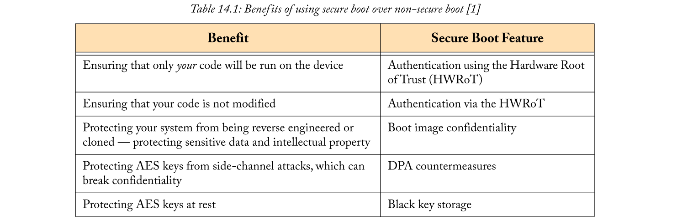
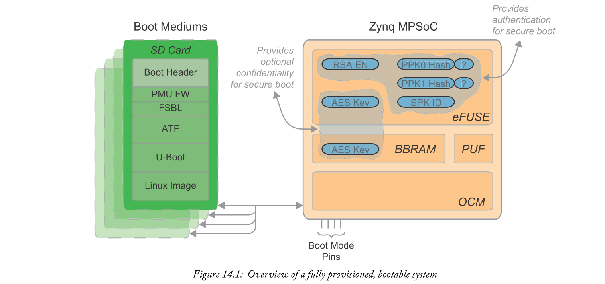
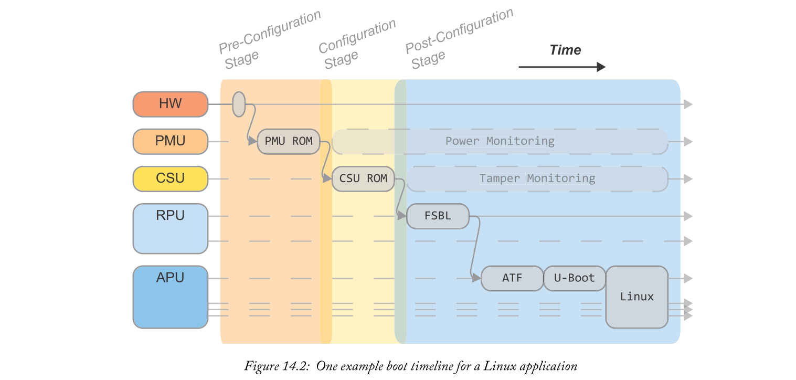
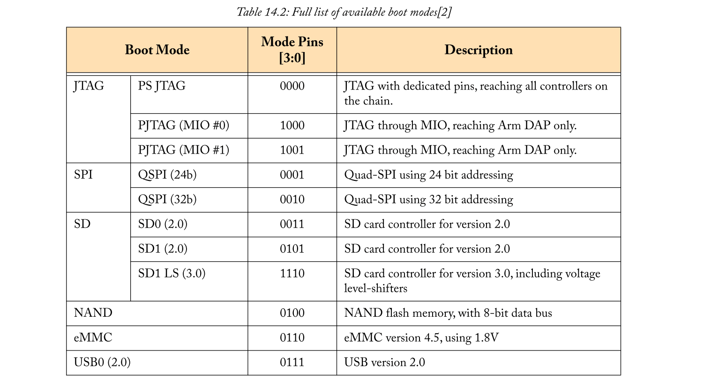
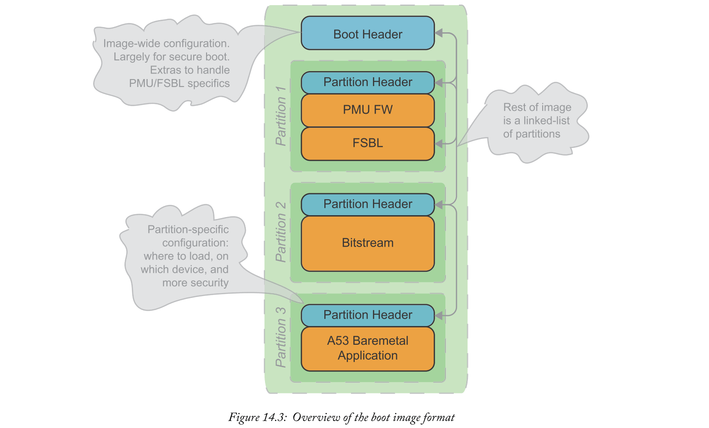
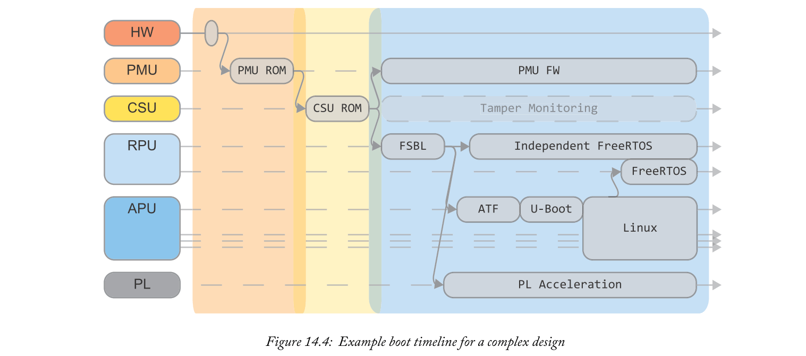
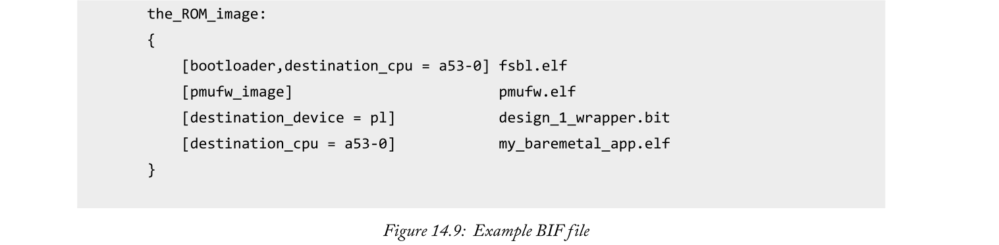

# Chapter 14 System Booting

本章将介绍Zynq MPSoC的启动过程，开发人员如何影响此过程以及一些实用指南。在讨论了哪些类型的应用程序需要安全启动功能之后，我们考虑了非安全启动和安全启动流程。我们详细介绍了启动过程的3个主要阶段：
- 1.预配置阶段，重点关注硬件元件和PMU。
- 2.配置阶段，由CSU控制。
- 3.后配置阶段，用户提供的代码接管。

在熟悉非安全启动过程后，我们将深入研究安全启动提供的身份验证和机密性。最后两节采用更实用的视角，详细说明了如何使用Bootgen实用程序生成启动映像，并在设备上配置任何与安全相关的eFUSE。

## 14.1  Introduction to System Booting
了解Zynq MPSoC系统如何启动对于准备生产设计同样重要，因为它使开发/测试周期尽可能简化。实际上，您可以从整个项目的不同角度查看启动过程：例如在原型设计期间，从开发PC快速部署易失性映像到硬件，然后在发布之前关注安全功能以保护您的IP。本章的其余部分旨在准确演示Zynq MPSoC硬件在引导过程中的工作，以及开发人员如何使用和影响它。

要考虑的最重要方面之一是您是否需要安全启动。安全引导流程引入了一些额外的配置步骤，因此我们将分为以下两部分，非安全引导的基本讨论，以及对安全引导流程中额外步骤的补充讨论。为了帮助设计人员确定给定设计的非安全或安全启动，我们列出了表14.1中安全启动的主要优点。

如果您确定您的设计需要进行身份验证（即只应运行未经修改的设计）和/或机密性（即其他人无法看到您的设计），请确保安全启动，请务必查看“安全启动过程”请参阅第364页上的“实用安全设备配置”和第371页。我们还强烈建议您先阅读第8章，了解所有Zynq MPSoC安全功能的概述。如果您不需要安全启动流程，请跳过这些部分，而是关注第356页的“非安全启动过程”和第370页的“实用的非安全设备配置”。

在我们详细讨论引导过程之前，让我们停下来考虑一下完全配置的Zynq MPSoC器件在上电之前的样子。了解Zynq MPSoC在启动时可用的非易失性资源将使我们更容易讨论启动过程。图14.1描述了这样一个系统，它已配置为安全启动。

引导过程由我们可以认为值得信赖的硬件单元启动，包括状态机和不可变（即不可更改）的片上PMU / CSU ROM。其他非易失性存储器是开发人员必须影响这种硬连线，可信引导过程的第一阶段的主要手段。这些存储器在一定程度上包括各种引导介质，eFUSE以及BBRAM。开发人员可以创建引导映像，封装最终将执行的用户代码，并将其存储在许多引导介质之一上。4个引导模式引脚决定使用哪种引导介质。有一些eFUSE标志用于启用可选的启动功能，并存储加密密钥或哈希值以进行安全启动。有关创建这些启动映像和配置安全功能的详细信息，请参见第14.4节和第14.5节。

我们必须介绍的最后一条背景信息是每个系统软件映像的用途。在图14.1的示例系统中，我们看到启动映像包含许多不同映像的不同分区。

包括：
- First Stage Boot Loader（FSBL）：在OCM中运行，负责初始化处理系统的许多部分，包括时钟，存储器和UART。它还负责加载任何后续软件，如裸机应用程序或第二阶段引导加载程序。
- Platform Management Unit Firmware: 启动后在PMU中运行。这负责电源管理任务，例如动态关闭和唤醒处理器或电源域。SDK提供此固件，但开发人员可以根据需要随意修改它。
- U-Boot：流行的第二阶段引导加载程序（SSBL），通常用于在Zynq MPSoC上加载Linux。U-Boot通常比FSBL大得多，因此在DDR内存中运行，但也具有更多功能。它初始化剩余的外围设备并支持从更复杂的源启动 - 例如通过TCP / IP网络或SATA接口。
- Arm Trusted Firmware（ATF）：是一小部分软件，运行在APU的EL3（最高权限级别）中。这有助于在非安全和安全世界之间进行切换。Linux需要ATF，但与U-Boot类似，这通常由Xilinx工具透明地提供，例如PetaLinux。

除了这些系统软件映像之外，启动映像还应包含您的自定义应用程序，无论是简单的裸机二进制文件，还是包含许多分区的更复杂的系统。最小的裸机系统可能只使用FSBL和用户应用程序。但是，Linux系统需要FSBL，ATF和SSBL，例如U-Boot。

## 14.2  Non-Secure Boot Process
启动过程大致分为三个阶段：
- 1.预配置阶段：开始将系统初始化到可以开始寻找启动映像的程度。该阶段由小型硬件状态机和PMU处理。
- 2.配置阶段：解释引导映像头，它定义了如何加载FSBL和PMU固件，然后在将执行传递给FSBL之前加载这些映像。这个阶段由CSU处理。
- 3.后配置阶段：包括从执行FSBL到执行用户应用程序的所有后续功能。从硬件的角度来看，该设备已经在该阶段的开始时启动 - 即，硬连线的PMU和CSU ROM已经达到其目的，并且用户代码现在处于控制之中。FSBL仍然必须加载任何用户应用程序，因此从用户角度来看，启动过程并没有完全结束！

以APU上加载Linux的常见示例为例，我们将展示启动过程时间线如何将这三个主要阶段映射到不同的处理单元。图14.2显示预配置阶段由硬件状态机和PMU处理，配置阶段仅由CSU控制，RPU负责后配置阶段。请注意，FSBL实际上可以使用引导映像头中的标志来定位到APU或RPU  - 但我们假设RPU用于此示例。同样清楚地看到系统软件的每个部分都做了一些自己的工作，然后将执行交给下一部分，形成一个链。考虑引导过程，链接在一起的许多部分对于安全引导变得非常重要（参见第14.3.1节）。

### 14.2.1  Boot Process Overview
现在，我们将更详细地逐步介绍这三个阶段中的每个阶段，从预配置阶段开始，准确地讨论图14.2中所示的每个组件。如果你一次性阅读这本书一段时间，这可能是你选择饮料的好时机 - 这个话题非常干燥。

#### Pre-Conf iguration Stage
引导控制的第一个硬件元件 - 更准确地说，是上电复位（POR） - 是硬件状态机[2]。这样做是为了安全地启动和运行PMU。

它执行的步骤是：
- Lockdown of test/JTAG interfaces(锁定测试接口或Jtag接口)：这是作为安全预防措施完成的，因为设备还不知道它是否应该使用安全启动！稍后可以在检测到非安全引导流时启用JTAG接口，或者在成功安全引导后通过经过身份验证的软件启用JTAG接口（请参阅CSU的jtag_sec寄存器[3]）。
- Zeroise PMU registers（将PMU寄存器归零）：零不仅写入PMU寄存器，还会回读以确保每次写入成功。请注意，每当我们在本章中提到归零时，也会隐含此回读。
- Optionally perform the Logic Built-In Self-Test(（可选）执行逻辑内置自检)（LBIST）：只有在相应的eFUSE标志被烧断（LBIST_EN）时才执行此可选步骤。LBIST用于抢先检查设备硬件中的潜在故障，这是安全关键应用的常见要求。默认情况下不启用，因为LBIST会对总启动时间产生影响。有关完整详细信息，请参见[2]中的“系统测试和调试”一章。
- Perform an integrity check on the PMU ROM（在PMU ROM上执行完整性检查）：PMU ROM包含硬件状态机旨在加载和切换到PMU的引导代码。ROM是金属掩模的（即硬连线的），它排除了任何修改。作为针对极端辐射环境（例如空间）或复杂攻击的任何影响的额外预防措施，PMU ROM通过硬件SHA-3/384散列单元。将输出与存储的哈希进行比较，以确保内容未经修改。有关加密块的详细信息，请参阅第8章，包括SHA-3。
- PMU复位被释放并开始执行。

接下来，我们将注意力转向PMU。在将执行切换到CSU之前，PMU ROM负责初始化并对宽泛的系统（包括CSU，LPD和FPD中的时钟，电压电平和存储器）执行检查。现在硬件状态机已将控制权交给PMU，PMU ROM将：
- 可选地将LPD和/或FPD中的寄存器归零：同样，通过在这种情况下熔断相应的eFUSE标志 -  LPD_SC和FPD_SC来启用这些可选步骤。
- PMU RAM归零
- 验证PLL锁：PLL用于为引导过程生成内部时钟。这有助于排除引导期间的任何时钟故障攻击。此时，PMU确保这些时钟处于稳定状态。
- 验证电源范围：系统监视器用于检查LPD，辅助和I/O电源电压。只有当所有这些电压都在正常工作范围内时，引导才会继续。
- 将CSU，LPD和FPD中的存储器归零。
- 执行CSU ROM的完整性检查：这使用SHA-3/384内核来验证metal-masked CSU ROM的完整性——就像硬件状态机对PMU ROM所做的那样。
- CSU复位被释放并开始执行。

在这里，我们到达预配置阶段的末尾。核心组件已初始化为已知状态，我们已准备好根据用户在配置阶段的设计选择开始制定引导决策。

#### Configuration Stage
在配置阶段，CSU旨在找到用户提供的启动映像，并将FSBL加载到指定位置。如果在引导映像中指定，也可以加载可选的PMU固件。请注意，这是在非安全引导和安全引导之间开始出现差异的点 - 有关安全引导的详细信息，请参见第14.3节。CSU ROM执行：
- 初始化OCM。
- 确定引导模式：引导模式（即我们将寻找引导映像的位置）由四个外部引脚决定。在BOOT_MODE_USER寄存器中，在POR时捕获这些引脚的状态。各种可用的引导介质详见“引导介质选项”（第360页）。
- 搜索有效的引导映像：完整搜索算法在第361页的“引导映像搜索”中进行了详细说明，并允许实现fall-back映像。
- 加载FSBL映像分区和可选的PMU固件分区（如果存在）：引导映像头定义FSBL分区在引导映像中的位置，应将其置于内存中的位置，以及它所针对的处理器（在APU或RPU内）。CSU ROM解析此header并加载FSBL以及可选的PMU固件。
- 目标CPU（在APU或RPU内）Reset被释放并开始执行。

现在，系统开始在后配置阶段执行FSBL。虽然FSBL在技术上是用户代码，但我们仍会讨论默认行为，因为几乎所有应用程序都会选择使用通过SDK提供的Xilinx FSBL。

#### Post-Conf iguration Stage
接下来我们将介绍Xilinx提供的FSBL的默认行为。除非开发人员有充分的理由，否则应该不加修改地使用FSBL。FSBL的部分属于安全启动，因此无理由地修改它是非常不明智的。为了允许一些安全的自定义，有编译标志可以排除不需要的功能或启用详细输出，以及一小组功能挂钩。这些钩子允许FSBL在其执行的设定点调用用户提供的函数，而无需用户钻研核心FSBL代码。这些自定义选项在[4]中有详细说明。请注意，FSBL可以针对第一个Cortex-A53（AArch 32或AArch64），第一个Cortex-R5，甚至是两个lockstep的Cortex-R5进行编译。

FSBL的主要职责是：
- 进一步初始化：PL上电，DDR控制器初始化。初始化Cortex-A53s的高速缓存，MMU和堆栈指针，以及Cortex-R5的高速缓存，MPU，堆栈指针和TCM。还执行板级初始化 - 包括I2C，USB和PCIe接口。
- 分区加载：检查引导映像头。这可以指示使用辅助（不同）引导介质。依次考虑引导映像中存在的剩余分区。每个分区的标题包括映像的目标地址，要执行的第一条指令的地址，所有者（FSBL或U-boot），目标设备和指向下一个分区标头的指针。FSBL使用这些属性将任何FSBL拥有的分区映像复制到正确的目标。bitstream将通过PCAP接口发送，而任何软件映像将被复制到其目标地址 ——可能驻留在DDR，OCM，TCM或PMU RAM。
- Hand Off：作为加载映像任何处理器必须从Reset中释放。与以前使用PMU ROM和CSU ROM时不同，这些映像不会以可预测的方式存储在本地存储器中—— 用户可以完全控制每个映像的加载位置。因此，在释放复位之前，目标处理器的程序计数器加载了在分区头中指定的执行地址。

此时，用户设计正在运行，并且完全控制初始化的Zynq MPSoC。从这一点来看，该过程完全取决于应用程序。如果系统是一个简单的裸机应用程序，则不需要其他任何东西。例如，如果使用Linux，SSBL（通常是U-Boot）将负责并随后加载Linux映像。

以上是对非安全启动过程的概述。其余小节通过详细说明已经提到的三个重要方面扩展了这一概述：存储引导映像到哪，CSU ROM如何找到引导映像，以及引导映像的格式。

### 14.2.2  Boot Media Options
Zynq MPSoC提供11种不同的启动模式，包括6种独特的存储介质。引导模式使用四个外部引脚设置，称为PS_MODE [5]。这些引脚的状态在POR时被捕获，并存储在BOOT_MODE_USER寄存器中。表14.2显示了引导模式的完整列表。

需要注意的主要事项是USB和各种JTAG启动模式[4]。它们都不支持“多引导”流程，如“引导映像搜索”（第341页）中所述。另外，JTAG引导模式不适用于安全引导。这是因为在预配置阶段的硬件状态机锁定测试接口之后，JTAG将保持禁用以进行安全引导。

### 14.2.3  Boot Image Search
现在我们知道如何规定MPSoC应该使用哪种引导介质，让我们考虑一下CSU ROM如何在该引导介质中搜索有效映像。实现它的方式实际上允许在单个介质中存储多个引导映像，便于使用Fallback映像进行安全更新。

一旦CSU确定了引导模式，它将开始搜索有效的引导映像。它通过从引导介质的地址0x0（多引导偏移量为0）开始，并搜索引导映像头中存在的Magic字符串 - “XLNX”来完成此操作。如果未找到此字符串，或者发现检测到的引导映像头的其余部分无效，则多引导偏移量将递增，并且该过程将再次开始。注意，多引导偏移与32KB块对齐 - 即偏移量1转换为0x8000的地址。如果内置校验和失败，或者在安全启动期间验证/解密失败，则可以发现启动映像头无效。

此增量和重试过程允许在更新失败的情况下引导稍后存储在引导介质中的备份映像。对于更精细的多重启动触发，FSBL甚至用户应用程序可以通过向CSU_MULTI_BOOT寄存器写入偏移量并使用RESET_CTRL寄存器发出软复位，使用以后的启动映像触发重启。

应该注意的是，虽然多启动偏移量通常会影响所使用的地址，但这并不能很好地转换为SD和eMMC启动模式。这些使用文件系统。我们必须搜索文件系统中的逻辑文件，而不是使用原始地址进行搜索。偏移号与文件名“BOOT.bin”连接，创建一个新的文件名进行搜索。

### 14.2.4  Boot Image Format
让我们快速查看Zynq MPSoC使用的启动映像的格式。在本节中，我们将介绍引导映像的一般结构和每个部分的用途，而不是每个字段的完整详尽的详细信息。确切字段的详细信息对大多数开发人员而言并不重要，因为它们是由Bootgen工具自动生成的，在第370页的“生成启动映像”中进一步讨论。甚至还有一个配套工具Bootgen_utility，它将打印给定启动映像中每个字段的含义，使用易读的格式。图14.3显示了引导映像结构的概述。

引导映像本质上是一个头，后面跟着是分区的链表。Header提供了有关整个映像的信息，主要是为安全启动配置方面，我们将在第364页的“安全启动过程”中进行说明。还有一些额外的信息，以便CSU ROM可以区分FSBL和PMU固件。每个软件组件都封装在后续分区中 - 第一个是FSBL和可选的PMU固件。每个软件映像都有一个分区标题，指定映像的内容，应在内存中加载的位置，用于哪个处理器等等。分区Header中还有安全标志。每个分区Header还存储指向下一个分区Header的指针，形成链表。

在我们的示例中，引导映像用于一个简单的系统，该系统由单个Corex-A53处理器上的裸机应用程序和PL中的IP块组成。这转换为图14.3中所示的三个分区：FSBL（引导所需），PL的比特流和裸机应用程序。这种配置只是示范; 还有很多其他的可能性。可以添加更多分区，其中的映像可能针对其他Cortex-A53处理器，Cortex-R5（Standalone or Lock-step），甚至没有目标。
没有目标设备的分区可用于在引导时轻松地将（经过身份验证/加密）数据复制到地址空间，包括未来的软件阶段，例如Linux映像。

有关引导映像头字段的更多详细信息，请参阅[2]，有关分区头的更多详细信息，请参阅[4]。

### 14.2.5  Recap with a Linux/OpenAMP Use-Case
我们现在总结一下启动过程，回过头来看一个示例应用程序的启动时间线 - 这次复杂度稍高一些。图14.4显示了我们的示例设计的启动时间轴。这表明预配置和配置阶段对于非常不同的设计可以是相同的，因为它们由金属掩模ROM（非用户软件）控制。除此之外，FSBL还用于加载大多数软件映像（包括用于Cortex-A53的U-Boot和用于Cortex-R5处理器的独立应用程序）和PL配置，由引导映像中存储的信息引导分区Header。除此之外，用户软件完全可以控制。

为了演示用户软件可以执行的一些进一步启动相关操作，图14.4中显示的系统使用了U-Boot和OpenAMP。U-Boot用作SSBL，以便交付给APU上的Linux系统。实际上，大多数Zynq MPSoC Linux系统可能会使用PetaLinux工具提供的U-Boot，对开发人员完全透明。有关那些寻求有关手动使用U-Boot的更多信息的人，请参阅[6]。在APU上使用OpenAMP在运行时动态启动和关闭“远程”处理器（在这种情况下是第二个Cortex-R5处理器）。这表明，在运行时，用户应用程序仍然可以按需动态启动各个处理器。

## 14.3  Secure Boot Process

## 14.4  Practical Non-Secure Device Configuration
现在我们熟悉了启动过程，我们想看一下实际的元素。当不担心安全性时，我们只需要制作启动映像并将其放置在Zynq MPSoC可以访问的位置。以下部分将依次处理这两个步骤。

### 14.4.1  Generating Boot Images
可以使用Xilinx的独立Bootgen实用程序生成Zynq MPSoC的启动映像。Bootgen从称为引导映像格式（BIF）文件的简单纯文本描述生成引导映像（BIN或MCS格式）。Bootgen集成在Xilinx SDK中，后者为BIF文件创建提供GUI界面。嵌入式设计教程（[1]）提供了使用Bootgen GUI的演练。对于本节的其余部分，我们将使用不带GUI的BIF文件，以便进行简洁明了的描述。

为了演示Bootgen的使用，让我们尝试生成我们在图14.3中已经介绍过的示例启动映像。该映像应包含PMU固件，FSBL，Cortex-A53处理器的裸机应用程序以及PL的比特流。图14.9显示了描述此类引导映像的示例BIF文件。整个映像被赋予一个任意名称（在本例中为_ROM_image），并用大括号括起来。我们想要包含的每个映像都是在它自己的行上定义的，并且在方括号中附有任何额外的参数。

在我们的示例中，我们使用参数告诉Bootgen每个映像对应Zynq MPSoC的哪个部分，以识别任何特定重要的映像（FSBL和PMU固件）。请注意，PMU固件没有明确的目标设备 - 这可以推断出来。FSBL确实有一个明确的目标，因为用户可以选择目标处理器。所有BIF文件参数的完整规范可以在[4]中找到。

Bootgen解析BIF文件并为我们生成启动映像。给定BIF文件（boot.bif）和输出引导文件名（BOOT.bin），可以使用以下命令调用Bootgen：

完整的Bootgen选项列表也可以在[4]中找到。

### 14.4.2  Programming the Boot Images
现在我们有了启动映像，我们需要将它放在CSU ROM可以访问的地方。如第360页的表14.2所示，有许多不同的引导介质可用。这些可以分为六组：JTAG，QSPI，NAND，SD，eMMC和USB。这需要不同的编程方式：
- JTAG可以加载已存储在开发人员PC上的映像。这是由PC启动的，可以通过SDK轻松执行。有关实际用途，请参见[12]。
- 必须对QSPI和NAND存储器进行编程，例如，使用SDK的Flash编写器工具。有关实际用途，请参见[12]。
- SD和eMMC卡略有不同，因为引导映像必须放在文件系统中 - 而不仅仅是直接放在原始内存中。引导映像应该被称为“BOOT.bin”，并放在FAT 16/32文件系统中。
- USB可能是最不常用的方法（默认情况下禁用）。这使用了USB设备固件升级（DFU）标准。dfu-util程序可用于准备可启动的USB介质 - 有关详细信息，请参阅[4]。
  
## 14.5  Practical Secure Device Configuration
