# Chapter 15 Introduction to System Design with SDx
在本章中，我们将介绍SDX，这是一个用于设计在zynq和zynq MPSOC平台上实现的系统的开发环境。SDX是Xilinx的开发环境之一，旨在通过使用软件定义系统（包括硬件组件）来简化针对Xilinx设备的应用程序开发。

在本章的过程中，我们将探讨一些您可能希望使用SDX设计系统的原因，以及如何处理该任务。

在本章及以下有关SDX的章节中，当提及Zynq-7000和Zynq MPSOC设备时，我们使用术语Zynq。所提供的信息基于SDX的2017.2版本，可能与其他版本有所不同。

## 15.1  Motivation for using SDx 
使用传统的开发技术，针对Zynq设备的系统设计者需要提供各种不同的组件来生成一个工作系统。其中一些是显而易见的，例如要在PS上运行的应用程序软件和要在PL中运行的应用程序硬件。但是，为了创建一个完全运行的系统，还有许多其他必要的组件。设计者还必须提供引导系统所需的引导加载程序，包括配置PL和加载要在PS上运行的应用程序软件。如果应用程序依赖于OS，则设计者需要提供该加载程序和引导加载程序来加载它。此外，设计者有义务提供PS和PL之间接口所需的组件，包括驱动软件和数据移动硬件，以传递数据和控制信号。

以Zynq设备为目标的系统的所有组件的构成是一个复杂的过程，需要广泛的技能集。因此，旨在简化这一过程的工具受到了以Zynq设备为目标的设计师的青睐。例如，可以使用高级合成工具根据软件描述合成离散的硬件IP块。尽管如此，开发人员仍需要将硬件组件与其他硬件和软件组件集成到更广泛的系统中。

SDx代表了可用于硬件开发的高级合成工具的自然扩展。SDx通过产生数据移动硬件和操作系统特定的软件驱动程序，自动将合成硬件集成到系统中，扩展了高级合成工具的功能。此外，它还提供所需的引导加载程序和操作系统（如果需要）。

根据您的观点，出于不同的原因，SDx提供的抽象级别的增加可以被视为有益的，并且正是基于这些原因，我们将在本节的其余部分中进行扩展。

传统上，缺乏硬件开发经验和专业知识是在设计系统时利用FPGA设备的灵活性和低功耗性能的一个障碍。SDX通过提供类似于通常用于编程其他平台的环境来解决这个问题，例如CPU、GPU和ASSP，以及允许使用C、C++或OpenCL定义整个系统的SDx编译器。具有有限或无FPGA经验的软件开发人员可以通过在软件中创建整个系统并指定系统的部分以在硬件中实现，从而利用Zynq设备上的硬件和软件资源。SDx编译器将生成必要的硬件和软件，以使系统能够在目标平台上使用。因此，SDx大大减少了所需的先决条件学习，不仅可以利用PL，还可以利用Zynq设备提供的PL和PS紧密集成的特性。

SDX还为经验丰富的硬件设计师提供了好处。其中一个好处直接来自于使用SDX引入的软件定义系统的技术。通过在软件中定义整个系统，可以快速轻松地更改系统配置，从而快速探索设计选项以找到最佳设计。这可能会提高生产率并加速针对Zynq设备的系统开发。SDX提供的自动化还将设计者从系统开发中涉及的一些繁琐任务中抽象出来。经验丰富的硬件设计师的另一个好处是，SDX由Xilinx的Vivado设计工具套件支持。在构建软件定义的系统时，SDX使用这些工具并生成许多标准项目文件。这些文件在SDX项目中可用，提供了大量关于系统实现的低级设计信息。这意味着，尽管SDX通过提高抽象级别来提高生产力，但设计人员可以访问设计的低级细节，以帮助指导工具创建最佳系统。当涉及到使用SDX的一些更高级的特性时，熟悉vivado设计工具也将被证明是有益的。我们将在后面的章节中研究其中的一些特性。

到目前为止，我们已经讨论了SDX对缺乏硬件开发经验的设计师以及有经验的硬件设计师的好处。然而，SDX最显著的好处可能在于由硬件和软件开发人员组成的团队。SDX为团队成员提供了一个共同的工作环境，简化了协作过程。整个系统的软件定义为软件和硬件组件之间的接口提供了一个明确的规范，然后由SDX处理低级功能。这意味着硬件和软件开发人员在某种程度上都是从接口实现中抽象出来的，而接口实现是系统设计中可能需要最大程度协作的领域。然后，软件开发人员能够专注于从硬件抽象出应用程序代码，而硬件工程师能够专注于改进硬件组件的性能和资源使用。这可能会提高开发团队的生产力，并缩短系统上市时间。

## 15.2  About SDx
既然我们已经考虑了为什么要使用SDX，那么我们将介绍如何使用它。在本节中，我们对开发环境本身以及使用SDX设计系统通常涉及的不同阶段进行了高级概述。我们还将仔细查看运行该工具时生成的项目文件和报告。

### 15.2.1  The Development Environment
SDX有两个接口：命令行接口（CLI）和图形用户接口（GUI）。我们将主要关注在本书中使用GUI，尽管我们将不时地使用CLI。

SDX集成开发环境（IDE），如图15.1所示，是基于Eclipse的C/C++开发工具（CDT）IDE[1]。作为一个基于Eclipse的IDE，SDX IDE为各种嵌入式系统和软件开发人员以及那些已经习惯了Xilinx软件开发工具包（SDK）和Vivado HLS工具的开发人员提供了一种熟悉的环境。为了使那些使用基于Eclipse的IDE经验较少的读者受益，我们将简要介绍支持这些环境的主要概念，特别是SDX IDE本身。

开发环境的主窗口也称为工作台，包含一个或多个视图。虽然在SDX IDE中有几个视图可用，但大多数工作可能是在SDX视图（如图15.1所示）或调试视图（如第435页图18.3所示）中进行的。SDX视图是SDX IDE的默认视图。

视图通常用于在开发周期中执行特定任务，它由一组对执行该任务有用的编辑器和视图组成。一系列编辑器可用于编辑不同类型的文件。在开发环境中打开文件时，关联的编辑器将在视图的编辑器区域中启动。视图用于显示信息和导航与当前工作区关联的数据。可以关闭视图并打开其他视图，以自定义视图并更好地支持当前正在执行的任务。图15.1显示了SDX视图编辑器区域和视图的布局示例。有关基于Eclipse的IDE的更多信息，请参阅Eclipse文档[2]。

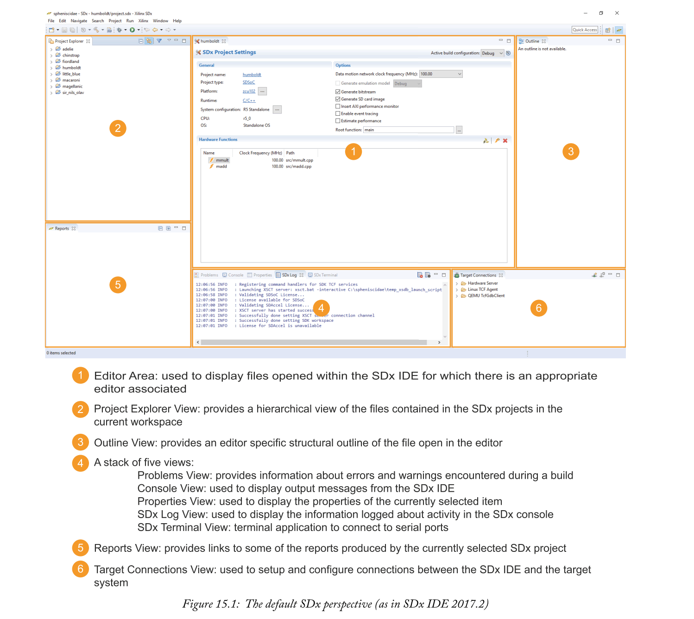

### 15.2.2  Introducing the Full-System Optimising Compiler
在考虑了SDX IDE的外观之后，我们现在将深入研究它的功能。

SDx的主要功能由完整的系统优化编译器提供。正如第15.1节所提到的，该工具利用了一些Xilinx Vivado设计工具套件，也许最好将其视为工具链本身。对SDx工具链的输入是用C语言、C++语言、OpenCL语言或这些语言的组合来描述的系统，尽管我们的讨论将集中在用C或C++编写的系统上。

SDX工具链的简化表示如图15.2所示，其中可以观察到有三个主要子工具：**SDSCC和SDS++编译器以及SDS++链接器**。SDSCC编译器用于将C语言源处理为对象代码，以便在ARM处理器上执行，或在PL中实现RTL代码。**标记为软件**实现的C代码**使用SDSCC编译器调用的GCC编译器编译**。为了生成C源的**rtl代码**，sdscc编译器**调用vivado hls工具**[3]。从C++语言源生成对象和RTL代码的过程类似于C语言源的过程，除了使用**SDS++编译器代替SDSCC**之外，还使用了**G++编译器将C++源编译成目标代码**。SDx工具链中的其余工具由SDS++链接器调用。调用链接器将gcc和g++编译器生成的对象代码与任何预构建的库链接起来，以创建可执行文件。**建议使用与SDSCC和SDS++工具[4]相同的编译器工具链和选项来构建库**，自2016.1版以来，这些工具都是基于Linaro的GCC编译器工具链[5]。**通过调用vivado综合和布局布线工具[6]，从rtl代码生成位流**。最后，使用**bootgen**实用程序[7]结合生成的可执行文件和位流创建引导映像。此启动映像可以加载到SD卡上并用于启动zynq设备。

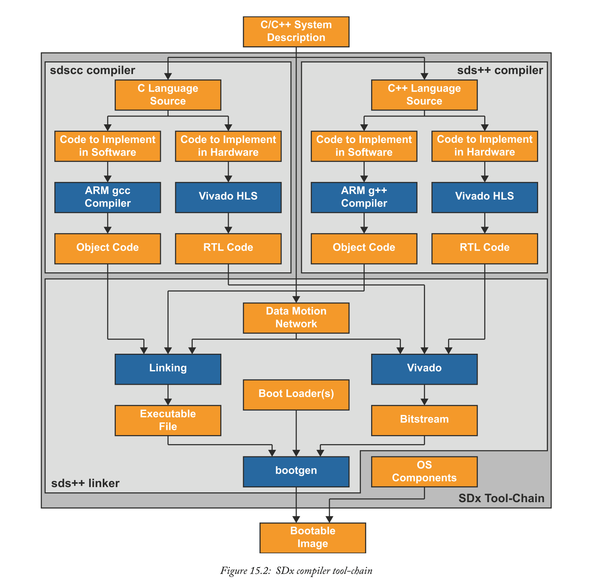

### 15.2.3  Data Motion Networks
到目前为止，我们已经描述了C或C++源是如何转换成硬件或软件组件的，但是我们还没有考虑过如何将这些工具链集成到一起形成一个连贯的系统。**编译源代码时，标记为硬件实现的函数将传递给vivado hls工具以生成RTL代码，而不是生成任何对象代码。因此，SDX工具链将源代码中对这些函数的调用替换为对stub函数的调用。这些stub函数是自动生成的，并调用底层驱动程序来处理由标记为硬件实现的函数生成的pl中的ip块与ps内存或其他ip块之间的数据传输**。

SDX创建数据运动网络，以便在创建的IP块和PL中的PS或其他IP块之间移动数据。每个**数据运动网络由三部分组成**：
- 创建的IP块要连接到的**PS端口或接口**；
- Data Mover
- 已创建的IP Block的接口

除非由设计者通过pragmas指导，否则SDX试图根据对源代码的分析来推断最优的数据运动网络。

PS端口是用于在PS和PL之间传输数据的端口。选择的端口类型取决于两个因素：**要传输的数据量和访问PS缓存的要求**。端口选择标准也在第278页第11.3.7节中进行了更广泛的讨论。

Data Movers负责在创建的IP块的接口和PS存储器或其他IP块之间传输数据。**Data Movers的推断取决于用于函数参数的数据结构类型、要移动的数据量以及用于存储数据的内存是否物理上是连续的**。
> 物理上相邻的内存是一个单一的、连续的内存区域。在正在运行的系统上获取大量未使用的物理连续内存可能很困难，通常需要仔细的内存管理。一些OS实现了一个虚拟内存系统，将用户应用程序从管理物理内存的任务中抽象出来。用户应用程序使用需要由操作系统转换为物理内存地址的虚拟内存地址。连续虚拟地址不一定映射到物理内存中的连续地址。

对于**非常小的数据量**（不超过300字节）、可以推断为通用端口和简单的AXI FIFO，因为数据传输时间可能小于AXI Scatter Gather Direct Memory Access（DMA）引擎。对于**较大的数据量**，可以使用DMA通过高性能端口传输数据，因为与通用端口相比，它提供的数据传输速率更高。在这种情况下，最有效的数据移动器是AXI Simple DMA。然而，这有两个限制：**它最好用于不超过32MB的传输，并且数据必须在物理上连续的内存中**。如果超过这些限制中的任何一个，则将推断为AXI Scatter Gather DMA。SDx推断的默认数据移动器如表15.1所示。此处只列出了默认数据移动器，其他移动器可用。有关这些的更多信息，请参见[8]。

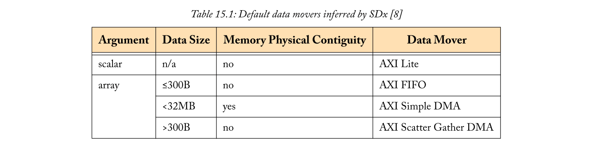

**对于大于300字节的传输，数据缓存部署成为选择PS端口的一个因素**。当在可缓存内存中分配数据时，SDx工具链**假定必须为在ps和pl之间传递的数据保持缓存一致性**，并且通常**推断出缓存一致端口**。但是，此规则有一个例外：当传输的数据量远大于缓存的大小时，这可能会导致使用缓存一致端口时的缓存抖动，因此会**推断出非缓存一致端口**。对于高速缓存一致性端口，**高速缓存一致性由PS内的硬件维护，提供对高速缓存中保存的数据的快速访问。相反，当使用非缓存一致性端口时，缓存一致性由软件维护**。在这种情况下，SDx工具链生成的Stub函数需要在将数据从PS传输到PL之前执行缓存刷新，并在将数据从PL传输到PS之前使缓存失效。与硬件强制的缓存一致性相比，这些额外的软件指令会导致性能损失。

**当数据分配到非缓存内存中时，也会推断出非缓存一致端口**。当知道数据不会出现在高速缓存中时，高速缓存一致性端口比非高速缓存一致性端口失去了许多潜在的性能优势，特别是因为由用于非高速缓存一致性端口的SDx工具链生成的Stub函数不需要包含代码来保持高速缓存一致性。此外，缓存一致性端口倾向于与PS中的处理器共享用于内存访问的资源，而非缓存一致性端口则不共享。这意味着使用非缓存一致性端口可以降低内存资源与处理器竞争的可能性，从而影响整个系统性能。

IP块上的接口本身是从硬件中实现的函数的参数推断出来的。为不同的函数参数类型推断出的默认接口如表15.2所示。同样，这里只显示默认的IP接口，还有其他可用的接口。这些将在第16章中进一步讨论，读者也可参考[8]了解信息。

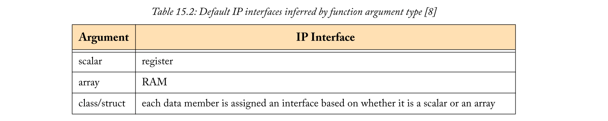

### 15.2.4  Directing the SDx Tool-Chain
在讨论数据运动网络的过程中，我们提到了用户为数据运动网络指定默认推断的替代组件的能力。这样做的机制是通过对C/C++源代码输入到SDx工具链中的pragmas规范的说明。这些pragmas用于指导SDX工具链优化系统，可以直接指定特定组件的使用，或者提供编译器在编译时无法确定的进一步信息。在源代码中输入的所有特定于SDX的pragma都采用pragma sds<pragma>格式。表15.3提供了一个特定于SDX的pragma选择的摘要。

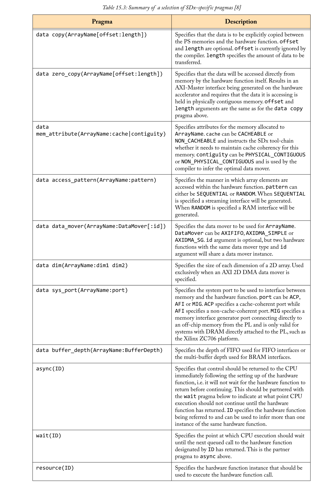

除了最后四个之外，表15.3中总结的所有pragmas都应该被插入到它们所引用的硬件功能声明之上的C/C++源代码中。表15.3中的最后四个pragma应该输入源代码，就在它们所引用的硬件函数的特定调用的正上方。

在使用这些pragma时需要注意的一个重要点是，它们倾向于向SDx工具链提供信息，而不强制该信息的有效性。例如，如果我们使用一个pragma来指定一个正在传递给硬件函数的数组被分配到非缓存内存中，那么SDx工具链将不会在stub函数中生成软件来维护该数组的缓存一致性。如果我们在源代码中调用该硬件函数并将分配在可缓存内存中的数组传递给它，那么在将数据传输到硬件之前，不会执行所需的缓存刷新操作。这意味着传输到IP块的数据可能无效，我们的系统可能会产生一些非常奇怪的结果。使用pragmas时应注意确保其准确性。

关于这里总结的语用的更多信息，以及它们的一些用法示例，可以在[8]和[9]中找到。

### 15.2.5  SDx API
SDx提供了一个库，`sds_lib`，它为嵌入式系统开发人员提供了许多非常有用的功能。表15.4总结了一些可用功能。为了使用这些函数中的任何一个，必须通过在C/C++源代码中插入`#include “sds_lib.h”`的行来包含库。需要注意的是，`sds_lib`使用了`size_t`的数据类型，这要求在包含`sds_lib`之前包含`stdlib.h`。

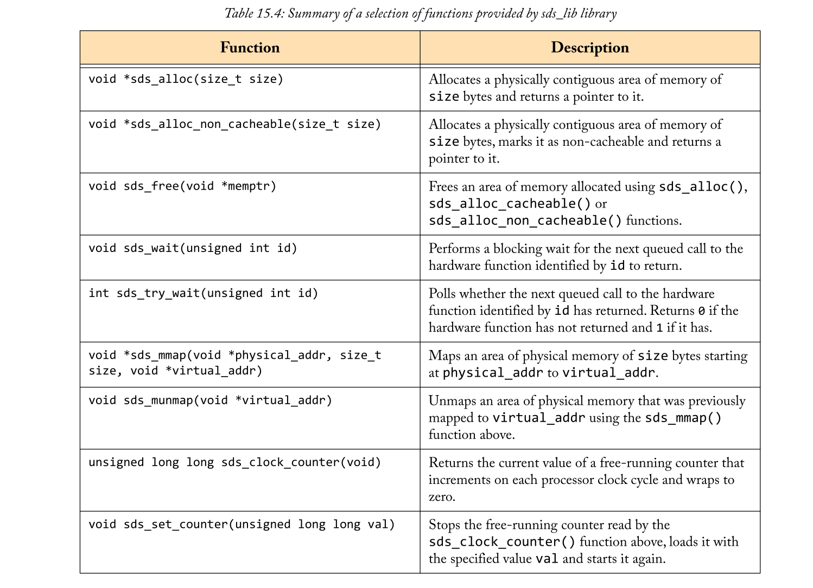

### 15.2.6  SDx Tool-Chain Settings
在SDX工具链中有GCC编译器和Xilinx Vivado套件中的一些工具。在正常情况下，这些工具的行为是可配置的，为了根据我们的特定需求构建最佳系统，尽管SDx提供了简化的接口，但仍需要保持对这些工具配置的控制。

负责调用SDx工具链中所有其他sub-toos的工具是`sdscc`和`sds++`，如第384页图15.2所示。调用这两个工具时，通过将选项传递给它们，我们可以控制它们调用的子工具。从CLI中，这非常简单，这些工具选项的完整详细信息在[8]中给出。但是，在使用SDx IDE时，用户是从对`sdscc`和`sds++`的直接调用中抽象出来的。相反，SDx IDE使用构建配置，这是Eclipse IDE的另一个特性。构建配置是一组用于构建系统的工具设置。通过具有多个构建配置，可以以不同的方式构建系统，以满足特定构建的目的。

自2016.1版以来，SDX IDE默认提供了两种构建配置：Debug和Release。这两种构建配置之间的区别是用于GCC编译器的设置。Debug配置用于构建Debug系统。因此，它为gcc编译器设置了-g选项。这将导致在对象文件中包含映射机器代码和源代码之间的其他数据，从而使调试工具能够使用这些数据。它还编译代码，而不应用任何优化，简化了机器代码和源代码之间的映射任务，代价是生成潜在的效率较低的机器代码[10]。另一方面，Release配置旨在生成性能最佳的系统。因此，它省略了对象文件中的额外调试数据，并使用最高的优化设置编译代码，以可能更大的可执行文件为代价来实现最佳性能的机器代码。每个构建配置传递给sdscc和sds++工具的选项如表15.5所示。传递给sdscc或sds++工具的任何选项，如果未被明确识别为另一个子工具，则假定为GCC编译器的选项，因此在调用它们时传递给这些编译器[8]。有关GCC编译器可用选项的更多信息，请参见[10]和[11]。

将工具设置传递给vivado工具比GCC编译器要稍微复杂一些，首先我们必须了解SDx工具链如何调用vivado工具。

**对于每个标记为在硬件中实现的函数，分别调用vivado hls工具**。特定于正在综合的函数的选项可以在这些调用中的每一个调用上传递，因此，这些选项不构成我们在这里关注的更一般的构建配置的一部分。因此，我们将在第16章讨论如何使用Vivado HLS工具。

#### Modifying and Creating Build Conf igurations
建立了构建配置如何控制SDX工具链中子工具的设置之后，让我们看看如何修改默认配置并创建自己的配置。

首先，我们将研究如何修改现有的构建配置。为此，我们需要访问要修改的生成配置的C/C++构建设置。可以通过选择项目菜单下的属性来访问这些属性，如图15.3所示。

这将打开项目的属性对话框，如图15.4所示，从这里我们可以将命令行选项设置为从`C/C++Budid > Setting`菜单传递给sdscc和sds++工具。构成SDx工具链的三个工具（sdscc编译器、sds++编译器和sds++链接器）的工具选项可以单独设置。可以使用每个工具下列出的适当工具选项类别设置许多可用选项。其余选项可以通过在Catch All Miscellaneous类别下输入命令行选项来设置。

可以通过选择`Manage Configurations...`来创建自定义生成配置，然后选择`New…`。可以复制现有生成配置中的设置，实际上，从默认生成配置之一复制设置可能是创建自定义配置的最简单起点。定制的构建配置可以用来指定不同的综合或实现策略，或者链接到特定的软件库。

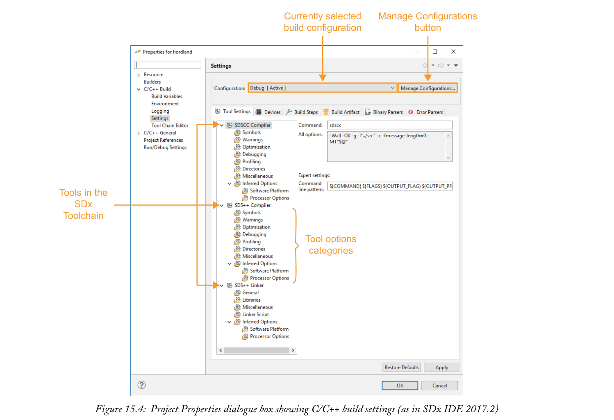

## 15.3  The Design Flow
在上一节中，我们对SDX更加熟悉，在本节中，我们将更详细地了解如何使用它来设计Zynq设备的系统。图15.5显示了使用SDx的典型设计流程。我们将在后面的章节中更详细地介绍这个流程的每一步，但现在我们将做一个简短的概述。

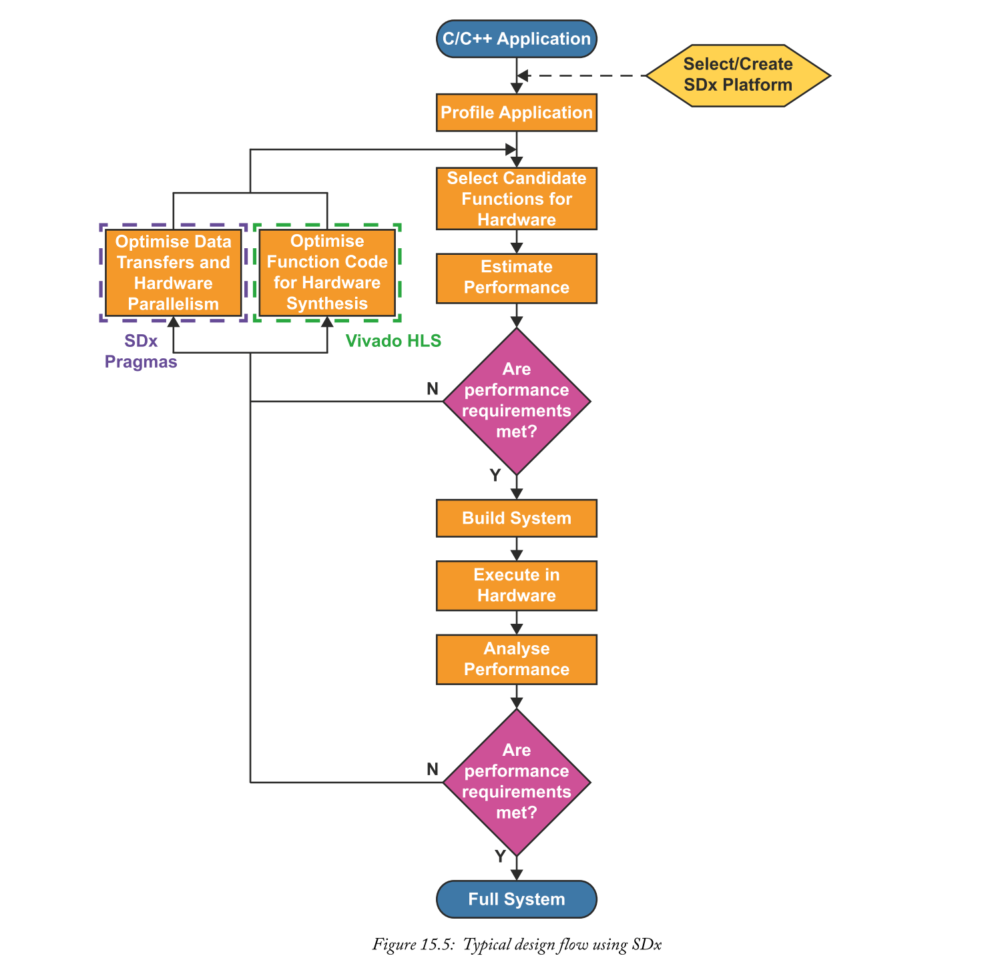

### 15.3.1  SDx Platform
设计流的输入是我们希望在ZYNQ设备上执行的C/C++应用程序。鉴于本章前面的讨论，希望这不会是一个惊喜。可能不太可能预期的是图15.5中对SDx平台的引用。为了简化起见，到目前为止，我们忽略了任何有关SDx平台的内容，但是现在我们正在更详细地研究设计过程，我们将在这里介绍它们。

**SDx平台提供了基本的系统设计，作为SDx项目实现的核心**。它包括硬件和软件元素。**在硬件方面，SDx平台定义**：
- PS配置，包括与PL的接口；
- PL和外部设备之间的接口；
- SDx平台所需的任何IP块。

**在软件方面，SDx平台定义**：
- 目标操作系统；
- 引导系统所需的引导文件；
- 平台设计中包含的IP设备驱动程序；
- 要链接到用户应用程序的任何软件库；
- 根文件系统（如果需要）。

每个SDx项目都必须以SDx平台为目标。SDx项目通过从硬件中标记为实现的功能生成硬件协处理器，并通过数据运动网络将其与平台硬件接口，扩展了基础平台设计。在软件中，SDx项目的用户应用程序部分能够利用SDx平台提供的目标操作系统、设备驱动程序和软件库。从概念上讲，可以认为SDx项目类似于第12章中介绍的软件栈，应用程序运行在SDx平台之上。图15.6显示了这一想法的示意图。
> 这里使用术语协处理器来区分作为SDx项目一部分生成的IP和作为项目SDx平台一部分的IP。

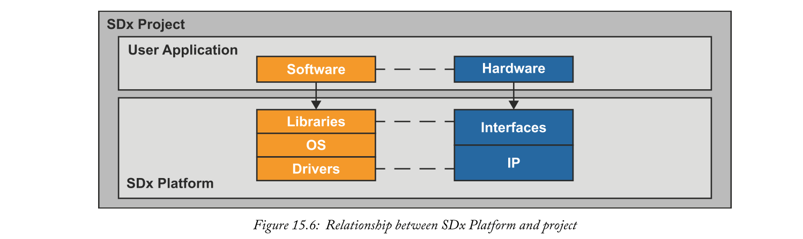

作为SDx的一部分，提供了几个支持一系列开发板的通用SDx平台。例如：
- ZCU102
- ZC702
- ZC706

其他SDX平台也可用于上述板、针对特定应用领域的板和替代板。[12]中维护了可用的更普遍的SDx平台列表。使用这些通用平台是开始开发SDx项目的好方法。它们还可以在并行开发自定义SDx平台的同时，允许SDX项目开发，从而提高开发团队的生产力。事实上，根据项目的具体要求，可能会发现通用平台是足够的，不需要开发定制平台。当SDx平台定义的PS配置适合项目时，并且在PL中不需要除协处理器以外的任何特定硬件时，就会出现这种情况。

**在此阶段需要注意的一个关键点是，任何与直接连接到PL的外部设备的接口，即不通过PS的接口，都必须在SDx平台中实现**。

我们将详细介绍SDx平台，包括在第19章中创建自定义平台所需的步骤。更多信息也可参见[13]。

### 15.3.2  Selecting Initial Candidate Functions for Hardware
在设计流程的这一点上，我们有了C/C++应用程序，我们选择了一个SDX平台来构建我们的项目。接下来，我们要选择要在硬件中实现应用程序中的哪些函数。

通过在硬件中实现一些功能，可以获得相当大的性能改进。然而，能够准确地预测哪些功能需要在硬件中实现，以产生一个最优的系统，这可能是一门黑暗的艺术。有些算法天生不适合PL的体系结构，在PS中性能最好。但是，其他适合于PL中加速的算法可能不会限制系统的执行速度，而加速它们对整体性能的影响很小。PL结构的可用性还可以限制设计器可以在硬件中实现的功能，这需要明智的选择来权衡资源使用与系统性能。此外，**通过在软件和硬件之间移动函数获得的任何感官上性能改进必须与在PS和PL之间移动数据时产生的性能开销进行权衡**。因此，我们建议采用迭代方法，该方法得到SDx的充分支持。

为了在硬件上实现候选函数的初始选择，检查软件中运行的C/C++应用程序的性能是明智的。有大量可用的软件分析工具，对主机系统上运行的应用程序进行分析是一项相对简单的任务。然而，为了更准确地测量应用程序的性能，我们理想地希望在Zynq PS上执行时对其进行分析。SDx提供了这样做的实用程序，第16章将更详细地讨论它的使用。根据分析的结果，我们能够识别应用程序中任何计算密集的热点。这些功能的加速可能对整个系统性能产生最大的影响，因此，最初应将这些功能视为硬件加速的候选者。

### 15.3.3  Estimating System Performance
仅仅因为函数是zynq ps中的计算瓶颈，并不意味着它适用于pl中的加速。同样，在没有设计者进一步指导的情况下，sdx工具链和vivado hls工具也不太可能推断出最佳系统设计。因此，我们想测试我们的系统在使用硬件加速功能时是否满足我们的设计要求。最明显的方法是构建系统、运行系统和测量性能，这是一种完全有效的方法。然而，构建一个在PL中使用定制硬件的系统所花费的时间并不重要。通过这里提出的迭代方法，实际上开发一个最优系统将是一个令人沮丧的缓慢过程，如果我们每次改变硬件中实现的功能时都必须执行一个完整的系统构建的话。至关重要的是，SDx允许在不需要执行整个构建过程的情况下对系统性能进行评估。这有助于在设计过程的早期提供特定系统配置的性能指示，尽管在这样的早期阶段并不总是能够准确地确定性能。第16章将进一步详细讨论系统性能评估。

### 15.3.4  Optimising System Performance
如果性能评估结果不符合我们的要求，或者如果有进一步性能改进的余地，我们必须对SDx项目**进行一些更改，以提高性能**。有几种方法可以用来解决这个问题：
- 优化软件；
- 优化硬件中实现的功能的代码；
- 优化与加速器之间的数据移动；
- 选择硬件中实现的可选或附加功能。

与创建数据运动网络的方式类似，如第15.2节所述，Vivado HLS工具试图通过**分析源代码来推断用于加速的函数的最佳硬件实现**。如果应用程序C/C++代码最初不是用硬件的推理来编写的，那么就有可能以允许VIVADO HLS工具推断更高效的硬件体系结构的方式重构代码。除了重构源代码之外，Vivado HLS工具的综合行为还可以通过指令的规范显式地定向。这些过程在第16章中有更详细的解释。

潜在性能改进的另一个来源是**硬件加速器之间的数据移动**。这受许多参数的影响，例如系统端口或使用的端口；为数据分配的内存是否可缓存；使用的DMA引擎的类型；可用硬件加速器的实例数；以及对加速器进行多个调用时使用流水线。这些参数都可以使用表15.3中描述的pragmas进行配置。

提高系统性能的最后一个方法是**重新考虑为硬件实现选择的功能**。如果在硬件上加速了一个额外的功能，并且该功能的性能改进大于通过将其移动到PL引入的任何数据传输开销，那么整个系统性能将得到改善。但是，如果加速硬件功能的性能改进被与在pl中实现该功能相关的数据传输开销所抵消，那么可以通过将该功能的执行移回ps来提高总体系统性能。此外，如前所述，有些功能不适合硬件加速。也就是说，这些算法的结构在本质上更适合于ps中可用的处理器的结构，强过在pl中实现的任何自定义结构。

例如，一个在本质上是不可避免地连续的函数可能会受益于PS中可用的更高处理器时钟频率，因此，在PS中实现该函数最能满足系统性能的要求。一些软件构造不能很容易地映射到硬件，例如编译时其边界未知的循环、递归函数调用和系统调用。硬件生成软件编码指南见[8]。

一旦应用了系统优化，就可以再次估计系统性能，并且可以重复执行此过程，直到用户对系统的估计性能满意为止。

### 15.3.5  Analysing System Performance
现在，我们对系统的估计性能感到满意，我们希望全面构建它并测量实际性能。这可以通过在Zynq设备上执行应用程序时对其进行分析来实现，方法类似于用于选择硬件加速的初始候选函数的分析。这两个分析应用程序之间有一个关键区别，即当分析应用程序以选择硬件加速的候选函数时，执行每个函数所花费的相对时间就足够了，而当测量优化系统的性能时，我们可能希望测量绝对执行时间。同样，第16章将进一步讨论SDx中可用的分析实用程序。

如果我们系统的测量性能不符合设计要求，我们必须再次寻求优化设计。在优化系统进行性能评估时，执行此操作的过程与前面描述的过程相同。这个优化过程再次重复执行，每次测量系统性能，直到设计者对测量的系统性能满意为止。在这一点上，我们已经成功地使用SDx构建了硬件加速系统。

### 15.4  SDx Project Hierarchy
到目前为止，在我们对SDx的简要概述中，我们已经研究了如何使用它来设计硬件加速系统以及支持它的一些工具。在构建过程中，**SDx及其许多基础工具生成中间产品以及有关其进展和状态的大量信息**。这些数据大部分保存在SDx项目层次结构中的文件中，这些文件可以为用户提供有价值的信息。因此，仔细检查SDx项目的结构并确定我们可以在哪里访问这些数据是明智的。我们将在SDx项目层次结构的顶层开始我们的旅程，深入其中，像任何有自重的导游一样，强调沿途的兴趣点。

从最上面开始，SDx项目有一个根目录，以项目命名，位于工作区中。图15.7显示了一个示例SDx项目的扩展根目录，它出现在SDx IDE的Project Explorer视图中。前三个子目录，即二进制文件、归档文件和include，可能不像它们看起来的那样。如果您要在文件系统中浏览到SDx项目根目录，您将无法在其中找到列出的目录。这是因为它们实际上不是文件系统中的目录，而是虚拟分支。它们的目的是分别列出与项目关联的可执行文件、库和头文件。图15.7中列出的下两个目录是构建目录。这些目录是在构建项目时创建的，它们包含在构建过程中生成的数据。该目录是根据用于构建项目的构建配置命名的（我们将立即深入研究构建目录）。src目录只包含项目的源文件。根目录中包含的最后一个元素是SDx项目文件。我们以前在设置构建选项时遇到过这个文件，但现在我们将停止查看。

当SDx项目文件在SDX IDE中打开时，它显示项目的设置，如图15.8所示。除了`Active  build  configuration`外，此文件中的大多数设置都被划分为三个不同标题下的部分。一般项目信息在`General`标题下提供。

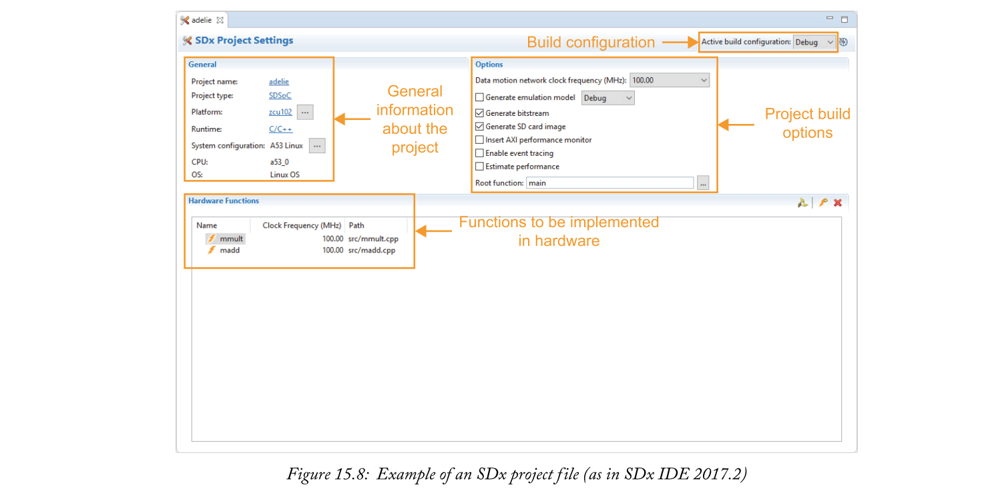

这包括一个链接，指向有关SDX项目所针对的SDx平台的进一步信息，其示例如图15.9所示。在Hardware Functions标题下，用户可以选择硬件中实现的功能及其目标时钟频率。他们还可以从这个标题下启动Vivado HLS GUI。数据运动网络时钟频率在Options标题下指定，该标题还包含一组构建选项，用户可以指定项目应用程序root函数（请注意，这与用于性能估计的perf root函数不同）。

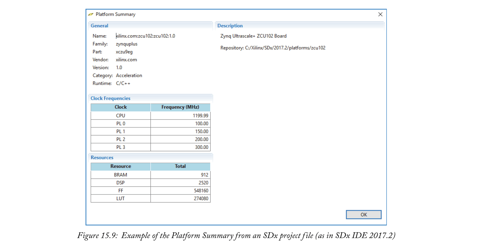

到SDx项目层次结构中。扩展的构建目录示例如图15.10所示。从构建目录的底部开始，有三个生成文件：makefile、objects.mk和sources.mk。这些文件由sdx自动生成，用于调用构建过程。makefile文件是顶层makefile，它包含build目录中的其他makefile，以指定生成的目标。build目录还包含为项目生成的bitstream（用于编程pl）和应用程序可执行文件（用于在ps上运行）的副本，分别是<project>elf.bit和<project>elf文件。src目录包含项目已编译源文件的副本。sd_card目录的精确内容因目标操作系统而异，但始终包含引导映像、BOOT.BIN和一个readme.txt文本文件，该文件解释目录的内容。将sd_card目录中包含的文件复制到SD卡应允许目标板从SD卡启动。在构建目录中要检查的最后一个项目是_sds目录。此目录包含来自SDx工具链和SDx本身的报告和中间产品。因此，有必要仔细观察。

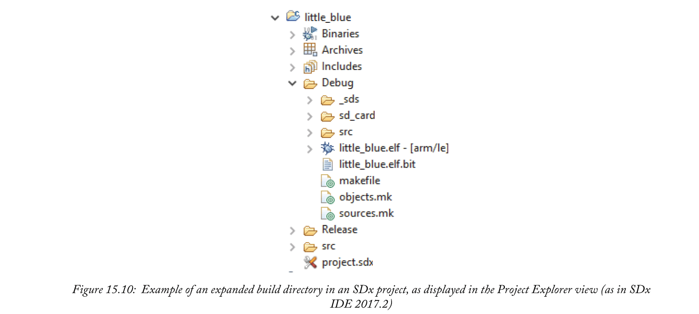

图15.11显示了SDx项目层次结构中扩展的_sds目录的示例。首先要提到的是，目录中的大多数子目录看起来都是灰色的，在它们的图标中有一条线。这是完全正常的，并且只是SDx IDE指示这些项是由SDX工具链调用的一个后端工具生成的方式。SDx目录中唯一由SDx本身生成的子目录是swstub和trace目录。在第15.2节中提到，SDx工具链将应用程序源代码中对硬件加速函数的调用替换为对处理硬件设置和数据传输的stub函数的调用。swstubs目录包含应用程序源代码的副本，这些源代码被修改为调用这些stub函数，以及由SDx生成的支持此功能的其他软件文件。同时，跟踪目录用于包含有关在系统上执行事件跟踪的数据，我们将在第18章进一步讨论。

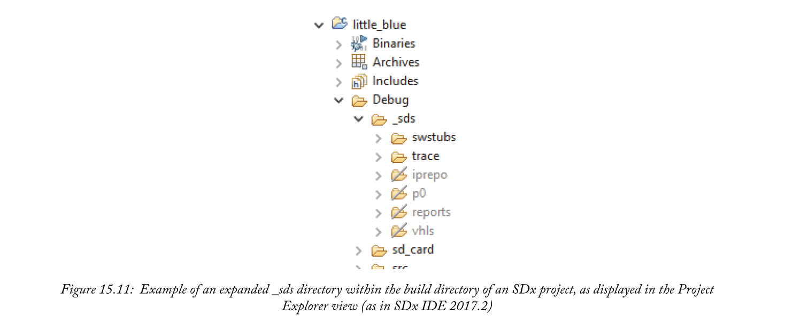

继续目录结构，`iprepo`目录只是Vivado HLS工具从标记为硬件实现的应用程序函数生成的IP核心的存储库。`p0`目录包含与用于创建系统位流的Vivado IP Integrator（IPI）项目相关的文件和子目录。这包括可以在Vivado工具中独立打开和查看的实际Vivado IPI项目，Vivado IPI项目生成的报告和日志文件，以及用于在Vivado IPI中实例化系统设计的Tcl脚本。报告目录是相当简单的。它包含记录SDx工具链活动的报告和日志文件。其中包括数据运动网络报告data_motion.html，它报告SDx工具链推断的数据运动网络的详细信息。

此目录中包含的log-files对于调试系统生成的问题尤其宝贵。虽然在系统构建期间，许多有用的消息被打印到SDx IDE的控制台视图中，但此目录中的日志文件以及子工具特定目录中包含的报告，可以更全面地了解构建过程中发生的情况。硬件加速器的Vivado HLS项目文件包含在vhls目录中。每个加速器都是使用其自己的Vivado HLS项目以及此目录中保存的相关项目文件生成的。此目录还包括用于上次运行Vivado HLS工具的日志文件和用于在Vivado HLS工具中创建硬件加速器的Tcl脚本。

这将结束我们对SDx项目层次结构的介绍。我们已经在这里指出了层次结构的主要特性，但是为了熟悉SDx项目目录的结构，是值得研究的，因为其中包含大量有用的信息。

## 15.5  Chapter Review
本章介绍了如何使用SDX设计软件定义的系统，以便在Zynq设备上实现。概述了使用SDX与传统开发工具相比的主要优点，并介绍了SDX IDE及其底层操作。我们还建议使用SDX的工作流。在随后的章节中，我们将更详细地描述此工作流最相关的特性，以使读者能够使用SDX开发Zynq目标系统。

