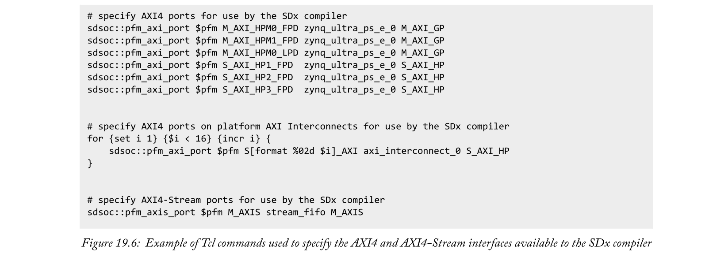

# Chapter 19 Custom SDx Platforms
SDx平台提供基础硬件设计和软件组件，并通过特定于应用的硬件和软件进行扩充，以创建SDx项目。因此，SDx平台的组成对于确定针对该平台的SDx项目的能力至关重要。

在本章中，我们将讨论创建自定义SDx平台的过程。我们将研究为什么我们希望创建一个定制的SDx平台、所需的关键组件以及如何生成它们。我们还将简要概述测试和使用定制SDx平台的程序。

## 19.1  Why might we want to develop a custom SDx Platform?
**每个SDx项目都必须以一个SDx平台为目标**。虽然SDx提供的SDx平台范围有限，第三方也提供满足许多系统设计要求的其他平台，但有些系统设计需要开发定制的SDx平台。需要开发定制SDx平台的最明显原因是针对现有平台不支持的主板。但是，系统设计者可能还需要开发定制的SDx平台，以满足特定应用的需求，方法是:
- 添加驱动程序或更改操作系统；
- 更改PS设置；
- 向PL添加IP块或更改接口；
- 提供完整的PL设计作为软件开发的起点。

定制SDx平台的开发更类似于传统的硬件开发技术，而不是SDx采用的软件定义流程。这是因为SDx平台提供了底层硬件设计和软件组件，使得软件定义的流程能够利用抽象。开发自定义SDx平台时，参考SDx附带的SDx Platform会有所帮助，这些平台可以在SDx安装目录的`/platforms/`和`/samples/platforms/`子目录中找到。

## 19.2  SDx Platform Structure and Components

为了开始我们对SDx平台创建过程的描述，我们将检查构成SDx平台的结构和组件。这将给出创建一个平台需要生成的元素的更清晰的概念。

SDx平台由许多组成部分组成。典型SDx平台的主要部件和结构如图19.1所示。从图19.1所示的目录结构中要注意的一个要点是，构成平台的大多数组件都包含在`hw`或`sw`目录中。这些目录分别代表平台的硬件和软件部分。将这两个元素稍微分开考虑是很有用的，事实上，在创建SDx平台时，往往先开发硬件部分，然后是软件部分。

SDx平台的硬件部分基于Vivado设计套件项目。它定义**了基础硬件设计，当构建针对平台的项目时，SDx编译器可以扩展该基础硬件设计**。基础硬件设计**定义了PS配置、PS和PL之间可用的接口和时钟信号、PL和外部设备之间的任何直接接口以及作为平台一部分的任何附加的IP块**。我们将在第19.3节中详细介绍硬件组件。

SDx平台的软件部分**至少定义了平台支持的操作系统，并提供了使用这些操作系统引导Zynq目标所需的文件**。除此之外，SDx平台的软件部分还可以包含许多可选元素。因此，平台`sw`目录的内容和结构，如图19.1所示，比`hw`目录受到更大程度的变化。平台`sw`部分的可选元素包括可以包含在针对平台的应用程序中的软件库，这是基础硬件设计的预构建版本，用于加快构建不包含任何额外硬件和文件以支持平台SDx仿真流程的项目。第19.4节对软件组件进行了更详细的检查。

### 19.2.1  Metadata Files
所有SDx平台中都存在三个元数据文件:硬件元数据文件、软件元数据文件和顶级平台元数据文件。这些文件的**目的是将平台硬件和软件组件的必要信息传递给SDx编译器，以便能够构建以平台为目标的系统**。一旦平台的所有硬件和软件组件都可用，SDx的`sdspfm`实用程序就可以用来生成元数据文件，这将在第19.6节中进一步讨论。

硬件和软件元数据文件分别在第19.3节和第19.4节中进一步讨论。顶层平台元数据文件位于平台的顶层目录中，名为`<platform>.xpfm`，如图19.1所示。`sdspfm`实用程序生成的顶层平台元数据文件的示例如图19.2所示。该文件包含平台Device Support Archive(DSA)和软件元数据文件的位置以及平台的描述。DSA文件包含平台硬件设计的Vivado设计套件项目，以及硬件元数据文件。

### 19.2.2  Sample Applications

图19.1所示目录结构的最后一部分是可选的示例目录。该目录包含平台要使用的示例应用程序。当位于该目录中时，当在SDx集成开发环境中创建针对该平台的SDx项目时，示例应用程序将作为模板提供。第19.5节给出了如何在自定义SDx平台中包含示例应用程序的更详细解释。

## 19.3  SDx Platform Hardware Component
通常，创建自定义SDx平台的第一步是生成硬件组件。这个步骤可以进一步细分为两个主要任务:在Vivado设计套件项目中开发平台硬件设计和生成平台硬件元数据文件。
### 19.3.1  Developing the Platform Hardware Design
本质上，平台硬件设计只是针对适当Zynq设备或板的硬件设计。关于创建这样一个设计的更多信息可以在[1]，[2]和[3]中找到。然而，为了使平台硬件设计与SDx兼容，设计必须满足几个标准。

该设计必须包含在Vivado设计套件项目中，该**项目的名称与正在开发的平台的名称相匹配**，并包括一个IP集成器框图。IP集成器框图必须包含一个用于**定义IP配置的PS IP模块**。平台所需的**任何附加硬件也必须包括在内**，例如将PL连接到外部设备所需的硬件。任何不属于标准Vivado IP目录的平台硬件都需要使用[1]中描述的程序在本地纳入Vivado设计项目。

为了使SDx编译器能够在构建SDx项目时添加`data movers`和硬件功能块，SDx平台基础硬件设计必须使SDx编译器可以使用接口。PS上至少**必须提供一个通用AXI主端口和一个AXI从端口**。需要通用AXI主端口来启用在PS上执行的软件来**控制**SDx编译器添加的IP，而需要AXI从端口来允许SDx编译器添加的IP**访问**系统内存。

当然，平台设计者可能希望提供比SDx编译器最少所需接口更多的接口。以下类型的接口与SDx编译器兼容:
- AXI4 or AXI4-Stream;
- Clock;
- Reset;
- Interrupt.

尽管SDx编译器可以兼容这些类型的接口，但使用它们仍然有一些相关的注意事项。AXI4-Stream必须包括`TLAST`和`TKEEP`边带信号，以便与SDx编译器实例化的Data movers兼容。Clock信号必须通过`Processor System Reset IP`模块连接，以提供同步复位信号，如图19.3所示。Interrupt信号必须集合在一起，并通过一个`Concat` IP模块连接到PS IP模块的中断端口，如图19.3所示。其他接口可以在基础硬件设计中内部使用，但是SDx(或由SDx生成的任何IP核)将只连接到上述接口。

当平台硬件连接到PS的AXI端口时，设计者可能希望选择与针对平台的SDx项目生成的硬件共享该AXI端口。为此，必须将一个`AXI Interconnect IP`块连接到有问题的AXI端口。平台硬件可以通过`AXI Interconnect IP block`模块连接到AXI端口，而`AXI Interconnect IP block`模块上未使用的AXI端口可以供SDx编译器使用，以允许其他硬件也连接到PS AXI端口。具有最低有效索引的AXI互连IP块上的端口应用于连接基本硬件设计中的任何IP核，而具有最高索引的端口则未被使用并可用于SDx。类似的情况也存在于通过Concat IP模块连接到PS 中断端口的中断信号中。平台硬件的中断信号应连接到中断端口的最低有效位。

一旦完成，平台硬件模块设计应得到验证。然后可以生成它所包含的IP的输出产品，并为设计创建一个顶级的RTL Wrapper。这允许描述平台硬件设计的硬件定义文件从Vivado设计套件项目导出，用于生成平台软件组件。有关执行这些任务的详细信息，请参见[3]。

为了能够长期使用，平台设计者可能希望通过SDx的多个版本来维护他们的SDx平台。SDx的每一个版本都包括并以Vivado设计套件工具的最新版本为目标。随着Vivado设计套件工具的每一个版本，标准Vivado IP目录中的许多IP模块都得到升级。如果这些IP模块中的任何一个构成了平台基础硬件设计的一部分，那么Vivado设计套件工具的新版本将要求它们在Vivado设计套件项目平台中进行升级。这是[3]中描述的一个简单过程。如果在尝试在SDx中构建之前，SDx平台基础硬件设计中的IP块没有充分升级，当SDx编译器调用Vivado设计套件工具时，可能会出现IP锁定错误。
### 19.3.2  Platform Hardware Metadata File
SDx编译器需要能够确定平台基础硬件设计提供给它的接口和信号，用于连接系统构建期间生成的附加硬件。该信息由平台硬件元数据文件传递给SDx编译器，该文件构成图19.1所示DSA文件的一部分。

平台硬件元数据文件可以由`sdspfm`实用程序根据Tcl脚本自动生成，Tcl脚本定义基础硬件设计中SDx编译器可用的接口和信号。该Tcl脚本是手动编写的，最多可分为六个步骤:
- 指定带有平台标识符和描述的平台硬件元数据文件的名称；
- 指定SDx编译器可用的平台时钟信号；
- 指定SDx编译器可用的AXI4和AXI4-Stream接口；
- 指定将用作Linux I/O平台设备的平台 I/O设备；
- 指定SDx编译器可用的平台中断信号；
- 编写平台硬件元数据文件。

根据平台硬件设计的内容和平台的预期用途，**平台 I/O设备和中断信号的规范是可选步骤**。

我们将使用一个示例Tcl脚本描述创建平台硬件元数据文件所需的步骤以及用于执行这些步骤的Tcl命令。这里将脚本分成几个部分，以帮助讨论每个步骤。

生成平台硬件元数据文件的过程从创建新的平台文件对象开始，这是使用`sdsoc::create_pfm`命令实现的，如图19.4所示。使用命名约定`<platform>.hpfm`，将指定平台硬件元数据文件名称的参数传递给该命令。该命令返回平台文件对象的句柄，该句柄可用于随后在脚本中引用平台文件。在图19.4中，平台文件对象的句柄被分配给变量`pfm`。

平台文件对象的名称和描述字段分别使用`sdsoc::pfm_name`和`sdsoc::pfm_description`命令进行设置，这在很大程度上是不言自明的。关于名称字段需要注意的唯一一点是，它应该以供应商、库、名称、版本格式给出。

SDx编译器可用时钟信号的规范遵循图19.5中的名称和描述字段的设置。这是使用`sdsoc::pfm_clock`命令执行的，该命令有六个参数。第一个参数是我们在其中设置值的平台文件对象的句柄。第二个和第三个参数分别是时钟端口的名称和时钟端口所属的IP块实例的名称。第四个参数为时钟信号分配唯一标识符，该标识符可以是任何非负整数。第五个参数指定时钟信号是否是平台的默认时钟信号，每个SDx平台中必须正好有一个时钟信号。最后一个参数是与该时钟信号相关联的处理器系统复位IP块的实例名。这些条目在设计中必须有相应的实例，因为工具会检查它们。

SDx编译器可用的AXI4和AXI4-Stream分别使用`sdsoc::pfm_axi_port`和`sdsoc::pfm_axis_port`命令来指定，如图19.6所示。这两个命令采用相同的四个参数。前三个参数分别是平台文件对象的句柄、端口的名称和端口所属的IP块实例的名称。最后一个参数描述了指定的端口类型。对于指定AXI4-Stream端口，最后的参数可以是M_AXIS或S_AXIS，这取决于端口是主端口还是从端口。指定AXI4端口时，最终参数的可能值范围更广，如表19.1所示。

当在平台AXI Interconnect IP块上指定可供SDx编译器使用的端口时，为该类型的端口指定尽可能多的空闲端口(最多可达单个AXI互连IP块上允许的最大数量)可能是有益的。这避免了SDx编译器由于平台AXI Interconnect IP块上缺少可用的AXI端口而不必要地将额外的AXI Interconnect IP块级联连接到原始块。SDx编译器在单个AXI Interconnect IP块上可用的多个端口的规范可以在Tcl脚本中以编程方式完成，如图19.6所示。表19.2按端口类型显示了单个AXI互连IP块上允许的最大端口数量。

要用作Linux I/O平台设备的任何平台 I/O设备都应该使用`sdsoc::pfm_iodev`命令声明，如图19.7所示。这是必要的，这样其他的Linux I/O平台设备可以在SDx编译器生成的代码中正确配置。`sdsoc::pfm_iodev`命令的第一个参数是平台文件对象的句柄。第二个参数是 I/O端口的名称，第三个参数是 I/O设备IP块的实例名称。`sdsoc::pfm_iodev`命令的最后一个参数是设备的类型。例如，如果设备的驱动程序使用Linux用户空间 I/O(uio)框架，它将是UIO，而如果它使用Linux内核驱动程序，它将是kio。Linux UIO框架将在第462页的“Linux内核”下进一步讨论。

图19.8中要赋值的平台文件对象的最后字段通过指定SDx编译器可用的中断信号来填充。这是使用`sdsoc::pfm_irq`命令实现的，该命令采用三个参数，分别是平台文件对象的句柄、指定的中断信号的名称和信号所属的Concat IP块的实例名称。类似于在AXI互连IP块上指定可用端口，可以编程方式指定多个中断信号，如图19.8所示。

一旦平台文件对象的所有字段都被填充，平台硬件元数据文件就可以生成了，这是通过调用`sdsoc::generate_hw_pfm`命令来实现的，如图19.8所示。平台文件对象的句柄作为命令的参数传递，该命令使用创建平台文件对象时指定的名称生成平台硬件元数据文件。

当使用`sdspfm`实用程序时，平台硬件元数据文件的生成是从平台创建者中抽象出来的，因为该实用程序生成DSA文件，该文件包含平台硬件元数据文件和基础硬件Vivado设计套件项目。

[4]提供了平台硬件元数据文件创建Tcl应用编程接口的更详细描述。

## 19.4  SDx Platform Software Component
SDx平台的软件组件包含SDx编译器为平台支持的每个操作系统构建引导映像所需的所有软件元素。可选地，它还可以包括预构建的硬件文件，以在系统中除了平台基础硬件设计之外没有实现任何硬件时加快系统构建过程，以及支持SDx仿真流程所需的文件。

### 19.4.1  Boot Files
我们将从讨论SDx编译器创建引导映像所需的软件元素开始。构建SDx项目时，SDx编译器的目标之一是创建一组文件，这些文件可用于:
- Boot the target Zynq device;
- Configure the PS and PL;
- Load the target OS and/or the application executable.

这些文件构成了引导映像。虽然SDx项目负责提供特定于应用程序的可执行文件和比特流，但SDx平台提供用于构建引导映像的其余组件。这些组件具体是什么取决于Zynq设备和操作系统的目标。SDx平台需要提供的引导映像组件的概要见表19.3，由目标Zynq设备和操作系统排列。

我们将根据目标操作系统将讨论分为两部分。首先，我们将描述SDx平台提供的引导文件，以便为针对Standalone和FreeRTOS OSs的系统创建引导映像，然后描述针对Linux操作系统的系统所需的引导文件。我们将讨论的一些软件元素，特别是第一阶段引导加载程序(FSBL)和ReadME文件模板，对于多个操作系统是通用的，因此我们对不同操作系统的引导文件的描述会有一些重叠。在Zynq MPSoC中，有两个处理单元，APU和RPU，可以用来引导设备。SDx平台支持的每个处理单元都需要一组单独的引导文件来引导设备。

#### First Stage Boot Loader
FSBL是Zynq设备启动时加载到内存并执行的启动映像的第一部分。它负责初始化PS，配置PL，然后加载并切换到第二阶段引导加载程序(SSBL)或应用程序可执行文件。FSBL执行的PS初始化基于平台硬件设计中定义的配置，并包含在从平台硬件Vivado设计套件项目导出的硬件设计文件中。**FSBL的内容不受目标操作系统的影响**，因此每个平台处理单元只需要构建一个FSBL，然后就可以用来引导该平台处理单元支持的所有操作系统。

FSBL可以从一个模板中构建，作为SDx中的一个应用程序项目。FSBL项目应基于Standalone OS，利用low-level软件提供对基本PS功能的访问。目标硬件平台必须基于从我们的平台硬件项目导出的硬件设计文件创建，并以FSBL将在其上执行的处理器为目标。硬件平台根据平台硬件项目中定义的配置提供初始化PS的代码。应该分别为Zynq-7000和Zynq MPSoC选择Zynq FSBL或Zynq MP FSBL应用程序模板。

构建FSBL项目产生的可执行文件是包含在SDx平台中的FSBL文件。有关构建FSBL的更多信息，请参见[5]。

#### Linker Script
对于以Standalone or FreeRTOS操作系统为目标的SDx项目，需要一个链接器脚本。该脚本指定应用程序在执行时要使用的内存位置。SDx项目的链接器脚本由SDx平台提供。平台设计者可以手动编写链接器脚本，尽管使用自动生成的脚本可能更有效，至少可以作为基础。

链接器脚本的自动生成非常简单，只需创建一个针对操作系统、处理器和硬件平台的新的应用程序项目，在该平台上执行针对该SDx平台的应用程序即可。创建FSBL时生成的硬件平台可用于此目的。创建应用程序项目后，可以在包含应用程序项目源文件的目录中找到链接器脚本。在将脚本包含在SDx平台中之前，平台设计者可能希望对此脚本进行修改，例如堆栈或堆的大小。
#### Readme File Template
当在SDx项目设置中选择生成SD卡映像的选项时，SDx编译器生成的SD卡映像包括一个名为`README.txt`的文本文件，通常，该文本文件包含与SDx项目构建的系统相关的信息及其使用说明。文本文件由SDx平台提供的模板文本文件生成。其中一个模板的例子如图19.9所示。这些模板的一个令人愉快的特性是使用占位符字符串，例如图19.9中的`<platform>`和`<elf>`，这些字符串会在SD卡映像中包含的`README.txt`中自动替换为从正在构建的项目中获得的适当值。

#### Platform Management Unit Firmware
对于以Zynq MPSoC设备为目标的SDx平台，还需要平台管理单元(PMU)固件来创建引导映像。在系统启动期间，PMU固件被加载到PMU RAM中，并实现用于管理Zynq MPSoC功耗PMU-side的API。这是PMU固件的简化描述，但足以满足我们的需求。PMU固件和电源管理应用编程接口的更多细节可在第10章，[6]和[7]中获得。

PMU固件是一个用户定义的程序，平台设计者可能希望提供一个定制的实现来与他们的平台一起使用。然而，我们在这里假设将使用SDx提供的模板PMU固件程序。生成模板PMU固件的过程与用于FSBL的过程非常相似。它是使用新的应用程序项目创建的，目标是在构建FSBL、PMU上的处理器和Standalone OS时创建的硬件平台。应创建一个新的板级支持包，并选择ZynqMP PMU固件模板应用程序。

通过构建PMU固件应用程序项目创建的可执行文件是包含在SDx平台中的文件。当APU或RPU用于启动Zynq MPSoC时，可以使用相同的PMU固件可执行文件。
#### Linux Boot Files
许多用于支持Linux OS的引导文件的生成方式与它们支持Standalone  or  FreeRTOS操作系统的方式相同。事实上，如果它们已经被生成来支持Standalone or FreeRTOS OSes，那么它们也可以简单地被重用来支持Linux OS。

这些文件是:
- FSBL;
- PMU firmware;
- Readme file template.

支持Linux操作系统所需的其余引导文件是特定于此任务的，必须重新创建。

可以写一整本书来讨论嵌入式Linux开发。事实上，关于这个主题有很多好书。因此，我们不打算提供创建Linux引导文件可用的工具和选项的全面审查。相反，我们打算向读者提供所需组件的总体概述，强调与Zynq设备的SDx平台开发相关的具体要点，并为该任务提供有用的支持和资源。
#### Arm Trusted Firmware
我们将讨论的第一个特定于Linux的组件是Arm Trusted  Firmware(ATF)。ATF需要支持运行在Zynq MPSoC设备上的Linux操作系统。当使用Linux操作系统时，电源管理API的实现需要比用户应用程序通常更有特权的处理资源访问。因此，ATF用于在更高的权限级别上实现电源管理应用编程接口，并使用Secure Monitor Calls[6]为用户应用程序提供接口。虽然ATF是一个广泛的固件，但只有运行时服务部分是实现电源管理应用编程接口所必需的。ATF的运行时服务部分由ATF的Stage 3-1 Boot Loarder(BL31)初始化。这是一个可执行文件，由FSBL在加载第二阶段引导加载程序[8]之前加载。BL31可以从Xilinx [9][10]提供的源代码和指令中为Zynq MPSoC平台构建，尽管现成的BL31文件也可以作为SDx提供的ZCU102 SDx平台的一部分获得，该文件可以复制到新的定制平台中。

#### Second Stage Boot Loader
我们将讨论的下一个组件是SSBL，它是支持每个Zynq设备的Linux操作系统所必需的。SSBL的目的是将Linux内核加载到内存中，并将控制权交给它。有大量第二阶段引导加载程序可用于在Zynq设备上引导Linux，但是，我们将在此集中讨论Das U-Boot [11]，因为它可能是Zynq设备最受支持的SSBL。Xilinx提供了构建引导Linux所需的Das U-Boot可执行文件的资源，包括用于为一些流行的Zynq开发板[12]配置构建的配置文件。当为尚未被Das U-Boot构建配置支持的Zynq板开发SDx平台时，这些文件可以作为开发适当的自定义构建配置文件的模板。[13]中提供了构建Das U-Boot SSBL可执行文件的说明。

#### Linux Kernel
正如我们在上面关于SSBL的讨论中提到的，Linux内核是由SSBL加载到内存中的。当然，Linux内核是免费提供的[14]，并且可以被配置和编译为在Zynq设备上运行。然而，所需的工作量可能很大，对于没有经验的Linux开发人员来说，处理这项任务的前景似乎不仅仅是有点可怕。令人高兴的是，通过使用Linux内核的Xilinx分支，这项任务可以得到实质性的改进。这个分支不仅用Zynq特定的驱动程序扩展了主线Linux内核，而且还包含了用适合Zynq设备的默认设置配置内核的文件，这些默认设置可以用作构建定制Linux内核的起点。构建Linux内核的说明在[16]可得到。

当创建用于SDx平台的Linux内核时，可能需要调整几个配置设置，以使内核与针对Linux操作系统的SDx项目兼容并提高其功能。第一个是增加DMA连续内存分配器驱动程序的默认内存区域大小。这决定了内核专用管理的内存量，以便在需要时分配大面积的物理连续内存17]。Zynq-7000推荐的默认内存区域大小为256兆位，Zynq MPSoC 推荐的默认内存区域大小为1024兆位[4]，不过，指定的大小还取决于系统的内存容量。第二个可能需要调整的设置是包含Xilinx DMA引擎驱动程序。[4]中给出了进行这两种调整的详细信息。

关于Linux内核配置，还有另一类设备驱动程序我们将特别关注，即Linux用户空间I/O(UIO)框架驱动程序[18]。众所周知，Linux设备驱动程序的开发和维护具有挑战性，特别是当驱动程序要与之接口的硬件不适合任何内核子系统时，这种情况经常发生在PL中开发的定制硬件上。正如在第12章中所讨论的，设备驱动程序是在Linux软件栈的内核空间中实现的，这是它们开发和维护的大部分困难的根源。Linux UIO框架旨在通过提供设备驱动程序来解决这个问题，这些驱动程序在内核空间中执行一组最小且高度通用的驱动程序任务。这允许绝大多数设备特定的驱动行为被写入用户空间，在那里大多数用户有更多的开发经验。当开发包含定制硬件的SDx平台时，Linux UIO框架通常是为定制硬件实现Linux驱动程序的逻辑选择。为了支持这一点，SDx平台中使用的Linux内核必须配置为包含适当的Linux UIO驱动程序模块。定制硬件设备驱动程序的用户空间部分可以像任何其他代码一样集成到应用程序中，包括作为SDx平台中的库，我们将在第19.4.4节中进一步讨论。
#### Device Tree
设备树的目的是将系统中存在的硬件指定给Linux内核。关于每个设备传递的信息可以包括:
- The address(es) of the device,
- The driver that should be used to control the device,
- The interrupt signal(s) used by the device [19], [20].

设备树的二进制表示，称为二进制大对象或blob，在引导时通过加载到内存中的特定地址而传递给内核。SDx平台引导文件中包含的就是这个设备树blob。设备树blob是通过使用设备树编译器编译设备树结构文件而产生的。获得设备树编译器的最简单方法是作为主机操作系统上的预构建包。或者，可以使用分别在[21]和[22]找到的指令，从Linux内核的主线和Xilinx fork中提供的源文件构建设备树编译器。

设备树结构文件只是描述设备树数据结构的文本文件。这些源文件可以手动创建，如果选择此路径，[19]和[20]是完成此任务的宝贵信息来源。但是，也可以让SDx使用从平台硬件项目导出的硬件设计文件自动生成设备树结构文件，现在我们将描述这个过程。

默认情况下，SDx不支持设备树生成，因此我们需要为设备树生成器获取一些额外的源文件，并将它们添加为SDx中的存储库。Xilinx使这些源文件可以从[23]克隆。要将这些文件添加为存储库并生成设备树结构文件，我们将利用硬件软件接口(HSI)环境[24]。使用`hsi`命令从SDx终端内调用HSI环境。用于生成设备树结构文件的HSI命令如图19.10所示。

图19.10中显示的命令在很大程度上是不言自明的，然而，我们在这里包含一些注释来帮助阐明它们的用法和含义。添加克隆设备生成器仓库的命令在克隆设备树生成器仓库路径周围显示大括号。这些实际上只有在使用视窗操作系统的主机上才有必要。创建软件设计模块的命令中`target_cpu`参数的值可以是`ps7_cortexa9_0`或`psu_cortexa53_0`，具体取决于Zynq-7000还是Zynq MPSoC设备。

运行图19.10所示的命令后，创建了一个名为`dts_files`的目录，其中包含了我们平台硬件设计的设备树结构文件。平台开发人员可以在将这些设备树结构文件编译成设备树blob之前自由编辑它们。

为了使顶层设备树结构文件与SDx兼容，必须对其进行特别重要的编辑，即在文件末尾附加一个额外的设备树片段，以表示可由SDx编译器添加到系统中的Xilinx AXI DMA引擎。必要的片段如图19.11 [4]所示。

还建议编辑顶层设备树结构文件中的引导参数值，以包括`quiet`选项[4]。该选项禁止在引导期间从内核输出消息。

#### Root File System
根文件系统由内核在引导过程中装载，通常包含内核装载的第一个应用程序；init应用程序。根文件系统还可以包含内核模块、其他应用程序和支持它们的库。根文件系统的精确内容和结构可以变化很大，特别是对于嵌入式Linux系统，这些因素主要由系统的预期应用驱动。构建根文件系统的指南由Linux基金会的文件系统层次标准[25]提供，该标准相对较短且易于阅读。

嵌入式Linux系统，例如那些可能以Zynq设备为目标的系统，通常旨在最小化根文件系统的大小，特别是当根文件系统安装在系统内存而不是外部设备上时。在这种情况下特别受欢迎的一个项目是BusyBox [26]，它以一个小得多的单个可执行文件取代了许多在Linux系统中找到的标准实用程序。事实上，BusyBox项目已经用于Xilinx提供的许多根文件系统映像中。Xilinx根文件系统的一些示例，以及如何构建和修改根文件系统的说明，可以在[27]中找到。

如果根文件系统的大小与其说是一个问题，不如说是一个功能丰富的问题，那么Linaro项目[28]有一系列可用的根文件系统，这些系统是为Zynq设备中使用的一些Arm体系结构预先构建的。虽然使用这些预先构建的映像很方便，但是它们可能比专门为嵌入式Linux系统构建的根文件系统效率低得多，并且可能不适合安装在系统内存中。

为SDx平台构建根文件系统时，一个重要的考虑因素是包含一个TCF代理。在第16章中，我们描述了如何使用TCF在运行Linux操作系统的目标系统上实现许多SDx性能监控和调试功能。为了操作，TCF要求目标实施TCF代理。因此，**TCF代理需要包含在Linux根文件系统中**，以支持我们在第16章和第18章中描述的许多性能监控和调试功能。在[29]可以找到建立TCF代理的说明。

SDx平台需要相当多种可能的引导组件，我们已经在这里讨论了每一种组件的生成。起初，这似乎有点令人生畏，但是通过使用表19.3中必要组件的指南和这里提供的信息，我们希望为SDx平台生成引导文件的前景看起来不那么令人生畏。

### 19.4.2  PetaLinux Tools
生成我们刚才描述的在SDx平台上实现Linux操作系统的引导文件列表的任务并不简单，特别是对于那些对Linux没有什么经验的开发人员。幸运的是，Xilinx提供了一套称为PetaLinux工具的工具，可以用来生成所有这些引导文件，包括Zynq MPSoC设备所需的PMU固件和ATF。PetaLinux工具在[30]是免费提供的，几乎可以肯定，它是生成在SDx平台上支持基本Linux实现所需的引导文件的最简单、最快的方法。使用PetaLinux工具的说明通常可以在[31]中找到，同时还可以在[4]中找到为SDx平台生成Linux引导文件的说明。
### 19.4.3  Boot Image Format Files
SDx平台提供的引导文件被SDx编译器用来为针对SDx平台的项目构建`boot image files`。在第15章对SDx编译器的介绍中，我们提到编译器使用bootgen实用程序来创建一个引导映像文件，该文件包含可执行文件和从SDx项目中的应用程序生成的比特流。bootgen实用程序通过构建必要的boot header、附加描述引导文件中包含的分区的表以及将输入数据文件(如应用程序可执行文件和比特流)处理到引导映像文件中的分区中来创建单个引导映像文件。bootgen实用程序由引导映像格式(BIF)文件驱动，这**些文件是描述要包含在引导映像文件中的分区和构成分区的输入数据文件的文本文件**。

SDx平台需要包含`BIF`文件，以指导引导程序创建引导映像文件，该文件包含特定于项目的可执行文件和比特流以及来自SDx平台的适当引导文件。应该为SDx平台支持的每个操作系统和处理器组合创建一个`BIF`文件。图19.12和图19.13分别显示了为Zynq-7000上的独立操作系统和Zynq MPSoC上的辅助处理器上的Linux操作系统创建引导映像文件的基本BIF文件示例。BIF文件的其他示例可在随SDx提供的SDx平台中找到，有关使用bootgen实用程序的更多信息可从[32]和[33]获得。

### 19.4.4  Libraries
可能需要在SDx平台的库中包含额外的特定于平台的功能。当构建应用程序时，以包含适当头文件的平台为目标的应用程序会自动与平台库链接，从而避免了应用程序开发人员手动修改应用程序构建配置设置以链接这些库的麻烦。

作为SDx平台中的一个库，平台特定功能最明显的例子可能是与作为平台一部分的PL中实现的定制硬件交互的软件。在这种情况下，明智的做法是将控制平台定制IP的软件作为SDx平台内的库。包含的库可以是使用第17章中描述的sdslib实用程序来控制现有IP的库。它可能包含独立或自由操作系统操作系统的手动编写的驱动程序实现，也可能包含在Linux操作系统上使用UIO框架的设备的驱动程序的用户空间部分。最终，平台开发人员可以在SDx平台中包含他们想要的任何库。所需要的只是将库编译成一个适合在预期处理器上执行的静态库，并且有适当的头文件可用。SDx附带有示例SDx平台，并在[4]中有记录，这些示例演示了在平台中包含库来控制平台IP。
## 19.5  SDx Platform Sample Applications
示例应用程序可以作为SDx平台的一部分，对于演示平台特定功能的使用或向平台用户提供应用程序模板特别有用。当用户创建针对SDx平台的SDx项目时，示例应用程序会呈现给用户。

除了每个示例应用程序的源代码之外，SDx平台还必须提供一个将示例应用程序的相关信息传递给SDx的XML文件。该XML文件必须命名为`template.xml`，并与应用程序源文件一起驻留在平台根目录中名为`samples`的目录中，如第449页的图19.1所示。

`template.xml`文件的一个例子如图19.14所示。该文件的结构相对简单，每个示例应用程序由单个manifest（清单）元素的单个模板子元素描述。每个模板元素有三个属性。`location`属性用于指定包含示例应用程序源代码的目录的路径。该目录的路径是相对于`template.xml`的位置给出的，当创建使用示例应用程序的SDx项目时，使用`location`属性指定的目录的内容被复制到SDx项目的src目录中，以备使用。名称和描述属性提供了示例应用程序的名称和描述，该示例应用程序将显示给SDx IDE使用的SDx平台用户。

每个`template`元素可以包含许多子元素，这些子元素用于定义由封闭模板元素表示的示例应用程序的特征。图19.14中显示的第一个子元素是supports元素。这用于指定示例应用程序可用于选择的操作系统。supports元素的结构可能与使用`and`和`or`子元素定义布尔函数有点复杂，布尔函数用于测试SDx项目创建者选择的目标操作系统是否适合示例应用程序。当目标操作系统是Linux或Standalone操作系统时，图19.14中显示的第一个应用程序可供选择，而第二个应用程序仅当目标操作系统是FreeRTOS才可供选择。

默认情况下，模板元素的`accelerator`子元素可用于标记示例应用程序中的函数，以便在硬件中实现。加速器元素的`name`和`location`属性是必需的。它们分别定义了要在硬件中实现的函数的名称和包含该函数的源文件的路径。源文件的路径是相对于封闭`template`元素的`location`属性指定的路径给出的。可选地，加速器元素的`clkid`属性可以用于分配特定的平台时钟，用于标记为硬件实现的功能，而不是使用默认的平台时钟。如果要在硬件中实现的函数调用驻留在单独源文件中的代码，SDx通常能够推断到另一个源文件的路径。但是，在某些情况下，可能需要指定另一个源文件的路径。这可以通过在加速器元素中包含一个`hlsfiles`子元素来实现，如图19.14所示。另一个源文件的路径在`hlsfiles`子元素中给出，并且应该再次相对于封闭`template`元素的`location`属性指定的路径给出。

与分配特定平台时钟用于标记为硬件实现的功能类似，也可以指定`data motion`网络要使用的平台时钟。这可以通过将系统子元素插入模板元素来实现。系统子元素`dmclkid`有一个属性，用于识别样本应用程序中`data motion`网络使用的平台时钟。系统子元素的一个例子如图19.14所示。

我们尚未讨论的模板元素的大多数剩余子元素都用于规定构建示例应用程序的设置。`includePaths`、`libraryPaths`和`library`子元素可用于详细说明示例应用程序应该链接的库。图19.14给出了这些子元素的使用示例。`includePaths`和`libraryPaths`元素中指定的路径应该相对于封闭模板元素的`location`属性指定的路径给出。也可以通过使用编译器和链接器元素来设置特定于应用程序的编译器和链接器选项，图19.14中也显示了它们的例子。

有时，平台创建者希望在包含示例应用程序的目录中包含文件或目录，而构建该应用程序并不需要这些文件或目录。在这种情况下，将这些文件复制到SDx项目中会不必要地增加项目的大小。但是，在创建示例应用程序的SDx项目时，可以在示例应用程序目录中指定不应复制的文件和目录。这可以使用`exclude`子元素来实现。`exclude`元素可以包含两种类型的子元素:`directory` and `file`。这些子元素分别用于标识不应使用示例应用程序复制到SDx项目中的目录和文件。`exclude`元素的使用示例如图19.14所示。

这是在定制SDx平台中包含示例应用程序的过程的相对简短但范围广泛的概述。虽然我们已经提供了`template.xml`文件中包含的结构和元素的显著细节，但是读者可能对这个主题的更详细的信息感兴趣，这些信息可以在[4]中找到。`template.xml`文件的更多例子也可以在SDx提供的一些平台中找到。

## 19.6  The sdspfm Utility
可以为SDx平台手动生成元数据文件和目录结构，但是，更方便的解决方案是使用`sdspfm`实用程序。如上所述，SDx平台的内容仍然需要手动生成，但是`sdspfm`实用程序将使用这些组件填充它创建的平台目录结构，并生成适当的元数据文件。自2017.4版以来，`sdspfm`实用程序已被平台SDx项目类型取代。有关使用平台SDx项目类型的更多信息，请参见[34]。

`sdspfm`实用程序从SDx终端调用，可以从命令行或通过图形用户界面使用。我们将集中精力使用图形用户界面和命令来调用它，如图19.15所示。

在`sdspfm`图形用户界面中，平台创建者能够指定SDx平台名称，该名称必须与包含基本硬件设计的Vivado设计套件项目的名称相匹配，并且可以选择供应商、版本和描述。平台创建者也能够指定将创建平台的位置。

包含基本硬件设计的Vivado设计套件项目的路径应与为生成平台硬件元数据文件而创建的Tcl脚本一起提供，一旦指定了这些文件，平台创建者就可以为基本硬件项目选择适当的IP集成器块设计的名称。`sdspfm`实用程序使用该信息为平台生成`DSA`文件。

对于包含示例应用程序的SDx平台，包含应用程序源代码和`template.xml`文件的目录路径应被指示包含在适当的字段中。

基于平台基础硬件设计的内容，`sdspfm`实用程序提供了一个处理器类型列表，平台创建者可以在平台中指定支持。每种处理器类型只需选择一个实例，因为它将支持该处理器类型的任何内核上的SDx项目。

对于添加的每种处理器类型，平台创建者可以指出SDx平台支持的操作系统列表。这是通过选择适当的操作系统类型并提供一个标识来完成的，该标识也将用作SDx平台中目录的名称，以包含支持该处理器类型的操作系统的文件。也可以指定更具描述性的名称。无论选择哪种操作系统，都必须给出相应的BIF文件、自述文件模板和包含引导文件的目录的位置。对于Linux操作系统，还必须标识包含Linux映像组件的目录路径，而对于独立操作系统和自由操作系统操作系统，则需要链接器脚本的位置。

引导文件目录的内容会因平台支持的Zynq设备和操作系统而异，但是它应该包含以下内容的适当子集:
- First stage boot loader;
- PMU firmware;
- Arm Trusted Firmware;
- Second stage boot loader.

对于Linux操作系统，包含映像组件的目录应该包含内核映像、设备树blob和内存磁盘映像(如果使用的话)。这些可以作为单个组件或Flattend Image Tree(FIT)引导映像出现。

要包含在SDx平台中的库应该在要使用的操作系统和处理器组合下进行标识。这些是通过指定包含适当头文件的目录的位置和静态库文件的路径来添加的。

一旦所有关于SDx平台组件的信息都输入到图形用户界面中，就可以生成SDx平台。生成过程的进度在用来调用`sdspfm`实用程序的SDx终端中报告。

由sdspfm实用程序生成的SDx平台仍然能够由平台创建者通过向平台目录结构添加组件(如预构建的硬件)和编辑适当的元数据文件来手动扩充。有关使用sdspfm实用程序的更多信息，请访问[4]。
## 19.7  Pre-Built Hardware
通常，SDx项目构建最耗时的任务是为项目的硬件部分生成比特流。如果SDx项目完全基于软件，则生成的比特流将仅由基础SDx平台硬件设计组成。在这些情况下，通过使用平台硬件的预构建版本而不是创建新版本，构建过程所需的时间可以大大缩短。为此目的，SDx平台中可以选择包含平台基础硬件设计的预构建版本。当以平台为目标的SDx项目在没有任何标记为在硬件中实现的功能的情况下构建时，SDx编译器将选择使用平台附带的预构建硬件，而不是生成新版本，从而减少构建项目所需的时间。

通常，描述预构建硬件的文件存储在SDx平台目录结构中的`/sw/prebuild`目录中。生成描述预构建硬件所需文件的最简单方法是构建一个SDx项目，该项目针对没有任何标记为在硬件中实现的功能的应用程序的平台。显然，这要求平台在通过添加预先构建的硬件进行扩充之前能够正常工作。

然后，定义预构建硬件所需的文件可以从项目构建目录中复制到SDx平台目录结构中。表19.4中提供了这些文件在使用SDx 2017.2构建的项目中的位置以及它们应该在SDx平台中给出的名称。

为了向SDx编译器表明平台基础硬件设计的预构建版本可用，平台创建者必须编辑软件元数据文件`<platform>.spfm`，在SDx平台目录结构中找到。图19.16显示了一个带有`sdx:prebuilt`的平台软件元数据文件的示例,在每个配置元素中添加了预构建元素，指定了包含预构建硬件数据的目录相对于平台软件元数据文件的路径。

## 19.8  Testing and Using a Custom SDx Platform
一旦创建了自定义SDx平台，SDx就提供了一些基本测试，可以用来检查平台的有效性及其与SDx的兼容性。有效性测试只检查平台的元数据文件是否有效，是否可以被SDx读取，但是对于新的定制SDx平台来说，这是一个有用的第一次测试。使用SDx终端从包含平台的目录中执行测试。通过使用`-sds-pf-list`命令行选项调用`sdscc`编译器来调用测试。这将导致SDx打印所有可用SDx平台的列表，包括在当前目录中找到的平台。如果平台元数据文件有效，则自定义SDx平台将出现在此列表中，其中包含顶层元数据文件的描述和软件元数据文件中定义的系统配置列表。这方面的一个例子如图19.17所示。通过使用`-sds-pf-info <path_to_platform >/<platform>`命令行选项调用`sdscc`编译器，可以进一步扩展该测试。除了列出所有可用SDx平台时打印的指定平台的信息外，该测试还会打印平台目标设备和平台时钟频率。

在检查定制SDx平台是否有效后，将提供一套进一步的测试来确认定制平台是否适合与SDx一起使用。这些测试包括检查是否可以分配至少64MiB的物理连续内存，SDx编译器可以在PL中实例化的所有`data movers`是否与适当的PS接口配合工作，以及PL中可用时钟信号的频率是否在期望值的1%以内。这套测试的源代码可以在SDx安装目录的`/samples/platforms/Configuration`子目录中找到。为了构建一个SDx项目来在定制的SDx平台上运行这套测试，一致性子目录应该从`SDx`安装目录复制到一个合适的工作空间，从那里可以在SDx终端中使用图19.18所示的`make`命令。生成的项目文件可用于在硬件上运行测试，测试的状态消息打印到标准输出中。

一旦确定了定制SDx平台的有效性和兼容性，测试该平台的最后一步是创建和构建针对该平台的SDx项目。面向定制平台的SDx项目的创建方式与面向标准平台的相同。当在SDx集成开发环境中指定目标平台时，应选择添加自定义平台的选项，并确定自定义SDx平台的位置。在所有其他方面，针对定制平台的SDx项目的创建与针对标准平台的相同。

## 19.9  Chapter Review

在本章中，我们讨论了定制SDx平台。除了考虑定制SDx平台可能是必要或理想的一些原因之外，我们还描述了创建和使用定制平台的过程。SDx平台作为项目基础的使用，使得通过使用SDx开发针对Zynq设备的系统所实现的大部分抽象成为可能。因此，创建构成SDx平台的组件的过程更类似于开发基于Zynq的系统时使用的传统开发技术。
