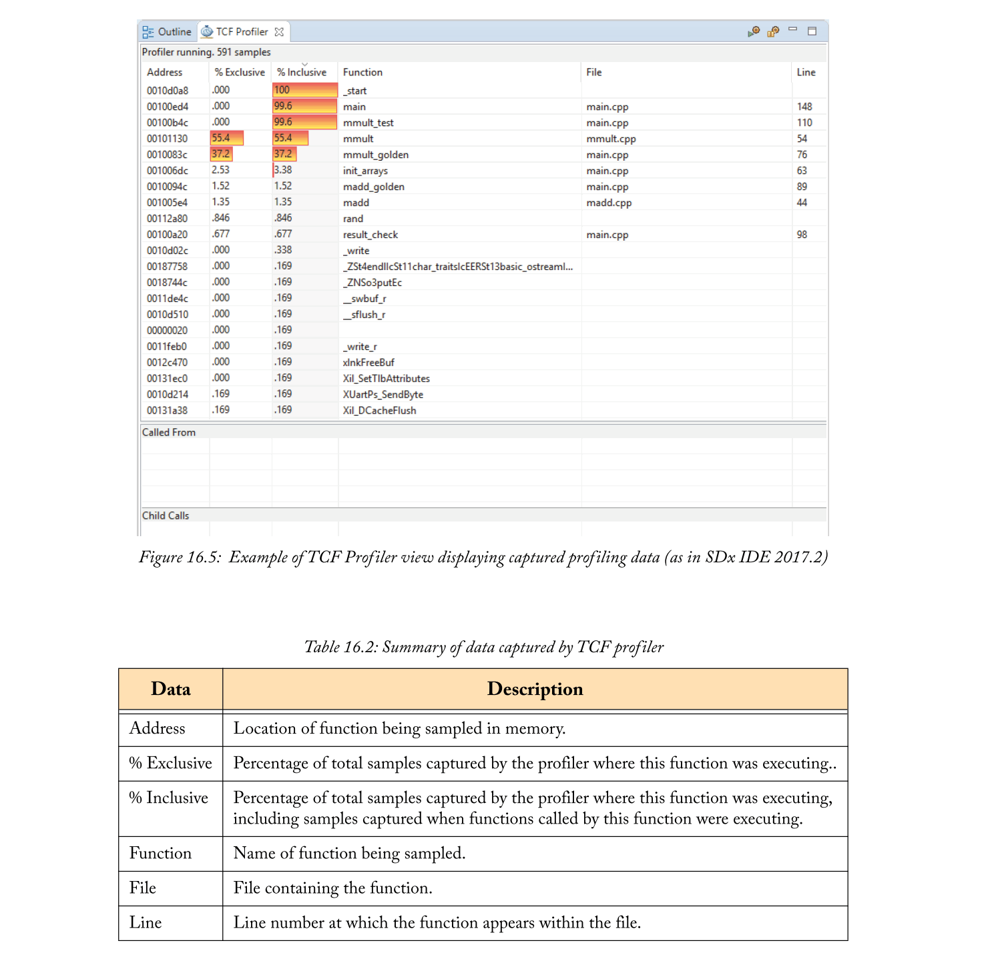
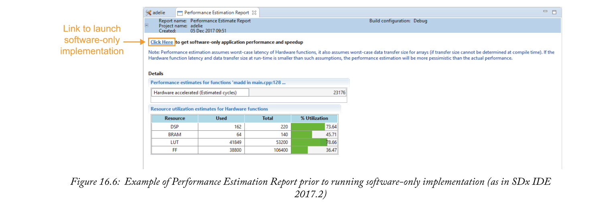
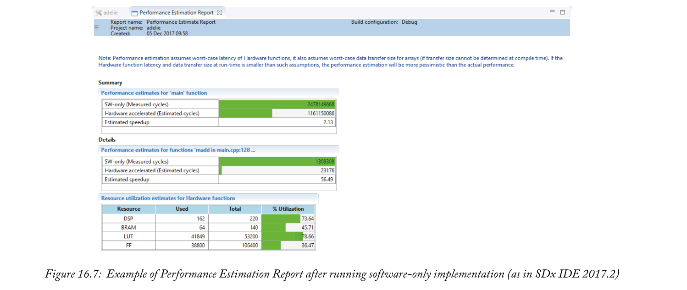
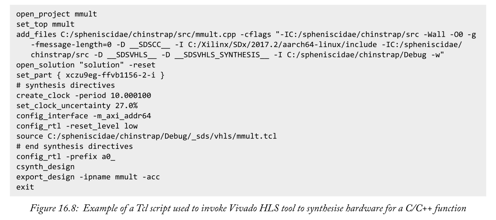
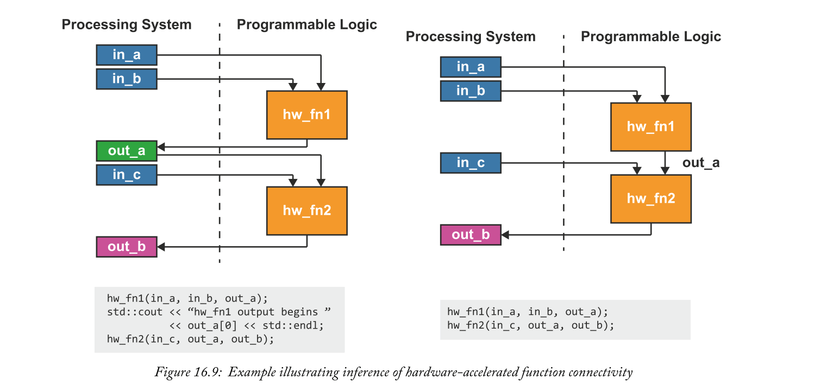
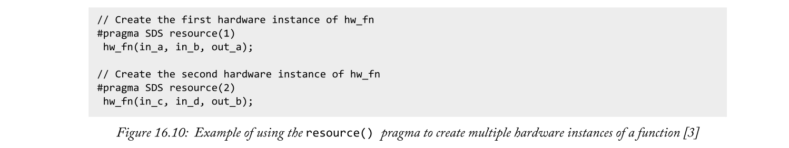
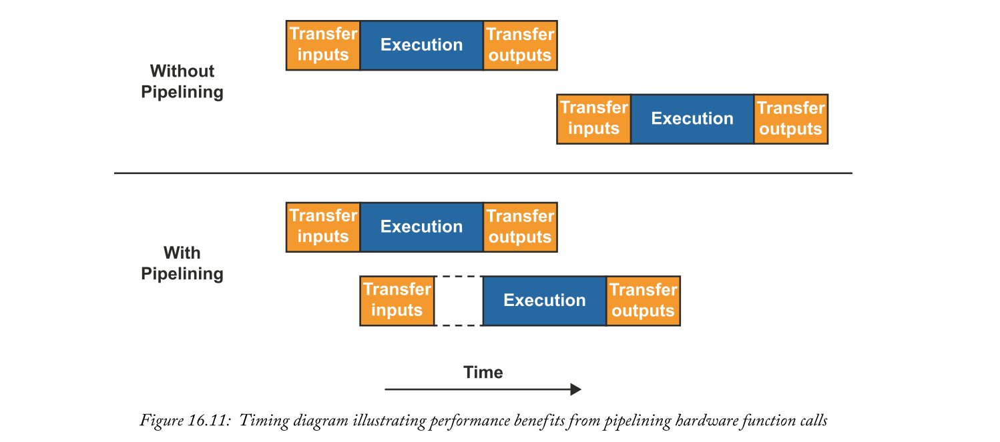

# Chapter 16 System Profiling and Acceleration with SDx
在第15章中通过SDx对系统设计过程进行了高层次的概述之后，我们现在进一步详细研究了该过程中涉及的步骤。在本章中，我们将考虑分析和测量系统性能的方法，以及加速硬件功能的策略。

## 16.1  System Profiling
在第15章中，我们概述了三个主要任务，我们希望评估、测量或分析系统性能。这些是：
- **分析软件**专用系统以确定硬件加速候选函数；
- 在执行完整系统构建之前**评估系统性能**；
- **测量**已构建系统的性能。

在本章中，我们将依次广泛地处理这些任务中的每一个，尽管它们之间有一些不可避免的重叠。

### 16.1.1  Software-Only System Profiling
在zynq设备上实现软件应用程序的首要任务之一是**识别要在硬件中实现的函数**。确定软件中占应用程序执行时间最大比例的函数有助于选择硬件加速功能。因此，我们希望在Zynq PS上执行时分析软件应用程序。

有很多方法可以做到这一点。在这里，我们将简要概述SDx IDE中可用的一些选项，然后详细介绍我们的首选选项。

也许概念上最简单的方法是向一个函数添加调用，该函数检查自由运行计时器的值，以测量在函数中花费的时间。这很容易实现，尽管有一个与调用计时器检查函数相对的性能开销，并且只获得基本的分析信息。它还需要手动修改源代码。该方法更适用于绝对系统性能的测量，我们将在第16.1.3节中重新讨论。

另一种选择是使用GNU profiler，gprof。要使用它，必须使用-pg标志编译和链接应用程序。如何做到这一点的细节在第15.2.6节中给出。指定此标志时创建的可执行文件包含记录每个函数所用时间的附加指令。当可执行文件运行时，分析数据被写入一个名为gmon.out[1]的文件中，该文件的内容可以在SDx IDE中可视化。该方法的优点在于，与以前的方法相比，它提供了相当复杂的分析数据。它包括绝对和相对分析度量；也就是说，它以实时单位和占整个执行时间的比例提供函数执行时间的度量。一旦将标志指定给SDx工具链，并且不需要修改源代码，该过程也将自动进行。缺点是它具有侵入性，因为可执行文件中包含的附加指令会影响应用程序的性能。

我们将讨论的最后一种方法是我们首选的选项，目标通信框架（TCF）Profiler。这就利用了PS中的性能监视单元来分析应用程序的执行情况。这种方法的优点是它不会改变应用程序的可执行文件，并且在构建系统时不需要设置任何特定的选项。与使用gprof相比，这种方法的一个局限性是它只提供相对的profiling测量。这是一个相当小的缺点，因为在我们的设计流程中，此时我们只对在应用程序中找到计算最密集的函数感兴趣，而相对的profiling测量完全足以实现这一点。因此，总的来说，我们认为对于我们的目的来说，TCF Profiler是最好的选择，现在我们将集中在这个方法上。

#### Target Communication Framework
在我们开始展示使用TCF分析器之前，我们也许应该先介绍一下显而易见但被容易忽略的事实：我们对目标通信框架（TCF）的秘密介绍。TCF是我们将在设计流程中的不同点上使用的东西，因此值得在这里简要介绍一下它。TCF是Eclipse项目中的一个网络协议。它关心的是简化运行在主机平台上的工具与嵌入式系统开发期间目标设备之间的通信。它旨在通过为工具和目标提供一个通用框架来实现这一点，无论供应商或传输协议如何，这样就不再需要为每个工具设置和维护单独的连接[2]。

在SDx IDE中，TCF基本上是透明的。主要的例外是我们需要在zynq目标上显式地建立一个到TCF代理的连接，运行Linux作为操作系统。在随SDx提供的SDx平台中使用的Linux实现中包含的TCF代理都使用TCP/IP作为传输协议。因此，我们将着重于使用TCP/IP建立连接。要做到这一点，我们必须首先将zynq目标连接到TCP/IP网络，在该网络上运行SDx的主机可以联系到它。目标必须引导到Linux并分配一个IP地址。在SDX IDE中，然后我们可以在SDx视图的目标连接视图中使用zynq目标的IP地址配置LinuxTCF代理。默认情况下，随SDx提供的Linux TCF代理配置为使用端口1534。一旦正确配置了到TCF代理的连接，我们就可以使用运行Linux的zynq目标使用TCF的工具了。

相比之下，ZYNQ目标在SDx提供的平台上运行Standalone或FreeRTOS OSs，使用JTAG接口进行TCF连接。除了连接主机系统和目标JTAG端口之间的电缆，通常不需要手动配置。
#### TCF Profiling
现在我们已经更正式地介绍了TCF，我们将继续讨论TCF Profiler。首先，我们必须编译并链接我们的软件应用程序，以便在zynq的ps上执行。我们可以使用设置-g编译器标志的任何构建配置，以使调试工具能够与编译的应用程序一起使用。默认的调试生成配置适用于此。由于我们还没有选择任何要在硬件中实现的函数，因此构建时间只是编译应用程序所花费的时间，因此应该相当短。一旦构建完成，我们就可以建立到目标设备的TCF连接。如果使用Linux操作系统，则应使用生成目录的sd_card子目录中生成的引导文件将设备引导到Linux以配置TCF连接。右键单击`Project Explorer`视图中的项目目录，然后选择`Debug as > Launch on Hardware（SDSOC Debugger）`，使用`SDSOC Debugger`在目标设备上启动应用程序。使用调试器启动应用程序意味着应用程序将首先启动，然后在进入主函数时挂起。我们可以利用这个机会，通过选择`open perspective`按钮并选择`debug视图`切换到`debug视图`，如图16.1所示。TCF Profiler在SDx IDE中有自己的视图，可以通过选择`Show View > Other…`从窗口菜单打开该视图，如图16.2所示。这将打开`Show View`对话框，从中可以展开调试文件夹，并最终选择`TCF Profiler视图`，如图16.2所示。可以通过单击`tcf profiler`视图中的start按钮来启动`TCF Profiler`，如图16.3所示。这将打开`分析器配置`对话框，如图16.3所示，该对话框允许配置分析器的行为。表16.1总结了可用选项。

配置Profiler之后，可以通过单击Debug视图中的Resume按钮来恢复Zynq设备上运行的挂起的应用程序，如图16.4所示。然后，TCF Profiler视图应该开始显示捕获的分析数据。图16.5显示了如何在TCF探查器视图中显示分析数据的示例。表16.2给出了所捕获的分析数据的摘要。

为计算密集型函数检查TCF探查器数据时要考虑的关键参数是`%Exclusive`参数。这是**应用程序专门执行此函数时探查器捕获的样本的比例**，给出了此函数所占用应用程序执行时间的比例估计。这与`%Inclusive`参数不同，因为`%Inclusive`值**包括应用程序在执行函数调用的任何函数时捕获的样本**。因此，对于调用计算密集型函数的函数，`%Inclusive`参数可能具有较高的值，但它们本身不会执行大量计算。图16.5所示数据中的主要函数就是这样一个函数的例子。TCF探查器视图还提供了“Called From”和“Child Calls”部分，以显示所选函数与应用程序中其他函数之间的关系。

使用来自TCF探查器的`%Exclusive`数据，我们能够识别应用程序中计算最密集的函数。如果可以加速这些功能，它们可能会带来系统性能的最大改进，因此，它们是硬件实现目标的良好候选对象。

### 16.1.2  Estimating Relative Performance
在提交包含硬件加速器的系统的完整系统构建之前，首先要谨慎地通过选择“Estimate Performance”选项来估计与仅软件应用程序相比我们可能看到的性能。这似乎是设计流程中不必要的一步，但通过对系统性能进行相对快速的评估，我们可以避免执行产生不满意结果的完整系统构建的一些开销。在一个设计周期的过程中，这很可能会节省整个时间。

性能评估可以使用任何构建配置获得，只需要在SDX项目文件中选择`Estimate Performance`选项。然后以通常的方式调用构建，通常只需几分钟即可完成。这是因为系统设计的硬件部分只执行正常构建过程的初始阶段。此部分构建的目标是获得Vivado HLS工具合成的硬件加速器的延迟估计值，以及这些加速器之间传输数据所需的时间估计值。这些值用于评估使用硬件加速器时系统的性能。如果在编译时无法精确地确定硬件加速延迟和数据传输时间的估计值，则SDx假定最坏情况值，与硬件加速系统的实际性能相比，这可能是悲观的。该构建还编译应用程序并生成在zynq设备上启动仅软件实现所需的引导文件。

SDx可以生成`Performance Estimation`报告，其中包括对实现硬件加速器所需资源的估计，以及基于Vivado HLS工具报告的硬件加速器时钟周期延迟数的估计。它还允许测量仅软件实现的性能，如图16.6所示。这将使用TCF与目标设备进行通信，因此需要按照第406页所述连接主机和目标系统。

完成后，将更新性能评估报告，以反映仅软件的实现度量，并与使用硬件加速器的系统估计性能进行比较。在细节部分，对测量的软件性能和估计的硬件性能进行了比较，特别是针对标记为硬件加速的功能。在总结部分，对顶层函数进行了比较。

`Performance Estimation Report`示例如图16.7所示。从本报告的详细信息部分可以看出，标记为在硬件中实现的功能执行速度可能比在软件中实现的功能快很多倍。然而，从报告的摘要部分也可以看出，估计对整个系统执行时间的影响要小得多。这将是由于加速功能所代表的整个系统执行时间的比例和硬件中实现的调用功能的开销的组合。

**性能评估流程**是一种相对快速的方法，用于评估在使用硬件加速器的系统中实现的性能改进以及在资源使用方面的改进成本。虽然这似乎是一个额外的、不必要的步骤，但它可能通过避免不满意设计的完整系统构建来提高整体生产力。

### 16.1.3  Measuring System Performance
一旦我们构建了系统，我们就要测试它的性能是否满足需求。虽然相对测量在识别系统分析期间的计算热点方面令人满意，但在评估系统性能是否满足要求时，绝对测量更为合适。这排除了使用TCF profiler，因为它只提供相对测量。

我们在第16.1.1节中简要讨论的另一种选择是gprof。这确实提供了绝对的性能度量，因此是执行此任务的可行选项。硬件加速的目标函数不会直接出现在探查器结果中，但是，由SDx工具链生成的用于处理与硬件加速器之间的数据传输的stub函数可以充当代理函数。在采用这种方法时要注意一点：对于任何使用async() pragma的硬件加速函数（如第387页和第[3]页表15.3所述），**stub函数在硬件加速器和数据传输设置完成后返回，而不是在硬件加速器已完成执**行。在这种情况下，准确地确定硬件加速器的执行时间是有问题的。缓解这个问题的一种方法是更详细地监控系统的性能。第18章讨论了实现这一点的方法。

在某些情况下，另一种缓解此问题的方法（我们在第16.1.1节中也提到过）是在应用程序执行期间在适当的点检查自由运行计时器的值。这使得设计者可以精确地调整应用程序的各个点，以便在这些点之间测量绝对性能。在使用async()pragma测量硬件加速函数的执行时间的情况下，我们可以通过在调用硬件加速stub函数之前立即检查计时器，然后在之后接着调用`wait() pragma`（如表15.3所述）或API函数`sdswait() or sds_try_wait()`（如表15.4所述）两者之一来立即再次检查它来获得估计值。。

这只是对硬件加速器执行时间的一个估计，原因是硬件加速器可能在应用程序对其进行轮询检查之前的某个时间完成了执行，具体取决于应用程序的结构。使用这种方法有两个缺点。首先，虽然这里介绍的其他分析方法也会导致性能开销，但是与检查自由运行计时器相关的性能开销很小。第二个，也许更重要的缺点是，这个方法需要修改应用程序源代码，而我们讨论过的其他分析方法都不需要这样做。不过，这种方法也有其优点。除了让系统设计者能够指定他们希望测量的应用程序部分的性能外，它还提供了绝对性能的测量，因为自由运行的计时器与应用程序处理单元以相同的频率运行，而且实现起来相对简单。最后一点尤其正确，因为SDS库提供了一个函数来执行自由运行计时器的检查：`sds_clock_counter()`。

这里描述的方法有助于测量已构建系统的整体性能，并将其与我们的需求或仅软件系统的性能进行比较。我们还可能对系统性能的更详细分析感兴趣，例如**硬件加速器执行时间、数据传输时间和CPU工作负载**。正如前面提到的，执行这一分析级别的方法将在第18章中讨论。

## 16.2  Software Acceleration using Programmable Logic
既然我们对如何确定系统中的哪些函数是硬件加速的目标有了更清晰的认识，我们就可以开始更详细地研究如何通过在pl中实现的函数来优化系统的性能。这是我们将要讨论的主题。在本节中。

当优化一个具有在pl中实现的功能的系统时，有两个主要的攻击点：**实现该功能本身的IP核心的性能以及将该IP核心集成到系统中**。在某种程度上，这些问题可以单独处理，并且可以采用双管齐下的方法；如果愿意的话，这是一项优化工作。如第15.3.4节所述，代码重构和pragma规范可用于将系统合成引导到更优化的解决方案。对于IP核心，代码结构和pragmas由Vivado HLS工具解释，而对于将IP核心集成到系统中，解释由SDx编译器执行。关于能够完全独立地处理这两个方面的小小的争论是因为IP核的接口将不可避免地影响其在系统中的集成。一般来说，**IP核的接口是由SDx编译器决定的，而不是Vivado HLS工具决定的**。此规则的例外情况是，**当SDx编译器未能生成适当的硬件接口指令时，在这种情况下，可以使用vivado hls指令或pragma直接综合适当的接口类型**[2]。我们现在依次检查pitch-fork的两个tines。

### 16.2.1  IP Core Optimisation
首先，我们将处理优化IP核本身。也许这一章有点违反直觉，我们建议您不要使用SDx来优化IP核心，至少在最初是这样。相反，我们建议直接使用Vivado HLS工具。Vivado HLS GUI也基于Eclipse IDE，因此与SDx IDE具有类似的外观。使用Vivado HLS工具的主要优点是，它允许在单个项目中创建和比较多个解决方案，这大大有助于有效和系统地探索可用的优化选项。

VIVADO HLS工具推断出基于C/C++代码的硬件体系结构。然而，它推断最佳体系结构的能力存在局限性，设计师可能需要提供一些额外的帮助。以类似的方式，当针对特定处理器体系结构执行代码时，可能需要重构C/C++代码，以使VIVADO HLS工具能够推断出更优化的体系结构。Vivado HLS工具的行为也可以通过直接插入源代码中的pragma或通过在单独的Tcl文件中指定指令来显式指导。为了简洁起见，我们不会在这里对使用Vivado HLS工具进行广泛的讨论。关于使用Vivado HLS优化硬件综合的特别有用的评论，包括编码风格和使用pragmas和伪指令，可以在[1]和[2]中找到。

当SDx项目被构建时，为每一个被标记为硬件实现的函数生成一个Tcl脚本，用于调用Vivado HLS工具来综合C/C++函数的硬件。这些脚本包含在项目构建目录的_sds/vhls子目录中，并使用命名约定<function_name>_run.tcl。这种脚本的一个例子如图16.8所示。这些脚本为感兴趣的函数打开一个Vivado HLS项目，并将其配置为针对特定的zynq设备和从SDx平台确定的时钟周期。指令tcl文件由这些脚本提供，用于在为目标函数运行硬件合成之前指导vivado hls工具的行为。默认情况下，伪指令文件是在数据运动网络生成之后由SDx生成的，其中包括用于指定将IP核心连接到数据运动网络的适当接口的指令。这些指令tcl文件也包含在project build目录的_sds/vhls子目录中，并使用命名约定<function_name>.tcl。

如上所述，设计者通常可以选择**直接将pragma输入源代码**或提供包含伪指令的单独tcl文件来指导Vivado HLS工具的行为。在优化SDx项目中使用的代码时，我们建议**尽可能使用前者**。在这种情况下，一旦使用ViVADO HLS工具优化C/C++代码，它就可以简单地导入SDx项目作为源文件并准备使用。这种方法的**缺点是它需要修改源代码并包含pragma**。然而，在这种情况下，考虑到代码可能需要重构，并且无论如何都包含特定于SDx的pragma，这可能不是一个明显的缺点。

此时值得重申的是，如果手动指定Vivado HLS pragma来指导SDx项目中标记为硬件实现的任何函数的接口综合，则应小心。如果指定了`Vivado HLS interface pragmas`，SDx将不会在数据运动网络生成之后为Vivado HLS工具生成接口指令。相反，Vivado HLS工具将根据用户指定的`pragma`综合接口，然后**由用户负责确认综合接口与生成的数据运动网络的兼容性**。用户仍然能够对综合接口施加影响，而无需使用Vivado HLS特定的pragmas。这可以通过使用SDx提供的可选pragma实现，我们将在第16.2.2节中进一步讨论。

通过指定包含必要指令的Tcl文件，可以将Vivado HLS伪指令与源代码分开。可以通过右键单击项目资源管理器中src目录下标记为硬件实现的函数并选择`Vivado HLS > specify directive TCL file`来指定替代指令文件。

需要注意的是，在SDx项目中手动指定的任何Vivado HLS伪指令文件都用作SDx通常生成的指令文件的替代文件。在<function_ name>run.tcl脚本中，用于源代码自动生成的指令文件的命令将替换为源代码指定指令文件的命令。这意味着用户需要指导该功能接口的综合，并确保它们与生成的数据运动网络的兼容性。

### 16.2.2  Optimising IP Core Integration
其次，我们考虑如何优化实现我们的功能的IP核与系统其余部分的集成。IP核的集成以SDx编译器生成的数据运动网络为中心，并在第15.2.3节中进行了讨论。如前所述，类似于Vivado HLS工具，SDx编译器试图通过对C/C++代码的分析来推断最优数据运动网络。
同样，其推断最佳数据运动网络的能力也存在局限性，因此，通过将pragmas插入源代码以指导其行为，为用户提供了辅助该过程的便利。可用的SDx pragma在第387页的表15.3中进行了总结，现在我们将简要概述其中一些pragma对数据运动网络生成的影响。

正如我们在第15.2.3节中所讨论的，我们可以将数据运动网络生成分为三个部分：
- IP interface(s);
- Data mover(s);
- System port(s).

我们可以用来指导数据运动网络生成的pragma通过提供有关IP核心所消耗或生成的数据的附加信息来专门指导这些组件的生成。

在为数组类型函数参数综合IP接口的情况下，可以生成RAM接口或流式接口。要生成的接口类型取决于IP核心如何访问数组数据。当然，随机访问接口可以用于任何访问模式，但是，如果以严格的顺序方式访问数据，则可以使用流式接口，并且需要较少的PL资源。 data access_pattern pragma可用于指定数组参数的访问模式。它可以被指定为SEQUENTIAL,，在这种情况下，流接口被推断出来，或者是RANDOM，在这种情况下，会生成一个RAM接口。如果没有为数组参数指定访问模式，则SDx编译器假定访问模式是随机的，并推断出RAM接口。

数据移动器的最佳选择**取决于要传输的数据量和为该数据分配的内存的物理连续性**，如第15.2.3节所述。这两个属性都可以使用pragma指定。`data mem_attribute pragma`可用于指定为数据分配的内存是否物理上是连续的，`data copy pragma`可用于指定要传输的数据量。一旦明确指定了这两个属性，SDx编译器就能够推断出要生成的最佳数据移动器。还有一个pragma，即data data_mover，它**允许用户直接指定要使用的数据移动器的类型**。但是，在使用此pragma时必须小心，因为SDx编译器将生成指定的数据移动器，而不管它与数据移动网络的其余部分是否兼容，因此用户有责任确保综合的系统的功能正确。

要**传输的数据量**还影响用于在PL和PS之间传输数据的系统端口的选择，以及为数据分配的内存是否可缓存。我们已经在上面描述了如何使用`data copy pragma`来**指定要传输的数据的大小**。我们在指定为数据分配的内存的连续性的上下文中还提到了`data mem_attribute pragma`，但是这个pragma也可以用来**指定分配的内存是否可缓存**。与数据移动器的生成类似，有一个pragma，`data sys_port`，允许用户直接**指定要使用的系统端口类型**。这允许用户指定是使用缓存一致端口还是非缓存一致端口。与使用数据移动器pragma不同，使用数据系统端口pragma不会影响综合系统是否正常工作，但它可能明显影响综合系统的性能。

还有另一个pragma来指导数据运动网络生成，我们还没有提到，因为它**同时指定生成的IP接口和数据移动器**，因此不适合前面的讨论。我们引用的pragma是`data zero_copy pragma`，它生成一个AXI-Master IP接口。如果未指定此pragma，则数据移动器会将数组参数中的数据复制到PL中的IP核。另一方面，当指定了`data zero_copy pragma`时，数据将保留在内存中，直到ip core获取它，因此IP Core有效地与PS共享分配的内存区域。这允许IP core处理太大的数据而无法复制到PL中，也无法流到IP core或访问大面积的存储。但是，与使用存储在PL中的本地副本相比，**访问系统内存中数据的延迟会带来性能损失**。分配给IP核心访问的数据的内存必须是物理上连续的。

值得在这里重复的一个重要点是，通常，SDx pragma向SDx编译器提供附加信息，使其能够推断出一个最佳系统。SDx编译器不一定要验证指定pragma的准确性，这可能导致综合的系统不能按预期工作。用户必须确保由指定的pragma传递给SDx编译器的信息是准确的。

#### Connecting Two IP Cores
到目前为止，我们已经考虑使用可应用于任何使用硬件加速功能的系统的pragma和优化。但是，如果一个硬件加速功能的输出是另一个硬件加速功能的输入，则可以考虑进一步的优化。

在这种情况下，通过避免PL和系统内存之间不必要的数据传输，系统性能得到了最好的服务。因此，直接将第一硬件加速功能的输出数据传输到PL中第二硬件加速功能的输入通常是最佳策略。这就避免了需要额外的数据移动器来在PL和系统内存之间移动中间数据，以及为数据移动器的设置、执行和清理而产生的相关性能开销。两个硬件加速功能的执行有些并发性也可以通过流水线实现，其中硬件加速功能通过流式接口连接。

与我们之前考虑的优化不同，SDx编译器倾向于从源代码推断这种体系结构，而不需要用户进行任何额外的干预。但是，如果在两个硬件加速函数之间传递的数据在两个函数的调用之间被访问，SDx编译器将不会生成优化的体系结构。相反，它将生成一个体系结构，将第一个函数的输出传输到系统内存，以便程序访问它，然后将其传输回PL，用作第二个函数的输入。与优化后的体系结构相比，这种体系结构有明显的缺点。图16.9给出了一个看似无害的print语句如何从根本上改变生成系统的结构的示例。

#### Specifying Multiple IP Core Instances and Pipelining
其他优化可以应用于对同一硬件加速函数有多个调用的系统，并且这些调用之间没有足够的时间来完成函数的执行。

在这种情况下，提高性能的**最明显的方法是在PL中创建硬件IP核心的多个实例**，并**允许这些实例并发执行**。我们可以使用`resource()` pragma来实现这一点，其示例如图16.10所示。

图16.10中的第一个`resource()` pragma创建标识符1引用的`hw_fn()`ip核心的实例。然后设置`hw_fn()`ip core的第一个实例来执行并控制返回到程序，而不等待ip core完成执行。第二个`resource()`pragma创建标识符2引用的`hw_fn()`ip核心的第二个实例。这个IP核被设置为执行，并且再次控制返回到程序，而不等待IP核心完成执行。这允许`hw_fn()`ip核心的两个实例同时执行，而不是让一个实例连续执行两次。

虽然在这种情况下，这是提高系统性能的最明显的方法，但由于可用的PL资源数量的限制，可能不总是可以为单个函数实例化多个IP核心。但是，仍然可以通过流水化多个单个IP核调用来提高系统性能。这对于使用RAM类型接口的IP核心尤其有效。由于它们能够以随机方式访问数据，使用RAM接口的IP核心无法开始执行，直到所有输入数据传输到本地缓冲区，并且在IP核心完成执行之前，无法开始传输输出数据。通过将下一个调用的输入数据传输到IP核心，并将上一个调用的输出数据与IP核心执行并行，可以减少IP核心在等待传输数据时空闲的时间，如图16.11所示。

通常情况下，通过将多个调用流水化到一个IP核心而获得的性能优势是有代价的。在这种情况下，成本的形式是在PL中创建额外的本地缓冲区以保存IP核心的多组数据所需的额外内存资源。

要流水化调用单个IP核心，我们使用`async()pragma`。`async()pragma`指定对紧随其后的硬件函数的调用应设置将输入数据传输到IP核心，然后将控制权传递回程序，而无需等待IP核心完成执行。这允许将多组输入数据传递给一个IP核心的单个实例，而无需等待它完成对任何输入数据集的处理，如图16.12中的第一个循环所示。

作为参数传递给`async()`pragma的标识符指定了一个队列，硬件函数调用请求将添加到该队列中。多缓冲区的数量决定了可以同时传递到IP核心的输入数据集的数量。一旦IP核心实例的所有可用多缓冲区都用完，程序必须等待IP核心完成对多缓冲区中已存在的一组输入数据的处理，然后才能将更多数据传递给该IP核心。这要求程序与IP核心执行重新同步，如图16.12所示，通过将每个`async()`pragma与相应的`wait()`pragma配对来实现。程序在`wait()`pragma处暂停，直到传递给`wait()`pragma的参数指定的队列上的下一个硬件函数调用请求完成执行。

这表示一组输入数据缓冲区是空闲的，如果需要，可以将更多的输入数据传输到IP核心。尽管我们在这里使用了`wait()`pragma，但sds_lib库提供的函数充当`wait()`pragma的替代品，即第389页表15.4中总结的`sds_wait()`和`sds_try_wait()`函数。虽然`sds_wait()`函数的行为类似于`wait()`pragma，但是`sds_try_wait()`函数允许在不阻止程序同时执行其他指令的情况下轮询IP核心的状态。使用`wait()`pragma与使用`sds_lib`函数相比的一个微小优势是，如果源代码需要在sdscc或sds++以外的任何位置使用编译器编译，则可能是因为替代编译器不会解释`wait()`pragma。

## 16.3  Chapter Review

在本章中，我们更详细地介绍了分析和优化SDx系统性能的技术和策略。我们讨论了分析软件应用程序的技术，以便识别计算密集型函数，并估计在硬件中加速这些函数可能带来的好处。提出了一种测量已建系统性能的简单方法。我们更详细地研究了如何优化使用PL中的硬件加速功能的系统的性能，包括使用Vivado HLS工具优化IP核心的性能，以及使用SDX编译器将这些IP核心集成到系统中。这些策略的更多信息和示例也可在[3]、[4]和[5]中找到。

