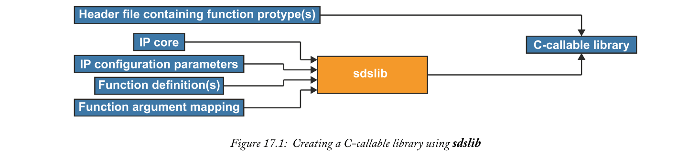
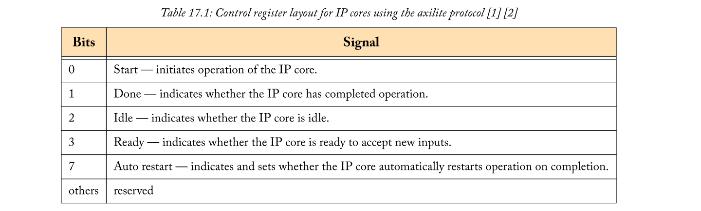
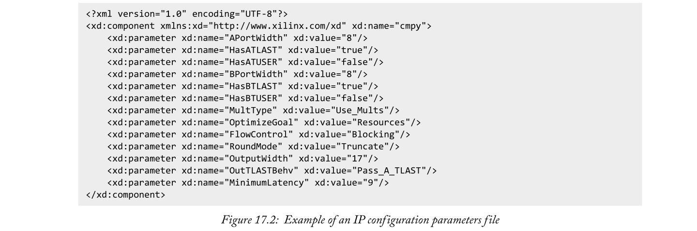
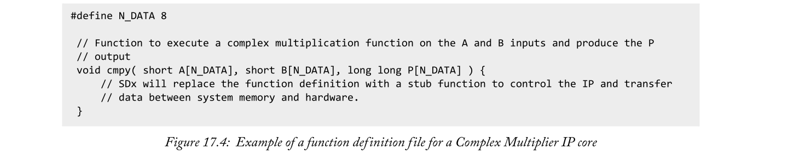
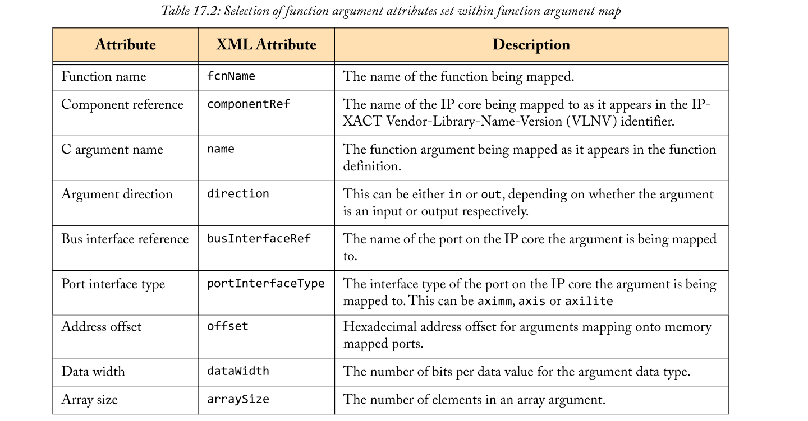
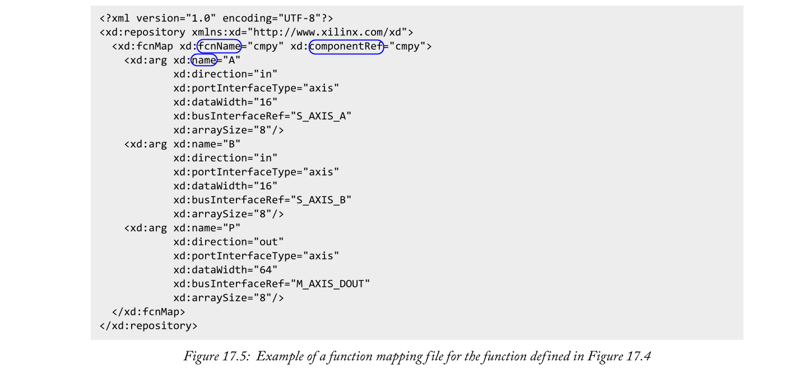
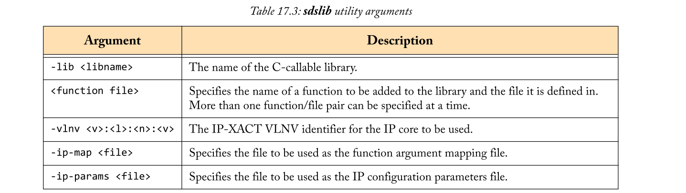
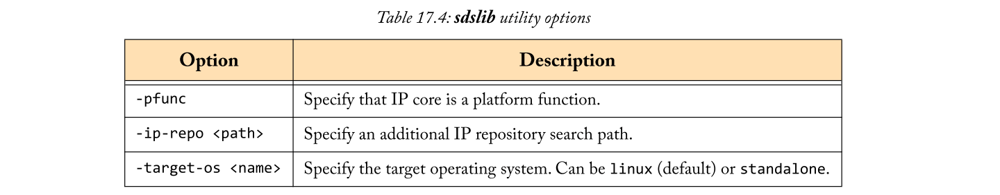
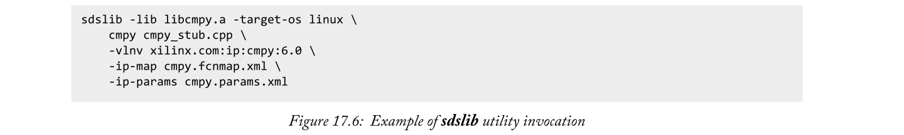
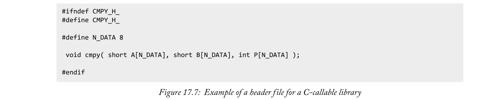

# Chapter 17 Reusing Existing IP in SDx
SDx的主要目标之一是提高使用Zynq设备的设计师的生产力。因此，设计人员能够重用SDx之外开发的IP核心，以避免复制先前开发的功能所花费的精力，这一点很重要。在本章中，我们将介绍在SDx项目中集成现有IP核心所需的步骤。

## 17.1  Creating a C-Callable Library
为了在我们的SDx项目中重用预先存在的IP核，我们需要能够调用IP核并将数据传递到描述我们项目的C/C++源代码中。为了实现这一点，我们必须创建一个包含函数的C-Callable软件库，以允许在SDx项目源代码中引用IP核心。它还必须提供SDx编译器所需的信息，以配置IP核心并将其集成到系统中。这看起来可能是一个复杂的任务，但是，SDx开发环境通过提供sdslib实用程序从一组输入创建C-Callable库，大大简化了它，如图17.1所示，我们将在这里讨论这个过程。

### 17.1.1  IP Core Requirements
我们将首先讨论IP核本身，因为这可能是`sdslib`实用程序最明显的输入。虽然理想情况下，我们可以使用任何知识产权核心，而无需对我们的SDx项目进行任何进一步修改，但实用性要求**IP核心必须符合一些通用标准**，以允许SDx编译器生成必要的软件和硬件与之接口。SDx要求IP核仅使用`AXI4`、`AXI4-Lite`或`AXI4-Stream`接口。它还**要求IP核在地址偏移量0x0 [1]处有一个控制寄存器**，以便一旦集成到系统中，由SDx编译器生成的软件stubs就能够正确控制该IP核。

控制寄存器支持两种协议:`none`和`axilite`。`none`协议应该**用于从上电开始持续运行并且不需要通过控制寄存器进行额外同步的IP核**。当使用`none`协议时，**控制寄存器必须连接到常数值0x6** [1]，这有效地将IP核标记为随时准备执行。另一方面，`axilite`协议通过控制寄存器**提供了额外的IP内核同步**。`axilite`协议要求控制寄存器使用表17.1所示的布局。这与Vivado HLS生成的IP配置相同。

SDx编译器可以实例化的大多数`data movers`只支持数据包[3]中提供的流数据。因此，一般来说，为了确保与SDx编译器生成的data motion网络兼容，IP核上的任何AXI4流接口都必须支持`tlast` side-band信号。同样，IP核上的所有AXI4接口也必须支持`tready` side-band信号。

对IP核心的另一个要求是，它必须按照`IP-XACT`标准[4]进行包装。这确保了定义IP核心的文件具有正确的结构，以便在SDx编译器调用Vivado工具时由它来解释。Vivado工具可用于根据[5]中描述的过程适当包装IP核心。
### 17.1.2  IP Configuration Parameters
与IP核密切相关的是IP配置参数文件。这是一个XML文件，**用于配置综合时可定制的IP核参数**。图17.2给出了一个示例，显示了用于定制复杂乘法器IP逻辑核心[6]的配置参数文件，并演示了这种文件的结构。**用于定制IP核的参数名称应该与IP核中的泛型或参数名称相匹配**，并且它们的可能值可以从IP核文档中获得。或者，在使用Vivado设计套件[5]对知识产权核心进行适当定制后，可以从Tcl控制台获得参数。

即使正在使用的IP核没有任何可以在综合时配置的参数，但对于sdslib实用程序来说，IP配置参数文件是一个**强制输入**。在这种情况下，IP配置参数文件不应该列出任何参数。这种文件的一个例子如图17.3所示。

### 17.1.3  Function Definition
到目前为止，我们讨论的`sdslib`实用程序的输入涉及到定义IP核的硬件。我们还需要定义一个函数或一组函数，以允许从SDx项目的源代码中调用IP核。旨在控制IP核或向IP核传输数据或从IP核传输数据的函数，在称为函数定义文件的C或C++源文件中定义。SDx编译器将用对stub函数的调用来代替这些函数的主体，以与对硬件加速函数的调用相似的方式来处理硬件交互。这些函数的主体对SDx编译器创建的系统没有影响。因此，它们可以包含设计者喜欢的任何代码，例如为了模拟目的而模拟IP核的功能，或者实际上是空的。SDx编译器能够根据函数参数映射识别出要使用的合适stub函数，我们稍后将对此进行讨论。函数定义文件的一个例子如图17.4所示。

### 17.1.4  Function Argument Mapping
`sdslib`实用程序的最终输入是函数参数映射文件。该文件用于描述在`C-callable`库接口中定义的软件与IP核的功能。具体来说，它用于描述每个函数参数映射到哪个IP核端口。

该文件是一种XML格式，每个函数都有一个函数映射元素。参数元素是函数映射元素的子元素，并设置一些属性来描述该参数如何映射到IP核心端口。表17.2给出了函数映射和参数元素中属性集的选择。参数元素必须使用与函数定义中相同的参数名称，并且必须以完全相同的顺序出现。

除了每个函数映射元素中的参数元素之外，还可以可选地提供用于为IP核提供资源利用率和等待时间估计的元素。图17.5给出了图17.4中定义的函数的函数映射文件的例子。

### 17.1.5  The sdslib Utility
既然我们已经有了所有的输入，我们就可以生成静态的C-callable库了。为此，我们将使用`sdslib`实用程序。`sdslib`实用程序基于命令行，从SDx终端调用。一旦进入我们的工作目录，就可以使用`sdslib`命令调用`sdslib`实用程序，并将输入文件的细节作为参数传递给它。该实用程序所需的参数如表17.3所示。还有许多选项可以指定，如表17.4所示。图17.6给出了调用`sdslib`为图17.4中的函数定义创建库的例子。

一旦`sdslib`实用程序成功执行，它将生成C-callable库文件，该库文件用于链接到针对已有IP核的SDx项目。值得注意的一点是，如果使用工作目录中已经存在的库的名称调用`sdslib`实用程序，该实用程序将不会覆盖该库，而是简单地向其添加新的函数。
### 17.1.6  Library Header File
要使用`sdslib`实用程序创建的可调用库，还需要一个文件:库头文件。这个文件只需要很少的解释，因为它只是一个包含库中定义的函数原型的C/C++头文件。在应用程序中包含这个头文件提供了到C-callable库函数的接口。该文件需要注意的唯一一点是，它可以用来指导选择data mover和系统端口，通过在其中以通常的方式指定`SDx pragmas`，将IP核心连接到这些端口。

## 17.2  Using a C-Callable Library
一旦库被创建，使用一个C-callable库来定位一个预先存在的IP核是很简单的。所需要的只是指定库在SDx工具链中的位置，并在源代码中的适当位置调用库函数。

为了指定库在SDx工具链中的位置，需要执行许多步骤:
- 在项目源代码的适当位置包含库头文件；
- 向编译器指定**包含库头文件的目录**；
- 指定库文件及其在链接器中的位置。

这些步骤中的第一步在很大程度上是不言自明的。

其他步骤可以通过更改构建配置设置来实现，如第15.2.6节所述。包含库头文件的目录应该使用`-I`选项指定给sdscc编译器(如果源代码是C)，或者指定给sds++编译器(如果源代码是C++)。库文件的名称应该使用`-l`选项指定给sds++链接器，包含它的目录也应该指定给sds++链接器，但是使用`-L`选项。

当使用C-callable库以预先存在的IP核为目标的SDx项目被构建时，SDx编译器自动在Zynq设备的PL中实例化预先存在的IP核，并将其与系统的其余部分集成，如SDx项目所指定的。
## 17.3  Chapter Review
在本章中，我们讨论了通过创建一个可调用库来表示SDx项目中现有IP的重用过程。介绍了使用`sdslib`实用程序创建可调用库的必要步骤，以及使用库实例化SDx项目中的IP核所需的步骤。已经提供了简单的例子来帮助说明这个过程。也有关于这一主题的进一步阅读资料[1]。