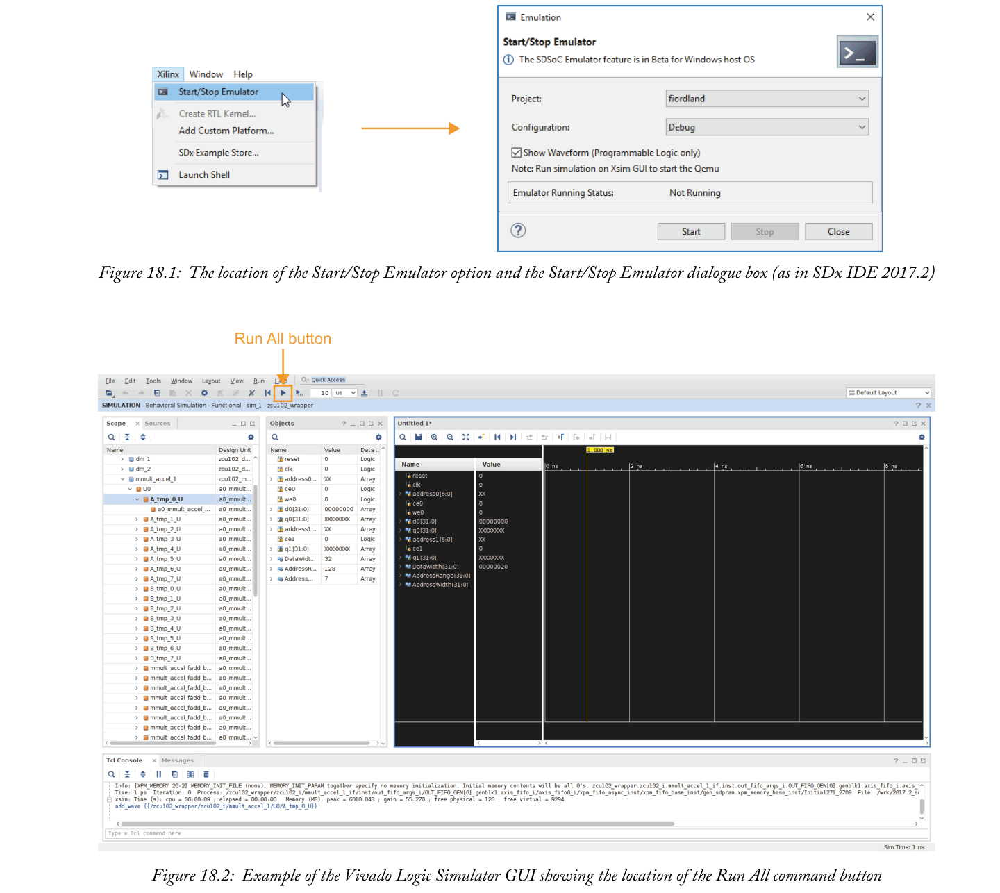
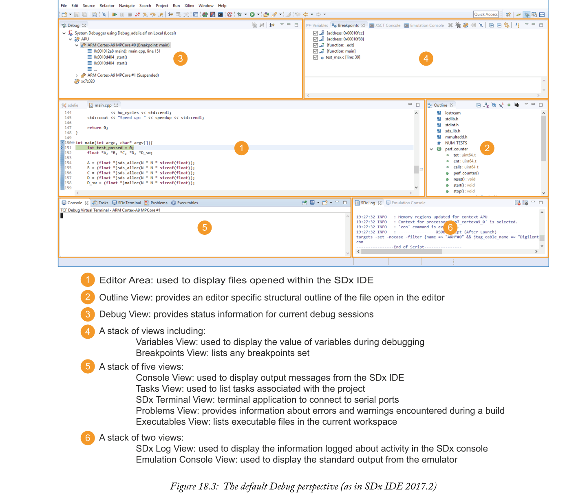
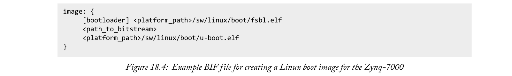
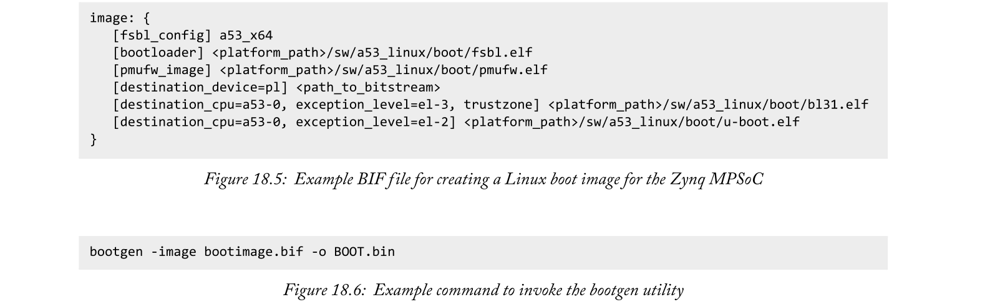
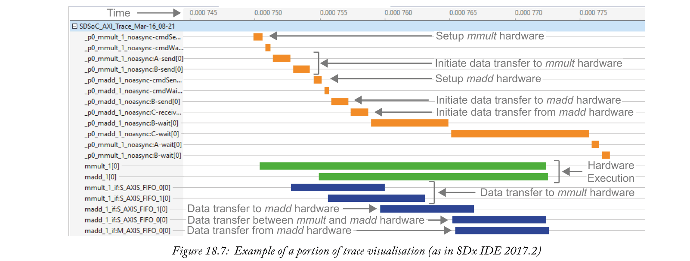
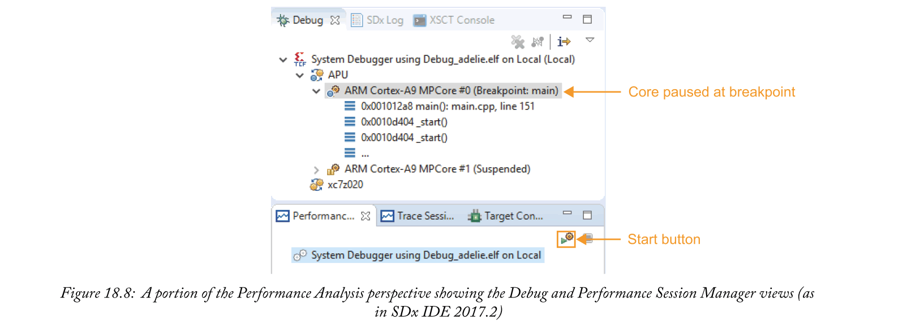
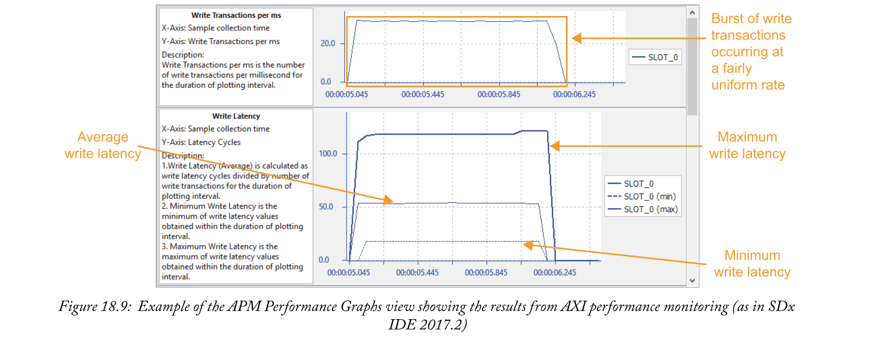
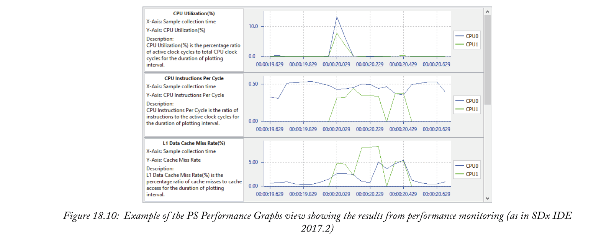

# Chapter 18 Debugging and Performance Monitoring with SDx

有效利用Zynq设备架构的系统本质上是由紧密集成的硬件和软件组件组成的复杂系统。试图调试或分析这样一个系统的性能可能是一个相当令人畏惧的。然而，SDx开发环境再次拯救了我们，它提供了许多特性来帮助用户执行这些任务。在本章中，我们将回顾一些可用的特性，以及如何使用它们来洞察系统行为。

调试有时根据调试的上下文分为两类。这些类别包括功能调试和性能调试，功能调试中存在导致系统出现意外行为的问题，性能调试中系统表现如预期，但性能不令人满意(换句话说，时钟速度的提高会导致系统因不满足时序限制而出现故障)。虽然我们在这里讨论的每一个特性在两种调试场景中都可能被证明是有用的，但是我们已经根据它们可能最有用的情况对它们进行了分类。在继续讨论最适合性能调试的性能监控特性之前，我们将首先讨论对软件和硬件的功能调试最有帮助的实用程序。

## 18.1  System Emulation
SDx的系统仿真流程特性对于调试针对Zynq设备的复杂硬件和软件系统非常有价值。该流程允许系统的硬件和软件组件相互协调地被模拟。使用QEMU [1]模拟PS，使编译后的软件组件能够在这个模拟系统上执行。同时，利用Vivado逻辑模拟器对硬件组件进行了仿真。QEMU仿真PS和Vivado逻辑模拟器仿真PL，通过接口在它们之间传递适当的信号，允许整个系统被仿真。

系统仿真可以在为系统的硬件组件生成比特流之前进行。比特流生成占整个系统构建时间的很大一部分，因此能够在投入耗时的系统构建之前测试和验证系统的功能是一个相当大的优势。此外，使用Vivado逻辑模拟器来模拟PL设计可以探测任何硬件信号。

系统仿真流程的第一步基本上与在SDx项目设置中选择生成仿真模型选项和构建项目一样简单。这将生成使用QEMU和Vivado逻辑模拟器模拟系统所需的文件。当模拟系统时，没有必要生成比特流。仿真模型可以以两种模式之一生成:调试或优化，模式可以从SDx项目设置的下拉菜单中选择。模式选择决定了用于模拟PL
的模型类型。当选择调试模式时，将生成一个PL仿真模型，该模型能够捕获仿真硬件中信号的时间分辨数据，这些数据可以在Vivado逻辑模拟器中显示为波形。当选择优化模式时，模拟硬件信号数据不会被记录，也不能被视为波形，但是，系统仿真确实执行得更快。

一旦生成了仿真模型，就可以执行系统仿真。模拟器通过选择Xilinx菜单下的开始/停止模拟器选项启动，如图18.1所示。这将打开启动/停止仿真器对话框，如图18.1所示。在“开始/停止仿真器”对话框中，应选择要仿真的项目，以及与生成的仿真模型模式相适应的配置。有一个显示波形的选项(仅可编程逻辑)，仅在使用调试模式仿真模型时适用。当选择此选项时，Vivado逻辑仿真器图形用户界面将在仿真器启动时启动，以允许仿真的PL信号可视化。模拟器通过单击对话框中的“开始”按钮启动，这应该通过SDx IDE控制台视图中的消息来确认。

如果在启动模拟器时选择了显示波形选项，Vivado逻辑模拟器图形用户界面将启动，看起来类似于图18.2。默认情况下，没有为可视化选择PL信号。此时，在仿真系统上启动应用程序之前，我们可以选择希望在应用程序执行期间监控的PL信号。要将信号添加到波形窗口进行监控，应在Vivado逻辑模拟器图形用户界面的“范围”面板中选择硬件设计层次结构中的适当实体。属于该实体的信号随后显示在对象窗格中。然后，通过右键单击所需信号并选择“添加到波形窗口”选项，可以将其添加到波形窗口。

一旦所有要监控的信号都被添加到波形窗口，`Run All`按钮应该从Vivado逻辑模拟器图形用户界面的工具栏中选择，如图18.2所示。这将启动Vivado逻辑模拟器捕获和显示信号数据，为应用程序执行做好准备。

通过在SDx集成开发环境的Project  Explorer view中右键单击项目，并选择`Run As > Launch on Emulator`(SDSoC调试器)选项，可以在仿真系统上启动应用程序。仿真器的标准输出指向SDx IDE中的仿真控制台。如果正使用Vivado逻辑模拟器监控PL信号，那么这些信号将在Vivado Logic Simulator GUI的波形窗口中可见。

当在项目资源管理器视图中右键单击项目时，也可以使用`Debug As > Launch on Emulator`(SDSoC调试器)选项在仿真系统上启动应用程序。这使得软件调试能够在应用程序在仿真器上执行时执行，但是需要使用适当的构建配置来构建应用程序。关于这一点的更多细节在关于软件调试的第18.2章中提供。

当在仿真系统上观察PL信号和使用断点时，需要注意的一点是断点仅属于软件，因此当应用程序被断点暂停时，可以在一些PL信号上观察到活动。这种行为也与在物理设备上执行软件调试时观察到的情况一致。

从SDx 2017.2开始，系统仿真流在Linux主机上完全受支持，而测试版在Windows主机上可用。
## 18.2  Software Debugging
SDx集成开发环境提供的主要软件调试实用程序是基于Eclipse的，称为系统调试器。它在外观和功能上都是传统的，给任何有软件调试经验的用户一种熟悉感。系统调试器是一个基于图形用户界面的调试器，在SDx集成开发环境中有一个专用的视角。

为了与调试器一起使用，应用程序可执行文件需要包含调试符号信息。该信息通过在编译时使用选项包含在可执行文件中。在sdscc或sds++编译器中通过`-g`选项来实现这一点。默认情况下，调试构建配置也包括此选项。

在准备调试的目标平台上启动应用程序的过程与第16.1.1节中关于启动纯软件系统概述的过程完全相同，直到切换到调试视角。

一旦应用程序在目标平台上启动，并且用户已经切换到调试视角，他们将看到一个类似于图18.3所示的场景。此时，应用程序在主函数的入口被挂起。调试视角为用户提供了对一系列常规调试功能的便捷访问。这些功能包括设置断点和观察点、检查寄存器、变量和内存的内容以及逐步执行应用程序的能力。使用这些特性，用户能够在Zynq设备上执行时彻底洞察系统软件部分的执行情况。

## 18.3  Hardware Debugging
硬件调试比软件调试稍微复杂一点，这里提出的流程**不受SDx的直接支持**。它要求我们能够探测PL自身内部的信号。为了做到这一点，调试IP核必须在PL中实例化，以便在这些信号和用户之间接口。这里，我们集中使用虚拟输入/输出(VIO) [2]和系统集成逻辑分析器(系统ILA)[3]LogiCORE IP核——其他调试硬件也可以以类似的方式使用。

调整SDx项目以包含调试IP核心涉及到许多步骤。首先，调试IP核需要包含在系统设计的硬件部分和由此产生的比特流中。需要创建包含比特流的可引导映像来引导Zynq设备。最后，在系统开始执行之前，需要对PL进行编程，以允许调试IP核被初始化。我们现在将更详细地概述这些步骤。
### Incorporating Debugging Hardware in a System Design
为了整合**调试IP核**，系统设计必须首先通过执行构建来创建。**综合、实现和比特流生成应该推迟到调试完IP核之后**。因此，通过取消选择SDx项目设置中的`Generate bitstream`选项，可以加快构建过程。在应用程序可执行文件(如调试)中包含调试符号信息的构建配置非常有用，因为当它使用系统调试器启动时，它会在主函数的入口提供断点。这将在执行前暂停应用程序，为调试IP核提供一个初始化的机会。

一旦构建完成，就可以从项目构建目录中访问SDx编译器为系统硬件部分创建的Vivado IPI项目。在Vivado中打开该项目后，可以将调试硬件添加到设计中。添加VIO和系统ILA逻辑核心知识产权的说明可在[2]、[3]、[4]和[5]中找到。然后，可以使用Vivado生成包括调试硬件的硬件设计比特流。

### Creating a Bootable Image
下一步是创建一个包含生成的比特流的映像，Zynq设备可以从该比特流启动。执行此操作的过程因目标操作系统而异。这里，我们将概述用新生成的比特流引导Zynq设备的必要步骤，以便调试基于Standalone和Linux的设计。

基于独立的设计以SDx提供的平台为目标，因此没有必要创建映像，因为Zynq设备可以通过JTAG接口启动。所有需要做的就是确保应用程序可执行文件和比特流文件在适当的目录中，并遵守命名约定。在构建过程之后，应用程序可执行文件应该已经位于`<workspace>/<project>/<build_configuration>/`目录中，并且具有`<project>.elf`的适当命名约定。从Vivado项目生成的比特流文件可以复制到该目录中，并按照约定`<project>.elf.bit`进行重命名。然后，我们准备通过JTAG连接在Zynq设备上启动我们的项目。

对于以Linux操作系统为目标的设计，需要一个可引导映像才能从SD卡引导Zynq设备。在这里，我们将介绍基于SDx附带的SDx平台创建基本引导映像的必要步骤，该映像将用于硬件调试目的。第14章和第19章将更详细地讨论为Zynq设备创建引导映像。

SDx再次提供了一个简化这个操作的工具，这是我们前面提到的由SDx编译器用来创建引导映像的`bootgen`实用程序。`bootgen`实用程序由引导映像格式(BIF)文件驱动，该文件是一个文本文件，列出了要在引导映像中创建的分区以及分区的配置选项和源文件。引导映像中包含的分区会有所不同，具体取决于Zynq-7000还是Zynq MPSoC。

对于Zynq-7000，指定了三个分区:第一级引导加载器(FSBL)、比特流和第二级引导加载器(SSBL)。FSBL和SSBL应该可以从目标SDx平台获得。在这里，我们假设SSBL是基于Das U-Boot [8]，正如SDx提供的平台一样。我们还假设了SDx提供的平台使用的文件路径和命名约定。图18.4显示了一个BIF文件的例子，它有适当的分区和设置来创建Zynq-7000的启动映像。

Zynq MPSoC设备的启动映像稍微复杂一点，因此，用来创建它们的BIF文件也是如此。除了与Zynq-7000设备相比具有额外的分区之外，还有额外的配置设置，主要是指定哪个处理器应该执行该分区以及应该如何配置该分区。除了Zynq-7000引导映像中使用的FSBL、比特流和SSBL分区之外，Zynq MPSoC的Linux引导映像还需要平台管理单元(PMU)固件分区和Arm可信固件(ATF)分区。这两个分区的源文件应该可以从目标SDx平台获得。图18.5显示了一个BIF文件的例子，它有适当的分区和设置来为Zynq MPSoC创建一个引导映像。同样，我们假设SSBL是基于Das U-Boot，以及SDx提供的平台所使用的文件路径和命名约定。

一旦创建了适当的BIF文件，就可以用它来驱动`bootgen`实用程序创建引导Zynq设备所需的引导映像。可以从SDx的命令行界面调用`bootgen`实用程序。图18.6中显示的命令使用`bootimage.bif`作为`BIF`文件调用`bootgen`实用程序，以指导创建名为`BOOT.bin`的引导映像。用于从SD卡引导Zynq设备的引导映像应该始终命名为`BOOT.bin`。有关使用`bootgen`实用程序创建引导映像的更多信息，请参见[6]和[7]。

最后一步是将引导Zynq设备所需的文件复制到SD卡上。实现这一点需要三个文件。第一个文件是我们刚刚创建的引导映像:BOOT.bin。第二个文件是SDx编译器在构建过程中创建的应用程序可执行文件，最后一个文件是引导映像中的SSBL将加载的Linux映像。在平台的目录结构中可以找到适用于SDx平台的合适的Linux映像。SD卡可以用来启动Zynq设备并运行我们的设计，包括调试IP核。

### Debugging the System
一旦创建了合适的引导映像，我们就可以在Zynq设备上启动我们的系统了。
如果使用了在应用程序可执行文件中包含调试符号信息的构建配置，则这可以使用系统调试器来完成。首先，必须在运行SDx IDE的主机和目标Zynq设备之间建立TCF连接。第16.1.1节描述了Standalone系统和基于Linux的系统的实现过程。然后，在项目资源管理器视图中右键单击项目，并选择`Debug AS > Launch on Hardware`(SDSoC调试器)，即可在目标设备上启动应用程序。这将使用比特流对Zynq设备进行编程，并在应用程序进入`main`时暂停其执行。

在这个阶段，有机会初始化调试PL中的IP核，准备在应用程序恢复时探测适当的信号。要为VIO或ILA系统的IP核执行此操作，**必须在Zynq设备的PL中建立与调试硬件的连接**。这可以通过硬件管理器功能，在Vivado设计套件中使用JTAG连接来完成。[2]、[3]和[4]提供了使用硬件管理器连接、配置和交互VIO和系统ILA IP核的详细信息。

在调试IP核初始化之后，暂停的应用程序可以从SDx IDE调试的视角恢复。系统的软件部分现在可以用传统的方式进行调试，而系统的硬件部分同时进行调试。

到目前为止，我们讨论的硬件和软件调试技术可能最适用于低级功能调试。我们也可能对更详细地检查我们系统的性能感兴趣，以便提高系统性能或缓解性能瓶颈。考虑到这一点，我们现在将继续考虑SDx中一些适用于此目的的实用程序。

## 18.4  Performance Monitoring
能够准确地描述系统的行为并识别出性能可以提高的领域通常是至关重要的。令人高兴的是，SDx中有许多功能可以帮助用户完成这项任务:
- Event tracing;
- AXI performance monitoring;
- PS performance monitoring.

### 18.4.1  Event Tracing
SDx中用于分析Zynq设备上运行的系统的最全面的性能监控功能可能是**事件跟踪**。该功能适用于任何至少有一个硬件功能的系统，并记录软件、硬件和数据传输事件的顺序和持续时间。事件的记录使用了在PL中实现的附加硬件和用于与硬件中的IP核接口的软件stub函数的工具的组合。在PL中实现的单个全局定时器用于给硬件和软件事件加时间戳，**结果加时间戳的数据被收集在PL的缓冲区中**。该缓冲区由运行SDx的主机通过JTAG接口访问，以记录和可视化跟踪数据。

启用事件跟踪后，软件stub函数的检测会导致在任何软件跟踪事件之前和之后立即调用`sds_trace`函数。跟踪的软件事件包括:
- Hardware function setup and initiation;
- Data transfer setup;
- Hardware/software synchronisation barriers.

对sds_trace函数的调用通过AXI4-Lite接口写入PL，以从全局计时器获取时间戳，并将其记录在PL的缓冲区中。

硬件跟踪事件使用硬件监视器IP核的组合来记录:
- Accelerator Monitor IP core—给由SDx编译器编译到硬件的功能的开始和停止加上时间戳，这些功能在其控制接口中使用`ap_start`和`ap_done`信号；
- AXI4-Stream Monitor IP core—根据握手和TLAST信号，为AXI4-Stream接口上数据传输的开始和停止添加时间戳；
- Integration  IP  core—将来自多达63个独立监控IP核的事件信号组合起来，并将其记录在缓冲区中。

关于在Zynq设备上实现事件跟踪功能的更多详细信息，可从[9]获得。

在SDx中实现事件跟踪所需的附加软件和硬件非常简单。在构建系统之前，选择SDx项目设置中的`Enable event tracing`选项将导致SDx编译器在软件stub函数中包含附加的检测代码，并在PL中实现附加的硬件。

必须使用SDx IDE在Zynq设备上启动事件跟踪应用程序。因此，Zynq目标必须以第16.1.1节中描述的方式连接到运行SDx集成开发环境的主机。对于运行Linux操作系统的Zynq目标，应该在主机和目标之间建立额外的JTAG连接，以允许主机访问跟踪数据缓冲区。对于运行独立或自由操作系统的Zynq目标，主机将简单地使用用于TCF连接的JTAG接口来访问该缓冲区。

通过在项目资源管理器视图中右键单击项目并选择`Run As > Trace Application`(SDSoC调试器)，在Zynq设备上启动应用程序。也可以使用“Debug As”选项启动跟踪应用程序，尽管在调试断点时必须小心，以避免影响跟踪事件的定时。应用程序启动后，主机开始实时从Zynq设备的缓冲区中检索跟踪数据，以防止容量为1024个事件的缓冲区溢出。但是，**跟踪数据仅在应用程序成功退出后才显示给用户**。

跟踪数据以事件时间线的形式向用户显示，类似于图18.7所示。**块的大小代表事件的持续时间**，其**位置指示事件发生的时间**。事件也用颜色编码，软件事件、硬件功能事件和数据传输事件用不同的颜色块表示。事件数据的可视化为设计者提供了一种快速、简单和直观的方法，以分析系统如何执行对硬件实现目标函数的调用。跟踪数据也存档在项目构建目录中。设计人员可以通过在项目资源管理器视图中右键单击存档并选择`Import and Open AXI Trace`选项来查看存档的跟踪数据。

### 18.4.2  AXI Performance Monitor
数据在系统内存和PL之间的移动速度通常会对系统性能产生重大影响。因此，系统设计者可能希望更详细地检查PL和PS之间接口的性能。为了帮助完成这项任务，SDx提供了`AXI Performance  Monitor`功能。选择此选项后，SDx编译器将在Vivado项目中包含一个AXI性能监视器(APM)LogiCORE IP块[10]，以记录PS和PL之间接口的性能。然后，可以在SDx集成开发环境中访问和可视化该IP块记录的数据。

为了在系统设计中包括APM IP模块，在构建系统之前，应在SDx项目设置中选择插入AXI性能监视器选项。类似于用调试硬件构建系统，在应用程序可执行文件中包含调试符号信息的构建配置(如调试构建配置)可能很有用。这允许使用系统调试器在硬件上启动应用程序，并在主函数入口的断点期间提供设置和启动APM IP块的机会。

我们将再次使用TCF连接运行SDx集成开发环境的主机和Zynq目标，如第16.1.1节所述。**对于运行Linux操作系统的Zynq目标，也需要使用JTAG接口在主机和目标之间建立连接**，其方式与事件跟踪中描述的方式相似。这样做是为了让主机能够访问由接入点协议块捕获的数据。

应用程序以常规方式使用系统调试器启动，即在项目资源管理器视图中右键单击项目，然后选择`Debug As > Launch on Hardware (SDSoC Debugger)`。这将在Zynq设备上启动应用程序，但在它进入`main`时会暂停执行。

当应用程序暂停时，有机会设置和启动APM IP块。首先，必须打开性能分析透视图，如果它还没有打开的话。到目前为止，我们已经在SDx集成开发环境中广泛使用了SDx和调试透视图，性能分析透视图只是另一个可用的透视图。它被配置为适合分析性能的任务，包括管理性能会话的视图和可视化从性能监控中获得的结果。通过选择打开透视图按钮打开性能分析透视图，如第408页的图16.1所示，并选择性能分析透视图。

此时，根据Zynq目标上使用的操作系统，设置和启动APM IP块的方法会有所不同。因此，我们将分别讨论它们。

#### APM IP Block Setup and Initiation on Standalone and FreeRTOS
在运行`Standalone`或`FreeRTOS`的Zynq目标上设置和启动APM IP块是两种简单的方法。从性能分析的角度来看，必须在调试视图中选择合适的PS内核。这是当前由于调试会话中的因断点而暂停核心，如图18.8所示。在性能会话管理器视图中，可以选择与我们的应用程序相关的系统调试器会话，并使用start按钮(也如图18.8所示)开始监控接口的性能。

#### APM IP Block Setup and Initiation on Linux
在运行Linux操作系统的Zynq目标上设置和启动APM IP块还有一个额外的步骤，需要使用JTAG接口建立第二个TCF连接(除了我们已经使用TCP/IP接口建立的第一个TCF连接)。这是使主机能够从APM IP块中检索性能监控数据所必需的。

要建立第二个TCF连接，必须通过选择`Run  Configurations...`选项来创建新的运行配置。这将打开运行配置对话框。我们希望创建一个新的Xilinx C/C++应用程序(系统调试器)运行配置，因此应该选择这个选项。在此新运行配置的“目标设置”选项卡下，调试类型应设置为“Attach to running target”，因为我们尝试连接的目标已经在运行，连接应为“本地”，以便使用JTAG接口进行连接。单击运行将建立到Zynq目标的第二个TCF连接，这在性能分析透视图的调试视图中应该是可见的。

现在已经建立了使用JTAG接口的第二个TCF连接，需要设置和初始化APM IP块来监控接口。新创建的运行配置现在应该可以在性能分析透视图的性能会话管理器视图中作为会话进行选择。

启动此会话将打开“性能分析输入”对话框，在其中可以选择“Enable APM Counters”选项，以指示我们希望从APM IP块获取信息。还可以选择编辑APM硬件信息的选项，以指定我们希望从中获取性能数据的APM IP块的详细信息。虽然可以手动输入APM IP块的详细信息，但从系统构建期间创建的IP Integrator项目生成的硬件定义文件中自动获取这些信息可能是最简单的。为此，应该给出可以在项目构建目录中找到的硬件定义文件的位置。

一旦成功加载了这些细节，我们就可以开始监控接口的性能了。

#### Capturing and Analysing AXI Performance Data
现在正在监视接口，暂停的应用程序可以恢复。应用程序退出后，可以从性能会话管理器视图中停止性能会话，结果将显示在APM Performance Graphs view 和APM Performance Counters view的Performance Analysis perspective中。图18.9显示了APM Performance Graphs view中显示的结果示例。

AXI性能监控为被监控的每个接口提供以下值:
- Read and write transactions per ms;
- Minimum, maximum and average read and write latencies;
- Read and write throughput in MB/s.

它还提供了这些值相对于监控时间的图表，如图18.9所示。这些信息对于分析系统内存和PL之间的数据流非常宝贵，使系统设计人员能够识别和解决任何性能瓶颈。例如，由于另一个AXI接口上的流量，系统存储器和PL之间的视频数据流可能开始变慢。这将在APM性能图中表现为用于流式传输视频数据的接口上的吞吐量降低，同时另一个AXI接口上的事务增加。

### 18.4.3  Processing System Performance Monitoring
进行AXI性能监控的一个偶然的副作用是SDx集成开发环境会同时自动收集PS性能信息。PS性能信息通过JTAG接口从Zynq设备上的Arm性能监控单元收集，并显示在性能分析视图的PS性能图表视图和PS性能计数器视图中。收集的信息包括:
- CPU utilisation——CPU处于活动状态的时钟周期的百分比；
- Instructions per cycle——当中央处理器处于活动状态时，每个时钟周期执行的平均指令数；
- L1 data cache miss rate—未命中的L1缓存访问的百分比；
- L1 data cache access rate—每毫秒L1高速缓存访问次数；
- Read and write stall cycles per instruction—每条指令的平均时钟周期数，CPU在等待对内存的读或写时停止。

这些值也随时间绘制，图18.10显示了一个例子。该信息允许系统设计人员更仔细地分析系统中的PS利用率，并调整设计以最大限度地利用PS和PL。

也可以获得PS性能监测数据，而无需进行AXI性能监测。事实上，这与所描述的进行AXI性能监控的程序几乎相同。

该过程的不同之处在于省略了在构建之前在SDx项目设置中选择插入AXI性能监视器选项的步骤。对于运行Linux操作系统的Zynq目标，在开始记录性能数据之前，在性能分析输入对话框中选择启用APM计数器选项的步骤也被省略。

一旦记录完成，APM性能图视图或APM性能计数器视图中就不会包含任何信息，但是在PS性能图视图和PS性能计数器视图中可以看到PS性能数据，就像在进行AXI性能监控时一样。
## 18.5  Chapter Review
本章介绍了SDx为调试和监控Zynq设备上的系统性能而提供的许多功能。这些特性是在系统功能调试和性能表征的背景下描述的。我们提出了用于功能调试的系统仿真，以及用于独立调试系统的软件和硬件部分的技术。还讨论了监控系统软硬件部分以及软硬件接口性能的方法。[4]和[9]提供了关于这些主题的进一步阅读资料。

## 18.6  References