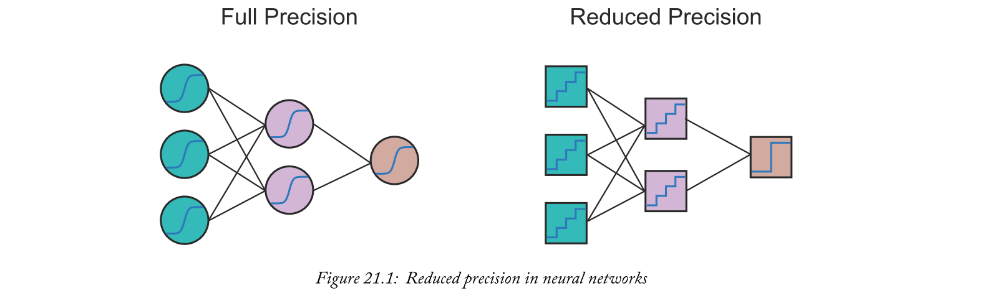
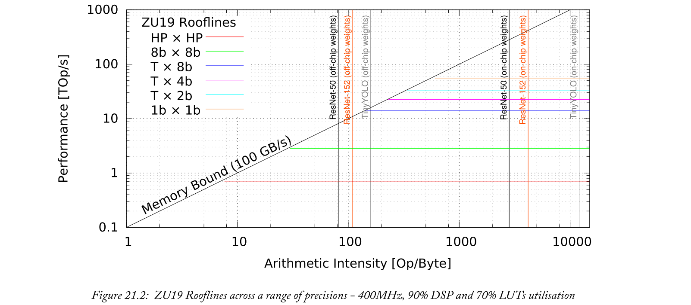
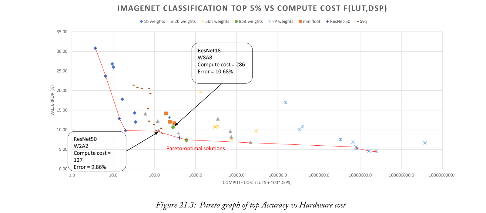
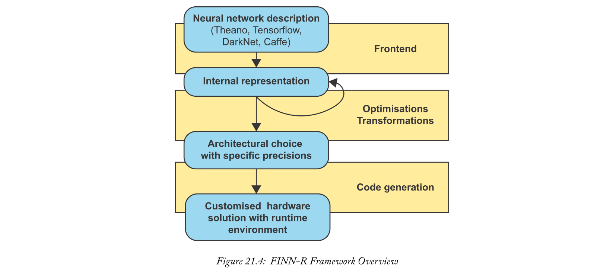
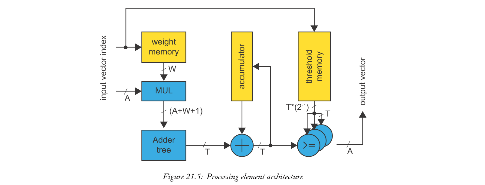
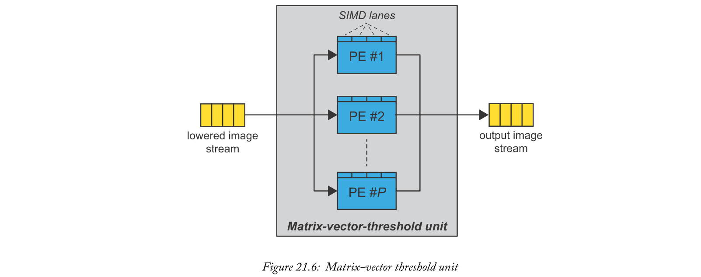
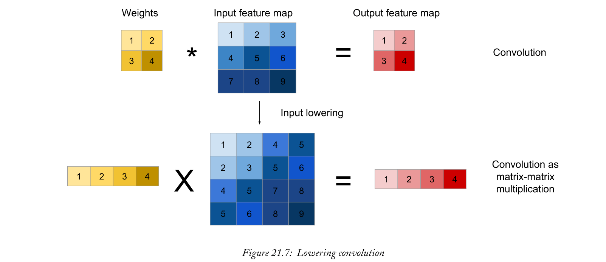
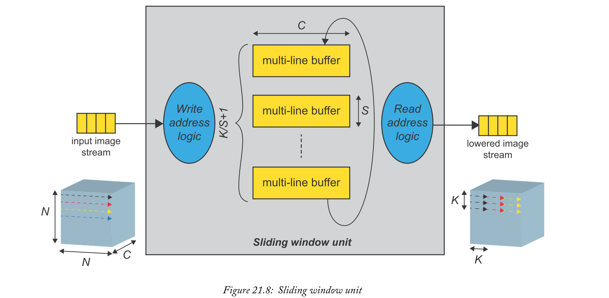
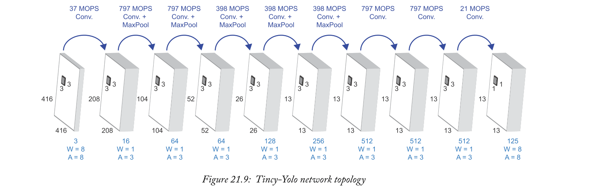

# Chapter 21 Reduced Precision Neural Networks
人工智能和深度学习代表了令人难以置信的令人兴奋和强大的基于机器学习的技术，用于解决许多现实世界的问题。受人脑启发的神经网络现在是最常用的视觉处理算法，在多个应用中的精确度超过了人类。它们能够模拟和处理输入和输出之间的非线性关系，并且它们的特征在于包含沿着神经元之间路径的自适应权重，神经元的参数在训练期间被调整。一旦所有参数被学习以在期望的精度下执行给定的任务，就可以部署神经网络。

## 21.1  Reduced Precision Neural Networks
神经网络中的权重或网络参数传统上是用32位浮点数据类型来实现的，这些数据类型可以表示$10^{-38}$到$10^{+38}$之间的值。尽管如此，已经证明在神经网络中有许多固有的冗余，并且可以表示的数字的扩展动态范围没有被充分利用。因此，替代的数据表示可以在精度方面提供等同的性能，同时提供神经网络的更有效的表示。

神经网络通常可以直接量化到8位，或者甚至更少的位，使用所谓的训练量化，产生量化的神经网络。量化方案可以是均匀的或非均匀的，并且不同的量化方案可以用于网络的不同部分。量化神经网络的概念图如图21.1所示。使用更少的位需要更少的计算和内存，但可能会导致精度略有下降。

基于较小图像分类基准(如MNIST、SVHN和CIFAR-10)的QNNs已被证明可达到近乎最先进的精度[15]。Kim and Smaragdis[[16]考虑完全二进制化(其中权重、输入和输出被二进制化)，突触的预定部分具有`0`权重，而所有其他突触具有`1`权重。他们报告MNIST数据集上完全连接网络的准确率为`98.7%`，并观察到使用这种神经网络进行计算只需要`XNOR`和比特计数操作。Rastegari等人[11]利用受AlexNet、ResNet和GoogLeNet启发的拓扑结构，将卷积二值化神经网络应用于ImageNet数据集，报告top-1的完全二值化精度高达51.2%，部分二值化精度高达65.5%(其中仅部分分量被二值化)。

对于更具挑战性的ImageNet基准测试，使用QNNs时，与浮点型基准测试相比，精确度明显下降。例如，周等人的DoReFa-Net[17]探索了向前传递和向后传递时精度降低的问题。它们的结果包括具有部分(仅具有二进制化权重)和完全二进制化的配置，包括最佳情况下完全二进制化的Top-1精度为43%，部分二进制化的Top-1精度为53%。此外，有大量证据表明，增加网络层大小可以补偿精度的下降，[24]。

### 21.1.1  What is ‘Reduced Precision’?
直觉上，您可能会认为使用精度降低的参数(而不是完整的32位浮点表示)会影响神经网络的精度，但与此同时，许多流行的网络也证明了这一点，即如果训练知道采用量化权重和激活，神经网络可以保持非常合理的精度水平。

同时，神经网络量化为8位整数已被广泛采用，并得到了指定和优化软件库的良好支持，如谷歌的gemmlowp [10]和的Arm Compute Library[14]。

QNNs可以有输入、权重和输出激活的独立数据表示，以及同一网络不同层中的不同位宽。在极端情况下，我们将参数量化到一位精度，我们称之为二值化神经网络。这是一个非常有利的情况，因为乘法和累加运算可以简化为XNOR运算和pop-count运算[11]。
### 21.1.2  Motivation
量化算法在推理中的主要优势有三个:
- 量化的权重和激活的内存占用量明显较低，因此一些量子神经网络的工作集可能完全适合片内存储器，并避免内存访问瓶颈；
- 用定点表示代替浮点，降低位精度必然会将处理能力降低几个数量级；
- 量化运算符的硬件资源成本明显小于浮点运算符。因此，由于神经网络非常适合并行，可以并行实现和占用更多的算术运算，从而可以实现显著的性能缩放。

### 21.1.3  The Impact on Scaling
多种技术，如量化，可以应用于神经网络，以减少内存占用和操作的硬件成本。Roofline模型[13]可以用来展示这些方法的潜力，为系统的性能评估提供直观的可视化表示。该模型显示了一系列应用的理论峰值性能。每个应用程序都由其算术强度(从外部存储器读取或写入的每个字节所执行的操作数)来表示。应用程序峰值性能可能受到内存带宽(图表左侧)或峰值计算(图表右侧)的限制。

图21.2显示了Xilinx ZU19设备的roofline模型[13](在图例中，第一个数字是权重精度，第二个是激活位宽；T代表三元数)。对于每种精度，在给定的总可用资源和单次操作的硬件成本(预期为乘法和累加成本的一半)的情况下，可以计算出器件的峰值性能。

可以注意到，当减小操作数的位宽时，峰值性能(以每秒万亿次运算报告)是如何增加一个数量级的。例如，图表显示，当从半精度浮点到低精度定点时，峰值计算性能提高了82倍。

roofline还显示了由于片内存储器中存储了网络参数，伴随而来的模型尺寸的减小是如何增加Arithmetic Intensity的。三种不同的神经网络拓扑结构，特别是ResNet-50、ResNet-152和Tiny-Yolo的运算强度说明了这一点，这三种拓扑结构分别针对半精度浮点(需要从外部存储器访问)和1位操作(使用片内存储器资源)两种情况进行了显示。1位变量的运算强度大大增加，因此实现不再受内存限制。总之，降低精度会带来更高的运算强度，从而消除内存瓶颈，并结合更高的理论峰值计算，从而在同一设备内实现显著的性能扩展。

精确度的最小降低加上显著的性能提升和功耗节省，提供了非常有趣的设计权衡。图21.3展示了这样一个设计空间探索的结果。在这个例子中，不同的量化方案被用来产生不同计算成本的网络。x轴数字表示整个计算将使用多少个FPGA LUTs和DSP，而y轴表示精度。红线是Pareto边界，包含在计算成本和准确性方面同类最佳的设计点。在这种情况下，我们观察到低精度深层网络(具有2位权重、8位激活的ResNet-50)在较低的计算成本和较低的错误率方面都优于高精度浅层网络(具有8位权重、8位激活的ResNet-18)。

### 21.1.4  Neural Network Implementation Options
现代CNNs具有巨大的内存带宽和高计算需求，挑战现有硬件平台以满足吞吐量、延迟和功耗要求。GPUs提供的高并行性已经成为云环境下机器学习训练任务的首选。此外，GPU供应商已经开发出不太耗电的边缘部署SOC，专门用于推理任务[12]。

在机器学习任务中使用CPUs是推理任务中常见的，特别是在非计算机视觉任务中，而CPUs和GPUs的混合通常用于训练[5]。

在高计算需求和高容量的驱动下，专用集成电路也被专门设计用于机器学习任务。其中最突出的是，谷歌的张量处理单元(TPU)已经被用来在云中为他们的几个主要产品提供动力，包括翻译、照片、搜索、助手和Gmail [6]。同样，边缘TPUs[7]也是为物联网边缘的推理任务而设计的。

FPGAs由于其灵活性和可编程性，非常适合利用低精度推理机利用定制精度来实现给定应用所需的数值精度。此外，根据问题的大小和特征，可以根据适用的要求在同一设备中实现不同的架构。
## 21.2  Introducing FINN-R
机器学习工程师面临的主要挑战之一是:给定一组设计约束和特定的机器学习任务，如何在广阔的设计空间内找到最佳的折衷方案？这个问题的答案需要两个部分:一个是**导出实现目标精度的最易实现的神经网络**；第二部分**着眼于硬件实现本身**。给定典型的神经网络训练时间，导出系统精度结果是一个耗时的过程。即使是潜在的计算优势也不容易理解，因为硬件实现是时间密集型的，部署空间是复杂的，架构选择是无数的，并且对功率、性能和延迟的预测是复杂的。要在给定一组设计约束的情况下找到最佳实现，需要一个框架，该框架在给定一组设计选择的情况下提供洞察和估计，并自动定制硬件实现。

FINN-R试图通过扩展最初的FINN工具[8]来解决这个问题，支持更多的体系结构选择以及二进制以外的混合和可变精度。

FINN支持全二值化神经网络的前馈数据流实现。FINN-R使用量化感知的中间表示来实现特定于QNN的优化，并且具有模块化前端/转换/后端结构，以获得灵活性和增强的支持，这将在下面的章节中讨论。
### 21.2.1  Origins of FINN-R
该工具的第一个版本，即FINN [8]，是一个为Xilinx FPGA设备构建可扩展的快速BNN推理加速器而开发的框架。在原始版本中，支持的唯一精度是输入和权重的二进制，通过XNOR和比特计数(又名汉明权重、popcount或单词中的1)运算来执行乘法和累加。此外，唯一受支持的硬件架构是前馈数据流，这意味着加速神经网络中的所有层都在硬件中同时执行，每个层都有一个计算单元和通过FIFOs的=通信。
### 21.2.2  Reduced Precision Optimisations
通过支持任意精度，FINN-R增强了原始工具的特性。高度模板化的HLS库为使用Vivado HLS的硬件部署提供了理想的后端，而在内部，已经开发了灵活的量化感知中间表示，以在框架内提供支持。
### 21.2.3  Architectural Optimisations
通过提供超出原始前馈数据流的更多架构选择，FINN-R为小型FPGA设备上的大型网络提供了可扩展性。

当完全展开的DF体系结构的最小占地面积超过目标设备能力时，或者当碎片开销不吸引人时，Multilayer Offload (MO)体系结构是有益的。MO对象体系结构是基于在程序设计语言中实现的神经网络层的子集，并通过硬件本身的**多次调用来执行完整的神经网络**。
### 21.2.4  FINN-R Design Flow
在可编程逻辑中，FINN_R为QNN加速器的硬件实现提供insights、评估和自动化定制。

该工具将用于交互式地探索特定CNN的目标平台、架构和精度的高级概念，以实现特定的设计目标并满足给定的约束条件。给定选择，该工具然后定制硬件加速器，DF或者MO样式之一，以满足约束。它目前支持资源占用和吞吐量限制。

该工具对于MO的关键功能是**生成运行时调度**，该运行时调度将计算**排序到硬件引擎上**；而对于DF，则是计算生成**平衡数据流的折叠因子**，由此**整个体系结构逐渐展开**，直到达到设计目标。

如图21.4所示，FINN-R具有受LLVM编译器基础设施启发的模块化结构，具有**frontends、passes和backends**，以及量化感知的量子神经网络中间表示。前端负责与所选的训练框架(如Caffe、DarkNet和Tensorflow)进行接口，并将经过训练的QNNs翻译成IR。

IR被用作性能评估工具的基础。支持几种有助于生成更高效表示的转换。最后，后端包含一个代码生成器，它为包括PYNQ-Z1、PYNQ-Z2、Ultra96和AWS F1在内的一些平台创建可执行推理加速器。
### 21.2.5  Working with FINN-R
在FINN中，已经发布了许多end-to-end的示例设计，提供了从训练量化神经网络开始，一直到在硬件上运行的加速设计的演示。这些示例跨越了一系列数据集和网络拓扑，依赖于开源模板化的Vivado HLS流组件库:FINN附带了一个HLS硬件库，它实现卷积、全连接、池化和LSTM层类型作为流组件。该库使用C++模板来支持各种精度和图层类型。

一组在真实硬件上预先制作的加速器可在多个板上使用，即:
- BNN-PYNQ[1]展示了使用多精度前馈数据流的图像分类加速器的示例；
- QNN-MO-PYNQ[2]展示了使用multi-layer offload以多种精度进行图像分类加速器的示例；
- LSTM-PYNQ[3]利用LSTMs实现光学字符识别。

支持多个Xilinx设备的Python工具流也是公开可用的[4]，将训练好的、量化的Caffe网络转换为在真实硬件上运行的加速器。[23]提供了所有材料，并总结了它们的特点。
## 21.3  Neural Networks on Programmable Logic
如前所述，神经网络中的计算和内存需求可能非常大:例如，像ResNet-50这样流行的DNN图像分类需要对每个输入图像进行77亿次运算。从好的方面来说，DNN本质上是高度平行的，可以利用。因此，许多形式的定制硬件架构正在发展，以使这些算法的部署成为现实。

DNN的推理计算包含多个并行级别，可以概括为:
1. 连续层之间的粗粒度拓扑平行性，以及在GoogLeNet或DNN系列中发现的并行分支；
2. 层内神经元和突触的并行性，如卷积层中的多个输入/输出特征映射通道和像素；
3. 当单独查看权重和激活的各个位时，算术内部的位级并行性。

对于FPGAs和ASICs来说，在将神经网络映射到硬件方面存在大量工作，利用了这些并行性级别。读者可以参考Misra and Saha[18]的著作进行全面的调查。

一般来说，最近针对神经网络的现场可编程门阵列硬件实现的工作可以根据其基本架构大致分为三大类:
- 单个处理引擎，通常以脉动阵列的形式，顺序处理每一层；
- 流架构，由每个网络层一个处理引擎组成，输入通过数据流架构进行流传输，所有层并行计算；
- 一种向量处理器，其指令专用于加速卷积的原始运算。

像(1)和(3)这样的覆盖架构的主要优点是，仅**通过改变代码或脉动阵列/向量处理器上的网络调度**，就可以将单个硬件设计用于不同的网络集合。流式架构通常是为要加速的目标网络定制的。

### 21.3.1  A Neuron in Programmable Logic
神经元的基本结构由一个X输入组成，通过突触连接与神经元相连。第489页第20.2.1节定义了神经元的基本功能；这是一个应用于输入加权和的非线性函数。

当神经元在可编程逻辑中实现时，它包括至少一个执行输入和它们的相对权重的乘法和累加引擎，以及执行神经元激活的块。常见的激活功能有:
- **Rectified Linear Units (ReLU)**: function that takes the maximum of the accumulation value and 0; 
- **Linear**: or identity, the function returns the value of the accumulation; 
- **Sigmoid**: or logistic function is an S-shaped function between 0 and 1 following the formula $\frac{1}{1+e^{-x}}$ ;
- **Hyperbolic tangent function**: is an S-shaped function between -1 and +1 following the $tanh$ formula. 

图21.5显示了在FINN-R[9]中实现单个神经元的处理元件的内部结构。对于致力于降低精度权重(W-bits宽)和产生降低精度输出激活(A-bits宽)的神经元，可以执行特别优化。通过比较神经元累加器值和一组阈值，可以简化对累加值执行的神经元激活、输出量化和任何其他线性变换。对于每个通道，离线评估的这些阈值具有与累加器相同的宽度(T-bits宽)，以便在累加阶段结束时进行比较。如果输出激活为A-bit宽，`2A-1`阈值需要存储在阈值存储器中。

### 21.3.2  Creating Layers
神经网络中的层基本上由一组以不同方式连接的神经元组成。完全连接的层将一层的所有输入连接到以下每个神经元。从数学上讲，层的输入向量乘以权重矩阵，得到输出向量，如(21.1)所述。

$$
\left(\begin{array}{ccc}{W_{1-1}} & {W_{1-2}} & {W_{1-3}} \\ {W_{2-1}} & {W_{2-2}} & {W_{2-3}} \\ {W_{3-1}} & {W_{3-2}} & {W_{3-3}}\end{array}\right)\left(\begin{array}{c}{I_{1}} \\ {I_{2}} \\ {I_{3}}\end{array}\right)+\left(\begin{array}{c}{b_{1}} \\ {b_{2}} \\ {b_{3}}\end{array}\right)=\left(\begin{array}{c}{O_{1}} \\ {O_{2}} \\ {O_{3}}\end{array}\right) \tag{21.1}
$$

完全连接层的硬件实现类似于**矩阵向量乘法的硬件实现**，如图21.6所示，其中多个神经元并行处理输入图像，如FINN [8]中所实现的。

类似地，卷积层可以简化为矩阵-矩阵乘法。简化通常通过获取输入特征(对于第一层，图像)并应用im2col [19技术来执行，该技术重新排列并潜在地复制输入特征图的部分，生成所谓的lowered图像，以便将计算表示为矩阵-矩阵乘法，如图21.7所示。

在FPGAs中，im2col可以通过智能寻址方案来实现，即所谓的滑动窗口单元(SWU)，这样可以避免显式输入重复。

图21.8直观地显示了卷积层的SWU运算。假设输入feature map与$N \times N$像素和C通道平方，它以光栅扫描的形式到达输入端，意味着一个像素的所有通道，从左到右一行接一行。SWU利用多线缓冲和可编程地址逻辑来生成降低的图像，为后续卷积提供$K \times K$输入数据的窗口。

### 21.3.3  Design Methods and Tools
绝大多数机器学习工程师都熟悉高级编程语言。现代机器学习框架，如TensorFlow、Caffe、mxnet、Torch和PyTorch，都是建立在Python/C++/Lua之上的，而FPGA设计通常依赖于更低抽象层次的硬件描述语言，如VHDL或Verilog。

最近，现场可编程门阵列制造商已经提供了支持更快硬件开发的工具，例如Vivado HLS，它支持在C/C++中描述硬件。SDAccel和SDSoC等新工具为数据中心FPGA、Zynq和Zynq MPSoC设备提供了更简单的设计体验，有助于硬件实现与主机环境的集成。

提供一个框架来连接机器学习工具和硬件部署是至关重要的。Xilinx ML套件使开发人员能够优化和部署加速ML推理引擎。它支持许多常见的机器学习框架，如Caffe、MxNet和Tensorflow，以及Python和RESTful APIs，使用xfDNN编译器/优化器和量化器(8位)在多个平台上部署[20]。类似地，FINN-R[9]通过使用开源的Vivado HLS层库，自动化了QNNs的部署。
## 21.4  FINN-R Case Study: An Inference Accelerator for Zynq MPSoC
目标检测旨在对图像中的单个目标进行分类和定位，是最受欢迎的机器学习任务之一，尤其是在汽车市场。针对这一挑战的一个流行的参考数据集是Pascal Visual Object Classes(Pascal VOC)，实现对象检测任务的最先进的网络之一是Yolo [21]及其较小版本Tiny-Yolo。

用像Tiny-Yolo这样的流行神经网络进行目标检测需要近70亿次浮点运算来处理单个帧。这给具有实时性能的嵌入式设备的加速带来了巨大挑战。

Zynq MPSoC平台是真正的异构平台，提供的不仅仅是一个现场可编程门阵列加速器。如前所述，这些平台包括强大的Arm多核处理器，它不仅允许应用程序在方便的操作系统环境中运行，还通过基于线程的并发性提供了额外的计算能力。在intense线性代数环境中，这些处理器中可用的NEON矢量扩展也是最有意义的，因为它支持并行SIMD运算，例如在四个单精度浮点通道或八个16位整数通道中。

图21.9显示了名为Tincy-Yolo的网络拓扑，它是从最初的“Tiny”实现中修改而来的。网络的输入和输出层已被证明对量化敏感，因此保持在较高的精度(8位)，而神经网络的其余部分占全部操作的97%以上，在这些操作中，大量量化。通过使用二进制权重(-1，+1)和3位特征映射像素，算法大大简化，同时通过成功的再训练，将检测精度保持在全精度网络的3%以内。

低位宽量化自然适合可编程逻辑实现，因为它可以真正利用低位宽操作的降低成本，从而实现神经网络核心部分的高并行性加速。

神经网络的其余部分，即第一层和最后一层非量化层，需要加速以满足实时要求。增加每个周期算术运算数量的一个显而易见的方法是矢量化，这是由平台处理器的NEON扩展提供的。使用128位寄存器，可以在四个32位通道和多达十六个8位通道中执行等效并行计算。使用集成在Darknet中并已用于PS和PL之间通信的已开发卸载机制，我们因此实现了具有im2col[19]实现的定制层，该实现量化图像数据，同时通过gemmlowp库[10]实现被乘数矩阵和矩阵乘法。

我们应用了一些神经网络手术，例如在最后两层上的Channel修剪和第一个MaxPool层的去除，同时增加第一个卷积层的步幅。综上所述，所有这些优化导致推理执行速度提高了160倍，这也归功于Zynq MPSoC支持的多线程执行。演示实现了几乎三倍的速度，在小型ZU3设备(Ultra96板上)上的帧速率为16 fps。这允许现场视频以在实践中被认为是平滑的方式播放，[22]。

## 21.5  Chapter Summary
本章介绍了机器学习，特别是神经网络中降低精度的概念。可编程逻辑使性能相对于标准浮点神经网络按数量级缩放成为可能，从而产生一个有趣的设计权衡，以换取精度的小幅降低，如图21.3中的Pareto图所示。特别是结合FPGAs，可以探索推理引擎的广泛体系结构，从而可以利用最小精度来精确实现应用所需的数值精度。

我们在开源框架FINN-R [9]中提供了工具的例子，它帮助设计者找到实现机器学习任务的有趣的折衷方案，所有希望在Xilinx Zynq MPSoC设备上实现机器学习任务的人都应该对此感兴趣。所有示例都通过我们的登录页面进行了交叉链接，网址为:https://www.pynq.io/ML
