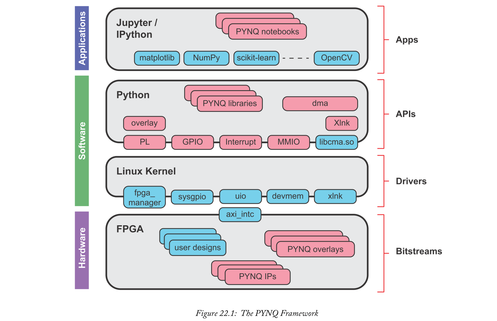
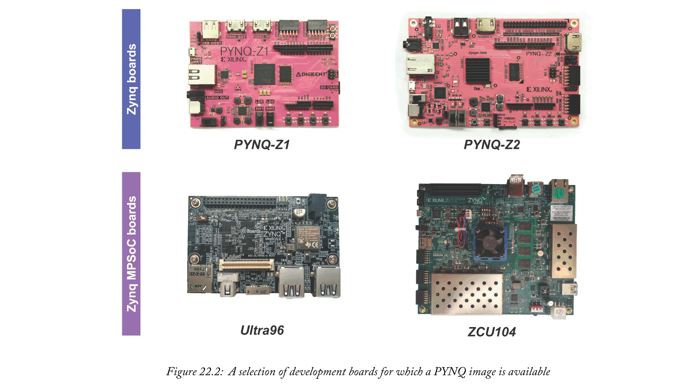
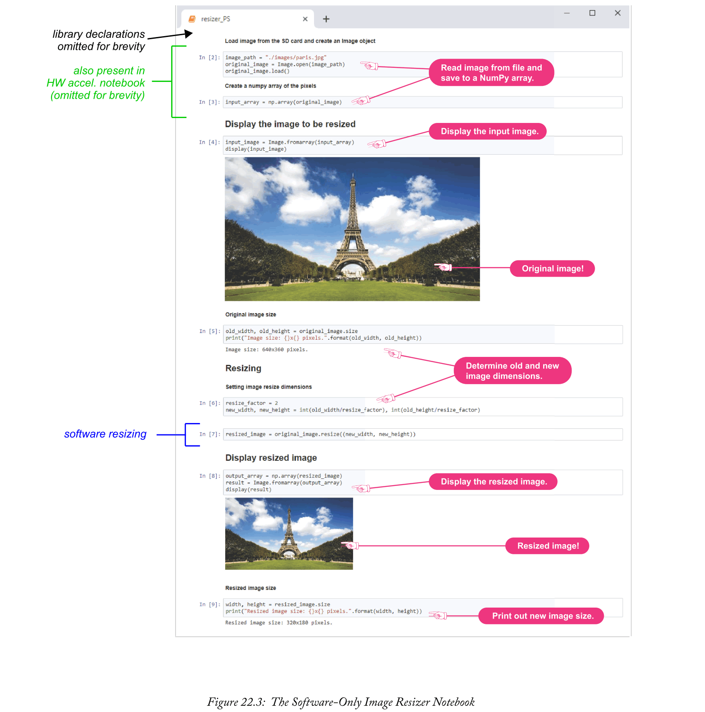
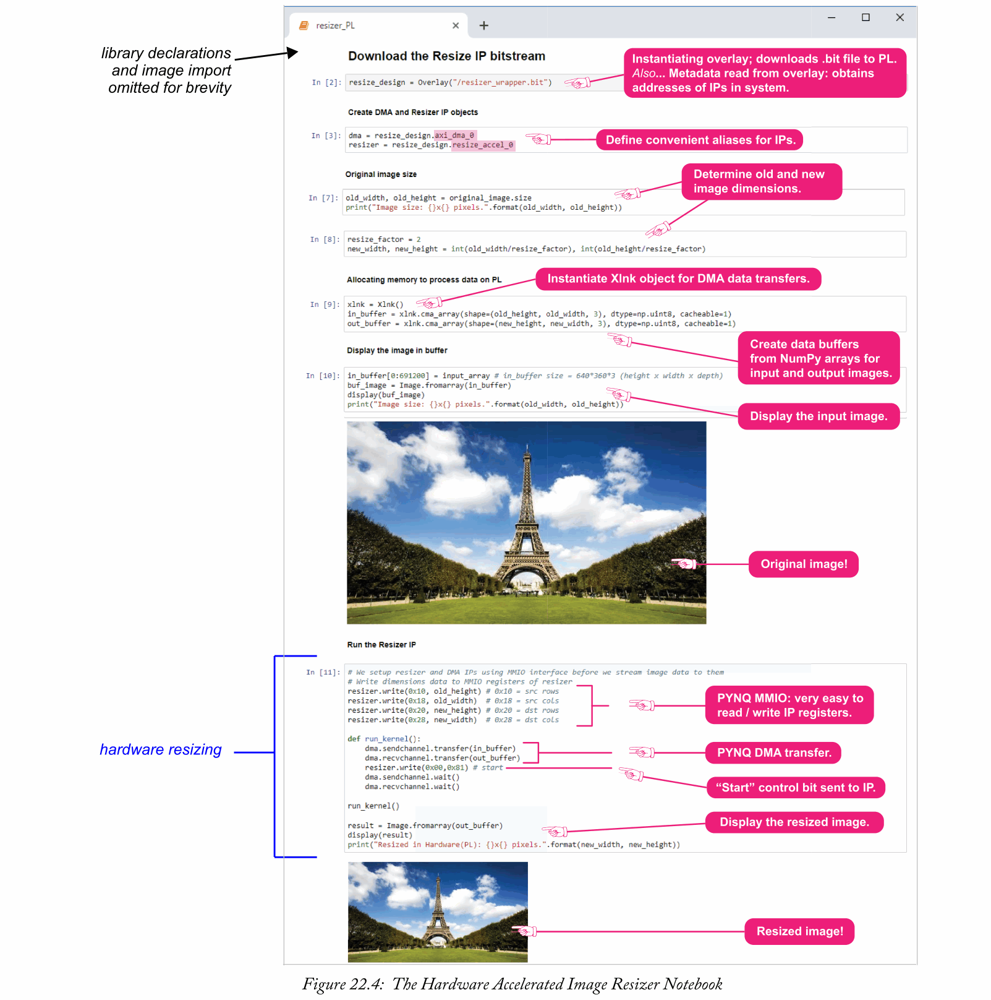
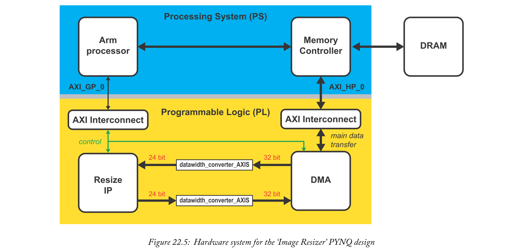
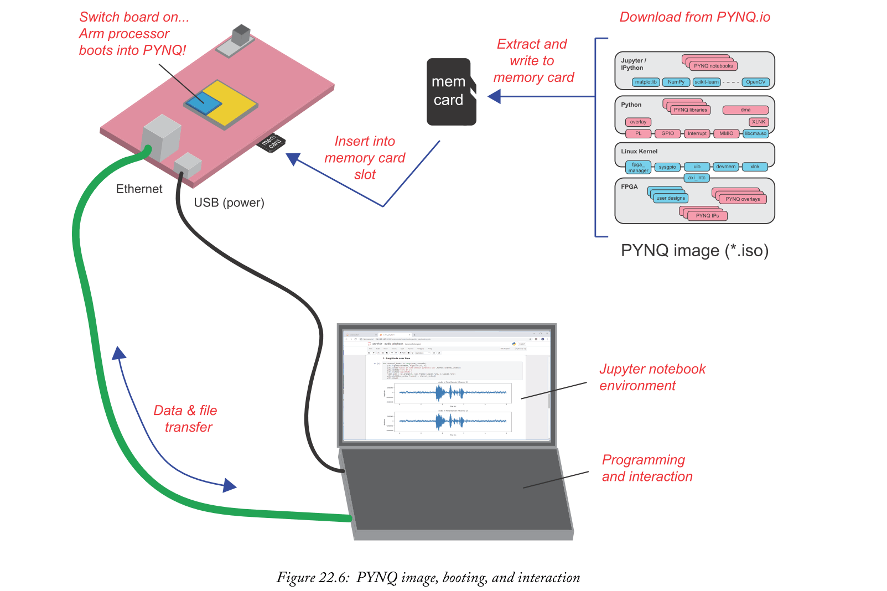
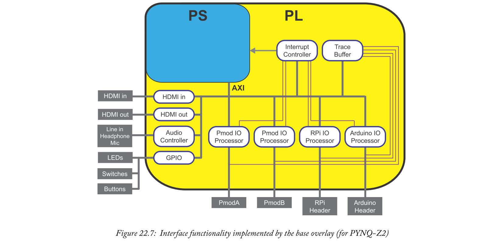
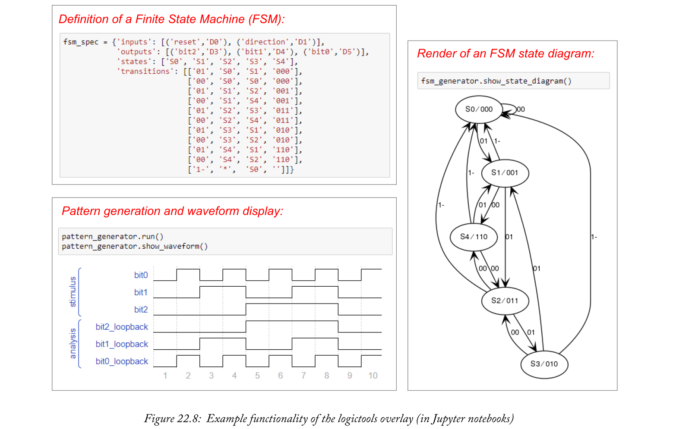
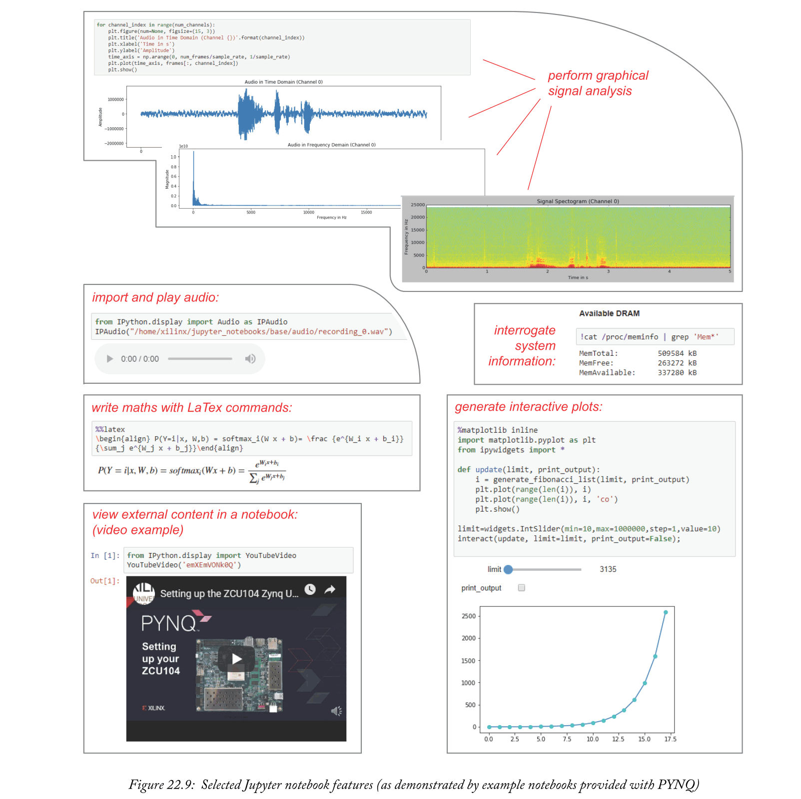
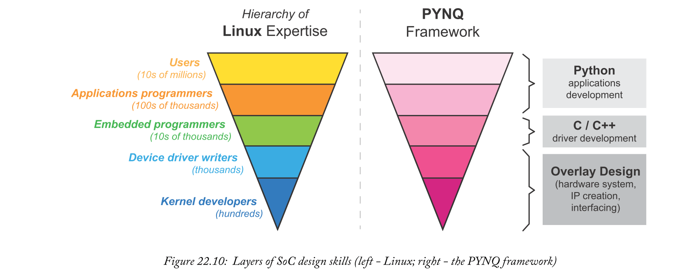

# Chapter 22 PYNQ

PYNQ是一个开源框架，用于创建和使用Zynq和Zynq MPSoC设备的应用程序。“PYNQ”这个名称来源于“Python productivity for Zynq”；顾名思义，PYNQ使用Python编程语言来简化使用Zynq设备创建应用程序的过程。这有两个重要的结果:它提高了已经与Zynq合作的设计师的生产率；它减少了新用户的进入障碍，特别是那些硬件设计经验有限的用户。

本章将解释PYNQ的关键概念，并就如何开始创建自己的设计提供实践指导，同时还介绍一些来自开源社区的示例。

## 22.1  Introducing PYNQ
PYNQ(发音为“pink”)是一个集成软件和硬件组件的框架，旨在使用Zynq设备(包括Zynq MPSoC)促进更快、更高效的开发。在接下来的几页中，我们定义了“框架”在这个上下文中的含义，并解释了什么是PYNQ(以及澄清了它不是什么！)。我们还讨论了PYNQ为什么采用Python，并概述了PYNQ计划的目标。

### 22.1.1  PYNQ as a Framework
在这一章中，我们将PYNQ称为一个框架——为什么？

一般来说，框架被定义为支撑系统或概念的结构。更具体地说，“软件框架”[22的维基百科条目提供了一个很好的概述。

维基百科描述：

“在计算机程序设计中，软件框架是一种抽象，在这种抽象中，提供通用功能的软件可以通过附加的用户编写的代码来选择性地改变，从而提供特定于应用的软件。软件框架提供了构建和部署应用程序的标准方法。软件框架是一个通用的、可重用的软件环境，它作为更大的软件平台的一部分提供特定的功能，以促进软件应用程序、产品和解决方案的开发。软件框架可能包括支持程序、编译器、代码库、工具集和应用程序编程接口(APIs)，它们将所有不同的组件集合在一起，以支持项目或系统的开发。”

PYNQ非常符合维基百科的描述，因为它提供了一套集成的软件和硬件组件，设计者可以将其作为基于Zynq的系统的基础。没有必要使用所有可用的组件，并且可以在它们的基础上自由构建、定制和创新。因此，PYNQ框架代表了一个牢固的、已建立的起点，可以按其原始形式使用，根据需要进行修改和扩展。

正如本章剩余部分所强调的，PYNQ框架是对主流Xilinx工具的补充，而不是取代它们——特别是，PYNQ加速了基于Zynq的嵌入式系统的软件/硬件协同设计方面，并使PS和PL之间的接口任务更加容易。
### 22.1.2  What is PYNQ?
正如本书前面所讨论的，基于Zynq的嵌入式系统可以被认为是一个layer的堆栈，从底层的硬件系统设计延伸而来；通过操作系统层，包括低级软件驱动程序和用于与硬件接口的应用程序接口；运行在操作系统之上的软件应用程序。根据目标设计，完整系统的创建可能需要大量的设计工作，涵盖一系列不同的技能、专业知识和设计工具。

PYNQ通过提供预配置的软件栈来解决协同设计的复杂性，该软件栈由硬件和软件组件库扩充，这些组件库可以根据目标应用程序有选择地重用。图22.1展示了PYNQ框架的一般概念，并展示了不同的PYNQ层如何与典型的基于Zynq的嵌入式系统相关联。

#### Upper Layer (Applications)
在PYNQ堆栈的顶部，一个或多个Jupyter Notebooks促进了用户交互。Jupyter是一个开源项目，起源于学术界，起源于数据科学，该项目的一个关键目标是推进“reproducible science”[11]。简而言之，Jupyter计划使科学成果能够以一种方式呈现，使读者能够通过合理的努力再现和验证作者的主张。

Jupyter允许用户创建交互式文档，称为“notebook”，通过标准的网络浏览器提供。这些笔记本可以包含各种不同的内容，包括实时可执行代码和可视化，以及文本、图形和数学文档，它们被组织在可以单独执行的单元中。最初被称为IPython(Interactive Python)笔记本，仅采用Python编程，Jupyter Notebooks现在支持多种编程语言[20]。最近，Jupyter Labs已经将这个概念扩展到一个完整的基于网络的集成开发环境。Jupyter Notebooks是Juypter Labs不可分割的一部分。

PYNQ的一个显著特点是其Jupyter Notebooks宿主在Zynq的Arm处理器(即嵌入式设备)上，而Jupyter项目最初是为桌面和服务器计算而设计的。Notebooks位于Zynq PS上的网络服务器上，用户通过网络连接从标准网络浏览器访问它们。稍后，我们将在第22.2节中看到Jupyter Notebooks的示例。

在PYNQ Jupyter notebook中，开发人员通过编写自己的Python代码，并选择性地重用许多可用的开源Python库中的第三方代码，来创建自己的自定义功能。他们还可以添加文档和可视化内容来帮助其他人理解和使用设计。

除了开发基于软件的功能在处理器上运行之外，Notebook中的Python代码还可以将处理工作转移到在PL上运行的硬件模块上。与硬件的交互是使用PYNQ框架中提供的PYNQ APIs和驱动程序来实现的(通过图22.1所示的PYNQ堆栈的所有层，从应用层到硬件层)。因此，程序员使用硬件块的经验非常类似于从软件库中调用函数——软件开发人员可以调用硬件块，而无需了解硬件设计的内部。



#### Middle Layers (Software) 
PYNQ堆栈的中间层由Python软件、操作系统和低级软件驱动程序组成。

在中间层上面，PYNQ框架包括PYNQ库和APIs，用于与基于Zynq的系统的各种元素进行交互。例如，有一些Python APIs，用于将Overlay(比特流文件)下载到PL，用于与GPIO资源通信，以及处理PL中生成的中断。还有用于内存映射传输(MMIO)和DMA传输的Python APIs。与其他设备(或设备组合)相比，Zynq和Zynq MPSoC最显著的优势之一是能够在处理器和可编程逻辑之间快速移动大量数据，反之亦然。PYNQ的使用使得这些传输能够使用Python代码以非常简单的方式进行控制。

在较低的中间层，PYNQ框架包括一个基于Linux的操作系统，启动系统启动的bootloader，以及一个托管Jupyter notebook的网络服务器。因此，开发嵌入式系统通用软件元素的设计工作被移除了，新用户可以很快开始使用Zynq——这是PYNQ框架的一个关键优势。中间层的下面还包括一组驱动程序，用于与Zynq硬件系统的元素交互。
#### Lower Layer (Hardware) 
堆栈的底层代表硬件系统设计，通常在Vivado中使用IP Integrator和相关设计工具创建，然后生成比特流(*.bit)文件。比特流文件被传送到插入目标板的存储卡上。然后，将硬件系统编程到PL上的过程可以直接从Jupyter笔记本(运行在PS上)中启动，只需使用一行代码:
```
my_overlay = Overlay(“/path/to/your/overlay/file/bitstream.bit”)
```
在PYNQ中，硬件系统设计通常被称为overlay。它们可以以类似于软件库的方式使用，其中为特定的应用领域开发硬件系统，但是具有便于增强共享和重用的通用性方面。硬件设计的细节可以抽象出来，它们的功能可以通过一个API在Python中公开，这使得使用PYNQ成为一种非常以软件为中心的风格。如第22.4节所述，PYNQ的目标之一是使没有硬件专业知识的设计者能够基于预先存在的Overlays在软件中开发应用程序。它还帮助硬件工程师创建可以被软件工程师评估和使用的设计。

虽然overlays通常是通用设计，但也可以采用更传统的硬件/软件协同设计方法，其中高度定制的硬件是为特定的用例开发的。这里，可以利用PYNQ框架的几个优势，包括现成软件堆栈的可用性、与已开发硬件设计元素的接口的便利性，以及适应和扩展软件编程环境的潜力。可用的PYNQ IPs集也可以自由重用——这包括用于直接存储器存取、音频、视频和I2C的接口模块，以及来自逻辑工具的组件(一个overlay将在后面的第22.3.3节中描述)。

考虑到所有这些可重用的组件，我们可以定义术语硬件库。这是一个总括性的术语，它指的是作为PYNQ框架的一部分可用于灵活重用的一组IP和overlay。硬件库可以被认为类似于软件库。当然，开发人员也可以创建额外的硬件库供自己使用，或者与其他人共享。
### 22.1.3  Why Python?
Python是一种解释语言，这意味着它提供直观的高级编程，但与编译语言(如C或C++)相比，代码执行速度较慢。解释语言的使用有助于交互性，因为代码的更改和添加可以立即运行和评估。在PYNQ中，PYNQ解释器运行在Zynq上，这使得交叉编译变得不必要，因此大大简化了整个设计过程。PYNQ框架还在目标上本地包含GCC(GNU编译器集合)，允许用C和C++扩展Python。

在PYNQ的notebooks中，执行速度通常不是一个重要因素，但在这种情况下，性能可以通过集成优化的C/C++函数和由主要PYNQ代码调用的库来提高(因此，PYNQ采用了CPython的实现)。更重要的是Python作为“生产力语言”的地位，这意味着可以快速可靠地开发有用的代码。

此外，Python真的很受欢迎！无论是通过学习、工作还是爱好，这本书的许多读者都已经熟悉这门语言了。近年来，Python的采用量大幅增加，根据IEEE Spectrum的年度调查(有趣的是，Python也首次被列为嵌入式语言)[2，截至2018年，它已成为最受欢迎的编程语言。学生和刚毕业的学生通常特别容易接触到Python，因为它通常在大学和学院以及高中的入门软件课程中教授。因此，PYNQ为基于Zynq的嵌入式系统提供了一种许多潜在用户已经习惯的语言编程。

Python的另一个关键优势是可以从开源社区中利用丰富的资源，包括NumPy、Matplotlib、OpenCV等包。事实上，可用软件库的选择在不断扩展和演变，这为设计人员在他们的项目中重用代码提供了很大的空间，而不必花时间从头开始开发所需的功能——这是大大提高设计人员生产率的另一个因素。

牢记这些主要属性，使用Python是PYNQ的“生产力”概念的核心。
### 22.1.4  What PYNQ Is Not!
描述了什么是PYNQ之后，从高层次上澄清PYNQ不是什么也是有用的，从而澄清一些可能出现的误解。

#### PYNQ is Not... a board
如前所述，PYNQ是一个软件框架。它最初是与一个特别支持的PYNQ-Z1开发板一起发布的，其特点是一个粉红色的印刷电路板(最近，一个PYNQ-Z2已经发布，它也是粉红色的)。关于这些板子有两个常见的误解。

第一个是“PYNQ”这个词指的是这些粉红色的板子(例如，“我刚买了一个PYNQ！”)。相反，PYNQ-Z1或PYNQ-Z2是PYNQ支持的物理开发平台，其中PYNQ是指可以在其上运行的软件框架。

第二个常见错误是假设PYNQ软件框架只能部署在粉红色板上。PYNQ-Z1和PYNQ-Z2由PYNQ项目支持，其他开发板也是如此，包括ZCU104和Ultra96 Zynq MPSoC板。对开发板的主要支持形式是发布在其上运行的预先测试的PYNQ映像(更多关于第22.3.1节中的映像)，图22.2显示了PYNQ映像可用的板的选择。如果您的目标板没有准备好的图像，创建一个映像很简单。


#### PYNQ is Not... for synthesising circuits from Python
由于PYNQ涉及Zynq SoC平台的Python编码，因此有时会推断Python编码用于硬件描述和验证，即生成在PL部分实现的电路。事实并非如此——在PYNQ中，Python仅用于在PS上编程，包括通过PS-PL接口与硬件交互。不支持根据Python描述生成HDL代码，但是设计人员有其他几种硬件开发选项，包括使用预先验证的知识产权集成器模块、使用高级合成(HLS)和系统生成器工具的定制设计、传统的VHDL / Verilog编码...或者他们目前使用的任何其他方法。

确实存在用于基于Python的HDL生成和验证的第三方工具，对该领域感兴趣的读者可能希望研究免费开源工具，myHDL[4]。

#### PYNQ is Not... just for students and hobbyists
随着低成本开发板的出现，开源模式的采用，以及为教学和项目提供的大量资源，人们很容易得出结论，PYNQ只针对学生和业余爱好者。

虽然这些社区确实得到了很好的支持，但是PYNQ也适合研究和专业开发人员，他们可以利用PYNQ的可扩展性来满足自己的定制板和需求。使用PYNQ框架可以获得的生产力的潜在收益、它的开源性质以及第三方软件库的可用性都是考虑PYNQ用于商业项目，特别是原型开发和开发演示者的好理由。为了说明这一点，第23章提供了一个案例研究，展示了PYNQ在商业卫星成像系统原型制作中的成功应用。PYNQ支持的研究的一个很好的例子是在[6]中讨论的加速框架。

## 22.2  An Example PYNQ Application
为了演示PYQN中的Jupyter notebook界面，在接下来的两页中将展示两个示例notebook。notebook实现了相同的功能:在每种情况下，图像文件都会从其原始尺寸缩小到一个新的更小的尺寸，其中x轴和y轴都缩小了用户指定的整数倍。区别在于第一个notebook(图22.3)是一个专门在Arm处理器上执行的软件实现。相比之下，第二种设计(图22.4)利用PL加速图像重新调整操作。请注意，为了便于演示，省略了一些步骤，如导入数据和库。





本例展示的PYNQ的一些主要特性是:
- 使用PYNQ笔记本进行编程和用户交互。
- 将比特流下载到电路板上编程的简单方法。
- 通过解析Vivado生成并作为overlay 文件集一部分的文件，解释overlay元数据，包括IP的详细信息(这一方面将在第22.3.5节中进一步讨论)。
- 使用Python应用编程接口在PS和PL之间轻松传输数据。

该示例由Xilinx开发，可从 www.pynq.io/community.html  PYNQ网站的社区页面获得，标题为“PYNQHello World”。如果您可以访问受支持的开发板，您可以安装该示例并亲自试用。

### 22.2.1  Python Notebook (Software Only)
第532页的图22.3首先显示了纯软件的例子。在这种情况下，所有功能都是在Python中实现的(具体来说，调整大小的操作由来自Python Imaging Library(PIL)的一个功能来执行)，所有处理都在Zynq设备的PS部分进行。Notebook包括文档以及解释相关步骤的Python代码，调整大小前后的图像显示在Notebook中。

值得一提的是，Jupyter Notebook可以保存并嵌入结果，这使得与其他人共享结果变得很容易。收件人也可以轻松地重新运行Notebook并重现结果。

### 22.2.2  PYNQ Notebook (Hardware Accelerated)
第二个software-hardware notebook如图22.4第533页所示。它与第一个类似，但是集成了一个硬件IP来加速图像的大小调整，这是notebook中计算量最大的任务。IP是OpenCV resizing函数的Xilinx实现。值得注意的是，用于图像调整大小的硬件块可以以与软件功能相同的方式调用。

第22.2.3节回顾了本笔记本的硬件系统和相关软件交互。

### 22.2.3  System Architecture (Hardware Accelerated Version)
第二个notebook(第533页的图22.4)以基于PL的resizing操作处理为特色，由图22.5所示的硬件系统设计支撑。尽管这是一个简单的应用程序，但该设计利用了PYNQ的几个重要特性。



#### Operation
原始图像从存储卡上的文件中读取，并作为NumPy array存储在笔记本中。确定输出图像的尺寸，并创建适当大小的NumPy array。在notebook中的Python代码中，连续内存被分配到DRAM中，输入和输出图像array在那里被缓冲。

DMA和Resizer都是以PL中的IP块的形式存在的，**DMA位于PS内存与Resizer数据路径之间**。当在Jupyter notebook中实例化resizer设计的overlay时，设计文件中的元数据由PYNQ框架的“Overlay”类解析。这个过程公开了overlay中包含的IP块，以便通过Python进行交互(如果需要，可以指定不同的名称；在这种情况下，使用了“resizer”和“dma”)。

通过将输入和输出图像的宽度和高度写入适当的寄存器，首先用输入和输出图像的尺寸配置Resizer IP，如图22.4中notebook突出显示的部分所示。在硬件上，这是通过通用的AXI端口AXI_GP_0在AXI-Lite上进行的，它在PYNQ中由Python“MMIO”类启用。然后，通过AXI高性能端口AXI_HP_0发起一个DMA传输(类似地，这使用PYNQ“DMA”类)，并通过AXI-Lite将一个寄存器命令写入Resizer IP以开始操作(再次使用“MMIO”)。一旦完成，对应于调整大小的图像的数据就可以从输出缓冲器中读取并显示在笔记本中。

标准32位数据字和图像数据格式所需的24位(红色、绿色和蓝色各8位)之间的转换发生在DMA和Resizer IP之间。
#### Enabling PYNQ Features
在本notebook中，对于任何以硬件元素为特征的notebook，比特流下载到PL上是由一行简单的代码启动的。同时，overlay在notebook中被实例化为一个Python对象。在这种情况下:
```
resize_design = Overlay(“/resizer_wrapper.bit")
```
然后可以查询overlay对象来确定它包含的IP，
```
resize_design?
```
这将生成一个内嵌报告，其中包含overlay的详细信息，包括其IP和相关驱动程序。在这种情况下，PYNQ“DMA”驱动程序与DMA IP块相关联，通用的“Default IP”驱动程序与Resizer IP相关联。
```
IP Blocks
----------
axi_dma_0            : pynq.lib.dma.DMA
resize_accel_0       : pynq.overlay.DefaultIP
```
因此，PYNQ提供了一种编程硬件的简单方法，并自动公开了可以使用Python编程交互的IP。

图像resizer设计具有两种不同的接口类型:DMA和AXI-Lite。

主要数据传输(即图像数据的传输)是通过DMA来实现的，在PYNQ中，它由多种特性的组合来支持。首先，利用NumPy开源库的设施:图像数据作为NumPy数组存储，这是PYNQ Xlnk类支持的数据格式，用于在PS内存中连续分配内存。这表示数据传输到Resizer IP的第一阶段。然后使用PYNQ的DMA类来处理PS内存和DMA引擎之间的传输。

控制数据通过AXI-Lite在Arm处理器和DMA和Resizer IPs之间传递，它利用了MMIO API，PYNQ框架的另一部分。

回头参考图22.1，可以确认这个例子以PYNQ框架所有层的组件为特征。
- 在Apps Layer，开发了一个Jupyter notebook，利用了Python图像库(PIL)、NumPy库和IPython来显示图像。
- 在APIs Layer，PYNQ Overlay、MMIO、Xlnk和DMA APIs都被使用。
- 在此之下，Linux操作系统和驱动程序层对用户透明地运行，但是运行内核驱动程序，包括用于编程程序的“fpga-manager”和用于内存分配的“xlnk”。
- 最后，比特流层有一个准备好的图像resizer PYNQ overlay。

### 22.2.4  Key Observations
比较这两个笔记本(software-only，versus software and hardware)，可以发现两者实际上非常相似——硬件resizer程序是从Python中调用的，方式与软件功能相同。开发利用Zynq / Zynq MPSoC架构特性的PYNQ应用程序(例如，与外设接口，或使用硬件加速器)的努力与创建纯软件的Jupyter笔记本相当。任何基于PL的外围设备都可以使用标准接口类型暴露在Jupyter Notebook中。利用PYNQ框架，调用基于硬件的处理器就像调用等效的软件功能一样简单。

在这个简单的image resizer示例中，基于PYNQ-Z2板，将图像调整功能移动到PL中的效果允许大约三倍的加速，从24.6ms到7.6ms。在所有情况下，得益于用户友好的Jupyter界面，可以为其他功能实现更大程度的硬件加速。

## 22.3  Components of a PYNQ System
考虑了一个PYNQ应用程序的例子后，我们现在将更概括地回顾PYNQ系统的组件，并从设计者的角度解释所涉及的步骤。更多高级用户定制PYNQ的机会也将在适当的时候强调。

### 22.3.1  PYNQ Image
PYNQ映像是构成PYNQ框架的软件层的实际体现，如图22.1所示，并且提供了任何PYNQ系统设计的基础。如图22.6所示，PYQ映像引导电路板，并在目标Zynq或Zynq MPSoC芯片的PS部分运行，这意味着Jupyter用户界面和所有notebooks都在嵌入式设备上执行。

image的应用层包括Jupyter和IPython，以及一组有用的开源Python库，以及入门的PYNQ notebooks示例。如前所述，用于与overlay和硬件交互的APIs包含在第二层中，然后是第三层中的Linux操作系统和驱动程序。Jupyter webserver是操作系统的一部分，用于通过网络连接托管Jupyter接口。
根据板的不同，硬件层中提供了一小组示例overlay，包括base和logictools overlays(将在第22.3.3节中讨论)。

受支持主板的PYNQ映像可以从PYNQ网站下载、提取并直接写入存储卡(例如SD卡或MicroSD卡，具体取决于目标主板)。然后将存储卡放入开发板上的插槽中，正确设置跳线后，开发板将从映像引导。

用户通过网络连接连接到主板上运行的Jupyter接口；图22.6显示了直接从主机发出以太网链路，但更一般地说，也可以通过无线方式(通过无线网络)和/或网络进行连接。与运行在开发板上的PYNQ交互的唯一软件要求是一个标准的网络浏览器，如Chrome、FireFox或Safari [14]。



### 22.3.2  File Handling
启动映像后，用户可以通过网络连接将文件传输到运行在开发板上的PYNQ系统，通常是通过运行在网络浏览器中的Jupyter接口，或者通过作为网络驱动器连接到开发板上。不需要为了添加用户文件而修改、重建和传输图像。

### 22.3.3  Overlays
Overlay是一个完整的硬件系统，将被编程到PL上，它代表PYNQ框架的硬件层的一部分。开发人员可以直接使用现有的overlay(通过PYNQ项目和社区获得)，或者进行修改，或者开发他们自己的定制overlay。overlay的独特性(与常规比特流相反)是能够与这些来自Python代码的硬件设计进行交互，这些python代码运行在PS上的Jupyter笔记本中。

#### PYNQ.io Overlays
PYNQ项目使示例overlays可用。这些是特定于主板的，包括以下内容:
- **Base overlay**—Base overlay包括与支持的开发板上的所有外部外围接口接口的逻辑。根据目标板的不同，这包括GPIO(按钮、开关、发光二极管)、HDMI输入和输出端口、音频端口、Pmod接口以及树莓派和Arduino的headers。还包括Trace Buffer—该组件允许捕获进出外部引脚的信号，以便进行分析和调试。图22.7显示了PYNQ-Z2 Base overlay和连接接口的框图。

  

- **Logictools overlay**—Logictools包括测试外部数字逻辑电路的功能块。它能够生成布尔逻辑函数、有限状态机(FSMs)以及内部和外部数字信号模式，并输出到板上的引脚，其功能完全由Python指定。还包括一个跟踪分析器，用于硬件自检，特别是捕捉和分析输入引脚上的信号。图22.8中显示的截屏提供了Logictools overlay所支持的功能。

  

这两个overlay设计为“开箱即用”，与附带的PYNQ notebooks一起使用。此外，Vivado项目和所有源代码都可以在开源的基础上下载，这允许全部或部分的实验、修改和重用。
#### Community Projects
PYNQ网站(www.pynq.io)上有许多社区项目，涵盖信号、图像和视频处理、机器学习、通信、机器人和电机控制等主题。社区项目的源文件通常可以从其所有者的GitHub存储库中获得，并且通过附带的Jupyter notebook 自然地self-documenting。大多数项目还提供了markdown格式的高级“Readme.md”文件，这使得安装和运行示例变得容易，并利用了PIP安装方法，这将在后面的第22.3.5节中描述。
#### Creating a Custom Overlay
标准PYNQ.io Overlays和社区overlays可以为创建新的设计提供一个良好的起点，或者通过修改原始设计，或者作为有用的参考。

或者，一些开发人员可能希望设计他们自己的完全定制的overlay。这可以通过使用已建立的Zynq硬件设计方法，利用PYNQ库[12]，以及PYNQ支持的标准接口类型来实现。支持的PS和PL之间的接口包括通过通用AXI端口的AXI-Lite，通过高性能AXI（HP）端口的流接口，以及中断和GPIO。PYNQ库还包括与音频和视频接口一起使用的IPs，以及将MicroBlaze子系统合并到PL中的设施。

为了创建自定义overlay，设计人员可以使用任何传统的硬件设计工具，包括Vivado(特别是其IP Integrator tool)、SDx等..如果需要自定义功能，可以使用传统的HDL编码、系统生成器或类似工具的基于块的设计或使用Vivado HLS的高级综合等方法创建定制的IP。
#### Overlay Files
要使用预先存在的Overlay而不进行修改，用户必须简单地复制bitstream文件(*.bit)和Hardware Handoff(*.hwh)文件到开发板。比特流文件用于编程PL，而HWH文件包含关于硬件系统设计的信息，包括其所有组成设置、IPs和属性。PYNQ Overlay类自动解析该文件，以推断软件中硬件设计的细节(元数据)，从而允许与来自Python的Overlay元素进行交互。比特流和HWH文件必须有相同的名称，例如“my_overlay.bit”和“my_overlay.hwh”。

开发自定义overlay时，比特流文件是通过运行标准Vivado设计流程创建的。HWH文件是在导出Vivado硬件设计用于后续软件开发时生成的。
### 22.3.4  Jupyter Notebooks
第22.2节介绍了Resizer应用程序的示例Jupyter Notebooks，这说明了它们的一些功能。特别是，我们看到Notebook内容被组织成可以单独执行的单元格，并带有执行结果(例如格式化的文本、图像等)。)显示在相应单元格的下方。文档内容，如基于文本的解释、数学表达式和图表，也可以作为单元格包含在笔记本中。

#### Interactive Features
Jupyter notebooks最引人注目的一个方面是它们提供的交互性。设计者可以在浏览器中编辑代码，并将实时绘图和可视化集成到他们的笔记本电脑中，以及交互式小控件，如滑动条和按钮。动画、音频和视频输出以及网页集成(例如在笔记本电脑单元内显示网页或视频)。这使得改变代码、重新执行和观察生成结果中的任何变化变得非常简单。

有了PYNQ，就有了更高层次的交互性，因为PYNQ Notebook包含了与PL上的设计组件交互的方面。这可以包括算法执行的硬件加速、与外部板外围设备的交互、硬件处理元件的参数配置，或者甚至从PL内捕获“实时”信号，以显示在Notebook中。在最后一个例子中，Zynq设备甚至可以充当独立的逻辑分析器。

图22.9提供了Jupyter Notebook中交互内容的一些进一步的例子(只要一本书的静态页面允许！)。



#### Documentation   
Jupyter Notebook可以包含丰富的多媒体(基本上，支持浏览器中的任何可能功能！)，从而能够创建远远超出传统代码注释的文档。视频和音频播放器以及交互式可视化是三个显著的例子。可以添加标题来分隔笔记本的不同部分，还可以包含文档单元格来提供更详细的信息。

基于文本的文档，包括表格、网络链接和项目符号列表等功能，都是使用流行的Markdown “[3]”格式定义的，而公式可以使用LaTeX命令进行编辑，Notebook则使用MathJax [9]在浏览器中呈现它们。图表或其他图像可以使用标准格式导入，包括PNG、JPG和TIF。预先存在的文档，如网页或PDF文档，可以包含在交互式框架内的Notebook中。

Notebook是开发和演示的绝佳资源，也是用户指南；如果需要，也可以提取代码并将其转换为另一种文件格式。

#### Off-Chip Development
虽然使用运行在Zynq设备上的Jupyter笔记本既简单又方便，但有时可能无法访问开发板，而拥有另一种Notebook创作机制将会非常有用。幸运的是，Jupyter Notebook创作的各个方面，包括文档和非硬件相关的代码，可以独立于PYNQ目标板进行开发，例如，在主机上运行Anaconda data science distribution[1]。

#### Magics
PYNQ Notebook使用的主要编程语言是Python，但是也可以包括运行其他编程和标记语言的单元。这是通过IPython提供的magic功能(也称为`magics`)来实现的。magic是一种命令，它使一行的其余部分(对于“line magics”)或一个单元格的其余部分(对于“cell magics”)以另一种定义的方式解释。例如，在单元格的开头键入`%%js`将导致该单元格的其余部分作为`JavaScript`代码块执行；或者`%%latex`将提示该单元格被解释并呈现为`latex`。IPython magics还提供了对底层Linux shell的非常方便的访问。这使得IPython为系统的所有资源提供了一个非常强大的接口。

### 22.3.5  Files and Installation
在本节中，我们将描述部署PYNQ系统所需的文件集(及其目的)，并概述可选文件。项目的开发需要更大的文件集，如果需要，还需要与他人共享。共享PYNQ项目的安装可以通过使用公共目录结构和对PIP安装方法的支持来增强。

#### Deployed PYNQ Files
PYNQ项目的复杂性可能会有所不同，但是在所有情况下，为了成功运行系统，应该在板上提供以下文件:
- A bitstream file (*.bit) — for programming the hardware overlay onto the PL.
- A hardware handoff file (*.hwh^1) — can be parsed to obtain metadata (system information).
- A Jupyter notebook (*.ipynb) — the interactive notebook for the project. 

也可能需要辅助文件，如C库、图像或其他数据文件(无论是以编程方式访问，还是作为文档的一部分使用)。更高级的项目可能包括多个notebook或硬件overlays，或者甚至在部分重新配置的设计中的使用部分比特流(即，对部分PL重新编程，而其余部分继续运行)。
#### Project Files and Sharing
当开发PYNQ项目时，IP模块将作为PL硬件系统设计的一部分(无论是从Vivado库中选择的，还是定制开发的)。如果需要，可以从Tcl文件和IPs的组合中重新生成整个硬件系统。因此，将IP文件作为共享项目的一部分来提供是非常有用的——这使得设计人员更容易从组件中学习、调整或重用组件。

当提供好的文档时，共享项目是最可重用的，并且鼓励共享PYNQ项目的开发人员使用GitHub来传播他们的工作，并且包括ReadMe.md文件(即GitHub界面中呈现的markdown文件)来为其他人提供指导。特别是对于更复杂的项目，包含一个“makefile”也是有用的，它将从源码自动重建项目。

#### PIP Installation 
**PIP是一个用于安装和管理包的Python命令**。在这种情况下，PIP命令可以被用来大大简化PYNQ项目在Zynq设备上的安装。PIP在Pynq中的使用是由“hybrid packages”的概念实现的，即扩展Python包的概念以包括软件和硬件文件。PYNQ hybrid packages包括本节前面概述的Python、比特流和设计元数据文件(标题为“Deployed PYNQ Files”)。

举个例子，第22.2节中介绍的Hello World(image resizer)项目可以安装到目标PYNQ板上，只需在Jupyter笔记本图形用户界面(位于板上)中打开一个终端，然后键入以下命令:
```
sudo pip3 install --upgrade git+https://github.com/xilinx/pynq-helloworld.git
```

该命令将使项目文件从`PYNQ Hello World GitHub`库中获得，传输到板上并安装。PIP方法具有快速方便的优点(例如，它确保所有文件都安装到正确的位置)，并且它还提供了更高级的功能，例如源代码编译的脚本。对于希望共享项目的开发人员来说，可以提供最佳实践和必要步骤方面的指导，以使他们的工作PIP-installable [16]。

### 22.3.6  Advanced User Customisation
PYNQ网站为选定的开发板提供映像，但您可能希望为目标板生成不同的映像。在这种情况下，源代码可以从PYNQ GitHub仓库中下载，然后为新的板进行修改和重新生成。这是一项更高级的任务，但允许PYNQ在任何Zynq、Zynq MPSoC或Zynq RFSoC板上使用。PYNQ网站[13]上提供了指南，[21]上也提供了良好的第三方教程。

PYNQ Notebook支持的功能可以通过安装额外的Python软件库来扩展。通过PYNQ网站提供的映像中包含一个库子集(包括图22.1上层所示的那些库)；这些是受欢迎的库，应该对最广泛的用户最有用。如果需要其他库，可以将其安装到基础映像中。或者，可以安装PYNQ映像的修改版本，从而扩展基础映像。

事实上，由于该项目是一个开源框架，因此鼓励开发人员扩展和调整PYNQ，以满足他们项目的需求。我们将在下一节进一步详细讨论PYNQ项目。
## 22.4  The PYNQ Project
PYNQ项目起源于Xilinx Research Labs和Xilinx University Program(XUP)团队之间的合作。该项目现在受益于Xilinx内部和外部的许多其他合作者的贡献。所有这些合作者都对Zynq和Zynq MPSoC设备等片上可编程系统的巨大功能感到兴奋。与此同时，他们认识到需要通过简化在可编程片上系统上创建应用程序的过程，让更广泛的社区更容易获得该技术的好处。不可避免的是，随着更多的系统功能集成到单个芯片中，用该器件进行设计的过程变得更加复杂。驯服这种复杂性的挑战是PYNQ项目的动力。解决这个问题的许多灵感来自Free Open Source Software (FOSS)社区。

在回顾影响PYNQ系统级架构和设计理念的一些因素之前，本节简要概述了PYNQ项目的最初目标。

### 22.4.1  PYNQ Goals 
PYNQ项目的三个主要目标可以概括为:
1. 为了解硬件和软件设计的人简化在Zynq设备上创建新应用程序的过程。
2. 使理解软件但硬件设计知识有限的人能够创建同时使用Zynq设备的处理器和可编程逻辑子系统的应用程序。
   
   要实现第二个目标，需要使用overlay。正如我们已经看到的，overlay是为不同的应用领域定制的设计。但是，创建它们是为了在各自的域中跨许多不同的应用程序重用它们。这是通过为他们配备软件应用程序接口来实现的，程序员可以调用这些接口来定制他们的功能。
3. 简化创建这些overlay设计的过程。

这些目标的定义考虑了SoC设计创作中涉及的各种不同的专业知识，并认识到相对较少的人拥有全套必要的技能。PYNQ是一个能够更好地支持协作、设计重用以及生产力的框架。

### 22.4.2  PYNQ Influences
许多因素影响了PYNQ项目实现其目标。这些影响将在本节的剩余部分概述。

#### Adopting Open Source Ideas
PYNQ项目在两个重要方面包含开源模型。首先，它广泛利用现有的开源思想、工具、库和方法，尤其是来自软件社区的。其次，该项目将PYNQ框架及其所有组件作为开源材料贡献给社区。FOSS模式的重要性在于，它促进了开放性，最大限度地增加了第三方扩展和改进PYNQ项目的机会。
#### Moving to Higher Levels of Design Abstraction
Linux内核提供了一个成功应用设计抽象的杰出例子。只有几百名非常有才华的工程师开发和维护Linux内核。然而，由于POSIX抽象层，数百万的Linux用户和应用程序开发人员受益于内核开发人员的工作。

类似地，通过使工作能够在更高的设计抽象层次上完成，PYNQ使设计应用程序变得更加简单和高效。例如，一个软件程序员不应该理解一个overlay设计是如何制作的:她应该只需要加载和实例化一个overlay，然后通过调用它的Python API来调用它的功能。

在图22.10中对这两种模型进行了比较。



#### Extensive Reuse and Re-Targeting of Good Ideas
Jupyter项目向数据科学社区引入了一套非常强大的抽象概念，其中Jupyter Notebooks往往是最明显的例子。PYNQ在片上可编程系统的环境中重用这些创新。项目团队故意在嵌入式环境中重新定位这些想法，因为可再现嵌入式工程的案例与可再现科学的需求一样引人注目。

当然，机器学习技术正越来越多地融入嵌入式系统，这使得Jupyter notebooks和嵌入式系统之间的关系更加自然。Jupyter实验室生态系统中丰富的交互式数据可视化Python和JavaScript库是系统重用机会的另一个例子。
#### Embracing Ease-of-Use and Productivity as First-Class Design Objectives
PYNQ支持IPython和Jupyter Notebooks，因为它们是在更广泛的软件社区中向生产力语言和环境更大发展的主要例子。

如果有价值的技术太笨拙，难以掌握，就有可能无法获得。例如，对于许多设计者来说，为嵌入式目标配置交叉编译环境完全超出了他们的能力范围，即使他们拥有可以从片上可编程系统中获益的应用程序。PYNQ通过提供一个桌面Linux映像和一整套本地编程工具，降低了Zynq设计的进入门槛。

一般而言，PYNQ架构假设性能关键功能将分配给可编程逻辑，而处理器系统将用于通信和控制功能。由于在PYNQ中使用了CPython内核，开发人员还可以在必要时用更高性能的C或C++代码来扩充他们的Python代码的关键部分。
#### Making Hardware-Software Co-Design More Like Software Programming
重用和重新指定已建立的范例是一种已被证明的技术，可以减少掌握新材料的认知挑战。软件社区已经为软件生态系统的管理和维护发展了许多优秀的解决方案。PYNQ项目旨在学习和重用尽可能多的这些想法。

这种方法的一个例子是使用混合包来扩展已经非常成功的Python包概念。除了软件文件，混合包还包括描述可编程硬件设计及其相关元数据的文件。有了这个简单的扩展，PYNQ现在可以使用成熟的Python技术打包和重新分发混合设计，例如PIP从GitHub安装混合包。这种协同方法扩展了现有的最佳实践，并在可行的情况下强调通用性。

在解释了PYNQ及其背后的哲学之后，我们现在将通过回顾那些对进一步探索感兴趣的人可用的一些资源来结束这一章。
## 22.5  Resources
开始使用PYNQ。需要几种不同类型的资源，包括合适的开发板、一些简单的附加硬件组件以及可以从web上免费下载的文件和资源。本节从实践的角度概述了需求。
### 22.5.1  How Do I Get PYNQ?
PYNQ是一个开源项目，所有软件资源在线提供，网址为: www.pynq.io

这包括预编译的支持板映像、指南、文档、社区示例和有用的链接。

为了在PYNQ上工作，需要一个Zynq、Zynq MPSoC或Zynq RFSoC开发板。第一次使用时，用户可能会发现最容易选择一个准备好并经过测试的PYNQ映像可用的电路板。在编写本报告时，这包括:
- PYNQ-Z1 — low-cost Zynq development board from Digilent;
- PYNQ-Z2 — low-cost Zynq development board from TUL;
- ZCU104 — professional Zynq MPSoC development board from Xilinx;
- Ultra96 — community-based Zynq MPSoC development board from Avnet. 
- ZCU111 — professional Zynq RFSoC development board from Xilinx.

第531页的图22.2中描绘了前四块板。ZCU111是一款专门的电路板，配有射频SoC器件，这可能会引起无线电通信领域的研究人员和专业设计师的兴趣。

PYNQ网页提供了编程和与开发板交互所需的额外硬件和软件要求的指导，这些开发板需要一些配置(例如SD卡或microSD卡、以太网和USB电缆)。

### 22.5.2  Documentation 
参考文件可通过PYNQ网站获取，并通过“Read the Docs”[17在线展示和呈现。如果需要，可以选择自动生成文档的PDF。所有文档都是开源的，并且与PYNQ GitHub存储库中的源代码一起提供(将在下一节中讨论)。文档文件包括入门指南，以及更高级的参考资料和代码示例。
### 22.5.3  Files and Source Code
为了快速启动受支持的板，PYNQ映像(在第22.3.1节中讨论)可以下载并直接安装到板上。它包括演示PYNQ关键特性的示例overlay和Jupyter笔记本，因此它能够在大约半小时内实现完整的“开箱即用”体验！

如果您希望在没有pre-packaged映像的板上部署PYNQ，第一步是参考文档并为目标板准备映像，然后再继续。

对于更详细的调查和开发工作，PYNQ的全套源代码可以从项目的GitHub存储库中获得: https://github.com/Xilinx/PYNQ

仓库提供了对PYNQ所有组成部分的访问，支持在用户设计中重用。如果需要，源代码也可以用来重建PYNQ映像；或者，它也可以作为生成PYNQ的专用版本的基础，以针对不支持的板或修改的软件组件(例如，包括定制的Python库)。

第三方PYNQ项目的源代码通常也托管在GitHub上。
### 22.5.4  Hardware
除了PYNQ开发板和用于编程和连接的核心硬件组件之外，用户可能希望根据其预期项目获得更多硬件外设。PYNQ板，尤其是PYNQ-Z1和PYNQ-Z2，通过它们的Pmod、Arduino和树莓派端口提供了广泛的接口机会。Seeed's Grove外设[19]也可以通过适配器[5]连接到Pmod端口。音频和视频源和输出可以通过标准电缆连接到电路板，还可以集成网络摄像头等USB外设。
### 22.5.5  Community Resources
PYNQ有几种不同类型的社区资源，这一部分将简要介绍这些资源。这里提到的许多资源都集中在PYNQ网站上的一个专门的社区页面上；其他第三方PYNQ项目和资源当然是独立存在的(一个很好的例子是使用Fabric GSM Determination Using Ultra96 + PYNQ[10])。

#### Reference Projects and Tutorials
各种参考项目可通过PYNQ网站的社区页面获得。这包括Xilinx(特别是FINN的机器学习项目，另见第514页第21.2节)、世界各地的学术机构和其他对PYNQ感兴趣的机构的贡献。

此外，社区的不同成员已经准备了一系列教程，通过使用PYNQ和相关工具开发示例应用程序来指导其他人。一个很好的例子是Dustin Richmond[18]的“PYNQ HLS教程”。本教程演示了如何使用Vivado HLS成功开发IP，并使用不同类型的PS-PL接口(包括流和内存映射)将它们集成到PYNQ系统中。
#### Academic Resources 
在PYNQ研讨会材料的帮助下，PYNQ框架已经在大学教学项目中采用，一个有趣的例子是一个侧重于视频处理的项目，该项目具有动态部分重构[8]。用PYNQ运行学生项目的一个优势是，学生可以在冒险进入细节之前，从早期结果中迅速获得信心。开源项目和参考资料的可用性为独立调查和开发提供了坚实的基础。各级学生(本科至博士)也可以借此机会参加设计竞赛，如Xilinx大学项目在欧洲和亚洲举办的一年一度的OpenHW竞赛。

到目前为止，PYNQ还出现在许多研究项目中，越来越多的已发表作品证明了这一点(关于最新结果，请在Google Scholar或IEEE探索网站上搜索“PYNQ”！)。
## 22.6  Chapter Summary
本章介绍了PYNQ框架，并解释了这种基于Python的开发方法作为Zynq系统设计生产力增强的动机。解释了PYNQ框架的各种组成部分，包括PYNQ映像、硬件Overlays的概念以及使用Jupyter Notebooks作为交互式用户界面。

给出了一个例子，展示了一个“真实世界”的图像resize应用程序，并比较了软件和硬件加速的Notebook。比较表明，PYNQ Notebook的复杂性与软件相似，主处理函数的调用方式相同，而不管其在软件或硬件中的实现。PYNQ笔记本的一些显著特性也通过这个例子得到了强调。

本章稍后讨论了PYNQ项目，包括项目的目标和影响其发展的因素。还涵盖了实际问题，例如如何开始使用PYNQ，以及访问相关文件、文档和硬件。还概述了PYNQ的各种可用资源和支持。