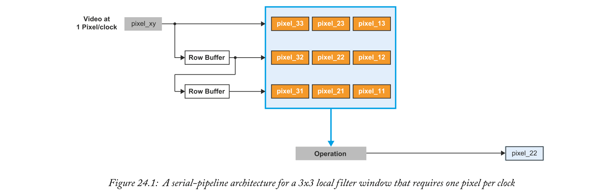
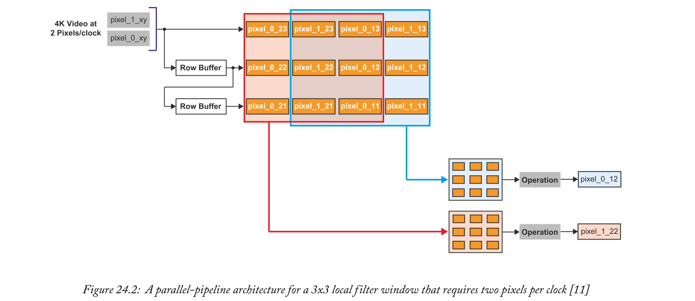
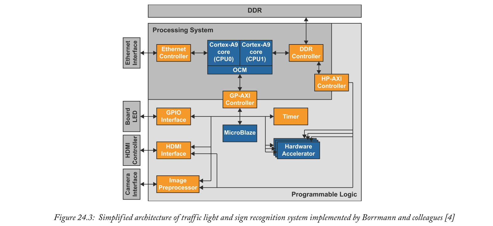
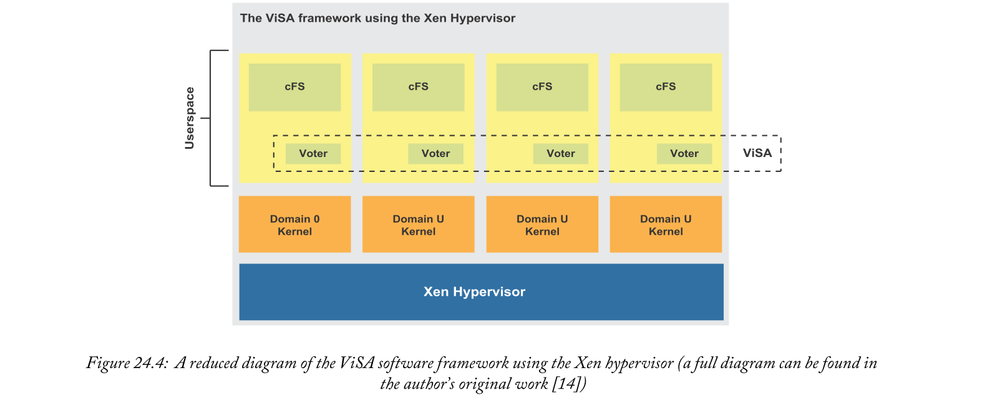
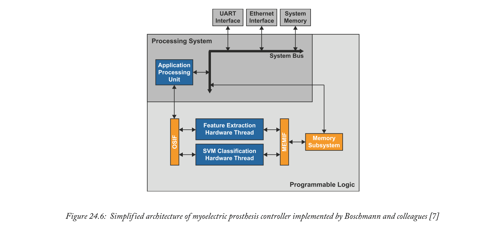

# Chapter 24 Academic Case Studies
Zynq MPSoC上提供的各种处理架构和接口使其成为许多嵌入式应用程序背后的处理器。然而，并不总是清楚如何在设备间划分应用程序，以及哪些处理元素最适合执行任务。有鉴于此，并考虑到Zynq SoC器件相对于Zynq MPSoC的相对成熟性，我们将在本章中探讨与这两种器件相关的大量学术案例研究。本章旨在为选择在Zynq设备上实现的应用程序提供灵感和实践见解，以及如何最好地利用可用的处理架构。

自2011年发布以来，Zynq SoC已被应用于无数不同的应用领域。试图在这里讨论所有这些领域是不切实际的，因此从突出的应用领域中选择了一些案例研究。希望这些案例研究中针对Zynq设备应用的一般原则，能够为您在设计自己的基于Zynq的应用和系统时提供有用的见解。

## 24.1  Embedded Computer Vision
计算机视觉应用和算法已经受到Zynq SoC的欢迎。这主要是由于器件的低功耗以及可利用的FPGA结构，提供了加速部分算法的机会。

应用于单个像素值的基于样本的操作(如卷积滤波器)非常适合在PL中实现。由于FPGAs的并行处理能力和支持深度处理流水线的能力，这些操作是合适的。相比之下，计算复杂的操作，如分类，本质上是连续的。因此，这些操作更适合在时钟速率较高的PS中实现。
_**Case 1:  Hardware  Acceleration  of  Feature  Detection  and  Description  Algorithms  on  Low-Power Embedded Platforms [1]**_

乌卢塞尔和同事[1]使用Zynq 7020设备来实现图像特征检测和描述算法，这些算法是许多计算机视觉应用的基础。将Zynq 7020上的这种实现的性能与基于嵌入式处理器的平台和嵌入式GPU加速平台上的实现进行了比较。用于中央处理器和图形处理器加速实现的平台是英伟达Jetson TK1开发套件，搭载英伟达Tegra K1系统芯片，在单个芯片上包含Arm Cortex-A15四核中央处理器和英伟达Kepler图形处理器。

CPU和GPU加速平台使用OpenCV库实现特征检测和描述算法[2]。同时，Zynq实现使用PL来执行特征检测和描述。此外，这两个操作在FPGA结构中是流水线式的。上游操作确定下游硬件何时关闭(不需要时)，以降低功耗。

仅对于特征检测，Zynq实现在执行时间和能耗方面都优于CPU和GPU加速实现。与CPU相比，Zynq系统的执行速度快了近四倍，消耗的能量不到[1]的十分之一。GPU加速的实现比CPU的实现稍好一点，执行时间大约是Zynq的两倍，消耗的能量不到四倍[1]。

当包括特征描述和检测时，与CPU和GPU加速的实现相比，Zynq系统的相对运行时性能和能耗进一步提高。根据所使用的特性描述算法，Zynq实现的执行时间比CPU实现的执行时间低大约15到16倍，并且使用的能量大约是[1]的43倍。同样，GPU加速比CPU好。GPU加速的执行时间仅比Zynq实现长2.5到4倍，消耗的能量是[1]的7到10倍。

Zynq系统的优势主要来自于在PL中**流水线化算法**。使用Zynq可以**减少内存访问**，方法是通过PL将图像数据传播到算法的每个阶段，而不是每次[1]都从内存中检索图像数据。此外，**通过使用PL内的不同资源来实现不同的阶段**，并且通过在PL [1]中的阶段之间传播数据，可以并行执行算法的多个阶段。

似乎奇怪的是，Zynq通过更大的并行性获得了优于GPU加速实现的性能优势，因为GPU以其高度并行的架构而闻名。然而，GPU提供的**并行性往往是在多个输入并行**的情况下**执行相同的指令**。本工作中研究的应用从与多输入**并行执行的多指令中**获得了更大的好处[1]，这更适合于Zynq的程序设计中包含的现场可编程门阵列。

_**Case 2: Real-Time Implementation of Contextual Image Processing Operations for 4K Video Stream in Zynq UltraScale+ MPSoC [11]**_

科瓦尔茨克及其同事展示了Zynq MPSoC将上下文图像处理算法应用于4K视频数据的能力，特别是每秒60帧的`3840 x 2160`像素分辨率。高清(高清)和全高清(FHD)等视频分辨率分别为`1280 x 720`像素和`1920 x 1080`像素，使用串行流水线架构。这些设计通常每个时钟周期处理一个像素，如图24.1中的局部滤波器所示。假设上述视频分辨率为60 fps，高清视频的像素时钟为74.25MHz，FHD视频的像素时钟为148.5MHz。在大多数现场可编程门阵列器件上，视频处理架构可以轻松满足这些时钟频率的时序限制。

4K分辨率，也称为超高清晰度(UHD)，大约需要600MHz像素时钟来实现60 fps的帧速率。即使在现代的现场可编程门阵列器件中，也很难设计出能够满足如此大的时序限制的架构。为了降低像素时钟并保持或提高UHD视频流的整体数据速率，通常需要每个时钟2或4个像素(ppc)。这允许架构以更高的并行度设计，并使用更低的像素时钟。这些被称为并行流水线架构，是4K FPGA视频处理的一个新兴且有趣的研究领域。第570页的图24.2显示了一个使用2 ppc的并行流水线本地滤波器的例子。

科瓦尔茨克和他的同事解决了设计一个以60 fps的速度将图像操作应用于UHD分辨率的现场可编程门阵列架构的问题。这项工作详细说明并讨论了平均滤波器、高斯滤波器、Sobel和Canny边缘检测算子、中值滤波器和形态学侵蚀和扩张[13]的视频处理架构。XCZU9EG-2FFVB1156 Zynq MPSoC设备的主机ZCU102开发板被选择来实现4K视频的基于上下文的图像处理架构。该开发板非常适合，因为它有两个高清多媒体接口(HDMI)端口连接到Zynq MPSoC设备的PL。HDMI端口允许4K视频数据传播到在现场可编程门阵列逻辑结构中实现的硬件加速器，然后将视频输出到监视器。

4K视频处理架构是使用Verilog硬件描述语言和Vivado HLS[18]开发。科瓦尔茨克及其同事使用Verilog HDL实现了上述每个图像处理操作，从而实现了高效的现场可编程门阵列资源消耗。Vivado HLS的实现需要定制的HLS功能来实现4 ppc接口。这是使用宽度为8位的四通道接口读写数据实现的。在实现Sobel和中值滤波后，Sobel架构比相应的Verilog HDL实现消耗更多的FPGA资源，中值滤波器消耗更少。

作者使用Vivado xPower [12]工具来估算Zynq MPSoC在使用2 ppc和4 ppc架构时的功耗。这项研究是在Sobel和中值滤波器模块上进行的。2 ppc Sobel架构估计仅PL就消耗1.269瓦。等效的4 ppc架构估计消耗1.211瓦。2 ppc中间架构消耗0.641瓦，4 ppc架构消耗0.535瓦

2 ppc和4 ppc架构之间的功耗差异源于FPGA资源消耗和像素时钟速度。通常，每个时钟的像素数量越多，相关架构所需的像素时钟就越低。随着现场可编程门阵列架构在更多像素上并行运行，资源消耗也会增加。相反，减少每个时钟的像素将导致更高的像素时钟和降低的资源消耗。所有这些因素都直接影响功耗。可以看出，与2 ppc等效功耗相比，Sobel模块使用4 ppc可降低约4.79%的动态功耗。同样，与2 ppc架构相比，中值模块使用4 ppc可将动态功耗降低约16.54%。

总之，使用**并行流水线视频处理架构可以降低每个架构所需的动态功耗**。尽管使用了更多的现场可编程门阵列资源来实现4 ppc视频处理架构，但**较低的像素时钟速率导致较低的动态功耗**。ZCU102开发板和Vivado工具被证明在应用和分析4K视频架构方面非常有用。

### 24.1.1  Advanced Driver Assistance Systems
嵌入式计算机视觉算法的一个应用领域是ADAS，近年来增长尤为强劲。Zynq在这一领域的兴趣和受欢迎程度，值得在本章中特别提及。

基于视觉的ADAS中摄像机技术的改进使得使用更传统的硬件架构,如微处理器[3]–[5]实时处理采集的图像数据变得越来越困难。这激发了人们对开发专门为ADAS系统执行实时计算机视觉算法而设计的硬件的兴趣。此外，结合ADAS应用[3]–[5的低功耗和小尺寸要求，已经提出了基于可编程门阵列和专用集成电路(ASIC)的解决方案。

与专用集成电路系统相比，汽车行业的竞争力使基于FPGA的系统具有优势，因为它们往往前期成本低得多，上市时间短，并且可以在其生命周期内轻松更新[5]，[6]。紧密集成的PS和PL的结合为基于Zynq的系统提供了进一步的优势。ADAS的计算机视觉组件并不倾向于与车辆内的其他系统隔离。为了制造一个有效的系统，计算机视觉组件必须与其他系统组件集成。虽然这可以仅通过PL来实现，但是这是一项通常可以更简单地使用微处理器来执行的任务，例如Zynq设备[5]的PS中提供的那些微处理器。

_**Case 3: Traff ic Light and Sign Recognition for Advanced Driver Assistance [3], [4]**_

Borrmann和他的同事[3]，[4]使用Zynq 7020设备设计了一个用于自动驾驶辅助系统的交通灯和标志识别系统。他们发现，仅使用嵌入式处理器上的软件来满足系统的实时处理要求是不可能的，而嵌入式处理器也满足了他们的尺寸、功率和成本限制。因此，有必要为他们的应用[3]，[4]实现硬件加速器。选择Zynq设备是因为它是一种单芯片解决方案，提供嵌入式中央处理器，与现场可编程门阵列结构紧密集成，用于实现硬件加速器。此外，它还提供CAN、Gigabit Ethernet和DRAM控制器，用于将它们的设计与其他系统集成在一起[3]。Zynq 7020设备是基于成本考虑而特别选择的，[3]。

交通灯和交通标志识别算法是使用类似的处理流水线实现的。这包括多尺度分割阶段，随后是特征提取和分类阶段以及最终目标跟踪阶段。目标跟踪阶段的输出也被反馈到算法下一次迭代的分割阶段，以提高其鲁棒性[3]，[4]。

在它们的实现中，Arm Cortex-A9中央处理器的一个核心用于实现交通灯识别，而另一个核心实现了交通标志识别[4]。对于交通灯识别，在分类阶段使用硬件加速器进行多尺度分割和特征向量比较，[3]，[4]。对于交通标志识别，硬件加速器仅用于分类阶段[4]中的特征向量比较。为了提高运行时性能，实现了四个用于特征向量比较的硬件加速器实例，并在PL中使用Xilinx MicroBlaze [10]软核处理器实现了策略控制器。MicroBlaze处理器协调对共享硬件加速器实例的访问，并处理硬件和软件之间的同步[4]。

当微处理器的任一核心完成其算法中某一阶段的执行时，它在片上存储器(OCM)中配置一个中断请求存储器结构，该结构具有代表算法状态的状态标志和参数，并向微处理器中的MicroBlaze策略控制器声明一个中断。策略控制器通过PS和PL之间的通用AXI(GP-AXI)接口访问OCM的中断请求存储器结构。它使用在PL中实现的专用计时器来测量算法的该阶段以及整个[4]算法的执行时间。策略控制器使用所测量的执行时间来仲裁对在交通灯和交通标示识别算法之间共享的PL中的硬件加速器的访问请求。

硬件加速器由策略控制器使用GP-AXI总线进行配置和控制，而图像数据使用高性能AXI(HP-AXI)接口[4]在加速器和DDR存储器之间传输。由于OCM被大量用于在PS中执行的算法和PL中的硬件之间的同步，所以它被标记为不可缓存的[4]。这样做是为了保持策略控制器和处理器内核访问的存储器结构的一致性。

除了用于执行交通灯和标志识别算法的系统部分之外，Borrmann及其同事还实现了将系统与外部设备接口的组件。这包括一个接口，用于连接汽车应用中常用的摄像机类型。作为输入图像数据的替代来源，该系统还被设计为通过以太网连接接收预先录制的视频数据。Zynq处理器中的千兆以太网控制器用于此目的，并由处理器[4]的一个核心控制。

为了演示系统的功能，在PL中实现了一个HDMI接口。这使用HP-AXI总线从硬盘驱动器存储器获取视频数据，并驱动Zynq设备[4]外部的高清多媒体接口控制器。在他们的系统中实现的最后一个附加组件是通用输入/输出(GPIO)接口，用于驱动Zynq设备外部的发光二极管，并使用GP-AXI总线[4]进行控制。系统的简化架构如图24.3所示。

Borrmann和他的同事证明了他们的系统能够满足汽车应用的实时处理要求，而这些要求仅仅使用软件是无法满足的，[3]，[4]。他们显示，当使用预先录制的视频或车载摄像机的视频时，情况就是这样。此外，他们还确定，他们的系统能够满足实时处理要求，同时符合功耗限制(功耗为5.07–5.14瓦，具体取决于输入视频源和内容[4])。

## 24.2  Spaceflight Systems
传统上，航天系统需要抗辐射组件和处理器来承受恶劣的空间环境和单事件效应的影响。由于高能粒子影响电子元件的运行，SEEs影响计算设备。如今有少量电子元件经过辐射加固，能够在卫星和航天器上持续运行。由于在空间应用中对提高计算性能的需求很高，像Zynq MPSoC这样的现成组件在能效、成本和性能方面都得到了研究。

许多现成的组件容易受到恶劣空间环境的影响，并将受到SEEs的影响。要解决的问题是使用现成的组件(如Zynq MPSoC)为空间应用设计和开发可靠的计算系统。

_**Case 4: Towards Resilient Spaceflight Systems with Virtualization [14]**_

萨沃加尔和乔治提出了虚拟化空间应用(ViSA)软件框架来抵御SEEs的影响。该框架使用Xen hypervisor[17]进行虚拟化支持。该研究团队在ZCU102开发板和UltraZed-EG SoM上开发和测试了他们的系统。ViSA框架利用Zynq MPSoC的Cortex-A53应用处理器的虚拟化能力，在用户空间创建投票系统。这在图24.4所示的软件系统中有所说明。

在每个虚拟CPU(VCPU)的用户空间中，是NASA core Flight Software (cFS)的一个实例，该软件由一系列用于飞行任务的脚本、实用程序和应用程序组成。还包括ViSA软件的一个实例。ViSA是一个直观的框架，在整个软件系统(以及更多[14])中部署冗余机制。向每个Userspace cFS实例广播一个请求，并将该请求的结果(投票)返回给该Userspace本地的ViSA实例。所有用户空间cFS实例的投票决定了所请求任务的结果。虚拟投票系统为在单个芯片上执行任务和处理应用程序创建了一个冗余网络。

萨沃加尔和乔治的主要目的是研究一种用于空间应用的容错技术。研究小组进行了几项实验来测试ViSA框架，详见[14]。他们的发现得出结论，ViSA能够掩盖错误，并确定系统运行期间数据损坏导致的不可靠结果。

## 24.3  Machine Learning
机器学习是近年来再度流行的一个领域。这种兴趣已经扩展到在嵌入式平台上实现机器学习算法来创建智能系统。正是在这些应用中，Zynq显示出自己非常适合。

机器学习算法通常计算量很大。嵌入式机器学习平台需要能够高效地执行这些计算，以满足系统的处理和功耗要求。Zynq的PL非常适合这一目的，在这种情况下，针对算法定制的硬件可以提供在其他通用处理架构上无法实现的每瓦计算性能。

_**Case 5: A Dynamically Reconf igurable High Density Myoelectric Prosthesis Controller [7]**_

博施曼和他的同事们实施了一个系统，基于截肢者残肢肌肉运动产生的电信号，提供对多运动假手的自主控制。[7]。他们使用支持向量机(SVM)形式的机器学习，使用Zynq 7020设备[7]将检测到的信号分类为假肢的运动。

肌肉运动产生的电信号是用192个高密度肌电图传感器阵列检测的，这些传感器排列成8行24列，[7]。对于这种应用，需要实时处理HD EMG信号，以产生假体的控制信号。这些控制信号应该在相应的用户产生输入信号[7]后不到125毫秒产生。需要一种嵌入式解决方案，因为短延迟阻止了使用外部设备，数据可以传输到该外部设备，处理和控制信号可以传输回假体[7]。该小组发现，目前用于假肢的嵌入式微处理器无法满足这一应用的实时处理要求。因此，选择了Zynq设备来加速使用PL [7]的控制算法的计算密集型部分。此外，该系统最终打算安装在假肢内，并由电池供电。FPGA器件的适度功耗和Zynq器件的小物理尺寸使其适合这种应用[7]。

在[7]中介绍的工作中，博施曼和他的同事们使用了一个独立的系统来采集HD EMG信号。这些信号通过TCP/IP连接传输到Zynq设备。假体的控制信号在Zynq设备上产生，并传输到另一个系统，使用蓝牙设备[7]传输到假体。

在Zynq上实现的系统由多个处理阶段组成。系统的主要部分有数据采集、特征提取和分类阶段[7]。数据采集阶段从传输控制协议接口接收HD EMG信号数据，并对特征提取阶段进行预处理。从数据中提取特征后，将它们输入到分类阶段，该阶段使用线性SVM将输入特征分类为六个手部运动类别之一。这些类别决定了控制器[7]的适当输出。数据采集阶段使用运行在PS上的软件来实现。特征提取和分类阶段是使用PL作为硬件实现的，因为它们是算法[7]中计算量最大的部分。

还实施了算法来训练用于分类的SVM。这些算法是在软件中实现的，因为SVM训练被认为时间不太紧迫，[7]。

博施曼和他的同事开发的系统使用了一个名为ReconOS[7]–[9]的免费开源运行时环境来帮助硬件和软件部分之间的通信和同步。这种运行时环境扩展了标准软件多线程范例，也包括在硬件中执行的线程。ReconOS的编程模型将应用程序划分为单独的线程，**每个线程可以用软件或硬件实现**。每个线程都使用一个标准化的接口，从而使线程的软件或硬件实现对系统的其余部分透明[8]。将这一概念进一步扩展，无论线程是在软件还是硬件中实现的，ReconOS运行时环境都可以使用主机操作系统的标准多线程功能来促进线程间通信和同步，[7]，[8]。这种方法的一个**主要优点是线程可以很容易地在硬件和软件之间移动**，以探索可用系统配置的范围[8]。

在这种情况下，博施曼和他的同事们使用了位于PS's APU [7]上的Linux操作系统之上的ReconOS运行时环境。应用程序中的每个硬件线程，使用ReconOS运行时环境，都有一个类似的结构，使它能够启动和响应对主机操作系统内核的系统调用。图24.5显示了这种结构。

硬件线程操作中的一个关键组件是操作系统同步有限状态机(OSFSM)。OSFSM通过启动对OS内核的系统调用和控制进出硬件线程[8]的数据流来控制硬件线程的操作。为了与其他线程同步，OSFSM通过操作系统接口(OSIF)和一个运行在操作系统辅助处理器上的轻量级软件线程(称为委托线程)启动和响应来自操作系统内核的系统调用。ReconOS运行时环境为每个硬件线程创建一个委托线程。当OSFSM请求时，委托线程代表硬件线程对OS内核进行系统调用，并通过OSIF [8]将响应传回OSFSM。硬件线程消耗和产生的数据使用Block RAM资源在本地缓冲，如图24.5所示。这些本地缓冲区和系统内存之间的数据流也由OSFSM控制，以增强线程间共享的系统内存的一致性。进出每个硬件线程的数据流通过存储器接口(MEMIF)执行。MEMIF通过位于PL中的ReconOS内存子系统提供对系统内存的访问，如图24.6所示。ReconOS内存子系统用于仲裁来自硬件线程的系统内存请求，并通过提供MMU [7]，[8]支持主机操作系统虚拟内存寻址。

博希曼和他的同事在Zynq设备[7]的PL中将特征提取和SVM分类操作作为独立的硬件线程来实现，如图24.6所示。因为我们在这一部分主要关注机器学习，所以我们将集中讨论SVM分类器的实现。SVM分类器硬件线程中的特定逻辑在从HD EMG图信号中提取的输入特征向量和SVM训练矩阵[7]之间执行矩阵乘法。使用Block RAM资源将输入特征向量作为单精度浮点值本地缓冲到硬件线程，矩阵乘法产生的向量也是如此。Block RAM资源不足，无法将整个训练矩阵本地存储到硬件线程。在任何时候，只有矩阵中用于乘法的那一行被保存在本地存储器中。训练矩阵值存储为16位定点值，每个Block RAM word[7]存储两个值。选择用于表示输入特征向量、输出向量和训练矩阵的数据类型是为了保持最准确的分类结果，同时也减少了PL资源的使用和计算时间[7]。

博施曼及其同事设计的系统采用了一种创新的方法来处理高噪声HD EMG信号的分类，同时将系统延迟降至最低。在有噪声的情况下，对高清晰肌电信号进行准确分类是[7]的一大挑战。通过使用更复杂的特征，可以提高用SVM实现的噪声信号分类的鲁棒性。然而，这增加了计算分类所需的时间。它还增加了分类硬件线程使用的PL资源，以适应更大的特征向量和训练矩阵[7]。博施曼及其同事提出的解决方案是，**基于在高清晰肌电信号中检测到的噪声，用使用最合适的特征复杂度的硬件线程动态地重新配置PL**。在处理器中定期执行软件线程，以估计输入HD EMG信号中存在多少噪声。基于分类精度和处理时间的平衡，该估计用于索引查找表，以找到要使用的最合适的特征复杂性[7]。

五个预编译比特流可用于配置PL，每个比特流都具有使用不同特征向量复杂性的硬件线程实现。通过估计HD EMG信号上的噪声而确定的最合适的比特流被用于重新配置PL，如果它还没有用该比特流配置的话[7]。动态重新配置方案引入了性能开销。用于估计HD EMG信号噪声的软件线程大约需要一秒钟来执行。PL重新配置花费了大约半秒钟[7]。然而，与使用最高特征向量复杂度的静态系统相比，在具有不同程度噪声的测试数据上，使用动态重新配置的系统能够实现类似的分类精度，并提供更低的平均控制器延迟[7]。

与他们的系统在Zynq设备上运行的纯软件版本相比，由Boschmann及其同事提出的硬件加速系统能够在大约一半的时间内完成信号分类[7]。这种性能改进对于该应用的实时要求至关重要，即在产生输入信号的用户和产生适当控制信号的系统之间的延迟不超过125毫秒。纯软件实现无法满足这些要求，控制器延迟约为135–165毫秒，具体取决于特征向量的复杂性。硬件加速实现的控制器延迟小于120毫秒，与特征向量的复杂性无关[7]。

## 24.4  Chapter Summary
本章介绍了Zynq-7000 SoC器件的一些使用领域。我们已经专门讨论了嵌入式计算机视觉和机器学习的应用。为这些区域创建的设计细节已经特别参考了系统在PS和PL之间的划分，以及用于协调系统这些部分的方案。虽然本章重点介绍了Zynq-7000器件，但我们相信，所介绍的一般原理也可以应用于针对Zynq MPSoC器件的设计。