# A Beginner’s Guide on Interrupt Latency - and Interrupt Latency of the Arm Cortex-M processors

- https://community.arm.com/developer/ip-products/processors/b/processors-ip-blog/posts/beginner-guide-on-interrupt-latency-and-interrupt-latency-of-the-arm-cortex-m-processors

## Introduction
所有经验丰富的嵌入式系统设计人员都知道中断延迟是微控制器的关键特性之一，并且知道这对于许多具有实时需求的应用程序来说至关重要。然而，各种微控制器文献中对中断延迟的描述往往过于简单化了“中断延迟”细节中包含的内容。

这个博客将介绍中断延迟的基本知识，以及用户在选择具有低中断延迟要求的微控制器时需要注意的事项。

## The Definition of Interrupt Latency
术语**中断延迟**是指处理器响应中断请求所需的时钟周期数，这通常是基于中断请求**断言到预期中断处理程序第一条指令的周期之间的时钟周期数**的度量（图1）。

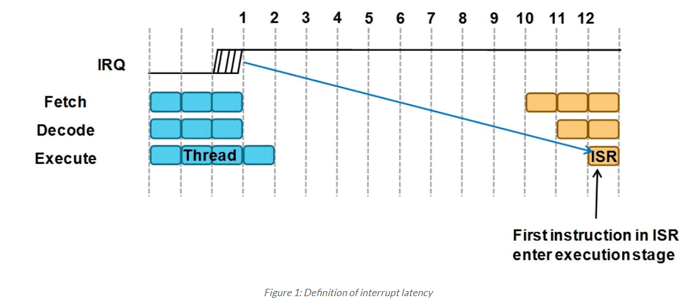

在许多情况下，当系统的时钟频率已知时，中断延迟也可以表示为时间延迟，例如以微秒为单位。

在许多处理器中，确切的**中断延迟取决于中断发生时处理器正在执行的操作**。例如，在许多处理器体系结构中，处理器仅在当前执行**指令完成**时才开始响应中断请求，这会增加一些额外的时钟周期。因此，**中断延迟值可以包含最佳情况和最差情况值**。这种变化会导致中断响应的抖动，在某些应用中可能会出现问题，如音频处理（引入信号失真）和电机控制（可能导致谐波或振动）。

理想情况下，处理器应具有以下特征：
- 中断延迟应较低。
- 中断响应具有确定性，且抖动较低。
- 中断处理程序尽可能短的执行时间
- 如果没有其他中断需要服务，可以配置在中断服务程序的最后一条指令进入休眠模式。（用于中断驱动应用程序）

中断延迟本身并不是完整的故事。微控制器营销传单强调极低的中断延迟并不一定意味着微控制器可以满足产品的实时要求。一个真正的嵌入式系统可能有许多中断源，通常每个中断源都有一个相关的优先级。许多处理器体系结构支持中断嵌套，这意味着在执行低优先级中断服务例程（ISR）期间，高优先级服务可以先发制人，低优先级ISR被挂起，并在高优先级ISR完成后恢复（图2）。

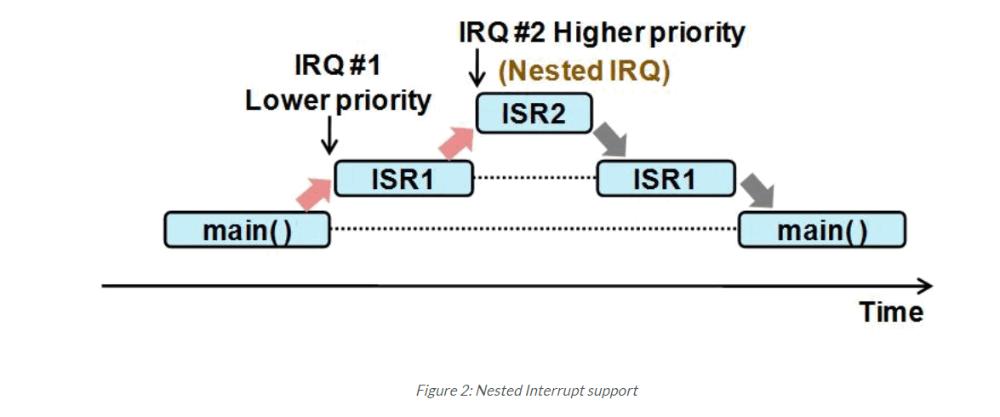

许多嵌入式系统需要嵌套的中断处理，当高优先级运行时，低优先级中断请求的服务将被延迟。因此，对于低优先级中断，中断延迟通常要比预期的严重得多。

嵌套的中断处理要求意味着系统中的中断控制器需要在中断管理方面具有灵活性，**理想情况下提供所有必要的中断优先级和屏蔽功能**。在某些情况下，这可以在软件中处理，但这会增加中断处理的软件开销（和代码大小），并增加服务中断的有效延迟。稍后将对此进行更详细的讨论。

## Cortex-M processor family and NVIC
Cortex-M处理器系列中的嵌套向量中断控制器（NVIC）是具有非常灵活的中断优先级管理的中断控制器示例。它支持可编程优先级、自动嵌套中断支持以及对多个中断屏蔽的支持，同时编程人员仍然非常容易使用。

对于Cortex-M0和Cortex-M0+处理器，NVIC设计支持多达32个中断输入加上许多内置系统异常（图3）。对于每个中断输入，有四个可编程优先级（图4）。对于Cortex-M3和Cortex-M4处理器，NVIC支持多达240个中断输入，8到256个可编程优先级（也如图4所示）。请记住，在实践中，中断输入的数量和优先级的数量可能由应用程序需求驱动，并由硅设计人员根据芯片设计的需要定义。

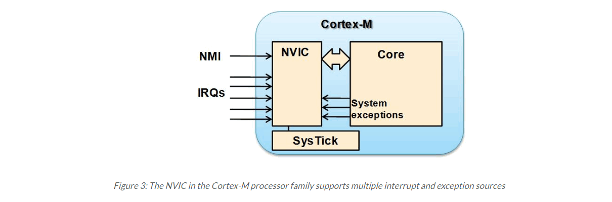

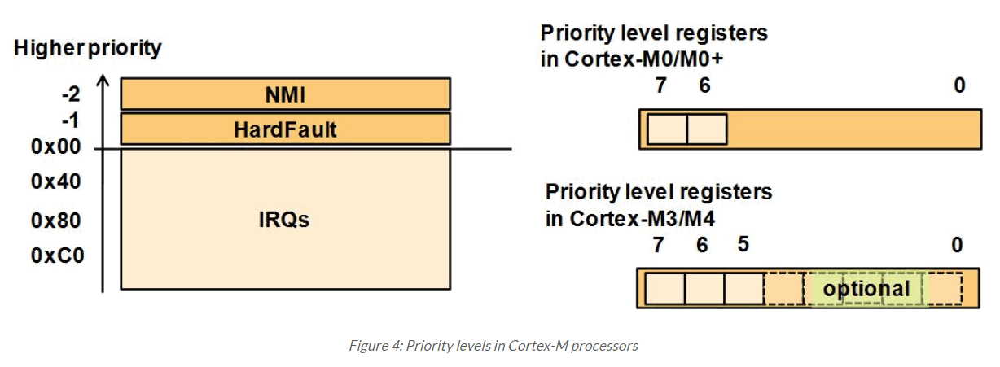

除了来自外设的中断请求外，NVIC设计还支持内部异常，例如，来自24位定时器调用SysTick的异常输入，通常由操作系统使用。此外，还存在支持操作系统操作的额外系统异常和不可屏蔽中断（NMI）输入。NMI和硬故障（系统例外之一）具有固定的优先级。

## Interrupt Latency on the Cortex-M processor family
所有Cortex-M处理器的中断延迟都非常低。延迟计数列在表1中，是从中断请求断言到中断处理程序的第一条指令准备就绪的周期的确切周期数，在具有零等待状态内存系统的系统中：

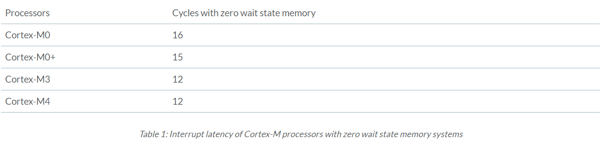

表1中列出的中断延迟作出了一些简单的**假设**：
- 内存系统具有零等待状态（且资源未被其他总线主机使用）
- 芯片的系统级设计不会在中断源和处理器之间的中断信号连接中增加延迟
- 中断服务不会被另一个当前运行的异常/中断服务阻塞。
- Cortex-M4（启用了FPU）启用延迟堆叠功能（这是默认设置）
- 当前执行的指令不执行未对齐的传输/位带传输（可能需要1个额外的传输周期）。

为了使Cortex-M设备易于使用和编程，并支持嵌套异常或中断的自动处理，中断响应序列包括许多堆栈推送操作。这使得所有中断处理程序都可以作为普通的C子例程写入，并使ISR能够立即开始实际工作，而无需花费时间保存当前上下文。

Cortex-M3/M4处理器的堆栈操作如图5所示。该图显示寄存器r0到r3和r12在12个时钟周期中断延迟内被推到堆栈上。如果ISR内部的处理只需要五个或更少的寄存器，则不需要额外的堆栈。

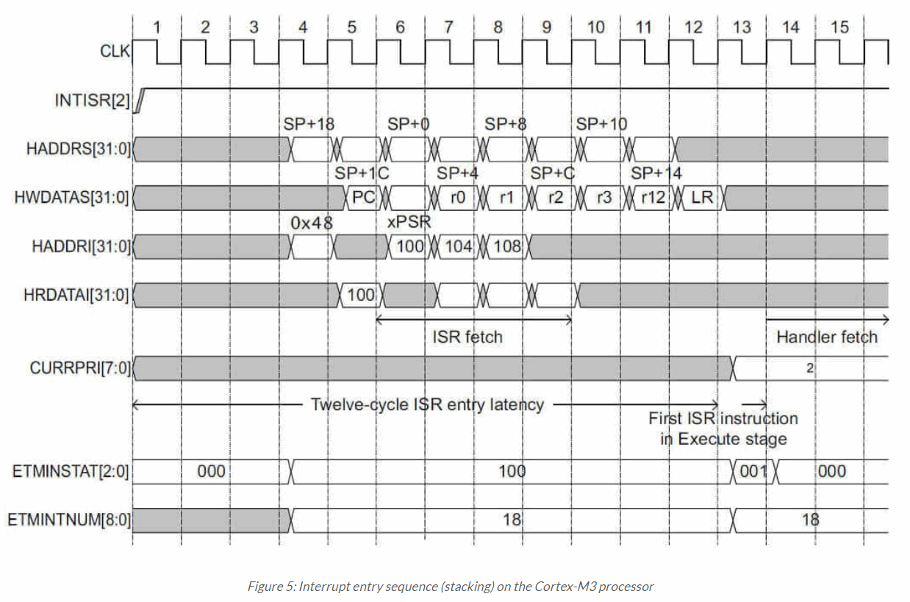

## The Myth of Interrupt Latency
所以，如果我选择一个中断延迟最小的处理器，那肯定是好的，对吧？不幸的是，事情并没有那么简单。中断延迟数字通常只提供中断处理性能的一个方面，但不能给出完整的画面：
> 中断延迟数据不包括任何软件开销。

在许多处理器体系结构中，中断处理程序需要额外的软件包装代码来：
- handle the stacking of registers, and/or
- switch the register bank to a different one, and/or
- check which interrupt required servicing (shared interrupt pin), and/or
- locate or branch to the starting of interrupt handlers (not vectored),
- unstack saved registers at the end of the ISR, etc.

所有这些都可能导致中断处理过程中的额外的、通常是显著的延迟。例如，通常在目前仍广泛使用的8051中，有多个寄存器组，因此可以避免编写软件通过切换寄存器组将寄存器推送到堆栈。您还需要一个分支/跳转指令来分支到ISR的开头：

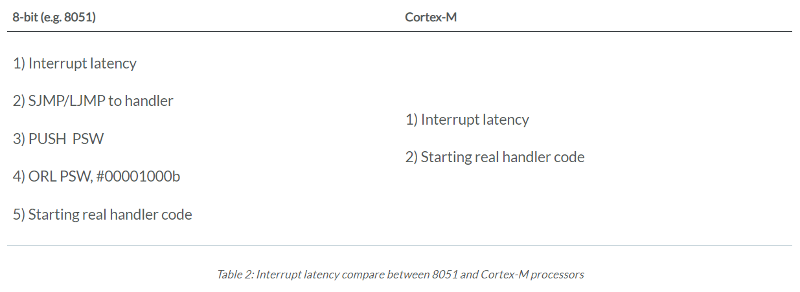

因此，虽然8051微控制器在手册上的中断延迟可能较低，但当包括软件开销时，总的中断延迟要比基于Cortex-M的微控制器差得多。

### Interrupt Latency figure does not tell you how long it takes to carry out interrupt handling task
与任何程序代码一样，ISR需要时间来执行。处理器的性能越快，中断请求的服务就越快，系统在睡眠模式下停留的时间越长，从而降低了功耗。当考虑到从断言中断请求到中断处理实际完成的时间，Cortex-M处理器可以比其他微控制器更好，因为它们具有更高的性能特征（图6）。

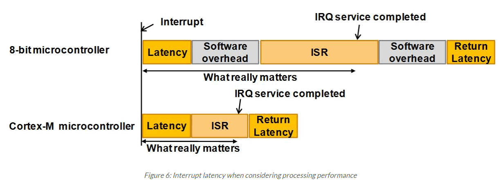

### Interrupt Latency figure does not tell you the throughput / capacity of interrupt processing
相对于ISR执行的时钟周期总数，系统的最大吞吐量/容量在许多重负载系统中也非常重要。**每秒最大请求数取决于系统时钟速度以及处理中断所需的时钟周期数**。

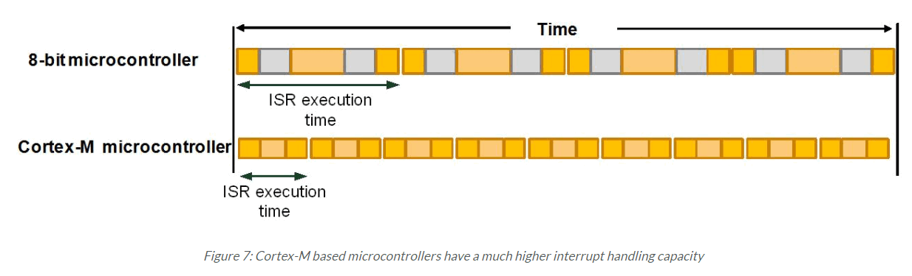

在传统的8位/16位系统中，由于性能较低，ISR的运行时间比基于Cortex-M的微控制器要长得多。当与许多基于Cortex-M的微控制器的最高时钟速度相结合时，最大的中断处理能力可以远远高于其他微控制器产品。

### Interrupt Latency figure does not tell you about the jitter of interrupt response time
中断响应时间的抖动是指中断延迟周期的变化（或值范围）。在许多系统中，中断延迟周期取决于中断发生时CPU正在做什么。例如，在8051这样的体系结构中，如果处理器正在执行一个多周期指令，则中断输入序列在指令完成之前无法启动，这可能是几个周期之后的事情。这会导致中断延迟周期数的变化，通常称为**抖动**。

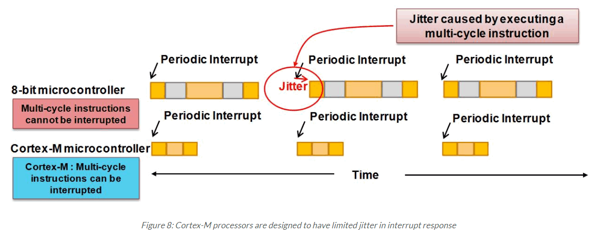

在许多应用中，抖动并不重要。然而，在某些应用中，如音频或电机控制，抖动会导致音频信号失真，或由于这种不必要的抖动而导致电机振动/噪音。

在Cortex-M处理器中，如果在中断到达时执行多周期指令，在大多数情况下，**该指令被放弃然后在ISR完成时重新启动**。如果Cortex-M3/Cortex-M4处理器在多重加载/存储（内存访问）指令期间收到中断请求，多重传输的当前状态将自动存储为PSR（程序状态寄存器）的一部分，当ISR完成时，多重传输可以使用保存的通知从停止的位置恢复。在PSR中。该机制提供高性能处理，同时在中断响应时间内保持低抖动。

## So what should I look for?
多年来，来自不同微控制器供应商的营销文献中有关于中断延迟的不完整或误导性信息。例如，有时使用机器周期（而不是时钟周期）来引用中断延迟，在某些情况下，引用中断延迟，但不包括软件开销。充分调查细节以了解总的中断延迟工作和时间是很重要的。

## What else could make a difference?
Cortex-M处理器在中断处理期间加入了一些额外的优化，以进一步降低开销：

### Tail chaining
当一个ISR完成时，如果有另一个ISR等待服务，处理器将通过跳过一些通常需要的unstacking and stacking操作，尽快切换到另一个ISR（图9）。这被称为尾链，在Cortex-M3和Cortex-M4处理器中，这可能只有六个周期。通过避免不必要的内存访问，这也使得处理器更加节能。

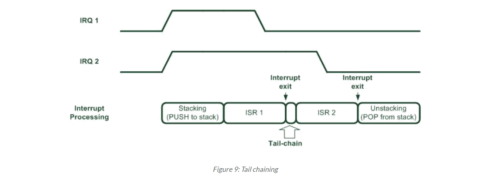

### Late Arrival
如果高优先级中断请求在低优先级中断的stacking阶段到达，高优先级中断将始终首先得到服务。这样可以确保高优先级中断得到快速服务，并避免在嵌套中断处理过程中进行另一级的叠加操作。此外，这将节省功耗（由于对内存的访问更少）和堆栈空间。

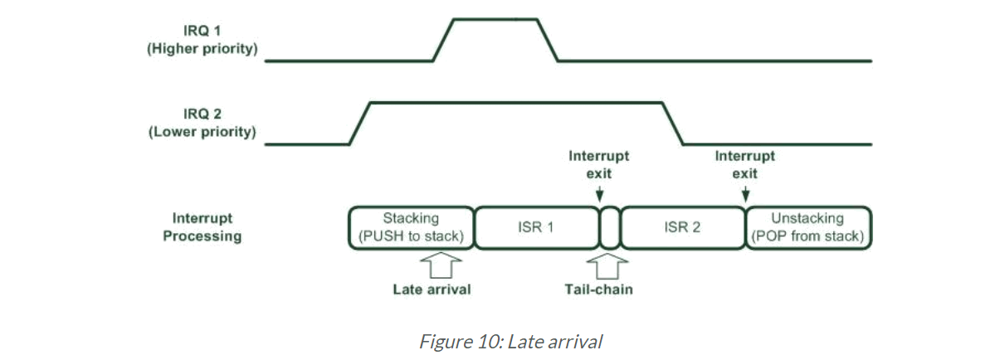

### Pop pre-emption
如果一个中断请求刚好在另一个ISR退出时到达，并且正在进行unstacking过程，则**停止unstacking序列**，并尽快输入新中断的ISR（图11）。同样，这避免了不必要的unstacking and stacking，并减少了功耗和延迟。

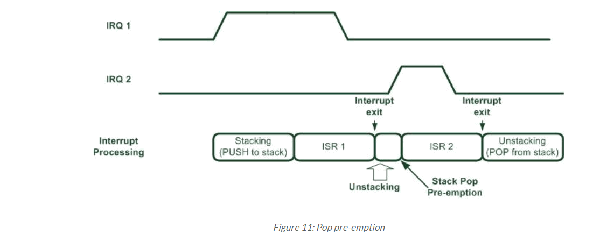

### Do banked registers make a difference?
在某些体系结构中，存在多个寄存器bank，ISR可以使用不同的（有时是专用的）寄存器组，以避免stacking and un-stacking的开销。例如，8051提供了四个寄存器bank。在最初的8051中，banked寄存器的实现是基于内存的，但是更新的加速8051设计现在使用寄存器硬件。

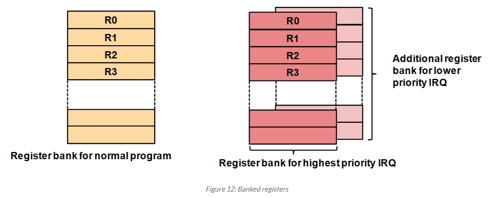

在有限的情况下，banked寄存器可以减少上下文保存和恢复的开销。然而，这通常会导致更大的硅面积、更高的功耗，并且不可扩展以支持多种层次的灵活嵌套中断系统需求。在某些情况下，如8051，需要额外的软件开销来切换寄存器bank。ARM Cortex-M处理器不使用banked寄存器，在比较中断驱动系统与其他微控制器处理器体系结构时，这将提供更好的能源效率和具有竞争力的性能。

## Extra functionality with Cortex-M processors
### Debug Support
Cortex-M处理器支持全面的调试支持功能。Cortex-M3和Cortex-M4处理器还提供异常跟踪支持，允许在调试器中捕获和检查异常/中断历史和时间信息。

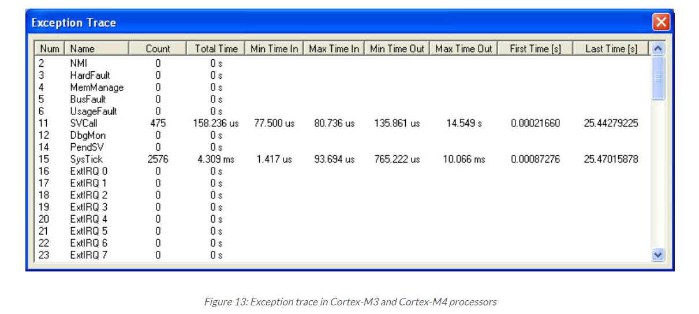

跟踪信息可以通过一个称为串行线查看器（SWV）的单针跟踪接口或多位跟踪端口接口来捕获，该接口具有更高的跟踪带宽，可以支持ETM（嵌入式跟踪宏单元）的完整指令跟踪。跟踪信息对于调试非常有用。

### Zero jitter support on Cortex-M0/Cortex-M0+ processors
Cortex-M处理器的中断延迟会受到片上总线系统等待状态的影响，这会导致轻微的抖动。Cortex-M0和Cortex-M0+处理器有一个可选功能，强制中断响应时间零抖动。这是通过强制中断延迟为最坏情况（即中断延迟+等待状态效果）来完成的。此功能通常不用于微控制器（只是尽可能快速地处理中断请求），但用于一些特殊的SOC设计中，这些设计要求中断响应中零抖动。

### Sleep-on-Exit feature
“退出时休眠”是一种可编程功能，启用后，如果不需要服务其他中断请求，则在退出ISR时将处理器置于休眠模式。这对于任何中断驱动的应用程序都非常有用，并且可以节省电力，因为它避免了线程（例如“main()”代码）状态下的额外时钟周期，并**减少了中断进入和退出通常需要的stacking and un-stacking**。它还有一个副作用（和好处）是中断响应时间更短，因为不需要进行stacking。例如，在Cortex-M0上，退出时从睡眠中醒来**只有11个周期**（正常需要16个周期）。

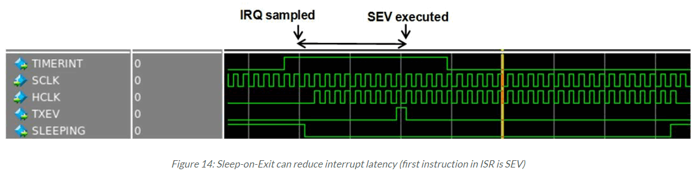

注意，这种技术对于中断驱动的应用程序特别有用。

### Wait-for-Event (WFE) sleep
有两条进入睡眠模式的指令：WFI（等待中断）和WFE（等待事件）。WFE有条件地进入睡眠模式，可以通过以下事件唤醒：
- Interrupts
- Hardware event (via an input pin called RXEV)
- Debug events

WFE睡眠可以在**不调用中断/异常序列**的情况下快速唤醒。这可以将唤醒时间缩短到几个周期。例如，在Cortex-M0处理器中，从睡眠模式唤醒只需要四个周期：

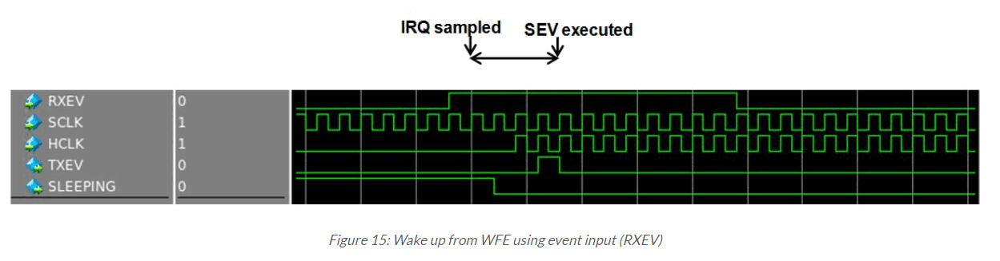

在此操作中，处理器将在WFE指令之后从停止的位置恢复。不使用RXEV输入，替代可以使用具有不同功能的外围中断（也称为SEV-ON-PEND（可编程功能））来生成事件并唤醒处理器，而无需执行ISR。

请再次注意，**这种技术对于中断/事件驱动的应用程序最有用**，并且只有当知道只有一个中断/事件源在等待时才有用。如果有其他中断源，线程中的程序代码仍必须检查从睡眠模式唤醒的原因。

## Conclusions
Cortex-M处理器中的NVIC提供非常灵活的中断管理和许多有用的功能。NVIC技术优势的一个关键方面是低中断延迟。当这与Cortex-M处理器的高性能结合在一起时，所有中断请求都可以快速处理，从而提供高中断处理吞吐量。Cortex-M处理器上的中断延迟是确定的，没有任何隐藏的软件开销，这在许多其他架构中都可以观察到。

Cortex-M处理器设计为易于使用。例如，NVIC程序员的模型非常简单，中断处理程序可以作为普通的C函数进行编程。同时，它非常强大。所有中断都具有可编程的中断优先级，并自动支持嵌套中断。此外，NVIC支持矢量中断操作，因此无需使用软件来确定要服务的中断，而其他优化（如尾链）有助于减少中断处理开销，同时使处理器更节能。